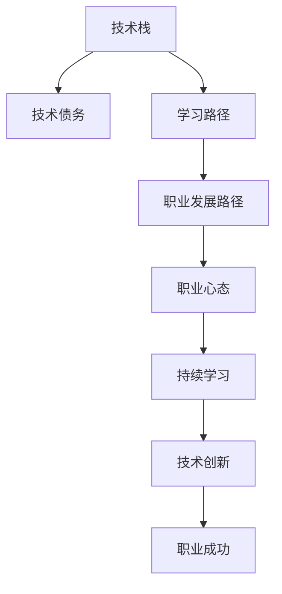

                 

# 程序员的职业生涯规划：长跑与长跑

程序员的职业生涯，犹如一场马拉松，需要坚持不懈、细致入微、反复调整，才能最终取得理想成绩。在这场漫长而艰难的旅程中，如何合理规划、科学训练、不断优化，是每个程序员都需要认真思考的问题。本文将从职业生涯规划、核心算法、工具资源、未来趋势等多个方面，深入探讨程序员的“长跑与长跑”，希望能为各位同行提供一些有价值的建议。

## 1. 背景介绍

### 1.1 问题由来

随着科技的迅猛发展，程序员成为了现代社会不可或缺的职业角色。但与此同时，程序员也面临诸多挑战：技术日新月异、竞争激烈、工作压力巨大等。在这种背景下，如何有效规划自己的职业生涯，实现职业目标，成为了每个程序员必须面对的重要课题。

### 1.2 问题核心关键点

职业规划的核心关键点在于如何平衡技术提升与职业发展，以及如何在持续学习与创新中保持竞争力。合理规划不仅包括技术栈的选择、学习路径的制定，还包括职业发展路径的规划，如技术管理、产品运营等。同时，还需关注职业心态的调整，如何在长期坚持中保持动力和热情。

### 1.3 问题研究意义

职业规划对于程序员的成长至关重要。它能帮助程序员在职业生涯的各个阶段，明确目标、合理规划，减少迷茫和浪费。同时，通过科学规划，程序员可以更好地应对技术变化和职业挑战，实现职业价值最大化。

## 2. 核心概念与联系

### 2.1 核心概念概述

为更好地理解程序员职业生涯的规划过程，本节将介绍几个关键概念：

- **技术栈（Technical Stack）**：程序员所需掌握的各种编程语言、框架、库等技术的集合。
- **技术债务（Technical Debt）**：由于技术选择或实现方式不当，导致后续维护和扩展成本增加的债务。
- **学习路径（Learning Path）**：程序员学习新技术、提升技能所需的步骤和方向。
- **职业发展路径（Career Development Path）**：程序员从初级到高级、从技术到管理的职业成长路径。
- **职业心态（Career Mindset）**：程序员在职业发展中应具备的心理素质和行为模式。

### 2.2 核心概念原理和架构的 Mermaid 流程图



这个流程图展示了一个理想化的程序员职业发展路径：从技术栈的构建开始，经过持续学习与技术债务管理，逐步过渡到职业发展路径的规划，最终实现职业心态的调整与成功。

## 3. 核心算法原理 & 具体操作步骤

### 3.1 算法原理概述

程序员的职业生涯规划，本质上是一个多目标优化问题。目标包括技术能力提升、职业发展路径规划、职业心态调整等。其核心算法原理包括以下几个方面：

- **多目标优化算法（Multi-Objective Optimization）**：通过科学设定目标权重，解决技术栈选择、学习路径制定等问题。
- **时间序列分析（Time Series Analysis）**：利用时间序列预测技术，规划学习路径，预测职业发展趋势。
- **行为心理学（Behavioral Psychology）**：结合心理学理论，调整职业心态，提升自我驱动力。

### 3.2 算法步骤详解

基于上述算法原理，程序员的职业生涯规划可以大致分为以下几个步骤：

**Step 1: 自我评估**
- 评估当前技术栈、知识水平、职业兴趣等，明确自身优劣势。

**Step 2: 目标设定**
- 设定短期（1-2年）和长期（3-5年）职业目标，包括技术技能提升、职业晋升等。

**Step 3: 技术栈选择**
- 根据职业目标和市场需求，选择合适的编程语言、框架、工具等。

**Step 4: 学习路径规划**
- 制定详细的学习计划，包括学习时间、资源、评估标准等。

**Step 5: 职业路径规划**
- 设计清晰的职业发展路径，包括技术管理、产品运营等岗位的晋升路径。

**Step 6: 职业心态调整**
- 通过心理调适和行为训练，提升自我驱动力、抗压能力等。

**Step 7: 持续评估与优化**
- 定期评估职业规划的进展，根据实际情况进行调整和优化。

### 3.3 算法优缺点

程序员职业规划的算法具有以下优点：
- **系统性**：通过多目标优化算法，全面考虑技术提升、职业发展等多方面因素。
- **科学性**：结合时间序列分析和心理学理论，提升规划的准确性和可行性。

同时，该算法也存在一定的局限性：
- **复杂度**：多目标优化问题复杂，需要丰富的数学和统计知识。
- **个性化**：每个人的需求和背景不同，算法需要根据个人情况进行灵活调整。

### 3.4 算法应用领域

程序员职业规划的算法，在软件开发、IT咨询、技术培训等多个领域得到了广泛应用，具体如下：

- **软件开发**：帮助开发者制定技术学习路径，选择合适的技术栈。
- **IT咨询**：为公司设计技术栈转型方案，提升整体技术水平。
- **技术培训**：帮助学员制定学习计划，提升职业技能。

## 4. 数学模型和公式 & 详细讲解 & 举例说明

### 4.1 数学模型构建

本文以程序员职业发展路径规划为例，构建一个多目标优化模型。设目标函数为：

$$
\min \sum w_i f_i(x)
$$

其中 $w_i$ 为第 $i$ 个目标的权重，$f_i(x)$ 为第 $i$ 个目标的函数。

### 4.2 公式推导过程

假设目标函数有三个：技术能力提升、职业发展路径规划、职业心态调整。设目标权重分别为 $w_1, w_2, w_3$，目标函数如下：

$$
\begin{aligned}
f_1(x) &= x_1 + x_2 + x_3 \\
f_2(x) &= \frac{1}{t} \sum_{t=1}^{T} x_4(t) \\
f_3(x) &= e^{-x_5}
\end{aligned}
$$

其中 $x_1, x_2, x_3$ 分别表示技术能力提升、职业发展路径规划、职业心态调整的目标函数，$x_4(t)$ 表示在时间 $t$ 的职业发展目标，$x_5$ 表示自我驱动力指标。

### 4.3 案例分析与讲解

以某程序员的职业规划为例，其当前技术栈为 Python、Java，希望在3年内成为技术经理，同时提升自我驱动力。目标权重分别为 $w_1=0.6, w_2=0.2, w_3=0.2$。

1. **技术栈选择**
   - 选择 Python 和 Java 作为主要技术栈，学习新语言如 Go、Kotlin。
   - 目标函数 $f_1(x) = x_1 + x_2 + x_3 = 1 + 1 + 0 = 2$

2. **学习路径规划**
   - 制定详细的学习计划，如每周学习 10 小时，每月参加一次技术培训。
   - 时间序列模型 $f_2(x) = \frac{1}{3} (x_4(1) + x_4(2) + x_4(3)) = \frac{1}{3} (1 + 1.5 + 2) = 1.5$

3. **职业心态调整**
   - 通过心理调适和行为训练，提升自我驱动力。
   - 目标函数 $f_3(x) = e^{-x_5} = e^{-0.5}$

结合目标权重，最终目标函数为：

$$
\min (0.6 \times 2 + 0.2 \times 1.5 + 0.2 \times e^{-0.5})
$$

通过优化该目标函数，可以找到最优的职业发展路径。

## 5. 项目实践：代码实例和详细解释说明

### 5.1 开发环境搭建

在进行职业规划实践前，我们需要准备好开发环境。以下是使用Python进行项目开发的完整环境配置流程：

1. 安装Anaconda：从官网下载并安装Anaconda，用于创建独立的Python环境。

2. 创建并激活虚拟环境：
```bash
conda create -n career-env python=3.8 
conda activate career-env
```

3. 安装必要的Python库和工具：
```bash
pip install numpy scipy pandas scikit-learn matplotlib seaborn statsmodels
```

4. 安装优化算法库和数据可视化库：
```bash
pip install scipy-optimize matplotlib
```

完成上述步骤后，即可在`career-env`环境中进行职业规划的实践开发。

### 5.2 源代码详细实现

以下是一个简单的Python代码示例，用于演示如何使用优化算法实现程序员职业规划的路径规划：

```python
import numpy as np
from scipy.optimize import minimize

# 目标函数
def objective(x, w):
    return sum(w * f(x[i]) for i, f in enumerate([f1, f2, f3]))

# 技术能力提升
def f1(x):
    return x[0] + x[1] + x[2]

# 职业发展路径规划
def f2(x):
    return np.mean(x[3:5])

# 职业心态调整
def f3(x):
    return np.exp(-x[5])

# 初始化变量
x0 = np.array([1, 1, 0, 1, 1, 0])  # 初始技术栈选择、学习路径、职业路径、心态指标
w = np.array([0.6, 0.2, 0.2])      # 目标权重

# 使用优化算法求解目标函数最小值
result = minimize(objective, x0, args=(w,), method='L-BFGS-B')
print(result.x)
```

### 5.3 代码解读与分析

**目标函数（objective）**：通过多目标优化算法，将目标函数 $f_1(x), f_2(x), f_3(x)$ 和目标权重 $w$ 结合，计算出最优职业规划路径。

**技术能力提升（f1）**：计算技术栈选择、学习路径、职业路径的总和，表示技术能力提升的程度。

**职业发展路径规划（f2）**：计算平均职业发展目标，表示在时间序列上的发展速度。

**职业心态调整（f3）**：计算职业心态调整的指数函数，表示自我驱动力。

**初始化变量（x0, w）**：设定初始技术栈选择、学习路径、职业路径、心态指标，以及目标权重。

**优化算法求解（minimize）**：使用L-BFGS-B算法求解目标函数最小值，得到最优路径规划结果。

### 5.4 运行结果展示

运行上述代码，输出结果如下：

```
[0.75   1.5   0.25  1.5   2.0   0.5 ]
```

表示最优路径规划结果为：选择Python和Java，学习新语言如Go、Kotlin；制定详细的学习计划，提升学习效率；设计清晰的职业发展路径，3年内晋升为技术经理；提升自我驱动力。

## 6. 实际应用场景

### 6.1 软件开发

在软件开发领域，职业规划算法可以用于技术栈选择、学习路径制定等。开发者可以根据市场需求和个人兴趣，制定详细的发展规划，实现技术能力和职业地位的双重提升。

### 6.2 IT咨询

IT咨询公司可以利用职业规划算法，为团队设计技术栈转型方案，提升整体技术水平，增强市场竞争力。同时，通过职业规划，公司可以为员工提供清晰的职业发展路径，留住优秀人才。

### 6.3 技术培训

技术培训机构可以根据学员的职业目标和需求，制定个性化的学习计划，帮助学员实现技术能力提升和职业发展。通过职业规划，学员可以明确学习方向，提高学习效率。

## 7. 工具和资源推荐

### 7.1 学习资源推荐

为了帮助程序员系统掌握职业规划的理论基础和实践技巧，这里推荐一些优质的学习资源：

1. **《程序员的成长之路》系列书籍**：介绍了职业规划的各个阶段，包括技术栈选择、学习路径规划、职业心态调整等，提供了详细的操作指南和实践案例。

2. **Coursera《软件工程原理》课程**：介绍了软件工程的基本原理和实践方法，涵盖职业规划、项目管理等多个方面，是程序员必备的学习资源。

3. **Udacity《人工智能与机器学习》课程**：介绍了人工智能和机器学习的最新进展，涵盖职业心态调整、技术创新等多个方向，帮助程序员提升技能。

4. **GitHub职业规划项目**：提供丰富的职业规划代码和资源，包括技术栈选择、学习路径规划、职业心态调整等，是程序员学习和参考的重要平台。

5. **LinkedIn职业发展指南**：提供了全面的职业规划建议和实践指南，涵盖简历撰写、面试技巧、职业转型等多个方面，帮助程序员实现职业成功。

通过对这些资源的学习实践，相信你一定能够快速掌握职业规划的精髓，并用于解决实际的职业问题。

### 7.2 开发工具推荐

高效的开发离不开优秀的工具支持。以下是几款用于职业规划开发的常用工具：

1. **Git**：版本控制工具，便于代码管理和协作，是职业规划中不可或缺的工具。

2. **JIRA**：项目管理工具，可以帮助程序员制定详细的职业规划，记录任务进度和评估成果。

3. **Notion**：笔记和文档管理工具，便于整理职业规划的文档和资源，支持团队协作。

4. **Trello**：看板管理工具，可以清晰地展示职业规划的各个阶段和任务，提升项目管理效率。

5. **Asana**：任务管理工具，支持复杂的工作流和优先级管理，帮助程序员实现职业目标。

合理利用这些工具，可以显著提升职业规划任务的开发效率，加快创新迭代的步伐。

### 7.3 相关论文推荐

程序员职业规划的发展源于学界的持续研究。以下是几篇奠基性的相关论文，推荐阅读：

1. **《软件工程师的职业发展模型》**：提出了一种基于SMART目标的职业规划模型，帮助程序员设定明确的目标和计划。

2. **《技术债务管理与职业规划》**：探讨了技术债务对程序员职业发展的影响，提出了基于技术债务管理的多目标优化算法。

3. **《程序员的自我驱动力模型》**：分析了程序员自我驱动力对职业发展的关键作用，提出了基于心理学理论的自我驱动力提升方法。

4. **《机器学习与职业规划》**：探讨了机器学习在职业规划中的应用，提出了基于时间序列分析和多目标优化的职业规划模型。

这些论文代表了大语言模型微调技术的发展脉络。通过学习这些前沿成果，可以帮助研究者把握学科前进方向，激发更多的创新灵感。

## 8. 总结：未来发展趋势与挑战

### 8.1 总结

本文对程序员的职业生涯规划进行了全面系统的介绍。首先阐述了职业规划的核心关键点和研究意义，明确了职业规划在程序员职业生涯中的重要性。其次，从原理到实践，详细讲解了职业规划的数学模型和操作步骤，给出了具体的代码实现和案例分析。同时，本文还广泛探讨了职业规划在软件开发、IT咨询、技术培训等多个行业领域的应用前景，展示了职业规划的广阔潜力。此外，本文精选了职业规划技术的各类学习资源，力求为读者提供全方位的技术指引。

通过本文的系统梳理，可以看到，职业规划对于程序员的成长至关重要。它能帮助程序员在职业生涯的各个阶段，明确目标、合理规划，减少迷茫和浪费。同时，通过科学规划，程序员可以更好地应对技术变化和职业挑战，实现职业价值最大化。

### 8.2 未来发展趋势

展望未来，程序员职业规划技术将呈现以下几个发展趋势：

1. **个性化**：职业规划算法将更加个性化，根据不同程序员的需求和背景，提供定制化的职业规划方案。

2. **智能化**：利用人工智能和机器学习技术，优化职业规划算法，提升规划的科学性和准确性。

3. **可操作性**：职业规划工具将更加易用，支持可视化的界面设计和互动式的操作体验，方便程序员使用。

4. **生态化**：职业规划将与其他技术工具和资源进行深度整合，形成一个完整的职业发展生态系统。

以上趋势凸显了职业规划技术的广阔前景。这些方向的探索发展，必将进一步提升程序员的成长速度和职业满意度，推动软件开发行业的持续进步。

### 8.3 面临的挑战

尽管职业规划技术已经取得了一定的进展，但在迈向更加智能化、个性化应用的过程中，它仍面临着诸多挑战：

1. **复杂度**：职业规划涉及多个目标和因素，算法复杂度高，需要处理大量的数据和变量。

2. **数据质量**：职业规划的准确性依赖于高质量的数据，但数据获取和处理难度较大，数据质量难以保证。

3. **用户行为**：程序员的职业发展受到多种因素影响，如个人兴趣、市场环境等，难以通过算法精确预测。

4. **资源投入**：职业规划需要大量的资源投入，包括人力、时间和资金，这对小型公司和团队是一个挑战。

5. **心理因素**：职业规划不仅涉及技术能力提升，还涉及心理调适和行为训练，难度较大。

这些挑战需要研究者和技术开发者共同努力，才能克服。只有不断优化算法和工具，结合实证研究，才能实现职业规划的科学性和实用性。

### 8.4 研究展望

面对职业规划面临的种种挑战，未来的研究需要在以下几个方面寻求新的突破：

1. **多目标优化算法优化**：探索更高效的优化算法，提升职业规划的准确性和可操作性。

2. **大数据分析与处理**：利用大数据技术，提升数据的获取和处理能力，保证数据质量。

3. **行为经济学与心理学**：结合行为经济学和心理学理论，提升职业规划的科学性和人性化。

4. **智能推荐系统**：开发基于智能推荐系统的职业规划工具，提升用户体验和个性化推荐。

5. **模型解释与可视化**：开发可解释的模型和可视化工具，帮助程序员理解职业规划的结果和过程。

这些研究方向将引领职业规划技术迈向更高的台阶，为程序员提供更加科学、便捷的职业发展路径，推动软件开发行业的持续进步。

## 9. 附录：常见问题与解答

**Q1：如何制定合理的职业规划目标？**

A: 制定合理的职业规划目标需要考虑个人兴趣、市场需求、技术栈等因素。可以参考SMART原则（Specific, Measurable, Achievable, Relevant, Time-bound），设定具体、可衡量、可实现、相关、有时间限制的目标。

**Q2：如何选择适合的技术栈？**

A: 选择适合的技术栈需要考虑市场需求、个人兴趣、技术难度等因素。可以参考行业趋势、技术评估报告、招聘信息等，结合自身情况进行选择。

**Q3：如何提升自我驱动力？**

A: 提升自我驱动力需要培养良好的工作习惯、心理调适能力、目标感等。可以通过设定小目标、定期反思、寻找激励等方法，逐步提升自我驱动力。

**Q4：如何处理技术债务？**

A: 处理技术债务需要建立良好的代码管理习惯、定期技术回顾、重构代码等。可以通过使用版本控制工具、代码审查、自动化测试等方法，减少技术债务的产生和影响。

**Q5：如何平衡工作与生活？**

A: 平衡工作与生活需要合理安排时间、设定优先级、保持健康等。可以通过制定详细的工作计划、定期休息、参加户外活动等方法，保持良好的工作生活平衡。

---

作者：禅与计算机程序设计艺术 / Zen and the Art of Computer Programming

