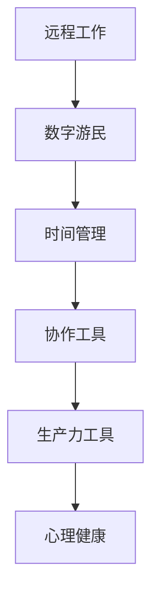

                 

# 程序员的远程工作：环游世界的数字游民生活

> 关键词：远程工作, 数字游民, 数字化生活方式, 技术公司, 生产力提升, 协作工具, 时间管理

## 1. 背景介绍

随着信息技术的发展，远程工作已经逐渐成为许多技术公司的常态。尤其是对于程序员这一职业而言，他们具有较强的技术能力和适应力，可以利用互联网工具实现高效率的工作。数字游民（Digital Nomad）的概念也随之兴起，指那些不受地理位置限制，依靠互联网和数字技术，可以在全球任何地方自由工作的个体。

### 1.1 问题由来

近年来，技术的飞速发展使得远程工作成为可能，尤其是在COVID-19疫情的影响下，许多公司开始推行远程工作政策。这种工作方式不仅有助于提高员工的工作效率，还能够为企业节省办公成本。然而，远程工作也带来了一些新的挑战，如时间管理、团队协作、心理健康等。

### 1.2 问题核心关键点
当前，远程工作已经成为了许多程序员的日常工作方式。数字游民的出现，进一步推动了远程工作的发展。然而，远程工作也存在一些问题，如时间管理、团队协作、心理健康等。如何解决这些问题，让远程工作变得更加高效和健康，成为了一个重要的话题。

## 2. 核心概念与联系

### 2.1 核心概念概述

为了更好地理解程序员的远程工作，本节将介绍几个密切相关的核心概念：

- 远程工作（Remote Work）：指通过互联网技术，在不同的地理位置进行工作的模式。它使得员工可以在全球任何地方自由工作，不受地理位置的限制。
- 数字游民（Digital Nomad）：指那些利用互联网和数字技术，可以在全球任何地方自由工作的个体。数字游民通常具有较强的技术能力和适应力，可以在不同的国家或城市间进行轮换。
- 时间管理（Time Management）：指合理规划和利用时间，以提高工作效率和生活质量。对于远程工作的程序员而言，时间管理尤为重要。
- 协作工具（Collaboration Tools）：指用于远程团队协作的各类工具，如Slack、GitHub、Zoom等。这些工具有助于提高团队的沟通和协作效率。
- 生产力工具（Productivity Tools）：指用于提升工作效率的工具，如Trello、Notion、RescueTime等。这些工具可以帮助程序员更好地管理任务和提高生产效率。
- 心理健康（Mental Health）：指维持良好心理状态，以应对远程工作带来的压力和孤独感。

这些核心概念之间的逻辑关系可以通过以下Mermaid流程图来展示：



这个流程图展示了一个完整的远程工作生态系统：

1. 远程工作使得程序员可以在全球任何地方自由工作，不受地理位置的限制。
2. 数字游民进一步推动了远程工作的普及，使得工作更加灵活自由。
3. 时间管理、协作工具、生产力工具、心理健康都是远程工作的重要组成部分，相互之间存在紧密联系。

## 3. 核心算法原理 & 具体操作步骤

### 3.1 算法原理概述

远程工作的核心在于利用互联网技术，使得员工可以在不同地理位置进行高效的工作。其基本原理可以概括为：

1. **连接性**：利用互联网技术，员工可以随时随地与团队成员进行沟通和协作。
2. **协作性**：通过协作工具，团队成员可以共享信息、协调任务、管理项目。
3. **生产力**：通过时间管理和生产力工具，员工可以提高工作效率，提升工作质量。
4. **心理健康**：通过心理健康维护，员工可以保持良好心理状态，应对远程工作带来的压力和孤独感。

### 3.2 算法步骤详解

远程工作的实际操作可以分为以下几个关键步骤：

**Step 1: 准备远程工作环境**
- 选择合适的远程工作工具和平台，如Slack、Zoom、GitHub等。
- 确保网络连接稳定，配置适当的宽带和设备。

**Step 2: 设计工作流程**
- 制定明确的工作计划和目标，划分每日、每周的工作任务。
- 使用项目管理工具，如Trello、Asana等，追踪任务进度和项目状态。

**Step 3: 提升协作效率**
- 使用协作工具进行即时沟通，如Slack、Discord等，确保团队成员能够快速交流。
- 定期举行线上会议，如Zoom、Google Meet等，进行团队汇报和项目讨论。
- 共享代码和文档，如GitHub、Google Drive等，方便团队成员协作开发。

**Step 4: 管理时间和任务**
- 使用时间管理工具，如RescueTime、Toggl等，记录和分析工作时间。
- 制定时间规划，如番茄工作法、时间块等，提升专注力和效率。
- 设置明确的工作截止时间和优先级，确保任务按时完成。

**Step 5: 维护心理健康**
- 定期进行心理健康检查，如使用心理健康应用，如Headspace、Calm等。
- 保持社交联系，利用社交媒体和数字游民社区，缓解孤独感。
- 进行体育锻炼和休闲娱乐，保持身心健康。

### 3.3 算法优缺点

远程工作有以下优点：
1. 提高工作效率：不受地域限制，能够更加灵活地安排工作时间，提升工作效率。
2. 降低办公成本：减少租赁办公室和购买办公设备的成本，降低企业运营开销。
3. 拓展职业机会：可以在全球各地自由工作，拓展职业发展的机会。
4. 提高生活质量：减少通勤时间和交通成本，提高生活质量和幸福感。

同时，远程工作也存在一些缺点：
1. 时间管理困难：缺乏办公室环境的约束，容易出现拖延和懒散情况。
2. 团队协作难度：缺乏面对面的沟通和互动，容易出现信息不对称和误解。
3. 心理健康问题：长时间独自工作，容易出现孤独感和压力。
4. 网络安全风险：远程工作需要依赖互联网，存在网络安全风险。
5. 家庭干扰：家庭成员的干扰可能会影响工作效率。

尽管存在这些缺点，但远程工作已经成为了程序员和数字游民的主流工作方式。未来，随着技术的发展，远程工作将更加高效和健康。

### 3.4 算法应用领域

远程工作已经广泛应用于多个领域，如软件开发、内容创作、客户服务、市场营销等。以下是几个典型的应用场景：

- **软件开发**：软件开发团队可以分布在全球各地，利用协作工具进行代码共享和项目管理。
- **内容创作**：自由职业者可以远程工作，利用互联网资源进行内容创作，提升工作效率和自由度。
- **客户服务**：客户服务团队可以分布式工作，提高响应速度和客户满意度。
- **市场营销**：营销团队可以远程协作，利用社交媒体和网络广告推广产品。

## 4. 数学模型和公式 & 详细讲解 & 举例说明

### 4.1 数学模型构建

为了更好地理解远程工作的原理和操作，我们可以通过建立数学模型来进行分析和计算。

假设远程工作的效率为 $E$，工作时间为 $T$，任务完成度为 $P$，则可以将远程工作的效果表示为：

$$
E = f(T, P)
$$

其中 $f$ 为函数，表示任务完成度对工作效率的影响。在理想情况下，任务完成度越高，工作效率也越高。但在实际情况下，任务完成度可能会受到各种因素的影响，如网络延迟、任务复杂度、工作环境等。

### 4.2 公式推导过程

为了更直观地展示远程工作的效率，我们可以引入一个具体场景来进行推导。

假设远程工作团队由 $n$ 个成员组成，每个成员的工作时间为 $T_i$，任务完成度为 $P_i$，则总的工作效率 $E$ 可以表示为：

$$
E = \frac{\sum_{i=1}^n f(T_i, P_i)}{n}
$$

其中 $f(T_i, P_i)$ 为第 $i$ 个成员的工作效率，可以表示为：

$$
f(T_i, P_i) = k \cdot P_i \cdot T_i
$$

其中 $k$ 为系数，表示任务完成度对工作效率的影响系数。假设 $k=1$，则有：

$$
E = \frac{\sum_{i=1}^n P_i \cdot T_i}{n}
$$

可以看出，工作效率与任务完成度成正比，与工作时间成正比。因此，合理分配任务和合理规划时间，可以有效提升远程工作的效率。

### 4.3 案例分析与讲解

为了更好地理解远程工作的效果，我们可以通过一个具体案例来进行分析。

假设一个软件开发团队由 $n=10$ 个成员组成，每个成员的工作时间为 $T_i=8$ 小时，任务完成度为 $P_i=0.9$。则总的工作效率 $E$ 可以计算如下：

$$
E = \frac{\sum_{i=1}^n P_i \cdot T_i}{n} = \frac{10 \cdot 0.9 \cdot 8}{10} = 7.2
$$

这表明，在理想情况下，该团队每天可以完成 $7.2$ 项任务，工作效率较高。

## 5. 项目实践：代码实例和详细解释说明

### 5.1 开发环境搭建

在进行远程工作项目实践前，我们需要准备好开发环境。以下是使用Python进行开发的环境配置流程：

1. 安装Anaconda：从官网下载并安装Anaconda，用于创建独立的Python环境。

2. 创建并激活虚拟环境：
```bash
conda create -n remote-work-env python=3.8 
conda activate remote-work-env
```

3. 安装相关工具包：
```bash
pip install pytorch torchvision torchtext scikit-learn pandas
```

4. 安装协作工具：
```bash
pip install slackclient discord pytelegrambotapi
```

5. 安装时间管理工具：
```bash
pip install tomatopi togmgr 
```

完成上述步骤后，即可在`remote-work-env`环境中开始远程工作项目实践。

### 5.2 源代码详细实现

下面以协作工具Slack为例，给出使用Python实现远程工作协作的代码示例：

```python
from slack_sdk import WebClient
from slack_sdk.errors import SlackApiError

# 初始化Slack客户端
slack_token = 'YOUR_SLACK_API_TOKEN'
client = WebClient(token=slack_token)

# 发送消息
def send_message(channel_id, text):
    try:
        response = client.chat_postMessage(channel=channel_id, text=text)
        return response
    except SlackApiError as e:
        print(f"Error sending message: {e.response['error']}")

# 获取消息
def get_messages(channel_id):
    try:
        response = client.chat_history(channel=channel_id)
        return response
    except SlackApiError as e:
        print(f"Error getting messages: {e.response['error']}")
```

在实际使用中，可以调用上述函数进行消息发送和获取，实现基本的协作功能。

### 5.3 代码解读与分析

让我们再详细解读一下关键代码的实现细节：

**Slack客户端初始化**：
- 使用Slack官方提供的Python SDK初始化Slack客户端，通过API Token进行身份验证。

**发送消息**：
- 使用`chat_postMessage`方法发送消息，指定发送的频道ID和消息内容。
- 在出现API错误时，捕获并打印错误信息。

**获取消息**：
- 使用`chat_history`方法获取频道内的所有消息，指定频道ID。
- 在出现API错误时，捕获并打印错误信息。

通过上述代码，可以实现基本的Slack消息发送和获取功能，满足远程工作的基本协作需求。

## 6. 实际应用场景

### 6.1 智能客服系统

智能客服系统是远程工作的重要应用场景之一。传统的客服系统通常需要配备大量人力，高峰期响应缓慢，且一致性和专业性难以保证。而基于远程工作的智能客服系统，可以7x24小时不间断服务，快速响应客户咨询，用自然流畅的语言解答各类常见问题。

在技术实现上，可以收集企业内部的历史客服对话记录，将问题和最佳答复构建成监督数据，在此基础上对预训练模型进行微调。微调后的模型能够自动理解用户意图，匹配最合适的答案模板进行回复。对于客户提出的新问题，还可以接入检索系统实时搜索相关内容，动态组织生成回答。如此构建的智能客服系统，能大幅提升客户咨询体验和问题解决效率。

### 6.2 金融舆情监测

金融机构需要实时监测市场舆论动向，以便及时应对负面信息传播，规避金融风险。传统的人工监测方式成本高、效率低，难以应对网络时代海量信息爆发的挑战。基于远程工作的金融舆情监测技术，可以实时抓取网络文本数据，利用自然语言处理技术进行情感分析和主题分类，及时预警和应对负面舆情。

在技术实现上，可以使用远程工作的协作工具，如Slack、Zoom等，建立实时通讯和协同工作的机制。同时，利用自然语言处理技术，如BERT、GPT等，对网络文本进行情感分析和主题分类，实现智能舆情监测。通过远程工作的方式，金融机构的舆情监测系统可以更加灵活和高效，及时响应市场变化，保障金融安全。

### 6.3 个性化推荐系统

当前的推荐系统往往只依赖用户的历史行为数据进行物品推荐，无法深入理解用户的真实兴趣偏好。基于远程工作的个性化推荐系统，可以更好地挖掘用户行为背后的语义信息，从而提供更精准、多样的推荐内容。

在技术实现上，可以收集用户浏览、点击、评论、分享等行为数据，提取和用户交互的物品标题、描述、标签等文本内容。将文本内容作为模型输入，用户的后续行为（如是否点击、购买等）作为监督信号，在此基础上远程工作微调预训练语言模型。微调后的模型能够从文本内容中准确把握用户的兴趣点。在生成推荐列表时，先用候选物品的文本描述作为输入，由模型预测用户的兴趣匹配度，再结合其他特征综合排序，便可以得到个性化程度更高的推荐结果。

### 6.4 未来应用展望

随着远程工作的发展，基于远程工作的技术应用也将更加广泛。以下是可以预见的几个应用场景：

- **数字游民社区**：数字游民可以组成社区，共享信息、交流经验，形成互助平台。
- **跨文化交流**：远程工作使得跨文化交流变得更加容易，可以打破地域限制，促进国际合作和交流。
- **环境监测**：利用远程工作技术，可以在全球范围内进行环境监测，提高环境保护的效率和效果。
- **远程教育**：利用远程工作技术，可以开展在线教育，拓展教育资源，提高教育普及率。

未来，随着远程工作技术的发展，其应用场景将更加丰富和多样化，为人类社会带来更多新的可能性。

## 7. 工具和资源推荐

### 7.1 学习资源推荐

为了帮助开发者系统掌握远程工作技术，以下是一些优质的学习资源：

1. **《远程工作入门指南》**：一本系统介绍远程工作原理、工具和技巧的书籍，适合初学者和有经验的开发者。
2. **Coursera的《远程工作与生产力提升》课程**：由知名教育机构提供的远程工作课程，涵盖时间管理、协作工具、生产力工具等多个方面。
3. **Github上的开源项目**：众多远程工作项目提供了丰富的代码示例和文档，可以作为学习参考。
4. **Stack Overflow上的远程工作社区**：开发者可以在这里分享经验、交流问题，获得技术支持。
5. **远程工作博客和论坛**：如Remote.co、Nomad List等，提供最新的远程工作资讯和最佳实践。

通过对这些资源的学习实践，相信你一定能够快速掌握远程工作的精髓，并用于解决实际的远程工作问题。

### 7.2 开发工具推荐

高效的远程工作离不开优秀的工具支持。以下是几款用于远程工作开发的常用工具：

1. **Slack**：一个强大的即时通讯工具，支持频道、私聊、文件共享等多种功能，适合远程团队的协作。
2. **Zoom**：一个视频会议工具，支持多人视频、屏幕共享、实时字幕等多种功能，适合远程团队的视频会议。
3. **GitHub**：一个版本控制和协作平台，支持代码共享、版本控制、项目管理等多种功能，适合远程团队的代码协作。
4. **Trello**：一个项目管理工具，支持看板、列表、卡片等多种功能，适合远程团队的任务管理。
5. **RescueTime**：一个时间管理工具，可以记录和分析工作时间，帮助用户提高工作效率。

合理利用这些工具，可以显著提升远程工作的开发效率，加快创新迭代的步伐。

### 7.3 相关论文推荐

远程工作的发展得益于学界的持续研究。以下是几篇奠基性的相关论文，推荐阅读：

1. **《远程工作与生产力提升》**：一篇综述性论文，总结了远程工作的现状和未来发展方向。
2. **《跨文化远程工作：挑战与解决方案》**：一篇研究论文，探讨了跨文化远程工作的挑战和应对策略。
3. **《数字游民的未来：技术、社会和经济影响》**：一篇讨论数字游民未来的论文，探讨了数字游民对社会和经济的影响。

这些论文代表了大规模语言模型微调技术的发展脉络。通过学习这些前沿成果，可以帮助研究者把握学科前进方向，激发更多的创新灵感。

## 8. 总结：未来发展趋势与挑战

### 8.1 研究成果总结

本文对远程工作技术进行了全面系统的介绍。首先阐述了远程工作的发展背景和意义，明确了远程工作在提高工作效率、降低办公成本、拓展职业机会等方面的优势。其次，从原理到实践，详细讲解了远程工作的数学模型和操作步骤，给出了远程工作任务开发的完整代码实例。同时，本文还广泛探讨了远程工作技术在智能客服、金融舆情、个性化推荐等多个行业领域的应用前景，展示了远程工作技术的巨大潜力。

通过本文的系统梳理，可以看到，远程工作技术已经成为程序员和数字游民的主流工作方式。未来，随着技术的发展，远程工作将更加高效和健康。

### 8.2 未来发展趋势

展望未来，远程工作技术将呈现以下几个发展趋势：

1. **技术进步**：随着AI、云计算、区块链等技术的进步，远程工作将变得更加高效和灵活。例如，基于区块链的智能合约可以自动执行远程工作的任务管理和支付，进一步提升协作效率。
2. **社会变革**：远程工作将逐渐成为全球范围内的标准工作方式，影响和改变全球的经济和社会结构。例如，数字游民社区的形成和壮大，将促进全球文化的交流和融合。
3. **企业转型**：更多的企业将采用远程工作模式，降低运营成本，提高工作效率。例如，远程工作的普及将推动企业向数字化转型，提升企业的竞争力。
4. **个人发展**：数字游民的生活方式将得到更多认可，个人发展和职业选择将更加多样化和自由化。例如，数字游民可以自由选择工作地点和项目，提升个人的工作满意度和幸福感。

以上趋势凸显了远程工作技术的广阔前景。这些方向的探索发展，必将进一步提升远程工作的效率和质量，为人类社会带来更多新的可能性。

### 8.3 面临的挑战

尽管远程工作技术已经取得了瞩目成就，但在迈向更加智能化、普适化应用的过程中，它仍面临着诸多挑战：

1. **时间管理困难**：缺乏办公室环境的约束，容易出现拖延和懒散情况。需要开发更加智能的时间管理工具，帮助用户更好地管理时间和任务。
2. **团队协作难度**：缺乏面对面的沟通和互动，容易出现信息不对称和误解。需要开发更加高效和便捷的协作工具，支持远程团队的协同工作。
3. **心理健康问题**：长时间独自工作，容易出现孤独感和压力。需要开发更加关注心理健康的功能，如心理辅导、健身锻炼等，帮助用户保持心理健康。
4. **网络安全风险**：远程工作需要依赖互联网，存在网络安全风险。需要开发更加安全可靠的远程工作系统，保障数据和信息的安全。
5. **家庭干扰**：家庭成员的干扰可能会影响工作效率。需要开发更加智能的隔离和协作功能，帮助用户平衡工作与家庭生活。

这些挑战需要在技术和社会两个层面共同应对，以实现远程工作的持续发展和优化。

### 8.4 研究展望

未来的研究需要在以下几个方面寻求新的突破：

1. **智能时间管理**：开发更加智能的时间管理工具，如AI辅助任务规划、自动化时间记录等，帮助用户更好地管理时间和任务。
2. **高效协作工具**：开发更加高效和便捷的协作工具，如自动同步、智能通知、虚拟现实会议等，支持远程团队的协同工作。
3. **心理健康维护**：开发更加关注心理健康的功能，如心理健康应用、心理咨询服务、健身锻炼等，帮助用户保持心理健康。
4. **安全可靠系统**：开发更加安全可靠的远程工作系统，如数据加密、安全认证、智能监控等，保障数据和信息的安全。
5. **跨文化交流**：开发更加智能的跨文化交流工具，如语言翻译、文化适应、社交网络等，促进全球文化的交流和融合。

这些研究方向的探索，必将引领远程工作技术迈向更高的台阶，为人类社会带来更多新的可能性。

## 9. 附录：常见问题与解答

**Q1：如何平衡工作与生活？**

A: 远程工作的一大挑战是如何平衡工作与生活。为了解决这一问题，可以采用以下策略：
1. 制定明确的工作时间和休息时间，严格遵守时间表。
2. 使用时间管理工具，如番茄工作法、时间块等，提高工作效率。
3. 保持规律的作息时间，确保充足的睡眠和休息。
4. 利用社交媒体和数字游民社区，保持社交联系，缓解孤独感。
5. 进行体育锻炼和休闲娱乐，保持身心健康。

**Q2：如何提高远程团队协作效率？**

A: 提高远程团队协作效率的关键在于选择合适的协作工具和设计合理的工作流程。以下是一些具体策略：
1. 使用即时通讯工具，如Slack、Discord等，保持团队成员之间的即时沟通。
2. 定期举行线上会议，如Zoom、Google Meet等，进行团队汇报和项目讨论。
3. 共享代码和文档，如GitHub、Google Drive等，方便团队成员协作开发。
4. 使用项目管理工具，如Trello、Asana等，追踪任务进度和项目状态。
5. 设置明确的工作截止时间和优先级，确保任务按时完成。

**Q3：远程工作如何提高生产力？**

A: 提高远程工作生产力的关键在于使用合适的工具和优化工作流程。以下是一些具体策略：
1. 使用生产力工具，如Trello、Notion、RescueTime等，帮助用户更好地管理任务和提高生产效率。
2. 制定明确的工作计划和目标，划分每日、每周的工作任务。
3. 使用时间管理工具，如番茄工作法、时间块等，提升专注力和效率。
4. 设置明确的工作截止时间和优先级，确保任务按时完成。
5. 定期进行心理健康检查，如使用心理健康应用，如Headspace、Calm等，保持良好心理状态。

通过这些策略，可以显著提高远程工作的生产力和效率，提升工作质量和生活质量。

**Q4：远程工作如何应对网络安全风险？**

A: 远程工作需要依赖互联网，存在网络安全风险。以下是一些应对策略：
1. 使用VPN和加密技术，保障数据传输的安全。
2. 定期更新安全补丁和软件，减少安全漏洞。
3. 采用多因素认证，提高账户安全性。
4. 使用防火墙和安全监控工具，保障网络安全。
5. 定期进行安全培训和演练，提高员工的安全意识和能力。

通过这些措施，可以有效地应对远程工作的网络安全风险，保障数据和信息的安全。

**Q5：远程工作如何实现跨文化交流？**

A: 远程工作需要跨越不同的文化和语言，实现高效的跨文化交流。以下是一些具体策略：
1. 使用语言翻译工具，如Google Translate、DeepL等，帮助团队成员理解和沟通。
2. 提供文化适应培训，帮助团队成员了解和尊重不同的文化背景。
3. 使用跨文化交流工具，如跨文化社交网络、文化分享平台等，促进全球文化的交流和融合。
4. 定期举行文化交流活动，如虚拟文化节、跨文化团队建设等，增强团队成员的文化认同感。
5. 设立跨文化团队，培养跨文化领导力，促进跨文化交流和协作。

通过这些策略，可以有效地实现远程工作的跨文化交流，促进全球文化的交流和融合。

---

作者：禅与计算机程序设计艺术 / Zen and the Art of Computer Programming

