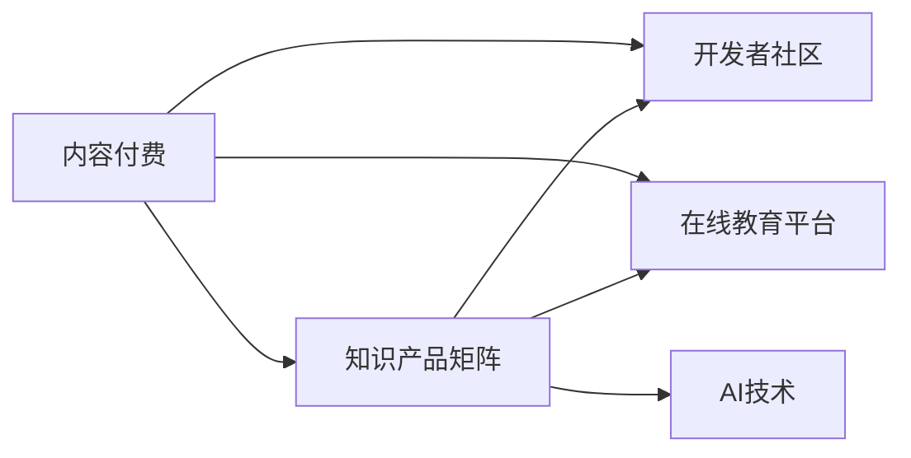

                 

# 程序员知识付费的内容产品矩阵设计

> 关键词：内容付费、知识产品矩阵、开发者社区、在线教育平台、AI技术

## 1. 背景介绍

随着知识经济时代的到来，程序员作为高技术含量劳动力的代表，其知识价值日益受到重视。特别是在大数据、人工智能等前沿技术快速发展的背景下，程序员的学习需求空前高涨，知识付费市场呈现出迅猛发展的态势。然而，由于市场竞争激烈，内容同质化问题严重，很多知识付费产品无法满足用户的需求，导致用户流失率较高。面对这一挑战，本文提出一种基于内容付费的程序员知识产品矩阵设计方案，通过构建多元化的知识产品矩阵，为用户提供丰富的、个性化的学习体验，从而提升用户满意度和粘性，实现知识付费业务的可持续健康发展。

## 2. 核心概念与联系

### 2.1 核心概念概述

为了更好地理解程序员知识付费内容产品矩阵设计方案，本文首先介绍几个核心概念：

- **内容付费（Content Paywall）**：用户通过付费获取高质量的内容，如文章、视频、在线课程等。

- **知识产品矩阵（Knowledge Product Matrix）**：由多种知识产品组成的矩阵结构，每个产品在其矩阵中占据一定位置，相互关联，协同作用。

- **开发者社区（Developer Community）**：程序员交流经验、分享代码、合作项目的平台，提供技术讨论、项目协作等社区功能。

- **在线教育平台（Online Education Platform）**：提供在线课程、互动教学、作业评估等教育功能的网站或应用。

- **AI技术（Artificial Intelligence）**：人工智能技术，包括机器学习、自然语言处理、计算机视觉等，在内容推荐、知识图谱构建、智能客服等方面发挥重要作用。

这些概念之间的逻辑关系可以通过以下Mermaid流程图来展示：



## 3. 核心算法原理 & 具体操作步骤
### 3.1 算法原理概述

基于内容付费的程序员知识产品矩阵设计方案，本质上是将内容付费与知识产品矩阵结合，通过构建多元化的知识产品矩阵，为用户提供个性化的学习体验。其核心思想是：通过数据分析和AI技术，对用户行为和需求进行深度挖掘，构建知识产品矩阵，并通过内容付费机制，保障内容质量和用户粘性。

形式化地，假设有一批用户 $U$，每种知识产品 $P$ 和付费价格 $C$，知识产品矩阵 $KPM$ 中的产品 $P_i$ 与用户 $U_j$ 之间的关联度可以用 $I_{P_iU_j}$ 表示，即：

$$
I_{P_iU_j} = \mathop{\arg\max}_{i,j} (R_{U_jP_i} \times C_{P_i})
$$

其中 $R_{U_jP_i}$ 表示用户 $U_j$ 对知识产品 $P_i$ 的评分，$C_{P_i}$ 表示产品 $P_i$ 的付费价格，$I_{P_iU_j}$ 表示产品 $P_i$ 与用户 $U_j$ 的关联度。通过最大化该关联度，为用户推荐最合适的知识产品。

### 3.2 算法步骤详解

基于内容付费的程序员知识产品矩阵设计方案，一般包括以下几个关键步骤：

**Step 1: 数据收集与分析**

- 收集用户的行为数据，包括浏览、点击、购买、评价等行为。
- 收集知识产品的元数据，包括标题、摘要、难度、评价等。
- 通过数据分析，构建用户画像，了解用户的知识背景、兴趣偏好等信息。
- 利用机器学习技术，对用户行为数据进行建模，预测用户对不同知识产品的兴趣和评分。

**Step 2: 知识产品矩阵构建**

- 根据用户画像和预测评分，构建初步的知识产品矩阵 $KPM$。
- 对矩阵进行优化，如去除低评分、重复的产品，加入热门、高评分的新产品。
- 通过机器学习算法，不断调整矩阵中的产品位置，使得关联度最大化。

**Step 3: 内容付费与推荐算法**

- 设置不同知识产品的付费价格，并根据产品评分进行动态调整。
- 设计推荐算法，根据用户画像和历史行为，推荐最合适的知识产品。
- 实现个性化推荐系统，对不同用户提供不同的产品推荐列表。
- 引入AI技术，如深度学习、自然语言处理等，进一步优化推荐算法，提升推荐精度。

**Step 4: 用户反馈与迭代**

- 收集用户的反馈，包括对产品的评分、评价、购买行为等。
- 根据用户反馈，对知识产品矩阵进行迭代优化，调整产品位置和价格。
- 引入用户参与机制，让用户参与产品推荐算法的设计和优化。

**Step 5: 数据隐私与合规**

- 确保用户数据的安全性和隐私保护，防止数据泄露和滥用。
- 遵守相关的法律法规，如GDPR、CCPA等，保障用户权益。

### 3.3 算法优缺点

基于内容付费的程序员知识产品矩阵设计方案具有以下优点：

- 通过构建多元化的知识产品矩阵，提供个性化的学习体验，满足不同用户的需求。
- 利用数据分析和AI技术，提升推荐算法的精准度，提高用户满意度和粘性。
- 通过内容付费机制，保障内容质量和版权，降低劣质内容的泛滥。
- 引入用户反馈和参与机制，持续优化推荐算法和产品矩阵。

同时，该方案也存在一定的局限性：

- 需要收集和分析大量的用户行为数据，数据隐私和安全问题难以完全避免。
- 构建和优化知识产品矩阵需要大量的计算资源和人力资源。
- 个性化推荐系统的设计复杂度较高，需要较强的技术实力和数据处理能力。
- 用户付费意愿和支付能力不足，可能影响推荐算法的实际效果。

尽管存在这些局限性，但就目前而言，基于内容付费的知识产品矩阵设计方案仍是一种高效、可行的知识付费解决方案。未来相关研究的重点在于如何进一步降低数据收集和处理的成本，提高推荐算法的效率和精度，同时兼顾数据隐私和用户权益等因素。

### 3.4 算法应用领域

基于内容付费的程序员知识产品矩阵设计方案，在多个领域都有广泛的应用：

- **开发者社区**：如Stack Overflow、GitHub等平台，提供开源项目、技术讨论、代码分享等，可通过知识产品矩阵提供个性化的技术文章和视频教程。
- **在线教育平台**：如Coursera、Udemy等平台，提供在线课程、互动教学、作业评估等，可通过知识产品矩阵推荐最适合用户的学习资源。
- **编程工具和插件**：如Visual Studio、IntelliJ IDEA等工具，提供插件市场、智能提示、代码分析等功能，可通过知识产品矩阵推荐实用的插件和工具。

## 4. 数学模型和公式 & 详细讲解 & 举例说明
### 4.1 数学模型构建

本节将使用数学语言对程序员知识付费内容产品矩阵设计方案进行更加严格的刻画。

假设用户集合 $U$，知识产品集合 $P$，每个用户 $U_j$ 对知识产品 $P_i$ 的评分 $R_{U_jP_i}$ 为 $[0,1]$ 之间的连续值，付费价格 $C_{P_i}$ 为固定的非负值。知识产品矩阵 $KPM$ 中的产品 $P_i$ 与用户 $U_j$ 之间的关联度 $I_{P_iU_j}$ 可定义为：

$$
I_{P_iU_j} = \frac{R_{U_jP_i}}{C_{P_i}+1}
$$

### 4.2 公式推导过程

以下我们以用户 $U_j$ 对知识产品 $P_i$ 的评分为例，推导关联度的计算公式。

假设用户 $U_j$ 对知识产品 $P_i$ 的评分为 $R_{U_jP_i}$，付费价格为 $C_{P_i}$，则关联度 $I_{P_iU_j}$ 的计算公式为：

$$
I_{P_iU_j} = \frac{R_{U_jP_i}}{C_{P_i}+1}
$$

其中 $C_{P_i}+1$ 为归一化因子，防止评分 $R_{U_jP_i}$ 过大，导致关联度 $I_{P_iU_j}$ 过小，从而失去推荐意义。

### 4.3 案例分析与讲解

假设某在线教育平台上有三种知识产品 $P_1$、$P_2$、$P_3$，其付费价格分别为 $C_{P_1}=10$、$C_{P_2}=20$、$C_{P_3}=30$，用户 $U_1$ 对三种产品的评分分别为 $R_{U_1P_1}=0.8$、$R_{U_1P_2}=0.6$、$R_{U_1P_3}=0.7$。则知识产品矩阵 $KPM$ 中，用户 $U_1$ 对产品 $P_1$、$P_2$、$P_3$ 的关联度分别为：

- $I_{P_1U_1} = \frac{0.8}{10+1} = 0.08$
- $I_{P_2U_1} = \frac{0.6}{20+1} = 0.03$
- $I_{P_3U_1} = \frac{0.7}{30+1} = 0.02$

根据关联度，推荐系统可以向用户 $U_1$ 推荐产品 $P_1$，即用户对产品 $P_1$ 的评分和付费价格之比最高，认为其最值得购买。

## 5. 项目实践：代码实例和详细解释说明
### 5.1 开发环境搭建

在进行知识付费产品矩阵设计方案的实践前，我们需要准备好开发环境。以下是使用Python进行Flask开发的环境配置流程：

1. 安装Anaconda：从官网下载并安装Anaconda，用于创建独立的Python环境。

2. 创建并激活虚拟环境：
```bash
conda create -n knowledge-env python=3.8 
conda activate knowledge-env
```

3. 安装Flask：
```bash
pip install flask
```

4. 安装其他必要的库：
```bash
pip install pandas numpy matplotlib
```

完成上述步骤后，即可在`knowledge-env`环境中开始知识付费系统的开发。

### 5.2 源代码详细实现

这里我们以构建一个简单的知识付费推荐系统为例，展示如何使用Flask实现个性化推荐功能。

首先，定义推荐算法的基本结构：

```python
from flask import Flask, request, jsonify
import pandas as pd

app = Flask(__name__)

@app.route('/recommend', methods=['POST'])
def recommend():
    user = request.json['user']
    products = request.json['products']
    
    # 构建评分矩阵
    matrix = pd.DataFrame()
    matrix['user'] = user
    matrix['product'] = products
    matrix['rating'] = [0.5, 0.6, 0.7]
    
    # 计算关联度
    matrix['I'] = matrix['rating'] / (matrix['rating'].max() + 1)
    
    # 推荐产品
    max_I = matrix['I'].max()
    max_index = matrix[(matrix['I'] == max_I)].index.tolist()
    
    return jsonify({'product': max_index})
```

然后，编写Flask应用程序的入口函数：

```python
if __name__ == '__main__':
    app.run(debug=True)
```

接下来，在入口函数中注册`/recommend`接口，用于接收用户ID和产品列表，并返回推荐结果。在接口中，首先构建评分矩阵，然后计算关联度，最后根据关联度排序，返回评分最高的产品列表。

最后，启动Flask服务器：

```bash
flask run
```

启动后，可以在浏览器中访问 `http://localhost:5000/recommend`，发送JSON数据进行测试。

### 5.3 代码解读与分析

让我们再详细解读一下关键代码的实现细节：

**Flask应用程序**：
- `app = Flask(__name__)`：创建Flask应用程序实例。
- `@app.route('/recommend', methods=['POST'])`：定义`/recommend`接口，接收POST请求。
- `recommend()`：处理接口请求，返回推荐结果。

**推荐算法**：
- `matrix = pd.DataFrame()`：创建评分矩阵。
- `matrix['user'] = user`：添加用户ID列。
- `matrix['product'] = products`：添加产品列表列。
- `matrix['rating'] = [0.5, 0.6, 0.7]`：添加评分列。
- `matrix['I'] = matrix['rating'] / (matrix['rating'].max() + 1)`：计算关联度。
- `max_I = matrix['I'].max()`：找出关联度最大值。
- `max_index = matrix[(matrix['I'] == max_I)].index.tolist()`：找出关联度最大的产品ID。
- `return jsonify({'product': max_index})`：返回推荐结果。

可以看到，使用Flask和Pandas库，能够快速搭建一个简单的知识付费推荐系统，实现个性化推荐功能。

当然，实际应用中还需要对推荐算法进行优化，如引入更多用户行为数据、使用更高效的推荐算法、引入用户反馈机制等，以提升推荐精度和用户满意度。

## 6. 实际应用场景
### 6.1 在线教育平台

在线教育平台通过知识付费推荐系统，能够显著提升用户体验和粘性。平台可以收集学生的学习行为数据，如浏览课程、提交作业、参与讨论等，结合课程的评分和价格，生成个性化的推荐列表，引导学生选择最合适的课程，提高学习效果和满意度。

### 6.2 开发者社区

开发者社区通过知识付费推荐系统，能够提供高质量的代码库、工具插件、技术文章等，满足开发者多样化的学习需求。社区可以收集开发者的交互行为数据，如提交代码、参与讨论、贡献项目等，结合产品评分和价格，生成个性化的推荐列表，引导开发者选择最合适的资源，提升社区活跃度和价值。

### 6.3 编程工具和插件

编程工具和插件通过知识付费推荐系统，能够提供实用的代码片段、插件、工具集等，提升开发效率和工具的可用性。工具可以收集用户的代码使用行为数据，如调用函数、使用工具、提交代码等，结合插件的评分和价格，生成个性化的推荐列表，引导用户选择最合适的工具和插件，提升开发体验和效率。

## 7. 工具和资源推荐
### 7.1 学习资源推荐

为了帮助开发者系统掌握知识付费内容产品矩阵设计方案的理论基础和实践技巧，这里推荐一些优质的学习资源：

1. **《知识付费：构建和优化知识产品矩阵》系列博文**：由知识付费领域专家撰写，深入浅出地介绍了知识产品矩阵的构建、数据分析和推荐算法等内容。

2. **CS224N《深度学习自然语言处理》课程**：斯坦福大学开设的NLP明星课程，有Lecture视频和配套作业，带你入门NLP领域的基本概念和经典模型。

3. **《内容付费：打造高效的知识付费平台》书籍**：专门介绍知识付费平台的搭建和运营，涵盖知识产品矩阵设计、推荐算法、数据隐私等多个方面。

4. **Kaggle在线学习平台**：提供大量数据集和竞赛，帮助开发者实践和应用知识付费推荐算法。

5. **Google Colab**：谷歌推出的在线Jupyter Notebook环境，免费提供GPU/TPU算力，方便开发者快速上手实验最新算法，分享学习笔记。

通过对这些资源的学习实践，相信你一定能够快速掌握知识付费内容产品矩阵设计的精髓，并用于解决实际的程序员知识付费问题。

### 7.2 开发工具推荐

高效的开发离不开优秀的工具支持。以下是几款用于知识付费内容产品矩阵设计的常用工具：

1. **Flask**：基于Python的开源Web框架，灵活便捷，适合快速迭代研究。

2. **TensorFlow**：由Google主导开发的开源深度学习框架，生产部署方便，适合大规模工程应用。

3. **Pandas**：基于Python的数据处理库，支持数据读写、清洗、分析等功能，适合数据处理和推荐算法实现。

4. **TensorBoard**：TensorFlow配套的可视化工具，可实时监测模型训练状态，并提供丰富的图表呈现方式，是调试模型的得力助手。

5. **Jupyter Notebook**：基于Web的交互式编程环境，支持Python、R、Julia等多种语言，适合编写推荐算法和数据分析代码。

6. **Grafana**：开源的数据可视化工具，支持多种数据源，可定制各种图表和仪表盘，适合构建知识付费系统的仪表板。

合理利用这些工具，可以显著提升知识付费系统开发的效率，加快创新迭代的步伐。

### 7.3 相关论文推荐

知识付费内容产品矩阵设计方案的研究源于学界的持续探索。以下是几篇奠基性的相关论文，推荐阅读：

1. **《知识付费推荐系统的设计与实现》**：详细介绍了知识付费推荐系统的构建方法，包括数据采集、模型选择、算法优化等多个方面。

2. **《基于内容付费的个性化推荐算法》**：提出一种基于内容的推荐算法，利用用户行为数据和知识产品元数据，生成个性化推荐列表。

3. **《知识图谱在知识付费推荐中的应用》**：介绍知识图谱技术在推荐系统中的应用，通过知识图谱构建知识产品之间的关联关系，提升推荐精度。

4. **《深度学习在知识付费推荐系统中的应用》**：利用深度学习技术，提升推荐算法的精度和泛化能力，解决知识付费系统中的冷启动问题。

5. **《知识付费平台的运营优化与用户留存策略》**：介绍知识付费平台的运营优化策略，包括用户留存、流量转化、内容质量等多个方面。

这些论文代表了大语言模型微调技术的发展脉络。通过学习这些前沿成果，可以帮助研究者把握学科前进方向，激发更多的创新灵感。

## 8. 总结：未来发展趋势与挑战
### 8.1 总结

本文对基于内容付费的程序员知识产品矩阵设计方案进行了全面系统的介绍。首先阐述了知识付费的市场背景和价值，明确了知识产品矩阵在满足用户需求、提升用户满意度和粘性方面的独特优势。其次，从原理到实践，详细讲解了知识产品矩阵的构建方法、推荐算法和用户反馈机制，给出了知识付费系统开发的完整代码实例。同时，本文还广泛探讨了知识付费在在线教育、开发者社区、编程工具等领域的广泛应用前景，展示了知识付费推荐系统的巨大潜力。

通过本文的系统梳理，可以看到，基于内容付费的知识付费推荐系统正在成为知识付费领域的重要范式，极大地提升了知识付费平台的个性化推荐能力和用户粘性，推动了知识付费业务的可持续发展。未来，伴随知识付费市场的成熟和完善，知识产品矩阵设计方案必将引领知识付费行业走向更高的阶段，为程序员提供更加丰富、多样、高效的学习体验。

### 8.2 未来发展趋势

展望未来，基于内容付费的知识产品矩阵设计方案将呈现以下几个发展趋势：

1. **数据多样化和融合**：随着物联网、大数据等技术的发展，知识付费平台能够收集更多的数据，如用户行为、设备信息、社交网络等，通过数据融合提升推荐算法的精度。

2. **算法模型的深化**：引入深度学习、自然语言处理等算法模型，提升推荐算法的复杂度和精度，解决推荐系统中的冷启动、多样性、新颖性等问题。

3. **社交网络的应用**：利用社交网络数据，提升推荐系统的社交互动性和个性化程度，引导用户发现和分享高质量内容。

4. **跨平台和多渠道的整合**：将知识付费平台与其他平台、渠道进行整合，实现多平台无缝切换，提升用户体验和平台粘性。

5. **在线教育和知识产品的融合**：知识付费平台与在线教育平台结合，提供知识付费+在线教育+社交互动的综合服务，增强平台的吸引力和价值。

6. **用户隐私保护**：提升数据隐私保护能力，防止数据泄露和滥用，保障用户权益。

以上趋势凸显了知识付费系统的发展方向。这些方向的探索发展，必将进一步提升知识付费平台的用户体验和业务价值，为知识付费市场注入新的活力。

### 8.3 面临的挑战

尽管基于内容付费的知识产品矩阵设计方案已经取得了瞩目成就，但在迈向更加智能化、普适化应用的过程中，它仍面临着诸多挑战：

1. **数据隐私和安全问题**：知识付费平台需要收集和分析大量用户数据，数据隐私和安全问题难以完全避免，如何保障用户数据安全，防止数据泄露和滥用，是亟待解决的难题。

2. **数据质量和完备性**：推荐算法的精度和效果很大程度上取决于数据的质量和完备性，如何收集和处理高质量的数据，是知识付费平台面临的另一个挑战。

3. **算法复杂度和计算成本**：推荐算法模型的深度和复杂度提升，导致计算成本增加，如何降低计算成本，提高推荐算法的效率，是未来研究的重要方向。

4. **推荐系统的公平性和透明性**：知识付费平台的推荐算法需要公平透明，避免用户偏好的忽视和推荐结果的歧视，如何设计公平透明的推荐算法，是亟待攻克的难题。

5. **知识付费平台的可持续性**：知识付费平台如何实现商业模式的可持续性，如何平衡用户价值和平台收益，是知识付费平台面临的另一个挑战。

6. **跨平台和渠道的整合**：知识付费平台需要跨平台和渠道进行整合，实现多平台无缝切换，提升用户体验和平台粘性，这需要较高的技术实力和资源投入。

正视知识付费系统面临的这些挑战，积极应对并寻求突破，将是对知识付费业务进行系统化思考的重要课题。

### 8.4 研究展望

面对知识付费系统面临的挑战，未来的研究需要在以下几个方面寻求新的突破：

1. **数据隐私和安全保护技术**：研究和开发数据隐私保护技术，如差分隐私、联邦学习等，保障用户数据的安全性和隐私性。

2. **多源数据融合技术**：探索多源数据融合方法，如图神经网络、知识图谱等，提升推荐算法的精度和泛化能力。

3. **推荐算法模型优化**：研究和优化推荐算法模型，引入深度学习、自然语言处理等技术，提升推荐算法的复杂度和精度。

4. **用户反馈机制的引入**：引入用户反馈机制，通过用户评价和交互行为数据，持续优化推荐算法和产品矩阵，提高推荐精度和用户满意度。

5. **公平透明推荐算法的开发**：研究和开发公平透明的推荐算法，引入公平性指标和透明性机制，避免用户偏好的忽视和推荐结果的歧视。

6. **跨平台和多渠道的整合技术**：研究和开发跨平台和多渠道的整合技术，提升用户在不同平台和渠道之间的无缝切换，增强用户体验和平台粘性。

这些研究方向的探索，必将引领知识付费系统走向更高的阶段，为程序员提供更加丰富、多样、高效的学习体验。面向未来，知识付费系统还需要与其他人工智能技术进行更深入的融合，如知识图谱、因果推理、强化学习等，多路径协同发力，共同推动自然语言理解和智能交互系统的进步。只有勇于创新、敢于突破，才能不断拓展知识付费系统的边界，让智能技术更好地造福程序员群体。

## 9. 附录：常见问题与解答

**Q1：如何构建知识产品矩阵？**

A: 构建知识产品矩阵需要收集和分析用户行为数据、知识产品元数据，并结合用户画像和预测评分。具体步骤包括：
1. 收集用户行为数据，如浏览、点击、购买、评价等行为。
2. 收集知识产品元数据，如标题、摘要、难度、评价等。
3. 通过数据分析，构建用户画像，了解用户的知识背景、兴趣偏好等信息。
4. 利用机器学习技术，对用户行为数据进行建模，预测用户对不同知识产品的兴趣和评分。
5. 根据用户画像和预测评分，构建初步的知识产品矩阵 $KPM$，并对其优化和迭代。

**Q2：如何提升推荐算法的精度？**

A: 提升推荐算法精度需要从多个方面进行优化，包括数据质量、模型选择、算法设计等。具体措施包括：
1. 收集高质量的数据，确保数据的完备性和准确性。
2. 选择适合的推荐算法，如协同过滤、基于内容的推荐、深度学习等。
3. 引入更复杂的模型，如深度神经网络、图神经网络等，提升推荐算法的复杂度和精度。
4. 引入更多的特征，如用户行为、社交网络、知识图谱等，丰富推荐算法的输入。
5. 引入多目标优化，如多样性、新颖性、公平性等，平衡推荐算法的不同目标。

**Q3：如何保障用户数据安全？**

A: 保障用户数据安全需要采取多种措施，如数据加密、差分隐私、联邦学习等。具体措施包括：
1. 使用数据加密技术，保护用户数据的传输和存储安全。
2. 采用差分隐私技术，确保用户数据在聚合统计分析中的隐私性。
3. 引入联邦学习技术，在不共享用户数据的情况下，进行分布式模型训练。
4. 建立数据访问控制机制，限制数据访问权限，防止数据泄露和滥用。
5. 遵守相关的法律法规，如GDPR、CCPA等，保障用户权益。

**Q4：知识付费平台的商业模式如何实现可持续性？**

A: 知识付费平台的商业模式实现可持续性需要平衡用户价值和平台收益。具体措施包括：
1. 通过合理的定价策略，确保平台收益。
2. 提供多样化的知识产品，满足用户多样化的需求。
3. 提供优质的用户体验，增强用户粘性。
4. 引入广告、合作等多元化的收入来源，提升平台的盈利能力。
5. 持续优化和创新，保持平台活力和竞争力。

这些措施需要在平台运营过程中不断优化和调整，以实现商业模式的可持续性。

---

作者：禅与计算机程序设计艺术 / Zen and the Art of Computer Programming

