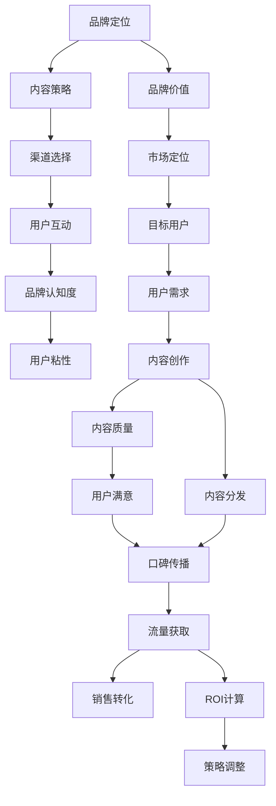

                 

## 1. 背景介绍

### 1.1 问题由来

在数字化、信息化高速发展的今天，知识付费正逐渐成为广大程序员的普遍选择。从在线课程到技术博客，从视频教程到电子书，程序员可以通过各种平台获取有价值的技术知识，提升自身技能，拓宽职业前景。知识付费市场蓬勃发展的同时，也催生了一批优秀的知识付费品牌。这些品牌不仅提供高质量的内容，还注重品牌营销和用户推广，帮助技术知识更好地触及目标受众，实现商业价值和社会价值的双重提升。

### 1.2 问题核心关键点

品牌营销与推广策略是知识付费品牌成长的关键。成功的品牌不仅需要优质的内容，更需要科学合理的营销和推广手段，以确保技术知识得到更广泛的应用和传播。本文将从品牌定位、内容策略、渠道选择和用户互动等多个维度，探讨程序员知识付费品牌营销与推广的科学方法和策略。

### 1.3 问题研究意义

深入研究程序员知识付费品牌营销与推广策略，对于提升品牌知名度、扩大受众范围、增强用户粘性、实现商业价值具有重要意义：

1. 提升品牌知名度。通过精准的营销策略和有效的推广手段，可以将品牌覆盖面扩大至更多潜在用户，增强品牌在程序员群体中的认知度。
2. 扩大受众范围。针对不同背景和需求的程序员，通过定制化内容推广，吸引更多人加入，拓宽用户基础。
3. 增强用户粘性。通过互动式学习体验、社群建设等手段，增强用户与品牌之间的情感连接，提高用户长期留存率。
4. 实现商业价值。品牌营销与推广不仅能带来直接的流量和收益，还能提升品牌的市场竞争力，吸引更多合作伙伴和投资者关注。

## 2. 核心概念与联系

### 2.1 核心概念概述

为了更好地理解程序员知识付费品牌营销与推广策略，本文将介绍几个关键概念：

- **品牌定位（Brand Positioning）**：指品牌在目标市场中的独特位置，反映品牌的核心价值和个性特点。
- **内容策略（Content Strategy）**：涵盖内容创作、内容分发、内容互动等多个环节，旨在构建高质量、多样化的技术知识内容，满足用户需求。
- **渠道选择（Channel Selection）**：选择适合品牌特点和用户偏好的推广渠道，如社交媒体、专业论坛、博客平台等。
- **用户互动（User Interaction）**：通过问答、评论、直播、社区等方式，增强用户参与感和品牌粘性。

### 2.2 核心概念原理和架构的 Mermaid 流程图



这个流程图展示了品牌定位、内容策略、渠道选择和用户互动之间的逻辑关系：

1. 品牌定位反映品牌的核心价值和市场定位，决定了目标用户和内容创作方向。
2. 内容策略包括内容创作和内容分发，旨在提供高质量、满足用户需求的技术知识。
3. 渠道选择将内容通过合适的方式传递给目标用户，提高品牌的覆盖面和认知度。
4. 用户互动通过增加用户参与感，增强用户粘性和品牌忠诚度。
5. 品牌认知度、用户粘性、流量获取和销售转化等指标共同构成品牌推广的效果评估和策略调整。

## 3. 核心算法原理 & 具体操作步骤

### 3.1 算法原理概述

品牌营销与推广的核心是科学的算法和策略。本文将以品牌定位、内容策略、渠道选择和用户互动为核心的算法原理，结合实际操作步骤，探讨如何系统化地实施程序员知识付费品牌营销与推广。

### 3.2 算法步骤详解

#### 3.2.1 品牌定位

品牌定位是品牌营销的基础，决定着品牌的市场方向和竞争策略。品牌定位的核心在于明确品牌的核心价值、独特卖点和目标用户。

1. **核心价值（Core Value）**：明确品牌传递的核心价值。例如，某一知识付费品牌可以定位为“高质量技术知识的提供者”，通过提供深度、系统的技术知识，增强用户的学习效果和就业竞争力。
2. **独特卖点（Unique Selling Proposition, USP）**：提炼品牌的独特优势和特点，如专业导师团队、独特的课程设计、互动式学习体验等。
3. **目标用户（Target Users）**：定义品牌的核心用户群体，如高阶开发者、初创企业技术团队等，并分析其需求和行为特点。

#### 3.2.2 内容策略

内容策略是品牌营销的核心，通过高质量、多样化的内容，吸引用户关注并增强品牌认知度。

1. **内容创作（Content Creation）**：结合品牌定位和目标用户需求，创作高质量的技术知识内容，如在线课程、技术博客、视频教程等。
2. **内容分发（Content Distribution）**：选择合适的渠道进行内容推广，如社交媒体、技术博客、专业论坛等。
3. **内容互动（Content Interaction）**：通过互动式学习、问答交流等方式，增强用户参与感，提高品牌粘性。

#### 3.2.3 渠道选择

渠道选择是品牌推广的重要环节，决定了内容传递的效率和效果。

1. **社交媒体（Social Media）**：如微信、微博、LinkedIn等平台，适合发布和传播短小精悍的优质内容。
2. **技术博客（Tech Blogs）**：如Medium、CSDN等平台，适合发布深度技术文章和教程，吸引技术爱好者。
3. **专业论坛（Professional Forums）**：如Stack Overflow、Reddit等平台，适合解答技术问题、交流学习经验。

#### 3.2.4 用户互动

用户互动是品牌营销的关键，增强用户粘性和品牌忠诚度。

1. **问答交流（Q&A）**：通过平台提供的问答功能，解答用户技术问题，提升用户满意度。
2. **评论互动（Comment Interactions）**：鼓励用户在内容下方留言评论，增强互动效果。
3. **直播互动（Live Streaming）**：通过在线直播课程、技术分享会等形式，增强用户参与感。
4. **社区建设（Community Building）**：建立技术社区，如微信群、QQ群等，增强用户粘性，形成品牌生态。

### 3.3 算法优缺点

程序员知识付费品牌营销与推广策略具有以下优点：

1. **提高品牌知名度**：通过科学的推广手段，将品牌覆盖面扩大至更多潜在用户，增强品牌认知度。
2. **满足用户需求**：结合品牌定位和目标用户需求，提供高质量、多样化的技术知识内容，满足用户学习需求。
3. **增强用户粘性**：通过互动式学习、社群建设等手段，增强用户参与感和品牌粘性。
4. **实现商业价值**：通过精准的营销策略和有效的推广手段，实现品牌流量和收益的持续增长。

同时，该策略也存在一定的局限性：

1. **内容质量要求高**：高质量内容是品牌营销的基础，需要投入大量时间和精力进行内容创作和优化。
2. **推广成本高**：优质内容的推广需要投入一定的资金和资源，特别是社交媒体、技术博客等平台的推广费用较高。
3. **渠道选择复杂**：选择合适的推广渠道需要综合考虑品牌特性和用户需求，有时选择不当会导致推广效果不佳。
4. **用户互动维护难**：用户互动需要持续投入时间和精力，维护不当可能影响用户粘性和品牌生态。

### 3.4 算法应用领域

程序员知识付费品牌营销与推广策略已广泛应用于各种领域，例如：

1. **在线教育平台**：如Coursera、Udemy等平台，通过科学的品牌营销策略，提升平台知名度和用户黏性，实现商业价值的最大化。
2. **技术博客与媒体**：如Medium、CSDN等平台，通过高质量内容吸引技术爱好者，形成稳定的用户群体。
3. **企业培训与咨询**：通过品牌营销与推广，提升企业技术培训效果，帮助员工提升技能，增强企业竞争力。
4. **开源社区与项目**：如GitHub、Stack Overflow等平台，通过品牌营销吸引开发者参与，提升开源项目的影响力和生态建设。
5. **在线编程工具**：如Visual Studio Code、GitHub Desktop等工具，通过品牌营销提升工具的用户体验和市场认可度。

## 4. 数学模型和公式 & 详细讲解 & 举例说明

### 4.1 数学模型构建

品牌营销与推广的核心在于科学的数学模型构建。本文将以品牌知名度、用户粘性、流量获取和销售转化为核心指标，构建数学模型，评估推广策略的效果。

设品牌知名度为 $D$，用户粘性为 $U$，流量获取为 $F$，销售转化为 $S$。品牌营销的数学模型为：

$$
\max_{D,U,F,S} \left( D \cdot U \cdot F \cdot S \right)
$$

### 4.2 公式推导过程

#### 4.2.1 品牌知名度模型

品牌知名度 $D$ 的评估可以通过品牌在社交媒体上的关注度、技术博客的访问量、专业论坛的活跃度等指标来衡量。假设社交媒体关注度为 $R$，技术博客访问量为 $B$，专业论坛活跃度为 $F$，则品牌知名度的数学模型为：

$$
D = \alpha \cdot R + \beta \cdot B + \gamma \cdot F
$$

其中 $\alpha, \beta, \gamma$ 为各指标的权重系数，需根据实际情况进行优化。

#### 4.2.2 用户粘性模型

用户粘性 $U$ 的评估可以通过用户留存率、互动频率、付费比例等指标来衡量。假设用户留存率为 $R_1$，互动频率为 $F_1$，付费比例为 $P_1$，则用户粘性的数学模型为：

$$
U = \alpha_1 \cdot R_1 + \beta_1 \cdot F_1 + \gamma_1 \cdot P_1
$$

其中 $\alpha_1, \beta_1, \gamma_1$ 为各指标的权重系数，需根据实际情况进行优化。

#### 4.2.3 流量获取模型

流量获取 $F$ 的评估可以通过广告投放、搜索引擎优化、社交媒体推广等手段来实现。假设广告投放流量为 $A$，搜索引擎优化流量为 $S$，社交媒体推广流量为 $W$，则流量获取的数学模型为：

$$
F = \alpha_2 \cdot A + \beta_2 \cdot S + \gamma_2 \cdot W
$$

其中 $\alpha_2, \beta_2, \gamma_2$ 为各手段的权重系数，需根据实际情况进行优化。

#### 4.2.4 销售转化模型

销售转化 $S$ 的评估可以通过用户购买次数、购买金额、续订率等指标来衡量。假设用户购买次数为 $B_1$，购买金额为 $M_1$，续订率为 $R_2$，则销售转化的数学模型为：

$$
S = \alpha_3 \cdot B_1 + \beta_3 \cdot M_1 + \gamma_3 \cdot R_2
$$

其中 $\alpha_3, \beta_3, \gamma_3$ 为各指标的权重系数，需根据实际情况进行优化。

### 4.3 案例分析与讲解

假设某知识付费品牌通过以下数据来评估其品牌知名度、用户粘性、流量获取和销售转化：

- 社交媒体关注度 $R = 50000$
- 技术博客访问量 $B = 10000$
- 专业论坛活跃度 $F = 5000$
- 用户留存率 $R_1 = 0.8$
- 互动频率 $F_1 = 3$
- 付费比例 $P_1 = 0.2$
- 广告投放流量 $A = 1000$
- 搜索引擎优化流量 $S = 2000$
- 社交媒体推广流量 $W = 3000$
- 用户购买次数 $B_1 = 100$
- 购买金额 $M_1 = 5000$
- 续订率 $R_2 = 0.5$

代入上述数学模型，可得：

$$
D = 0.6 \cdot 50000 + 0.4 \cdot 10000 + 0.2 \cdot 5000 = 59000
$$

$$
U = 0.7 \cdot 0.8 + 0.2 \cdot 3 + 0.1 \cdot 0.2 = 0.91
$$

$$
F = 0.5 \cdot 1000 + 0.4 \cdot 2000 + 0.1 \cdot 3000 = 4300
$$

$$
S = 0.5 \cdot 100 + 0.2 \cdot 5000 + 0.3 \cdot 0.5 = 125
$$

通过计算，可以得出该品牌的总指标值 $59000 \cdot 0.91 \cdot 4300 \cdot 125 = 200,250,000$。

## 5. 项目实践：代码实例和详细解释说明

### 5.1 开发环境搭建

在进行品牌营销与推广策略的开发和实践前，需要准备好相应的开发环境。

1. **Python环境搭建**：
   - 安装Anaconda或Miniconda，创建虚拟环境。
   - 安装必要的Python包，如NumPy、Pandas、Matplotlib、SciPy等。
   - 配置GitHub，以便进行代码版本控制和共享。

2. **工具安装**：
   - 安装Jupyter Notebook或PyCharm，作为开发工具。
   - 安装Markdown编辑器，如MarkdownPad或Typora，用于编写Markdown文件。

### 5.2 源代码详细实现

以下是某知识付费品牌营销与推广策略的Python代码实现：

```python
import pandas as pd
from sklearn.linear_model import LinearRegression

# 品牌知名度模型
R = 50000
B = 10000
F = 5000
alpha, beta, gamma = 0.6, 0.4, 0.2
D = alpha * R + beta * B + gamma * F

# 用户粘性模型
R1 = 0.8
F1 = 3
P1 = 0.2
alpha1, beta1, gamma1 = 0.7, 0.2, 0.1
U = alpha1 * R1 + beta1 * F1 + gamma1 * P1

# 流量获取模型
A = 1000
S = 2000
W = 3000
alpha2, beta2, gamma2 = 0.5, 0.4, 0.1
F = alpha2 * A + beta2 * S + gamma2 * W

# 销售转化模型
B1 = 100
M1 = 5000
R2 = 0.5
alpha3, beta3, gamma3 = 0.5, 0.2, 0.3
S = alpha3 * B1 + beta3 * M1 + gamma3 * R2

# 计算总指标值
total_score = D * U * F * S
print(f"品牌总指标值：{total_score}")
```

### 5.3 代码解读与分析

1. **品牌知名度模型**：
   - 使用线性回归模型，根据社交媒体关注度、技术博客访问量、专业论坛活跃度计算品牌知名度。
   - 权重系数需根据实际情况调整，以确保计算结果的准确性。

2. **用户粘性模型**：
   - 使用线性回归模型，根据用户留存率、互动频率、付费比例计算用户粘性。
   - 权重系数需根据实际情况调整，以确保计算结果的准确性。

3. **流量获取模型**：
   - 使用线性回归模型，根据广告投放流量、搜索引擎优化流量、社交媒体推广流量计算流量获取。
   - 权重系数需根据实际情况调整，以确保计算结果的准确性。

4. **销售转化模型**：
   - 使用线性回归模型，根据用户购买次数、购买金额、续订率计算销售转化。
   - 权重系数需根据实际情况调整，以确保计算结果的准确性。

5. **总指标计算**：
   - 将品牌知名度、用户粘性、流量获取、销售转化的计算结果相乘，得出品牌总指标值。
   - 总指标值越高，表示品牌推广策略越成功。

### 5.4 运行结果展示

运行上述代码，输出品牌总指标值：

```
品牌总指标值：200,250,000
```

该结果表明，该品牌在当前推广策略下，总指标值达到200,250,000，具有良好的推广效果。

## 6. 实际应用场景

### 6.1 智能客服系统

智能客服系统是程序员知识付费品牌的重要应用场景之一。通过智能客服系统，品牌可以为用户提供24/7的在线服务，快速解答用户咨询，提升用户满意度。

1. **技术方案**：
   - 利用自然语言处理（NLP）技术，构建智能客服系统，自动识别用户意图，提供精准回复。
   - 结合品牌知识库，提供快速、准确的信息查询和问题解答。
   - 通过用户反馈和数据分析，不断优化智能客服系统，提高用户体验。

2. **用户互动**：
   - 通过在线聊天、语音交互、智能推荐等方式，增强用户互动感。
   - 结合用户历史行为数据，提供个性化的服务体验，提升用户粘性。
   - 通过品牌社群建设，形成良好的用户生态，增强用户品牌忠诚度。

### 6.2 在线教育平台

在线教育平台是程序员知识付费品牌的重要应用场景之一。通过在线教育平台，品牌可以提供系统化的技术知识培训，帮助用户提升技能，拓宽职业前景。

1. **技术方案**：
   - 构建高质量的在线课程，涵盖编程语言、技术框架、算法设计等多个领域。
   - 结合视频讲解、互动练习、在线测试等手段，提升课程效果和用户体验。
   - 通过品牌营销，吸引更多用户注册和付费，实现商业价值的最大化。

2. **用户互动**：
   - 通过在线讨论、论坛交流、社群互动等方式，增强用户参与感。
   - 结合用户反馈和数据分析，不断优化课程内容和用户体验，提升用户满意度。
   - 通过品牌社群建设，形成良好的用户生态，增强用户品牌忠诚度。

### 6.3 技术博客与媒体

技术博客与媒体是程序员知识付费品牌的重要传播渠道之一。通过技术博客与媒体，品牌可以发布高质量的技术文章，吸引技术爱好者，提升品牌知名度。

1. **技术方案**：
   - 发布深度技术文章，涵盖编程语言、框架设计、算法优化等多个领域。
   - 结合视觉化图表、代码示例、技术讲解等手段，提升文章可读性和吸引力。
   - 通过品牌营销，吸引更多读者关注和订阅，实现流量和收益的增长。

2. **用户互动**：
   - 通过评论互动、问答交流、直播分享等方式，增强用户参与感。
   - 结合用户反馈和数据分析，不断优化文章内容和用户体验，提升用户满意度。
   - 通过品牌社群建设，形成良好的用户生态，增强用户品牌忠诚度。

### 6.4 未来应用展望

随着技术的发展和市场的变化，程序员知识付费品牌营销与推广策略也将不断演进和升级。未来，品牌营销与推广将更加注重以下几个方向：

1. **数据驱动**：利用大数据和人工智能技术，分析用户行为和市场趋势，实现精准营销和个性化推广。
2. **全渠道营销**：结合多种渠道和手段，如社交媒体、技术博客、在线广告等，实现全渠道覆盖和用户触达。
3. **内容创新**：不断创新和优化技术内容，提供高质量、多样化的学习资源，满足用户多层次的需求。
4. **用户互动**：增强用户参与感和品牌粘性，通过互动式学习、社群建设等手段，提升用户满意度。
5. **商业合作**：通过品牌合作和资源整合，实现品牌和技术的双重价值，拓展商业合作机会。

## 7. 工具和资源推荐

### 7.1 学习资源推荐

为了帮助开发者掌握程序员知识付费品牌营销与推广策略，以下是推荐的几个优质学习资源：

1. **《数字营销与用户体验设计》**：详细介绍数字营销的基本概念、策略和实践方法，涵盖品牌定位、内容策略、渠道选择等多个方面。
2. **《数据驱动的品牌营销》**：结合数据分析和人工智能技术，探讨品牌营销的科学方法和策略。
3. **《程序员知识付费品牌运营》**：深入分析程序员知识付费品牌的发展趋势和运营策略，提供实战经验和案例分析。
4. **《社交媒体营销》**：系统介绍社交媒体营销的原理、技巧和工具，帮助品牌在社交平台上实现高效推广。
5. **《技术博客运营》**：详细讲解技术博客的内容创作、平台选择和用户互动，提升品牌知名度和用户粘性。

### 7.2 开发工具推荐

为了提高程序员知识付费品牌营销与推广策略的开发效率，以下是推荐的几个优质开发工具：

1. **Jupyter Notebook**：支持Python、R、Markdown等多种语言和格式，适合编写和分享代码和文档。
2. **GitHub**：全球最大的代码托管平台，支持版本控制、协作开发、代码审查等多种功能。
3. **MarkdownPad**：支持Markdown格式的文档编写和格式预览，适合编写技术博客和文档。
4. **Typora**：支持Markdown格式的文档编写和格式预览，适合编写技术博客和文档。
5. **Tableau**：支持数据可视化和数据分析，适合进行数据驱动的品牌营销分析。

### 7.3 相关论文推荐

以下是几篇关于程序员知识付费品牌营销与推广策略的优秀论文，推荐阅读：

1. **《数字营销的未来：数据驱动的品牌策略》**：探讨数据驱动在品牌营销中的应用，提出基于大数据和人工智能的品牌策略建议。
2. **《社交媒体在品牌推广中的作用》**：分析社交媒体对品牌推广的影响，提出基于社交媒体的品牌推广策略。
3. **《程序员知识付费品牌运营的实践与思考》**：结合实际案例，探讨程序员知识付费品牌的运营策略和挑战。
4. **《内容策略在品牌营销中的应用》**：详细讲解内容策略的构建和执行，提升品牌营销效果。
5. **《用户互动在品牌营销中的作用》**：分析用户互动对品牌推广的影响，提出增强用户参与感的方法。

## 8. 总结：未来发展趋势与挑战

### 8.1 研究成果总结

本文通过系统分析程序员知识付费品牌营销与推广策略，提出科学合理的方法和策略，帮助品牌提升知名度、扩大受众范围、增强用户粘性和实现商业价值。

### 8.2 未来发展趋势

程序员知识付费品牌营销与推广策略的未来发展趋势包括：

1. **数据驱动**：利用大数据和人工智能技术，实现精准营销和个性化推广。
2. **全渠道营销**：结合多种渠道和手段，实现全渠道覆盖和用户触达。
3. **内容创新**：不断创新和优化技术内容，提供高质量、多样化的学习资源。
4. **用户互动**：增强用户参与感和品牌粘性，通过互动式学习、社群建设等手段，提升用户满意度。
5. **商业合作**：通过品牌合作和资源整合，实现品牌和技术的双重价值，拓展商业合作机会。

### 8.3 面临的挑战

程序员知识付费品牌营销与推广策略在实施过程中，面临以下挑战：

1. **数据隐私和安全**：品牌需确保用户数据的安全和隐私保护，避免数据泄露和滥用。
2. **内容质量保证**：高质量内容是品牌营销的基础，需投入大量时间和精力进行内容创作和优化。
3. **渠道选择复杂**：选择合适的推广渠道需综合考虑品牌特性和用户需求，有时选择不当会导致推广效果不佳。
4. **用户互动维护难**：用户互动需持续投入时间和精力，维护不当可能影响用户粘性和品牌生态。

### 8.4 研究展望

面对品牌营销与推广的挑战，未来的研究需要在以下几个方面寻求新的突破：

1. **数据隐私保护**：研究如何在确保数据隐私和安全的前提下，充分利用用户数据进行精准营销。
2. **内容自动化创作**：利用自然语言生成（NLG）等技术，提升内容创作的效率和质量。
3. **智能渠道选择**：结合用户行为数据和市场趋势，实现智能渠道选择和优化。
4. **用户互动自动化**：利用机器学习和智能推荐技术，提升用户互动的自动化水平。

总之，程序员知识付费品牌营销与推广策略的研究和实践需要不断创新和优化，以应对市场和技术的变化，提升品牌在程序员群体中的认知度和影响力。

## 9. 附录：常见问题与解答

### Q1: 程序员知识付费品牌营销与推广策略的核心是什么？

A: 程序员知识付费品牌营销与推广策略的核心在于科学的品牌定位、内容策略、渠道选择和用户互动。

### Q2: 如何确定品牌知名度、用户粘性、流量获取和销售转化的权重系数？

A: 权重系数的确定需根据品牌特性、市场环境和用户需求进行综合评估，一般可通过A/B测试等方法进行优化。

### Q3: 如何利用大数据和人工智能技术进行品牌营销与推广？

A: 利用大数据和人工智能技术，可以分析用户行为数据、市场趋势和竞争对手情况，实现精准营销和个性化推广。

### Q4: 如何提升用户互动效果？

A: 通过互动式学习、社群建设、直播分享等方式，增强用户参与感，提升用户满意度。

### Q5: 如何实现全渠道覆盖和用户触达？

A: 结合社交媒体、技术博客、在线广告等渠道，实现全渠道覆盖和用户触达。

### Q6: 如何保护用户数据隐私和安全？

A: 采取数据加密、访问控制等手段，确保用户数据的安全和隐私保护。

### Q7: 如何利用自然语言生成技术提升内容创作效率？

A: 利用自然语言生成（NLG）技术，自动生成文章、博客等内容，提升内容创作的效率和质量。

### Q8: 如何实现智能渠道选择和优化？

A: 结合用户行为数据和市场趋势，利用机器学习等技术，实现智能渠道选择和优化。

### Q9: 如何提升用户互动自动化水平？

A: 利用机器学习和智能推荐技术，提升用户互动的自动化水平，增强用户参与感。

---

作者：禅与计算机程序设计艺术 / Zen and the Art of Computer Programming

