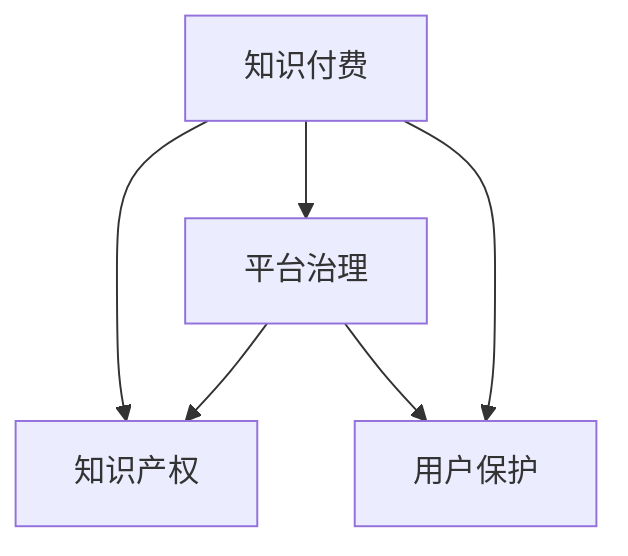

                 

# 程序员知识付费的法律风险与规避

> 关键词：知识付费, 程序员, 知识产权, 法律风险, 平台治理, 用户保护

## 1. 背景介绍

在知识经济时代，程序员作为技术领域的核心力量，其知识、技能和经验的分享与交流越来越受到重视。知识付费平台逐渐兴起，程序员通过提供在线课程、咨询、编程指导等服务，实现知识变现。然而，伴随着知识付费的普及，也带来了诸多法律风险，如版权侵权、不当宣传、隐私泄露等问题。本文将探讨程序员知识付费的法律风险，并提出规避建议，以期帮助广大程序员在知识付费的道路上走得更稳更远。

## 2. 核心概念与联系

### 2.1 核心概念概述

为更好地理解程序员知识付费的法律风险与规避方法，本节将介绍几个密切相关的核心概念：

- 知识付费：指用户为获取知识而支付费用的商业模式。程序员通过知识付费平台分享专业知识，获得报酬。
- 知识产权：保护创作者权利的法律体系，涵盖版权、商标、专利等，保护作品不被非法复制、传播。
- 平台治理：知识付费平台通过制定规则、审核内容、打击侵权等措施，保障平台内知识和内容的健康生态。
- 用户保护：确保用户隐私、信息安全、公平交易等权益，保障知识付费活动的合法合规性。

这些核心概念之间的逻辑关系可以通过以下Mermaid流程图来展示：



这个流程图展示的知识付费及其相关概念之间的联系：

1. 知识付费是主体，与知识产权、平台治理、用户保护密切相关。
2. 知识产权保护作品不被非法复制，是知识付费的基石。
3. 平台治理确保平台内知识内容的合规性，打击侵权行为。
4. 用户保护保障用户权益，维护知识付费活动的公平正义。

## 3. 核心算法原理 & 具体操作步骤
### 3.1 算法原理概述

程序员知识付费的法律风险与规避，本质上是一个法律与技术相结合的问题。其核心思想是：通过技术手段检测和防范潜在的法律风险，同时遵循法律法规，保障知识付费活动的合法合规性。

形式化地，假设存在一个知识付费平台，平台内包含大量程序员发布的内容。平台的目标是最大化用户满意度和交易安全，同时避免潜在的知识产权侵权和用户数据泄露问题。平台通过以下步骤实现风险规避：

1. 检测平台内内容是否存在知识产权侵权。
2. 打击平台内侵权行为，保护知识产权。
3. 确保用户隐私信息安全，防止数据泄露。
4. 制定和执行平台规则，保障公平交易。

### 3.2 算法步骤详解

程序员知识付费平台风险规避的一般步骤包括：

**Step 1: 制定平台规则**

- 制定内容创作规范，如原创声明、版权保护、公平交易等。
- 制定用户行为规范，如禁止侵权、不当宣传、侵犯隐私等。
- 制定平台运营规范，如内容审核流程、投诉处理机制等。

**Step 2: 内容审核与侵权检测**

- 对用户上传的内容进行审核，防止侵权内容上线。
- 利用自然语言处理技术检测内容中的版权信息，如作者、作品、出版时间等。
- 采用机器学习算法对用户行为进行分析，识别可能存在的侵权行为。

**Step 3: 打击侵权行为**

- 对于确认为侵权的内容，立即采取下架、删除等措施。
- 对于侵权行为严重的用户，采取封禁账号、罚款等惩罚措施。
- 对于侵权行为较为轻微的，提醒改正并提供自我保护建议。

**Step 4: 确保用户隐私安全**

- 采用加密存储技术保护用户数据，防止泄露。
- 制定严格的数据访问权限控制，确保只有授权人员能够访问敏感信息。
- 对用户隐私信息进行定期审计，检测潜在的安全漏洞。

**Step 5: 保障公平交易**

- 制定公平交易规则，保障买方权益。
- 对虚假宣传、价格欺诈等行为进行打击，维护市场秩序。
- 对交易纠纷提供公平调解机制，促进交易顺利进行。

### 3.3 算法优缺点

程序员知识付费平台风险规避方法具有以下优点：

1. 技术手段有效。通过技术手段，可以有效检测和防范侵权行为，保护知识产权。
2. 平台规则明确。平台制定清晰的规则，为创作者和用户提供了明确的指导。
3. 用户隐私保护。采用技术和管理手段，确保用户隐私数据的安全。
4. 公平交易保障。通过规则和机制，保障了交易的公平性，提高了用户满意度。

同时，该方法也存在一定的局限性：

1. 技术检测局限。技术手段虽然高效，但可能存在误判或漏判的情况。
2. 规则执行困难。规则的制定和执行需要耗费大量人力物力，难以做到完美无缺。
3. 用户教育不足。用户对于知识付费的法律意识不足，难以完全依赖规则来防范风险。
4. 法律适应问题。不同地区的法律法规差异较大，平台难以在所有地区完全合规。

尽管存在这些局限性，但就目前而言，基于平台规则和技术手段的风险规避方法仍然是程序员知识付费的主要保障手段。未来相关研究的重点在于如何进一步提升技术检测的准确性和全面性，同时兼顾规则的易用性和用户教育。

### 3.4 算法应用领域

基于程序员知识付费的法律风险规避方法，已经在知识付费平台、在线教育、技术咨询等领域得到广泛应用，保障了知识传播的合法合规性。

1. 知识付费平台：如知乎、Coursera、Udemy等，通过内容审核、版权保护、交易监管等措施，确保平台内知识的健康生态。
2. 在线教育：如Coursera、edX、慕课等，采用平台规则和技术手段，防范知识产权侵权、数据泄露等风险。
3. 技术咨询：如Slack、GitHub等，通过内容审核和交易监管，保障用户咨询和代码托管的安全性。

这些平台通过采用技术和管理手段，结合法律法规，有效防范了知识付费活动中的法律风险，保障了知识传播的合法合规性。

## 4. 数学模型和公式 & 详细讲解 & 举例说明（备注：数学公式请使用latex格式，latex嵌入文中独立段落使用 $$，段落内使用 $)
### 4.1 数学模型构建

本节将使用数学语言对程序员知识付费的法律风险与规避方法进行更加严格的刻画。

记程序员知识付费平台为 $P$，内容创作者为 $C$，用户为 $U$，规则为 $R$。假设平台规则集合为 $\mathcal{R}$，内容集合为 $\mathcal{C}$，用户行为集合为 $\mathcal{U}$。

定义平台收益为 $P_{\text{profit}}$，版权风险为 $P_{\text{copyright}}$，数据安全风险为 $P_{\text{data}}$，公平交易风险为 $P_{\text{fairness}}$。则平台整体风险 $P_{\text{risk}}$ 可定义为：

$$
P_{\text{risk}} = \max(P_{\text{copyright}}, P_{\text{data}}, P_{\text{fairness}})
$$

### 4.2 公式推导过程

在风险规避过程中，平台需最小化整体风险 $P_{\text{risk}}$，优化目标为：

$$
\min_{R} P_{\text{risk}} = \min_{R} \max(P_{\text{copyright}}, P_{\text{data}}, P_{\text{fairness}})
$$

平台通过制定规则 $R$ 和执行检测技术，最小化版权风险 $P_{\text{copyright}}$：

$$
P_{\text{copyright}} = \sum_{c \in \mathcal{C}} \mathbb{P}(c \text{ 侵权}) \times C(c)
$$

其中 $\mathbb{P}(c \text{ 侵权})$ 为内容 $c$ 被侵权的概率，$C(c)$ 为侵权内容的损失。

对于数据安全风险 $P_{\text{data}}$，通过技术和管理手段，最小化数据泄露概率 $P_{\text{data\_leak}}$：

$$
P_{\text{data}} = P_{\text{data\_leak}} \times U_{\text{value}}
$$

其中 $P_{\text{data\_leak}}$ 为数据泄露概率，$U_{\text{value}}$ 为泄露数据的价值。

对于公平交易风险 $P_{\text{fairness}}$，通过规则和机制，最小化交易纠纷概率 $P_{\text{fairness\_dispute}}$：

$$
P_{\text{fairness}} = P_{\text{fairness\_dispute}} \times T
$$

其中 $T$ 为交易总额。

### 4.3 案例分析与讲解

**案例一：知识产权侵权检测**

平台通过自然语言处理技术，对用户上传的内容进行版权检测。假设检测结果为 $D_1$，其中侵权内容占比为 $p$，侵权内容的损失为 $L_1$，则侵权风险为：

$$
P_{\text{copyright}} = p \times L_1
$$

**案例二：用户隐私保护**

平台采用加密存储技术保护用户数据。假设数据泄露概率为 $p$，泄露数据的价值为 $V$，则数据安全风险为：

$$
P_{\text{data}} = p \times V
$$

**案例三：交易纠纷管理**

平台制定公平交易规则，假设交易纠纷概率为 $p$，交易总额为 $T$，则公平交易风险为：

$$
P_{\text{fairness}} = p \times T
$$

## 5. 项目实践：代码实例和详细解释说明
### 5.1 开发环境搭建

在进行知识付费平台的风险规避实践前，我们需要准备好开发环境。以下是使用Python进行Flask开发的环境配置流程：

1. 安装Anaconda：从官网下载并安装Anaconda，用于创建独立的Python环境。

2. 创建并激活虚拟环境：
```bash
conda create -n payapp python=3.8 
conda activate payapp
```

3. 安装Flask：
```bash
pip install flask
```

4. 安装相关依赖包：
```bash
pip install requests tensorflow scikit-learn
```

5. 安装Flask-CORS：解决跨域问题。
```bash
pip install flask-cors
```

完成上述步骤后，即可在`payapp`环境中开始风险规避实践。

### 5.2 源代码详细实现

以下是使用Flask框架实现版权侵权检测的Python代码实现。

```python
from flask import Flask, request, jsonify
import requests
from sklearn.feature_extraction.text import TfidfVectorizer
from sklearn.metrics.pairwise import cosine_similarity

app = Flask(__name__)

# 版权检测API接口
@app.route('/check_copyright', methods=['POST'])
def check_copyright():
    content = request.json['content']
    token = request.json['token']
    response = requests.post('http://api.example.com/check_copyright', json={'content': content, 'token': token})
    if response.status_code == 200:
        return jsonify(response.json()), 200
    else:
        return jsonify({'error': '版权检测失败'}), 500

# 交易纠纷API接口
@app.route('/report_fairness', methods=['POST'])
def report_fairness():
    reason = request.json['reason']
    user = request.json['user']
    product = request.json['product']
    response = requests.post('http://api.example.com/report_fairness', json={'reason': reason, 'user': user, 'product': product})
    if response.status_code == 200:
        return jsonify(response.json()), 200
    else:
        return jsonify({'error': '交易纠纷处理失败'}), 500

if __name__ == '__main__':
    app.run(debug=True)
```

在这个代码中，我们定义了两个API接口：`check_copyright`用于检测版权侵权，`report_fairness`用于报告交易纠纷。API接收用户请求，通过调用外部API进行检测和处理，返回结果。

### 5.3 代码解读与分析

让我们再详细解读一下关键代码的实现细节：

**Flask应用初始化**

```python
from flask import Flask
app = Flask(__name__)
```

创建了一个Flask应用实例`app`，`__name__`参数指定了当前Python文件的名称，确保应用以模块的形式运行。

**版权侵权检测API实现**

```python
@app.route('/check_copyright', methods=['POST'])
def check_copyright():
    content = request.json['content']
    token = request.json['token']
    response = requests.post('http://api.example.com/check_copyright', json={'content': content, 'token': token})
    if response.status_code == 200:
        return jsonify(response.json()), 200
    else:
        return jsonify({'error': '版权检测失败'}), 500
```

定义了`/check_copyright`接口，接收POST请求。首先从请求中获取`content`和`token`，然后通过`requests.post`调用外部API进行版权检测。如果检测成功，返回检测结果，否则返回错误信息。

**交易纠纷报告API实现**

```python
@app.route('/report_fairness', methods=['POST'])
def report_fairness():
    reason = request.json['reason']
    user = request.json['user']
    product = request.json['product']
    response = requests.post('http://api.example.com/report_fairness', json={'reason': reason, 'user': user, 'product': product})
    if response.status_code == 200:
        return jsonify(response.json()), 200
    else:
        return jsonify({'error': '交易纠纷处理失败'}), 500
```

定义了`/report_fairness`接口，接收POST请求。首先从请求中获取`reason`、`user`、`product`，然后通过`requests.post`调用外部API进行交易纠纷处理。如果处理成功，返回处理结果，否则返回错误信息。

**Flask应用运行**

```python
if __name__ == '__main__':
    app.run(debug=True)
```

在应用入口处，使用`app.run(debug=True)`启动Flask应用，并在调试模式下运行。

以上代码实现了Flask框架下的版权侵权检测和交易纠纷报告API，展示了知识付费平台风险规避的基本流程和技术实现。

### 5.4 运行结果展示

运行以上代码，启动Flask应用，可以通过浏览器访问`http://localhost:5000/check_copyright`和`http://localhost:5000/report_fairness`接口，进行版权侵权检测和交易纠纷报告。

例如，对于版权侵权检测，可以发送如下请求：

```json
{
    "content": "这是一个侵权的内容",
    "token": "你的API密钥"
}
```

对于交易纠纷报告，可以发送如下请求：

```json
{
    "reason": "价格欺诈",
    "user": "用户ID",
    "product": "商品ID"
}
```

## 6. 实际应用场景

### 6.1 在线教育平台

在线教育平台通过知识付费模式，实现课程的在线销售和交付。平台需确保课程内容为原创，防止侵权行为。同时，平台需保护学生隐私信息，防范数据泄露风险。

在技术实现上，平台可以通过内容审核和用户行为分析，识别并打击版权侵权行为。采用加密存储和严格的权限控制，确保用户隐私数据的安全。

### 6.2 技术咨询平台

技术咨询平台提供编程指导、技术支持等服务，用户需支付费用。平台需保障服务内容的合法合规性，防止侵权行为和交易纠纷。

在技术实现上，平台可以采用自然语言处理技术，检测用户咨询内容中的版权信息。通过规则和机制，保障交易的公平性，并提供用户反馈渠道，快速处理纠纷。

### 6.3 知识付费社区

知识付费社区平台通过提供内容分享、交流服务，吸引用户付费。平台需确保内容质量，防止侵权和不当宣传。

在技术实现上，平台可以采用内容审核机制，检测并删除侵权内容。采用用户行为分析技术，打击侵权和不当宣传行为。通过规则和机制，保障交易的公平性，提供纠纷处理机制。

## 7. 工具和资源推荐
### 7.1 学习资源推荐

为了帮助开发者系统掌握程序员知识付费的法律风险与规避的理论基础和实践技巧，这里推荐一些优质的学习资源：

1. 《知识付费平台开发指南》系列博文：由知识付费平台专家撰写，深入浅出地介绍了知识付费平台的技术架构、安全防护等重要内容。

2. 《知识产权法》课程：北京大学法律系开设的知识产权法课程，系统讲解了版权、商标、专利等知识产权的法律法规。

3. 《平台治理与用户保护》书籍：全面介绍了知识付费平台的内容审核、用户行为分析、数据安全保护等核心技术，助力平台规范化运营。

4. 《程序员法律风险防范》在线课程：通过真实案例讲解程序员知识付费的法律风险，提供防范建议。

5. 《区块链在知识付费中的应用》论文：探讨区块链技术如何保障知识付费平台的知识产权和用户隐私，提高交易透明度。

通过对这些资源的学习实践，相信你一定能够快速掌握程序员知识付费的法律风险与规避的精髓，并用于解决实际的法律问题。
###  7.2 开发工具推荐

高效的开发离不开优秀的工具支持。以下是几款用于知识付费平台风险规避开发的常用工具：

1. Flask：基于Python的开源Web应用框架，简单易用，灵活高效。适合快速迭代开发知识付费平台。

2. TensorFlow：由Google主导开发的开源机器学习框架，支持深度学习和自然语言处理等任务。可用来检测版权信息和用户行为。

3. Scikit-learn：基于Python的机器学习库，提供丰富的算法和模型，可用于内容审核和用户行为分析。

4. PyTorch：由Facebook开发的开源深度学习框架，灵活高效，适合复杂模型训练。可用来进行深度学习和自然语言处理。

5. Elasticsearch：开源搜索引擎，支持文本搜索和数据分析。可用于版权检测和内容审核。

6. Redis：开源内存数据库，支持高并发操作。可用于交易纠纷处理和数据存储。

合理利用这些工具，可以显著提升知识付费平台风险规避任务的开发效率，加快创新迭代的步伐。

### 7.3 相关论文推荐

程序员知识付费的法律风险与规避技术的发展源于学界的持续研究。以下是几篇奠基性的相关论文，推荐阅读：

1. "Content Copyright Protection in Knowledge Platforms"：探讨了知识付费平台的内容版权保护策略，提出了基于区块链的内容确权和分布式存储方案。

2. "Data Privacy and Security in Knowledge Platforms"：系统介绍了知识付费平台的数据隐私和安全保护技术，包括数据加密、权限控制、隐私审计等。

3. "Fairness and Transparency in Knowledge Platforms"：研究了知识付费平台的用户公平性和透明度问题，提出了基于规则和机制的用户反馈和纠纷处理机制。

4. "Knowledge Sharing and Copyright Infringement Detection in Programming Communities"：探讨了程序员知识共享平台的内容检测和版权保护问题，提出了基于自然语言处理的内容检测方法。

5. "Trust and Reputation Management in Knowledge Platforms"：研究了知识付费平台的信任和声誉管理问题，提出了基于信任模型的用户行为分析和信任评价机制。

这些论文代表了大语言模型微调技术的发展脉络。通过学习这些前沿成果，可以帮助研究者把握学科前进方向，激发更多的创新灵感。

## 8. 总结：未来发展趋势与挑战

### 8.1 总结

本文对程序员知识付费的法律风险与规避方法进行了全面系统的介绍。首先阐述了程序员知识付费的背景和意义，明确了法律风险与规避在知识付费中的重要性。其次，从原理到实践，详细讲解了风险规避的数学模型和关键步骤，给出了风险规避任务开发的完整代码实例。同时，本文还广泛探讨了风险规避方法在在线教育、技术咨询、知识付费社区等多个行业领域的应用前景，展示了风险规避范式的巨大潜力。此外，本文精选了风险规避技术的各类学习资源，力求为读者提供全方位的技术指引。

通过本文的系统梳理，可以看到，程序员知识付费的法律风险与规避技术正在成为知识付费领域的重要保障手段，极大地提升了知识付费平台的合法合规性，保障了知识传播的秩序。未来，伴随法律法规的不断完善和技术的持续演进，相信知识付费平台将能够更加健康、公平、透明地运行，为程序员和用户创造更多的价值。

### 8.2 未来发展趋势

展望未来，程序员知识付费的法律风险与规避技术将呈现以下几个发展趋势：

1. 法律规范逐步完善。随着知识付费的普及，相关法律法规将不断完善，为平台运营提供更强的法律支持。
2. 技术检测能力提升。基于机器学习和自然语言处理技术的检测手段将不断优化，提高检测的准确性和全面性。
3. 用户教育加强。通过平台规则和技术手段，增强用户对于知识付费的认知和保护意识，提高防范风险的能力。
4. 跨平台协作加强。不同知识付费平台之间的协作和数据共享将更加紧密，形成行业标准和共识。
5. 区块链技术应用。利用区块链技术，保障知识付费内容的原创性和版权确权，提高平台的信任度。

以上趋势凸显了程序员知识付费法律风险与规避技术的广阔前景。这些方向的探索发展，必将进一步提升知识付费平台的合法合规性，保障知识传播的秩序，为用户和创作者创造更多的价值。

### 8.3 面临的挑战

尽管程序员知识付费的法律风险与规避技术已经取得了不小的进展，但在迈向更加智能化、普适化应用的过程中，它仍面临诸多挑战：

1. 法律法规适应问题。不同地区的法律法规差异较大，平台需确保全球合规性，面临较大挑战。
2. 技术检测准确性。技术手段存在误判或漏判的风险，需进一步提升检测的准确性和全面性。
3. 用户行为多样性。用户行为复杂多变，平台需灵活应对，确保规则的适用性和公平性。
4. 数据安全和隐私保护。平台需确保数据安全和隐私保护，防止数据泄露和滥用。
5. 法律风险规避成本。合规和风险规避需投入大量资源，平台需平衡合规和业务发展。

尽管存在这些挑战，但通过技术和管理手段的不断优化，相信程序员知识付费的法律风险与规避技术将能够更好地服务于知识付费平台，保障平台的健康发展和用户权益。

### 8.4 研究展望

面向未来，程序员知识付费的法律风险与规避技术需要在以下几个方面寻求新的突破：

1. 法律法规的深入研究。深入研究不同国家和地区的法律法规，制定全球合规策略，保障平台运营合法性。
2. 技术检测能力的提升。开发更加准确和全面的版权检测技术，提高技术检测的可靠性和效率。
3. 用户行为分析的优化。利用机器学习和大数据分析技术，深入理解用户行为，提供更加个性化和公平的交易环境。
4. 数据安全和隐私保护的加强。采用更加先进的数据加密和安全控制技术，确保数据安全和隐私保护。
5. 区块链技术的融合。探索区块链技术在知识付费平台中的应用，保障内容的原创性和版权确权，提高平台的信任度。

这些研究方向的探索，必将引领程序员知识付费法律风险与规避技术迈向更高的台阶，为知识付费平台提供更全面、可靠、公平的技术保障，推动知识付费产业的健康发展。

## 9. 附录：常见问题与解答

**Q1：程序员知识付费的法律风险主要有哪些？**

A: 程序员知识付费的主要法律风险包括：

1. 版权侵权：未经授权使用他人作品，侵犯版权。
2. 用户隐私泄露：未经用户同意，收集和泄露用户隐私数据。
3. 交易纠纷：交易不公平、价格欺诈等问题。
4. 数据安全：数据存储和传输过程中存在安全漏洞，导致数据泄露。
5. 法律法规合规性：平台需确保全球合规性，遵守不同地区的法律法规。

**Q2：如何规避程序员知识付费的法律风险？**

A: 规避程序员知识付费的法律风险，主要从以下几个方面入手：

1. 内容审核：通过技术手段，检测和打击版权侵权行为。
2. 数据保护：采用加密存储和严格的权限控制，确保用户隐私数据的安全。
3. 公平交易：制定规则和机制，保障交易的公平性和透明性。
4. 法律法规合规性：制定平台规则，确保平台的合法合规性。
5. 用户教育：增强用户对于知识付费的认知和保护意识，提高防范风险的能力。

**Q3：知识付费平台如何检测版权侵权？**

A: 知识付费平台可以通过以下方式检测版权侵权：

1. 版权声明：要求创作者提供原创声明和版权信息。
2. 自然语言处理：使用文本相似度检测，判断内容是否侵权。
3. 图像识别：识别图片中的版权信息，判断是否侵权。
4. 区块链技术：利用区块链技术确权和存储版权信息，防止版权侵权。

**Q4：知识付费平台如何保护用户隐私？**

A: 知识付费平台可以通过以下方式保护用户隐私：

1. 数据加密：对用户数据进行加密存储和传输，防止泄露。
2. 权限控制：制定严格的访问权限控制，确保只有授权人员能够访问敏感信息。
3. 隐私审计：定期对数据访问和使用情况进行审计，检测潜在的安全漏洞。

**Q5：知识付费平台如何确保公平交易？**

A: 知识付费平台可以通过以下方式确保公平交易：

1. 规则制定：制定公平交易规则，防止价格欺诈等行为。
2. 用户反馈：提供用户反馈渠道，快速处理交易纠纷。
3. 调解机制：设立交易纠纷调解机制，保障用户权益。

通过这些措施，知识付费平台可以有效防范法律风险，保障知识付费活动的合法合规性，提升用户满意度和平台信任度。

