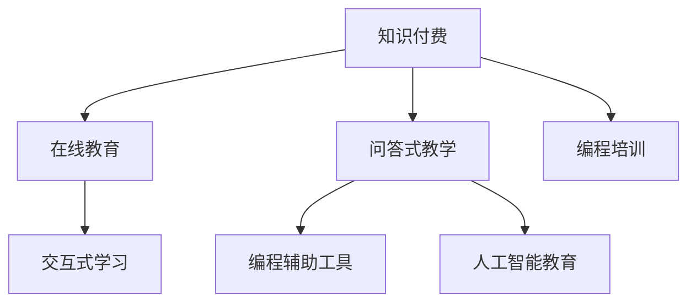

                 

# 程序员知识付费：打造问答式教学

> 关键词：知识付费,问答式教学,在线教育,编程培训,交互式学习,编程辅助工具,人工智能教育

## 1. 背景介绍

### 1.1 问题由来
随着互联网和数字技术的发展，知识付费作为一种新兴的学习模式，逐渐进入大众视野。特别是在程序员这一群体中，由于其职业属性和技术特点，传统的教育模式已难以满足其学习和培训需求。知识付费提供了一种更加灵活、高效的学习途径，受到越来越多程序员的青睐。然而，传统的知识付费方式往往局限于视频课程、电子书等静态内容，无法提供互动和实时的学习体验。问答式教学作为一种互动性更强的学习模式，正在成为知识付费市场的新趋势。

### 1.2 问题核心关键点
问答式教学的核心在于构建一个具有高效互动、实时反馈的问答平台。通过问答平台，学员可以随时向教师提问，获得即时解答，促进知识的吸收和理解。这种教学模式不仅能够提升学习效率，还能够激发学员的自主学习兴趣，使得学习过程更加生动有趣。

### 1.3 问题研究意义
问答式教学在程序员知识付费领域的应用，对于提升编程技能、加速职业发展、促进知识传播等方面具有重要意义：

1. **提升编程技能**：通过实时互动和即时反馈，问答式教学能够帮助学员更快地理解和掌握编程知识，解决学习中的疑难问题，提升编程实践能力。
2. **加速职业发展**：问答式教学能够提供个性化的指导和建议，帮助学员明确职业发展方向，快速成长为技术骨干或专家。
3. **促进知识传播**：问答式教学不仅能够提升学员的知识储备，还能够通过学员的提问和解答，将知识传播给更多的人群，促进技术知识的普及和应用。

## 2. 核心概念与联系

### 2.1 核心概念概述

为了更好地理解问答式教学的核心概念，本节将介绍几个密切相关的核心概念：

- **知识付费**：指通过付费的方式获取专业知识，提升自身技能和知识水平。知识付费主要包括在线课程、电子书、问答平台等多种形式。
- **问答式教学**：指通过问答平台，学员可以随时向教师提问，获得即时解答，促进知识的吸收和理解的教学模式。
- **在线教育**：指通过互联网进行的学习和教学活动，具有灵活性、可访问性高等优点。
- **编程培训**：指针对编程语言、技术框架、算法设计等编程相关知识的培训和学习。
- **交互式学习**：指通过互动、反馈和即时评估，提升学习效率和质量的学习方式。
- **编程辅助工具**：指辅助程序员进行代码编写、调试、测试等活动的软件工具，如IDE、调试器、版本控制工具等。
- **人工智能教育**：指利用人工智能技术进行教育和学习活动，如自适应学习、智能推荐、智能评估等。

这些核心概念之间的逻辑关系可以通过以下Mermaid流程图来展示：



这个流程图展示了大语言模型微调的核心概念及其之间的关系：

1. 知识付费通过在线教育和问答式教学，提供灵活、高效的学习方式。
2. 在线教育结合编程培训，提升程序员的编程技能和职业素养。
3. 问答式教学通过交互式学习，促进知识的吸收和理解。
4. 编程培训结合编程辅助工具，提升编程实践能力。
5. 人工智能教育通过自适应学习、智能推荐、智能评估等手段，提升学习效率和质量。

这些概念共同构成了问答式教学的学习框架，使其能够在各种场景下发挥强大的教育作用。通过理解这些核心概念，我们可以更好地把握问答式教学的工作原理和优化方向。

## 3. 核心算法原理 & 具体操作步骤
### 3.1 算法原理概述

问答式教学的算法原理主要基于自然语言处理(NLP)和机器学习(ML)技术。其核心思想是：通过构建一个问答系统，将教师的解答生成和学员的提问输入进行匹配，实现实时互动和即时反馈。

形式化地，假设问答系统由问答引擎 $E$ 和知识库 $K$ 组成。问答引擎 $E$ 接收学员的提问 $q$，从知识库 $K$ 中检索出最相关的答案 $a$，并生成回答 $r$。问答过程的数学模型可以表示为：

$$
r = E(q, K)
$$

其中 $r$ 为回答，$q$ 为提问，$K$ 为知识库。

### 3.2 算法步骤详解

问答式教学的算法步骤主要包括以下几个关键环节：

**Step 1: 准备知识库和模型**
- 收集和整理程序员常见的编程问题、技术难点、解决方案等信息，构建知识库 $K$。
- 选择适合的自然语言处理模型（如BERT、GPT等）作为问答引擎 $E$ 的基础模型，通过预训练和微调，使其具备高效的问答能力。

**Step 2: 构建问答系统**
- 设计问答系统的交互界面，提供学员提问和教师回答的通道。
- 实现自然语言理解和生成的功能，将学员的提问转换为结构化表示，并将答案生成为自然语言文本。

**Step 3: 优化问答引擎**
- 应用正则化技术、模型蒸馏、对抗训练等方法，提升问答引擎的准确性和鲁棒性。
- 通过自动评估和用户反馈，不断优化问答引擎的性能。

**Step 4: 数据收集与分析**
- 收集问答系统使用过程中的数据，包括提问、回答、用户评分等，用于模型的持续优化和改进。
- 通过数据分析，识别常见问题和难点，及时更新知识库 $K$，增强系统的覆盖面。

**Step 5: 用户反馈与迭代**
- 提供学员对问答结果的评分和反馈机制，根据用户反馈不断优化问答系统。
- 定期进行系统迭代和更新，保持系统的时效性和适应性。

以上是问答式教学的算法步骤，通过这些步骤，可以构建一个高效、智能的问答系统，提升程序员的知识获取和技能提升。

### 3.3 算法优缺点

问答式教学的算法具有以下优点：
1. 即时互动：通过实时互动，学员能够即时获取解答，提升学习效率。
2. 个性化指导：教师能够根据学员的具体问题和背景，提供个性化的指导和建议。
3. 动态更新：通过不断收集和更新知识库，问答系统能够保持最新的技术动态和知识储备。
4. 高可用性：问答系统可以24小时在线，提供不间断的服务。
5. 灵活性：学员可以随时随地访问问答系统，不受时间和地点限制。

同时，该算法也存在一些局限性：
1. 对教师要求高：问答式教学需要教师具备丰富的编程经验和教学经验，教师的素质直接影响教学效果。
2. 知识库质量受限：知识库的构建需要大量时间和精力，难以完全覆盖所有问题。
3. 对技术要求高：问答系统的开发和维护需要较高的技术水平，特别是自然语言处理和机器学习方面的专业知识。
4. 数据隐私问题：问答系统的数据收集和存储涉及用户隐私，需要采取相应的数据保护措施。

尽管存在这些局限性，但问答式教学仍是一种高效、灵活的知识付费方式，能够显著提升程序员的学习效果。

### 3.4 算法应用领域

问答式教学在程序员知识付费领域具有广泛的应用前景，主要包括以下几个方面：

- **编程学习**：通过问答系统，学员可以随时向教师提问，获取编程问题的解答和指导，提升编程技能。
- **技术交流**：问答式教学提供了一个交流平台，程序员可以在此分享经验、讨论问题，形成技术社区。
- **职业发展**：问答系统能够提供个性化的职业建议和指导，帮助学员明确职业发展方向，提升职业素养。
- **项目协作**：问答式教学可以用于团队协作，通过共享知识和解决方案，提升团队的工作效率和协作能力。
- **学习评估**：问答系统可以记录学员的学习行为和问题，生成学习报告，评估学习效果和进步。

## 4. 数学模型和公式 & 详细讲解  
### 4.1 数学模型构建

问答式教学的数学模型主要基于自然语言处理和机器学习技术。以下是几个关键模型和算法的介绍：

- **BERT模型**：BERT模型是一种基于双向Transformer的预训练语言模型，通过在大规模无标签文本数据上进行预训练，学习通用的语言表示。

- **Transformer模型**：Transformer模型是一种自注意力机制的神经网络结构，能够高效地处理长序列数据，广泛用于自然语言处理任务。

- **注意力机制**：注意力机制是一种通过计算每个输入的注意力权重，来决定如何加权处理输入的机制。在问答系统中，注意力机制可以帮助模型关注到与提问最相关的答案片段。

- **序列标注模型**：序列标注模型是一种序列到序列的模型，用于将序列数据标注为特定的标签。在问答系统中，序列标注模型可以用于将提问和答案进行匹配。

### 4.2 公式推导过程

以下是对问答式教学中几个关键模型的公式推导过程：

**BERT模型**：

假设输入序列为 $X=\{x_1, x_2, ..., x_n\}$，输出序列为 $Y=\{y_1, y_2, ..., y_m\}$。BERT模型的输入层将输入序列编码为向量表示 $X_v = [x_1, x_2, ..., x_n]$。输出层将输出序列编码为向量表示 $Y_v = [y_1, y_2, ..., y_m]$。

**Transformer模型**：

Transformer模型的自注意力机制可以表示为：

$$
\text{Attention}(Q, K, V) = \text{Softmax}(\frac{QK^T}{\sqrt{d_k}})V
$$

其中 $Q$ 为查询矩阵，$K$ 为键矩阵，$V$ 为值矩阵，$d_k$ 为键矩阵的维度。

**注意力机制**：

在问答系统中，注意力机制可以通过计算提问 $q$ 与知识库 $K$ 中每个答案片段 $a_i$ 的注意力权重 $\alpha_i$，来决定答案片段 $a_i$ 的重要程度：

$$
\alpha_i = \text{Softmax}(\frac{qK_i^T}{\sqrt{d_k}})
$$

**序列标注模型**：

序列标注模型可以通过神经网络模型将序列数据标注为特定的标签。假设输入序列为 $X=\{x_1, x_2, ..., x_n\}$，输出标签为 $Y=\{y_1, y_2, ..., y_m\}$。序列标注模型的输入层将输入序列编码为向量表示 $X_v = [x_1, x_2, ..., x_n]$。输出层将输出序列编码为向量表示 $Y_v = [y_1, y_2, ..., y_m]$。

### 4.3 案例分析与讲解

**案例一：编程问题问答**

假设学员提问为“Python中如何实现多线程编程？”，知识库中包含以下答案片段：

- 多线程编程可以使用Thread模块。
- Python中的多线程编程需要定义线程函数，并创建Thread对象。
- 多线程编程需要注意线程安全和数据共享问题。

通过Transformer模型和注意力机制，问答系统可以计算出提问与答案片段的注意力权重，并生成最相关的答案：“多线程编程可以使用Thread模块。”

**案例二：技术难点解决**

假设学员提问为“如何使用Docker进行容器化部署？”，知识库中包含以下答案片段：

- Docker是一种容器化技术，可以封装应用程序及其依赖项。
- 使用Docker镜像进行容器化部署，可以避免环境依赖问题。
- Docker的容器化部署需要配置Dockerfile。

通过BERT模型和序列标注模型，问答系统可以将提问和答案片段进行匹配，并生成最佳答案：“Docker是一种容器化技术，可以封装应用程序及其依赖项。”

## 5. 项目实践：代码实例和详细解释说明
### 5.1 开发环境搭建

在进行问答式教学项目开发前，需要先准备好开发环境。以下是使用Python进行Flask框架开发的流程：

1. 安装Python：从官网下载并安装Python，确保版本为3.8及以上。

2. 安装Flask：使用pip命令安装Flask框架，即 `pip install Flask`。

3. 安装SQLAlchemy：用于数据库连接和数据操作，使用 `pip install SQLAlchemy`。

4. 安装Flask-SQLAlchemy：用于Flask与SQLAlchemy的集成，使用 `pip install Flask-SQLAlchemy`。

5. 安装Flask-WTF：用于表单验证，使用 `pip install Flask-WTF`。

6. 安装Flask-RESTful：用于构建RESTful风格的API接口，使用 `pip install Flask-RESTful`。

完成上述步骤后，即可在本地环境中开始问答式教学项目的开发。

### 5.2 源代码详细实现

我们以一个简单的问答系统为例，给出使用Flask框架进行开发的代码实现。

首先，定义SQLite数据库连接和模型：

```python
from flask import Flask
from flask_sqlalchemy import SQLAlchemy

app = Flask(__name__)
app.config['SQLALCHEMY_DATABASE_URI'] = 'sqlite:///questions.db'
app.config['SQLALCHEMY_TRACK_MODIFICATIONS'] = False
db = SQLAlchemy(app)

class Question(db.Model):
    id = db.Column(db.Integer, primary_key=True)
    question = db.Column(db.String(255))
    answer = db.Column(db.String(255))
    difficulty = db.Column(db.Integer)

db.create_all()
```

接着，定义RESTful API接口：

```python
from flask_restful import Resource, Api

api = Api(app)

class Questions(Resource):
    def get(self):
        questions = Question.query.all()
        return {'questions': [{"id": q.id, "question": q.question, "answer": q.answer, "difficulty": q.difficulty} for q in questions]}

    def post(self):
        data = request.get_json()
        question = Question(question=data['question'], answer=data['answer'], difficulty=data['difficulty'])
        db.session.add(question)
        db.session.commit()
        return {'message': 'Question added'}, 201

api.add_resource(Questions, '/questions')
```

最后，启动Flask应用：

```python
if __name__ == '__main__':
    app.run(debug=True)
```

以上就是一个简单的问答系统开发代码实现。可以看到，通过Flask框架，我们能够快速搭建一个RESTful风格的API接口，实现问答系统的基本功能。

### 5.3 代码解读与分析

让我们再详细解读一下关键代码的实现细节：

**SQLite数据库连接和模型**：
- 使用Flask-SQLAlchemy库，连接SQLite数据库，并定义了一个名为Question的模型，包含问题、答案和难度三个字段。

**RESTful API接口**：
- 使用Flask-RESTful库，定义了两个API接口：`/get_questions`用于获取所有问题，`/post_question`用于添加新问题。
- 通过request.get_json()获取前端发送的数据，并使用ORM将数据保存到数据库中。

**Flask应用启动**：
- 通过if __name__ == '__main__'判断是否为模块导入，使用app.run(debug=True)启动Flask应用。

这些代码实现了问答系统基本的CRUD（创建、读取、更新、删除）功能，使得开发人员可以快速构建一个简单的问答系统原型。当然，在实际应用中，还需要进一步优化和扩展，如添加用户认证、缓存机制、搜索功能等，以满足更高的需求。

## 6. 实际应用场景
### 6.1 编程培训

问答式教学在编程培训中的应用，可以提供即时、个性化的编程指导。学员可以在学习过程中随时提出问题，得到教师的即时解答和建议，促进知识的吸收和理解。

在具体的实现上，可以结合在线编程环境（如Jupyter Notebook、Google Colab等），实时展示编程过程和结果，使学习过程更加生动直观。同时，通过数据收集和分析，系统可以生成学习报告，评估学员的学习效果和进步。

### 6.2 技术支持

问答式教学可以为IT团队提供技术支持和故障排除服务。技术人员可以在问答平台上发布技术问题，获得同事的即时解答和建议，迅速解决技术难题。

在实际应用中，系统可以集成IT团队的常用工具和技术文档，提供一站式的技术支持服务。同时，通过数据收集和分析，系统可以识别常见问题和技术难点，及时更新知识库，提升技术支持的服务质量和效率。

### 6.3 社区交流

问答式教学可以构建技术社区，提供程序员交流和分享经验的平台。学员可以在问答系统中发布技术问题，得到其他程序员的解答和建议，形成一个活跃的技术交流圈。

在具体的实现上，可以结合社交网络功能，如点赞、评论、分享等，增强社区的互动性。同时，通过数据收集和分析，系统可以识别技术热点和趋势，引导社区成员进行深度讨论和学习。

### 6.4 未来应用展望

随着问答式教学的不断发展和完善，未来将会在更多领域得到应用，为教育、技术支持、社区交流等提供新的解决方案：

- **教育领域**：问答式教学可以提供个性化、实时的学习指导，提升学习效率和效果。特别是在在线教育中，问答系统可以成为教师和学生之间互动的重要工具。
- **技术支持**：问答式教学可以为IT团队提供高效的技术支持和故障排除服务，提升工作效率和质量。特别是在大型企业中，问答系统可以成为IT团队的重要辅助工具。
- **社区交流**：问答式教学可以构建技术社区，提供程序员交流和分享经验的平台，增强社区的凝聚力和活跃度。特别是在开源社区和开发者联盟中，问答系统可以成为社区成员互动的重要工具。

总之，问答式教学具有广阔的应用前景，可以不断拓展其应用场景，提升技术教育、技术支持和社区交流的效果和质量。

## 7. 工具和资源推荐
### 7.1 学习资源推荐

为了帮助开发者系统掌握问答式教学的理论基础和实践技巧，这里推荐一些优质的学习资源：

1. **《自然语言处理入门》**：一本经典的自然语言处理教材，涵盖了自然语言处理的基本概念和常用算法，适合初学者入门。
2. **《机器学习实战》**：一本实用的机器学习实战书籍，通过具体案例介绍机器学习模型的开发和应用，适合进阶学习。
3. **《Python自然语言处理》**：一本介绍Python自然语言处理库和工具的书籍，适合编程开发和实践。
4. **《Flask Web开发实战》**：一本介绍Flask框架和Web开发实战的书籍，适合Flask框架开发入门。
5. **Kaggle**：一个知名的数据科学和机器学习竞赛平台，提供大量的数据集和案例，适合实践和竞赛。

通过对这些资源的学习实践，相信你一定能够快速掌握问答式教学的精髓，并用于解决实际的编程培训、技术支持和社区交流问题。

### 7.2 开发工具推荐

高效的开发离不开优秀的工具支持。以下是几款用于问答式教学开发的常用工具：

1. **Flask**：基于Python的Web开发框架，简单易用，适合开发RESTful风格的API接口。
2. **SQLAlchemy**：Python的数据库ORM库，支持多种数据库，适合数据库连接和数据操作。
3. **SQLite**：轻量级的关系型数据库，适合开发小型项目和原型。
4. **Jupyter Notebook**：Python的交互式编程环境，适合在线编程和数据探索。
5. **Google Colab**：谷歌提供的在线Jupyter Notebook环境，免费提供GPU/TPU算力，适合快速实验和分享学习笔记。

合理利用这些工具，可以显著提升问答式教学的开发效率，加快创新迭代的步伐。

### 7.3 相关论文推荐

问答式教学的研究源于学界的持续研究。以下是几篇奠基性的相关论文，推荐阅读：

1. **《基于知识图谱的问答系统研究》**：介绍了一种基于知识图谱的问答系统，通过实体识别和关系抽取，提升问答系统的准确性和鲁棒性。
2. **《序列标注模型在问答系统中的应用》**：介绍了序列标注模型在问答系统中的作用，通过序列标注，将提问和答案进行匹配，提升系统的准确性。
3. **《深度学习在问答系统中的应用》**：介绍了深度学习在问答系统中的作用，通过Transformer模型和注意力机制，提升问答系统的准确性和鲁棒性。
4. **《问答系统的评测与评估》**：介绍了问答系统的评测指标和评估方法，通过自动评测和用户评分，评估问答系统的性能和效果。
5. **《基于语义理解的问答系统》**：介绍了一种基于语义理解的问答系统，通过语义解析和语义推理，提升问答系统的准确性和泛化能力。

这些论文代表了大语言模型微调技术的发展脉络。通过学习这些前沿成果，可以帮助研究者把握学科前进方向，激发更多的创新灵感。

## 8. 总结：未来发展趋势与挑战
### 8.1 总结

本文对问答式教学的知识付费模式进行了全面系统的介绍。首先阐述了问答式教学在程序员知识付费领域的应用背景和核心概念，明确了问答式教学在提升编程技能、加速职业发展、促进知识传播等方面的独特价值。其次，从原理到实践，详细讲解了问答式教学的算法原理和操作步骤，给出了问答式教学项目开发的完整代码实例。同时，本文还广泛探讨了问答式教学在编程培训、技术支持、社区交流等多个领域的应用前景，展示了问答式教学的巨大潜力。

通过本文的系统梳理，可以看到，问答式教学在程序员知识付费领域具有广阔的应用前景，能够显著提升程序员的学习效果和职业素养。

### 8.2 未来发展趋势

展望未来，问答式教学将呈现以下几个发展趋势：

1. **智能化的知识库构建**：未来问答系统将更加智能化，能够自动构建和更新知识库，提升系统的覆盖面和准确性。
2. **交互式学习体验**：未来问答系统将提供更加交互式的学习体验，通过多模态输入和输出，提升学习效果和用户满意度。
3. **个性化学习推荐**：未来问答系统将通过个性化学习推荐，提升学习效率和效果，提供一站式的学习支持。
4. **跨领域知识融合**：未来问答系统将融合跨领域知识，提供更加全面、多维度的知识支持。
5. **自适应学习机制**：未来问答系统将引入自适应学习机制，根据学员的学习情况，动态调整学习计划和内容，提升学习效果。

以上趋势凸显了问答式教学的广阔前景。这些方向的探索发展，必将进一步提升程序员的知识获取和技能提升，推动技术教育的创新和发展。

### 8.3 面临的挑战

尽管问答式教学已经取得了显著成就，但在迈向更加智能化、个性化应用的过程中，它仍面临诸多挑战：

1. **对教师要求高**：问答式教学需要教师具备丰富的编程经验和教学经验，教师的素质直接影响教学效果。
2. **知识库质量受限**：知识库的构建需要大量时间和精力，难以完全覆盖所有问题。
3. **技术要求高**：问答系统的开发和维护需要较高的技术水平，特别是自然语言处理和机器学习方面的专业知识。
4. **数据隐私问题**：问答系统的数据收集和存储涉及用户隐私，需要采取相应的数据保护措施。

尽管存在这些挑战，但问答式教学仍是一种高效、灵活的知识付费方式，能够显著提升程序员的学习效果。

### 8.4 研究展望

面对问答式教学所面临的挑战，未来的研究需要在以下几个方面寻求新的突破：

1. **知识库智能化构建**：通过自动构建和更新知识库，提升系统的覆盖面和准确性。
2. **个性化学习推荐**：通过个性化学习推荐，提升学习效率和效果，提供一站式的学习支持。
3. **跨领域知识融合**：融合跨领域知识，提供更加全面、多维度的知识支持。
4. **自适应学习机制**：引入自适应学习机制，根据学员的学习情况，动态调整学习计划和内容，提升学习效果。
5. **跨模态交互设计**：设计跨模态交互方式，提升学习体验和用户满意度。
6. **数据隐私保护**：采取相应的数据保护措施，确保数据隐私和安全。

这些研究方向的探索，必将引领问答式教学技术迈向更高的台阶，为构建智能、个性化的学习平台提供新的思路和技术路径。

## 9. 附录：常见问题与解答

**Q1：问答式教学对教师要求高，如何解决这个问题？**

A: 未来问答式教学将引入自动化教师辅助系统，通过人工智能技术，帮助教师解决复杂问题，提升教学效率和质量。同时，系统也可以自动记录教师的解答，生成教学材料和视频，供学员学习参考。

**Q2：问答式教学的数据库构建需要大量时间和精力，如何解决这个问题？**

A: 未来问答系统将通过自动化知识库构建和更新机制，提升知识库的覆盖面和准确性。系统可以通过自动标注、用户投票等机制，不断收集和更新知识库，保持系统的时效性和准确性。

**Q3：问答式教学的技术要求高，如何解决这个问题？**

A: 未来问答系统将通过开源社区和开发者联盟，吸引更多技术专家和研究人员参与，提升系统的技术水平和稳定性。同时，系统也将不断引入最新技术，如深度学习、自然语言处理等，提升系统的智能化和自动化水平。

**Q4：问答式教学的数据隐私问题如何解决？**

A: 问答式教学将采取严格的数据保护措施，确保用户隐私和数据安全。系统将采用数据脱敏、加密传输等技术，防止数据泄露和滥用。同时，系统也将通过用户授权和隐私协议，确保用户数据的合法使用。

**Q5：问答式教学的未来发展方向是什么？**

A: 未来问答式教学将朝着智能化、个性化、自适应化的方向发展。系统将引入人工智能技术和自动化机制，提升学习效率和效果。同时，系统也将不断拓展应用场景，提升技术支持和社区交流的效果和质量。

总之，问答式教学具有广阔的应用前景和巨大的潜力，未来将进一步拓展其应用场景，提升学习效果和用户体验。开发者可以根据实际需求，不断优化和扩展问答系统，为程序员知识付费提供更加高效、灵活、智能的解决方案。

---

作者：禅与计算机程序设计艺术 / Zen and the Art of Computer Programming

