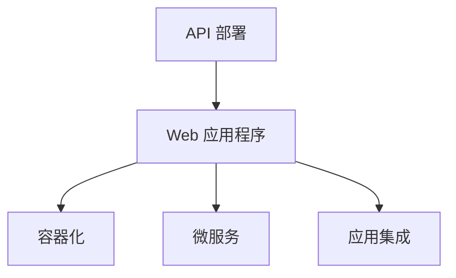

                 

# 第十六章：将 AI 部署为 API 和 Web 应用程序

> 关键词：
- API 部署
- Web 应用程序
- 人工智能
- 模型推理
- 容器化
- 微服务
- 应用集成
- 实时计算

## 1. 背景介绍

### 1.1 问题由来

近年来，人工智能(AI)技术迅猛发展，其在各行业中的应用日益广泛。从医疗影像分析到金融风险预测，从智能客服到智能制造，AI技术的落地场景不断拓展。然而，传统的大型AI模型常常难以直接部署到实际应用场景中，通常需要借助服务化封装的方式，通过API或Web应用程序的形式进行调用。

当前，随着微服务的普及和云计算的发展，将AI模型部署为API或Web应用，已成为了AI应用开发的重要范式。通过API或Web应用，开发人员可以便捷地调用AI模型进行推理计算，而无需深入了解其底层实现细节。同时，通过容器化、微服务等技术，AI模型还可以实现高效的资源管理和灵活的部署策略。

### 1.2 问题核心关键点

本章节旨在系统介绍如何将大AI模型部署为API或Web应用程序，使开发者能够更加便捷地使用AI能力。主要内容包括：

- 引入API和Web应用程序的基本概念和设计原则。
- 解析API和Web应用的核心架构和技术栈。
- 剖析API和Web应用开发的关键步骤和最佳实践。
- 讨论API和Web应用在AI落地场景中的实际应用。

## 2. 核心概念与联系

### 2.1 核心概念概述

为更好地理解API和Web应用程序在AI部署中的作用，本节将介绍几个密切相关的核心概念：

- API（Application Programming Interface）：应用编程接口，定义了应用程序之间交互的规范和协议。API使不同系统的组件可以无缝协作，实现互操作性。
- Web应用程序：通过Web技术（如HTML、CSS、JavaScript）构建的互联网应用程序，通常通过浏览器进行访问。Web应用程序可以部署在服务器上，或通过云服务进行部署。
- 容器化：通过容器技术（如Docker）将应用程序及其依赖打包到一个独立的、可移植的运行环境中。容器化有助于简化应用部署和管理。
- 微服务架构：将大型应用程序拆分为一系列小型、自治的服务，每个服务运行在其独立的进程中，以实现高效的资源管理和灵活的部署策略。
- 应用集成：将不同系统、不同应用组件无缝集成在一起，实现功能协同和数据共享。

这些概念之间的逻辑关系可以通过以下Mermaid流程图来展示：



这个流程图展示了API和Web应用程序与容器化、微服务、应用集成等概念之间的联系：

1. API和Web应用程序是封装AI模型的接口，提供模型推理服务。
2. 容器化技术用于将Web应用程序打包和部署，确保应用的稳定性和可移植性。
3. 微服务架构用于拆分和组织Web应用，提高应用的灵活性和可扩展性。
4. 应用集成技术用于将不同组件和服务无缝集成，实现功能协同和数据共享。

## 3. 核心算法原理 & 具体操作步骤
### 3.1 算法原理概述

将AI模型部署为API或Web应用程序的核心原理是：通过构建一个能够接收输入数据并返回推理结果的服务，将AI模型封装在一个可复用、可扩展的环境中。这个服务通过网络接口暴露给外部调用者，实现了模型的服务和化。

在技术实现上，API或Web应用程序通常采用RESTful架构风格，通过HTTP协议进行通信。服务接收HTTP请求，解析请求参数，将输入数据传递给AI模型进行推理计算，最后将推理结果返回给调用者。

### 3.2 算法步骤详解

API和Web应用程序的开发主要包括以下几个关键步骤：

**Step 1: 确定API和Web应用的功能需求**

- 明确API和Web应用程序的功能范围，如支持的输入类型、推理算法、输出格式等。
- 定义API接口的规范，包括请求方式、请求路径、请求参数、请求体、响应方式、响应内容等。

**Step 2: 选择合适的开发框架和工具**

- 选择支持RESTful API开发、具有良好扩展性和稳定性的Web框架，如Flask、Django、Spring Boot等。
- 选择支持模型推理的库和工具，如TensorFlow Serving、PyTorch Serving、ONNX Runtime等。
- 选择容器化工具和云服务提供商，如Docker、Kubernetes、AWS、Azure等。

**Step 3: 构建API和Web应用的架构**

- 设计API和Web应用的架构，包括服务的分层结构、组件的交互方式、数据流向等。
- 确定服务之间的通信协议和数据格式，如JSON、XML、Protobuf等。
- 选择适合微服务的部署和监控工具，如Kubernetes、Prometheus、Grafana等。

**Step 4: 实现API和Web应用的功能**

- 实现API接口的请求处理逻辑，将请求参数解析、数据格式转换、模型推理计算等封装在服务函数中。
- 实现Web前端界面，通过HTTP请求触发API接口，展示推理结果。
- 实现API接口的响应处理逻辑，将推理结果转换为合适的数据格式，返回给调用者。

**Step 5: 测试和部署**

- 对API和Web应用程序进行功能测试和性能测试，确保其能够正确处理请求、返回结果，并且具有较高的吞吐量和响应速度。
- 将API和Web应用程序打包为容器镜像，部署到服务器或云平台上。
- 使用监控工具实时监控API和Web应用程序的性能指标，及时发现和解决问题。

**Step 6: 应用集成**

- 将API和Web应用程序集成到实际的应用场景中，通过API接口与外部系统进行交互。
- 通过API和Web应用程序，实现数据共享、功能协同和业务流程自动化。
- 不断优化API和Web应用程序，提升其性能和可靠性，确保其能够稳定运行。

### 3.3 算法优缺点

将AI模型部署为API或Web应用程序的优点包括：

1. 提高了AI模型的复用性和可扩展性。通过API和Web应用程序，可以将AI模型封装成服务，方便在不同场景下重复使用。
2. 简化了AI模型的集成和部署。API和Web应用程序提供了标准化的接口和协议，使得AI模型可以轻松集成到现有的系统架构中。
3. 增强了AI模型的安全性和可靠性。通过API和Web应用程序，可以对模型的输入和输出进行严格的控制，保障模型的安全性和可靠性。

然而，该方法也存在一些局限性：

1. 增加了API和Web应用程序的开发成本。相比于直接使用模型，封装API和Web应用程序需要额外开发和维护。
2. 引入了网络延迟和通信开销。API和Web应用程序需要通过网络进行通信，可能会引入一定的延迟和带宽开销。
3. 可能需要额外的硬件和网络资源。API和Web应用程序的部署和运行需要一定的硬件和网络资源，可能会增加系统的成本。

尽管存在这些局限性，但就目前而言，API和Web应用程序仍是AI模型部署的主流范式。未来相关研究将进一步探索如何优化API和Web应用程序的性能和资源消耗，以更好地适应不同场景的应用需求。

### 3.4 算法应用领域

API和Web应用程序在AI模型的部署中，已广泛应用于多个领域：

- 智能客服：将智能客服系统封装为API，提供自然语言处理和语音识别功能，提升客户服务体验。
- 金融风险预测：通过API和Web应用程序，提供风险评估和预测服务，支持金融机构的决策支持。
- 医疗影像诊断：封装医学影像分析模型为API，提供快速准确的医疗诊断服务。
- 智能制造：构建AI模型API，支持生产线的自动化和优化，提高生产效率和质量。
- 智能推荐：将推荐模型封装为Web应用程序，提供个性化的商品推荐服务，提升用户体验。

除了上述这些应用场景外，API和Web应用程序还被创新性地应用于更多领域中，如智能交通、智慧城市、智慧医疗等，为各行各业带来变革性影响。随着API和Web应用程序技术的不断进步，相信其在AI模型部署中的应用将更加广泛和深入。

## 4. 数学模型和公式 & 详细讲解 & 举例说明

### 4.1 数学模型构建

本节将使用数学语言对API和Web应用程序的开发过程进行更加严格的刻画。

记API和Web应用程序为 $S$，输入为 $X$，输出为 $Y$。假设API和Web应用程序的推理算法为 $M$，输入数据 $X$ 通过网络传输到API和Web应用程序，API和Web应用程序接收并解析请求参数，将输入数据传递给模型 $M$ 进行推理计算，最终将推理结果 $Y$ 返回给调用者。

定义API和Web应用程序的损失函数为 $\ell(S,X,Y)$，用于衡量API和Web应用程序的输出与真实标签之间的差异。在训练过程中，通过最小化损失函数，优化API和Web应用程序的性能。

在API和Web应用程序的推理过程中，通常需要满足以下约束条件：

- 安全性：API和Web应用程序的输入和输出需要受到严格的控制，防止恶意攻击和数据泄露。
- 可靠性：API和Web应用程序的输出需要具备较高的准确性和稳定性，确保推理结果的一致性。
- 性能：API和Web应用程序需要具备较高的处理速度和吞吐量，满足实际应用的需求。
- 可扩展性：API和Web应用程序需要具备良好的可扩展性，支持横向扩展和负载均衡。

### 4.2 公式推导过程

以下我们以智能客服场景为例，推导API和Web应用程序的推理过程。

假设智能客服系统的API接口接收用户输入的文本信息 $X$，将其传递给预训练语言模型进行语义理解，输出文本分类结果 $Y$。智能客服系统的前端界面将文本分类结果展示给用户，并根据分类结果进行相应的回复。

假设智能客服系统的推理算法 $M$ 为BERT模型，定义损失函数 $\ell$ 为交叉熵损失函数，则在训练过程中，智能客服系统的损失函数为：

$$
\ell(S,X,Y) = -\sum_{i=1}^n [y_i\log M(X_i)] + \lambda\|M\|_2^2
$$

其中 $n$ 为训练样本数，$\lambda$ 为正则化系数，$\|M\|_2^2$ 为模型参数的L2范数。

在推理过程中，智能客服系统接收用户输入的文本信息 $X$，将其传递给BERT模型进行推理计算，输出分类结果 $Y$。智能客服系统的输出 $Y$ 可以通过API接口返回给用户，展示在前端界面上。

### 4.3 案例分析与讲解

假设用户输入的文本信息为 "我想查询一下最近的股票信息"，智能客服系统的API接口将文本信息传递给BERT模型进行推理计算，输出分类结果 "股票查询"。智能客服系统的前端界面展示 "股票查询" 分类结果，并根据用户需求进行相应的回复，如提供最新的股票行情、公司财务报表等。

这个案例展示了API和Web应用程序在智能客服场景中的实际应用。通过封装BERT模型为API接口，智能客服系统可以实时响应用户的查询需求，提供精准的业务支持。

## 5. 项目实践：代码实例和详细解释说明
### 5.1 开发环境搭建

在进行API和Web应用程序开发前，我们需要准备好开发环境。以下是使用Python进行Flask框架开发的环境配置流程：

1. 安装Anaconda：从官网下载并安装Anaconda，用于创建独立的Python环境。

2. 创建并激活虚拟环境：
```bash
conda create -n flask-env python=3.8 
conda activate flask-env
```

3. 安装Flask：
```bash
pip install flask
```

4. 安装requests库：
```bash
pip install requests
```

5. 安装TensorFlow Serving：
```bash
pip install tensorflow-serving-api
```

完成上述步骤后，即可在`flask-env`环境中开始API和Web应用程序的开发。

### 5.2 源代码详细实现

下面我以智能客服场景为例，给出使用Flask框架对API和Web应用程序进行开发的PyTorch代码实现。

首先，定义API接口的路由和请求处理函数：

```python
from flask import Flask, request, jsonify
import requests

app = Flask(__name__)

@app.route('/query', methods=['POST'])
def query_service():
    text = request.json['text']
    url = 'http://localhost:8500/v1/query'
    headers = {'Content-Type': 'application/json'}
    payload = {'text': text}
    response = requests.post(url, headers=headers, json=payload)
    result = response.json()
    return jsonify(result)
```

然后，定义API接口的请求处理逻辑：

```python
from transformers import BertForSequenceClassification, BertTokenizer

model = BertForSequenceClassification.from_pretrained('bert-base-cased', num_labels=4)
tokenizer = BertTokenizer.from_pretrained('bert-base-cased')

def get_classification(text):
    inputs = tokenizer(text, return_tensors='pt')
    with torch.no_grad():
        outputs = model(**inputs)
        logits = outputs.logits
        probabilities = logits.softmax(dim=1).tolist()[0]
    return max(probabilities).item()

@app.route('/query', methods=['POST'])
def query_service():
    text = request.json['text']
    classification = get_classification(text)
    return jsonify({'classification': classification})
```

最后，启动API服务并测试：

```python
if __name__ == '__main__':
    app.run(host='0.0.0.0', port=5000)
```

运行上述代码后，API服务将在本地5000端口启动。可以通过curl或其他HTTP客户端测试API接口的响应：

```bash
curl -X POST http://localhost:5000/query -d '{"text": "我想查询一下最近的股票信息"}'
```

这个例子展示了如何使用Flask框架将BERT模型封装为API接口，并对外提供推理服务。开发者可以根据具体需求，进一步扩展API接口的功能和数据格式，实现更加复杂的智能客服应用。

### 5.3 代码解读与分析

让我们再详细解读一下关键代码的实现细节：

**Flask框架**：
- 引入Flask框架，创建应用对象。
- 定义API接口的路由和请求处理函数，接收POST请求。
- 在路由函数中，解析请求参数，调用模型进行推理计算，返回API接口的响应。

**API接口的请求处理逻辑**：
- 使用requests库发送POST请求到TensorFlow Serving服务器的API接口。
- 将请求参数转换为JSON格式，设置请求头。
- 解析API接口的响应，返回推理结果。

**BERT模型**：
- 加载预训练的BERT模型和分词器，准备输入数据。
- 使用模型的`__call__`方法进行推理计算，输出分类概率。
- 将分类概率转换为最大值，返回推理结果。

可以看到，Flask框架提供了简洁易用的API接口封装能力，使得开发者能够快速实现API和Web应用程序的开发。同时，TensorFlow Serving和BERT模型也提供了强大的模型推理能力，使得API和Web应用程序能够高效地运行。

当然，实际的系统实现还需考虑更多因素，如模型的保存和部署、超参数的自动搜索、API接口的性能优化等。但核心的开发流程基本与此类似。

## 6. 实际应用场景
### 6.1 智能客服系统

基于API和Web应用程序的智能客服系统，可以广泛应用于各类客户服务场景。传统客服系统需要配备大量人力，高峰期响应缓慢，且服务质量难以保证。通过API和Web应用程序，智能客服系统可以7x24小时不间断服务，快速响应客户咨询，用自然流畅的语言解答各类常见问题。

在技术实现上，可以构建智能客服API接口，封装BERT等语言模型，对外提供自然语言处理和语音识别服务。API接口可以接收用户输入的文本或语音信息，进行语义理解，匹配最佳答复，生成自然流畅的回复。同时，API接口还可以通过消息队列、Websocket等技术实现实时通信，支持多渠道服务。

### 6.2 金融风险预测

金融机构需要实时监测市场舆论动向，以便及时应对负面信息传播，规避金融风险。传统的人工监测方式成本高、效率低，难以应对网络时代海量信息爆发的挑战。通过API和Web应用程序，金融风险预测系统可以实时抓取网络文本数据，进行情感分析和风险评估，提供决策支持。

在技术实现上，可以构建金融风险预测API接口，封装预训练语言模型和风险评估模型。API接口可以接收网络文本数据，进行情感分析，判断舆情走向。同时，API接口可以将情感分析结果输入风险评估模型，进行金融风险预测，及时发出预警。

### 6.3 个性化推荐系统

当前的推荐系统往往只依赖用户的历史行为数据进行物品推荐，无法深入理解用户的真实兴趣偏好。通过API和Web应用程序，个性化推荐系统可以更好地挖掘用户行为背后的语义信息，从而提供更精准、多样的推荐内容。

在技术实现上，可以构建个性化推荐API接口，封装推荐模型和用户画像模型。API接口可以接收用户浏览、点击、评论、分享等行为数据，提取和用户交互的物品标题、描述、标签等文本内容。同时，API接口可以通过用户画像模型，进行用户兴趣分析，匹配最合适的物品进行推荐。

### 6.4 未来应用展望

随着API和Web应用程序技术的不断发展，其在AI模型部署中的应用将更加广泛和深入。

在智慧医疗领域，基于API和Web应用程序的医疗问答、病历分析、药物研发等应用将提升医疗服务的智能化水平，辅助医生诊疗，加速新药开发进程。

在智能教育领域，API和Web应用程序可应用于作业批改、学情分析、知识推荐等方面，因材施教，促进教育公平，提高教学质量。

在智慧城市治理中，API和Web应用程序可应用于城市事件监测、舆情分析、应急指挥等环节，提高城市管理的自动化和智能化水平，构建更安全、高效的未来城市。

此外，在企业生产、社会治理、文娱传媒等众多领域，基于API和Web应用程序的人工智能应用也将不断涌现，为经济社会发展注入新的动力。相信随着技术的日益成熟，API和Web应用程序必将在构建人机协同的智能时代中扮演越来越重要的角色。

## 7. 工具和资源推荐
### 7.1 学习资源推荐

为了帮助开发者系统掌握API和Web应用程序的理论基础和实践技巧，这里推荐一些优质的学习资源：

1. Flask官方文档：Flask框架的官方文档，提供了详尽的API开发指南和示例代码，是入门的最佳资源。

2. TensorFlow Serving官方文档：TensorFlow Serving的官方文档，介绍了模型的部署和推理，提供了丰富的API接口和示例代码。

3. ONNX官方文档：ONNX格式的标准文档，介绍了如何将多种深度学习框架的模型转换为ONNX格式，进行跨平台部署。

4. Flask最佳实践：《Flask Web Development》一书，系统介绍了Flask框架的使用和最佳实践，是Flask开发的经典入门书籍。

5. Web应用程序开发实战：《Building Web Applications with Python and Flask》一书，介绍了Web应用程序的开发流程和实战案例，适合有一定Flask基础的开发者。

通过学习这些资源，相信你一定能够快速掌握API和Web应用程序的开发流程，并应用于实际开发中。

### 7.2 开发工具推荐

高效的开发离不开优秀的工具支持。以下是几款用于API和Web应用程序开发的工具：

1. Flask：简洁易用的Web框架，支持RESTful API开发，提供便捷的路由和请求处理能力。

2. TensorFlow Serving：基于TensorFlow的模型推理服务，支持多种模型格式和多种推理后端。

3. ONNX Runtime：高性能的ONNX模型推理引擎，支持多种模型格式和多种推理平台。

4. Prometheus和Grafana：监控和可视化工具，可以实时监控API和Web应用程序的性能指标，帮助开发者调试和优化系统。

5. Kubernetes：容器编排工具，支持API和Web应用程序的自动化部署和扩展，提升系统稳定性和可扩展性。

6. nginx：高性能Web服务器，支持API接口的负载均衡和缓存，提升系统性能。

合理利用这些工具，可以显著提升API和Web应用程序的开发效率，加快创新迭代的步伐。

### 7.3 相关论文推荐

API和Web应用程序在AI模型的部署中，已有多篇经典论文，推荐阅读：

1. RESTful API的开发和设计：《RESTful Web Services》一书，介绍了RESTful架构的基本原理和设计规范，是API开发的经典入门书籍。

2. TensorFlow Serving的部署和优化：《TensorFlow Serving: A TensorFlow-Based Framework for Machine Learning Model Deployment》论文，介绍了TensorFlow Serving的架构和优化技术。

3. ONNX格式的跨平台部署：《Onnx: A Uniform Model-Interchange Format》论文，介绍了ONNX格式的定义和应用。

4. Flask框架的优化和扩展：《Flask Optimization Techniques》一书，介绍了Flask框架的优化技巧和扩展方法。

这些论文代表了API和Web应用程序技术的发展脉络，通过学习这些前沿成果，可以帮助研究者把握学科前进方向，激发更多的创新灵感。

## 8. 总结：未来发展趋势与挑战

### 8.1 总结

本文对将AI模型部署为API和Web应用程序进行了全面系统的介绍。首先阐述了API和Web应用程序在AI模型部署中的重要作用，明确了API和Web应用程序的开发流程和关键步骤。其次，从原理到实践，详细讲解了API和Web应用程序的数学模型和具体实现，给出了API和Web应用程序的完整代码实例。同时，本文还广泛探讨了API和Web应用程序在智能客服、金融风险预测、个性化推荐等多个行业领域的应用前景，展示了API和Web应用程序的巨大潜力。

通过本文的系统梳理，可以看到，将AI模型部署为API和Web应用程序的方法，正在成为AI应用开发的重要范式，极大地拓展了AI模型的应用边界，催生了更多的落地场景。受益于API和Web应用程序技术的不断发展，AI技术必将在更多领域得到广泛应用，为各行各业带来变革性影响。

### 8.2 未来发展趋势

展望未来，API和Web应用程序技术将呈现以下几个发展趋势：

1. 微服务和容器化技术将进一步普及。随着微服务架构和容器化技术的成熟，API和Web应用程序的开发和部署将更加高效、灵活、可扩展。

2. 实时计算和边缘计算将得到广泛应用。API和Web应用程序将更多地部署在边缘计算设备上，实现低延迟、高吞吐量的推理服务。

3. 模型压缩和优化将不断进步。API和Web应用程序的开发将更加注重模型压缩和优化，提升推理速度和效率，降低硬件资源消耗。

4. 应用集成和数据共享将更加深入。API和Web应用程序将更多地与其他系统、其他应用组件进行无缝集成，实现功能协同和数据共享。

5. 安全性将得到进一步提升。API和Web应用程序将采用更加严格的安全机制，保障输入和输出的安全性，防止恶意攻击和数据泄露。

6. 用户交互将更加自然流畅。API和Web应用程序将更多地采用自然语言交互方式，提升用户体验和系统友好度。

以上趋势凸显了API和Web应用程序技术的广阔前景。这些方向的探索发展，必将进一步提升API和Web应用程序的性能和安全性，使得AI模型能够更加便捷地服务于各行业领域。

### 8.3 面临的挑战

尽管API和Web应用程序技术已经取得了瞩目成就，但在迈向更加智能化、普适化应用的过程中，它仍面临着诸多挑战：

1. 开发成本较高。相比于直接使用模型，封装API和Web应用程序需要额外开发和维护，增加了开发成本和维护成本。

2. 网络延迟和通信开销。API和Web应用程序需要通过网络进行通信，可能会引入一定的延迟和带宽开销。

3. 资源消耗较大。API和Web应用程序的部署和运行需要一定的硬件和网络资源，可能会增加系统的成本。

4. 安全性不足。API和Web应用程序的输入和输出需要受到严格的控制，防止恶意攻击和数据泄露。

5. 性能优化难度较大。API和Web应用程序的推理过程需要考虑性能和资源消耗，优化难度较大。

6. 系统复杂性增加。API和Web应用程序的开发涉及多层次技术栈，系统复杂性增加，维护难度较大。

尽管存在这些挑战，但就目前而言，API和Web应用程序仍是AI模型部署的主流范式。未来相关研究将进一步探索如何优化API和Web应用程序的性能和资源消耗，以更好地适应不同场景的应用需求。

### 8.4 研究展望

面对API和Web应用程序所面临的种种挑战，未来的研究需要在以下几个方面寻求新的突破：

1. 探索无监督和半监督API和Web应用程序。摆脱对大规模标注数据的依赖，利用自监督学习、主动学习等无监督和半监督范式，最大限度利用非结构化数据，实现更加灵活高效的API和Web应用程序。

2. 研究参数高效和计算高效的API和Web应用程序。开发更加参数高效的API和Web应用程序，在固定大部分预训练参数的同时，只更新极少量的任务相关参数。同时优化API和Web应用程序的计算图，减少前向传播和反向传播的资源消耗，实现更加轻量级、实时性的部署。

3. 引入更多先验知识。将符号化的先验知识，如知识图谱、逻辑规则等，与神经网络模型进行巧妙融合，引导API和Web应用程序的微调过程学习更准确、合理的语言模型。

4. 结合因果分析和博弈论工具。将因果分析方法引入API和Web应用程序，识别出模型决策的关键特征，增强输出解释的因果性和逻辑性。借助博弈论工具刻画人机交互过程，主动探索并规避模型的脆弱点，提高系统稳定性。

5. 纳入伦理道德约束。在API和Web应用程序的训练目标中引入伦理导向的评估指标，过滤和惩罚有偏见、有害的输出倾向。同时加强人工干预和审核，建立模型行为的监管机制，确保输出符合人类价值观和伦理道德。

这些研究方向的探索，必将引领API和Web应用程序技术迈向更高的台阶，为构建安全、可靠、可解释、可控的智能系统铺平道路。面向未来，API和Web应用程序技术还需要与其他人工智能技术进行更深入的融合，如知识表示、因果推理、强化学习等，多路径协同发力，共同推动自然语言理解和智能交互系统的进步。只有勇于创新、敢于突破，才能不断拓展API和Web应用程序的边界，让智能技术更好地造福人类社会。

## 9. 附录：常见问题与解答

**Q1：API和Web应用程序是否适用于所有AI模型？**

A: API和Web应用程序可以适用于大多数AI模型，但并不适用于所有模型。对于一些需要高精度、高实时性的模型，封装为API和Web应用程序可能会带来一定的性能损失。同时，对于一些需要交互式、可视化操作的模型，封装为API和Web应用程序也可能会带来用户体验上的不足。

**Q2：API和Web应用程序的开发成本是否较高？**

A: 相比于直接使用模型，封装API和Web应用程序需要额外开发和维护，增加了开发成本和维护成本。但是，API和Web应用程序的开发可以复用已有的Web技术和API开发框架，减少开发量，提升开发效率。同时，API和Web应用程序的部署和维护也可以通过自动化工具进行优化，减少人工成本。

**Q3：API和Web应用程序的性能是否较低？**

A: API和Web应用程序需要通过网络进行通信，可能会引入一定的延迟和带宽开销。但是，通过合理的负载均衡和缓存策略，API和Web应用程序可以提升性能，减少延迟。同时，API和Web应用程序也可以通过优化推理算法和模型压缩等技术，提升推理速度和效率。

**Q4：API和Web应用程序的安全性是否得到充分保障？**

A: API和Web应用程序需要采用严格的安全机制，防止恶意攻击和数据泄露。常用的安全机制包括访问鉴权、数据脱敏、异常检测等。同时，API和Web应用程序的开发也需要考虑到输入和输出的安全性，避免恶意数据的注入。

**Q5：API和Web应用程序的扩展性是否较差？**

A: API和Web应用程序可以通过微服务架构进行扩展，支持横向扩展和负载均衡。同时，API和Web应用程序也可以通过容器化和云服务进行扩展，实现资源的灵活调配。

这些问题的解答展示了API和Web应用程序技术在AI模型部署中的优缺点，帮助开发者更好地理解和应用这一技术。通过不断探索和优化，API和Web应用程序必将在AI模型的落地应用中发挥越来越重要的作用。

---

作者：禅与计算机程序设计艺术 / Zen and the Art of Computer Programming

