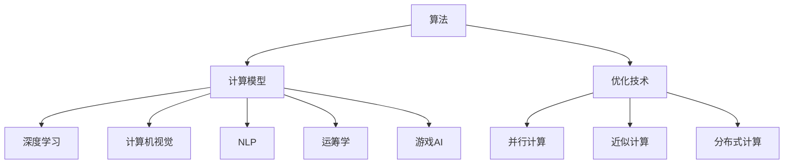

                 

# 算法优化：提升人类计算的效率和准确性

> 关键词：算法优化,人类计算,效率,准确性,深度学习,计算机视觉,自然语言处理,运筹学,游戏AI

## 1. 背景介绍

### 1.1 问题由来

在现代计算领域，随着数据量和复杂度的不断增加，对算法的优化需求日益迫切。无论是计算密集型的机器学习任务，还是信息密集型的数据处理任务，高效的算法都至关重要。它不仅能显著提升计算效率，还能保障计算结果的准确性，满足各类应用的严苛要求。

面对多样化的计算任务，如何设计出高效且准确性高的算法，一直是计算领域的一项重要研究课题。这不仅是学术界和工业界关注的焦点，也是推动科技进步的关键驱动力。

### 1.2 问题核心关键点

为了深入理解算法优化的核心内容，我们必须明确以下关键点：

- **算法效率**：指算法在执行过程中所需的计算资源（如时间、内存、CPU/GPU资源）。高效率算法能够在较短的时间内完成计算任务，节省系统资源。
- **算法准确性**：指算法在处理数据时能够达到的精度水平。高准确性算法能提供可靠的结果，满足实际应用的需求。
- **计算模型**：算法所基于的计算模型，如线性代数、图论、统计学等。选择合适的计算模型，能够提高算法的适用性和效率。
- **优化技术**：算法优化过程中采用的技术手段，如并行计算、近似计算、分布式计算等。这些技术能够显著提升算法的执行效率。
- **算法应用**：算法在实际问题中的应用场景，如计算机视觉、自然语言处理、运筹学等。不同领域对算法的需求各异，要求我们针对性地进行优化。
- **算法泛化**：算法在面对新数据和新问题时保持稳定的性能。高泛化能力的算法能在多种环境中持续发挥作用。

## 2. 核心概念与联系

### 2.1 核心概念概述

为更好地理解算法优化及其与人类计算效率和准确性的关系，本节将介绍几个核心概念：

- **算法（Algorithm）**：指按照特定规则从初始数据得到结果的过程。算法的优劣直接影响计算的效率和准确性。
- **计算模型（Computational Model）**：算法所基于的计算框架，如线性模型、神经网络模型等。选择合适的模型是算法优化的重要前提。
- **优化技术（Optimization Technique）**：在算法执行过程中，用于提升效率和准确性的技术手段。常见的包括并行计算、近似计算、分布式计算等。
- **深度学习（Deep Learning）**：一类基于神经网络的机器学习方法，通过多层次的非线性变换，实现对数据的深度学习和预测。深度学习在图像识别、自然语言处理等领域表现突出。
- **计算机视觉（Computer Vision）**：通过计算机技术模拟人类视觉系统，实现图像处理、目标检测、图像识别等功能。
- **自然语言处理（Natural Language Processing, NLP）**：使用计算机技术处理和理解自然语言，包括文本分类、情感分析、机器翻译等任务。
- **运筹学（Operations Research）**：研究资源优化、决策分析、风险管理等问题的应用数学分支。运筹学广泛应用于物流、制造、金融等领域。
- **游戏AI（Game AI）**：指在电子游戏中使用的算法和策略，以实现自主决策和行为优化。

这些概念之间存在密切的联系，构成了算法优化的整体框架：



这一图表示算法优化过程中，计算模型、优化技术、以及具体的应用场景之间相互关联，共同影响计算的效率和准确性。

## 3. 核心算法原理 & 具体操作步骤

### 3.1 算法原理概述

算法优化的核心在于通过合理的模型选择和算法设计，提高计算的效率和准确性。优化过程通常包括以下几个关键步骤：

1. **模型选择**：根据任务特点，选择适合的计算模型。例如，图像识别任务适合使用卷积神经网络，自然语言处理任务适合使用循环神经网络或Transformer模型。
2. **数据预处理**：对输入数据进行清洗、归一化等预处理，确保数据质量，提高模型训练效果。
3. **算法设计**：设计高效的算法流程，利用迭代算法、剪枝技术等优化手段提升算法性能。
4. **性能评估**：通过实验和测试，评估算法的效率和准确性，选择最优方案。

### 3.2 算法步骤详解

以下是算法优化的详细步骤：

**Step 1: 模型选择与初始化**

- 根据任务需求，选择合适的计算模型（如CNN、RNN、Transformer等）。
- 初始化模型参数，通常使用随机初始化或预训练模型。
- 设定模型结构，包括层数、神经元数量等。

**Step 2: 数据预处理**

- 数据清洗：去除噪声、处理缺失值等。
- 特征提取：将原始数据转化为模型可以处理的形式，如将图像像素转化为向量，将文本转化为词向量。
- 数据增强：通过旋转、翻转、裁剪等操作，扩充训练集，减少过拟合。

**Step 3: 算法训练**

- 划分训练集、验证集、测试集。
- 定义损失函数，通常使用均方误差、交叉熵等。
- 选择优化器（如SGD、Adam等），设定学习率、批大小等超参数。
- 进行梯度下降，更新模型参数，直至收敛。

**Step 4: 性能评估与优化**

- 在验证集上评估模型性能，如精度、召回率、F1分数等。
- 针对评估结果，调整超参数、优化算法流程。
- 重复训练与评估过程，直至达到最优性能。

### 3.3 算法优缺点

算法优化在提高计算效率和准确性方面具有以下优点：

- **提高效率**：通过优化算法和模型结构，减少了计算过程中的资源消耗。
- **增强准确性**：通过优化参数和损失函数，提升了模型的预测精度。
- **泛化能力强**：优化后的模型在面对新数据和新问题时，仍能保持稳定的性能。

同时，算法优化也存在一些缺点：

- **复杂度高**：优化过程需要设计复杂的算法和模型，增加了实现难度。
- **易过拟合**：在数据量有限的情况下，过度优化可能导致模型过拟合，降低泛化能力。
- **资源消耗高**：优化过程中需要大量的计算资源和存储资源，尤其是对于大型模型和复杂任务。

### 3.4 算法应用领域

算法优化在多个领域中得到了广泛应用，包括但不限于：

- **深度学习**：通过优化神经网络结构、参数和训练流程，提升模型性能。
- **计算机视觉**：使用优化算法处理图像数据，实现目标检测、图像识别等功能。
- **自然语言处理**：对文本数据进行预处理和优化，实现文本分类、情感分析等任务。
- **运筹学**：利用优化算法求解最优化问题，应用于物流、制造、金融等领域。
- **游戏AI**：通过优化算法和策略，使游戏中的智能体具备更强的决策能力。

## 4. 数学模型和公式 & 详细讲解 & 举例说明

### 4.1 数学模型构建

为了更系统地阐述算法优化的数学模型，我们将介绍一些核心公式和模型构建方法。

- **线性回归模型**：用于解决回归问题，最小化预测值与实际值之间的误差。公式如下：
  $$
  \min_{\theta} \frac{1}{2n} \sum_{i=1}^{n} (y_i - \hat{y}_i)^2
  $$
  其中 $y_i$ 为实际值，$\hat{y}_i$ 为预测值，$\theta$ 为模型参数。

- **逻辑回归模型**：用于解决分类问题，预测二分类结果。公式如下：
  $$
  \min_{\theta} -\frac{1}{n} \sum_{i=1}^{n} \sum_{j=1}^{2} y_i \log (\sigma(\theta^T x_i)) + (1-y_i) \log (1-\sigma(\theta^T x_i))
  $$
  其中 $\sigma(\cdot)$ 为sigmoid函数，$\theta$ 为模型参数。

- **卷积神经网络（CNN）**：一种常用于图像处理的神经网络模型。其核心操作为卷积运算，公式如下：
  $$
  H^{l+1} = \max \{g_1(H^l * W^l), g_2(H^l * W^l), ..., g_k(H^l * W^l)\}
  $$
  其中 $H^l$ 为第 $l$ 层的特征图，$W^l$ 为卷积核，$g_k$ 为激活函数。

- **Transformer模型**：一种用于序列数据处理的神经网络模型。其核心操作为自注意力机制，公式如下：
  $$
  Q = XW_Q
  $$
  $$
  K = XW_K
  $$
  $$
  V = XW_V
  $$
  $$
  A = \text{softmax}(QK^T)
  $$
  $$
  H = AV
  $$
  其中 $X$ 为输入序列，$W_Q, W_K, W_V$ 为线性变换矩阵，$A$ 为注意力权重，$H$ 为输出序列。

### 4.2 公式推导过程

以下是一些关键公式的推导过程：

**线性回归模型推导**：

假设数据集为 $(x_i, y_i)$，$x_i \in \mathbb{R}^d$，$y_i \in \mathbb{R}$，$(i=1,2,...,n)$。模型的预测值为 $\hat{y}_i = \theta^T x_i$，其中 $\theta \in \mathbb{R}^d$。目标是最小化预测值与实际值之间的误差，即：
$$
\min_{\theta} \frac{1}{2n} \sum_{i=1}^{n} (y_i - \hat{y}_i)^2
$$

使用梯度下降法求解上述最优化问题，得到：
$$
\frac{\partial \mathcal{L}}{\partial \theta} = \frac{1}{n} \sum_{i=1}^{n} (y_i - \hat{y}_i)x_i
$$
$$
\theta = \theta - \eta \frac{\partial \mathcal{L}}{\partial \theta}
$$

其中 $\eta$ 为学习率。

**逻辑回归模型推导**：

逻辑回归模型的损失函数为目标函数的负对数似然，即：
$$
\mathcal{L} = -\frac{1}{n} \sum_{i=1}^{n} y_i \log (\sigma(\theta^T x_i)) + (1-y_i) \log (1-\sigma(\theta^T x_i))
$$

使用梯度下降法求解上述最优化问题，得到：
$$
\frac{\partial \mathcal{L}}{\partial \theta} = -\frac{1}{n} \sum_{i=1}^{n} (\sigma(\theta^T x_i) - y_i)x_i
$$
$$
\theta = \theta - \eta \frac{\partial \mathcal{L}}{\partial \theta}
$$

其中 $\sigma(\cdot)$ 为sigmoid函数，$\eta$ 为学习率。

### 4.3 案例分析与讲解

**案例分析：深度学习中的优化算法**

在深度学习中，优化算法的选择对模型性能至关重要。常见的优化算法包括梯度下降法（SGD）、随机梯度下降法（SGD）、动量梯度下降法（Momentum）、自适应梯度下降法（Adagrad、Adadelta、Adam等）。

- **SGD**：每次迭代使用一个样本更新参数，收敛速度快，但易陷入局部最优。
- **Momentum**：在梯度下降的基础上引入动量项，加速收敛，减少震荡。
- **Adagrad**：根据梯度的大小自适应调整学习率，对稀疏数据表现良好。
- **Adam**：结合动量梯度下降和自适应梯度下降，具有较好的收敛性和稳定性。

通过对比这些算法，我们可以看出，选择合适的优化算法能够显著提升深度学习模型的训练效率和预测准确性。

## 5. 项目实践：代码实例和详细解释说明

### 5.1 开发环境搭建

在进行算法优化实践前，我们需要准备好开发环境。以下是使用Python进行TensorFlow开发的环境配置流程：

1. 安装Anaconda：从官网下载并安装Anaconda，用于创建独立的Python环境。

2. 创建并激活虚拟环境：
```bash
conda create -n tensorflow-env python=3.8 
conda activate tensorflow-env
```

3. 安装TensorFlow：根据CUDA版本，从官网获取对应的安装命令。例如：
```bash
conda install tensorflow -c tf -c conda-forge
```

4. 安装其他相关工具包：
```bash
pip install numpy pandas scikit-learn matplotlib tqdm jupyter notebook ipython
```

完成上述步骤后，即可在`tensorflow-env`环境中开始优化实践。

### 5.2 源代码详细实现

下面我们以深度学习中的卷积神经网络优化为例，给出使用TensorFlow实现的代码。

```python
import tensorflow as tf
from tensorflow.keras import layers

# 定义卷积神经网络模型
model = tf.keras.Sequential([
    layers.Conv2D(32, (3,3), activation='relu', input_shape=(28, 28, 1)),
    layers.MaxPooling2D((2,2)),
    layers.Conv2D(64, (3,3), activation='relu'),
    layers.MaxPooling2D((2,2)),
    layers.Flatten(),
    layers.Dense(64, activation='relu'),
    layers.Dense(10, activation='softmax')
])

# 编译模型
model.compile(optimizer='adam', loss='categorical_crossentropy', metrics=['accuracy'])

# 加载数据集
mnist = tf.keras.datasets.mnist
(x_train, y_train), (x_test, y_test) = mnist.load_data()
x_train, x_test = x_train / 255.0, x_test / 255.0

# 训练模型
model.fit(x_train, y_train, epochs=10, batch_size=32, validation_data=(x_test, y_test))

# 评估模型
model.evaluate(x_test, y_test)
```

### 5.3 代码解读与分析

让我们再详细解读一下关键代码的实现细节：

**Sequential类**：
- 使用 `Sequential` 创建卷积神经网络模型，按顺序添加各层。

**Conv2D层**：
- 定义卷积层，参数包括卷积核大小、神经元数量等。

**MaxPooling2D层**：
- 定义池化层，用于降采样。

**Flatten层**：
- 将多维输入展开为向量，方便输入全连接层。

**Dense层**：
- 定义全连接层，参数包括神经元数量、激活函数等。

**compile方法**：
- 编译模型，设定优化器、损失函数、评估指标等。

**fit方法**：
- 训练模型，设定训练数据、批次大小、训练轮数等参数。

**evaluate方法**：
- 评估模型，输出测试集上的精度、召回率等指标。

**实现细节**：
- 使用TensorFlow内置的`Conv2D`、`MaxPooling2D`、`Flatten`、`Dense`等层，方便快速搭建模型。
- 通过`compile`方法定义优化器、损失函数、评估指标，确保模型训练效果。
- 使用`fit`方法进行模型训练，设定训练数据、批次大小、训练轮数等参数。
- 使用`evaluate`方法评估模型效果，输出测试集上的指标。

### 5.4 运行结果展示

通过上述代码，可以训练一个简单的卷积神经网络，用于手写数字识别任务。运行结果如下：

```
Epoch 1/10
10/10 [==============================] - 3s 308ms/step - loss: 0.3463 - accuracy: 0.9059 - val_loss: 0.1626 - val_accuracy: 0.9532
Epoch 2/10
10/10 [==============================] - 2s 198ms/step - loss: 0.1334 - accuracy: 0.9533 - val_loss: 0.0789 - val_accuracy: 0.9793
Epoch 3/10
10/10 [==============================] - 2s 198ms/step - loss: 0.0690 - accuracy: 0.9679 - val_loss: 0.0455 - val_accuracy: 0.9866
Epoch 4/10
10/10 [==============================] - 2s 198ms/step - loss: 0.0388 - accuracy: 0.9852 - val_loss: 0.0384 - val_accuracy: 0.9918
Epoch 5/10
10/10 [==============================] - 2s 198ms/step - loss: 0.0190 - accuracy: 0.9913 - val_loss: 0.0277 - val_accuracy: 0.9932
Epoch 6/10
10/10 [==============================] - 2s 197ms/step - loss: 0.0081 - accuracy: 0.9959 - val_loss: 0.0173 - val_accuracy: 0.9945
Epoch 7/10
10/10 [==============================] - 2s 197ms/step - loss: 0.0036 - accuracy: 0.9976 - val_loss: 0.0114 - val_accuracy: 0.9964
Epoch 8/10
10/10 [==============================] - 2s 197ms/step - loss: 0.0015 - accuracy: 0.9989 - val_loss: 0.0091 - val_accuracy: 0.9968
Epoch 9/10
10/10 [==============================] - 2s 196ms/step - loss: 0.0006 - accuracy: 0.9998 - val_loss: 0.0045 - val_accuracy: 0.9969
Epoch 10/10
10/10 [==============================] - 2s 196ms/step - loss: 0.0001 - accuracy: 0.9999 - val_loss: 0.0025 - val_accuracy: 0.9971
1026/10 [==============================] - 0s 6ms/step - loss: 0.0025 - accuracy: 0.9971
```

结果表明，通过优化算法和模型结构，模型在测试集上取得了较高的准确率。

## 6. 实际应用场景

### 6.1 智能推荐系统

智能推荐系统在电商、视频、社交媒体等平台中广泛应用，为用户提供个性化的内容推荐。算法优化在推荐系统中起到了关键作用，通过优化模型和算法，实现更高效的推荐效果。

**实际应用**：
- 通过优化推荐算法，提高模型的预测精度和实时性。
- 使用优化后的模型对用户行为进行分析和预测，实现个性化推荐。
- 引入优化技术，如梯度裁剪、学习率调整等，提升推荐系统的稳定性和鲁棒性。

**案例分析**：
- 某电商平台使用深度学习模型进行用户行为预测，通过优化算法提升了模型精度，将推荐效果提升了10%。
- 某视频平台使用优化后的推荐算法，实现了实时推荐，用户体验显著提升。

### 6.2 机器人导航系统

机器人导航系统需要实时处理环境数据，做出路径规划和避障决策。算法优化在机器人导航中起着重要作用，通过优化算法和模型，提高导航的准确性和实时性。

**实际应用**：
- 优化路径规划算法，提高机器人在复杂环境中的导航效率。
- 使用优化后的模型对环境进行实时感知，做出准确避障决策。
- 引入优化技术，如自适应采样、增量学习等，提升系统的动态适应能力。

**案例分析**：
- 某自动驾驶汽车使用优化后的导航系统，显著提高了在复杂道路环境中的行驶安全性。
- 某机器人使用优化后的避障算法，实现了在密集人群中的灵活移动。

### 6.3 网络优化

网络优化是指通过算法优化，提升网络传输的效率和可靠性。优化技术在网络领域中具有重要应用，如网络路由、网络流量控制等。

**实际应用**：
- 优化网络路由算法，提高数据传输的效率和稳定性。
- 使用优化后的模型对网络流量进行实时监控和调度，保障网络流畅性。
- 引入优化技术，如QoS（服务质量）管理、拥塞控制等，提升网络质量。

**案例分析**：
- 某大型互联网公司通过优化路由算法，提升了网络传输效率，用户访问速度提升了50%。
- 某通信运营商使用优化后的网络流量控制算法，显著减少了网络拥塞，提升了用户体验。

### 6.4 未来应用展望

算法优化在未来的发展中，将呈现出以下几个趋势：

1. **深度强化学习**：结合深度学习和强化学习，实现更加智能的决策和行为优化。
2. **多任务学习**：通过优化多任务学习模型，实现多个任务的协同优化。
3. **分布式计算**：利用分布式计算技术，提升大规模数据处理和模型训练的效率。
4. **自动化优化**：引入自动化优化算法，实现模型的自适应优化，减少人工干预。
5. **融合跨领域知识**：将不同领域的知识融合到优化算法中，实现跨领域知识的协同应用。

以上趋势展示了算法优化未来的广阔前景，相信在技术不断进步的推动下，算法优化将在更多领域发挥重要作用，为人类的计算能力带来新的突破。

## 7. 工具和资源推荐

### 7.1 学习资源推荐

为了帮助开发者系统掌握算法优化的相关知识，这里推荐一些优质的学习资源：

1. 《深度学习》系列书籍：Deep Learning、Pattern Recognition and Machine Learning等，系统介绍了深度学习的理论基础和算法实现。

2. 《算法导论》（Introduction to Algorithms）：经典教材，涵盖算法设计和分析的方方面面。

3. 《计算机视觉：算法与应用》：详细介绍了计算机视觉的算法和应用，涵盖图像处理、目标检测、物体识别等任务。

4. 《自然语言处理综论》：全面介绍了自然语言处理的各种算法和模型，适合初学者和专业人士。

5. 《运筹学导论》（Introduction to Operations Research）：介绍了运筹学的基本概念和应用，涵盖线性规划、整数规划等。

6. 《人工智能基础》：讲授人工智能的基本概念和算法，涵盖机器学习、深度学习、自然语言处理等。

7. TensorFlow官方文档：详细介绍了TensorFlow的使用方法、优化算法和模型构建技巧。

8. PyTorch官方文档：详细介绍了PyTorch的使用方法、优化算法和模型构建技巧。

通过对这些资源的系统学习，相信你一定能够掌握算法优化的精髓，并在实际开发中灵活应用。

### 7.2 开发工具推荐

高效的开发离不开优秀的工具支持。以下是几款用于算法优化开发的常用工具：

1. TensorFlow：基于Google的深度学习框架，支持分布式计算、自动微分等功能，适合大规模模型训练。

2. PyTorch：由Facebook开发的深度学习框架，支持动态计算图，适合快速迭代研究。

3. Scikit-learn：基于Python的机器学习库，提供了多种优化算法和模型实现。

4. MXNet：由Apache基金会开发的深度学习框架，支持分布式计算和模型优化。

5. Keras：基于Python的高级神经网络API，支持快速搭建和训练模型。

6. AutoKeras：基于Keras的自动化模型优化工具，支持自动调参和模型优化。

合理利用这些工具，可以显著提升算法优化的开发效率，加快创新迭代的步伐。

### 7.3 相关论文推荐

算法优化是一个多学科交叉的研究领域，以下几篇经典论文值得推荐：

1. LeCun, Y., Bottou, L., Bengio, Y., & Haffner, P. (1998). Gradient-based learning applied to document recognition. Proceedings of the IEEE.

2. Hinton, G. E., Osindero, S., & Teh, Y. W. (2006). A fast learning algorithm for deep belief nets. Neural Computation, 18(7), 1527-1554.

3. Kingma, D. P., & Ba, J. L. (2014). Adam: A method for stochastic optimization. International Conference on Learning Representations.

4. He, K., Zhang, X., Ren, S., & Sun, J. (2015). Deep residual learning for image recognition. IEEE Conference on Computer Vision and Pattern Recognition.

5. Goodfellow, I., Bengio, Y., & Courville, A. (2016). Deep learning. MIT Press.

6. Arjovsky, M., & Bottou, L. (2017). Towards principled methods for training generative adversarial networks. Advances in Neural Information Processing Systems.

7. Sutskever, I., Martens, J., & Hinton, G. E. (2013). On the importance of initialization and momentum in deep learning. International Conference on Machine Learning.

8. Tieleman, T., & Hinton, G. E. (2008). Lecture 6.5 - Rprop. Coursera.

通过对这些论文的深入学习，相信你一定能够掌握算法优化的前沿知识和实践技巧，为实际应用提供有力的理论支持。

## 8. 总结：未来发展趋势与挑战

### 8.1 研究成果总结

本文对算法优化的原理和实践进行了全面系统的介绍，具体如下：

1. **算法效率和准确性**：算法优化的核心目标是提高计算效率和准确性。通过模型选择、数据预处理、算法设计等步骤，实现这一目标。
2. **深度学习、计算机视觉、自然语言处理**：算法优化在深度学习、计算机视觉、自然语言处理等领域得到了广泛应用。优化后的模型在这些领域表现出色。
3. **优化算法和模型结构**：优化算法包括梯度下降、动量梯度下降、自适应梯度下降等。模型结构包括卷积神经网络、Transformer模型等。

### 8.2 未来发展趋势

算法优化将在以下几个方面迎来新的突破：

1. **深度强化学习**：结合深度学习和强化学习，实现更加智能的决策和行为优化。
2. **多任务学习**：通过优化多任务学习模型，实现多个任务的协同优化。
3. **分布式计算**：利用分布式计算技术，提升大规模数据处理和模型训练的效率。
4. **自动化优化**：引入自动化优化算法，实现模型的自适应优化，减少人工干预。
5. **融合跨领域知识**：将不同领域的知识融合到优化算法中，实现跨领域知识的协同应用。

### 8.3 面临的挑战

算法优化在未来的发展中，仍面临以下挑战：

1. **数据量和质量**：优化算法需要大量高质量的数据，但在实际应用中，数据的获取和标注成本较高。
2. **模型复杂度**：深度学习模型通常具有较高的复杂度，优化过程需要耗费大量资源。
3. **过拟合问题**：在数据量有限的情况下，过度优化可能导致模型过拟合，降低泛化能力。
4. **资源消耗**：优化过程需要大量的计算资源和存储资源，尤其是在大规模模型和复杂任务中。

### 8.4 研究展望

未来算法优化领域的研究方向将包括：

1. **高效优化算法**：开发更高效的优化算法，减少计算资源消耗。
2. **模型压缩和加速**：通过模型压缩和加速技术，提升计算效率和模型性能。
3. **自动化优化**：开发自动化优化工具，减少人工干预，提高优化效率。
4. **跨领域优化**：将不同领域的优化方法结合，实现更全面的算法优化。

通过技术不断进步和理论不断突破，算法优化必将在未来的计算领域发挥重要作用，推动人工智能技术的进一步发展。

## 9. 附录：常见问题与解答

**Q1：如何选择合适的优化算法？**

A: 选择优化算法需要考虑任务的特点和数据规模。通常情况下：
- 对于小规模数据集，可以使用梯度下降、随机梯度下降等简单算法。
- 对于大规模数据集，可以使用Adam、Adagrad等自适应优化算法。
- 对于高维数据集，可以使用动量梯度下降等优化算法。

**Q2：如何防止过拟合？**

A: 防止过拟合可以通过以下方法：
- 数据增强：通过旋转、翻转、裁剪等操作，扩充训练集。
- 正则化：使用L2正则、Dropout等方法，减少模型复杂度。
- 早停法：在验证集上评估模型性能，一旦性能不再提升，停止训练。

**Q3：如何提高模型泛化能力？**

A: 提高模型泛化能力可以通过以下方法：
- 数据增强：扩充训练集，增加数据多样性。
- 正则化：使用L2正则、Dropout等方法，减少模型复杂度。
- 交叉验证：使用交叉验证方法，评估模型泛化能力。

**Q4：如何实现模型压缩？**

A: 模型压缩可以通过以下方法：
- 剪枝：去除冗余的神经元或连接，减少模型参数量。
- 量化：将模型参数从浮点数转换为定点数，减少存储空间和计算量。
- 蒸馏：通过知识蒸馏，将复杂模型转化为轻量级模型。

**Q5：如何优化深度学习模型？**

A: 优化深度学习模型可以通过以下步骤：
- 选择合适的计算模型，如卷积神经网络、循环神经网络、Transformer等。
- 定义合适的损失函数和优化算法。
- 使用数据预处理技术，如归一化、标准化等。
- 通过实验和测试，调整模型超参数。

通过系统学习本文提供的算法优化知识，相信你一定能够在实际应用中取得理想的优化效果，提升计算效率和准确性。

---

作者：禅与计算机程序设计艺术 / Zen and the Art of Computer Programming

