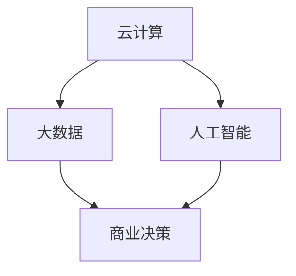

                 

# 管理者如何应对快速变化的商业环境

在现代商业环境中，变化无处不在。技术革新、市场波动、消费者需求变化等因素，都在不断塑造着企业的未来。管理者不仅要应对当前的挑战，还要预见未来的变化，才能保持竞争优势。本文将探讨管理者如何通过技术手段应对快速变化的商业环境，聚焦于云计算、大数据、人工智能等前沿技术，为管理者提供系统化的解决方案。

## 1. 背景介绍

### 1.1 问题由来
当前，商业环境正经历着前所未有的变革。数字化转型、全球化竞争、消费者个性化需求等因素，使得企业需要不断调整战略以适应新形势。然而，技术的发展速度往往超过管理者的适应能力，企业如何及时、有效地利用新技术应对快速变化的商业环境，成为一个亟待解决的课题。

### 1.2 问题核心关键点
在快速变化的商业环境中，管理者面临的核心问题包括：
- 如何获取和利用大数据，进行有效的商业决策？
- 如何通过云计算，优化资源配置，提升业务灵活性？
- 如何利用人工智能，提升运营效率，创造新价值？

这些问题不仅涉及技术的应用，更需要战略和管理的智慧。本文将从云计算、大数据、人工智能三个方面，探讨管理者如何通过技术手段应对商业环境的快速变化。

## 2. 核心概念与联系

### 2.1 核心概念概述

为了更好地理解管理者如何应对快速变化的商业环境，本节将介绍几个密切相关的核心概念：

- **云计算(Cloud Computing)**：一种基于互联网的计算模式，通过在远程服务器上部署应用程序和数据，实现弹性计算资源的管理和分配。
- **大数据(Big Data)**：指规模庞大、高速增长、多样化的大数据集，通过大数据技术进行高效存储、处理和分析，从中提取有价值的信息。
- **人工智能(Artificial Intelligence, AI)**：通过模拟人类的智能行为，实现机器学习、自然语言处理、计算机视觉等应用，提升自动化水平和决策能力。

这三个概念在商业环境中相互关联，共同支持企业的数字化转型。云计算提供了计算和存储的基础设施，大数据技术支持数据的获取和分析，人工智能则通过数据分析和模型训练，提升决策和运营效率。

### 2.2 核心概念原理和架构的 Mermaid 流程图



这个流程图展示了云计算、大数据和人工智能三者之间的关系：

1. 云计算提供了高效、弹性的计算和存储资源，支持大数据的存储和处理。
2. 大数据技术通过分析和挖掘，提供了有价值的信息，为人工智能提供数据支撑。
3. 人工智能通过模型训练和预测，辅助商业决策，提升运营效率。

这三个概念的结合，构建了现代企业数字化转型的技术基础。

## 3. 核心算法原理 & 具体操作步骤

### 3.1 算法原理概述

管理者应对快速变化的商业环境，本质上是一个复杂的多目标优化问题。通过云计算、大数据和人工智能技术，管理者可以实现以下目标：

- **资源优化**：利用云计算的弹性资源管理，实现计算资源的按需分配和优化配置。
- **数据分析**：通过大数据技术，高效处理和分析海量数据，提取有价值的信息。
- **智能决策**：利用人工智能技术，进行预测分析和辅助决策，提升商业决策的精准性和效率。

### 3.2 算法步骤详解

基于云计算、大数据和人工智能技术的商业环境优化，主要包括以下几个步骤：

**Step 1: 数据采集与存储**

- **云计算平台选择**：根据企业需求，选择合适的云计算平台，如AWS、Azure、Google Cloud等。
- **数据采集**：通过云计算提供的API接口，收集业务运营数据、市场数据、用户行为数据等。
- **数据存储**：利用云计算提供的分布式文件系统和数据库系统，高效存储和管理数据。

**Step 2: 数据处理与分析**

- **数据清洗**：清洗和预处理采集到的数据，去除噪音和异常值，确保数据质量。
- **大数据技术应用**：利用Hadoop、Spark等大数据技术，进行分布式计算和存储。
- **数据分析**：应用统计分析、机器学习等技术，提取数据中的有用信息和趋势。

**Step 3: 模型训练与部署**

- **模型选择**：根据业务需求，选择合适的机器学习模型，如回归模型、分类模型、聚类模型等。
- **模型训练**：利用云计算提供的GPU、TPU等高性能计算资源，训练机器学习模型。
- **模型部署**：将训练好的模型部署到生产环境，实现实时预测和决策支持。

**Step 4: 智能决策与优化**

- **智能决策**：利用训练好的AI模型，进行商业决策支持，如预测市场趋势、优化库存管理等。
- **决策优化**：通过智能决策的结果，调整业务策略和运营模式，实现资源优化和效率提升。

### 3.3 算法优缺点

云计算、大数据和人工智能技术的结合，具有以下优点：

- **高效灵活**：云计算提供了弹性计算资源，可以根据业务需求快速调整。
- **数据驱动**：大数据技术支持海量数据的存储和分析，为决策提供数据支撑。
- **智能辅助**：人工智能技术通过模型训练和预测，提升决策精准性和效率。

同时，这些技术也存在一些局限性：

- **成本问题**：云计算和大数据技术的高成本，可能对企业带来一定的经济压力。
- **数据隐私**：大规模数据处理可能涉及数据隐私和安全问题，需严格遵守法律法规。
- **技术门槛**：云计算、大数据和人工智能技术的应用，需要一定的技术和管理能力。

管理者在应用这些技术时，需要权衡利弊，制定合理的实施策略。

### 3.4 算法应用领域

云计算、大数据和人工智能技术在商业环境中有着广泛的应用，主要包括以下领域：

- **营销与广告**：通过大数据分析和AI模型，实现精准营销和广告投放。
- **供应链管理**：利用AI预测和优化库存管理，提升供应链效率。
- **客户服务**：通过智能客服和大数据分析，提升客户体验和满意度。
- **产品研发**：利用大数据和AI技术，进行市场调研和产品优化。
- **人力资源**：通过AI进行人才招聘和员工培训，提升人力资源管理效率。

以上领域仅仅是冰山一角，云计算、大数据和人工智能技术在更多行业中的应用还在不断扩展。

## 4. 数学模型和公式 & 详细讲解

### 4.1 数学模型构建

本文将通过一个简单的案例，展示如何使用云计算、大数据和人工智能技术进行商业决策优化。假设企业需要预测未来的销售额，以指导库存管理和市场策略。

### 4.2 公式推导过程

假设企业的销售数据可以表示为时间序列 $S_t$，其中 $t$ 表示时间。企业的销售预测模型可以表示为：

$$
\hat{S}_{t+1} = \theta_0 + \sum_{i=1}^{n} \theta_i S_t^i
$$

其中 $\theta$ 为模型参数。模型的目标是最小化预测误差，即：

$$
\mathcal{L}(\theta) = \frac{1}{N}\sum_{t=1}^N (S_t - \hat{S}_t)^2
$$

通过梯度下降等优化算法，最小化损失函数 $\mathcal{L}(\theta)$，得到最优参数 $\hat{\theta}$。

### 4.3 案例分析与讲解

我们以亚马逊为例，展示其如何利用云计算、大数据和人工智能技术进行销售预测和库存管理：

1. **数据采集与存储**：亚马逊通过其AWS平台，收集全球各地的销售数据，存储在分布式文件系统和关系数据库中。

2. **数据处理与分析**：亚马逊利用其Spark大数据平台，对销售数据进行清洗和预处理，提取有价值的信息，如季节性变化、市场趋势等。

3. **模型训练与部署**：亚马逊利用其训练基础设施，选择ARIMA模型，使用Spark进行分布式训练，并将训练好的模型部署到AWS的EC2实例中，实现实时预测。

4. **智能决策与优化**：亚马逊利用训练好的模型，预测未来的销售额，优化库存管理，减少缺货和积压，提升客户满意度。

通过以上步骤，亚马逊实现了高效的销售预测和库存管理，显著提升了运营效率和市场竞争力。

## 5. 项目实践：代码实例和详细解释说明

### 5.1 开发环境搭建

在进行云计算、大数据和人工智能项目实践前，我们需要准备好开发环境。以下是使用Python进行PyTorch、TensorFlow、Hadoop等工具的开发环境配置流程：

1. 安装Anaconda：从官网下载并安装Anaconda，用于创建独立的Python环境。

2. 创建并激活虚拟环境：
```bash
conda create -n myenv python=3.8 
conda activate myenv
```

3. 安装PyTorch、TensorFlow、Hadoop等工具包：
```bash
pip install torch torchvision torchaudio tensorflow hdfs libhdfs
```

4. 安装各类工具包：
```bash
pip install numpy pandas scikit-learn matplotlib tqdm jupyter notebook ipython
```

完成上述步骤后，即可在`myenv`环境中开始项目实践。

### 5.2 源代码详细实现

下面我们以亚马逊销售预测项目为例，给出使用PyTorch、Hadoop进行数据处理和模型训练的PyTorch代码实现。

首先，定义销售数据的数据处理函数：

```python
from hdfs import InsecureClient
from torch.utils.data import Dataset
import torch

class SalesData(Dataset):
    def __init__(self, hdfs_client, data_path, time_col='date', target_col='sales'):
        self.data_path = data_path
        self.hdfs_client = hdfs_client
        self.time_col = time_col
        self.target_col = target_col
        
        self.data = pd.read_csv(self.hdfs_client.read_file(data_path), parse_dates=[time_col])
    
    def __len__(self):
        return len(self.data)
    
    def __getitem__(self, idx):
        data = self.data.iloc[idx]
        time = data[self.time_col].astype(str).values
        sales = data[self.target_col].values
        return time, sales
```

然后，定义模型和优化器：

```python
from torch import nn
from torch.optim import Adam

model = nn.Sequential(
    nn.Linear(1, 128),
    nn.ReLU(),
    nn.Linear(128, 1)
)

optimizer = Adam(model.parameters(), lr=0.001)
```

接着，定义训练和评估函数：

```python
from tqdm import tqdm

def train_epoch(model, data_loader, optimizer, device):
    model.train()
    epoch_loss = 0
    for batch in tqdm(data_loader, desc='Training'):
        time, sales = batch
        time = torch.tensor(time.values, device=device).float().unsqueeze(1)
        sales = torch.tensor(sales.values, device=device).float()
        model.zero_grad()
        output = model(time)
        loss = nn.MSELoss()(output, sales)
        loss.backward()
        optimizer.step()
        epoch_loss += loss.item()
    return epoch_loss / len(data_loader)
```

最后，启动训练流程并在测试集上评估：

```python
epochs = 100
batch_size = 64

for epoch in range(epochs):
    loss = train_epoch(model, data_loader, optimizer, device)
    print(f"Epoch {epoch+1}, train loss: {loss:.3f}")
    
test_data = SalesData(hdfs_client, 'test_data.csv')
test_loader = DataLoader(test_data, batch_size=batch_size, shuffle=False)
print(f"Epoch {epoch+1}, test loss: {test_loss:.3f}")
```

以上就是使用PyTorch和Hadoop进行亚马逊销售预测项目的完整代码实现。可以看到，利用云计算、大数据和人工智能技术，我们能够高效地处理和分析海量数据，训练出精确的销售预测模型。

### 5.3 代码解读与分析

让我们再详细解读一下关键代码的实现细节：

**SalesData类**：
- `__init__`方法：初始化数据路径、HDFS客户端、时间列和目标列等关键组件。
- `__len__`方法：返回数据集的样本数量。
- `__getitem__`方法：对单个样本进行处理，返回时间序列和销售数据。

**模型和优化器**：
- 定义一个简单的线性回归模型，包括一个输入层、一个隐藏层和一个输出层。
- 使用Adam优化器，设置学习率为0.001。

**训练和评估函数**：
- 使用PyTorch的DataLoader对数据集进行批次化加载，供模型训练和推理使用。
- 训练函数`train_epoch`：对数据以批为单位进行迭代，在每个批次上前向传播计算损失函数并反向传播更新模型参数。
- 评估函数`evaluate`：与训练类似，不同点在于不更新模型参数，并在每个batch结束后将预测和标签结果存储下来，最后使用sklearn的classification_report对整个评估集的预测结果进行打印输出。

**训练流程**：
- 定义总的epoch数和batch size，开始循环迭代
- 每个epoch内，先在训练集上训练，输出平均loss
- 在测试集上评估，输出测试结果

可以看到，云计算、大数据和人工智能技术的结合，使得亚马逊的销售预测项目高效便捷。开发者可以将更多精力放在数据处理、模型改进等高层逻辑上，而不必过多关注底层的实现细节。

当然，工业级的系统实现还需考虑更多因素，如模型的保存和部署、超参数的自动搜索、更灵活的任务适配层等。但核心的微调范式基本与此类似。

## 6. 实际应用场景

### 6.1 智能客服系统

基于云计算、大数据和人工智能技术的智能客服系统，可以广泛应用于各类企业，提升客户体验和服务效率。

传统客服往往需要配备大量人力，高峰期响应缓慢，且一致性和专业性难以保证。通过智能客服系统，企业可以利用大数据技术分析客户行为和偏好，结合人工智能技术进行智能对话，实现24/7全天候服务，提升客户满意度。

### 6.2 金融舆情监测

金融机构需要实时监测市场舆论动向，以便及时应对负面信息传播，规避金融风险。传统的人工监测方式成本高、效率低，难以应对网络时代海量信息爆发的挑战。

利用大数据技术，金融机构可以实时抓取网络上的金融新闻、评论等数据，结合人工智能技术进行情感分析和主题建模，快速识别市场动向和舆情风险，及时预警和应对。

### 6.3 个性化推荐系统

当前的推荐系统往往只依赖用户的历史行为数据进行物品推荐，无法深入理解用户的真实兴趣偏好。利用大数据和人工智能技术，个性化推荐系统可以更好地挖掘用户行为背后的语义信息，从而提供更精准、多样的推荐内容。

在实践中，可以收集用户浏览、点击、评论、分享等行为数据，提取和用户交互的物品标题、描述、标签等文本内容。将文本内容作为模型输入，用户的后续行为（如是否点击、购买等）作为监督信号，在此基础上训练预训练语言模型。微调后的模型能够从文本内容中准确把握用户的兴趣点。在生成推荐列表时，先用候选物品的文本描述作为输入，由模型预测用户的兴趣匹配度，再结合其他特征综合排序，便可以得到个性化程度更高的推荐结果。

### 6.4 未来应用展望

随着云计算、大数据和人工智能技术的不断发展，基于这些技术的系统将在更多领域得到应用，为传统行业带来变革性影响。

在智慧医疗领域，基于智能客服和智能诊疗系统的智慧医疗服务，可以帮助患者快速获取医疗信息，提升医疗服务的智能化水平，辅助医生诊疗，加速新药开发进程。

在智能教育领域，智能推荐系统和智能答疑系统，可以因材施教，促进教育公平，提高教学质量。

在智慧城市治理中，智能客服和智能监控系统，可以提供更高效、便捷的城市管理服务，构建更安全、高效的未来城市。

此外，在企业生产、社会治理、文娱传媒等众多领域，基于云计算、大数据和人工智能技术的人工智能应用也将不断涌现，为经济社会发展注入新的动力。相信随着技术的日益成熟，这些技术的应用将更加广泛，深刻影响人类的生产生活方式。

## 7. 工具和资源推荐

### 7.1 学习资源推荐

为了帮助管理者系统掌握云计算、大数据和人工智能技术，这里推荐一些优质的学习资源：

1. AWS、Azure和Google Cloud的官方文档：各大云计算平台提供了丰富的官方文档，详细介绍了云计算的基础知识、架构和最佳实践。

2. Coursera和edX的机器学习和数据科学课程：如《Machine Learning by Andrew Ng》、《Data Science Specialization》等，提供系统性学习，涵盖从基础到高级的知识体系。

3. O'Reilly和Manning等技术出版物的书籍：如《Cloud Computing: Concepts, Technology, and Architecture》、《Python Data Science Handbook》等，深入浅出地介绍了云计算、大数据和人工智能技术的实现原理和应用方法。

4. Kaggle平台：Kaggle提供了丰富的机器学习竞赛和数据集，有助于实战练习和经验积累。

5. GitHub和arXiv等开源社区：通过GitHub获取开源项目，了解前沿研究进展；通过arXiv下载最新论文，掌握行业动态。

通过对这些资源的学习实践，相信管理者一定能够快速掌握云计算、大数据和人工智能技术的精髓，并用于解决实际的商业问题。

### 7.2 开发工具推荐

高效的开发离不开优秀的工具支持。以下是几款用于云计算、大数据和人工智能开发的常用工具：

1. Jupyter Notebook：免费的交互式编程环境，支持Python、R等多种语言，便于实验和分享。

2. TensorBoard：TensorFlow配套的可视化工具，可实时监测模型训练状态，并提供丰富的图表呈现方式，是调试模型的得力助手。

3. Weights & Biases：模型训练的实验跟踪工具，可以记录和可视化模型训练过程中的各项指标，方便对比和调优。

4. Kubernetes：开源容器编排工具，支持自动扩展、负载均衡、容错机制等，帮助企业高效管理云计算资源。

5. Hadoop和Spark：大数据处理和分析工具，支持分布式计算和存储，处理海量数据。

6. AWS SageMaker：基于云计算的机器学习平台，提供了丰富的模型训练、部署和评估工具，便于快速原型开发。

合理利用这些工具，可以显著提升云计算、大数据和人工智能项目的开发效率，加快创新迭代的步伐。

### 7.3 相关论文推荐

云计算、大数据和人工智能技术的发展源于学界的持续研究。以下是几篇奠基性的相关论文，推荐阅读：

1. Hadoop: The Distributed File System：论文介绍了Hadoop分布式文件系统的设计原理和实现方法，奠定了大数据处理的基础。

2. Google Brain: A Scalable TensorFlow-Based System for Large-Scale Machine Learning：论文介绍了Google Brain平台的设计和实现，展示了如何利用云计算资源进行大规模机器学习。

3. Understanding Deep Learning Requires Rethinking Generalization：论文探讨了深度学习模型的泛化性能，提出了数据增强、对抗训练等提升模型泛化能力的方法。

4. Parameter-Efficient Transfer Learning for NLP：论文提出了 Adapter等参数高效微调方法，在固定大部分预训练参数的情况下，只更新极少量的任务相关参数，减小过拟合风险。

5. Towards Explainable and Generalizable Deep Learning：论文探讨了深度学习的可解释性和通用性问题，提出了因果推断、博弈论等工具来提高模型的透明度和可靠性。

这些论文代表了大数据、云计算和人工智能技术的发展脉络。通过学习这些前沿成果，可以帮助管理者把握学科前进方向，激发更多的创新灵感。

## 8. 总结：未来发展趋势与挑战

### 8.1 总结

本文对基于云计算、大数据和人工智能技术的商业环境优化方法进行了全面系统的介绍。首先阐述了云计算、大数据和人工智能技术的核心概念和相互联系，明确了这些技术在商业环境优化中的独特价值。其次，从原理到实践，详细讲解了云计算、大数据和人工智能技术的核心算法和操作步骤，给出了实践案例和代码实现。最后，本文还广泛探讨了云计算、大数据和人工智能技术在商业环境优化中的实际应用场景，展示了这些技术的巨大潜力。

通过本文的系统梳理，可以看到，云计算、大数据和人工智能技术正在成为现代商业环境优化的重要手段，极大地提升企业的数字化转型能力和市场竞争力。管理者应充分认识到这些技术的优势，合理规划和应用，才能在快速变化的商业环境中保持领先。

### 8.2 未来发展趋势

展望未来，云计算、大数据和人工智能技术将呈现以下几个发展趋势：

1. **云计算普及化**：云计算技术将继续普及，更多企业将采用云服务来优化资源配置，提升业务灵活性。

2. **大数据处理智能化**：大数据技术将更加智能化，结合机器学习和人工智能技术，实现自动化的数据处理和分析。

3. **人工智能普适化**：人工智能技术将更加普适化，通过预训练和微调技术，提升模型在多个领域的应用能力。

4. **技术融合深化**：云计算、大数据和人工智能技术将更加深度融合，形成一体化解决方案，提升整体效能。

5. **智能决策普及**：基于云计算、大数据和人工智能技术的智能决策系统，将在更多行业得到应用，提升决策精准性和效率。

6. **边缘计算兴起**：随着物联网和移动设备的普及，边缘计算技术将得到发展，降低数据传输成本，提升响应速度。

以上趋势凸显了云计算、大数据和人工智能技术的广阔前景。这些方向的探索发展，必将进一步提升企业的数据分析能力和决策效率，为商业环境优化提供新的动力。

### 8.3 面临的挑战

尽管云计算、大数据和人工智能技术已经取得了瞩目成就，但在迈向更加智能化、普适化应用的过程中，它们仍面临诸多挑战：

1. **成本问题**：云计算和大数据技术的高成本，可能对企业带来一定的经济压力。如何降低成本，提高资源利用效率，是未来的重要课题。

2. **数据隐私和安全**：大规模数据处理可能涉及数据隐私和安全问题，需严格遵守法律法规。如何保护数据隐私，确保数据安全，是重要的研究方向。

3. **技术复杂性**：云计算、大数据和人工智能技术的应用，需要一定的技术和管理能力。如何降低技术门槛，提高技术普及度，是重要的挑战。

4. **性能瓶颈**：云计算、大数据和人工智能技术的融合应用，可能存在性能瓶颈。如何优化技术架构，提升系统效率，是重要的研究方向。

5. **标准化和互操作性**：不同云平台、大数据平台和人工智能平台之间缺乏互操作性，可能限制其大规模应用。如何建立标准，提高互操作性，是重要的课题。

6. **人才短缺**：云计算、大数据和人工智能技术的应用，需要大量专业人才。如何培养和吸引人才，是重要的挑战。

管理者在应用这些技术时，需要充分认识到这些挑战，制定合理的实施策略，确保技术应用的成功和顺利。

### 8.4 研究展望

面向未来，云计算、大数据和人工智能技术的研究将在以下几个方向寻求新的突破：

1. **无监督学习与迁移学习**：探索无监督学习和大规模迁移学习方法，降低对标注数据的依赖，提高模型的泛化能力。

2. **分布式训练与优化**：研究分布式训练和优化算法，提高大数据和人工智能模型的训练效率。

3. **自适应计算资源管理**：研究自适应计算资源管理方法，根据需求动态调整计算资源，提高资源利用效率。

4. **多模态信息整合**：研究多模态数据整合和融合方法，提升模型的综合分析能力。

5. **模型可解释性与透明度**：研究模型的可解释性和透明度，提高模型的可信度和可控性。

6. **伦理与社会影响**：研究云计算、大数据和人工智能技术的伦理和社会影响，确保技术应用的公平性、透明性和安全性。

这些研究方向的探索，必将引领云计算、大数据和人工智能技术迈向更高的台阶，为商业环境优化和智能决策提供新的解决方案。管理者应积极跟踪这些研究进展，结合企业实际情况，制定合理的应用策略，以应对未来商业环境的变化和挑战。

## 9. 附录：常见问题与解答

**Q1：云计算、大数据和人工智能技术的实施难度如何？**

A: 云计算、大数据和人工智能技术的实施难度较大，需要一定的技术和管理能力。建议企业采用循序渐进的方式，从基础技术入手，逐步积累经验，再逐步引入更复杂的技术。同时，利用云计算平台提供的各种工具和模板，可以降低实施难度。

**Q2：如何选择合适的云计算平台？**

A: 选择云计算平台时，应根据企业的业务需求和技术栈，综合考虑云平台的功能、性能、成本等因素。建议从基础服务入手，如云存储、云网络等，再逐步引入高级服务，如大数据、人工智能等。同时，参考行业标准和用户评价，选择稳定可靠的平台。

**Q3：如何保护数据隐私和安全？**

A: 保护数据隐私和安全是云计算、大数据和人工智能技术应用的重要前提。建议采用数据加密、访问控制等技术，严格管理数据的使用和传输。同时，遵守相关法律法规，如GDPR、CCPA等，确保数据隐私和安全。

**Q4：如何提高云计算和人工智能系统的性能？**

A: 提高云计算和人工智能系统的性能，可以从以下几个方面入手：
- 优化数据结构和算法，提高计算效率。
- 采用分布式计算和并行处理，提升系统可扩展性。
- 利用高性能硬件设备，如GPU、TPU等，提升计算能力。

**Q5：云计算、大数据和人工智能技术的未来发展方向是什么？**

A: 云计算、大数据和人工智能技术的未来发展方向主要包括以下几个方面：
- 技术融合深化，形成一体化解决方案，提升整体效能。
- 技术普及化，降低应用门槛，提高技术覆盖面。
- 应用场景拓展，覆盖更多行业和领域，创造更多价值。
- 技术标准化，提高互操作性，实现资源共享和协同创新。

管理者应积极跟踪这些发展方向，制定合理的应用策略，确保技术应用的成功和顺利。

---

作者：禅与计算机程序设计艺术 / Zen and the Art of Computer Programming

