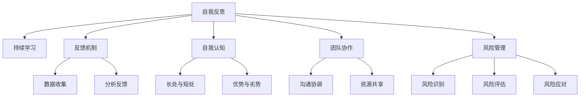

                 

# 管理者的自我反思与成长

## 1. 背景介绍

作为管理者，我们的目标不仅仅是达成业务目标，更是要在实践中不断反思与成长。在快速变化的商业环境中，管理者需要不断提升自我认知，拓展思维边界，才能在激烈的市场竞争中脱颖而出。本文旨在深入探讨管理者的自我反思与成长之道，揭示其背后的核心原理和具体操作步骤，为管理者提供实践指南和启发。

### 1.1 问题由来

现代商业环境中，信息瞬息万变，技术日新月异，市场竞争愈加激烈。管理者面对的不再是简单的业务问题，而是错综复杂的系统挑战。如何在复杂多变的环境中保持战略定力，如何在纷繁复杂的局面中做出明智决策，如何实现个人与团队的共同成长，成为每一位管理者必须直面的课题。管理者的自我反思与成长，正是应对这些挑战的关键。

### 1.2 问题核心关键点

管理者自我反思与成长的核心理念在于通过不断的自我评估和反馈机制，实现个人与团队的双重提升。核心关键点包括：

- **持续学习**：管理者应保持持续学习的心态，及时更新自己的知识体系和技能水平。
- **反馈机制**：建立有效的反馈系统，及时获取和分析各方面的反馈信息，以优化决策和行动。
- **自我认知**：提升自我认知，包括对自己的长处与短处、优势与劣势的全面认识，以便更好地发挥优势，弥补劣势。
- **团队协作**：促进团队协作，通过激励和协调，使团队成员在共同目标下协同工作，实现团队整体绩效提升。
- **风险管理**：强化风险意识，识别潜在风险，并制定相应的风险应对策略。

## 2. 核心概念与联系

### 2.1 核心概念概述

为更好地理解管理者的自我反思与成长之道，本节将介绍几个密切相关的核心概念：

- **自我反思**：指管理者对自己行为、决策和结果进行回顾、分析和评价的过程。通过自我反思，管理者可以发现自己的不足，明确改进方向。
- **持续学习**：指管理者在职业生涯中，持续学习新知识、新技能和新方法，保持个人与团队的知识前沿。
- **反馈机制**：指建立正式或非正式的反馈渠道，收集内外部的反馈信息，以指导个人和团队的改进。
- **自我认知**：指管理者对自己心理、情感、能力等方面的认知和评价，包括长处与短处、优势与劣势的全面评估。
- **团队协作**：指通过有效沟通、资源共享和共同目标设定，促进团队成员之间的合作，实现团队整体绩效提升。
- **风险管理**：指管理者识别和评估潜在的风险，制定相应的风险应对策略，以降低不确定性对组织的影响。

这些核心概念之间的逻辑关系可以通过以下Mermaid流程图来展示：



这个流程图展示了一系列关键概念及其之间的关系：

1. 自我反思是管理者成长的基础，通过反思发现自己的不足和优势，指导后续行动。
2. 持续学习是管理者提升自我能力的重要途径。
3. 反馈机制是管理者获取外部信息的重要手段。
4. 自我认知是管理者对自身状况的全面评估。
5. 团队协作是管理者实现团队绩效提升的关键。
6. 风险管理是管理者保障组织稳定运行的重要保障。

这些概念共同构成了管理者自我反思与成长的理论基础，为管理者的实践提供了指导和支持。

## 3. 核心算法原理 & 具体操作步骤

### 3.1 算法原理概述

管理者的自我反思与成长过程，本质上是基于反馈机制和自我认知的迭代优化过程。其核心思想是通过不断的反馈和反思，调整自己的行为和决策，逐步提升个人和团队的整体绩效。

具体而言，管理者的自我反思与成长可以分为以下几个步骤：

1. **收集反馈**：从不同的来源（如员工、上级、客户等）收集关于自身行为和决策的反馈信息。
2. **自我反思**：对收集到的反馈信息进行深度分析和评估，识别出需要改进的地方。
3. **制定计划**：基于反思结果，制定具体的改进计划，明确改进目标和步骤。
4. **执行改进**：根据改进计划，实施相应的行动，并不断监控进展情况。
5. **持续优化**：根据新的反馈信息，对改进计划进行迭代和优化，形成持续改进的循环。

### 3.2 算法步骤详解

#### 3.2.1 收集反馈

反馈是自我反思与成长的基础。管理者应建立多元化的反馈渠道，确保获取全面和客观的信息。常见的反馈来源包括：

- **员工反馈**：通过定期的员工调查、一对一交流等方式，获取员工对管理者决策和行为的看法。
- **上级反馈**：向上级领导汇报工作进展和面临的挑战，获取更高层次的指导和建议。
- **客户反馈**：通过客户满意度调查、客户投诉等方式，了解客户对产品和服务的需求和期望。
- **行业动态**：通过行业会议、专业期刊等方式，了解行业趋势和最佳实践。

#### 3.2.2 自我反思

收集到反馈后，管理者应进行深入的自我反思。自我反思的关键在于：

- **全面性**：全面回顾自己的行为和决策，不仅关注成果，也关注过程和执行细节。
- **客观性**：保持客观态度，避免主观偏见，实事求是地评估自己的表现。
- **连贯性**：将过去和现在的表现进行对比，找出变化和差异，形成持续改进的视角。

#### 3.2.3 制定计划

基于自我反思的结果，管理者应制定具体的改进计划。计划的制定应遵循SMART原则，即具体（Specific）、可衡量（Measurable）、可实现（Achievable）、相关（Relevant）和时限（Time-bound）。例如：

- **具体目标**：提高团队沟通效率，减少误解和冲突。
- **可衡量指标**：团队会议的准时率和会议纪要的完整性。
- **可实现步骤**：建立团队沟通机制，定期举行团队建设活动。
- **相关性**：与团队绩效直接相关，有助于提升整体工作效率。
- **时限**：在三个月内完成，确保改进措施具有可操作性。

#### 3.2.4 执行改进

执行改进是管理者自我反思与成长的关键步骤。管理者应积极实施改进计划，并持续监控进展情况。例如：

- **实施沟通机制**：建立定期的团队沟通会议，及时解决问题。
- **举行团队建设活动**：组织团队拓展、团建活动，增强团队凝聚力。
- **监控进展**：定期评估改进措施的效果，及时调整和优化。

#### 3.2.5 持续优化

管理者的自我反思与成长是一个持续优化的过程。管理者应根据新的反馈信息，不断调整和优化改进计划。例如：

- **获取新反馈**：定期进行员工调查，了解员工对改进措施的评价。
- **调整计划**：根据反馈结果，对改进措施进行优化和调整。
- **形成循环**：形成持续改进的循环，确保不断提升个人和团队的表现。

### 3.3 算法优缺点

管理者的自我反思与成长方法具有以下优点：

- **提升自我认知**：通过反思和反馈，管理者能够全面了解自己的优势和不足，明确改进方向。
- **促进团队协作**：通过改进措施，提升团队凝聚力和协作效率，实现整体绩效提升。
- **风险管理**：通过持续改进，管理者能够识别和应对潜在的风险，保障组织稳定运行。

同时，该方法也存在一定的局限性：

- **时间成本高**：自我反思和反馈收集需要大量时间和精力，对于繁忙的管理者可能难以持续。
- **主观偏见**：反馈和反思过程可能受到主观偏见的影响，导致评估结果不够客观。
- **执行难度大**：改进措施的实施和监控需要强有力的执行力，对管理者的能力提出了更高要求。

尽管存在这些局限性，但就目前而言，基于反馈机制和自我认知的自我反思与成长方法仍然是最为有效的管理者提升之道。未来相关研究的重点在于如何进一步降低反思成本，提高反馈的客观性和及时性，同时兼顾改进措施的执行力和效果。

### 3.4 算法应用领域

基于反馈机制和自我认知的自我反思与成长方法，在现代企业管理中得到广泛应用，涉及多个领域，包括：

- **人力资源管理**：通过员工反馈和绩效评估，提升员工满意度和绩效。
- **市场营销**：通过客户反馈和市场调研，优化产品和服务，提升客户体验。
- **项目管理**：通过项目团队反馈和项目进展评估，提升项目管理效率和质量。
- **战略规划**：通过外部反馈和行业动态分析，优化企业战略，提升竞争优势。
- **领导力提升**：通过领导力培训和团队建设，提升管理者的领导能力和团队协作水平。

除了上述这些经典应用外，自我反思与成长方法也被创新性地应用到更多场景中，如创新管理、企业文化建设等，为企业管理带来了新的思路和方法。

## 4. 数学模型和公式 & 详细讲解 & 举例说明

### 4.1 数学模型构建

管理者的自我反思与成长过程，可以通过数学模型进行建模和分析。假设管理者在某一时间段内，需要对多个指标（如员工满意度、客户满意度、项目进展等）进行评估和改进。设管理者在时间 $t$ 时，对指标 $i$ 的评估结果为 $x_i(t)$，改进措施的效果为 $c_i(t)$。则评估和改进过程的数学模型可以表示为：

$$
x_i(t+1) = f_i(x_i(t), c_i(t))
$$

其中 $f_i$ 表示评估和改进的函数关系，可以是加权平均、累加、回归模型等。

### 4.2 公式推导过程

以员工满意度 $x$ 的评估和改进为例，假设管理者在时间 $t$ 时，员工满意度为 $x(t)$，改进措施的效果为 $c(t)$。则改进后的员工满意度 $x(t+1)$ 可以表示为：

$$
x(t+1) = x(t) + \alpha \cdot c(t)
$$

其中 $\alpha$ 表示改进措施的权重，可以根据实际情况进行调整。例如，管理者可以设定改进措施的权重为 $0.5$，表示改进措施的效果对员工满意度的影响占总体评估结果的50%。

通过上述模型，管理者可以系统地评估和改进员工满意度，逐步提升整体绩效。

### 4.3 案例分析与讲解

假设某公司的管理者在一段时间内，对员工满意度 $x$ 的评估结果为 $x(t)=70$，改进措施的效果为 $c(t)=20$，改进措施的权重 $\alpha=0.5$。则改进后的员工满意度 $x(t+1)$ 可以计算如下：

$$
x(t+1) = 70 + 0.5 \cdot 20 = 90
$$

这表示，在改进措施的推动下，员工满意度从70提升到了90。通过类似的方式，管理者可以对多个指标进行评估和改进，逐步提升整体绩效。

## 5. 项目实践：代码实例和详细解释说明

### 5.1 开发环境搭建

在进行管理者的自我反思与成长实践前，我们需要准备好开发环境。以下是使用Python进行项目开发的流程：

1. 安装Python：从官网下载并安装Python，建议使用3.8及以上版本。

2. 安装Pip：在命令行中运行 `python -m pip install --upgrade pip` 安装Pip，确保能够安装第三方库。

3. 安装相关库：
```bash
pip install numpy pandas matplotlib
```

4. 创建项目目录：
```bash
mkdir manager_reflection
cd manager_reflection
```

5. 创建项目文件：
```bash
touch reflection.py
```

完成上述步骤后，即可在 `manager_reflection` 环境中开始项目实践。

### 5.2 源代码详细实现

下面我们以员工满意度评估和改进为例，给出使用Python进行员工满意度分析的代码实现。

首先，定义员工满意度评估的函数：

```python
import numpy as np

def employee_satisfaction(x, c, alpha=0.5):
    return x + alpha * c
```

然后，定义员工满意度改进的过程：

```python
# 初始化员工满意度
x = 70

# 改进措施效果
c = 20

# 改进措施权重
alpha = 0.5

# 计算改进后的员工满意度
x_next = employee_satisfaction(x, c, alpha)
print(f"改进后的员工满意度为：{x_next}")
```

### 5.3 代码解读与分析

让我们再详细解读一下关键代码的实现细节：

**employee_satisfaction函数**：
- 函数 `employee_satisfaction` 用于计算员工满意度的改进效果。
- 参数 `x` 表示当前员工满意度，`c` 表示改进措施的效果，`alpha` 表示改进措施的权重。
- 函数内部通过简单的加权平均计算，得到改进后的员工满意度。

**改进过程**：
- 初始化员工满意度 `x` 为70。
- 改进措施效果 `c` 为20。
- 改进措施权重 `alpha` 为0.5。
- 通过 `employee_satisfaction` 函数计算改进后的员工满意度 `x_next`，并打印输出。

可以看到，通过简单的Python代码，我们就可以实现员工满意度的评估和改进过程。这为我们提供了管理自我反思与成长的基础模型和框架。

当然，实际应用中还需要考虑更多因素，如数据的收集和处理、多指标的综合评估、改进措施的制定和执行等。但核心的自我反思与成长过程，可以通过类似的逻辑和实现方法进行优化和扩展。

## 6. 实际应用场景

### 6.1 人力资源管理

基于员工反馈和绩效评估的自我反思与成长方法，可以广泛应用于人力资源管理中。传统的人力资源管理往往依赖于人工评估和反馈，效率低下，效果有限。通过引入科学的评估工具和改进方法，人力资源管理者可以更系统地进行员工评估和改进，提升员工满意度和绩效。

例如，人力资源管理者可以通过问卷调查、绩效评估、360度反馈等方式，收集员工对工作环境、团队协作、职业发展等方面的看法和建议。基于收集到的反馈信息，管理者可以制定相应的改进计划，如调整工作流程、优化团队结构、提供培训和发展机会等，从而提升员工满意度和绩效。

### 6.2 市场营销

市场营销领域同样需要不断地进行自我反思与成长。通过客户反馈和市场调研，市场营销管理者可以深入了解客户需求和市场动态，优化产品和服务，提升客户体验。

例如，市场营销管理者可以通过客户满意度调查、市场分析报告、竞争对手研究等方式，获取客户和市场的信息。基于收集到的反馈信息，管理者可以制定相应的改进计划，如优化产品功能、提升客户服务、推出促销活动等，从而提升客户满意度和市场占有率。

### 6.3 项目管理

项目管理是管理者的重要职责之一，通过项目管理，管理者可以有效地组织和协调团队资源，确保项目按时按质完成。基于项目团队的反馈和项目进展评估，项目管理者和团队可以不断优化项目管理和执行过程，提升项目效率和质量。

例如，项目管理者和团队可以通过项目会议、进度报告、绩效评估等方式，获取项目进展和团队表现的信息。基于收集到的反馈信息，管理者可以制定相应的改进计划，如调整项目管理流程、优化资源配置、加强团队沟通等，从而提升项目管理效率和质量。

### 6.4 未来应用展望

随着管理科学和人工智能技术的不断发展，基于反馈机制和自我认知的自我反思与成长方法将不断拓展其应用范围，为管理者提供更科学、更系统、更高效的管理工具。

在智慧企业领域，基于数据分析和智能系统的反馈机制，管理者可以实时获取员工、客户和市场的信息，快速响应变化，做出更加明智的决策。同时，人工智能技术可以自动生成改进建议和优化方案，提高管理效率和质量。

在智慧城市治理中，基于大数据和物联网的反馈机制，管理者可以实时监测城市运行状态，及时发现和解决问题，提升城市管理的智能化水平。

在智慧教育领域，基于学生反馈和教学评估的改进机制，教师可以不断优化教学方法和课程内容，提升教学质量和学生满意度。

除了上述这些应用场景外，自我反思与成长方法还被创新性地应用到更多领域，如创新管理、企业文化建设等，为企业管理带来了新的思路和方法。

## 7. 工具和资源推荐

### 7.1 学习资源推荐

为了帮助管理者系统掌握自我反思与成长的方法，这里推荐一些优质的学习资源：

1. **《高效能人士的七个习惯》**：史蒂芬·柯维的经典之作，揭示了高效能人士的成功之道，提供了很多实用的管理建议和方法。
2. **《领导力挑战》**：约翰·马克斯威尔的作品，深入探讨了领导力的本质和实践，提供了丰富的领导力发展路径。
3. **《经理人参阅》**：一份管理领域的读物，涵盖了很多经典的管理理论和方法，提供了丰富的管理实践案例。
4. **《哈佛商业评论》**：全球顶尖的管理期刊，提供了很多前沿的管理理论和实践经验。
5. **《管理者自我反思手册》**：一本系统介绍管理者自我反思方法的书籍，提供了很多实用的工具和技巧。

通过学习这些资源，管理者可以更全面地了解自我反思与成长的方法和实践，提升自身的管理水平。

### 7.2 开发工具推荐

高效的开发离不开优秀的工具支持。以下是几款用于管理者自我反思与成长开发的常用工具：

1. **Jupyter Notebook**：一款交互式编程工具，支持Python、R等多种语言，适合数据分析和可视化。
2. **Tableau**：一款数据可视化工具，可以方便地进行数据探索和报告制作。
3. **Trello**：一款任务管理工具，适合项目管理和团队协作。
4. **Slack**：一款即时通信工具，支持团队沟通和协作。
5. **Google Analytics**：一款网站流量分析工具，可以实时监控和优化网站表现。

合理利用这些工具，可以显著提升管理者的自我反思与成长实践效率，加快创新迭代的步伐。

### 7.3 相关论文推荐

管理者的自我反思与成长研究源于学界的持续研究。以下是几篇奠基性的相关论文，推荐阅读：

1. **《自我反思与员工绩效：基于实证研究的探索》**：该论文通过实证研究，探讨了自我反思对员工绩效的影响。
2. **《领导者的自我反思与团队绩效：基于跨文化研究的探索》**：该论文通过跨文化研究，探讨了领导者自我反思对团队绩效的影响。
3. **《基于数据分析的自我反思方法》**：该论文介绍了基于大数据和人工智能的自我反思方法，探讨了其应用效果和局限性。
4. **《管理者的持续学习与自我成长：理论与实践》**：该论文系统介绍了管理者的持续学习与自我成长方法，探讨了其实践路径和效果。
5. **《基于反馈机制的团队协作优化》**：该论文介绍了基于反馈机制的团队协作优化方法，探讨了其应用效果和实施策略。

这些论文代表了大管理者的自我反思与成长理论的发展脉络。通过学习这些前沿成果，可以帮助管理者把握学科前进方向，激发更多的创新灵感。

## 8. 总结：未来发展趋势与挑战

### 8.1 总结

本文对管理者的自我反思与成长方法进行了全面系统的介绍。首先阐述了自我反思与成长的重要性和意义，明确了其在提升管理效能、优化团队协作、增强风险管理等方面的独特价值。其次，从原理到实践，详细讲解了自我反思与成长的核心步骤，给出了具体的代码实现和案例分析。同时，本文还探讨了该方法在人力资源管理、市场营销、项目管理等多个领域的应用前景，展示了其广阔的发展潜力。此外，本文精选了相关的学习资源和开发工具，力求为管理者提供全方位的实践指南。

通过本文的系统梳理，可以看到，基于反馈机制和自我认知的自我反思与成长方法正在成为现代企业管理的重要范式，极大地提升了管理者的管理水平和团队绩效。未来，伴随管理科学和人工智能技术的持续演进，基于自我反思与成长的管理方法必将进一步拓展其应用边界，为管理者的成长和组织的发展提供更强大的支持。

### 8.2 未来发展趋势

展望未来，管理者的自我反思与成长方法将呈现以下几个发展趋势：

1. **数据驱动决策**：随着大数据和人工智能技术的普及，管理者将更加依赖数据驱动的决策方式，通过数据分析和机器学习，提升决策的科学性和准确性。
2. **智能辅助系统**：基于AI的智能辅助系统将帮助管理者更高效地进行自我反思和改进，提供实时的反馈和改进建议。
3. **个性化改进方案**：通过深度学习等技术，为不同层级和不同职能的管理者提供个性化的改进方案，提升改进的效果和效率。
4. **跨领域应用**：自我反思与成长方法将跨越组织边界，在供应链管理、生态系统治理等领域得到广泛应用。
5. **知识共享平台**：基于知识共享和协作的工具和平台，管理者可以更高效地分享和应用最佳实践，提升整体管理水平。

以上趋势凸显了自我反思与成长方法的广阔前景。这些方向的探索发展，必将进一步提升管理者的管理效能和组织绩效，为组织的长期发展提供坚实的基础。

### 8.3 面临的挑战

尽管自我反思与成长方法已经取得了显著成效，但在迈向更加智能化、普适化应用的过程中，仍面临诸多挑战：

1. **数据质量问题**：反馈数据的准确性和完整性是提升自我反思效果的关键。如何获取高质量的数据，减少噪音和偏差，将是一大难题。
2. **模型透明性**：基于AI的自我反思系统可能存在“黑盒”问题，难以解释其内部工作机制和决策逻辑。如何提升模型的透明性，增强可解释性，将是重要的研究课题。
3. **跨文化差异**：管理者的自我反思与成长方法在不同文化背景下的适应性和有效性不同。如何跨文化地应用该方法，将是未来研究的重点。
4. **技术集成难度**：将AI技术与传统管理方法集成，需要强有力的技术支撑和系统整合能力。如何简化技术集成过程，提高系统的易用性，将是重要的技术挑战。
5. **隐私与安全**：管理者的自我反思与成长方法往往涉及敏感的个人和企业数据。如何保障数据的隐私和安全，将是重要的伦理问题。

正视这些挑战，积极应对并寻求突破，将是大管理者自我反思与成长方法走向成熟的必由之路。相信随着学界和产业界的共同努力，这些挑战终将一一被克服，管理者的自我反思与成长必将进入一个新的发展阶段。

### 8.4 研究展望

面对管理者的自我反思与成长所面临的种种挑战，未来的研究需要在以下几个方面寻求新的突破：

1. **多模态反馈机制**：探索多模态反馈机制，结合员工反馈、客户反馈、市场反馈等多种信息源，提升反馈的全面性和准确性。
2. **知识图谱与AI辅助**：引入知识图谱和AI辅助系统，提供更全面、更智能的改进建议和方案，增强管理者的决策支持能力。
3. **跨文化管理理论**：基于跨文化管理理论，设计适用于不同文化背景的自我反思与成长方法，提升其跨文化适用性。
4. **技术集成与创新**：结合人工智能、大数据、区块链等前沿技术，探索新型的自我反思与成长系统，提升管理系统的智能化和自动化水平。
5. **伦理与隐私保护**：在提升技术效能的同时，注重伦理和隐私保护，确保自我反思与成长方法的公平性和可信赖性。

这些研究方向的探索，必将引领管理者的自我反思与成长方法迈向更高的台阶，为管理者的成长和组织的发展提供更强大的支持。面向未来，管理者的自我反思与成长方法还需要与其他管理技术进行更深入的融合，如知识管理、组织行为学等，多路径协同发力，共同推动管理科学与实践的进步。只有勇于创新、敢于突破，才能不断拓展管理者的边界，让管理技术更好地造福社会和组织。

## 9. 附录：常见问题与解答

**Q1：管理者如何进行自我反思？**

A: 管理者进行自我反思时，可以从以下几个方面入手：
1. 回顾过去的工作表现，评估自己的长处和短处。
2. 获取员工、上级和客户的反馈，了解他人对自身表现的看法。
3. 与同事进行交流，获取不同的视角和建议。
4. 制定具体的改进计划，明确改进目标和步骤。
5. 不断监控改进措施的效果，及时调整和优化。

**Q2：管理者如何进行反馈收集？**

A: 管理者进行反馈收集时，可以采取以下方法：
1. 定期进行员工调查，了解员工对工作环境和团队协作的看法。
2. 与上级领导进行一对一的交流，获取更高层次的指导和建议。
3. 进行客户满意度调查，了解客户对产品和服务的需求和期望。
4. 参加行业会议和专业培训，获取行业动态和最佳实践。
5. 利用数据分析工具，实时监测关键指标的变化，及时发现问题。

**Q3：管理者的自我反思与成长如何与团队协作结合？**

A: 管理者的自我反思与成长与团队协作紧密相关，可以采取以下方法：
1. 建立团队沟通机制，定期召开团队会议，了解团队成员的需求和反馈。
2. 制定团队改进计划，明确改进目标和步骤，提升团队整体绩效。
3. 提供培训和发展机会，提升团队成员的技能和素质。
4. 鼓励团队成员进行自我反思，形成团队共同成长的氛围。
5. 通过团队建设活动，增强团队凝聚力和协作效率。

**Q4：管理者如何应对自我反思中的负面反馈？**

A: 管理者应对自我反思中的负面反馈时，可以采取以下方法：
1. 保持开放心态，客观分析负面反馈的内容，理解他人的立场和期望。
2. 找出反馈中的合理部分，作为改进的契机，提升自身管理水平。
3. 找出反馈中的不合理部分，进行深入分析，找出问题的根源和解决方案。
4. 及时调整和优化改进措施，避免问题的再次出现。
5. 与团队成员进行沟通，共同分析问题的根源，制定改进方案。

**Q5：管理者如何进行数据驱动的决策？**

A: 管理者进行数据驱动的决策时，可以采取以下方法：
1. 收集和整理相关数据，确保数据的准确性和完整性。
2. 利用数据分析工具和技术，进行数据挖掘和分析，发现规律和趋势。
3. 结合业务知识和经验，将数据分析结果转化为可行的决策方案。
4. 制定实施计划，逐步推进数据驱动的决策落地。
5. 不断监控和评估数据驱动决策的效果，及时调整和优化。

这些常见问题及其解答，可以帮助管理者更好地理解和实践自我反思与成长的方法，提升自身的管理水平和组织绩效。

