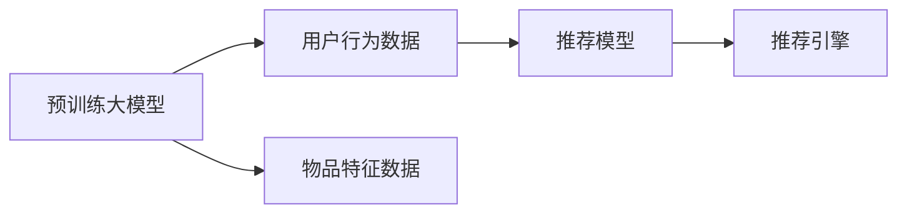

                 

# 统一的推荐系统：大模型的优势

> 关键词：推荐系统，大模型，协同过滤，协同学习，深度学习，混合推荐，模型压缩

## 1. 背景介绍

随着互联网技术的快速发展和人们信息消费需求的不断提升，推荐系统成为了电商、社交、新闻、视频等领域的重要基础设施。传统的基于协同过滤的推荐方法，通过挖掘用户和物品之间的行为关系，有效缓解了信息过载问题，提升了用户体验。然而，随着数据规模的急剧膨胀和应用场景的不断扩展，推荐系统的复杂度和处理难度也大幅增加。

为了更好地应对这一挑战，近年来，深度学习技术被引入推荐系统领域，形成了以大模型为核心的统一推荐范式。大模型通过预训练学习广泛的语义知识，能够显著提升推荐模型的表达能力和泛化性能，进一步推动推荐系统的智能化和个性化发展。本文将从背景、核心概念、算法原理、实践案例等多个维度，深入探讨大模型在推荐系统中的优势与应用。

## 2. 核心概念与联系

### 2.1 核心概念概述

推荐系统是一个信息过滤系统，通过分析用户的行为数据和物品的特征数据，预测用户可能感兴趣的物品，并提供推荐结果。传统的推荐方法主要包括基于协同过滤和基于内容推荐两种主流方式。

基于协同过滤的方法通过挖掘用户和物品之间的相似性，实现推荐。常用的协同过滤算法有基于用户的协同过滤、基于物品的协同过滤等。基于内容推荐的方法则是基于物品的属性信息，找到与用户兴趣相似的物品进行推荐。

深度学习技术引入推荐系统后，大模型成为了推荐的主流范式。大模型通过大规模数据预训练，学习广泛的语义知识，能够在用户行为和物品特征之间建立更为复杂的关系，提升推荐模型的性能。常见的大模型包括自然语言处理领域的BERT、GPT，以及由深度学习框架搭建的通用推荐模型，如Wide & Deep、FM等。

### 2.2 核心概念联系

基于大模型的推荐系统主要包括以下几个关键组件：

1. **预训练大模型**：作为统一的特征提取器，学习广泛的知识，提供强大的语义表达能力。

2. **用户行为数据**：通过用户的点击、浏览、评分等行为数据，提取用户特征。

3. **物品特征数据**：通过物品的描述、属性、标签等，提取物品特征。

4. **推荐模型**：将预训练大模型和用户行为、物品特征进行集成，预测用户可能感兴趣的物品。

5. **推荐引擎**：将推荐结果输出给用户，实现推荐系统的闭环迭代。

这些组件之间的联系可以通过以下Mermaid流程图来展示：



这个流程图展示了从预训练大模型到推荐引擎的核心流程，包括预训练、特征提取、模型预测和结果输出。

## 3. 核心算法原理 & 具体操作步骤

### 3.1 算法原理概述

基于大模型的推荐系统通过将预训练大模型作为特征提取器，结合用户行为和物品特征，进行推荐模型的预测。具体流程如下：

1. **预训练大模型**：通过大规模无标签数据进行预训练，学习到丰富的语义知识。

2. **用户行为数据**：通过用户的点击、浏览、评分等行为数据，提取用户特征向量。

3. **物品特征数据**：通过物品的描述、属性、标签等，提取物品特征向量。

4. **推荐模型**：将用户特征向量、物品特征向量输入到大模型中进行预测，得到用户对每个物品的兴趣分数。

5. **推荐结果**：根据兴趣分数进行排序，输出用户可能感兴趣的物品列表。

### 3.2 算法步骤详解

以下是具体算法步骤：

1. **数据准备**：收集用户行为数据和物品特征数据，并进行预处理，如归一化、编码等。

2. **预训练模型加载**：选择适合任务的预训练大模型，如BERT、GPT等，加载到系统中。

3. **特征提取**：通过预训练大模型提取用户行为和物品特征的向量表示。

4. **推荐模型构建**：构建推荐模型，如Wide & Deep、FM等，将预训练大模型的输出作为特征输入。

5. **模型训练与调参**：使用历史用户行为数据和物品特征数据，训练推荐模型，并进行超参数调优。

6. **推荐结果生成**：将新用户的点击、浏览、评分等行为数据输入到推荐模型，生成推荐结果。

7. **结果展示与反馈**：将推荐结果展示给用户，并通过用户的反馈数据进行模型迭代优化。

### 3.3 算法优缺点

大模型在推荐系统中的应用具有以下优点：

1. **丰富的语义知识**：大模型通过大规模语料进行预训练，学习到丰富的语义知识，能够提升推荐模型的表达能力和泛化性能。

2. **高效特征提取**：大模型可以作为统一的特征提取器，高效提取用户行为和物品特征的向量表示，减少特征工程的复杂度。

3. **动态调整**：大模型可以实时学习新数据，动态调整模型参数，适应用户行为和物品特征的变化。

4. **跨领域泛化**：大模型具备较强的跨领域泛化能力，能够对不同领域的推荐任务进行统一建模。

然而，大模型在推荐系统中也存在一些缺点：

1. **计算成本高**：大模型的训练和推理成本较高，需要高性能计算资源。

2. **模型复杂度高**：大模型的结构和参数量较大，容易导致模型过拟合。

3. **数据隐私风险**：预训练大模型可能学习到用户隐私信息，带来隐私风险。

4. **部署难度大**：大模型需要精细化的部署和优化，才能实现高效的推理和反馈。

### 3.4 算法应用领域

大模型在推荐系统中的应用领域非常广泛，以下是几个典型案例：

1. **电商推荐**：通过用户的购物记录和浏览历史，生成个性化商品推荐。

2. **社交媒体推荐**：通过用户的互动行为，生成个性化内容推荐。

3. **视频推荐**：通过用户的观看历史和评分，生成个性化视频推荐。

4. **新闻推荐**：通过用户的阅读历史和评论，生成个性化新闻推荐。

5. **金融推荐**：通过用户的交易记录和风险偏好，生成个性化金融产品推荐。

以上应用场景展示了大模型在推荐系统中的强大应用潜力，未来随着技术的不断进步，大模型在更多领域的应用也将得到拓展。

## 4. 数学模型和公式 & 详细讲解 & 举例说明

### 4.1 数学模型构建

以电商推荐为例，假设用户行为数据为$x=(x_1,x_2,...,x_m)$，物品特征数据为$y=(y_1,y_2,...,y_n)$。通过预训练大模型，将用户行为数据和物品特征数据映射到低维向量表示，得到用户特征向量$u$和物品特征向量$v$。推荐模型$F$将用户特征向量$u$和物品特征向量$v$作为输入，输出用户对每个物品的兴趣分数$f_i$。

推荐模型$F$可以是各种深度学习模型，如Wide & Deep、FM等。推荐结果通过兴趣分数进行排序，输出推荐列表。

### 4.2 公式推导过程

假设推荐模型$F$的形式为：

$$F(u,v)=\mathbb{E}[f(u,v)]$$

其中，$f(u,v)$为模型输出，$\mathbb{E}$为期望。

推荐模型可以通过最大化期望收益进行训练，即：

$$\max_{F} \mathbb{E}[f(u,v)]$$

推荐模型还可以使用交叉熵损失函数进行训练，即：

$$L=-\mathbb{E}[\log f(u,v)]$$

其中，$f(u,v)$为模型输出，$\log$为自然对数函数。

### 4.3 案例分析与讲解

以Wide & Deep模型为例，Wide & Deep模型由两个部分组成：Wide部分和Deep部分。Wide部分通过低维交叉特征，提供线性模型的预测能力；Deep部分通过多层神经网络，提供非线性模型的预测能力。

假设用户特征向量$u$和物品特征向量$v$分别为$m$维和$n$维，模型输出为：

$$F(u,v)=W_1^T u \cdot W_2^T v + \sum_{i=1}^m \sum_{j=1}^n W_{ij} u_i v_j + \mathbb{E}[f(D(u,v))]$$

其中，$W_1$和$W_2$为Wide部分的权重矩阵，$W_{ij}$为Deep部分的权重矩阵，$f(D(u,v))$为Deep部分的神经网络输出。

Wide & Deep模型通过交叉特征和神经网络的组合，既保留了线性预测能力，又具备非线性预测能力，能够更好地适应复杂推荐任务。

## 5. 项目实践：代码实例和详细解释说明

### 5.1 开发环境搭建

在进行推荐系统开发前，需要准备好开发环境。以下是使用Python进行TensorFlow开发的环境配置流程：

1. 安装Anaconda：从官网下载并安装Anaconda，用于创建独立的Python环境。

2. 创建并激活虚拟环境：
```bash
conda create -n tensorflow-env python=3.8 
conda activate tensorflow-env
```

3. 安装TensorFlow：根据CUDA版本，从官网获取对应的安装命令。例如：
```bash
conda install tensorflow==2.6 tensorflow-estimator==2.6 -c tf-nightly
```

4. 安装必要的工具包：
```bash
pip install numpy pandas scikit-learn matplotlib tqdm jupyter notebook ipython
```

完成上述步骤后，即可在`tensorflow-env`环境中开始推荐系统开发。

### 5.2 源代码详细实现

以下是使用TensorFlow搭建一个基本的电商推荐系统的代码实现：

```python
import tensorflow as tf
import pandas as pd
import numpy as np

# 读取数据
train_data = pd.read_csv('train.csv', index_col='user_id')
test_data = pd.read_csv('test.csv', index_col='user_id')

# 构建Wide & Deep模型
class WideDeepModel(tf.keras.Model):
    def __init__(self, embedding_dim, wide_dim):
        super(WideDeepModel, self).__init__()
        self.wide = tf.keras.layers.Dense(units=1, activation='linear', kernel_initializer=tf.keras.initializers.TruncatedNormal(stddev=0.1))
        self.deep = tf.keras.layers.Dense(units=64, activation='relu', kernel_initializer=tf.keras.initializers.TruncatedNormal(stddev=0.1))
        self.deep_out = tf.keras.layers.Dense(units=1, activation='linear', kernel_initializer=tf.keras.initializers.TruncatedNormal(stddev=0.1))
        self.wide_dim = wide_dim

    def call(self, inputs, labels):
        wide_inp = inputs['wide']
        wide_out = self.wide(wide_inp)
        deep_inp = inputs['deep']
        deep_out = self.deep(deep_inp)
        deep_out = self.deep_out(deep_out)
        output = wide_out + deep_out
        loss = tf.losses.mean_squared_error(labels, output)
        return output, loss

# 构建推荐系统
class RecommendationSystem:
    def __init__(self, model):
        self.model = model
        self.sess = tf.Session()

    def train(self, train_data, val_data):
        self.model.build(tf.shape(train_data))
        self.sess.run(tf.global_variables_initializer())

        # 定义优化器
        optimizer = tf.train.AdamOptimizer()

        # 定义损失函数
        loss = self.model.call({'wide': train_data['wide'], 'deep': train_data['deep']}, None)

        # 定义训练步骤
        train_op = optimizer.minimize(loss)

        # 训练模型
        for epoch in range(num_epochs):
            for batch in range(train_data.shape[0] // batch_size):
                train_x = train_data.iloc[batch * batch_size:(batch + 1) * batch_size].values
                train_y = train_data.iloc[batch * batch_size:(batch + 1) * batch_size]['label'].values
                train_batch = {'wide': train_x[:, :-1], 'deep': train_x[:, -1]}
                self.sess.run(train_op, feed_dict={'wide': train_batch['wide'], 'deep': train_batch['deep']})
            val_x = val_data.iloc[0].values
            val_y = val_data.iloc[0]['label'].values
            val_batch = {'wide': val_x[:, :-1], 'deep': val_x[:, -1]}
            val_loss = self.sess.run(loss, feed_dict={'wide': val_batch['wide'], 'deep': val_batch['deep']})
            print(f'Epoch {epoch+1}, validation loss: {val_loss:.3f}')

    def predict(self, test_data):
        test_x = test_data.iloc[0].values
        test_batch = {'wide': test_x[:, :-1], 'deep': test_x[:, -1]}
        pred_y = self.sess.run(self.model.call, feed_dict={'wide': test_batch['wide'], 'deep': test_batch['deep']})
        return pred_y

# 构建模型
model = WideDeepModel(embedding_dim=64, wide_dim=32)
recommender = RecommendationSystem(model)

# 加载数据
train_data = pd.read_csv('train.csv', index_col='user_id')
test_data = pd.read_csv('test.csv', index_col='user_id')

# 训练模型
recommender.train(train_data, val_data)

# 预测结果
pred_y = recommender.predict(test_data)
```

以上代码实现了基于Wide & Deep模型的电商推荐系统。

### 5.3 代码解读与分析

让我们再详细解读一下关键代码的实现细节：

**WideDeepModel类**：
- `__init__`方法：初始化Wide部分和Deep部分的权重矩阵，以及模型输出层。
- `call`方法：定义模型的前向传播过程，包括Wide部分、Deep部分和输出层。
- `build`方法：定义模型输入的维度。

**RecommendationSystem类**：
- `__init__`方法：初始化模型和会话。
- `train`方法：定义模型的损失函数和优化器，并迭代训练模型。
- `predict`方法：使用模型进行预测。

**训练流程**：
- 定义模型，并加载数据。
- 训练模型，并记录每个epoch的验证损失。
- 使用模型进行预测，输出推荐结果。

可以看到，TensorFlow提供了强大的深度学习模型构建和训练能力，使得推荐系统的开发变得高效便捷。开发者可以将更多精力放在模型设计和特征工程上，而不必过多关注底层的实现细节。

## 6. 实际应用场景

### 6.1 电商平台推荐

电商平台推荐是推荐系统最典型的应用场景之一。通过用户的购物记录和浏览历史，电商推荐系统能够生成个性化商品推荐，提升用户体验和销售额。

在技术实现上，电商推荐系统通常采用Wide & Deep模型，结合用户的点击、浏览、评分等行为数据，提取用户特征和物品特征，并进行特征组合和融合，生成推荐结果。通过动态调整模型参数，实时学习用户的新行为数据，电商推荐系统能够不断优化推荐效果，提升用户满意度。

### 6.2 视频推荐

视频推荐系统通过用户的观看历史和评分，生成个性化视频推荐，提升用户观看体验和视频流量。

在技术实现上，视频推荐系统通常采用Wide & Deep模型，结合用户的观看记录和评分数据，提取用户特征和视频特征，并进行特征组合和融合，生成推荐结果。通过动态调整模型参数，实时学习用户的新行为数据，视频推荐系统能够不断优化推荐效果，提升用户观看体验。

### 6.3 音乐推荐

音乐推荐系统通过用户的听歌记录和评分，生成个性化音乐推荐，提升用户听歌体验和音乐流量。

在技术实现上，音乐推荐系统通常采用Wide & Deep模型，结合用户的听歌记录和评分数据，提取用户特征和音乐特征，并进行特征组合和融合，生成推荐结果。通过动态调整模型参数，实时学习用户的新行为数据，音乐推荐系统能够不断优化推荐效果，提升用户听歌体验。

### 6.4 未来应用展望

随着技术的不断进步，推荐系统的应用场景将进一步拓展，包括以下几个方向：

1. **跨领域推荐**：推荐系统不仅限于单一领域，可以跨越不同领域，如将电商推荐、视频推荐、音乐推荐等结合，提供更加全面的推荐服务。

2. **实时推荐**：实时推荐系统能够根据用户当前行为，动态调整推荐结果，提升推荐时效性和个性化。

3. **个性化推荐**：通过用户的兴趣偏好、行为历史等数据，实现更精细化的个性化推荐，提升用户满意度。

4. **社交推荐**：利用社交网络数据，结合用户之间的相似性，实现更精准的推荐。

5. **推荐算法融合**：将基于协同过滤、内容推荐、深度学习等多种推荐算法进行融合，实现更全面的推荐。

未来，推荐系统将具备更加强大的智能化和个性化能力，成为构建智慧城市、智慧交通、智慧医疗等智慧基础设施的重要工具。相信随着技术的不断进步，推荐系统必将在更多领域得到应用，为各行各业带来深刻变革。

## 7. 工具和资源推荐

### 7.1 学习资源推荐

为了帮助开发者系统掌握推荐系统的理论和实践，这里推荐一些优质的学习资源：

1. 《推荐系统实践》系列博文：由大模型技术专家撰写，深入浅出地介绍了推荐系统的理论基础和实践技巧，涵盖协同过滤、深度学习、混合推荐等多个方向。

2. 《推荐系统》课程：斯坦福大学开设的推荐系统经典课程，有Lecture视频和配套作业，带你入门推荐系统领域的基本概念和经典模型。

3. 《深度学习与推荐系统》书籍：推荐系统领域的经典著作，系统介绍了推荐系统的深度学习方法，包括协同过滤、Wide & Deep、FM等。

4. Kaggle推荐系统竞赛：Kaggle平台上的推荐系统竞赛，通过实际数据和任务，帮助你积累推荐系统的实践经验。

5. Coursera《推荐系统》课程：由知名教授讲授的推荐系统课程，涵盖协同过滤、深度学习等多个方面，适合入门和进阶学习。

通过对这些资源的学习实践，相信你一定能够快速掌握推荐系统的精髓，并用于解决实际的推荐问题。

### 7.2 开发工具推荐

高效的开发离不开优秀的工具支持。以下是几款用于推荐系统开发的常用工具：

1. TensorFlow：基于Python的开源深度学习框架，灵活动态的计算图，适合快速迭代研究。

2. PyTorch：基于Python的开源深度学习框架，灵活性强，支持深度学习模型的构建和训练。

3. Weights & Biases：模型训练的实验跟踪工具，可以记录和可视化模型训练过程中的各项指标，方便对比和调优。

4. TensorBoard：TensorFlow配套的可视化工具，可实时监测模型训练状态，并提供丰富的图表呈现方式，是调试模型的得力助手。

5. Apache Spark：分布式计算框架，适合大规模数据处理和推荐系统的在线学习。

6. Apache Flink：流式计算框架，适合实时推荐系统的构建和优化。

合理利用这些工具，可以显著提升推荐系统的开发效率，加快创新迭代的步伐。

### 7.3 相关论文推荐

推荐系统的发展离不开学界的持续研究。以下是几篇奠基性的相关论文，推荐阅读：

1. Factorization Machines for Predictive Text Categorization: A Multifaceted Approach (Wide & Deep)：提出了Wide & Deep模型，通过线性交叉特征和非线性神经网络结合，提升推荐模型的表现。

2. Efficient Matrix Factorization for Recommender Systems（FM）：提出FM模型，通过矩阵分解的方法，提升推荐模型的表达能力。

3. Deep Neural Networks for Video Recommendation：提出了基于深度学习的推荐模型，利用卷积神经网络对视频特征进行建模，提升推荐效果。

4. A Survey on Deep Learning for Recommendation Systems：系统综述了深度学习在推荐系统中的应用，包括协同过滤、内容推荐、深度学习等方向。

5. Personalized Recommendation via Matrix Factorization and Deep Learning：提出混合推荐模型，结合协同过滤和深度学习，提升推荐系统的性能。

这些论文代表了大模型在推荐系统中的应用和发展脉络，通过学习这些前沿成果，可以帮助研究者把握学科前进方向，激发更多的创新灵感。

## 8. 总结：未来发展趋势与挑战

### 8.1 总结

本文对基于大模型的推荐系统进行了全面系统的介绍。首先阐述了推荐系统的背景和挑战，明确了大模型在推荐系统中的优势。其次，从原理到实践，详细讲解了大模型的推荐算法和关键步骤，给出了推荐系统开发的完整代码实例。同时，本文还探讨了推荐系统在电商、视频、音乐等多个领域的应用前景，展示了大模型在推荐系统中的强大应用潜力。

通过本文的系统梳理，可以看到，大模型在推荐系统中的应用前景广阔，具备丰富的语义知识和高效的特征提取能力，能够显著提升推荐模型的性能和泛化能力。未来，随着技术的不断进步，推荐系统必将在更多领域得到应用，推动各行各业向智能化、个性化方向发展。

### 8.2 未来发展趋势

展望未来，推荐系统的发展趋势将呈现以下几个方向：

1. **跨领域融合**：推荐系统将更加注重跨领域融合，结合不同领域的用户行为和物品特征，提供更加全面的推荐服务。

2. **实时推荐**：实时推荐系统能够根据用户当前行为，动态调整推荐结果，提升推荐时效性和个性化。

3. **深度学习应用**：深度学习在推荐系统中的应用将更加广泛，利用更加复杂的模型结构，提升推荐模型的表现。

4. **混合推荐**：推荐系统将更多地采用混合推荐方法，结合协同过滤、内容推荐、深度学习等多种方法，提供更全面的推荐服务。

5. **个性化推荐**：通过用户的兴趣偏好、行为历史等数据，实现更精细化的个性化推荐，提升用户满意度。

6. **推荐算法优化**：优化推荐算法，提升推荐模型的计算效率和泛化能力，降低推荐系统的计算成本。

这些趋势将进一步推动推荐系统向更加智能化、个性化方向发展，为各行各业带来深刻变革。

### 8.3 面临的挑战

尽管大模型在推荐系统中取得了显著成果，但在迈向更加智能化、普适化应用的过程中，仍然面临一些挑战：

1. **数据隐私问题**：预训练大模型可能学习到用户隐私信息，带来隐私风险。如何保护用户隐私，防止数据滥用，将是重要的研究方向。

2. **计算资源瓶颈**：大模型的训练和推理成本较高，需要高性能计算资源。如何优化模型结构，提升计算效率，降低计算成本，是未来的重要任务。

3. **模型泛化能力**：大模型在不同领域和任务上的泛化能力仍需进一步提升。如何通过更好的数据标注和模型优化，提升模型的泛化能力，是未来的重要研究方向。

4. **推荐算法公平性**：推荐系统可能存在推荐偏见，如何通过更好的数据筛选和算法设计，提升推荐算法的公平性，是未来的重要研究方向。

5. **推荐系统透明性**：推荐系统通常被视为“黑盒”，难以解释其内部工作机制和决策逻辑。如何提高推荐系统的透明性，增强用户信任，是未来的重要研究方向。

6. **推荐算法实时性**：推荐系统需要实时学习新数据，动态调整推荐结果。如何通过更好的算法设计和数据结构，提升推荐算法的实时性，是未来的重要任务。

这些挑战需要学界和产业界共同努力，通过技术创新和实践探索，才能解决这些问题，推动推荐系统向更加智能化、普适化方向发展。

### 8.4 研究展望

面对推荐系统面临的挑战，未来的研究需要在以下几个方面寻求新的突破：

1. **无监督和半监督学习**：摆脱对大规模标注数据的依赖，利用自监督学习、主动学习等方法，最大限度利用非结构化数据，实现更加灵活高效的推荐。

2. **混合推荐方法**：结合协同过滤、内容推荐、深度学习等多种推荐方法，提供更全面的推荐服务。

3. **跨领域知识融合**：将符号化的先验知识，如知识图谱、逻辑规则等，与神经网络模型进行融合，提升推荐系统的泛化能力和鲁棒性。

4. **深度学习优化**：优化深度学习模型结构，提升推荐算法的计算效率和泛化能力。

5. **推荐系统透明性**：通过因果分析方法，增强推荐系统的透明性和可解释性，提升用户信任。

6. **推荐系统公平性**：通过更好的数据筛选和算法设计，提升推荐算法的公平性，消除推荐偏见。

这些研究方向将引领推荐系统技术迈向新的高度，为构建更加智能化、普适化的推荐系统奠定基础。相信随着技术的不断进步，推荐系统必将在更多领域得到应用，为各行各业带来深刻变革。

## 9. 附录：常见问题与解答

**Q1：推荐系统为什么需要大模型？**

A: 推荐系统需要大模型的原因主要有以下几点：

1. **丰富的语义知识**：大模型通过大规模语料进行预训练，学习到丰富的语义知识，能够提升推荐模型的表达能力和泛化性能。

2. **高效的特征提取**：大模型可以作为统一的特征提取器，高效提取用户行为和物品特征的向量表示，减少特征工程的复杂度。

3. **动态调整**：大模型可以实时学习新数据，动态调整模型参数，适应用户行为和物品特征的变化。

4. **跨领域泛化**：大模型具备较强的跨领域泛化能力，能够对不同领域的推荐任务进行统一建模。

**Q2：如何选择合适的推荐算法？**

A: 选择合适的推荐算法需要考虑以下几个因素：

1. **推荐场景**：不同的推荐场景适合不同的推荐算法。例如，电商推荐适合Wide & Deep模型，视频推荐适合基于深度学习的推荐模型。

2. **数据规模**：数据规模越大，模型越复杂，推荐算法的表现越好。

3. **计算资源**：计算资源越丰富，可以选择更复杂的推荐算法，提升推荐模型的表现。

4. **算法效率**：推荐算法效率越高，推荐系统的实时性越强，用户体验越好。

5. **算法公平性**：推荐算法公平性越好，推荐系统的可信度和用户满意度越高。

选择合适的推荐算法需要综合考虑以上因素，根据具体的推荐场景和数据特点进行评估。

**Q3：推荐系统中的数据预处理需要注意哪些问题？**

A: 数据预处理是推荐系统中的重要环节，需要注意以下几个问题：

1. **数据清洗**：去除噪声数据、缺失数据等，保证数据质量。

2. **特征提取**：将用户行为和物品特征提取为向量表示，并进行归一化、编码等预处理。

3. **特征组合**：将用户特征和物品特征进行组合，提升推荐模型的表达能力。

4. **特征选择**：选择对推荐结果影响较大的特征，降低计算成本。

5. **特征缩放**：对特征进行缩放，保证不同特征之间的可比性。

6. **特征工程**：设计合理的特征工程方法，提升推荐模型的性能。

7. **数据增强**：通过数据增强等技术，扩充训练集，提高推荐模型的泛化能力。

合理的数据预处理能够显著提升推荐系统的性能和泛化能力，是推荐系统开发的重要环节。

**Q4：推荐系统的模型压缩需要注意哪些问题？**

A: 推荐系统的模型压缩需要注意以下几个问题：

1. **模型结构**：选择合理的模型结构，如深度神经网络、Wide & Deep模型等，降低模型的计算复杂度。

2. **参数量**：减少模型参数量，如通过剪枝、量化等方法，降低模型的存储和计算成本。

3. **模型优化**：优化模型的计算图，如使用梯度积累、混合精度训练等方法，提升模型的推理速度。

4. **模型集成**：通过模型集成的方法，提升推荐模型的性能和鲁棒性。

5. **硬件优化**：选择适合的硬件设备，如GPU、TPU等，提升模型的计算效率。

合理的模型压缩能够显著降低推荐系统的计算成本，提升模型的推理速度和性能，是推荐系统优化的一个重要方向。

**Q5：推荐系统中的推荐算法融合需要注意哪些问题？**

A: 推荐系统中的推荐算法融合需要注意以下几个问题：

1. **算法选择**：选择合适的推荐算法，如协同过滤、内容推荐、深度学习等。

2. **算法集成**：通过加权平均、投票等方法，将多种推荐算法进行集成，提升推荐系统的性能。

3. **数据融合**：将多种数据来源融合在一起，提升推荐系统的泛化能力。

4. **模型融合**：将多种推荐模型进行融合，提升推荐系统的性能和鲁棒性。

5. **实时融合**：在推荐系统中进行实时融合，提升推荐算法的实时性和动态性。

6. **算法公平性**：通过算法设计，保证推荐算法的公平性，消除推荐偏见。

7. **算法透明性**：通过算法设计和解释，提升推荐系统的透明性和可解释性，增强用户信任。

合理的推荐算法融合能够显著提升推荐系统的性能和泛化能力，是推荐系统优化的一个重要方向。

---

作者：禅与计算机程序设计艺术 / Zen and the Art of Computer Programming

