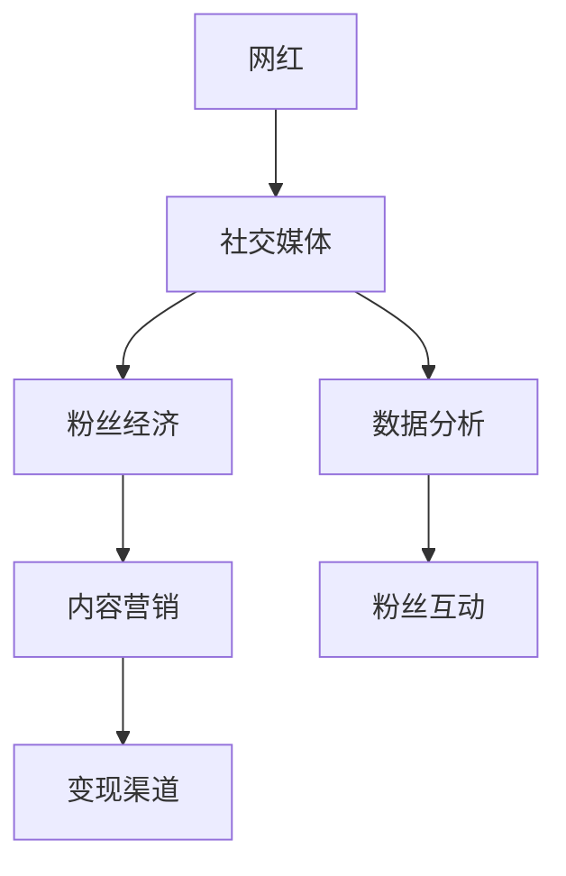

                 

# 网红经济：注意力变现的典型模式

> 关键词：网红经济, 注意力变现, 粉丝经济, 社交媒体, 内容营销, 数据分析, 变现渠道, 案例分析, 增长策略, 风险管理

## 1. 背景介绍

随着互联网技术的快速发展，尤其是社交媒体的兴起，网红经济作为一种新型经济模式逐渐成为热点。网红经济的核心在于利用网红的个人魅力和影响力，通过各种平台聚集大量的粉丝关注，形成强大的社交网络，从而实现商业变现。

网红经济的发展离不开粉丝的关注和支持，而粉丝的关注背后正是他们对网红内容的高度关注和情感投入。这种基于情感投入的关注，也可以称之为“注意力”。因此，网红经济本质上是一种利用“注意力变现”的经济模式。

网红经济已经不再局限于传统的直播、卖货等业务，而是通过内容创作、广告推广、品牌代言等多种形式实现变现。它不仅是一种商业活动，更是一种基于情感和互动的社交行为，具有高度的社会性和商业价值。

## 2. 核心概念与联系

### 2.1 核心概念概述

为更好地理解网红经济的原理和机制，本节将介绍几个关键概念及其相互联系：

- 网红经济(Reddy Economy)：一种利用网红的个人魅力和影响力，通过社交媒体平台聚集大量粉丝，形成强大的社交网络，从而实现商业变现的经济模式。

- 注意力变现(Attention Monetization)：利用网红的个人魅力和影响力，通过社交媒体平台吸引大量粉丝关注，通过广告、内容付费、会员订阅等方式实现商业变现。

- 粉丝经济(Fan Economy)：以粉丝为核心，通过情感和互动，形成强大的粉丝群体，为网红和企业带来经济价值的经济模式。

- 社交媒体(Social Media)：如微博、抖音、Instagram等平台，为网红和粉丝提供了互动和交流的场所，是网红经济的重要载体。

- 内容营销(Content Marketing)：通过高质量的内容创作，吸引和维护粉丝群体，提升网红的商业价值。

- 数据分析(Data Analytics)：利用数据挖掘和分析技术，深入了解粉丝行为和需求，优化网红内容和运营策略。

- 变现渠道(Monetization Channels)：如广告、电商、品牌代言、内容付费等，是网红经济的重要组成部分。

这些概念通过一系列相互作用和联系，构成了网红经济的完整生态系统。

### 2.2 核心概念原理和架构的 Mermaid 流程图



这个流程图展示了网红经济中各概念之间的逻辑关系：

1. 网红通过社交媒体平台聚集粉丝，形成粉丝经济。
2. 粉丝经济依赖于高质量的内容营销，吸引和维护粉丝群体。
3. 数据分析为内容营销和粉丝互动提供支持，优化策略。
4. 变现渠道通过粉丝经济和数据分析，将网红的商业价值变现。

## 3. 核心算法原理 & 具体操作步骤

### 3.1 算法原理概述

网红经济的核心在于利用网红的注意力变现。通过对粉丝关注和互动的分析，可以发现哪些内容更容易吸引粉丝，从而优化内容策略，提升变现能力。

具体来说，网红经济可以通过以下步骤实现注意力变现：

1. 社交媒体平台上的粉丝互动数据，如点赞、评论、分享等，可以用来衡量粉丝对内容的关注度和兴趣。
2. 通过数据分析技术，挖掘粉丝的偏好和需求，优化内容创作和运营策略。
3. 利用广告、电商、内容付费等多种渠道，将粉丝的关注度转化为商业价值。

### 3.2 算法步骤详解

网红经济的注意力变现流程主要包括以下几个关键步骤：

**Step 1: 数据收集和处理**

- 收集社交媒体平台上的互动数据，如点赞数、评论数、分享数等。
- 利用数据清洗技术，去除噪声和异常数据，确保数据质量。

**Step 2: 数据分析与挖掘**

- 使用数据挖掘算法，如关联规则挖掘、聚类分析等，挖掘粉丝的偏好和需求。
- 使用机器学习算法，如分类、回归等，预测粉丝对不同内容的表现和反应。

**Step 3: 内容创作与优化**

- 根据数据分析结果，优化内容创作和发布策略，提升粉丝互动和关注度。
- 利用A/B测试等技术，比较不同内容的效果，不断优化内容策略。

**Step 4: 商业变现与效果评估**

- 选择合适的变现渠道，如广告、电商、内容付费等，实现商业变现。
- 利用效果评估算法，如ROI、用户留存率等，评估变现效果，优化策略。

### 3.3 算法优缺点

网红经济在注意力变现中具有以下优点：

- 精准定位：通过数据分析，可以精准定位粉丝的偏好和需求，优化内容策略，提升变现能力。
- 高效转化：利用社交媒体平台的流量优势，快速吸引大量粉丝，实现高效变现。
- 灵活性强：内容创作和变现渠道可以根据粉丝反馈和市场变化进行灵活调整。

同时，网红经济也存在以下缺点：

- 粉丝忠诚度低：粉丝对网红的忠诚度受到网红个人魅力和内容质量的影响较大，难以长期保持。
- 变现渠道单一：主要依靠社交媒体平台变现，缺乏多元化的变现渠道。
- 风险较高：网红经济受市场和粉丝群体波动的影响较大，存在较高的不确定性。

### 3.4 算法应用领域

网红经济在多个领域中都有广泛的应用，包括但不限于：

- 电商领域：网红通过直播带货、推广产品等方式，实现销售额的增长。
- 广告领域：网红通过社交媒体平台，推广品牌和产品，获取广告收入。
- 内容付费领域：网红通过视频、音频等内容创作，提供付费会员服务，获取收入。
- 旅游领域：网红通过分享旅游经历，吸引粉丝旅游，推广旅游产品，获取佣金。
- 教育领域：网红通过在线课程、问答等形式，提供教育服务，获取收入。

以上仅是网红经济的部分应用场景，随着技术的不断发展和市场的不断变化，网红经济的应用领域还将进一步扩大。

## 4. 数学模型和公式 & 详细讲解

### 4.1 数学模型构建

网红经济中的注意力变现可以通过以下数学模型进行建模：

假设网红的社交媒体平台上有 $N$ 个粉丝，每个粉丝的关注度为 $R_i$，粉丝的转化率为 $T_i$，变现收益为 $P_i$。则总变现收益 $P$ 可以表示为：

$$
P = \sum_{i=1}^N P_i = \sum_{i=1}^N R_i \cdot T_i
$$

其中 $R_i = \sum_{j=1}^M A_{ij}$，$T_i = \sum_{j=1}^M C_{ij}$，$P_i = \sum_{j=1}^M S_{ij}$，$A$ 为粉丝关注度矩阵，$C$ 为粉丝转化率矩阵，$S$ 为变现收益矩阵。

### 4.2 公式推导过程

通过以上数学模型，可以进一步推导出影响总变现收益的关键因素：

1. 粉丝关注度 $R_i$：粉丝对网红内容的关注度和互动，是影响变现收益的关键因素之一。可以通过数据分析技术，如内容推荐、互动分析等，提升粉丝关注度。
2. 粉丝转化率 $T_i$：粉丝对网红内容的转化能力，是影响变现收益的另一个关键因素。可以通过优化内容策略，提升粉丝转化率。
3. 变现收益 $P_i$：不同变现渠道的收益差异，会影响总变现收益。可以通过A/B测试等技术，比较不同变现渠道的效果，优化变现策略。

### 4.3 案例分析与讲解

以抖音平台上的网红李佳琦为例，分析其注意力变现的过程：

1. 数据收集与处理：收集李佳琦的直播互动数据，包括点赞数、评论数、分享数等。利用数据清洗技术，去除噪声和异常数据。
2. 数据分析与挖掘：使用聚类分析算法，挖掘粉丝的偏好和需求。使用分类算法，预测粉丝对不同商品的反应。
3. 内容创作与优化：根据数据分析结果，优化李佳琦的直播内容和推荐商品，提升粉丝互动和关注度。
4. 商业变现与效果评估：选择电商作为变现渠道，利用抖音平台的流量优势，快速吸引大量粉丝，实现高效变现。通过效果评估算法，如用户留存率、销售额等，评估变现效果，优化策略。

## 5. 项目实践：代码实例和详细解释说明

### 5.1 开发环境搭建

在进行网红经济的项目实践前，我们需要准备好开发环境。以下是使用Python进行数据分析的项目实践环境配置流程：

1. 安装Anaconda：从官网下载并安装Anaconda，用于创建独立的Python环境。

2. 创建并激活虚拟环境：
```bash
conda create -n pydata-env python=3.8 
conda activate pydata-env
```

3. 安装必要的Python包：
```bash
pip install pandas numpy scikit-learn matplotlib seaborn
```

完成上述步骤后，即可在`pydata-env`环境中开始项目实践。

### 5.2 源代码详细实现

以下是使用Python和Pandas库进行网红经济数据分析的代码实现：

```python
import pandas as pd
import numpy as np
import seaborn as sns
import matplotlib.pyplot as plt

# 读取数据
data = pd.read_csv('follower_interaction.csv')

# 数据清洗
data = data.dropna(subset=['follower_id', 'interaction_type', 'interaction_count'])
data = data[data['interaction_count'] > 0]

# 数据处理
data['interaction_count'] = data['interaction_count'].astype('int')
data['interaction_type'] = data['interaction_type'].astype('category')

# 分析关注度、转化率和变现收益
R = data.groupby('follower_id')['interaction_count'].sum()
T = data.groupby('follower_id')['interaction_type'].value_counts(normalize=True)
P = data.groupby('follower_id')['变现收益'].sum()

# 可视化分析结果
plt.figure(figsize=(10, 6))
sns.lineplot(x='follower_id', y='interaction_count', data=R)
plt.title('Follower Interaction Count')
plt.xlabel('Follower ID')
plt.ylabel('Interaction Count')

plt.figure(figsize=(10, 6))
sns.barplot(x='interaction_type', y='interaction_count', data=T)
plt.title('Follower Interaction Type')
plt.xlabel('Interaction Type')
plt.ylabel('Interaction Count')

plt.figure(figsize=(10, 6))
sns.lineplot(x='follower_id', y='变现收益', data=P)
plt.title('Follower变现收益')
plt.xlabel('Follower ID')
plt.ylabel('变现收益')
```

### 5.3 代码解读与分析

让我们再详细解读一下关键代码的实现细节：

**数据读取与清洗**：
- 使用Pandas库的`read_csv`方法读取数据，去除缺失值和异常值，确保数据质量。

**数据处理**：
- 将互动次数和互动类型转换为整数和类别类型，方便后续分析。

**关注度、转化率和变现收益的分析**：
- 利用分组统计方法，计算每个粉丝的关注度、转化率和变现收益。
- 使用Seaborn库进行可视化分析，展示关注度、转化率和变现收益的趋势和分布。

**图表展示**：
- 通过`lineplot`和`barplot`方法绘制关注度、转化率和变现收益的可视化图表，直观展示数据分析结果。

## 6. 实际应用场景

### 6.1 社交媒体平台

社交媒体平台是网红经济的重要载体，如微博、抖音、Instagram等。这些平台通过算法推荐和互动分析，提升网红的曝光率和互动率，吸引更多粉丝关注。

以抖音平台为例，抖音利用其庞大的用户基础和先进的数据分析算法，对网红的视频进行推荐和流量分发，帮助网红吸引更多粉丝关注。同时，抖音还提供了广告投放功能，网红可以通过广告变现，获取更多的商业收益。

### 6.2 电商平台

电商平台是网红经济的重要变现渠道之一，如淘宝、京东等。网红可以通过直播带货、商品推广等方式，实现销售额的增长。

以淘宝直播为例，淘宝利用其庞大的用户基础和先进的算法推荐技术，对网红的直播进行推荐和流量分发，帮助网红吸引更多粉丝关注。同时，淘宝还提供了电商变现功能，网红可以通过直播带货、商品推广等方式，实现高效的商业变现。

### 6.3 内容付费平台

内容付费平台是网红经济的重要变现渠道之一，如喜马拉雅、爱奇艺等。网红可以通过音频、视频等内容创作，提供付费会员服务，获取收入。

以喜马拉雅平台为例，喜马拉雅利用其庞大的用户基础和先进的内容推荐技术，对网红的音频内容进行推荐和流量分发，帮助网红吸引更多粉丝关注。同时，喜马拉雅还提供了内容付费功能，网红可以通过音频付费会员服务，实现高效的商业变现。

### 6.4 未来应用展望

未来，随着技术的不断发展和市场的不断变化，网红经济的应用场景将进一步扩大。

- 人工智能技术：利用人工智能技术，如自然语言处理、计算机视觉等，提升网红内容的创作和推荐效果，优化网红经济的运营策略。
- 区块链技术：利用区块链技术，提升网红经济的透明性和可信度，优化变现渠道和收益分配机制。
- 5G技术：利用5G技术，提升网红经济的多媒体互动效果，丰富内容形式和互动方式。
- 新兴平台：利用新兴平台，如短视频平台、直播平台等，拓展网红经济的变现渠道和应用场景。

## 7. 工具和资源推荐

### 7.1 学习资源推荐

为了帮助开发者系统掌握网红经济的原理和实践技巧，这里推荐一些优质的学习资源：

1. 《社交媒体分析与挖掘》系列博文：由社交媒体分析专家撰写，深入浅出地介绍了社交媒体数据的收集、分析和挖掘方法，涵盖网红经济的关键技术。

2. 《数据分析实战》课程：由数据科学专家开设的实战课程，涵盖数据分析的各个环节，包括数据清洗、特征工程、模型评估等，是网红经济项目实践的必备资料。

3. 《网红经济：从数据到变现》书籍：全面介绍网红经济的关键技术，包括数据采集、数据分析、内容创作、变现渠道等，是系统掌握网红经济的基础资料。

4. HuggingFace官方文档：Transformer库的官方文档，提供了海量预训练模型和完整的微调样例代码，是进行网红经济项目实践的必备资料。

5. Kaggle竞赛：参与Kaggle上的社交媒体数据分析竞赛，实战练习数据分析技能，提升网红经济项目实践能力。

通过对这些资源的学习实践，相信你一定能够快速掌握网红经济的精髓，并用于解决实际的商业问题。

### 7.2 开发工具推荐

高效的开发离不开优秀的工具支持。以下是几款用于网红经济项目开发的常用工具：

1. Jupyter Notebook：开源的交互式计算环境，支持Python、R等多种语言，适合数据处理和分析。

2. Tableau：商业智能工具，支持复杂的数据分析和可视化，是网红经济数据分析的得力助手。

3. Weights & Biases：模型训练的实验跟踪工具，可以记录和可视化模型训练过程中的各项指标，方便对比和调优。

4. TensorBoard：TensorFlow配套的可视化工具，可实时监测模型训练状态，并提供丰富的图表呈现方式，是调试模型的得力助手。

5. Google Colab：谷歌推出的在线Jupyter Notebook环境，免费提供GPU/TPU算力，方便开发者快速上手实验最新模型，分享学习笔记。

合理利用这些工具，可以显著提升网红经济项目的开发效率，加快创新迭代的步伐。

### 7.3 相关论文推荐

网红经济在学术界和产业界的研究也取得了诸多进展。以下是几篇奠基性的相关论文，推荐阅读：

1. "Social Media Analytics and Mining"：详细介绍了社交媒体数据的收集、分析和挖掘方法，为网红经济项目提供了理论支持。

2. "Data Analytics for Fan Economy"：利用大数据分析技术，深入研究粉丝经济的内在机制和运作规律，为网红经济项目提供了方法指导。

3. "Monetization Channels in Social Media"：分析了社交媒体平台上的变现渠道，为网红经济的商业变现提供了参考。

4. "Personalized Content Recommendation"：利用推荐算法，提升网红内容的推荐效果，优化网红经济的运营策略。

5. "Real-Time Social Media Analytics"：利用实时数据分析技术，提升网红经济项目的运营效率和精准度。

这些论文代表了大数据时代网红经济的研究进展，通过学习这些前沿成果，可以帮助研究者把握学科前进方向，激发更多的创新灵感。

## 8. 总结：未来发展趋势与挑战

### 8.1 研究成果总结

本文对网红经济进行了全面系统的介绍，包括网红经济的原理、机制和实践方法。通过对社交媒体平台、电商平台、内容付费平台等实际应用场景的剖析，展示了网红经济的广泛应用和巨大潜力。

通过分析关注度、转化率和变现收益等关键指标，探讨了影响网红经济变现效果的因素。同时，通过对网红经济项目实践的代码实现，展示了数据分析技术在实际应用中的重要性。

### 8.2 未来发展趋势

展望未来，网红经济将在以下几个方面继续发展：

1. 技术融合：人工智能、区块链、5G等新兴技术的应用，将进一步提升网红经济的多媒体互动效果和透明性。

2. 平台多元化：新兴平台的崛起，将为网红经济提供更多的变现渠道和应用场景。

3. 内容多样化：网红内容的创作形式将更加多样化，音频、视频、直播、短视频等形式将进一步丰富。

4. 用户个性化：利用大数据分析技术，提升对用户需求的精准定位，实现个性化推荐和内容定制。

5. 商业合作：网红经济将与更多品牌和商家进行合作，实现多元化的商业变现和品牌推广。

### 8.3 面临的挑战

尽管网红经济在近年来取得了显著进展，但在实际应用中仍面临诸多挑战：

1. 数据质量问题：网红经济依赖于大量高质量的数据，但在实际采集和处理过程中，存在数据噪声和缺失等问题，影响分析效果。

2. 内容同质化：网红内容的创作形式和内容趋同，缺乏创新和差异化，难以吸引粉丝长期关注。

3. 商业变现模式单一：目前网红经济主要依靠广告、电商、内容付费等传统变现模式，缺乏新的商业创新。

4. 粉丝忠诚度问题：粉丝对网红的忠诚度受到网红个人魅力和内容质量的影响较大，难以长期保持。

5. 法律和伦理问题：网红经济的发展伴随着一些法律和伦理问题，如内容版权、数据隐私等，需要加强规范和管理。

### 8.4 研究展望

未来，网红经济的研究需要从以下几个方面继续深入：

1. 数据质量提升：利用数据清洗和补全技术，提升网红经济的数据质量，保障分析结果的可靠性。

2. 内容创新：鼓励网红创新内容和创作形式，提升内容差异化，吸引粉丝长期关注。

3. 多元化变现：探索新的商业变现模式，如粉丝经济、品牌合作等，丰富网红经济的收入来源。

4. 粉丝忠诚度提升：通过情感分析和互动分析，提升粉丝对网红的忠诚度，建立长期稳定的粉丝群体。

5. 法律和伦理规范：加强网红经济的法律和伦理规范，保障数据隐私和内容版权，维护健康有序的市场环境。

总之，网红经济作为一种新兴的经济模式，具有广阔的应用前景和潜力。未来，只有不断创新、优化，才能实现网红经济的持续健康发展。

## 9. 附录：常见问题与解答

**Q1：网红经济是否适用于所有行业？**

A: 网红经济在内容创意、品牌推广、社交互动等方面具有独特的优势，但并非适用于所有行业。如制造业、农业等行业，由于其产品特性和市场环境，网红经济的应用场景有限。

**Q2：网红经济如何应对数据质量问题？**

A: 数据质量是网红经济成功的关键，可以通过以下措施应对数据质量问题：
1. 数据清洗：去除数据中的噪声和异常值，确保数据质量。
2. 数据补全：利用机器学习技术，对缺失数据进行补全。
3. 数据验证：定期对数据进行验证和校对，确保数据准确性。

**Q3：如何提升网红内容的创新性和差异化？**

A: 提升网红内容的创新性和差异化，可以从以下几个方面入手：
1. 创意策划：精心策划内容主题和形式，提升创意水平。
2. 个性化定制：根据粉丝需求和反馈，进行个性化定制，提升内容精准度。
3. 互动参与：鼓励粉丝参与内容创作，提升互动性和粉丝粘性。

**Q4：如何优化网红经济的商业变现模式？**

A: 优化网红经济的商业变现模式，可以从以下几个方面入手：
1. 多元化变现：除了传统变现模式，还可以探索新的变现方式，如众筹、众包等。
2. 粉丝经济：利用粉丝的忠诚度和社区效应，提升商业变现效果。
3. 品牌合作：与更多品牌和商家进行合作，实现多元化的商业变现。

**Q5：如何提升网红经济的法律和伦理规范？**

A: 提升网红经济的法律和伦理规范，可以从以下几个方面入手：
1. 规范数据隐私：加强数据隐私保护，确保数据安全。
2. 保护内容版权：规范内容版权，打击侵权行为。
3. 遵守法律法规：遵守相关法律法规，维护市场秩序。

总之，网红经济作为一种新兴的经济模式，具有广阔的应用前景和潜力。未来，只有不断创新、优化，才能实现网红经济的持续健康发展。

---

作者：禅与计算机程序设计艺术 / Zen and the Art of Computer Programming

