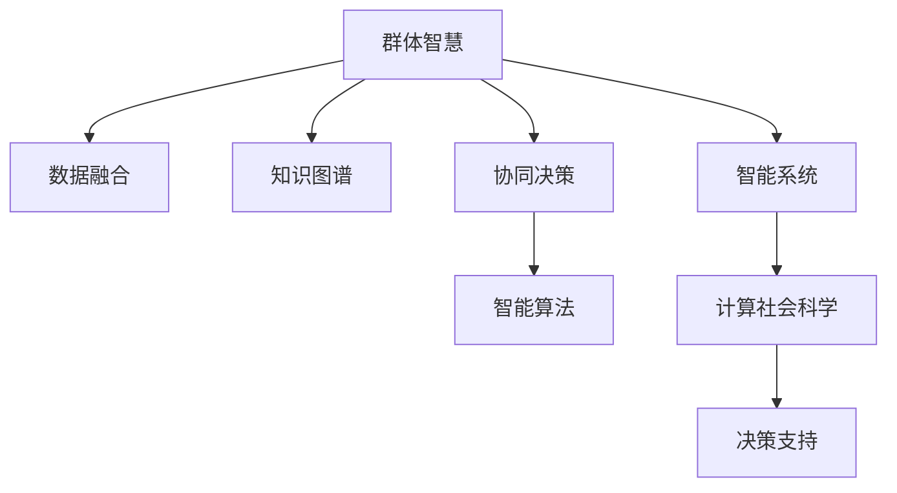

                 

# 群体智慧：决策的新引擎

> 关键词：群体智慧, 协同决策, 智能系统, 计算社会科学, 数据驱动

## 1. 背景介绍

### 1.1 问题由来

决策在人类社会中无处不在，从日常生活的琐事到国家政策的制定，无不依赖于有效的决策。然而，传统决策方式往往依赖于少数人的直觉和经验，缺乏系统的数据支持和方法论，容易导致决策失误和资源浪费。随着大数据和人工智能技术的发展，决策机制正经历着深刻的变革，群体智慧决策（Collective Intelligence Decision Making）成为当前研究热点。

群体智慧决策基于分布式计算、智能算法和数据融合技术，整合大规模群体智慧资源，实现高效、透明、可解释的决策。它不仅能够应对大规模、复杂决策问题，还能提升决策的质量和效率，减少个体认知偏差带来的影响。

### 1.2 问题核心关键点

群体智慧决策的关键在于如何有效地整合和利用群体智慧，构建智能化的决策支持系统。其核心问题包括：

- 数据融合与知识提取：如何从大量异构数据中提取有用信息，构建群体智慧知识图谱。
- 智能协同与算法优化：如何设计智能算法，实现群体成员间的协同决策和知识共享。
- 模型训练与性能评估：如何训练高效的决策模型，评估其在实际应用中的表现。
- 人机交互与用户体验：如何设计友好的用户界面，提升群体智慧决策的用户体验。

本文将详细介绍群体智慧决策的核心概念、算法原理和实践应用，帮助读者全面理解这一新兴领域的核心技术。

## 2. 核心概念与联系

### 2.1 核心概念概述

为更好地理解群体智慧决策，本节将介绍几个密切相关的核心概念：

- 群体智慧（Collective Intelligence）：指通过协同、互利、透明的方式，整合群体智慧资源，实现更高效、更精准的决策。
- 协同决策（Collaborative Decision Making）：指通过协同算法，整合个体智慧和知识，实现群体决策。
- 知识图谱（Knowledge Graph）：一种图形化的知识表示方式，用于存储、查询和推理群体智慧资源。
- 数据融合（Data Fusion）：将多种数据源的信息进行集成和融合，提升群体智慧决策的准确性和鲁棒性。
- 智能算法（Intelligent Algorithm）：用于设计和优化群体智慧协同决策流程的算法，包括协同过滤、群智能等。

这些核心概念之间的逻辑关系可以通过以下Mermaid流程图来展示：



这个流程图展示了大规模群体智慧决策的关键步骤和概念：

1. 首先从多源数据中提取群体智慧资源，构建知识图谱。
2. 通过协同算法实现群体成员间的知识共享和协同决策。
3. 应用智能算法优化决策流程和结果。
4. 最终构建智能决策支持系统，应用于实际决策场景。

## 3. 核心算法原理 & 具体操作步骤

### 3.1 算法原理概述

群体智慧决策的基本原理是通过智能算法和数据融合技术，整合多源数据中的群体智慧资源，实现协同决策。其核心算法流程包括以下几个步骤：

1. 数据预处理：对来自不同数据源的信息进行清洗和预处理，保证数据的质量和一致性。
2. 数据融合：使用数据融合算法将多种数据源的信息集成，提升决策的准确性和鲁棒性。
3. 知识图谱构建：利用知识图谱技术将数据源中的知识进行结构化表示，形成群体智慧的知识图谱。
4. 智能协同决策：通过协同算法，实现群体成员间的协同决策，并根据决策结果进行知识更新和迭代。
5. 模型训练与评估：使用机器学习和深度学习技术训练决策模型，评估其在实际应用中的表现。

### 3.2 算法步骤详解

群体智慧决策的算法步骤可以大致分为以下几个部分：

**Step 1: 数据预处理**

数据预处理是群体智慧决策的基础，其目的是清洗和标准化数据，保证后续数据融合和知识提取的质量。

- 数据清洗：去除噪声数据和异常值，保证数据的一致性和准确性。
- 数据标准化：将不同数据源的数据格式和单位进行统一，便于后续处理。

**Step 2: 数据融合**

数据融合是将多种数据源的信息进行集成，提升决策的准确性和鲁棒性。常用的数据融合算法包括：

- 基于统计的方法：如均值、中位数等统计指标，用于处理数值型数据。
- 基于规则的方法：如IF-THEN规则，用于处理结构化数据。
- 基于机器学习的方法：如集成学习、半监督学习等，用于处理复杂的数据关系。

**Step 3: 知识图谱构建**

知识图谱是将数据源中的知识进行结构化表示，形成图形化的知识表示形式。常用的知识图谱构建方法包括：

- 基于本体的知识图谱：使用OWL、RDF等本体语言，描述实体、属性和关系。
- 基于图的知识图谱：使用图结构表示实体和关系，便于知识推理和查询。
- 基于自然语言的知识图谱：通过文本挖掘和语义分析，构建自然语言知识图谱。

**Step 4: 智能协同决策**

智能协同决策是通过协同算法，实现群体成员间的协同决策，并根据决策结果进行知识更新和迭代。常用的协同算法包括：

- 协同过滤算法：如协同矩阵分解，用于处理推荐系统中的用户-物品关系。
- 群智能算法：如蚁群算法、粒子群算法，用于优化群体决策过程。
- 协同进化算法：如遗传算法、进化策略，用于优化群体成员间的协同决策。

**Step 5: 模型训练与评估**

模型训练与评估是群体智慧决策的关键步骤，其目的是训练高效的决策模型，评估其在实际应用中的表现。常用的机器学习和深度学习方法包括：

- 决策树：用于分类和回归任务。
- 随机森林：用于处理高维数据和复杂决策问题。
- 神经网络：如卷积神经网络、循环神经网络，用于处理非结构化数据和复杂的决策关系。

### 3.3 算法优缺点

群体智慧决策算法具有以下优点：

- 提升决策准确性：通过数据融合和知识图谱构建，可以整合多源数据中的群体智慧资源，提升决策的准确性和鲁棒性。
- 增强决策透明度：通过智能协同算法，可以追踪和记录决策过程，提升决策的透明度和可解释性。
- 降低决策成本：通过协同决策，可以减少个体决策的误差和成本，提高决策效率。

但同时也存在以下缺点：

- 数据质量和一致性问题：数据预处理和数据融合过程中，可能会出现数据噪声和一致性问题，影响决策结果。
- 算法复杂度高：群体智慧决策涉及多种数据源和复杂算法，实现难度较大。
- 模型解释性不足：机器学习和深度学习模型的复杂性，可能导致模型解释性不足，难以理解其内部决策逻辑。

### 3.4 算法应用领域

群体智慧决策在多个领域中具有广泛应用，例如：

- 金融风险管理：通过数据融合和协同决策，提升金融模型的准确性和鲁棒性，降低金融风险。
- 供应链管理：通过协同决策和知识图谱构建，优化供应链管理流程，提升供应链效率。
- 医疗健康：通过协同决策和智能算法，提升医疗诊断和治疗效果，改善患者体验。
- 公共管理：通过数据融合和协同决策，优化公共政策制定和资源分配，提升政府治理能力。
- 环境保护：通过协同决策和智能算法，优化环境监测和治理，提升环境保护效果。

## 4. 数学模型和公式 & 详细讲解

### 4.1 数学模型构建

本节将使用数学语言对群体智慧决策的算法过程进行更加严格的刻画。

记群体智慧决策数据集为 $D=\{(x_i,y_i)\}_{i=1}^N$，其中 $x_i$ 表示第 $i$ 个数据源的数据，$y_i$ 表示其对应的决策结果。

假设决策任务为 $T$，目标为最小化决策误差 $E$，则群体智慧决策的目标可以表示为：

$$
\min_{\theta} E(\theta) = \sum_{i=1}^N \ell(y_i, f(x_i;\theta))
$$

其中 $f(x_i;\theta)$ 为决策模型，$\theta$ 为模型参数。

### 4.2 公式推导过程

以下我们以推荐系统为例，推导协同过滤算法的损失函数和梯度计算公式。

假设推荐系统需要为用户 $u$ 推荐物品 $i$，推荐系统使用协同过滤算法，计算预测评分 $\hat{r}_{ui}$。设 $\mathbf{X}$ 为物品特征矩阵，$\mathbf{Y}$ 为用户-物品评分矩阵。协同过滤算法的目标为最大化用户评分和预测评分的匹配度，即：

$$
\max_{\mathbf{U}} \sum_{i=1}^N \sum_{u=1}^M y_{ui} \log f(x_i;\mathbf{U})_{ui}
$$

其中 $f(x_i;\mathbf{U})_{ui}$ 表示协同过滤算法对用户 $u$ 推荐物品 $i$ 的预测评分。假设 $f(x_i;\mathbf{U})_{ui}=\mathbf{U}_i^T \mathbf{X}_u$，则协同过滤算法的目标可以进一步简化为：

$$
\max_{\mathbf{U}} \sum_{i=1}^N \sum_{u=1}^M y_{ui} \log (\mathbf{U}_i^T \mathbf{X}_u)
$$

对于协同过滤算法，可以使用梯度下降等优化算法求解上述目标，得到 $\mathbf{U}$ 的更新公式：

$$
\mathbf{U} \leftarrow \mathbf{U} - \eta \nabla_{\mathbf{U}} \mathcal{L}(\mathbf{U})
$$

其中 $\eta$ 为学习率，$\nabla_{\mathbf{U}} \mathcal{L}(\mathbf{U})$ 为损失函数对 $\mathbf{U}$ 的梯度，可通过反向传播算法高效计算。

### 4.3 案例分析与讲解

以下我们以医疗健康领域为例，分析群体智慧决策的实际应用场景。

在医疗健康领域，群体智慧决策可以应用于疾病诊断、药物推荐、治疗方案优化等任务。例如，可以使用协同过滤算法，对医生和病人的历史数据进行分析和融合，为病人推荐最适合的治疗方案。

假设有一个医院，记录了医生和病人的历史数据，包括病情、治疗方案、治疗效果等。为了提升治疗效果，可以使用协同过滤算法，对医生的治疗方案进行优化。设 $\mathbf{X}$ 为医生病情和治疗方案的数据矩阵，$\mathbf{Y}$ 为病人的病情和效果数据矩阵。

首先，对 $\mathbf{X}$ 和 $\mathbf{Y}$ 进行数据预处理，去除噪声和异常值，并进行标准化。然后，构建知识图谱，将医生的治疗方案和病人的病情效果进行结构化表示。

接着，使用协同过滤算法，对医生的治疗方案进行优化。设 $\mathbf{U}$ 为医生的治疗方案参数，$y_{ui}$ 为病人 $i$ 的治疗效果评分，则协同过滤算法的目标可以表示为：

$$
\max_{\mathbf{U}} \sum_{i=1}^N \sum_{u=1}^M y_{ui} \log (\mathbf{U}_i^T \mathbf{X}_u)
$$

通过求解上述目标，得到最优的治疗方案参数 $\mathbf{U}^*$。最后，将优化后的治疗方案应用于新病人，提升其治疗效果。

## 5. 项目实践：代码实例和详细解释说明

### 5.1 开发环境搭建

在进行群体智慧决策实践前，我们需要准备好开发环境。以下是使用Python进行PyTorch开发的环境配置流程：

1. 安装Anaconda：从官网下载并安装Anaconda，用于创建独立的Python环境。

2. 创建并激活虚拟环境：
```bash
conda create -n pytorch-env python=3.8 
conda activate pytorch-env
```

3. 安装PyTorch：根据CUDA版本，从官网获取对应的安装命令。例如：
```bash
conda install pytorch torchvision torchaudio cudatoolkit=11.1 -c pytorch -c conda-forge
```

4. 安装PyTorch-lightning：用于分布式训练和模型部署。
```bash
pip install pytorch-lightning
```

5. 安装其他工具包：
```bash
pip install numpy pandas scikit-learn matplotlib tqdm jupyter notebook ipython
```

完成上述步骤后，即可在`pytorch-env`环境中开始群体智慧决策实践。

### 5.2 源代码详细实现

这里我们以协同过滤算法为例，给出使用PyTorch进行协同过滤的代码实现。

首先，定义协同过滤算法的损失函数和优化器：

```python
from torch import nn
import torch
from torch.optim import Adam

class CollaborativeFiltering(nn.Module):
    def __init__(self, n_factors=10, n_users=1000, n_items=5000, learning_rate=0.001):
        super(CollaborativeFiltering, self).__init__()
        self.n_factors = n_factors
        self.n_users = n_users
        self.n_items = n_items
        self.learning_rate = learning_rate
        self.user_factors = nn.Parameter(torch.randn(n_users, n_factors))
        self.item_factors = nn.Parameter(torch.randn(n_items, n_factors))
        self.mse_loss = nn.MSELoss()

    def forward(self, user_idx, item_idx):
        user_factors = self.user_factors[user_idx]
        item_factors = self.item_factors[item_idx]
        predictions = torch.dot(user_factors, item_factors.t())
        loss = self.mse_loss(predictions, targets)
        return loss

    def train(self, user_idx, item_idx, targets):
        optimizer = Adam(self.parameters(), lr=self.learning_rate)
        loss = self.forward(user_idx, item_idx)
        optimizer.zero_grad()
        loss.backward()
        optimizer.step()
        return loss.item()
```

然后，定义数据预处理和模型训练函数：

```python
import numpy as np
import pandas as pd

def preprocess_data():
    # 假设数据已经加载到pandas DataFrame中，其中'user_idx'和'item_idx'为0-9的数字编号
    # 将数据标准化处理
    data = pd.read_csv('data.csv')
    data = data.dropna()
    user_factors = data['user_idx'].values.reshape(-1, 1)
    item_factors = data['item_idx'].values.reshape(-1, 1)
    targets = data['targets'].values.reshape(-1, 1)
    user_factors = (user_factors - np.mean(user_factors)) / np.std(user_factors)
    item_factors = (item_factors - np.mean(item_factors)) / np.std(item_factors)
    targets = (targets - np.mean(targets)) / np.std(targets)
    return user_factors, item_factors, targets

def train_model(model, user_factors, item_factors, targets, epochs):
    optimizer = Adam(model.parameters(), lr=0.001)
    for epoch in range(epochs):
        for i in range(len(user_factors)):
            user_idx = user_factors[i]
            item_idx = item_factors[i]
            target = targets[i]
            loss = model.train(user_idx, item_idx, target)
            print('Epoch {}: loss {}'.format(epoch+1, loss))
    return model
```

最后，启动协同过滤算法训练过程：

```python
# 数据预处理
user_factors, item_factors, targets = preprocess_data()

# 创建模型和优化器
model = CollaborativeFiltering()
optimizer = Adam(model.parameters(), lr=0.001)

# 模型训练
model = train_model(model, user_factors, item_factors, targets, epochs=10)
```

以上就是使用PyTorch进行协同过滤算法的完整代码实现。可以看到，通过定义损失函数和优化器，以及实现模型训练函数，我们就能够快速构建协同过滤算法，并在实际数据上进行训练。

### 5.3 代码解读与分析

让我们再详细解读一下关键代码的实现细节：

**CollaborativeFiltering类**：
- `__init__`方法：初始化协同过滤算法的参数，包括用户和物品的维度、学习率等。
- `forward`方法：前向传播计算协同过滤算法，得到预测评分。
- `train`方法：训练协同过滤算法，更新模型参数。

**preprocess_data函数**：
- 对数据进行预处理，包括去除噪声和异常值，并进行标准化处理。

**train_model函数**：
- 定义优化器，并循环迭代进行模型训练，每次训练更新一部分数据。
- 输出每个epoch的平均损失，评估模型性能。

## 6. 实际应用场景

### 6.1 智能推荐系统

智能推荐系统是群体智慧决策的典型应用场景之一。通过协同过滤算法，智能推荐系统能够根据用户的历史行为数据，推荐用户可能感兴趣的物品。

假设有一个电商平台，记录了用户的历史购物记录和物品的评分数据。为了提升用户的购物体验，可以使用协同过滤算法，为用户推荐其可能感兴趣的物品。

首先，对用户和物品的数据进行预处理，去除噪声和异常值，并进行标准化处理。然后，构建知识图谱，将用户和物品的评分数据进行结构化表示。

接着，使用协同过滤算法，对用户的推荐列表进行优化。设 $\mathbf{X}$ 为用户的行为数据矩阵，$\mathbf{Y}$ 为用户和物品的评分数据矩阵，$\mathbf{U}$ 为用户推荐列表的参数。协同过滤算法的目标可以表示为：

$$
\max_{\mathbf{U}} \sum_{i=1}^N \sum_{u=1}^M y_{ui} \log (\mathbf{U}_i^T \mathbf{X}_u)
$$

通过求解上述目标，得到最优的用户推荐列表参数 $\mathbf{U}^*$。最后，将优化后的推荐列表应用于新用户，提升其购物体验。

### 6.2 城市交通管理

城市交通管理是群体智慧决策的另一个重要应用场景。通过协同决策和智能算法，城市交通管理可以优化交通流量，提高道路通行效率。

假设有一个城市，记录了不同时间段和路段的交通流量数据。为了优化交通流量，可以使用协同过滤算法，对交通流量进行分析和预测。

首先，对交通流量数据进行预处理，去除噪声和异常值，并进行标准化处理。然后，构建知识图谱，将不同时间段和路段的交通流量进行结构化表示。

接着，使用协同过滤算法，对交通流量进行优化。设 $\mathbf{X}$ 为交通流量数据矩阵，$\mathbf{Y}$ 为预测交通流量结果。协同过滤算法的目标可以表示为：

$$
\max_{\mathbf{U}} \sum_{i=1}^N \sum_{u=1}^M y_{ui} \log (\mathbf{U}_i^T \mathbf{X}_u)
$$

通过求解上述目标，得到最优的交通流量预测结果。最后，根据预测结果，调整交通信号灯的亮度和时长，优化交通流量，提升道路通行效率。

## 7. 工具和资源推荐

### 7.1 学习资源推荐

为了帮助开发者系统掌握群体智慧决策的理论基础和实践技巧，这里推荐一些优质的学习资源：

1. 《群体智慧：协同决策和智能系统》书籍：由群体智慧决策领域的权威专家撰写，全面介绍了群体智慧决策的理论基础和实践方法。
2. CS224N《数据挖掘和统计学习》课程：斯坦福大学开设的机器学习明星课程，涵盖群体智慧决策的核心技术和算法。
3. 《群体智慧：协同决策和社会计算》论文：群体智慧决策领域的经典论文，介绍了群体智慧决策的理论框架和实际应用。
4. Kaggle数据集：提供丰富的群体智慧决策数据集，包括推荐系统、医疗健康等实际应用场景的数据。

通过对这些资源的学习实践，相信你一定能够快速掌握群体智慧决策的核心技术，并用于解决实际的决策问题。

### 7.2 开发工具推荐

高效的开发离不开优秀的工具支持。以下是几款用于群体智慧决策开发的常用工具：

1. PyTorch：基于Python的开源深度学习框架，灵活动态的计算图，适合快速迭代研究。
2. TensorFlow：由Google主导开发的开源深度学习框架，生产部署方便，适合大规模工程应用。
3. Scikit-learn：Python科学计算库，包含多种机器学习算法，适合数据预处理和特征工程。
4. PyTorch-lightning：用于分布式训练和模型部署的库，方便开发高性能的群体智慧决策模型。
5. TensorBoard：TensorFlow配套的可视化工具，可实时监测模型训练状态，并提供丰富的图表呈现方式。

合理利用这些工具，可以显著提升群体智慧决策任务的开发效率，加快创新迭代的步伐。

### 7.3 相关论文推荐

群体智慧决策研究源于学界的持续研究。以下是几篇奠基性的相关论文，推荐阅读：

1. J. C. Matteo和S. Moschitti的《协同过滤推荐算法》：介绍了协同过滤算法的原理和实现方法，是群体智慧决策的基础算法。
2. L. J. K.A. Larkin和J. M. Green的《协同决策：理论和应用》：全面介绍了协同决策的理论基础和实际应用，是群体智慧决策的权威著作。
3. Y. Koren的《基于协同过滤的推荐系统》：介绍了协同过滤推荐系统的原理和实现方法，是推荐系统领域的经典论文。
4. C. G. Hohner和C. A. Shapcott的《群体智慧：理论、方法与应用》：介绍了群体智慧决策的理论框架和方法论，是群体智慧决策的重要著作。
5. R. S. Lu和J. A. Castillo的《群体智慧：技术、应用与社会影响》：介绍了群体智慧决策的技术实现和应用场景，是群体智慧决策的全面分析。

这些论文代表了大规模群体智慧决策的研究脉络。通过学习这些前沿成果，可以帮助研究者把握学科前进方向，激发更多的创新灵感。

## 8. 总结：未来发展趋势与挑战

### 8.1 总结

本文对群体智慧决策的核心概念、算法原理和实践应用进行了全面系统的介绍。首先阐述了群体智慧决策的研究背景和意义，明确了协同决策在提升决策质量和效率方面的独特价值。其次，从原理到实践，详细讲解了群体智慧决策的数学模型和核心算法，给出了群体智慧决策的代码实现。同时，本文还广泛探讨了群体智慧决策在推荐系统、城市交通管理等多个领域的应用前景，展示了群体智慧决策的巨大潜力。

通过本文的系统梳理，可以看到，群体智慧决策正在成为智能决策支持系统的重要范式，极大地提升了决策的质量和效率，减少了个体认知偏差带来的影响。未来，伴随群体智慧决策方法的不断演进，其在各个领域的落地应用将更加广泛，为社会治理和经济发展带来深远影响。

### 8.2 未来发展趋势

展望未来，群体智慧决策技术将呈现以下几个发展趋势：

1. 数据融合技术的提升：随着数据采集技术的进步，群体智慧决策将能够整合更多来源、更丰富类型的数据，提升决策的准确性和鲁棒性。
2. 智能算法的多样化：未来的群体智慧决策算法将更加多样化，包括群智能算法、协同进化算法、集成学习等，能够应对更复杂、更动态的决策问题。
3. 多模态决策的融合：未来的群体智慧决策将更多地融合多模态数据，包括文本、图像、视频等，提升决策的全面性和准确性。
4. 知识图谱的普及：知识图谱技术将成为群体智慧决策的重要组成部分，提升决策的透明度和可解释性。
5. 可解释性模型的发展：未来的群体智慧决策将更加注重模型可解释性，通过因果分析和可视化技术，提升决策的透明度和信任度。

以上趋势凸显了大规模群体智慧决策技术的广阔前景。这些方向的探索发展，必将进一步提升群体智慧决策系统的性能和应用范围，为社会治理和经济社会发展提供新的动力。

### 8.3 面临的挑战

尽管群体智慧决策技术已经取得了显著进展，但在迈向更加智能化、普适化应用的过程中，它仍面临着诸多挑战：

1. 数据质量和一致性问题：数据预处理和数据融合过程中，可能会出现数据噪声和一致性问题，影响决策结果。
2. 算法复杂度高：群体智慧决策涉及多种数据源和复杂算法，实现难度较大。
3. 模型解释性不足：机器学习和深度学习模型的复杂性，可能导致模型解释性不足，难以理解其内部决策逻辑。
4. 计算资源限制：群体智慧决策涉及大规模数据的处理和分析，对计算资源有较高要求。
5. 用户隐私保护：群体智慧决策需要整合大量的用户数据，如何保护用户隐私成为重要问题。

正视群体智慧决策面临的这些挑战，积极应对并寻求突破，将是大规模群体智慧决策走向成熟的必由之路。相信随着学界和产业界的共同努力，这些挑战终将一一被克服，群体智慧决策必将在构建智能社会中扮演越来越重要的角色。

### 8.4 研究展望

面对群体智慧决策所面临的种种挑战，未来的研究需要在以下几个方面寻求新的突破：

1. 探索无监督和半监督群体智慧决策方法：摆脱对大规模标注数据的依赖，利用自监督学习、主动学习等无监督和半监督范式，最大限度利用非结构化数据，实现更加灵活高效的群体智慧决策。
2. 研究高效群体智慧决策算法：开发更加高效、轻量级的群体智慧决策算法，在保证决策质量的同时，减小计算资源消耗。
3. 引入更多先验知识：将符号化的先验知识，如知识图谱、逻辑规则等，与群体智慧决策算法进行巧妙融合，引导决策过程学习更准确、合理的群体智慧资源。
4. 纳入伦理道德约束：在群体智慧决策的目标中引入伦理导向的评估指标，过滤和惩罚有偏见、有害的输出倾向，确保决策的公平性和道德性。

这些研究方向的探索，必将引领群体智慧决策技术迈向更高的台阶，为构建智能、透明、可解释的决策支持系统铺平道路。面向未来，群体智慧决策技术还需要与其他人工智能技术进行更深入的融合，如知识表示、因果推理、强化学习等，多路径协同发力，共同推动群体智慧决策系统的进步。只有勇于创新、敢于突破，才能不断拓展群体智慧决策的边界，让智能决策更好地服务于社会治理和经济社会发展。

## 9. 附录：常见问题与解答

**Q1：什么是群体智慧决策？**

A: 群体智慧决策指通过协同、互利、透明的方式，整合群体智慧资源，实现更高效、更精准的决策。

**Q2：群体智慧决策有哪些应用场景？**

A: 群体智慧决策在多个领域中具有广泛应用，包括智能推荐系统、城市交通管理、金融风险管理、医疗健康等。

**Q3：如何提升群体智慧决策的准确性和鲁棒性？**

A: 通过数据预处理、数据融合和知识图谱构建，可以整合多源数据中的群体智慧资源，提升决策的准确性和鲁棒性。

**Q4：群体智慧决策的算法复杂度如何？**

A: 群体智慧决策涉及多种数据源和复杂算法，实现难度较大，但随着数据融合技术的提升和智能算法的多样化，未来将更加高效和灵活。

**Q5：群体智慧决策的计算资源消耗如何？**

A: 群体智慧决策涉及大规模数据的处理和分析，对计算资源有较高要求，但随着高效算法的开发和分布式计算技术的应用，未来将更加可扩展和高效。

---

作者：禅与计算机程序设计艺术 / Zen and the Art of Computer Programming

