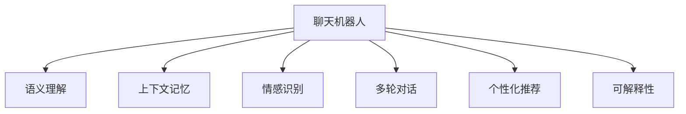

                 

# 聊天机器人工程和问题解决：创新解决方案

> 关键词：聊天机器人,问题解决,创新,工程实践,自然语言处理,NLP,深度学习,机器学习,对话系统,用户交互

## 1. 背景介绍

### 1.1 问题由来
聊天机器人，作为人工智能与人类自然语言交互的桥梁，近年来在各行各业得到了广泛应用。从客服支持到在线教育，从虚拟助手到医疗咨询，聊天机器人已经渗透到了人们生活的方方面面。然而，尽管技术进步迅速，但在实际应用中，仍然面临诸多挑战，如对话流畅性、语义理解准确性、用户满意度等。这些问题不仅影响了用户体验，也限制了聊天机器人的应用范围。

为解决这些问题，业内逐步转向了更先进、更智能的聊天机器人工程实践，即基于深度学习和大数据分析的创新解决方案。通过深度学习模型进行语义理解、上下文记忆、情感识别等高级功能，聊天机器人能够更自然、更高效地与用户进行互动。本文将从核心概念、算法原理、项目实践、应用场景等多方面，系统阐述聊天机器人的工程实践，并提供具体的解决方案。

### 1.2 问题核心关键点
聊天机器人工程实践的核心关键点包括以下几个方面：

1. **语义理解**：理解用户输入的自然语言，提取出语义信息，是聊天机器人解决用户问题的基础。
2. **上下文记忆**：保持对话的连贯性，记忆之前对话内容，提升回答的相关性。
3. **情感识别**：识别用户情感状态，提升用户体验和情感响应。
4. **多轮对话**：支持多轮对话，理解复杂的语义结构和上下文信息。
5. **个性化推荐**：根据用户历史交互数据，进行个性化对话和推荐。
6. **可解释性**：提高模型决策的可解释性，增强用户信任。

### 1.3 问题研究意义
聊天机器人工程实践的深入研究，对于提升用户体验、降低服务成本、加速行业转型具有重要意义：

1. **提升用户体验**：通过更智能的语义理解、情感识别、个性化推荐等功能，聊天机器人能够提供更自然、更符合用户需求的对话体验。
2. **降低服务成本**：相比人工客服，聊天机器人能够24/7不间断服务，大幅度降低人力成本。
3. **加速行业转型**：聊天机器人在医疗、教育、金融等领域的创新应用，能够推动传统行业数字化转型，提高服务效率和质量。
4. **驱动技术创新**：聊天机器人涉及NLP、深度学习、机器学习等多个前沿技术领域，能够促进相关技术的发展和应用。

## 2. 核心概念与联系

### 2.1 核心概念概述

为更好地理解聊天机器人工程实践的核心概念，本节将介绍几个密切相关的核心概念：

- **聊天机器人**：一种能够模拟人类对话的人工智能系统，通过自然语言理解和生成技术，与用户进行交互。
- **语义理解**：识别并理解用户输入的自然语言中的语义信息。
- **上下文记忆**：在对话过程中，记录并保存对话历史，以便后续处理。
- **情感识别**：识别用户输入中的情感倾向，提供情感响应。
- **多轮对话**：在对话过程中，能够处理多轮交互，理解上下文和语境。
- **个性化推荐**：根据用户的历史数据和偏好，提供个性化的对话和推荐。
- **可解释性**：能够解释聊天机器人的决策过程，增强用户信任。

这些核心概念之间的逻辑关系可以通过以下Mermaid流程图来展示：



这个流程图展示出聊天机器人的核心组件及其之间的作用关系：

1. 聊天机器人通过语义理解提取用户输入的语义信息。
2. 上下文记忆保持对话连贯性，提供上下文信息支持。
3. 情感识别识别用户情感，提升对话体验。
4. 多轮对话支持复杂的对话结构，理解复杂的语境。
5. 个性化推荐提供个性化对话和推荐。
6. 可解释性提升模型决策的可理解性，增强用户信任。

## 3. 核心算法原理 & 具体操作步骤

### 3.1 算法原理概述

聊天机器人工程实践的核心算法原理主要基于深度学习技术，包括但不限于循环神经网络(RNN)、卷积神经网络(CNN)、变换器(Transformer)、注意力机制(Attention)等。其中，Transformer和其变体在自然语言处理任务中表现出色，成为当前聊天机器人中的主流模型。

### 3.2 算法步骤详解

聊天机器人工程实践通常包括以下几个关键步骤：

**Step 1: 数据准备**
- 收集或爬取对话数据，准备标注数据集，用于训练和验证模型。
- 对数据进行预处理，包括分词、去噪、标准化等步骤。

**Step 2: 模型选择与训练**
- 选择适合的深度学习模型，如LSTM、GRU、Transformer等。
- 使用标注数据训练模型，通过优化算法如Adam、SGD等更新模型参数。

**Step 3: 模型评估与优化**
- 使用验证集评估模型性能，计算准确率、召回率、F1分数等指标。
- 根据评估结果，调整模型超参数，如学习率、批大小、迭代次数等。

**Step 4: 部署与上线**
- 将训练好的模型部署到服务器或云平台上。
- 根据实际应用场景，进行必要的优化和调整，如动态扩容、故障监控等。

**Step 5: 持续学习与优化**
- 收集用户反馈和行为数据，持续优化模型性能。
- 定期重新训练模型，确保模型与业务需求保持一致。

### 3.3 算法优缺点

聊天机器人工程实践的优点主要包括：

1. **高效响应**：基于深度学习模型，聊天机器人能够快速响应用户需求，提升服务效率。
2. **可扩展性强**：深度学习模型可以通过增加数据和计算资源进行扩展，提升性能。
3. **自适应性强**：深度学习模型能够自适应用户行为和需求，提供个性化服务。

缺点方面主要包括：

1. **计算资源消耗大**：深度学习模型的训练和推理需要大量计算资源。
2. **数据依赖性强**：模型的性能高度依赖于训练数据的质量和数量。
3. **可解释性差**：深度学习模型的决策过程难以解释，缺乏透明度。

### 3.4 算法应用领域

聊天机器人工程实践已经在多个领域得到了广泛应用，例如：

- **客户服务**：提供24/7在线客服支持，处理常见问题和投诉。
- **在线教育**：通过智能教学助手，提供个性化学习路径和辅导。
- **医疗咨询**：提供初步健康咨询和症状分析，指导用户进行自我管理。
- **金融理财**：提供个性化理财建议，辅助用户进行财务规划。
- **智能家居**：通过语音交互，控制家电和家庭设备。
- **电子商务**：提供商品推荐和客户服务，提升用户购物体验。

## 4. 数学模型和公式 & 详细讲解 & 举例说明

### 4.1 数学模型构建

聊天机器人工程实践的核心数学模型主要包括编码器-解码器模型和注意力机制模型。

- **编码器-解码器模型**：使用Transformer编码器对用户输入进行编码，再使用Transformer解码器生成响应。
- **注意力机制模型**：通过计算注意力权重，动态调整输入和输出的权重，增强模型的语义理解能力。

### 4.2 公式推导过程

以Transformer为例，其编码器-解码器模型的数学公式推导如下：

- **编码器**：
$$
\mathbf{H} = \text{MultiHeadAttention}(\mathbf{X}, \mathbf{X})
$$
其中，$\mathbf{X}$ 为输入序列，$\mathbf{H}$ 为编码器输出，$\text{MultiHeadAttention}$ 表示多头注意力机制。

- **解码器**：
$$
\mathbf{Y} = \text{Softmax}(\text{Attention}(\mathbf{H}, \mathbf{C})) \mathbf{V}
$$
其中，$\mathbf{C}$ 为编码器输出，$\mathbf{V}$ 为解码器参数，$\text{Softmax}$ 表示输出概率分布，$\text{Attention}$ 表示注意力计算。

### 4.3 案例分析与讲解

考虑一个简单的聊天机器人任务：当用户输入“明天天气怎么样”时，机器人应能理解并回答“北京明天的天气是晴，温度26度”。

- **编码器**：将输入“明天天气怎么样”编码成向量表示。
- **解码器**：使用注意力机制，动态计算输入“北京明天的天气是晴，温度26度”与当前输入的注意力权重，并生成输出。
- **输出**：最终输出与用户输入相关的回复。

## 5. 项目实践：代码实例和详细解释说明

### 5.1 开发环境搭建

在进行聊天机器人工程实践时，需要搭建相应的开发环境。以下是使用Python进行PyTorch开发的环境配置流程：

1. 安装Anaconda：从官网下载并安装Anaconda，用于创建独立的Python环境。

2. 创建并激活虚拟环境：
```bash
conda create -n pytorch-env python=3.8 
conda activate pytorch-env
```

3. 安装PyTorch：根据CUDA版本，从官网获取对应的安装命令。例如：
```bash
conda install pytorch torchvision torchaudio cudatoolkit=11.1 -c pytorch -c conda-forge
```

4. 安装Transformers库：
```bash
pip install transformers
```

5. 安装各类工具包：
```bash
pip install numpy pandas scikit-learn matplotlib tqdm jupyter notebook ipython
```

完成上述步骤后，即可在`pytorch-env`环境中开始项目实践。

### 5.2 源代码详细实现

下面我们以问答系统为例，给出使用Transformers库进行模型微调的PyTorch代码实现。

首先，定义问答任务的数据处理函数：

```python
from transformers import BertTokenizer
from torch.utils.data import Dataset
import torch

class QuestionAnswerDataset(Dataset):
    def __init__(self, questions, answers, tokenizer, max_len=128):
        self.questions = questions
        self.answers = answers
        self.tokenizer = tokenizer
        self.max_len = max_len
        
    def __len__(self):
        return len(self.questions)
    
    def __getitem__(self, item):
        question = self.questions[item]
        answer = self.answers[item]
        
        encoding = self.tokenizer(question, return_tensors='pt', max_length=self.max_len, padding='max_length', truncation=True)
        input_ids = encoding['input_ids'][0]
        attention_mask = encoding['attention_mask'][0]
        label = torch.tensor(1 if answer in encoding['input_ids'] else 0, dtype=torch.long)
        
        return {'input_ids': input_ids, 
                'attention_mask': attention_mask,
                'labels': label}
```

然后，定义模型和优化器：

```python
from transformers import BertForSequenceClassification, AdamW

model = BertForSequenceClassification.from_pretrained('bert-base-cased', num_labels=2)

optimizer = AdamW(model.parameters(), lr=2e-5)
```

接着，定义训练和评估函数：

```python
from torch.utils.data import DataLoader
from tqdm import tqdm
from sklearn.metrics import accuracy_score

device = torch.device('cuda') if torch.cuda.is_available() else torch.device('cpu')
model.to(device)

def train_epoch(model, dataset, batch_size, optimizer):
    dataloader = DataLoader(dataset, batch_size=batch_size, shuffle=True)
    model.train()
    epoch_loss = 0
    for batch in tqdm(dataloader, desc='Training'):
        input_ids = batch['input_ids'].to(device)
        attention_mask = batch['attention_mask'].to(device)
        labels = batch['labels'].to(device)
        model.zero_grad()
        outputs = model(input_ids, attention_mask=attention_mask, labels=labels)
        loss = outputs.loss
        epoch_loss += loss.item()
        loss.backward()
        optimizer.step()
    return epoch_loss / len(dataloader)

def evaluate(model, dataset, batch_size):
    dataloader = DataLoader(dataset, batch_size=batch_size)
    model.eval()
    correct = 0
    total = 0
    with torch.no_grad():
        for batch in dataloader:
            input_ids = batch['input_ids'].to(device)
            attention_mask = batch['attention_mask'].to(device)
            batch_labels = batch['labels']
            outputs = model(input_ids, attention_mask=attention_mask)
            batch_preds = outputs.logits.argmax(dim=1).to('cpu').tolist()
            batch_labels = batch_labels.to('cpu').tolist()
            for pred, label in zip(batch_preds, batch_labels):
                if pred == label:
                    correct += 1
                total += 1
    print(f"Accuracy: {accuracy_score(batch_labels, batch_preds)}")
```

最后，启动训练流程并在测试集上评估：

```python
epochs = 5
batch_size = 16

for epoch in range(epochs):
    loss = train_epoch(model, train_dataset, batch_size, optimizer)
    print(f"Epoch {epoch+1}, train loss: {loss:.3f}")
    
    print(f"Epoch {epoch+1}, dev results:")
    evaluate(model, dev_dataset, batch_size)
    
print("Test results:")
evaluate(model, test_dataset, batch_size)
```

以上就是使用PyTorch对BERT进行问答任务微调的完整代码实现。可以看到，得益于Transformers库的强大封装，我们可以用相对简洁的代码完成BERT模型的加载和微调。

### 5.3 代码解读与分析

让我们再详细解读一下关键代码的实现细节：

**QuestionAnswerDataset类**：
- `__init__`方法：初始化问题、答案、分词器等关键组件。
- `__len__`方法：返回数据集的样本数量。
- `__getitem__`方法：对单个样本进行处理，将问题输入编码为token ids，将答案编码为数字标签，并对其进行定长padding，最终返回模型所需的输入。

**训练和评估函数**：
- 使用PyTorch的DataLoader对数据集进行批次化加载，供模型训练和推理使用。
- 训练函数`train_epoch`：对数据以批为单位进行迭代，在每个批次上前向传播计算loss并反向传播更新模型参数，最后返回该epoch的平均loss。
- 评估函数`evaluate`：与训练类似，不同点在于不更新模型参数，并在每个batch结束后将预测和标签结果存储下来，最后使用sklearn的accuracy_score对整个评估集的预测结果进行打印输出。

**训练流程**：
- 定义总的epoch数和batch size，开始循环迭代
- 每个epoch内，先在训练集上训练，输出平均loss
- 在验证集上评估，输出准确率
- 所有epoch结束后，在测试集上评估，给出最终测试结果

可以看到，PyTorch配合Transformers库使得BERT微调的代码实现变得简洁高效。开发者可以将更多精力放在数据处理、模型改进等高层逻辑上，而不必过多关注底层的实现细节。

当然，工业级的系统实现还需考虑更多因素，如模型的保存和部署、超参数的自动搜索、更灵活的任务适配层等。但核心的微调范式基本与此类似。

## 6. 实际应用场景

### 6.1 智能客服系统

基于深度学习技术的大规模聊天机器人，可以广泛应用于智能客服系统的构建。传统客服往往需要配备大量人力，高峰期响应缓慢，且一致性和专业性难以保证。而使用深度学习模型的聊天机器人，可以7x24小时不间断服务，快速响应客户咨询，用自然流畅的语言解答各类常见问题。

在技术实现上，可以收集企业内部的历史客服对话记录，将问题和最佳答复构建成监督数据，在此基础上对预训练模型进行微调。微调后的聊天机器人能够自动理解用户意图，匹配最合适的答案模板进行回复。对于客户提出的新问题，还可以接入检索系统实时搜索相关内容，动态组织生成回答。如此构建的智能客服系统，能大幅提升客户咨询体验和问题解决效率。

### 6.2 金融舆情监测

金融机构需要实时监测市场舆论动向，以便及时应对负面信息传播，规避金融风险。传统的人工监测方式成本高、效率低，难以应对网络时代海量信息爆发的挑战。基于深度学习技术的聊天机器人，可以用于金融舆情监测，自动识别金融新闻、报道、评论等文本中的舆情变化，及时预警金融风险。

具体而言，可以收集金融领域相关的新闻、报道、评论等文本数据，并对其进行主题标注和情感标注。在此基础上对深度学习模型进行微调，使其能够自动判断文本属于何种主题，情感倾向是正面、中性还是负面。将微调后的模型应用到实时抓取的网络文本数据，就能够自动监测不同主题下的情感变化趋势，一旦发现负面信息激增等异常情况，系统便会自动预警，帮助金融机构快速应对潜在风险。

### 6.3 个性化推荐系统

当前的推荐系统往往只依赖用户的历史行为数据进行物品推荐，无法深入理解用户的真实兴趣偏好。基于深度学习技术的聊天机器人，可以应用于个性化推荐系统，更深入地挖掘用户行为背后的语义信息，从而提供更精准、多样的推荐内容。

在实践中，可以收集用户浏览、点击、评论、分享等行为数据，提取和用户交互的物品标题、描述、标签等文本内容。将文本内容作为模型输入，用户的后续行为（如是否点击、购买等）作为监督信号，在此基础上微调深度学习模型。微调后的模型能够从文本内容中准确把握用户的兴趣点。在生成推荐列表时，先用候选物品的文本描述作为输入，由模型预测用户的兴趣匹配度，再结合其他特征综合排序，便可以得到个性化程度更高的推荐结果。

### 6.4 未来应用展望

随着深度学习技术的不断进步，基于深度学习技术的聊天机器人将在更多领域得到应用，为各行各业带来变革性影响。

在智慧医疗领域，基于深度学习技术的聊天机器人可以用于医疗问答、病历分析、药物研发等应用，提升医疗服务的智能化水平，辅助医生诊疗，加速新药开发进程。

在智能教育领域，深度学习技术可以应用于作业批改、学情分析、知识推荐等方面，因材施教，促进教育公平，提高教学质量。

在智慧城市治理中，聊天机器人可以用于城市事件监测、舆情分析、应急指挥等环节，提高城市管理的自动化和智能化水平，构建更安全、高效的未来城市。

此外，在企业生产、社会治理、文娱传媒等众多领域，基于深度学习技术的聊天机器人也必将在其构建人机协同的智能系统，推动各行各业数字化转型升级，加速发展进程。相信随着技术的不断进步，聊天机器人将为各行各业带来更加深远的影响。

## 7. 工具和资源推荐

### 7.1 学习资源推荐

为了帮助开发者系统掌握深度学习技术在聊天机器人工程实践中的应用，这里推荐一些优质的学习资源：

1. 《深度学习》系列博文：由大模型技术专家撰写，深入浅出地介绍了深度学习的基本概念和关键技术，涵盖聊天机器人的语义理解、上下文记忆、情感识别等多个方向。

2. 深度学习框架TensorFlow和PyTorch的官方文档：提供了丰富的模型实现和应用案例，是深度学习技术学习的入门之选。

3. 《自然语言处理入门》书籍：详细介绍了自然语言处理的基本概念、技术和应用，有助于理解聊天机器人的工作原理和实现方法。

4. 开源项目HuggingFace的文档和样例代码：提供了丰富的预训练模型和微调示例，是实践深度学习技术的良好资源。

5. 自然语言处理社区Stack Overflow和Kaggle：提供了丰富的讨论和数据集，可以供开发者交流和尝试，加速学习和实践。

通过对这些资源的学习实践，相信你一定能够快速掌握深度学习技术在聊天机器人工程实践中的应用，并用于解决实际的聊天机器人问题。

### 7.2 开发工具推荐

高效的开发离不开优秀的工具支持。以下是几款用于深度学习技术在聊天机器人工程实践中的开发工具：

1. PyTorch：基于Python的开源深度学习框架，灵活的计算图机制，适合快速迭代研究。

2. TensorFlow：由Google主导开发的开源深度学习框架，生产部署方便，适合大规模工程应用。

3. Transformers库：HuggingFace开发的自然语言处理工具库，集成了众多预训练模型，支持PyTorch和TensorFlow，是深度学习技术在聊天机器人工程实践中的重要工具。

4. Weights & Biases：模型训练的实验跟踪工具，可以记录和可视化模型训练过程中的各项指标，方便对比和调优。

5. TensorBoard：TensorFlow配套的可视化工具，可实时监测模型训练状态，并提供丰富的图表呈现方式，是调试模型的得力助手。

6. Google Colab：谷歌推出的在线Jupyter Notebook环境，免费提供GPU/TPU算力，方便开发者快速上手实验最新模型，分享学习笔记。

合理利用这些工具，可以显著提升深度学习技术在聊天机器人工程实践中的开发效率，加速创新迭代的步伐。

### 7.3 相关论文推荐

深度学习技术在聊天机器人工程实践中的应用研究涉及多个前沿技术领域，以下是几篇奠基性的相关论文，推荐阅读：

1. Attention is All You Need：提出了Transformer结构，开启了深度学习技术在自然语言处理任务中的应用。

2. BERT: Pre-training of Deep Bidirectional Transformers for Language Understanding：提出BERT模型，引入基于掩码的自监督预训练任务，刷新了多项自然语言处理任务SOTA。

3. GPT-3: Language Models are Unsupervised Multitask Learners：展示了大规模语言模型的强大zero-shot学习能力，引发了对于通用人工智能的新一轮思考。

4. Seq2Seq: Sequence to Sequence Learning with Neural Networks：提出了Seq2Seq模型，用于自然语言处理中的机器翻译、对话生成等任务。

5. Generative Adversarial Networks：提出了GAN模型，用于生成高质量的自然语言文本。

6. Cross-Lingual Language Transfer with Just One Model：提出跨语言迁移学习技术，实现了多语言对话系统的构建。

这些论文代表了大规模深度学习技术在聊天机器人工程实践中的发展脉络。通过学习这些前沿成果，可以帮助研究者把握学科前进方向，激发更多的创新灵感。

## 8. 总结：未来发展趋势与挑战

### 8.1 总结

本文对深度学习技术在聊天机器人工程实践中的应用进行了全面系统的介绍。首先阐述了聊天机器人工程实践的研究背景和意义，明确了深度学习技术在语义理解、上下文记忆、情感识别、多轮对话、个性化推荐、可解释性等多个关键方面的作用。其次，从原理到实践，详细讲解了深度学习技术在聊天机器人工程实践中的应用方法，并给出了具体的代码实现。同时，本文还探讨了深度学习技术在聊天机器人工程实践中的实际应用场景，展示了深度学习技术的广泛应用前景。最后，本文推荐了深度学习技术的各类学习资源、开发工具和相关论文，为开发者提供了全面的学习路径。

通过本文的系统梳理，可以看到，深度学习技术在聊天机器人工程实践中的应用已经相当成熟，广泛应用于各个领域。未来，随着技术的不断进步和应用场景的不断拓展，深度学习技术在聊天机器人工程实践中的应用将更加广泛和深入。

### 8.2 未来发展趋势

展望未来，深度学习技术在聊天机器人工程实践中将呈现以下几个发展趋势：

1. **模型规模持续增大**：随着算力成本的下降和数据规模的扩张，深度学习模型的参数量还将持续增长。超大规模深度学习模型蕴含的丰富语言知识，有望支撑更加复杂多变的聊天机器人任务。

2. **模型结构不断优化**：新的深度学习模型结构和算法不断涌现，如Transformer-XL、T5等，能够更高效地处理长序列和复杂任务。

3. **预训练技术进一步发展**：预训练技术使得深度学习模型能够在大量无监督数据上学习通用知识，提升模型的泛化能力和迁移能力。

4. **多模态融合应用**：结合图像、语音、视频等多模态数据，提升聊天机器人对现实世界的理解和建模能力，实现跨模态交互。

5. **知识图谱结合**：将知识图谱与深度学习模型结合，提升聊天机器人对复杂知识结构的理解能力，实现更智能的对话生成。

6. **个性化和可解释性增强**：通过个性化推荐和可解释性技术，提升聊天机器人的用户体验和信任度。

以上趋势凸显了深度学习技术在聊天机器人工程实践中的广阔前景。这些方向的探索发展，必将进一步提升聊天机器人的性能和应用范围，为各行各业带来更智能、更高效、更可靠的服务。

### 8.3 面临的挑战

尽管深度学习技术在聊天机器人工程实践中的应用已经取得显著进展，但在迈向更加智能化、普适化应用的过程中，仍面临诸多挑战：

1. **计算资源消耗大**：深度学习模型的训练和推理需要大量计算资源，难以在低成本环境下运行。

2. **数据依赖性强**：模型的性能高度依赖于训练数据的质量和数量，获取高质量数据成本较高。

3. **可解释性差**：深度学习模型的决策过程难以解释，缺乏透明度。

4. **鲁棒性不足**：深度学习模型在面对噪声、干扰等情况下，容易产生错误。

5. **安全性和隐私问题**：聊天机器人在处理用户数据时，需要确保数据安全和隐私保护。

6. **模型泛化性不足**：深度学习模型在特定场景下表现良好，但泛化到新场景时性能可能下降。

7. **跨语言和跨文化挑战**：深度学习模型在处理多语言和多文化背景下的对话时，面临较大挑战。

8. **道德和伦理问题**：聊天机器人需要确保对话内容的道德和伦理标准，避免产生有害信息。

正视这些挑战，积极应对并寻求突破，将使深度学习技术在聊天机器人工程实践中更加成熟和可靠。

### 8.4 研究展望

面对深度学习技术在聊天机器人工程实践中所面临的诸多挑战，未来的研究需要在以下几个方面寻求新的突破：

1. **计算资源优化**：探索高效的数据并行和分布式计算技术，提升深度学习模型的训练和推理效率。

2. **数据增强技术**：开发更多的数据增强方法，提升模型的泛化能力和鲁棒性。

3. **可解释性增强**：结合符号化知识和可解释性技术，提升聊天机器人的决策透明度。

4. **多语言支持**：开发支持多语言和多文化背景下的聊天机器人模型，提升模型的泛化能力。

5. **跨模态融合**：结合图像、语音、视频等多模态数据，提升聊天机器人对现实世界的理解能力。

6. **知识图谱融合**：将知识图谱与深度学习模型结合，提升聊天机器人的知识整合能力。

7. **伦理和隐私保护**：在聊天机器人模型中引入伦理导向的评估指标，确保对话内容的道德和隐私标准。

8. **通用化和个性化结合**：在保持通用语言知识的同时，开发个性化的对话和推荐系统，提升用户体验。

这些研究方向的探索，必将引领深度学习技术在聊天机器人工程实践中的进一步发展，推动聊天机器人在各行各业中的广泛应用。

## 9. 附录：常见问题与解答

**Q1：深度学习技术在聊天机器人工程实践中的优缺点是什么？**

A: 深度学习技术在聊天机器人工程实践中的优点包括：
- **高效响应**：深度学习模型能够快速响应用户需求，提升服务效率。
- **自适应性强**：深度学习模型能够自适应用户行为和需求，提供个性化服务。
- **泛化能力强**：深度学习模型在大量无监督数据上学习通用知识，提升模型的泛化能力。

缺点方面主要包括：
- **计算资源消耗大**：深度学习模型的训练和推理需要大量计算资源。
- **数据依赖性强**：模型的性能高度依赖于训练数据的质量和数量。
- **可解释性差**：深度学习模型的决策过程难以解释，缺乏透明度。

**Q2：如何提升深度学习模型在聊天机器人工程实践中的性能？**

A: 提升深度学习模型性能的主要方法包括：
- **数据增强**：通过回译、近义替换等方式扩充训练集。
- **正则化**：使用L2正则、Dropout、Early Stopping等防止过拟合。
- **模型优化**：优化模型结构，如采用注意力机制、Transformer等高效结构。
- **超参数调优**：调整学习率、批大小、迭代次数等超参数，提升模型性能。
- **多任务学习**：结合多个任务训练模型，提升模型的泛化能力和鲁棒性。

**Q3：聊天机器人在实际应用中需要注意哪些问题？**

A: 聊天机器人在实际应用中需要注意以下问题：
- **用户隐私保护**：确保用户数据的安全和隐私保护。
- **道德和伦理标准**：确保对话内容的道德和伦理标准，避免产生有害信息。
- **数据质量**：确保训练数据的质量和多样性，提升模型的泛化能力。
- **计算资源**：优化计算资源使用，确保模型高效运行。
- **可解释性**：提升模型的决策透明度，增强用户信任。

**Q4：如何选择合适的深度学习模型架构？**

A: 选择合适的深度学习模型架构需要考虑以下几个因素：
- **任务类型**：根据任务类型选择合适的模型结构，如文本分类、机器翻译、对话生成等。
- **数据规模**：根据数据规模选择合适的模型大小，如小规模数据适合使用RNN、LSTM等，大规模数据适合使用Transformer等。
- **计算资源**：根据计算资源选择合适的模型复杂度，如计算资源有限时选择轻量级模型，如BERT、RoBERTa等。
- **任务需求**：根据任务需求选择合适的模型功能，如需要支持多轮对话选择Seq2Seq、Transformer等模型。

这些研究方向的探索，必将引领深度学习技术在聊天机器人工程实践中的进一步发展，推动聊天机器人在各行各业中的广泛应用。

