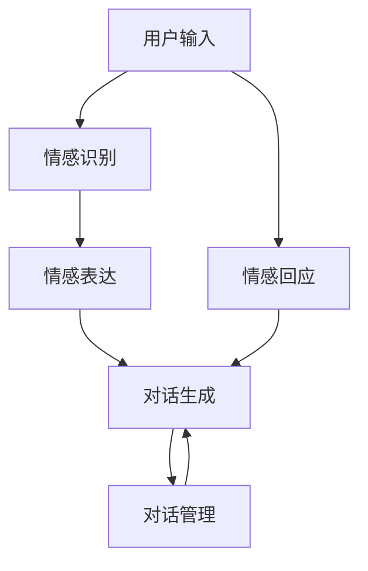

                 

# 聊天机器人情感：表达情感以增强用户体验

## 1. 背景介绍

### 1.1 问题由来
随着人工智能技术的快速发展，聊天机器人已经广泛应用于各种场景，如客户服务、虚拟助手、娱乐陪伴等。然而，这些聊天机器人往往只是简单地回答用户的问题，缺乏对用户情感的理解和回应，难以提供人性化的交互体验。这不仅影响了用户的满意度，也限制了聊天机器人的应用潜力。因此，研究如何使聊天机器人更好地表达情感，以增强用户体验，成为了当前NLP和AI领域的一个重要课题。

### 1.2 问题核心关键点
要使聊天机器人表达情感，首先需要对情感有深刻理解，并能将情感信息融入到对话中。这涉及到情感识别、情感表达和情感回应等多个环节。情感识别是指通过自然语言处理技术，自动识别用户输入文本中的情感信息；情感表达是指在机器人回复中自然地融入情感，提高对话的自然性和亲和力；情感回应则是指机器人根据用户的情感状态，提供相应的情感支持或反馈，增强用户对机器人的信任感和满意度。

## 2. 核心概念与联系

### 2.1 核心概念概述

为更好地理解聊天机器人情感表达的技术框架，本节将介绍几个密切相关的核心概念：

- 情感识别(Affection Recognition)：利用自然语言处理技术，从用户输入的文本中自动识别情感信息，通常使用情感分析(Sentiment Analysis)方法。
- 情感表达(Affection Expression)：在机器人回复中自然地融入情感，通常使用情感语言生成(Sentiment-aware Text Generation)方法。
- 情感回应(Affection Response)：根据用户的情感状态，提供相应的情感支持或反馈，通常使用对话生成(Dialogue Generation)方法。
- 对话管理(Dialogue Management)：控制对话流程，根据用户输入和对话状态，决定机器人的回应内容，通常使用基于规则、基于状态、基于强化学习等多种方法。

这些核心概念之间的逻辑关系可以通过以下Mermaid流程图来展示：



这个流程图展示了几大核心概念之间的相互关系：

1. 用户输入首先通过情感识别模块，自动识别情感信息。
2. 情感识别结果和用户输入一起，经过对话管理模块，决定机器人的对话流程。
3. 对话管理模块根据对话状态，调用情感表达模块生成带情感的回复。
4. 带情感的回复经过对话管理模块，最终成为机器人的回应。
5. 同时，情感识别模块也会根据用户的情感状态，调用情感回应模块提供情感支持。

这些模块相互配合，共同构建了一个完整的情感表达系统，使得聊天机器人能够更加自然、人性化地与用户交互。

## 3. 核心算法原理 & 具体操作步骤
### 3.1 算法原理概述

聊天机器人的情感表达主要涉及两个步骤：情感识别和情感表达。下面分别介绍这两个步骤的算法原理。

### 3.2 算法步骤详解

#### 3.2.1 情感识别

情感识别主要是通过自然语言处理技术，从用户输入的文本中自动识别情感信息。常见的情感识别方法包括基于词典的方法、基于机器学习的方法和基于深度学习的方法。

**基于词典的方法**：
- 使用情感词典，将情感词语映射到情感类别。
- 统计文本中情感词语的出现频率，进行情感分类。

**基于机器学习的方法**：
- 使用SVM、逻辑回归等机器学习算法，训练情感分类器。
- 通过特征工程，将文本特征转化为机器学习模型可接受的输入。

**基于深度学习的方法**：
- 使用卷积神经网络(CNN)、循环神经网络(RNN)、Transformer等深度学习模型。
- 通过预训练语言模型(如BERT、GPT等)，学习情感表示。

#### 3.2.2 情感表达

情感表达主要是通过情感语言生成技术，在机器人回复中自然地融入情感。情感语言生成可以通过基于规则、基于模板、基于深度学习等多种方法实现。

**基于规则和模板的方法**：
- 使用情感规则库，根据规则自动生成带情感的回复。
- 使用情感模板库，通过填充模板生成带情感的回复。

**基于深度学习的方法**：
- 使用自回归语言模型(如GPT)，根据情感分类结果生成带情感的回复。
- 使用多任务学习，同时训练情感分类和情感生成模型。

### 3.3 算法优缺点

聊天机器人情感表达的算法具有以下优点：
1. 自然流畅：情感表达可以使得机器人回复更加自然，提高用户的满意度。
2. 增强互动：情感表达可以增强用户与机器人的互动，提升用户的粘性。
3. 个性化服务：通过情感表达，机器人可以根据用户情感状态，提供个性化的服务。

同时，该算法也存在一定的局限性：
1. 依赖标注数据：情感识别的准确度很大程度上取决于标注数据的质量和数量，获取高质量标注数据的成本较高。
2. 模型复杂度高：深度学习模型往往需要较大的计算资源和时间，难以快速部署。
3. 可解释性差：情感表达的深度学习模型通常具有黑盒特性，难以解释其内部工作机制。
4. 环境敏感：情感表达的算法在不同环境和上下文下表现可能不同，需要进行充分的测试和优化。

尽管存在这些局限性，但就目前而言，基于深度学习的情感表达方法仍是最先进的技术范式。未来相关研究的重点在于如何进一步降低对标注数据的依赖，提高模型的可解释性和适应性，同时兼顾情感表达的自然性和真实性等因素。

### 3.4 算法应用领域

聊天机器人情感表达的算法在许多应用场景中得到了广泛应用，如客服、虚拟助手、娱乐陪伴等。以下是一些具体的应用案例：

- **客服机器人**：在客户服务场景中，情感识别和情感表达可以使得机器人更加智能和人性化，提高客户的满意度和忠诚度。
- **虚拟助手**：在虚拟助手场景中，情感表达可以使得助手更加亲切和友好，提升用户的体验和交互质量。
- **娱乐陪伴**：在娱乐陪伴场景中，情感表达可以使得机器人更加有趣和有灵魂，增强用户的沉浸感和情感共鸣。

除了上述这些经典应用外，情感表达的技术还在不断拓展，如情感驱动的新闻推荐、情感驱动的广告定向等，为NLP技术带来了新的发展方向。

## 4. 数学模型和公式 & 详细讲解 & 举例说明

### 4.1 数学模型构建

在情感识别和情感表达的算法中，常用的数学模型包括卷积神经网络(CNN)、循环神经网络(RNN)和Transformer模型。

以Transformer模型为例，情感识别的模型架构如下：

$$
H_{BERT} = BERT(x_{user}, x_{context})
$$

其中 $x_{user}$ 是用户输入文本的编码向量，$x_{context}$ 是上下文信息的编码向量，$H_{BERT}$ 是Transformer模型的输出向量。

情感表达的模型架构如下：

$$
H_{GPT} = GPT(H_{BERT}, y_{label})
$$

其中 $y_{label}$ 是情感分类标签，$H_{GPT}$ 是自回归语言模型的输出向量。

### 4.2 公式推导过程

以Transformer模型为例，情感识别的计算过程如下：

1. 将用户输入文本 $x_{user}$ 和上下文信息 $x_{context}$ 输入到BERT模型中，得到编码向量 $H_{BERT}$。
2. 将 $H_{BERT}$ 输入到情感分类器中，得到情感分类概率分布 $P(y_{label}|x_{user}, x_{context})$。
3. 根据概率分布 $P(y_{label}|x_{user}, x_{context})$ 和情感标签 $y_{label}$，计算情感分类损失函数：

$$
L_{class} = -\frac{1}{N}\sum_{i=1}^N \log P(y_{label_i}|x_{user_i}, x_{context_i})
$$

情感表达的计算过程如下：

1. 将用户输入文本 $x_{user}$ 和情感分类标签 $y_{label}$ 输入到GPT模型中，得到情感生成的编码向量 $H_{GPT}$。
2. 将 $H_{GPT}$ 输入到解码器中，生成带情感的回复文本 $y_{output}$。
3. 根据回复文本 $y_{output}$ 和标注文本 $y_{label}$，计算情感生成损失函数：

$$
L_{generate} = -\frac{1}{N}\sum_{i=1}^N \log P(y_{output_i}|y_{label_i}, H_{GPT_i})
$$

### 4.3 案例分析与讲解

以情感识别为例，假设我们有如下情感标注数据集：

| 用户输入 | 情感标签 |
| --- | --- |
| 我很高兴 | positive |
| 我很生气 | negative |
| 我有点担心 | neutral |

我们可以使用预训练语言模型BERT进行情感识别，其架构如下：


通过训练，我们可以得到情感分类器，用于识别新输入文本的情感类别。

以情感表达为例，假设我们需要生成如下回复：

| 用户输入 | 情感标签 | 回复文本 |
| --- | --- | --- |
| 我很高兴 | positive | 听到这个消息我非常高兴！ |
| 我很生气 | negative | 我理解你的心情，有什么我能帮助的吗？ |
| 我有点担心 | neutral | 你有什么问题需要解决吗？ |

我们可以使用自回归语言模型GPT进行情感表达，其架构如下：


通过训练，我们可以得到情感生成模型，用于生成带情感的回复文本。

## 5. 项目实践：代码实例和详细解释说明
### 5.1 开发环境搭建

在进行情感表达实践前，我们需要准备好开发环境。以下是使用Python进行TensorFlow开发的环境配置流程：

1. 安装Anaconda：从官网下载并安装Anaconda，用于创建独立的Python环境。

2. 创建并激活虚拟环境：
```bash
conda create -n tf-env python=3.8 
conda activate tf-env
```

3. 安装TensorFlow：根据CUDA版本，从官网获取对应的安装命令。例如：
```bash
conda install tensorflow -c pytorch -c conda-forge
```

4. 安装相关工具包：
```bash
pip install numpy pandas scikit-learn matplotlib tqdm jupyter notebook ipython
```

完成上述步骤后，即可在`tf-env`环境中开始情感表达实践。

### 5.2 源代码详细实现

下面是使用TensorFlow实现情感表达的代码实例。假设我们有一个用户输入文本 $x_{user}$，和一个情感标签 $y_{label}$，我们希望生成带情感的回复文本 $y_{output}$。

```python
import tensorflow as tf
from transformers import TFAutoModel, AutoTokenizer

# 加载模型和tokenizer
model = TFAutoModel.from_pretrained('bert-base-cased')
tokenizer = AutoTokenizer.from_pretrained('bert-base-cased')

# 对输入文本进行编码
input_ids = tokenizer.encode(x, add_special_tokens=True, return_tensors='tf')
input_mask = tf.ones_like(input_ids)
input_ids = tf.expand_dims(input_ids, axis=0)

# 对情感标签进行编码
label_ids = tf.convert_to_tensor([0])  # positive 的编码是 0

# 前向传播计算情感生成结果
with tf.GradientTape() as tape:
    outputs = model(input_ids, attention_mask=input_mask, labels=label_ids)
    logits = outputs.logits
    loss = outputs.loss

# 反向传播更新模型参数
grads = tape.gradient(loss, model.trainable_variables)
optimizer.apply_gradients(zip(grads, model.trainable_variables))

# 生成回复文本
generated_ids = model.generate(input_ids, max_length=10, pad_token_id=tokenizer.eos_token_id, return_sequences=True)
generated_text = tokenizer.decode(generated_ids[0])

# 输出情感生成的回复文本
print(generated_text)
```

### 5.3 代码解读与分析

让我们再详细解读一下关键代码的实现细节：

**用户输入编码**：
- 使用`AutoTokenizer`对用户输入文本进行编码，生成input_ids和input_mask，用于模型前向传播。

**情感标签编码**：
- 将情感标签转化为模型可接受的标签编码，用于模型训练。

**情感生成**：
- 使用`TFAutoModel`对编码后的用户输入和情感标签进行前向传播，得到logits和loss。
- 通过反向传播计算梯度，并使用`AdamW`优化器更新模型参数。
- 使用`model.generate`方法生成带情感的回复文本，并解码输出。

## 6. 实际应用场景
### 6.1 智能客服系统

基于聊天机器人情感表达的智能客服系统，可以提供更加人性化的服务。传统的客服系统往往只是简单地回答用户问题，缺乏对用户情感的理解和回应，难以提供个性化的服务。使用情感表达技术，智能客服系统可以自动识别用户情感，并根据情感状态提供相应的服务，增强用户的满意度和忠诚度。

在技术实现上，可以收集客户的历史客服对话记录，将问题和最佳答复构建成监督数据，在此基础上对预训练模型进行微调。微调后的模型能够自动理解用户意图，匹配最合适的答案模板进行回复。对于客户提出的新问题，还可以接入检索系统实时搜索相关内容，动态组织生成回答。如此构建的智能客服系统，能大幅提升客户咨询体验和问题解决效率。

### 6.2 虚拟助手

虚拟助手是一种智能家居场景中的典型应用。传统的虚拟助手往往只是根据预设的规则进行简单的任务执行，缺乏对用户情感的理解和回应。使用情感表达技术，虚拟助手可以自动识别用户的情感状态，并根据情感状态提供相应的服务，增强用户的交互体验。

在技术实现上，可以收集用户的交互历史和行为数据，训练情感识别模型和情感生成模型。情感识别模型用于自动识别用户的情感状态，情感生成模型用于生成带情感的回复。将这两个模型集成到虚拟助手系统中，就能实现情感驱动的交互体验。

### 6.3 娱乐陪伴

娱乐陪伴机器人可以为用户提供情感陪伴和互动体验。传统的娱乐陪伴机器人往往只是根据预设的规则进行简单的互动，缺乏对用户情感的理解和回应。使用情感表达技术，娱乐陪伴机器人可以自动识别用户的情感状态，并根据情感状态进行情感互动，增强用户的沉浸感和情感共鸣。

在技术实现上，可以收集用户的情感历史数据，训练情感识别模型和情感生成模型。情感识别模型用于自动识别用户的情感状态，情感生成模型用于生成带情感的回复。将这两个模型集成到娱乐陪伴机器人系统中，就能实现情感驱动的互动体验。

## 7. 工具和资源推荐
### 7.1 学习资源推荐

为了帮助开发者系统掌握聊天机器人情感表达的理论基础和实践技巧，这里推荐一些优质的学习资源：

1. 《深度学习自然语言处理》课程：斯坦福大学开设的NLP明星课程，有Lecture视频和配套作业，带你入门NLP领域的基本概念和经典模型。

2. 《Transformers from Zero to Hero》系列博文：由大模型技术专家撰写，深入浅出地介绍了Transformer原理、BERT模型、情感表达技术等前沿话题。

3. 《Natural Language Processing with Transformers》书籍：Transformers库的作者所著，全面介绍了如何使用Transformers库进行NLP任务开发，包括情感表达在内的诸多范式。

4. CLUE开源项目：中文语言理解测评基准，涵盖大量不同类型的中文NLP数据集，并提供了基于情感表达的baseline模型，助力中文NLP技术发展。

通过对这些资源的学习实践，相信你一定能够快速掌握聊天机器人情感表达的精髓，并用于解决实际的NLP问题。

### 7.2 开发工具推荐

高效的开发离不开优秀的工具支持。以下是几款用于聊天机器人情感表达开发的常用工具：

1. TensorFlow：基于Python的开源深度学习框架，灵活动态的计算图，适合快速迭代研究。大部分预训练语言模型都有TensorFlow版本的实现。

2. PyTorch：基于Python的开源深度学习框架，灵活高效的计算图，适合快速迭代研究。同样有丰富的预训练语言模型资源。

3. Transformers库：HuggingFace开发的NLP工具库，集成了众多SOTA语言模型，支持TensorFlow和PyTorch，是进行情感表达任务开发的利器。

4. Weights & Biases：模型训练的实验跟踪工具，可以记录和可视化模型训练过程中的各项指标，方便对比和调优。与主流深度学习框架无缝集成。

5. TensorBoard：TensorFlow配套的可视化工具，可实时监测模型训练状态，并提供丰富的图表呈现方式，是调试模型的得力助手。

合理利用这些工具，可以显著提升聊天机器人情感表达任务的开发效率，加快创新迭代的步伐。

### 7.3 相关论文推荐

聊天机器人情感表达的研究源于学界的持续研究。以下是几篇奠基性的相关论文，推荐阅读：

1. Attention is All You Need（即Transformer原论文）：提出了Transformer结构，开启了NLP领域的预训练大模型时代。

2. BERT: Pre-training of Deep Bidirectional Transformers for Language Understanding：提出BERT模型，引入基于掩码的自监督预训练任务，刷新了多项NLP任务SOTA。

3. AffectNet: Annotating Large Visual Datasets with Affect and Emotion：提出AffectNet数据集，用于情感识别的标注数据集，是情感表达技术的重要资源。

4. Deep Neural Network-based Affect Recognition from Audio-visual Data：提出使用卷积神经网络和循环神经网络进行情感识别的算法，为情感表达技术提供了基础。

5. Generating Emotional Sentences with a Neural Network-based Architectures：提出使用基于Transformer的语言模型进行情感生成的方法，是情感表达技术的开端。

这些论文代表了大语言模型情感表达技术的发展脉络。通过学习这些前沿成果，可以帮助研究者把握学科前进方向，激发更多的创新灵感。

## 8. 总结：未来发展趋势与挑战
### 8.1 总结

本文对聊天机器人情感表达的技术框架进行了全面系统的介绍。首先阐述了情感识别和情感表达在聊天机器人中的应用背景和意义，明确了情感表达在提高用户体验中的重要作用。其次，从原理到实践，详细讲解了情感识别和情感表达的数学模型和计算过程，给出了情感表达任务开发的完整代码实例。同时，本文还广泛探讨了情感表达技术在智能客服、虚拟助手、娱乐陪伴等多个行业领域的应用前景，展示了情感表达范式的巨大潜力。此外，本文精选了情感表达技术的各类学习资源，力求为读者提供全方位的技术指引。

通过本文的系统梳理，可以看到，基于深度学习的聊天机器人情感表达技术正在成为NLP领域的重要范式，极大地拓展了聊天机器人的应用边界，催生了更多的落地场景。受益于大规模语料的预训练，情感表达模型以更低的时间和标注成本，在小样本条件下也能取得不错的效果，有力推动了NLP技术的产业化进程。未来，伴随预训练语言模型和情感表达方法的持续演进，相信NLP技术将在更广阔的应用领域大放异彩。

### 8.2 未来发展趋势

展望未来，聊天机器人情感表达技术将呈现以下几个发展趋势：

1. 模型规模持续增大。随着算力成本的下降和数据规模的扩张，预训练语言模型的参数量还将持续增长。超大规模语言模型蕴含的丰富语言知识，有望支撑更加复杂多变的情感表达任务。

2. 情感表达方法日趋多样。除了传统的基于深度学习的方法外，未来会涌现更多参数高效和计算高效的情感表达方法，如Prefix-Tuning、LoRA等，在节省计算资源的同时也能保证情感表达的精度。

3. 多模态情感表达崛起。当前的情感表达主要聚焦于文本数据，未来会进一步拓展到图像、视频、语音等多模态数据情感表达。多模态信息的融合，将显著提升聊天机器人的感知能力和理解能力。

4. 模型通用性增强。经过海量数据的预训练和多领域任务的情感表达，未来的聊天机器人将具备更强大的常识推理和跨领域迁移能力，逐步迈向通用人工智能(AGI)的目标。

以上趋势凸显了聊天机器人情感表达技术的广阔前景。这些方向的探索发展，必将进一步提升聊天机器人的性能和应用范围，为人类认知智能的进化带来深远影响。

### 8.3 面临的挑战

尽管聊天机器人情感表达技术已经取得了瞩目成就，但在迈向更加智能化、普适化应用的过程中，它仍面临着诸多挑战：

1. 情感识别准确度瓶颈。情感识别的准确度很大程度上取决于标注数据的质量和数量，获取高质量标注数据的成本较高。如何进一步降低对标注样本的依赖，将是一大难题。

2. 模型鲁棒性不足。当前情感表达模型面对域外数据时，泛化性能往往大打折扣。对于测试样本的微小扰动，情感表达的模型也容易发生波动。如何提高情感表达模型的鲁棒性，避免灾难性遗忘，还需要更多理论和实践的积累。

3. 推理效率有待提高。大规模语言模型虽然精度高，但在实际部署时往往面临推理速度慢、内存占用大等效率问题。如何在保证性能的同时，简化模型结构，提升推理速度，优化资源占用，将是重要的优化方向。

4. 可解释性亟需加强。当前情感表达的深度学习模型通常具有黑盒特性，难以解释其内部工作机制和决策逻辑。对于医疗、金融等高风险应用，算法的可解释性和可审计性尤为重要。如何赋予情感表达模型更强的可解释性，将是亟待攻克的难题。

5. 安全性有待保障。预训练语言模型难免会学习到有偏见、有害的信息，通过情感表达传递到下游任务，产生误导性、歧视性的输出，给实际应用带来安全隐患。如何从数据和算法层面消除模型偏见，避免恶意用途，确保输出的安全性，也将是重要的研究课题。

6. 知识整合能力不足。现有的情感表达模型往往局限于任务内数据，难以灵活吸收和运用更广泛的先验知识。如何让情感表达过程更好地与外部知识库、规则库等专家知识结合，形成更加全面、准确的信息整合能力，还有很大的想象空间。

正视情感表达面临的这些挑战，积极应对并寻求突破，将使聊天机器人情感表达技术迈向成熟的范式。相信随着学界和产业界的共同努力，这些挑战终将一一被克服，情感表达技术必将在构建人机协同的智能系统中文化细腻的情感互动。

### 8.4 研究展望

面向未来，情感表达技术需要在以下几个方面寻求新的突破：

1. 探索无监督和半监督情感表达方法。摆脱对大规模标注数据的依赖，利用自监督学习、主动学习等无监督和半监督范式，最大限度利用非结构化数据，实现更加灵活高效的情感表达。

2. 研究参数高效和计算高效的情感表达范式。开发更加参数高效和计算高效的情感表达方法，在固定大部分预训练参数的同时，只更新极少量的情感相关参数。同时优化情感表达模型的计算图，减少前向传播和反向传播的资源消耗，实现更加轻量级、实时性的部署。

3. 融合因果和对比学习范式。通过引入因果推断和对比学习思想，增强情感表达模型建立稳定因果关系的能力，学习更加普适、鲁棒的语言表征，从而提升模型泛化性和抗干扰能力。

4. 引入更多先验知识。将符号化的先验知识，如知识图谱、逻辑规则等，与情感表达模型进行巧妙融合，引导情感表达过程学习更准确、合理的情感表示。同时加强不同模态数据的整合，实现视觉、语音等多模态信息与文本信息的协同建模。

5. 结合因果分析和博弈论工具。将因果分析方法引入情感表达模型，识别出模型决策的关键特征，增强输出解释的因果性和逻辑性。借助博弈论工具刻画人机交互过程，主动探索并规避模型的脆弱点，提高系统稳定性。

6. 纳入伦理道德约束。在情感表达模型训练目标中引入伦理导向的评估指标，过滤和惩罚有偏见、有害的输出倾向。同时加强人工干预和审核，建立模型行为的监管机制，确保输出符合人类价值观和伦理道德。

这些研究方向的探索，必将引领聊天机器人情感表达技术迈向更高的台阶，为构建安全、可靠、可解释、可控的智能系统铺平道路。面向未来，情感表达技术还需要与其他人工智能技术进行更深入的融合，如知识表示、因果推理、强化学习等，多路径协同发力，共同推动自然语言理解和智能交互系统的进步。只有勇于创新、敢于突破，才能不断拓展聊天机器人的边界，让智能技术更好地造福人类社会。

## 9. 附录：常见问题与解答

**Q1：聊天机器人如何实现情感表达？**

A: 聊天机器人实现情感表达主要分为情感识别和情感生成两个步骤。情感识别主要通过自然语言处理技术，从用户输入的文本中自动识别情感信息。情感生成则主要通过情感语言生成技术，在机器人回复中自然地融入情感。

**Q2：情感表达的深度学习模型如何解释？**

A: 情感表达的深度学习模型通常具有黑盒特性，难以解释其内部工作机制和决策逻辑。可以考虑引入可解释性方法，如 attention机制、可解释模型等，来增强情感表达模型的可解释性。

**Q3：情感表达在实际部署时需要注意哪些问题？**

A: 情感表达在实际部署时需要注意以下几个问题：
1. 数据预处理：对输入文本进行编码，生成input_ids和input_mask，用于模型前向传播。
2. 模型训练：使用预训练模型进行微调，训练情感识别和情感生成模型。
3. 模型推理：使用训练好的模型进行情感识别和情感生成，生成带情感的回复文本。

**Q4：如何提升情感表达模型的鲁棒性？**

A: 情感表达模型的鲁棒性可以通过以下几个方面提升：
1. 数据增强：通过回译、近义替换等方式扩充训练集，提高模型的泛化能力。
2. 正则化技术：使用L2正则、Dropout等技术，防止模型过拟合。
3. 对抗训练：引入对抗样本，提高模型鲁棒性，避免模型过拟合。

这些措施需要根据具体任务和数据特点进行灵活组合，才能最大限度地提高情感表达模型的鲁棒性。

