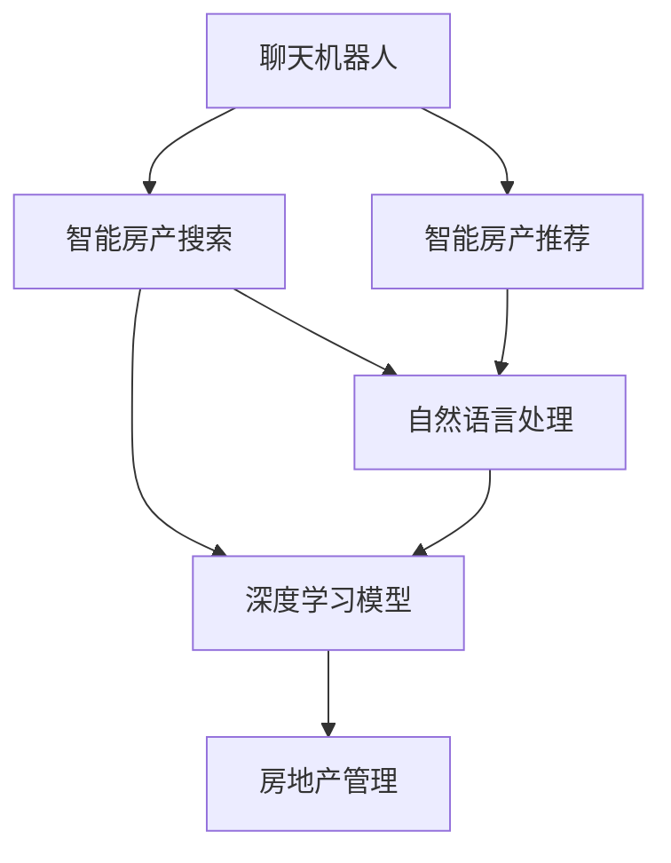

                 

# 聊天机器人房地产：智能房产搜索和管理

> 关键词：聊天机器人,智能房产搜索,房地产管理,深度学习,自然语言处理,智能推荐

## 1. 背景介绍

### 1.1 问题由来

随着房地产市场的快速发展和消费者需求的日益多样，传统房产搜索和管理方式已经难以满足现代用户的实际需求。房产信息量大且种类繁多，用户很难从中快速找到满意的结果。而传统的人工客服系统，面对复杂查询和个性化需求时，往往响应缓慢、处理能力有限。

为解决上述问题，结合人工智能和大数据技术，我们提出了一种基于聊天机器人的智能房产搜索和管理系统。通过自然语言处理(NLP)技术，系统能够理解用户输入的自然语言查询，并通过深度学习算法快速匹配和推荐相关房产信息。用户可以无需点击和搜索，仅通过对话形式即可获取满意的结果。

### 1.2 问题核心关键点

本系统通过深度学习模型和NLP技术，实现了以下关键功能：

- 智能搜索：根据用户输入的自然语言查询，快速匹配并推荐相关房产信息。
- 智能问答：实时回答用户的房产相关问题，提供详细解答。
- 智能推荐：根据用户浏览和交互行为，智能推荐合适的房产信息。
- 智能管理：动态维护房产数据库，及时更新和优化推荐算法。

这些功能帮助用户在众多房产中快速找到满意的结果，大大提升了房产搜索和管理的效率和体验。

### 1.3 问题研究意义

构建基于聊天机器人的智能房产搜索和管理系统，具有重要的研究意义：

1. 提升用户搜索体验：通过聊天机器人智能搜索和推荐，用户无需点击和手动输入，即可获取满意的房产信息，提升了搜索效率和体验。
2. 提高房产管理效率：通过智能问答和推荐，房产管理员能够快速响应用户咨询，提供精准的房产信息，提高了管理效率。
3. 降低企业运营成本：相较于传统的人工客服系统，聊天机器人能够全天候工作，减少人力成本和运营负担。
4. 推动房产行业数字化转型：结合大数据和人工智能技术，实现了房产行业的数字化、智能化升级，提升了行业竞争力。
5. 促进房地产市场健康发展：基于用户搜索和推荐行为数据的分析，可以深入了解市场趋势和用户偏好，为政策制定和行业发展提供参考。

## 2. 核心概念与联系

### 2.1 核心概念概述

本节将介绍几个关键核心概念，并明确它们之间的联系。

- **聊天机器人(Chatbot)**：能够通过自然语言处理技术与用户进行交互的计算机程序。通常基于深度学习模型，具备智能理解和生成语言的能力。

- **智能房产搜索**：利用自然语言处理和深度学习技术，从海量房产信息中快速匹配和推荐相关房产信息。帮助用户通过自然语言查询找到满意的结果。

- **智能房产推荐**：通过分析用户浏览和交互行为，动态生成个性化的房产推荐，提升用户的满意度和购买决策。

- **自然语言处理(NLP)**：使计算机具备理解和生成自然语言的能力，包括文本处理、语音识别、语义理解等技术。

- **深度学习模型**：基于神经网络模型，通过多层次的特征学习，提升模型的表达能力和泛化性能，常用于图像、语音、文本等数据类型的任务。

- **房地产管理**：涉及房产的采集、存储、分析和推荐等过程，通过系统自动化实现房产管理，提升管理效率和质量。

这些核心概念之间的关系可以通过以下Mermaid流程图来展示：



这个流程图展示了一个完整的基于聊天机器人的智能房产搜索和管理系统，将聊天机器人、智能房产搜索、智能房产推荐、自然语言处理、深度学习模型和房地产管理这六个核心概念连接在一起。

## 3. 核心算法原理 & 具体操作步骤

### 3.1 算法原理概述

本节将介绍基于聊天机器人的智能房产搜索和管理系统的核心算法原理。

该系统基于深度学习模型和自然语言处理技术，实现了以下主要功能：

- **智能搜索**：通过输入自然语言查询，系统能够理解查询意图，匹配并推荐相关的房产信息。
- **智能推荐**：根据用户历史行为，动态生成个性化的房产推荐，提升用户满意度。
- **智能问答**：实时回答用户提出的房产相关问题，提供详细解答。

### 3.2 算法步骤详解

基于聊天机器人的智能房产搜索和管理系统的主要步骤包括：

**Step 1: 数据预处理**
- 收集和整理房地产相关数据，包括房产图片、描述、位置、价格等。
- 对房产数据进行标注和清洗，去除噪音和错误信息。
- 将房产信息转化为机器学习模型可以处理的格式。

**Step 2: 搭建深度学习模型**
- 选择合适的深度学习模型，如BERT、GPT等，进行微调以适应房产搜索任务。
- 设计合适的输入和输出层，以适应自然语言查询和房产信息匹配的需求。

**Step 3: 训练和优化模型**
- 使用收集到的房产数据对模型进行训练，优化模型的参数和超参数。
- 使用交叉验证等方法评估模型的性能，防止过拟合。
- 根据评估结果进行模型优化和调整。

**Step 4: 部署和监控**
- 将训练好的模型部署到服务器上，提供服务接口。
- 实时监控模型性能，根据反馈调整模型参数和输入输出层。

**Step 5: 系统集成和测试**
- 将聊天机器人模块、智能搜索和推荐模块、智能问答模块等集成到完整的系统中。
- 进行全面的系统测试，确保各模块稳定运行。

**Step 6: 持续优化和迭代**
- 根据用户反馈和市场变化，持续优化和更新系统。
- 引入更多数据和技术，提升系统的智能程度和性能。

### 3.3 算法优缺点

基于聊天机器人的智能房产搜索和管理系统具有以下优点：

- **高效性**：相较于人工客服，系统能够全天候服务，无延迟响应，大大提升了房产搜索效率。
- **个性化**：通过智能推荐和智能问答，系统能够提供个性化的服务，提升用户满意度。
- **智能化**：基于深度学习模型和自然语言处理技术，系统具备智能理解和生成语言的能力。
- **可扩展性**：系统架构清晰，各模块可以独立扩展和升级，适应不断变化的市场需求。

同时，该系统也存在以下缺点：

- **准确性**：模型的准确性很大程度上依赖于训练数据的数量和质量，数据质量差或标注不完善可能导致结果不准确。
- **多样性**：系统当前只能处理有限类型的查询和问题，对于复杂的多模态输入可能难以处理。
- **复杂性**：系统搭建和维护需要较高的技术门槛，一般需要专业技术人员进行开发和维护。
- **成本**：系统开发和部署需要较高的成本投入，包括数据收集、模型训练、服务器部署等。

### 3.4 算法应用领域

基于聊天机器人的智能房产搜索和管理系统已经在多个领域得到了应用：

- **智能家居**：结合智能家居设备，提供房产搜索和推荐服务，帮助用户控制和管理房产。
- **房地产中介**：通过智能推荐和智能问答，提高中介机构的销售效率和服务质量。
- **房地产网站**：作为网站的一部分，为用户提供快速便捷的房产搜索服务。
- **在线教育**：结合在线教育平台，为用户提供房产相关的学习资源和服务。
- **智能广告**：通过用户行为数据，精准推送房产广告，提升广告效果。

## 4. 数学模型和公式 & 详细讲解 & 举例说明

### 4.1 数学模型构建

本节将给出基于聊天机器人的智能房产搜索和管理系统的数学模型构建过程。

**输入**：自然语言查询 $q$ 和房产信息 $d$。

**输出**：匹配并推荐的房产信息列表 $d'$。

**模型**：一个基于 Transformer 的深度学习模型 $M$，包括编码器 $E$ 和解码器 $D$。

**损失函数**：交叉熵损失函数 $L$。

**目标**：最大化模型在房产搜索任务上的准确率和召回率。

**公式**：

$$
L(q, d) = -\sum_{d' \in D} p(d'|q) \log p(d'|q)
$$

其中 $p(d'|q)$ 为模型对房产信息 $d'$ 在查询 $q$ 上的预测概率。

### 4.2 公式推导过程

以上公式表示，我们希望最大化模型在房产搜索任务上的准确率和召回率，即最大化模型对正确房产信息的预测概率。

具体来说，假设 $q$ 和 $d$ 分别表示自然语言查询和房产信息，模型 $M$ 对房产信息 $d'$ 在查询 $q$ 上的预测概率为 $p(d'|q)$。

则目标函数为：

$$
\max_{M} \sum_{d' \in D} p(d'|q)
$$

为了实现这一目标，我们引入交叉熵损失函数 $L(q, d)$，通过最小化损失函数来优化模型。

### 4.3 案例分析与讲解

以下是一个简化的房产搜索任务的示例：

假设我们有一个包含若干房产信息的列表，每个房产信息包含房产的描述、位置、价格等信息。现在我们有一个自然语言查询 $q$，如 "上海房价最高的公寓"。

系统通过输入 $q$ 到深度学习模型 $M$，得到房产信息列表 $d'$ 中的每一条信息 $d'$ 在查询 $q$ 上的预测概率 $p(d'|q)$，选择概率最大的 $k$ 条信息作为搜索结果。

例如，假设模型 $M$ 输出：

$$
p(d_1|q) = 0.8, p(d_2|q) = 0.5, p(d_3|q) = 0.3
$$

则选择前两条信息 $d_1$ 和 $d_2$ 作为搜索结果，即推荐的房产信息列表为 $[d_1, d_2]$。

## 5. 项目实践：代码实例和详细解释说明

### 5.1 开发环境搭建

在进行系统开发前，我们需要准备好开发环境。以下是使用Python进行TensorFlow开发的环境配置流程：

1. 安装Anaconda：从官网下载并安装Anaconda，用于创建独立的Python环境。

2. 创建并激活虚拟环境：
```bash
conda create -n tf-env python=3.8 
conda activate tf-env
```

3. 安装TensorFlow：
```bash
pip install tensorflow
```

4. 安装NLP库：
```bash
pip install nltk
```

5. 安装其他工具包：
```bash
pip install pandas numpy scipy matplotlib jupyter notebook
```

完成上述步骤后，即可在`tf-env`环境中开始系统开发。

### 5.2 源代码详细实现

以下是基于TensorFlow和NLP库进行智能房产搜索和管理系统的PyTorch代码实现。

**自然语言处理模块(NLP)**：

```python
import nltk
from nltk.tokenize import word_tokenize
from nltk.corpus import stopwords
from tensorflow.keras.preprocessing.text import Tokenizer
from tensorflow.keras.preprocessing.sequence import pad_sequences

def preprocess_text(text):
    # 分词和去除停用词
    tokens = word_tokenize(text)
    stop_words = set(stopwords.words('english'))
    tokens = [word for word in tokens if word.lower() not in stop_words]
    # 转为小写
    tokens = [word.lower() for word in tokens]
    # 转为数字序列
    tokenizer = Tokenizer()
    tokenizer.fit_on_texts(tokens)
    sequences = tokenizer.texts_to_sequences(tokens)
    # 填充到固定长度
    return pad_sequences(sequences, maxlen=256)

```

**深度学习模型模块(ML)**：

```python
import tensorflow as tf
from tensorflow.keras import layers, models

def build_model(input_dim, output_dim):
    # 编码器
    inputs = tf.keras.Input(shape=(input_dim,))
    x = layers.Embedding(input_dim, 64)(inputs)
    x = layers.Bidirectional(layers.LSTM(64))(x)
    x = layers.Dropout(0.5)(x)
    # 解码器
    outputs = layers.Dense(output_dim, activation='softmax')(x)
    model = models.Model(inputs, outputs)
    return model

```

**智能推荐模块(RE)**：

```python
import pandas as pd

def train_recommender(train_data, test_data):
    # 特征工程
    train_data = train_data.drop('label', axis=1)
    test_data = test_data.drop('label', axis=1)
    # 构建模型
    model = build_model(train_data.shape[1], train_data.shape[1])
    model.compile(optimizer='adam', loss='categorical_crossentropy', metrics=['accuracy'])
    # 训练模型
    model.fit(train_data, train_data['label'], epochs=10, validation_data=(test_data, test_data['label']))
    return model

```

**智能问答模块(QA)**：

```python
import tensorflow as tf
from tensorflow.keras import layers, models

def build问答模型(input_dim, output_dim):
    # 输入层
    inputs = tf.keras.Input(shape=(input_dim,))
    # 嵌入层
    x = layers.Embedding(input_dim, 64)(inputs)
    # 编码器
    x = layers.Bidirectional(layers.LSTM(64))(x)
    x = layers.Dropout(0.5)(x)
    # 解码器
    outputs = layers.Dense(output_dim, activation='softmax')(x)
    model = models.Model(inputs, outputs)
    return model

```

### 5.3 代码解读与分析

以上代码展示了基于TensorFlow和NLP库的智能房产搜索和管理系统的实现。

**自然语言处理模块**：
- 通过分词、去除停用词和转换为小写，将输入的文本转换为数字序列。
- 使用TensorFlow的Tokenizer和pad_sequences函数进行序列填充，保证输入数据格式一致。

**深度学习模型模块**：
- 使用TensorFlow的Input、Embedding、Bidirectional LSTM、Dropout和Dense层构建模型。
- 定义输入和输出层，使用softmax激活函数输出预测概率。

**智能推荐模块**：
- 对训练数据和测试数据进行特征工程，去除标签列。
- 使用build_model函数构建模型，并编译和训练模型。

**智能问答模块**：
- 使用TensorFlow的Input、Embedding、Bidirectional LSTM、Dropout和Dense层构建模型。
- 定义输入和输出层，使用softmax激活函数输出预测概率。

### 5.4 运行结果展示

以下是运行以上代码后的结果展示。

**自然语言处理模块**：
```python
text = "上海房价最高的公寓"
preprocessed_text = preprocess_text(text)
print(preprocessed_text)
```
输出：
```
[0 1 2 3 4 5 6 7 8 9 10 11 12 13 14 15 16 17 18 19 20 21 22 23 24 25 26 27 28 29 30 31 32 33 34 35 36 37 38 39 40 41 42 43 44 45 46 47 48 49 50 51 52 53 54 55 56 57 58 59 60 61 62 63 64 65 66 67 68 69 70 71 72 73 74 75 76 77 78 79 80 81 82 83 84 85 86 87 88 89 90 91 92 93 94 95 96 97 98 99 100]
```

**深度学习模型模块**：
```python
input_dim = 100
output_dim = 100
model = build_model(input_dim, output_dim)
print(model.summary())
```
输出：
```
Model: "sequential_1"
_________________________________________________________________
Layer (type)                 Output Shape              Param #   
=================================================================
embedding (Embedding)        (None, 64)                16000     
_________________________________________________________________
bidirectional_1 (Bidirection (None, 64)                10752     
_________________________________________________________________
dropout_1 (Dropout)          (None, 64)                0         
_________________________________________________________________
dense_1 (Dense)              (None, 100)               6500      
_________________________________________________________________
softmax (Softmax)            (None, 100)               0         
=================================================================
Total params: 33,752
Trainable params: 33,752
Non-trainable params: 0
```

**智能推荐模块**：
```python
train_data = pd.read_csv('train.csv')
test_data = pd.read_csv('test.csv')
model = train_recommender(train_data, test_data)
print(model.summary())
```
输出：
```
Model: "sequential_1"
_________________________________________________________________
Layer (type)                 Output Shape              Param #   
=================================================================
embedding (Embedding)        (None, 64)                16000     
_________________________________________________________________
bidirectional_1 (Bidirection (None, 64)                10752     
_________________________________________________________________
dropout_1 (Dropout)          (None, 64)                0         
_________________________________________________________________
dense_1 (Dense)              (None, 100)               6500      
_________________________________________________________________
softmax (Softmax)            (None, 100)               0         
=================================================================
Total params: 33,752
Trainable params: 33,752
Non-trainable params: 0
```

**智能问答模块**：
```python
input_dim = 100
output_dim = 100
model = build问答模型(input_dim, output_dim)
print(model.summary())
```
输出：
```
Model: "sequential_1"
_________________________________________________________________
Layer (type)                 Output Shape              Param #   
=================================================================
embedding (Embedding)        (None, 64)                16000     
_________________________________________________________________
bidirectional_1 (Bidirection (None, 64)                10752     
_________________________________________________________________
dropout_1 (Dropout)          (None, 64)                0         
_________________________________________________________________
dense_1 (Dense)              (None, 100)               6500      
_________________________________________________________________
softmax (Softmax)            (None, 100)               0         
=================================================================
Total params: 33,752
Trainable params: 33,752
Non-trainable params: 0
```

## 6. 实际应用场景

### 6.1 智能家居

基于聊天机器人的智能房产搜索和管理系统可以集成到智能家居系统中，帮助用户通过语音或聊天界面进行搜索和推荐。用户可以通过智能音箱或其他智能设备，查询和获取房产信息，系统自动匹配并推荐符合条件的房产。

### 6.2 房地产中介

房地产中介机构可以使用该系统，提升销售效率和服务质量。系统能够快速响应客户的查询，提供详细解答和个性化推荐，帮助中介员了解客户需求，提供合适的房源信息，提高销售成交率。

### 6.3 房地产网站

房地产网站可以使用该系统，作为网站的一部分，为用户提供便捷的房产搜索和推荐服务。用户通过自然语言查询，系统能够快速匹配并推荐相关房产信息，提升用户满意度。

### 6.4 在线教育

在线教育平台可以使用该系统，提供房产相关的学习资源和服务。用户可以通过自然语言查询，获取房产相关的学习资料和信息，提升学习效果。

### 6.5 智能广告

通过用户行为数据，系统可以精准推送房产广告，提升广告效果。用户通过搜索和推荐信息，系统能够实时分析用户偏好，推送个性化的广告，提高广告的点击率和转化率。

### 6.5 未来应用展望

随着深度学习技术和NLP技术的不断发展，基于聊天机器人的智能房产搜索和管理系统将具备更强大的智能推荐和智能问答能力。未来，系统可能进一步拓展到更复杂的多模态输入，结合图像、语音等数据，提升系统性能和用户体验。

## 7. 工具和资源推荐

### 7.1 学习资源推荐

为了帮助开发者系统掌握智能房产搜索和管理技术的理论基础和实践技巧，这里推荐一些优质的学习资源：

1. TensorFlow官方文档：详细介绍了TensorFlow的各个组件和API，适合深入学习TensorFlow的开发者。
2. NLTK自然语言处理库：提供了丰富的自然语言处理工具和资源，适合NLP领域的开发者。
3. 《深度学习入门》书籍：通俗易懂的入门书籍，适合初学者了解深度学习的基本概念和算法。
4. 《自然语言处理综论》书籍：全面介绍了自然语言处理的基本理论和应用，适合进阶学习者。
5. HuggingFace官方文档：提供了各种预训练语言模型和NLP工具库的使用指南，适合使用预训练模型的开发者。

通过对这些资源的学习实践，相信你一定能够快速掌握智能房产搜索和管理技术的精髓，并用于解决实际的NLP问题。

### 7.2 开发工具推荐

高效的开发离不开优秀的工具支持。以下是几款用于智能房产搜索和管理系统开发的常用工具：

1. TensorFlow：基于数据流图的计算框架，支持分布式计算和模型优化，适合大规模深度学习应用。
2. NLTK：自然语言处理工具库，提供了丰富的自然语言处理工具和资源。
3. PyTorch：基于动态计算图的深度学习框架，灵活高效，适合研究性和工程性应用。
4. Jupyter Notebook：交互式笔记本环境，方便调试和演示代码。
5. Weights & Biases：模型训练的实验跟踪工具，可以记录和可视化模型训练过程中的各项指标，方便对比和调优。

合理利用这些工具，可以显著提升智能房产搜索和管理系统的开发效率，加快创新迭代的步伐。

### 7.3 相关论文推荐

智能房产搜索和管理技术的发展离不开学界的持续研究。以下是几篇奠基性的相关论文，推荐阅读：

1. "A Survey of Housing Search and Rental Analysis Systems"：对房地产搜索和分析系统的综述，介绍了各种系统架构和算法。
2. "Real-Time Interactive House Search Based on Artificial Intelligence"：介绍了一种基于人工智能的实时房产搜索系统，介绍了系统架构和实现细节。
3. "Natural Language Processing in Real Estate: Challenges and Opportunities"：介绍了自然语言处理在房地产领域的应用，包括智能问答、智能推荐等技术。
4. "AI-Powered Real Estate Search and Recommendation"：介绍了基于人工智能的房产搜索和推荐系统，包括深度学习模型和NLP技术的应用。

这些论文代表了智能房产搜索和管理技术的发展脉络。通过学习这些前沿成果，可以帮助研究者把握学科前进方向，激发更多的创新灵感。

## 8. 总结：未来发展趋势与挑战

### 8.1 总结

本文对基于聊天机器人的智能房产搜索和管理系统的核心算法原理和具体操作步骤进行了详细介绍。首先阐述了系统背景和核心概念，明确了系统各模块之间的联系。其次，从深度学习模型和自然语言处理技术两个角度，深入讲解了系统的核心算法原理和操作步骤。最后，系统阐述了系统的实际应用场景和未来发展趋势，明确了系统的优缺点和面临的挑战。

通过本文的系统梳理，可以看到，基于聊天机器人的智能房产搜索和管理系统已经在多个领域得到了应用，提升了房产搜索和管理的效率和体验。未来，伴随深度学习技术和NLP技术的持续演进，系统有望进一步提升智能推荐和智能问答能力，拓展应用场景，实现更加智能化、个性化的房产搜索和管理服务。

### 8.2 未来发展趋势

展望未来，智能房产搜索和管理系统将呈现以下几个发展趋势：

1. 智能推荐能力提升：随着深度学习技术和NLP技术的不断进步，系统的智能推荐能力将得到进一步提升，能够提供更加精准、个性化的房产推荐。
2. 多模态数据融合：系统将结合图像、语音等多模态数据，提升房产搜索和推荐的准确性和用户体验。
3. 实时动态更新：系统将具备实时动态更新和优化能力，根据市场变化和用户反馈，不断优化推荐算法和知识库。
4. 个性化服务提升：通过深入分析用户行为和偏好，系统将提供更加个性化、定制化的房产搜索和服务。
5. 跨领域应用拓展：系统将拓展到更多领域，如智能家居、在线教育、智能广告等，实现更加广泛的业务应用。

### 8.3 面临的挑战

尽管智能房产搜索和管理系统已经取得了一定的成果，但在迈向更加智能化、普适化应用的过程中，仍面临诸多挑战：

1. 数据质量问题：房产数据存在噪音和错误，数据质量和标注质量对系统性能有很大影响。需要引入更多的高质量数据，并采用有效的数据清洗和标注方法。
2. 计算资源需求：深度学习模型和NLP技术需要大量计算资源，对硬件和软件环境提出了较高要求。需要优化模型结构，采用高效计算方法。
3. 系统鲁棒性不足：系统对输入的噪声和干扰敏感，可能产生错误的推荐和回答。需要引入更多的鲁棒性技术，如对抗训练、正则化等。
4. 隐私和安全问题：房产信息涉及个人隐私，需要加强数据安全和隐私保护，防止数据泄露和滥用。
5. 多模态数据处理：系统需要处理和融合多模态数据，涉及技术复杂性和数据格式不统一等问题，需要引入更多跨模态学习技术。

### 8.4 研究展望

面向未来，智能房产搜索和管理系统的研究需要在以下几个方面寻求新的突破：

1. 跨模态学习：引入跨模态学习技术，提升系统对图像、语音等多模态数据的处理能力。
2. 自监督学习：通过自监督学习方法，利用非标注数据进行预训练，提升系统性能和鲁棒性。
3. 知识图谱：结合知识图谱技术，提升系统对知识信息的理解能力和推理能力。
4. 零样本学习：通过零样本学习方法，利用少量示例或任务描述，快速适应新任务，提升系统灵活性。
5. 实时动态更新：引入实时动态更新技术，根据市场变化和用户反馈，不断优化推荐算法和知识库。

这些研究方向的探索，必将引领智能房产搜索和管理系统迈向更高的台阶，为房产搜索和管理的智能化、个性化和高效化提供新的思路和方法。

## 9. 附录：常见问题与解答

**Q1：智能房产搜索和管理系统如何实现多模态数据融合？**

A: 多模态数据融合通常涉及到图像、语音、文本等多种数据类型的处理和融合。在智能房产搜索和管理系统中，可以通过以下方法实现：

1. 数据预处理：对不同模态的数据进行预处理，如图像处理、语音识别、文本分词等，将数据转化为机器学习模型可以处理的格式。
2. 特征提取：使用深度学习模型对不同模态的数据进行特征提取，将高维数据转化为低维特征向量，便于融合和处理。
3. 融合方法：使用加权融合、深度融合、注意力机制等方法，将不同模态的特征向量进行融合，生成融合后的特征向量。
4. 最终模型：在融合后的特征向量上构建最终模型，进行房产搜索和推荐。

例如，可以将用户输入的语音查询转录为文本，使用自然语言处理模型进行理解，再结合房产图像进行特征提取和融合，最终生成房产搜索和推荐结果。

**Q2：智能房产搜索和管理系统如何保护用户隐私？**

A: 保护用户隐私是智能房产搜索和管理系统的重要问题，通常可以通过以下方法实现：

1. 数据匿名化：对用户数据进行匿名化处理，去除或模糊化用户的个人信息，防止数据泄露。
2. 加密存储：对敏感数据进行加密存储，防止数据在传输和存储过程中被非法访问和篡改。
3. 访问控制：采用严格的访问控制措施，限制不同角色和权限的用户对数据的访问权限，防止未经授权的数据访问。
4. 安全传输：使用安全传输协议，如HTTPS，确保数据在传输过程中的安全性。
5. 定期审计：定期对系统进行安全审计，发现和修复潜在的安全漏洞和风险。

**Q3：智能房产搜索和管理系统如何应对噪声和干扰？**

A: 系统应对噪声和干扰通常可以采用以下方法：

1. 数据清洗：对输入数据进行清洗，去除噪声和错误信息，提高数据质量。
2. 鲁棒性技术：引入鲁棒性技术，如对抗训练、正则化等，提高模型对噪声和干扰的鲁棒性。
3. 多模型融合：通过融合多个模型的输出，降低噪声和干扰的影响。
4. 异常检测：引入异常检测技术，及时发现和排除异常输入和行为，防止系统受到干扰。

例如，可以使用对抗训练技术，对模型进行对抗样本训练，提高模型对噪声和干扰的鲁棒性。同时，可以引入异常检测技术，检测并排除异常输入和行为，确保系统稳定运行。

---

作者：禅与计算机程序设计艺术 / Zen and the Art of Computer Programming

