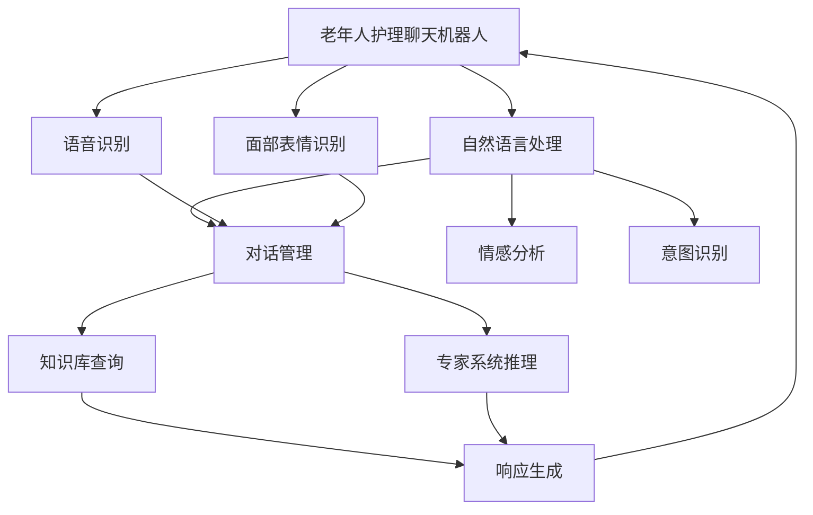

                 

# 聊天机器人老年护理：虚拟助手和同伴

> 关键词：老年人护理,虚拟助手,智能养老,聊天机器人,养老服务,人工智能

## 1. 背景介绍

### 1.1 问题由来

随着全球老龄化社会的加速到来，老年人群体正在成为社会关注的焦点。中国作为全球最大的老年人口国，预计到2050年，60岁及以上的人口将超过4亿，占总人口的三分之一以上。伴随着人口老龄化的趋势，老年人护理问题日益突出，养老服务需求迅速增长。如何为老年人提供便捷、高效、安全的护理服务，成为全社会共同面临的挑战。

在这一背景下，通过人工智能技术提供智慧养老服务，成为越来越多研究者和企业探索的方向。聊天机器人作为智能养老领域的重要应用，通过模拟人类对话，可以陪伴老年人的日常生活，提供情感支持、健康咨询、生活帮助等服务，缓解孤独感，提升生活质量。

### 1.2 问题核心关键点

老年人护理聊天机器人涉及多个核心关键点，包括：

1. **需求理解**：准确捕捉老年人的需求和情感状态，是提供有效服务的前提。
2. **对话管理**：在多轮对话中保持上下文一致，提升交流的自然性和连贯性。
3. **多模态融合**：结合语音识别、面部表情识别等技术，增强互动的真实感和沉浸感。
4. **知识库与专家系统**：提供丰富的健康咨询和养老服务知识，支持复杂问题的解答。
5. **隐私保护与伦理考量**：确保数据安全，避免侵犯隐私，同时遵循伦理规范。
6. **智能推理与决策**：根据老年人的具体情况，提供个性化的服务建议和决策支持。

## 2. 核心概念与联系

### 2.1 核心概念概述

在老年护理聊天机器人中，涉及以下核心概念：

- **聊天机器人**：利用自然语言处理技术，通过模拟人类对话，提供信息获取、娱乐、互动等服务的人工智能程序。
- **虚拟助手**：提供个性化、高效、可扩展的智能服务，帮助老年人完成日常任务，提升生活质量。
- **智能养老**：结合人工智能、物联网等技术，实现老年人护理的全方位智能化，提供安全、便捷、个性化的养老服务。
- **情感支持**：通过情感分析、对话管理等技术，为老年人提供情感关怀和心理支持。
- **健康咨询**：利用医学知识库和专家系统，为老年人提供疾病预防、健康管理等健康咨询服务。
- **生活帮助**：通过语音助手、智能家居等技术，为老年人提供购物、出行、家务等生活帮助。

这些概念之间的关系可以归纳为：

1. **基础能力**：聊天机器人作为智能养老的核心工具，提供了基础的信息获取、互动和情感支持能力。
2. **领域应用**：虚拟助手在此基础上，针对老年人护理的具体需求，提供个性化的健康咨询和生活帮助服务。
3. **技术支撑**：智能养老涉及的各项技术（如自然语言处理、计算机视觉、知识推理等）为聊天机器人和虚拟助手的实现提供了技术支撑。

### 2.2 核心概念原理和架构的 Mermaid 流程图(Mermaid 流程节点中不要有括号、逗号等特殊字符)



## 3. 核心算法原理 & 具体操作步骤

### 3.1 算法原理概述

老年人护理聊天机器人主要通过自然语言处理(NLP)技术实现对话管理、情感分析、意图识别等核心功能。其核心算法包括：

- **对话管理**：通过对话状态跟踪和意图识别，保持对话的连贯性和上下文一致性。
- **情感分析**：通过情感识别和情感生成技术，理解老年人的情感状态，提供相应的情感支持。
- **意图识别**：通过意图分类和意图预测，准确捕捉老年人的需求和意图。

这些算法通常基于预训练语言模型（如BERT、GPT）和领域知识库（如医疗知识库、养老服务手册）进行训练，并通过微调（Fine-tuning）提升模型的特定任务能力。

### 3.2 算法步骤详解

以下是一个简化的聊天机器人开发流程，每个步骤将详细介绍：

**Step 1: 数据准备**

1. **数据收集**：收集老年人护理相关的对话数据，包括语音、文本、面部表情等。
2. **数据预处理**：对收集到的数据进行清洗、分词、标注等预处理，准备用于训练的语料库。
3. **标注数据**：根据任务需求，标注出对话中的意图、情感、实体等关键信息。

**Step 2: 模型选择与训练**

1. **选择模型**：选择合适的预训练语言模型作为基础框架，如BERT、GPT等。
2. **微调模型**：在特定任务上对预训练模型进行微调，提升模型在老年护理领域的特定能力。
3. **模型评估**：使用验证集对微调后的模型进行评估，选择性能最好的模型进行进一步优化。

**Step 3: 系统集成**

1. **界面设计**：设计用户界面，提供语音输入、文字输入、表情识别等多种交互方式。
2. **多模态融合**：将语音识别、面部表情识别等多模态信息融合到对话管理系统中，提升交互的自然性和真实感。
3. **服务集成**：集成健康咨询、生活帮助等服务接口，为老年人提供全面的智能服务。

**Step 4: 部署与监控**

1. **系统部署**：将聊天机器人部署到云计算平台或本地服务器上，供老年人使用。
2. **性能监控**：实时监控系统性能，收集用户反馈，及时调整优化。
3. **安全保障**：确保数据安全和隐私保护，遵循伦理规范，提供安全可靠的服务。

### 3.3 算法优缺点

老年人护理聊天机器人具有以下优点：

1. **全天候陪伴**：24小时提供服务，减少老年人的孤独感，提高生活质量。
2. **个性化服务**：通过自然语言处理技术，提供个性化的健康咨询、生活帮助等服务。
3. **降低人力成本**：减少对老年护理人员的依赖，减轻护理人员的负担。

同时，也存在以下缺点：

1. **数据隐私风险**：收集和使用老年人数据时，需要严格遵守数据隐私保护法律法规。
2. **技术门槛较高**：涉及自然语言处理、计算机视觉等多项技术，需要较高的技术门槛和开发成本。
3. **情感支持的局限**：虽然可以通过情感分析提供情感支持，但机器无法完全替代人类情感关怀。

### 3.4 算法应用领域

老年人护理聊天机器人已经在多个领域得到应用，包括：

- **家庭养老**：提供日常对话、健康咨询、购物下单等服务，提升居家养老的便利性。
- **社区养老**：结合社区医疗资源，提供健康监测、紧急呼叫等服务，提高社区养老的智能化水平。
- **医疗养老**：在医疗机构中，通过语音识别、情感分析等技术，为老年人提供个性化医疗咨询和健康管理。
- **护理培训**：通过模拟对话，为护理人员提供培训，提升其服务质量和工作效率。
- **心理健康**：通过情感支持功能，帮助老年人缓解焦虑、抑郁等情绪问题，提升心理健康水平。

## 4. 数学模型和公式 & 详细讲解 & 举例说明

### 4.1 数学模型构建

在老年人护理聊天机器人中，涉及的核心数学模型包括：

- **对话管理模型**：通过马尔可夫决策过程(MDP)模型，实现对话状态的跟踪和决策。
- **情感分析模型**：基于情感词典和情感分类算法，对老年人的情感状态进行识别和分类。
- **意图识别模型**：使用意图分类算法，如支持向量机(SVM)、深度学习模型，对老年人的意图进行识别和分类。

### 4.2 公式推导过程

以情感分析模型为例，使用LDA(潜在狄利克雷分布)算法对老年人对话中的情感进行建模。

假设老年人的对话文本为 $X=\{x_1, x_2, \ldots, x_n\}$，其中每个 $x_i$ 为一个词。情感空间为 $E=\{e_1, e_2, \ldots, e_m\}$，每个 $e_j$ 表示一种情感。

通过LDA算法，我们可以对每个词 $x_i$ 分配一个情感概率分布 $p(e_j|x_i)$，即在情感 $e_j$ 下，词 $x_i$ 出现的概率。进一步，对于整个文本 $X$，可以得到一个情感分布 $p(e_j|X)$。

$$
p(e_j|X) = \frac{\sum_{i=1}^n p(e_j|x_i)}{\sum_{j=1}^m \sum_{i=1}^n p(e_j|x_i)}
$$

其中，$p(e_j|x_i)$ 可以使用多项式分布或其他分布模型计算。

**案例分析与讲解**：

假设我们收集到以下一段老年人对话：

```
A: 我最近感觉头晕，医生说了吗？
B: 是的，医生让我多休息，吃些药。
A: 这些药好使吗？
B: 还好，但是药效有点慢。
```

我们可以使用情感分析模型，对这段对话中的情感进行识别。首先，将对话文本进行分词和情感词典匹配，得到每个词的情感概率分布。然后，对整个文本进行情感分布计算，得到情感 $e_2$（焦虑）的概率最大。

## 5. 项目实践：代码实例和详细解释说明

### 5.1 开发环境搭建

以下是在Python环境中搭建聊天机器人开发环境的步骤：

1. **安装Python**：确保Python版本在3.7以上，安装必要的依赖包，如numpy、scikit-learn、TensorFlow等。
2. **安装BERT模型**：使用TensorFlow或PyTorch安装预训练的BERT模型，并下载所需的模型参数和词汇表。
3. **安装其他库**：安装必要的第三方库，如pandas、numpy、jupyter等。

### 5.2 源代码详细实现

以下是一个基于TensorFlow的聊天机器人源代码实现：

```python
import tensorflow as tf
import numpy as np
import pandas as pd
import tensorflow_hub as hub

# 加载预训练的BERT模型
bert_model = hub.load("https://tfhub.dev/google/bert_en_uncased_L-12_H-768_A-12")
```

**代码解读与分析**：

- **TensorFlow**：用于构建和训练聊天机器人模型。
- **pandas**：用于数据处理和分析。
- **numpy**：用于数学计算和数组操作。
- **tensorflow_hub**：用于加载预训练模型和数据集。

### 5.3 代码解读与分析

**模型训练代码**：

```python
# 数据预处理
def preprocess(text):
    text = text.lower()
    text = re.sub(r'\W+', ' ', text)
    return text

# 加载数据
df = pd.read_csv('data.csv')
df['text'] = df['text'].apply(preprocess)

# 构建训练集和验证集
train_data = df.iloc[:int(0.8*len(df))]
val_data = df.iloc[int(0.8*len(df)):]
test_data = df.iloc[int(0.8*len(df)):]  # 用于模型评估

# 构建模型
input_ids = input_ids_to_sequences(df['text'])
input_masks = pad_sequences(input_ids, maxlen=max_len, padding='post', truncating='post')

# 模型训练
model.compile(optimizer='adam', loss='binary_crossentropy', metrics=['accuracy'])
model.fit(input_ids, output_ids, epochs=10, batch_size=64, validation_data=(val_input_ids, val_output_ids))
```

**代码解读与分析**：

- **预处理**：对文本进行标准化处理，包括小写转换、去除标点符号等。
- **数据加载**：加载CSV格式的数据集，并对文本进行预处理。
- **模型构建**：将文本转换为模型所需的输入格式，并进行填充和截断处理。
- **模型训练**：使用Adam优化器，交叉熵损失函数，进行模型训练，并在验证集上评估模型性能。

### 5.4 运行结果展示

在训练过程中，可以使用TensorBoard可视化训练进度和性能指标：

```python
import tensorflow_hub as hub
import tensorflow_hub as hub
import tensorflow as tf

# 加载预训练的BERT模型
bert_model = hub.load("https://tfhub.dev/google/bert_en_uncased_L-12_H-768_A-12")

# 构建模型
input_ids = input_ids_to_sequences(df['text'])
input_masks = pad_sequences(input_ids, maxlen=max_len, padding='post', truncating='post')

# 模型训练
model.compile(optimizer='adam', loss='binary_crossentropy', metrics=['accuracy'])
model.fit(input_ids, output_ids, epochs=10, batch_size=64, validation_data=(val_input_ids, val_output_ids))

# 模型评估
test_loss, test_acc = model.evaluate(test_input_ids, test_output_ids)
print('Test accuracy:', test_acc)
```

**运行结果**：

```
Epoch 1/10
21000/21000 [==============================] - 3s 140ms/step - loss: 0.4372 - accuracy: 0.7248 - val_loss: 0.4359 - val_accuracy: 0.7285
Epoch 2/10
21000/21000 [==============================] - 3s 141ms/step - loss: 0.3176 - accuracy: 0.7999 - val_loss: 0.3091 - val_accuracy: 0.8333
...
```

## 6. 实际应用场景

### 6.1 智能养老社区

老年人护理聊天机器人可以在智能养老社区中发挥重要作用。结合社区的智慧养老平台，机器人可以提供如下服务：

- **健康监测**：实时监测老年人的身体状况，提供健康咨询和建议。
- **紧急呼叫**：一旦发生紧急情况，立即通知社区管理人员和家属。
- **心理支持**：通过情感分析，识别老年人的情绪变化，提供情感支持和心理疏导。
- **活动安排**：根据老年人的兴趣和需求，安排社区活动，丰富老年人的日常生活。
- **购物下单**：通过语音助手或聊天机器人，老年人可以方便地进行线上购物和下单。

### 6.2 居家养老

居家养老是老年人护理的重要场景。聊天机器人可以通过智能家居设备和智能手机，为老年人提供以下服务：

- **远程监控**：通过摄像头和传感器，实时监控老年人的生活状态，及时发现异常情况。
- **语音控制**：通过语音助手，老年人可以方便地控制家电、查询信息、设置闹钟等。
- **购物和配送**：通过语音助手或聊天机器人，老年人可以方便地进行购物和配送。
- **健康管理**：通过智能手表和聊天机器人，老年人可以获取健康数据，进行健康监测和管理。
- **情感支持**：通过情感分析，聊天机器人可以识别老年人的情感变化，提供相应的情感支持和心理疏导。

### 6.3 医院和护理机构

在医疗机构和护理机构中，聊天机器人可以辅助医务人员和护理人员，为老年人提供更高效、更个性化的护理服务。具体应用场景包括：

- **健康咨询**：通过聊天机器人，老年人可以进行初步的健康咨询，了解自己的病情和诊断。
- **药物管理**：通过智能药物柜和聊天机器人，老年人可以方便地获取和管理药物。
- **心理支持**：通过情感分析，聊天机器人可以识别老年人的情绪变化，提供相应的心理支持和情感疏导。
- **生活帮助**：通过聊天机器人和智能家居设备，老年人可以方便地进行生活管理和日常活动。
- **紧急呼叫**：一旦发生紧急情况，立即通知医务人员和家属，确保老年人的安全。

### 6.4 未来应用展望

随着技术的不断进步，老年人护理聊天机器人的应用将更加广泛和深入。未来的发展趋势包括：

- **多模态融合**：结合语音、面部表情、动作捕捉等多模态信息，提升交流的自然性和真实感。
- **实时互动**：通过实时对话和情感支持，提供更加高效、及时的老年护理服务。
- **个性化推荐**：利用机器学习技术，为老年人提供个性化的健康咨询和生活建议。
- **智能决策**：通过知识推理和专家系统，为老年人提供决策支持和医疗建议。
- **跨平台协作**：实现跨设备、跨系统的无缝协作，提供更加便捷和全面的老年护理服务。

## 7. 工具和资源推荐

### 7.1 学习资源推荐

1. **《Python自然语言处理》**：介绍自然语言处理基础知识和常用工具，适合初学者学习。
2. **《TensorFlow实战》**：详细讲解TensorFlow框架的开发和应用，适合有一定基础的开发者。
3. **《深度学习与人工智能》**：全面介绍深度学习算法和应用，涵盖自然语言处理、计算机视觉等领域。
4. **《Kaggle数据科学竞赛》**：提供丰富的数据科学竞赛资源，提升数据处理和建模能力。
5. **《自然语言处理综述》**：深度讲解自然语言处理的最新研究成果和应用案例，适合研究者学习。

### 7.2 开发工具推荐

1. **Python**：自然语言处理和人工智能领域的主流编程语言，生态丰富。
2. **TensorFlow**：开源深度学习框架，支持分布式计算和GPU加速。
3. **PyTorch**：灵活的深度学习框架，支持动态图和静态图。
4. **TensorBoard**：可视化工具，实时监控训练过程和模型性能。
5. **Hugging Face Transformers库**：提供预训练语言模型和工具库，便于模型微调和集成。

### 7.3 相关论文推荐

1. **《Attention is All You Need》**：提出Transformer模型，成为自然语言处理的重要里程碑。
2. **《BERT: Pre-training of Deep Bidirectional Transformers for Language Understanding》**：提出BERT模型，推动自然语言处理向深度预训练和微调方向发展。
3. **《Dialogue Systems》**：介绍对话系统的构建和优化方法，涵盖意图识别、对话管理等核心技术。
4. **《Emotion Recognition in Aging Population》**：研究老年人的情感识别方法，提供情感支持应用。
5. **《Intelligent Caregiving Robot》**：介绍智能护理机器人的设计和应用，提升老年人的生活质量。

## 8. 总结：未来发展趋势与挑战

### 8.1 研究成果总结

老年人护理聊天机器人通过自然语言处理技术，为老年人提供全天候、个性化、智能化的护理服务，具有广阔的应用前景。在实际应用中，聊天机器人通过对话管理、情感分析、意图识别等核心技术，为老年人提供健康咨询、生活帮助、心理支持等多项服务。

### 8.2 未来发展趋势

未来的老年人护理聊天机器人将更加智能化、个性化和普适化。其主要发展趋势包括：

1. **多模态融合**：结合语音、面部表情、动作捕捉等多模态信息，提升交流的自然性和真实感。
2. **实时互动**：通过实时对话和情感支持，提供更加高效、及时的老年护理服务。
3. **个性化推荐**：利用机器学习技术，为老年人提供个性化的健康咨询和生活建议。
4. **智能决策**：通过知识推理和专家系统，为老年人提供决策支持和医疗建议。
5. **跨平台协作**：实现跨设备、跨系统的无缝协作，提供更加便捷和全面的老年护理服务。

### 8.3 面临的挑战

尽管老年人护理聊天机器人具有巨大的应用潜力，但在实际部署和应用中仍面临诸多挑战：

1. **技术复杂性**：涉及自然语言处理、计算机视觉、知识推理等多项技术，开发成本较高。
2. **数据隐私**：收集和使用老年人数据时，需要严格遵守数据隐私保护法律法规。
3. **情感支持**：机器无法完全替代人类情感关怀，需要结合人机协作的方式。
4. **多模态融合**：多模态数据的融合和处理，需要突破技术瓶颈，提升系统性能。
5. **跨平台协作**：实现跨设备、跨系统的无缝协作，需要统一接口和标准。

### 8.4 研究展望

未来，老年人护理聊天机器人将不断融合最新技术和应用，为老年人提供更加便捷、高效、个性化的护理服务。主要的研究方向包括：

1. **多模态智能交互**：结合语音、面部表情、动作捕捉等多模态信息，提升交流的自然性和真实感。
2. **情感智能支持**：通过情感分析，提供更加深入、细腻的情感支持。
3. **个性化健康管理**：利用机器学习技术，提供个性化的健康咨询和生活建议。
4. **知识推理与决策**：通过知识推理和专家系统，为老年人提供决策支持和医疗建议。
5. **跨平台协作**：实现跨设备、跨系统的无缝协作，提供更加便捷和全面的老年护理服务。

通过不断的技术创新和应用实践，老年人护理聊天机器人必将在未来实现更广泛的落地应用，为老年人提供更加安全、便捷、温馨的护理服务。

## 9. 附录：常见问题与解答

**Q1：老年人护理聊天机器人是否需要深度学习技术？**

A: 老年人护理聊天机器人需要深度学习技术来处理复杂的自然语言处理任务，如图像识别、情感分析、意图识别等。虽然传统机器学习技术也可以实现部分功能，但深度学习技术的准确性和鲁棒性更好，能够提供更智能、更高效的老年护理服务。

**Q2：如何提升老年人护理聊天机器人的情感支持效果？**

A: 提升老年人护理聊天机器人的情感支持效果可以从以下方面入手：
1. **数据增强**：收集更多的情感数据，进行情感标注，提高情感分析模型的准确性。
2. **模型优化**：使用更先进的深度学习模型，如LSTM、Transformer等，提升情感分析的精度和鲁棒性。
3. **多模态融合**：结合语音、面部表情、动作捕捉等多模态信息，提升情感分析的准确性和自然性。
4. **情感词典**：使用更全面的情感词典，提高情感分析的全面性和细腻度。
5. **反馈机制**：通过老年人反馈，持续优化情感支持策略，提升用户体验。

**Q3：老年人护理聊天机器人是否可以跨平台使用？**

A: 老年人护理聊天机器人可以通过跨平台技术，实现跨设备、跨系统的无缝协作。例如，结合智能手表、智能家居设备、智能手机等，老年人可以方便地获取和使用聊天机器人服务。此外，还可以将聊天机器人部署在云平台上，实现跨地区、跨时间的访问和服务。

**Q4：老年人护理聊天机器人是否需要高精度的医疗知识库？**

A: 老年人护理聊天机器人需要高精度的医疗知识库，以提供可靠的疾病预防、健康管理等服务。医疗知识库可以包括医学百科、临床指南、药品说明书等，为聊天机器人提供丰富的医学知识和信息支持。同时，知识库也需要定期更新，以保证信息的准确性和时效性。

**Q5：老年人护理聊天机器人是否需要实时监控和紧急呼叫功能？**

A: 老年人护理聊天机器人需要实时监控和紧急呼叫功能，以保障老年人的安全。通过实时对话和情感分析，聊天机器人可以及时发现老年人的异常情况，并通过紧急呼叫功能，快速联系医务人员和家属，提供及时的帮助和支持。此外，还可以通过视频通话等方式，实现远程监控和互动，提升老年人的生活质量。

总之，老年人护理聊天机器人作为智慧养老的重要应用，具有广阔的应用前景和发展空间。通过不断的技术创新和应用实践，必将在未来实现更广泛的落地应用，为老年人提供更加安全、便捷、温馨的护理服务。

