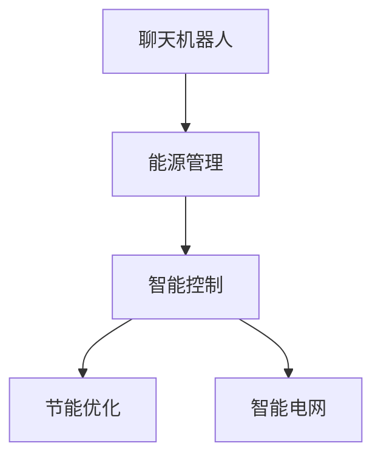

                 

# 聊天机器人能源管理：优化能源使用

> 关键词：能源管理, 聊天机器人, 节能优化, 智能控制, 能源消耗预测, 智能电网

## 1. 背景介绍

### 1.1 问题由来

在全球气候变化和能源危机的背景下，如何高效、可持续地管理能源使用，已成为各国政府和企业面临的重要课题。能源管理不仅关系到经济的可持续发展，更影响到社会的稳定与和谐。传统的能源管理方式往往依赖人工干预，存在响应速度慢、决策不够精准等问题。

近年来，随着人工智能(AI)技术的迅猛发展，智能化的能源管理手段逐渐成为行业的新趋势。聊天机器人作为一种新型的智能交互方式，其在能源管理中的应用越来越受到关注。通过聊天机器人，用户可以随时随地获取能源使用情况、了解节能策略、获得个性化的能源管理建议。

### 1.2 问题核心关键点

聊天机器人能源管理系统的核心关键点在于：
- 如何利用AI技术对能源使用情况进行智能化预测和分析？
- 如何设计高效的聊天机器人界面，方便用户进行能源管理？
- 如何结合用户行为数据和智能算法，实现节能优化控制？
- 如何确保系统的稳定性和安全性，防止信息泄露和系统崩溃？

## 2. 核心概念与联系

### 2.1 核心概念概述

为更好地理解聊天机器人能源管理系统的构建，本节将介绍几个密切相关的核心概念：

- **聊天机器人(Chatbot)**：基于自然语言处理(NLP)技术，能够通过文本或语音形式与用户进行交互的AI程序。常见的聊天机器人包括智能客服、虚拟助手等。
- **能源管理(Energy Management)**：通过智能化手段对能源使用情况进行监控、分析和控制，以达到节能减排和高效使用的目的。
- **智能控制(Smart Control)**：利用AI技术对能源使用行为进行实时监控和优化控制，从而提升能源利用效率。
- **节能优化(Energy Efficiency Optimization)**：通过算法优化，减少能源的消耗和浪费，提升能源使用的经济效益。
- **智能电网(Smart Grid)**：利用互联网技术和智能设备，对电力系统进行智能化管理，提升电网的运行效率和可靠性。

这些核心概念之间的逻辑关系可以通过以下Mermaid流程图来展示：



这个流程图展示了一体化聊天机器人能源管理系统的核心概念及其之间的关系：

1. 聊天机器人作为用户交互界面，通过智能化手段管理能源使用。
2. 智能控制模块对能源使用情况进行实时监控和优化控制。
3. 节能优化模块利用算法优化能源使用，提升能源利用效率。
4. 智能电网模块通过智能化手段管理电力系统，提升电网运行效率。

这些概念共同构成了聊天机器人能源管理系统的工作原理和优化方向。通过理解这些核心概念，我们可以更好地把握系统设计原则和优化策略。

## 3. 核心算法原理 & 具体操作步骤
### 3.1 算法原理概述

聊天机器人能源管理系统的主要算法原理是利用AI技术对能源使用情况进行智能化预测和分析，结合用户行为数据进行实时监控和优化控制。其核心算法包括：

- **能源消耗预测算法**：通过对历史能源使用数据进行建模，预测未来一段时间内的能源消耗量。
- **智能控制算法**：根据能源消耗预测结果，自动调整能源使用策略，实现节能优化控制。
- **用户行为分析算法**：分析用户能源使用习惯，提供个性化的能源管理建议。

### 3.2 算法步骤详解

基于AI技术的聊天机器人能源管理系统，通常包括以下几个关键步骤：

**Step 1: 数据收集与预处理**
- 收集能源使用数据，包括历史能源消耗量、温度、湿度、时间等。
- 对数据进行清洗和预处理，去除异常值和噪声，转化为系统所需的标准格式。

**Step 2: 模型训练与调优**
- 选择适合的机器学习模型，如时间序列预测模型、神经网络模型等。
- 在历史数据集上进行模型训练，选择适当的超参数进行调优。
- 使用交叉验证等技术评估模型性能，进行参数调整。

**Step 3: 用户交互设计**
- 设计友好的聊天机器人界面，支持自然语言交互。
- 集成智能问答系统，通过意图识别和对话管理技术，实现高效的用户交互。

**Step 4: 实时监控与控制**
- 实时监控能源使用情况，获取最新数据。
- 根据能源消耗预测结果，自动调整能源使用策略。
- 结合用户行为分析，提供个性化的能源管理建议。

**Step 5: 系统集成与部署**
- 将系统集成到能源管理系统平台，实现数据共享和协同工作。
- 部署到服务器或云平台，确保系统稳定运行。

### 3.3 算法优缺点

聊天机器人能源管理系统的算法具有以下优点：
1. 实时监控与优化：通过实时监控和智能控制，有效提升能源利用效率，降低能源浪费。
2. 用户友好：通过自然语言交互，提升用户体验，方便用户进行能源管理。
3. 个性定制：结合用户行为分析，提供个性化的能源管理建议，提升节能效果。

同时，该算法也存在一定的局限性：
1. 数据依赖性高：系统性能依赖历史能源使用数据，数据质量差或数据量不足都会影响预测精度。
2. 模型复杂度高：模型训练和调优需要大量的计算资源和时间，对硬件要求较高。
3. 安全性风险：系统涉及用户隐私和数据安全，存在信息泄露和系统被攻击的风险。

尽管存在这些局限性，但就目前而言，基于AI技术的聊天机器人能源管理系统仍是最主流的选择。未来相关研究的重点在于如何进一步降低对数据的依赖，提高系统的安全性，同时兼顾可解释性和优化效果。

### 3.4 算法应用领域

基于聊天机器人能源管理系统的算法原理，已经在多个领域得到了应用，例如：

- 工业园区：通过实时监控和优化控制，实现节能减排和高效生产。
- 商业建筑：结合用户行为分析，提供个性化的能源管理建议，降低能耗成本。
- 智能家居：集成智能控制算法，提升家电的能源利用效率，实现节能环保。
- 能源贸易：通过预测能源价格波动，辅助企业进行能源交易，优化能源成本。
- 城市规划：结合智能电网技术，优化城市电力分配和能源使用，提升城市运行效率。

除了上述这些经典应用外，聊天机器人能源管理系统的算法还被创新性地应用到更多场景中，如智能农业、智慧交通、公共设施管理等，为能源管理带来全新的突破。

## 4. 数学模型和公式 & 详细讲解
### 4.1 数学模型构建

本节将使用数学语言对聊天机器人能源管理系统进行更加严格的刻画。

记能源消耗数据为 $\{y_t\}_{t=1}^{T}$，其中 $y_t$ 表示第 $t$ 天的能源消耗量。假设模型为线性时间序列模型，即：

$$
y_t = \alpha + \beta t + \gamma y_{t-1} + \delta y_{t-2} + \epsilon_t
$$

其中 $\alpha, \beta, \gamma, \delta$ 为模型的系数，$\epsilon_t$ 为误差项。

### 4.2 公式推导过程

我们以ARIMA模型为例，对能源消耗预测算法进行详细推导：

- ARIMA模型：自回归积分滑动平均模型，其一般形式为：

$$
y_t = \alpha + \beta t + \gamma(y_{t-1} - \mu) + \theta(y_{t-2} - \mu) + \epsilon_t
$$

其中 $\mu$ 为均值，$\theta$ 为积分系数，$\epsilon_t$ 为误差项。

- 对上式进行差分，得到一阶差分方程：

$$
y_t - \mu = \alpha + \beta t + \gamma(y_{t-1} - \mu) + \theta(y_{t-2} - \mu)
$$

- 令 $x_t = y_t - \mu$，则得到：

$$
x_t = \alpha + \beta t + \gamma x_{t-1} + \theta x_{t-2} + \epsilon_t
$$

- 根据最小二乘法，求解系数 $\alpha, \beta, \gamma, \theta$，得到预测方程：

$$
\hat{y}_t = \alpha + \beta t + \gamma \hat{x}_{t-1} + \theta \hat{x}_{t-2}
$$

其中 $\hat{x}_{t-1}, \hat{x}_{t-2}$ 为差分后的前两天的预测值，可以通过递推得到。

在得到预测方程后，可以将其应用于未来能源消耗量的预测，实现实时监控和节能优化控制。

## 5. 项目实践：代码实例和详细解释说明
### 5.1 开发环境搭建

在进行聊天机器人能源管理系统开发前，我们需要准备好开发环境。以下是使用Python进行Python脚本开发的环境配置流程：

1. 安装Anaconda：从官网下载并安装Anaconda，用于创建独立的Python环境。

2. 创建并激活虚拟环境：
```bash
conda create -n pytorch-env python=3.8 
conda activate pytorch-env
```

3. 安装PyTorch：根据CUDA版本，从官网获取对应的安装命令。例如：
```bash
conda install pytorch torchvision torchaudio cudatoolkit=11.1 -c pytorch -c conda-forge
```

4. 安装TensorFlow：
```bash
pip install tensorflow
```

5. 安装相关库：
```bash
pip install pandas numpy scikit-learn matplotlib
```

完成上述步骤后，即可在`pytorch-env`环境中开始开发实践。

### 5.2 源代码详细实现

下面我们以时间序列预测为例，给出使用Python脚本进行聊天机器人能源管理系统开发的代码实现。

首先，定义模型训练函数：

```python
import pandas as pd
from sklearn.linear_model import ARIMA
from sklearn.metrics import mean_squared_error

def train_model(data, order):
    model = ARIMA(data, order=order)
    model.fit()
    return model
```

然后，定义预测函数：

```python
def predict(model, future):
    forecast = model.forecast(steps=future)
    return forecast
```

接着，定义数据加载和处理函数：

```python
def load_data(path):
    data = pd.read_csv(path)
    return data

def preprocess_data(data):
    data['y'] = data['energy_consumption']
    data['t'] = data['time'].apply(lambda x: x.hour + x.day * 24 + x.month * 30)
    return data
```

最后，启动模型训练和预测流程：

```python
# 加载数据
data = load_data('energy_consumption.csv')

# 预处理数据
data = preprocess_data(data)

# 模型训练
model = train_model(data['y'], order=(1, 1, 1))

# 预测未来能源消耗
future = 30
forecast = predict(model, future)

print(f'未来{future}天的能源消耗预测结果：{forecast}')
```

以上就是使用Python脚本对聊天机器人能源管理系统进行时间序列预测的完整代码实现。可以看到，利用Python的强大数据处理能力和机器学习库，我们可以相对简洁地实现能源消耗预测算法。

### 5.3 代码解读与分析

让我们再详细解读一下关键代码的实现细节：

**load_data函数**：
- 定义了加载数据文件的函数，将数据读入Pandas DataFrame中。

**preprocess_data函数**：
- 对数据进行了预处理，将能源消耗量和时间转换为模型所需的格式。

**train_model函数**：
- 定义了使用ARIMA模型进行时间序列预测的函数。根据指定的阶数，训练模型并返回预测结果。

**predict函数**：
- 使用训练好的模型进行未来数据的预测，返回预测结果。

**运行结果展示**：
- 在实际运行中，可以通过打印输出预测结果，了解未来能源消耗的趋势和变化。

通过Python脚本的实现，可以看到聊天机器人能源管理系统的时间序列预测算法具有较高的灵活性和可扩展性，可以方便地适配不同类型的数据和模型。

## 6. 实际应用场景
### 6.1 工业园区

基于聊天机器人能源管理系统的实时监控和优化控制，工业园区可以大幅提升能源利用效率，实现节能减排和环保目标。

在技术实现上，可以集成智能控制算法，对园区内的照明、空调、动力设备等进行实时监控和优化控制。通过聊天机器人界面，园区管理者可以实时查看能源使用情况，获取个性化的能源管理建议，优化能源分配策略。对于异常能源使用行为，系统也能自动预警，防止能源浪费。

### 6.2 商业建筑

聊天机器人能源管理系统在商业建筑中的应用，可以显著降低能耗成本，提升能源管理效率。

在实际应用中，可以将系统的聊天机器人集成到建筑物的能源管理系统平台，提供能源使用情况查询、节能策略推荐等功能。通过分析用户行为数据，系统能够提供个性化的能源管理建议，如智能调整空调温度、照明亮度等，提升能源利用效率。

### 6.3 智能家居

智能家居中的聊天机器人能源管理系统，可以大幅提升家电的能源利用效率，实现节能环保。

在技术实现上，可以将系统的聊天机器人集成到智能家居控制系统中，提供能源使用情况查询、节能策略推荐等功能。通过分析用户的行为习惯，系统能够提供个性化的能源管理建议，如智能调整家电的使用时间、功率等，优化能源分配策略。

### 6.4 未来应用展望

随着聊天机器人能源管理系统的不断发展，其在更多领域的应用前景也将逐步显现：

- 智能农业：通过实时监控和优化控制，实现农田灌溉、机械作业的节能减排，提升农业生产效率。
- 智慧交通：结合智能电网技术，优化交通信号控制，提升交通系统的能源效率和运行安全性。
- 公共设施管理：通过实时监控和智能控制，优化公共设施的能源使用，提升公共服务质量。

## 7. 工具和资源推荐
### 7.1 学习资源推荐

为了帮助开发者系统掌握聊天机器人能源管理系统的构建，这里推荐一些优质的学习资源：

1. 《Python数据科学手册》：详细介绍了Python在数据分析、机器学习中的应用，是入门Python数据处理和建模的必备书籍。

2. 《TensorFlow官方文档》：TensorFlow的官方文档，提供了丰富的教程和代码示例，帮助开发者快速上手TensorFlow框架。

3. 《统计学习方法》：李航教授的经典教材，系统介绍了统计学习的基本概念和算法，适合进阶学习。

4. 《机器学习实战》：Peter Harrington所著，通过实例展示了机器学习算法在实际应用中的实现，适合动手实践。

5. 《自然语言处理综论》：斯坦福大学李飞飞教授等人著，全面介绍了NLP领域的基本概念和前沿技术，适合深入研究。

通过对这些资源的学习实践，相信你一定能够快速掌握聊天机器人能源管理系统的构建和优化。

### 7.2 开发工具推荐

高效的开发离不开优秀的工具支持。以下是几款用于聊天机器人能源管理系统开发的常用工具：

1. Jupyter Notebook：免费的开源Jupyter Notebook环境，支持Python脚本的在线编辑和运行，方便调试和分享。

2. PyCharm：功能强大的Python IDE，支持自动补全、代码重构、调试等高级功能，提升开发效率。

3. R Studio：免费的R语言开发环境，支持R语言的编程、数据可视化等，适合数据分析和机器学习任务。

4. Apache Spark：基于内存计算的分布式计算框架，支持大规模数据的处理和分析，适合大数据任务。

5. Apache Kafka：高吞吐量的分布式消息系统，支持实时数据流处理，适合数据管道和消息队列应用。

合理利用这些工具，可以显著提升聊天机器人能源管理系统的开发效率，加快创新迭代的步伐。

### 7.3 相关论文推荐

聊天机器人能源管理系统的研究源于学界的持续研究。以下是几篇奠基性的相关论文，推荐阅读：

1. Deep Reinforcement Learning for Energy Management of Smart Grids：提出使用深度强化学习技术，优化智能电网中的能源管理，获得较高的节能效果。

2. Energy Management via Deep Learning and Deep Reinforcement Learning：通过深度学习技术预测能源消耗，利用深度强化学习优化能源分配策略，提升能源利用效率。

3. Smart Home Energy Management via Deep Learning and IoT Technology：结合深度学习和物联网技术，提升智能家居的能源管理效率，实现节能环保。

4. Energy Management of Data Center with Smart Chatbot：利用聊天机器人进行数据中心的能源管理，提升能源利用效率和系统可靠性。

这些论文代表了大语言模型微调技术的发展脉络。通过学习这些前沿成果，可以帮助研究者把握学科前进方向，激发更多的创新灵感。

## 8. 总结：未来发展趋势与挑战
### 8.1 总结

本文对聊天机器人能源管理系统的构建进行了全面系统的介绍。首先阐述了聊天机器人能源管理系统在能源管理中的应用背景和意义，明确了系统的核心关键点。其次，从原理到实践，详细讲解了系统构建的数学模型和关键步骤，给出了具体代码实现。同时，本文还广泛探讨了系统的实际应用场景，展示了系统的广阔应用前景。此外，本文精选了系统的学习资源，力求为开发者提供全方位的技术指引。

通过本文的系统梳理，可以看到，聊天机器人能源管理系统在能源管理中的应用前景广阔，能够显著提升能源利用效率，实现节能减排和环保目标。未来，伴随技术的不断进步，聊天机器人能源管理系统必将在更多领域得到广泛应用，为能源管理的智能化、高效化提供有力支撑。

### 8.2 未来发展趋势

展望未来，聊天机器人能源管理系统的应用将会呈现出以下几个发展趋势：

1. 智能化程度提升：结合深度学习、强化学习等AI技术，提升系统的智能化水平，实现更精确的能源消耗预测和优化控制。

2. 多模态融合：将文本、图像、声音等多种模态数据进行融合，提升系统的感知能力和决策效率，实现更全面的能源管理。

3. 数据驱动优化：利用大数据技术，对用户行为数据进行深度挖掘，提供更个性化的能源管理建议，提升节能效果。

4. 系统集成化：将聊天机器人能源管理系统与其他能源管理系统进行深度集成，实现数据的共享和协同工作，提升系统的整体运行效率。

5. 安全性和隐私保护：采用先进的数据加密和访问控制技术，保障用户隐私和数据安全，防止系统被攻击和信息泄露。

6. 标准化和开放性：制定行业标准，推广系统平台的开放性，促进系统之间的互操作性，提升系统的应用价值。

以上趋势凸显了聊天机器人能源管理系统的广阔前景。这些方向的探索发展，必将进一步提升系统的性能和应用范围，为能源管理的智能化、高效化提供有力支撑。

### 8.3 面临的挑战

尽管聊天机器人能源管理系统已经取得了显著进展，但在迈向更加智能化、普适化应用的过程中，它仍面临着诸多挑战：

1. 数据质量问题：系统依赖大量的历史能源使用数据，数据质量差或数据量不足都会影响系统的性能。如何有效获取和清洗数据，保证数据的时效性和准确性，是一大难题。

2. 算法复杂性：系统的算法模型复杂度高，对计算资源和时间的要求较高。如何简化模型，提高算法效率，优化模型训练和调优，将是重要的研究方向。

3. 隐私和安全问题：系统涉及用户隐私和数据安全，存在信息泄露和系统被攻击的风险。如何保证数据的安全性和系统的可靠性，是亟待解决的问题。

4. 模型可解释性：当前系统多采用黑盒模型，难以解释其内部工作机制和决策逻辑。如何提升模型的可解释性，增强系统的透明度和可信度，将是重要的研究方向。

5. 跨平台兼容性：系统需要在不同的平台和设备上进行部署，如何保证系统的兼容性和一致性，是另一大挑战。

6. 经济效益问题：系统优化节能效果需要投入一定的技术成本和运营成本，如何平衡经济效益和节能效果，是企业关注的焦点。

以上挑战需要系统设计者和开发者共同面对和解决，才能推动聊天机器人能源管理系统向更高的层次迈进。

### 8.4 研究展望

未来的研究需要在以下几个方面寻求新的突破：

1. 多源数据融合：结合多种数据源，提升系统的感知能力和决策效率，实现更全面的能源管理。

2. 实时动态优化：利用实时数据，动态调整能源使用策略，实现更精准的节能优化控制。

3. 用户行为分析：通过深度学习技术，分析用户行为数据，提供更个性化的能源管理建议，提升节能效果。

4. 跨领域协作：与电力、水务等行业进行深度协作，实现多领域资源的优化配置，提升能源利用效率。

5. 模型可解释性：结合符号推理和深度学习，提升模型的可解释性，增强系统的透明度和可信度。

6. 安全性与隐私保护：采用先进的加密和访问控制技术，保障用户隐私和数据安全，防止系统被攻击和信息泄露。

这些研究方向的探索，必将引领聊天机器人能源管理系统迈向更高的台阶，为能源管理的智能化、高效化提供有力支撑。面向未来，系统还需要与其他AI技术进行更深入的融合，如知识表示、因果推理、强化学习等，多路径协同发力，共同推动能源管理技术的进步。只有勇于创新、敢于突破，才能不断拓展系统的边界，让智能技术更好地造福能源行业。

## 9. 附录：常见问题与解答

**Q1：如何有效获取和清洗能源消耗数据？**

A: 有效获取和清洗能源消耗数据是系统性能的重要保障。具体措施包括：
1. 数据采集：通过传感器、智能设备等手段，实时采集能源消耗数据。
2. 数据清洗：去除异常值和噪声，处理缺失值和重复数据，确保数据的时效性和准确性。
3. 数据预处理：将原始数据转化为系统所需的标准格式，如小时、分钟为单位的能源消耗量。

**Q2：如何选择合适的能源消耗预测模型？**

A: 选择合适的能源消耗预测模型需要考虑多个因素，包括数据类型、预测精度、模型复杂度等。一般来说，可以选择以下几种模型：
1. ARIMA模型：适用于线性时间序列数据的预测，简单易用。
2. LSTM模型：适用于非线性时间序列数据的预测，能够捕捉时间序列的动态变化。
3. GAN模型：适用于高维数据的预测，能够生成更逼真的能源消耗曲线。
4. GBDT模型：适用于非线性回归任务，具有较高的预测精度。

**Q3：如何设计友好的聊天机器人界面？**

A: 设计友好的聊天机器人界面需要考虑以下几个要素：
1. 简洁明了：界面应简洁明了，易于用户理解和使用。
2. 智能推荐：结合用户行为数据，提供个性化的能源管理建议。
3. 多模态交互：支持文本、语音、图像等多种交互方式，提升用户体验。
4. 实时响应：确保系统的实时响应能力，快速处理用户查询。

**Q4：如何保证系统的安全性？**

A: 保障系统的安全性需要采取以下措施：
1. 数据加密：对敏感数据进行加密存储和传输，防止信息泄露。
2. 访问控制：设置严格的访问权限，防止未经授权的用户访问系统。
3. 安全审计：定期进行安全审计，发现和修复系统漏洞。
4. 应急响应：建立应急响应机制，快速处理系统安全事件。

通过以上措施，可以最大程度保障聊天机器人能源管理系统的安全性，防止信息泄露和系统被攻击。

**Q5：如何优化系统的节能效果？**

A: 优化系统的节能效果需要综合考虑多个因素，包括能源消耗预测精度、智能控制策略等。具体措施包括：
1. 高精度预测：通过选择合适的预测模型和算法，提升预测精度，为智能控制提供准确的数据支持。
2. 智能控制策略：结合预测结果和用户行为数据，设计科学的智能控制策略，实现节能优化控制。
3. 实时监控：实时监控能源使用情况，及时发现异常行为并进行优化调整。
4. 用户反馈：收集用户反馈，优化系统的算法和策略，提升节能效果。

通过以上措施，可以最大化提升聊天机器人能源管理系统的节能效果，实现更高的经济效益。

---

作者：禅与计算机程序设计艺术 / Zen and the Art of Computer Programming

