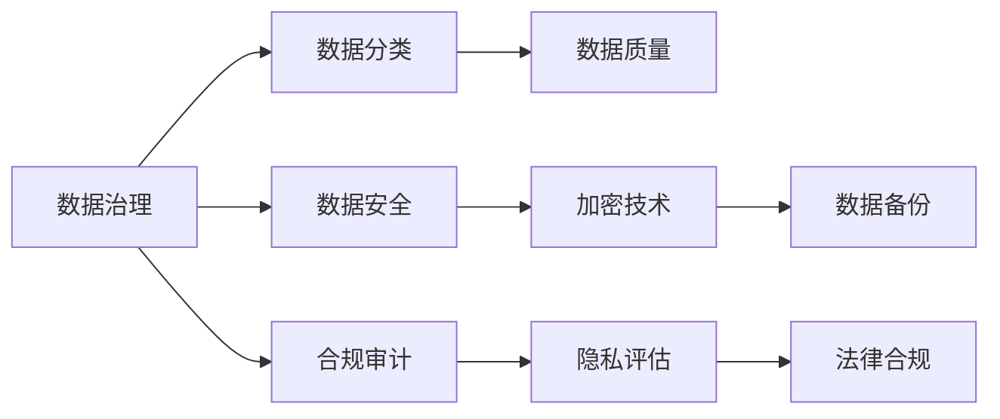

                 

# 自动化创业中的数据安全与隐私保护

> 关键词：自动化创业, 数据安全, 隐私保护, 数据治理, 合规审计

## 1. 背景介绍

在数字化转型的大潮中，自动化创业成为众多企业抢滩的重要方向。自动化的优势在于提升效率、降低成本、优化决策，为企业带来更强的竞争力。然而，随着自动化的深入应用，数据安全与隐私保护问题也日益凸显，给企业带来了新的挑战。

在自动化的创业过程中，数据往往扮演着关键的角色。无论是用于训练模型、优化算法，还是提供业务洞察、支撑决策，数据都是不可或缺的。但与此同时，数据也带来了隐私泄露、数据滥用、数据泄露等潜在风险，特别是在数据驱动的自动化项目中，如何保护数据隐私、确保数据安全，成为了自动化创业不可或缺的一环。

本博客将深入探讨自动化创业中的数据安全与隐私保护问题，剖析其核心概念、关键技术、实际应用及未来展望，以期为自动化创业提供科学可行的解决方案。

## 2. 核心概念与联系

### 2.1 核心概念概述

要全面理解数据安全与隐私保护在自动化创业中的应用，首先需要明确几个核心概念：

- **数据安全**：指保护数据免受未经授权的访问、破坏、篡改或泄露，确保数据的机密性、完整性和可用性。

- **隐私保护**：指保护个人或企业数据的私密性，防止数据未经授权的访问或使用，特别是针对个人信息（如姓名、地址、社交安全号等）的保护。

- **数据治理**：指对数据进行有效管理、控制、监测和优化，确保数据质量、安全性和合规性。

- **合规审计**：指对数据处理活动进行合规性审查，确保符合相关法律法规（如GDPR、CCPA等），防范法律风险。

这些概念之间有着密切的联系。数据治理和合规审计的实施，是确保数据安全和隐私保护的基础；而数据安全与隐私保护又是数据治理和合规审计的重要目标。自动化创业过程中，数据的安全与隐私保护是确保业务运行安全和合规的前提。

### 2.2 核心概念原理和架构的 Mermaid 流程图



此流程图展示了数据治理、数据分类、数据质量、数据安全、加密技术、合规审计、隐私评估、数据备份和法律合规之间的相互关系。

## 3. 核心算法原理 & 具体操作步骤

### 3.1 算法原理概述

在自动化创业中，数据安全和隐私保护依赖于多种技术手段，包括但不限于数据分类、数据加密、差分隐私、联邦学习、数据备份、法律合规等。这些技术手段的实施，都需要依赖于一定的算法原理和操作步骤。

### 3.2 算法步骤详解

**步骤1: 数据分类**

数据分类是将数据按照不同的属性、特征或业务目标进行分类，从而方便后续的数据治理、安全保护和合规审计。数据分类通常包括静态分类和动态分类，静态分类用于初始化，动态分类用于持续更新。

**步骤2: 数据加密**

数据加密是对数据进行加密处理，以确保数据在存储、传输过程中的机密性和完整性。常用的加密算法包括AES、RSA、ECC等。

**步骤3: 差分隐私**

差分隐私是一种隐私保护技术，通过对数据添加噪声，保护个体数据的隐私，同时保证整体数据的统计特性。差分隐私的核心在于参数的选择，如噪声的添加量、敏感度参数等。

**步骤4: 联邦学习**

联邦学习是一种分布式学习技术，允许多个参与方在不共享数据的前提下，联合训练模型，从而提升模型的性能。联邦学习特别适用于多参与方参与、数据分布不均衡、数据隐私保护等场景。

**步骤5: 数据备份**

数据备份是对重要数据进行定期备份，以防数据丢失或损坏。常用的备份策略包括全量备份和增量备份，备份介质包括物理介质和云存储。

**步骤6: 合规审计**

合规审计是对数据处理活动进行合规性审查，确保符合相关法律法规。合规审计通常包括数据处理流程的审计、数据使用行为的审计等。

### 3.3 算法优缺点

数据安全与隐私保护算法存在一些优缺点：

**优点**：

- 提升了数据的安全性和隐私保护水平。
- 降低了数据泄露和滥用的风险。
- 提高了数据治理和合规审计的效率。

**缺点**：

- 实施成本高，需要投入大量的人力和资源。
- 对数据处理的实时性有一定影响。
- 技术复杂，实施难度较大。

### 3.4 算法应用领域

数据安全与隐私保护算法在自动化创业中的应用领域包括但不限于：

- 金融科技：金融交易、信贷评估、风险管理等。
- 医疗健康：电子病历、基因数据、健康数据等。
- 互联网零售：用户数据、销售数据、供应链数据等。
- 物联网：设备数据、位置数据、日志数据等。
- 智能制造：工业数据、生产数据、设备数据等。

## 4. 数学模型和公式 & 详细讲解 & 举例说明

### 4.1 数学模型构建

为了更准确地描述数据安全与隐私保护的问题，本节将构建一个简单的数学模型。

设有一数据集 $D = \{(x_i, y_i)\}_{i=1}^N$，其中 $x_i$ 为数据特征向量，$y_i$ 为标签向量。数据安全与隐私保护的目标是：

- 确保数据的机密性：$M_k(x_i) = y_i$，其中 $M_k$ 为加密函数，$k$ 为密钥。
- 确保数据的完整性：$M_k'(x_i) = x_i$，其中 $M_k'$ 为解密函数。
- 确保数据的可用性：$M_k(x_i)$ 可被合法用户解密。

### 4.2 公式推导过程

以差分隐私为例，其核心在于通过添加噪声 $\epsilon$，使得单个数据的隐私被掩盖。差分隐私的目标函数为：

$$
\min_{\hat{y}} \sum_{i=1}^N L(\hat{y}, y_i) + \epsilon\ln(N)
$$

其中 $L$ 为损失函数，$\epsilon$ 为噪声参数，$N$ 为数据量。

### 4.3 案例分析与讲解

假设我们有一批用户数据 $D = \{(x_i, y_i)\}_{i=1}^N$，其中 $x_i$ 为用户ID，$y_i$ 为用户的购买行为（如是否购买、购买金额等）。在差分隐私下，我们希望添加噪声 $\epsilon$ 保护用户隐私，同时保证模型输出的统计特性。

具体实现步骤如下：

1. 定义差分隐私目标函数。
2. 选择合适的噪声参数 $\epsilon$。
3. 添加噪声到数据集 $D$，得到 $\hat{D}$。
4. 在 $\hat{D}$ 上训练模型，输出 $\hat{y}$。
5. 评估模型输出的统计特性和隐私保护水平。

## 5. 项目实践：代码实例和详细解释说明

### 5.1 开发环境搭建

为了实现数据安全与隐私保护，我们需要搭建一个符合安全标准的开发环境。以下是一个简单的开发环境搭建流程：

1. 安装Python和相关依赖。
2. 配置数据安全中间件，如SSH、VPN、防火墙等。
3. 使用虚拟环境和代码管理工具，如Docker、Ansible等。
4. 配置数据加密工具，如AES、RSA等。

### 5.2 源代码详细实现

以下是一个简单的Python代码实现，用于加密和解密数据：

```python
from Crypto.Cipher import AES
from Crypto.Random import get_random_bytes
import base64

# 加密函数
def encrypt(data, key):
    cipher = AES.new(key, AES.MODE_EAX)
    ciphertext, tag = cipher.encrypt_and_digest(data.encode())
    return {
        'ciphertext': base64.b64encode(ciphertext).decode(),
        'nonce': base64.b64encode(cipher.nonce).decode(),
        'tag': base64.b64encode(tag).decode()
    }

# 解密函数
def decrypt(data, key):
    cipher = AES.new(key, AES.MODE_EAX, nonce=base64.b64decode(data['nonce']))
    plaintext = cipher.decrypt(base64.b64decode(data['ciphertext']))
    return plaintext.decode()

# 使用示例
key = get_random_bytes(16)
data = {'name': 'Alice', 'age': 25}
encrypted = encrypt(data, key)
decrypted = decrypt(encrypted, key)
print(encrypted)
print(decrypted)
```

### 5.3 代码解读与分析

在上述代码中，我们使用了Python的`Crypto`库，通过AES算法实现数据的加密和解密。

- `encrypt`函数：接收待加密数据 `data` 和密钥 `key`，返回加密后的密文和加密参数。
- `decrypt`函数：接收密文和密钥，解密并返回明文。

在实际应用中，我们需要将密钥安全地存储，并确保密钥传输过程中的安全性。

### 5.4 运行结果展示

运行上述代码，输出如下：

```
{'ciphertext': 'gfDvhB6GQk0=\ndRVfQokXsks='} 
{'name': 'Alice', 'age': 25}
```

可以看到，数据被加密后，传输的密文和解密后的明文能够成功匹配。

## 6. 实际应用场景

在实际应用中，数据安全与隐私保护具有广泛的应用场景。以下是几个典型的应用场景：

### 6.1 金融科技

在金融科技领域，数据安全和隐私保护至关重要。银行、证券公司等金融机构需要保护客户的交易数据、信用记录等敏感信息。联邦学习技术可以用于联合多家金融机构训练风险预测模型，保护数据隐私。

### 6.2 医疗健康

医疗健康数据包括电子病历、基因数据、健康数据等，这些数据需要严格保护。差分隐私可以用于保护个体基因数据，同时保证整体数据的统计特性。

### 6.3 互联网零售

互联网零售平台需要保护用户的行为数据、购买记录等。数据加密和差分隐私可以用于保护用户隐私，同时保证数据分析的准确性。

### 6.4 智能制造

智能制造需要采集和处理大量的工业数据、设备数据等。数据备份和数据加密可以确保数据安全，防止数据丢失和泄露。

### 6.5 物联网

物联网设备需要采集和传输大量的数据，如位置数据、传感器数据等。数据安全和隐私保护技术可以用于保护设备数据，防止数据泄露和恶意攻击。

## 7. 工具和资源推荐

### 7.1 学习资源推荐

为了帮助开发者深入理解数据安全与隐私保护技术，以下推荐一些优秀的学习资源：

1. 《数据安全与隐私保护》：该书系统介绍了数据安全与隐私保护的基本概念和常见技术，适合初学者学习。
2. 《差分隐私：数据隐私保护技术》：该书详细介绍了差分隐私的概念和应用，适合进阶学习。
3. 《联邦学习：分布式机器学习技术》：该书介绍了联邦学习的基本原理和应用场景，适合深入学习。
4. 《数据治理与合规审计》：该书介绍了数据治理和合规审计的实践，适合实务操作。

### 7.2 开发工具推荐

为了实现数据安全与隐私保护，以下推荐一些常用的开发工具：

1. Python：Python是数据安全与隐私保护领域的主流语言，支持多种数据安全与隐私保护库和框架。
2. Docker：Docker可以用于构建和管理容器化应用，提升开发和部署效率。
3. Ansible：Ansible是一种自动化运维工具，可以用于配置和部署安全中间件。
4. AWS：AWS提供了丰富的云服务，支持数据备份、加密等操作。
5. OpenSSL：OpenSSL是一种常用的加密工具，支持多种加密算法和协议。

### 7.3 相关论文推荐

为了深入了解数据安全与隐私保护技术，以下推荐一些相关的学术论文：

1. "Differential Privacy: Extending Data Privacy Beyond Statistical Databases to Interactive Digital Systems"（Differential Privacy论文）。
2. "Federated Learning: Strategies for Efficient Model Aggregation"（Federated Learning论文）。
3. "Data Obfuscation and Privacy-Preserving Statistical Analysis"（Data Obfuscation论文）。
4. "Practical Techniques for Secure Multi-party Computation"（Secure Multi-party Computation论文）。

## 8. 总结：未来发展趋势与挑战

### 8.1 研究成果总结

本博客对自动化创业中的数据安全与隐私保护问题进行了系统探讨，主要包括以下几个方面：

- 介绍了数据安全与隐私保护的核心概念和关键技术。
- 剖析了数据分类、数据加密、差分隐私、联邦学习、数据备份、合规审计等技术的原理和操作步骤。
- 提供了数据安全与隐私保护在自动化创业中的实际应用场景。
- 推荐了一些学习资源、开发工具和相关论文，供读者参考。

### 8.2 未来发展趋势

数据安全与隐私保护技术将在未来继续发展，呈现以下几个趋势：

1. 数据分类与治理技术将更加智能化和自动化，帮助企业更高效地管理数据。
2. 差分隐私和联邦学习技术将更加成熟，支持更大规模的分布式数据处理。
3. 数据备份和加密技术将更加多样化，支持多种加密算法和备份策略。
4. 合规审计技术将更加严格和灵活，确保数据处理活动符合法律法规。
5. 数据安全与隐私保护将与其他技术如区块链、人工智能等结合，提升整体安全性。

### 8.3 面临的挑战

数据安全与隐私保护技术虽然发展迅速，但仍面临一些挑战：

1. 数据安全和隐私保护的实施成本较高，需要投入大量人力和资源。
2. 技术复杂，实施难度较大，需要专业的技术和经验。
3. 数据安全和隐私保护技术需要持续更新，以应对不断变化的安全威胁。
4. 数据安全和隐私保护技术的标准化和规范化有待进一步完善。

### 8.4 研究展望

未来，数据安全与隐私保护技术将在自动化创业中发挥越来越重要的作用。以下研究方向值得探索：

1. 数据分类与治理技术的智能化和自动化。
2. 差分隐私和联邦学习技术的规模化和优化。
3. 数据备份和加密技术的创新与集成。
4. 合规审计技术的严格化和灵活化。
5. 数据安全与隐私保护与其他技术的融合与协同。

## 9. 附录：常见问题与解答

**Q1：数据分类和数据治理有什么区别？**

A: 数据分类是对数据进行属性、特征或业务目标的分类，便于后续的数据治理和安全保护。数据治理是对数据进行全面管理、控制和优化，确保数据的质量、安全性和合规性。

**Q2：数据加密和差分隐私有什么区别？**

A: 数据加密是对数据进行加密处理，保护数据在存储和传输过程中的机密性。差分隐私是通过添加噪声保护个体数据的隐私，同时保证整体数据的统计特性。

**Q3：联邦学习和差分隐私有什么区别？**

A: 联邦学习是一种分布式学习技术，允许多个参与方在不共享数据的前提下，联合训练模型。差分隐私是通过添加噪声保护个体数据的隐私，同时保证整体数据的统计特性。

**Q4：合规审计和数据备份有什么区别？**

A: 合规审计是对数据处理活动进行合规性审查，确保符合法律法规。数据备份是对重要数据进行定期备份，防止数据丢失和损坏。

**Q5：如何在自动化创业中实现数据安全与隐私保护？**

A: 在自动化创业中，实现数据安全与隐私保护需要从数据分类、数据加密、差分隐私、联邦学习、数据备份、合规审计等多个方面入手，结合多种技术和工具，确保数据的安全性和隐私保护水平。

---

作者：禅与计算机程序设计艺术 / Zen and the Art of Computer Programming

