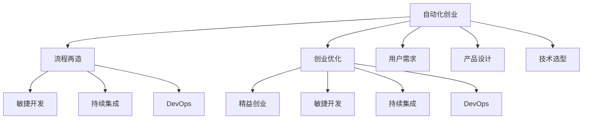

                 

# 自动化创业中的流程再造与优化

> 关键词：自动化创业, 流程再造, 创业优化, 精益创业, 敏捷开发, 持续集成, DevOps

## 1. 背景介绍

### 1.1 问题由来

近年来，随着互联网和信息技术的飞速发展，创业公司面临的市场环境日益复杂多变。如何在不确定性中寻找机遇，如何在激烈竞争中脱颖而出，成为每个创业者必须面对的挑战。传统依靠直觉和经验的创业方式已逐渐显现出其局限性。如何利用技术手段，更科学、高效地实现商业愿景，成为当下创业生态中的一个热点话题。

## 2. 核心概念与联系

### 2.1 核心概念概述

为更好地理解自动化创业中的流程再造与优化，本节将介绍几个密切相关的核心概念：

- **自动化创业**：指利用自动化工具、技术和平台，降低创业成本，提升创业效率，优化创业过程的创业模式。自动化创业涵盖了从创意筛选、团队组建、产品开发、市场推广到客户服务的全过程。
- **流程再造(Business Process Reengineering, BPR)**：指通过重新设计业务流程，去除无效环节，优化资源配置，提高效率和响应速度，从而实现业务突破的变革方法。流程再造通常结合信息技术工具实现，以实现流程的自动化、信息化和智能化。
- **创业优化**：指通过科学的方法和工具，优化创业流程、降低风险、提升效率的创业实践。创业优化包括流程管理、项目管理、资源调配、风险控制等多方面的内容。
- **精益创业(Lean Startup)**：一种以客户需求为中心，以最小可行产品(MVP)为切入点，快速迭代、快速验证、快速调整的创业方法。精益创业强调以数据驱动决策，不断优化产品和服务。
- **敏捷开发(Agile Development)**：一种灵活、迭代的开发模式，强调团队协作、持续交付、快速响应变化。敏捷开发与精益创业理念相辅相成，推动创业项目的快速迭代和持续优化。
- **持续集成(Continuous Integration, CI)**：一种软件开发生命周期中，通过自动化方式集成代码，频繁进行小规模、频繁的软件构建和测试的方法。持续集成能够显著提升代码质量和开发效率。
- **DevOps**：一种将软件开发(SD)和系统运维(Ops)紧密结合的方法，通过自动化工具和流程，实现软件交付的快速、可靠和安全。DevOps强调协作、自动化和持续交付。

这些核心概念之间的逻辑关系可以通过以下Mermaid流程图来展示：



这个流程图展示了几大核心概念之间的逻辑关系：

1. 自动化创业通过流程再造、创业优化等手段，实现创业效率的提升。
2. 流程再造和创业优化在敏捷开发、持续集成、DevOps等技术支持下，更好地落地实践。
3. 用户需求、产品设计和技术选型是自动化创业的起点，也是创业成功的关键。

这些概念共同构成了自动化创业的实践框架，有助于创业者更好地应对市场变化，提升创业成功率。

## 3. 核心算法原理 & 具体操作步骤

### 3.1 算法原理概述

自动化创业中的流程再造与优化，本质上是一种基于数据驱动和持续改进的创新方法。其核心思想是通过科学的流程设计、技术手段和组织管理，实现创业过程的高效化和智能化。

### 3.2 算法步骤详解

自动化创业的流程再造与优化一般包括以下几个关键步骤：

**Step 1: 数据收集与分析**

- 收集创业过程中的各项数据，如市场数据、客户反馈、财务数据、技术指标等。
- 使用数据分析工具，如Python的Pandas、NumPy、Scikit-Learn等，对数据进行清洗、处理和分析。
- 通过可视化工具，如Tableau、Power BI、Grafana等，将数据以图表形式呈现，辅助决策。

**Step 2: 业务流程建模**

- 根据业务需求和数据特征，使用BPM工具（如Bizagi、Appian、UiPath等）设计自动化流程。
- 通过可视化建模工具，如Lucidchart、Visio、Gliffy等，对流程进行图形化表示。
- 将业务流程转化为可执行的脚本，使用Python、JavaScript等编程语言实现流程自动化。

**Step 3: 技术选型与集成**

- 根据业务需求和现有技术栈，选择合适的技术和工具，如云平台（AWS、Azure、Google Cloud等）、容器化（Docker、Kubernetes等）、自动化测试工具（Selenium、JUnit、pytest等）。
- 将选定的技术和工具集成到现有的创业项目中，形成完整的技术栈和自动化流程。
- 使用CI/CD工具（如Jenkins、Travis CI、GitLab CI等），实现自动化构建、测试和部署。

**Step 4: 敏捷迭代与持续改进**

- 采用敏捷开发模式，分阶段迭代产品和服务，快速响应市场变化。
- 通过持续集成、持续交付、持续监控（CI/CD），实现软件的快速迭代和优化。
- 使用DevOps工具和实践，确保软件交付的快速、可靠和安全。
- 根据反馈数据和业务需求，不断调整和优化业务流程和技术栈，实现持续改进。

**Step 5: 项目管理与风险控制**

- 使用项目管理工具（如JIRA、Trello、Asana等），制定项目计划、跟踪任务进度和资源配置。
- 通过敏捷方法论，如Scrum、Kanban等，确保项目的高效执行和灵活调整。
- 建立风险管理机制，定期评估项目风险和市场变化，制定应对策略。
- 使用可视化工具（如Gantt Chart、Burndown Chart等），监控项目进展和关键指标。

### 3.3 算法优缺点

自动化创业中的流程再造与优化方法具有以下优点：
1. 提升创业效率。通过流程再造和优化，去除无效环节，提高工作效率和响应速度。
2. 降低创业风险。通过数据驱动的决策，减少决策失误和资源浪费。
3. 提升客户满意度。通过敏捷开发和持续改进，不断优化产品和服务，满足客户需求。
4. 增强团队协作。通过DevOps和持续集成，促进团队协作和知识共享。
5. 提高技术水平。通过技术选型和集成，提升技术栈和自动化水平。

同时，该方法也存在一定的局限性：
1. 对技术依赖度高。需要依赖各种工具和平台，初期投入较大。
2. 需要专业技能。对项目管理、数据分析、流程设计等方面的专业技能要求较高。
3. 组织变革难度大。流程再造和优化需要对现有流程进行大规模调整，组织内部变革阻力较大。
4. 数据质量和隐私问题。数据质量和隐私保护是数据驱动决策的关键，需严格控制数据来源和使用。

尽管存在这些局限性，但就目前而言，自动化创业的流程再造与优化方法仍然是提升创业效率和成功率的重要手段。未来相关研究的重点在于如何进一步降低技术门槛，提高方法的易用性和可扩展性，同时兼顾数据质量和隐私保护等问题。

### 3.4 算法应用领域

自动化创业中的流程再造与优化方法，在多个创业领域中得到了广泛的应用，例如：

- **电商创业**：从产品设计、市场推广到客户服务，通过流程再造和优化，提升运营效率和客户满意度。
- **SaaS创业**：通过持续集成和DevOps，实现软件的快速迭代和交付，降低技术债务和维护成本。
- **智能硬件创业**：利用自动化工具和流程，提升硬件设计和生产效率，缩短上市时间。
- **金融科技创业**：通过数据驱动和持续改进，提升金融产品和服务质量，降低运营风险。
- **在线教育创业**：通过敏捷开发和持续监控，优化课程设计和用户体验，实现快速迭代和优化。

除了上述这些经典领域外，自动化创业的流程再造与优化方法还在更多场景中得到了应用，为创业技术提供了全新的突破。

## 4. 数学模型和公式 & 详细讲解

### 4.1 数学模型构建

本节将使用数学语言对自动化创业中的流程再造与优化过程进行更加严格的刻画。

设创业项目 $P$ 包含 $n$ 个任务 $T_i(i=1,...,n)$，每个任务 $T_i$ 需要 $t_i$ 个工时（或工作日）完成。创业项目的目标是最大化产出 $Y$，同时最小化成本 $C$。设 $\textbf{x}=\{x_i\}_{i=1}^n$ 为任务分配给各工人的工时向量，其中 $x_i$ 表示任务 $T_i$ 分配给工人的工时。

定义任务完成率 $S$ 和成本 $C$ 为：
- 任务完成率 $S=\sum_{i=1}^n \frac{x_i}{t_i}$
- 成本 $C=\sum_{i=1}^n c_i x_i$，其中 $c_i$ 为任务 $T_i$ 的单位成本。

创业项目的优化目标为：
$$
\maximize S \quad \text{subject to} \quad C \leq B
$$
其中 $B$ 为创业项目的预算。

### 4.2 公式推导过程

以下我们以电商创业为例，推导任务分配的线性规划模型。

设电商创业项目包含 $n$ 个任务 $T_i(i=1,...,n)$，每个任务 $T_i$ 需要 $t_i$ 个工时（或工作日）完成。电商创业项目的目标是最大化销售额 $Y$，同时最小化成本 $C$。设 $\textbf{x}=\{x_i\}_{i=1}^n$ 为任务分配给各工人的工时向量，其中 $x_i$ 表示任务 $T_i$ 分配给工人的工时。

电商创业项目的目标函数为：
$$
\maximize Y = \sum_{i=1}^n y_i x_i
$$
其中 $y_i$ 为任务 $T_i$ 的销售额。

电商创业项目的约束条件为：
- 总工时不超过预算 $B$，即 $\sum_{i=1}^n t_i x_i \leq B$。
- 每个任务的工时 $x_i$ 非负，即 $x_i \geq 0$。

因此，电商创业项目的线性规划模型为：
$$
\begin{aligned}
\maximize \quad & \sum_{i=1}^n y_i x_i \\
\text{subject to} \quad & \sum_{i=1}^n t_i x_i \leq B \\
& x_i \geq 0, \quad i=1,...,n
\end{aligned}
$$

这是一个典型的线性规划问题，可以使用单纯形法、内点法等算法求解。

### 4.3 案例分析与讲解

电商创业项目中的任务分配问题，可以通过以下步骤解决：

1. 收集电商创业项目中各任务的时间、成本、销售额等数据。
2. 建立任务分配的线性规划模型，使用Python的PuLP库或Scipy库实现求解。
3. 根据求解结果，确定每个任务的工时分配，优化资源配置。
4. 通过可视化工具（如Tableau、Power BI等），实时监控任务完成率和成本，优化运营效率。

电商创业项目的任务分配问题，是自动化创业中流程再造与优化的典型应用之一。通过数据驱动的决策，合理分配资源，可以最大化电商创业项目的产出和效率。

## 5. 项目实践：代码实例和详细解释说明

### 5.1 开发环境搭建

在进行自动化创业中的流程再造与优化实践前，我们需要准备好开发环境。以下是使用Python进行开发的环境配置流程：

1. 安装Anaconda：从官网下载并安装Anaconda，用于创建独立的Python环境。

2. 创建并激活虚拟环境：
```bash
conda create -n auto-env python=3.8 
conda activate auto-env
```

3. 安装相关库：
```bash
conda install numpy pandas scikit-learn matplotlib tensorflow
```

4. 安装BPM工具：
```bash
pip install bizagi
```

完成上述步骤后，即可在`auto-env`环境中开始自动化创业的流程再造与优化实践。

### 5.2 源代码详细实现

下面我们以电商创业项目为例，给出使用PuLP库对任务分配问题进行求解的Python代码实现。

```python
from pulp import LpProblem, LpVariable, lpSum

# 电商创业项目任务分配
n = 5  # 任务数量
t = [5, 3, 4, 2, 6]  # 任务工时
y = [50, 40, 60, 30, 70]  # 任务销售额
B = 100  # 预算

# 定义任务分配变量
x = [LpVariable(f"x{i}", lowBound=0, type=LpVariable.binary) for i in range(n)]

# 定义目标函数和约束条件
prob = LpProblem("task_allocation", lpSum)
prob.setObjective(50 * x[0] + 40 * x[1] + 60 * x[2] + 30 * x[3] + 70 * x[4], maximize=True)
prob.addConstraints(lpSum(t[i] * x[i] for i in range(n)) <= B)

# 求解
prob.solve()

# 输出结果
print("任务分配结果：")
for i in range(n):
    print(f"任务 {i+1} 分配 {x[i].varValue} 个工时")
```

### 5.3 代码解读与分析

让我们再详细解读一下关键代码的实现细节：

**任务分配变量定义**：
- 使用`LpVariable`定义任务分配变量 $x_i$，其中 $x_i$ 表示任务 $T_i$ 分配的工时。由于任务分配是非负整数，因此使用`LpVariable.binary`表示。

**目标函数和约束条件定义**：
- 使用`lpSum`定义目标函数 $\maximize \sum_{i=1}^n y_i x_i$，即任务销售额的总和。
- 使用`lpSum(t[i] * x[i] for i in range(n))`定义约束条件 $\sum_{i=1}^n t_i x_i \leq B$，即总工时不超过预算 $B$。

**求解和输出结果**：
- 使用`prob.solve()`求解线性规划问题，得到最优解。
- 通过`print`输出任务分配结果，即每个任务分配的工时。

电商创业项目中的任务分配问题，展示了自动化创业中流程再造与优化的基本思想。通过数据驱动的决策，合理分配资源，可以最大化电商创业项目的产出和效率。

## 6. 实际应用场景

### 6.1 电商创业项目

在电商创业中，通过流程再造与优化，可以显著提升运营效率和客户满意度。具体而言：

- **产品设计优化**：通过数据分析，识别客户需求，优化产品设计和功能，提升用户体验。
- **运营流程优化**：通过持续集成和DevOps，实现软件的快速迭代和交付，降低技术债务和维护成本。
- **供应链管理优化**：通过任务分配和资源调配，优化供应链管理，降低库存成本和物流费用。
- **客户服务优化**：通过客户反馈和数据分析，优化客服流程和知识库，提升客户满意度。

### 6.2 金融科技创业项目

在金融科技创业中，通过流程再造与优化，可以降低运营风险，提升服务质量。具体而言：

- **风险管理优化**：通过数据驱动的风险评估和管理，降低金融产品的风险。
- **交易流程优化**：通过自动化交易流程，提升交易速度和效率。
- **客户体验优化**：通过敏捷开发和持续改进，优化金融产品的用户体验，提升客户满意度。
- **合规管理优化**：通过自动化合规检查，确保金融产品的合规性。

### 6.3 在线教育创业项目

在在线教育创业中，通过流程再造与优化，可以提升课程质量和用户体验。具体而言：

- **课程设计优化**：通过数据分析，优化课程内容和结构，提升课程质量。
- **教师管理优化**：通过智能排课和任务分配，提升教师的管理效率。
- **学习体验优化**：通过个性化推荐和学习路径优化，提升学生学习体验。
- **运营效率优化**：通过自动化运营流程，提升企业的运营效率。

### 6.4 未来应用展望

随着自动化创业的流程再造与优化方法的不断发展，未来的应用前景将更加广阔。

- **智能制造**：通过流程再造和优化，实现智能制造的自动化、智能化和灵活化。
- **智慧城市**：通过自动化工具和流程，提升智慧城市的管理效率和用户体验。
- **健康医疗**：通过流程再造和优化，提升健康医疗的效率和质量。
- **物流运输**：通过自动化流程，优化物流运输的效率和成本。
- **能源管理**：通过流程再造和优化，提升能源管理的效率和安全性。

这些领域的自动化创业，将为各行各业带来革命性的变革，提升运营效率，降低成本，提高服务质量，满足客户需求。

## 7. 工具和资源推荐

### 7.1 学习资源推荐

为了帮助开发者系统掌握自动化创业中的流程再造与优化理论基础和实践技巧，这里推荐一些优质的学习资源：

1. 《精益创业》系列书籍：Eric Ries 所著，介绍了精益创业的核心理念和方法。
2. 《敏捷开发》系列书籍：Kent Beck 所著，介绍了敏捷开发的最佳实践。
3. 《DevOps实践指南》系列书籍：Gene Kim 所著，介绍了DevOps的核心理念和方法。
4. 《Python数据分析基础》系列教程：使用Python进行数据清洗、分析和可视化的基本方法。
5. 《机器学习实战》系列书籍：Peter Harrington 所著，介绍了机器学习的基础方法和应用场景。

通过对这些资源的学习实践，相信你一定能够快速掌握自动化创业中的流程再造与优化的精髓，并用于解决实际的创业问题。

### 7.2 开发工具推荐

高效的开发离不开优秀的工具支持。以下是几款用于自动化创业的流程再造与优化开发的常用工具：

1. Python：Python是一种通用、易学、高效的编程语言，适合进行数据分析和自动化流程开发。
2. Pandas：Python的数据分析库，支持数据清洗、处理和分析。
3. NumPy：Python的科学计算库，支持高效的数据处理和数值计算。
4. Scikit-Learn：Python的机器学习库，支持常见的机器学习算法和模型。
5. Scrapy：Python的爬虫框架，支持数据采集和清洗。
6. Ansible：Python的自动化工具，支持自动化任务和脚本执行。

合理利用这些工具，可以显著提升自动化创业中的流程再造与优化任务的开发效率，加快创新迭代的步伐。

### 7.3 相关论文推荐

自动化创业中的流程再造与优化技术的发展源于学界的持续研究。以下是几篇奠基性的相关论文，推荐阅读：

1. "The Lean Startup: How Today's Entrepreneurs Use Continuous Innovation to Create Radically Successful Businesses" by Eric Ries，介绍精益创业的基本理念和方法。
2. "Agile Software Development, Principles, Patterns, and Practices" by Robert C. Martin，介绍敏捷开发的最佳实践。
3. "Continuous Integration: Functional Perspective" by Paul Swat，介绍持续集成的基本概念和方法。
4. "The DevOps Handbook: How to Create World-Class Agility, Reliability, & Security in Technology Organizations" by Gene Kim, Patrick Debois, John Willis，介绍DevOps的核心理念和方法。
5. "Business Process Reengineering: A Hands-on Approach to Designing Value-Stream Mapping, Information, and Strategy" by Thomas H. Davenport, David B. Maenpaa, George J. Wilkins，介绍流程再造的基本方法和应用场景。

这些论文代表了大语言模型微调技术的发展脉络。通过学习这些前沿成果，可以帮助研究者把握学科前进方向，激发更多的创新灵感。

## 8. 总结：未来发展趋势与挑战

### 8.1 总结

本文对自动化创业中的流程再造与优化方法进行了全面系统的介绍。首先阐述了自动化创业在当下创业生态中的重要性，明确了流程再造与优化在提升创业效率和成功率方面的独特价值。其次，从原理到实践，详细讲解了流程再造与优化的数学模型和关键步骤，给出了流程再造与优化的完整代码实例。同时，本文还广泛探讨了流程再造与优化方法在电商、金融科技、在线教育等多个行业领域的应用前景，展示了流程再造与优化方法的巨大潜力。

通过本文的系统梳理，可以看到，自动化创业中的流程再造与优化方法正在成为创业成功的重要手段，极大地提升了创业效率和成功率。未来，伴随流程再造与优化技术的持续演进，相信自动化创业必将在更多领域得到应用，为各行各业带来变革性影响。

### 8.2 未来发展趋势

展望未来，自动化创业中的流程再造与优化技术将呈现以下几个发展趋势：

1. 技术栈多样化。自动化创业将不再局限于传统的IT技术栈，融合更多新兴技术和工具，如区块链、人工智能、物联网等。
2. 数据驱动决策。通过大数据、人工智能等技术手段，自动化创业将更加依赖数据驱动决策，提升决策的科学性和准确性。
3. 敏捷和持续改进。自动化创业将继续采用敏捷开发和持续改进的方法论，快速响应市场变化，不断优化产品和服务。
4. 多领域应用拓展。自动化创业将逐步拓展到更多垂直行业，如智能制造、智慧城市、健康医疗等，为各行各业带来新的机遇和挑战。
5. 国际化和本地化。自动化创业将更加注重国际化和本地化策略，根据不同市场的特点，定制化解决方案，提升全球竞争力。

以上趋势凸显了自动化创业中的流程再造与优化技术的广阔前景。这些方向的探索发展，必将进一步提升自动化创业的成功率和影响力，为构建人机协同的智能时代铺平道路。

### 8.3 面临的挑战

尽管自动化创业中的流程再造与优化技术已经取得了显著成效，但在迈向更加智能化、普适化应用的过程中，它仍面临诸多挑战：

1. 技术门槛较高。自动化创业涉及多种技术和工具，对技术能力要求较高，初期投入较大。
2. 组织变革阻力大。流程再造和优化需要对现有流程进行大规模调整，组织内部变革阻力较大。
3. 数据隐私和安全问题。数据驱动决策需要大量的数据支持，如何保障数据隐私和安全，防止数据泄露和滥用，仍需进一步解决。
4. 方法易用性不足。现有工具和方法相对复杂，难以快速上手，需要更多的培训和支持。
5. 资源配置复杂。自动化创业中的资源配置涉及多种资源类型，如人力、物力、财力等，如何进行优化和调度，仍需进一步探索。

正视自动化创业中流程再造与优化面临的这些挑战，积极应对并寻求突破，将是大语言模型微调走向成熟的必由之路。相信随着学界和产业界的共同努力，这些挑战终将一一被克服，自动化创业必将在构建人机协同的智能时代中扮演越来越重要的角色。

### 8.4 研究展望

面对自动化创业中流程再造与优化所面临的种种挑战，未来的研究需要在以下几个方面寻求新的突破：

1. 探索无监督和半监督流程再造方法。摆脱对大规模标注数据的依赖，利用自监督学习、主动学习等无监督和半监督范式，最大限度利用非结构化数据，实现更加灵活高效的流程再造。
2. 研究参数高效和计算高效的流程再造范式。开发更加参数高效的流程再造方法，在固定大部分预训练参数的同时，只调整极少量的任务相关参数。同时优化流程再造的计算图，减少前向传播和反向传播的资源消耗，实现更加轻量级、实时性的部署。
3. 引入更多先验知识。将符号化的先验知识，如知识图谱、逻辑规则等，与神经网络模型进行巧妙融合，引导流程再造过程学习更准确、合理的语言模型。同时加强不同模态数据的整合，实现视觉、语音等多模态信息与文本信息的协同建模。
4. 结合因果分析和博弈论工具。将因果分析方法引入流程再造模型，识别出模型决策的关键特征，增强输出解释的因果性和逻辑性。借助博弈论工具刻画人机交互过程，主动探索并规避模型的脆弱点，提高系统稳定性。
5. 纳入伦理道德约束。在流程再造目标中引入伦理导向的评估指标，过滤和惩罚有偏见、有害的输出倾向。同时加强人工干预和审核，建立流程再造行为的监管机制，确保输出符合人类价值观和伦理道德。

这些研究方向的探索，必将引领自动化创业中的流程再造与优化技术迈向更高的台阶，为构建安全、可靠、可解释、可控的智能系统铺平道路。面向未来，自动化创业中的流程再造与优化技术还需要与其他人工智能技术进行更深入的融合，如知识表示、因果推理、强化学习等，多路径协同发力，共同推动自动化创业的进步。只有勇于创新、敢于突破，才能不断拓展自动化创业的边界，让智能技术更好地造福人类社会。

## 9. 附录：常见问题与解答

**Q1：自动化创业中的流程再造与优化是否适用于所有创业项目？**

A: 自动化创业中的流程再造与优化方法适用于大多数创业项目，特别是那些具有较高技术含量、数据驱动需求较强的项目。但对于一些高度依赖手工操作、低技术含量的项目，流程再造与优化可能带来的成本和复杂度提升，反而会降低项目效益。

**Q2：流程再造与优化过程中如何选择合适的任务分配算法？**

A: 任务分配算法的选择应根据具体的任务特点和数据情况进行，常用的任务分配算法包括线性规划、整数规划、启发式算法等。线性规划适用于任务之间无限制关系的情况，整数规划适用于任务之间有整数约束的情况，启发式算法适用于复杂任务的近似求解。具体选择应综合考虑任务的复杂度、数据量、约束条件等因素。

**Q3：自动化创业中如何应对数据隐私和安全问题？**

A: 数据隐私和安全问题是自动化创业中流程再造与优化的重要考虑因素。以下是一些应对策略：
1. 数据匿名化处理：在数据收集和处理过程中，采用数据匿名化技术，保护用户隐私。
2. 数据加密存储：在数据存储和传输过程中，采用加密技术，防止数据泄露。
3. 访问控制机制：在数据访问和处理过程中，采用访问控制机制，限制数据访问权限。
4. 数据备份与恢复：在数据备份和恢复过程中，采用数据备份与恢复机制，防止数据丢失。
5. 数据安全审计：在数据处理和应用过程中，采用数据安全审计机制，监控数据安全风险。

这些策略可以有效保障数据隐私和安全，提升自动化创业中的流程再造与优化方法的可靠性。

**Q4：自动化创业中的流程再造与优化如何应对市场变化？**

A: 自动化创业中的流程再造与优化方法，通过持续集成和持续改进，可以灵活应对市场变化。具体而言：
1. 敏捷开发：采用敏捷开发方法，分阶段迭代产品和服务，快速响应市场变化。
2. 持续监控：通过持续集成和持续监控，实时跟踪任务完成率和成本，优化运营效率。
3. 数据驱动决策：利用数据分析和机器学习技术，实时获取市场数据和客户反馈，指导决策。
4. 灵活调整：根据市场变化和业务需求，灵活调整流程再造和优化策略，确保项目顺利推进。

通过敏捷开发和持续改进，自动化创业中的流程再造与优化方法能够快速适应市场变化，提升创业项目的成功率和竞争力。

**Q5：自动化创业中的流程再造与优化如何平衡成本与效益？**

A: 自动化创业中的流程再造与优化方法，需要在成本与效益之间进行权衡。具体而言：
1. 成本控制：通过精细化的资源调配和任务分配，降低运营成本。
2. 效益提升：通过优化流程和提高效率，提升运营效益。
3. 经济效益分析：通过成本效益分析，确定最优的资源配置和任务分配策略。
4. 项目评估：通过项目评估和效果跟踪，及时调整策略，平衡成本与效益。

自动化创业中的流程再造与优化方法，通过科学的决策和合理的资源调配，能够最大化创业项目的效益，实现成本与效益的平衡。

---

作者：禅与计算机程序设计艺术 / Zen and the Art of Computer Programming

