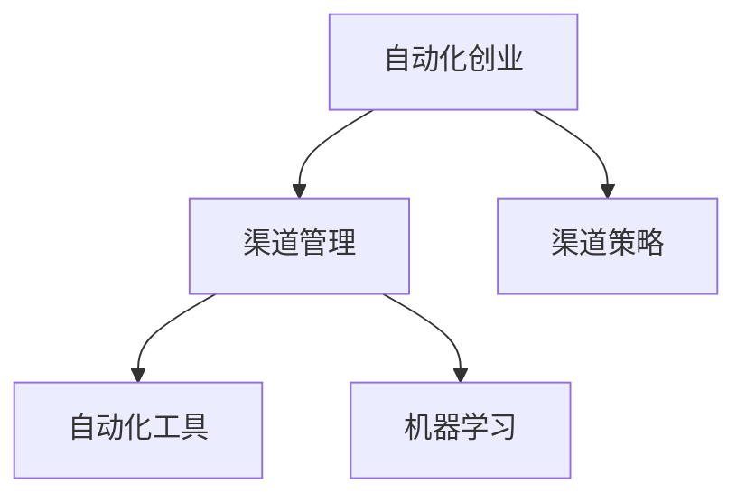

                 

# 自动化创业中的渠道管理策略

## 1. 背景介绍

在当今瞬息万变的商业环境中，自动化创业成为了一种趋势。传统企业通过自动化手段提高生产效率，减少人力成本，而初创企业则通过自动化工具加速产品开发、市场拓展、客户服务等方面，从而更快地实现商业化。渠道管理作为自动化创业的重要环节，直接影响企业的市场渗透率和用户满意度，因此成为研究的重点。

### 1.1 问题由来

在自动化创业的早期，企业依赖传统的线下渠道进行产品推广和销售，这种方式耗时耗力，且效果有限。随着互联网和移动技术的快速发展，线上渠道成为了企业推广的主要方式。企业通过SEO、SEM、内容营销等手段，可以在短时间内触及大量的用户，实现高效的渠道管理。但随着市场竞争的加剧，线上渠道的投放成本不断攀升，如何优化渠道管理策略，成为企业亟待解决的问题。

### 1.2 问题核心关键点

渠道管理策略的核心在于如何最大化覆盖目标用户，同时控制成本，优化用户体验。常用的渠道管理策略包括选择合适的渠道，合理分配广告预算，利用自动化工具提升投放效率等。在数字化时代，渠道管理策略的优化和自动化，直接影响企业的市场表现和用户留存。

### 1.3 问题研究意义

渠道管理策略的研究，对于自动化创业企业的成功至关重要。有效的渠道管理策略能够帮助企业快速打开市场，获取高质量用户，并降低运营成本。同时，渠道管理策略的优化和自动化，也是自动化技术落地应用的重要方向。掌握渠道管理策略，不仅能提升企业的市场竞争力，还能为自动化技术的发展提供新思路和案例。

## 2. 核心概念与联系

### 2.1 核心概念概述

为更好地理解自动化创业中的渠道管理策略，本节将介绍几个关键概念：

- **自动化创业**：利用自动化技术进行产品开发、运营、销售、客户服务等环节，提升效率，降低成本的创业模式。
- **渠道管理**：企业通过不同的渠道（如社交媒体、搜索引擎、邮件营销等）进行产品推广和用户获取的过程。
- **渠道策略**：针对不同渠道进行合理规划和优化，以最大化用户覆盖和最小化成本的策略。
- **自动化工具**：利用软件工具实现渠道投放、数据分析、效果评估等自动化操作的系统。
- **机器学习**：通过数据分析和建模，自动化优化渠道投放和效果评估的技术。

这些核心概念共同构成了自动化创业中渠道管理的基本框架，使得企业能够在数字化时代，通过自动化手段实现高效的渠道管理。

### 2.2 核心概念原理和架构的 Mermaid 流程图



这个流程图展示了自动化创业中的渠道管理流程：

1. **自动化创业**：从产品开发到市场推广，企业需要采用自动化手段。
2. **渠道管理**：企业通过不同的渠道进行产品推广和用户获取。
3. **渠道策略**：根据不同渠道的特点，制定合理的投放策略，最大化覆盖目标用户，同时控制成本。
4. **自动化工具**：利用软件工具实现渠道投放、数据分析、效果评估等自动化操作。
5. **机器学习**：通过数据分析和建模，自动化优化渠道投放和效果评估。

## 3. 核心算法原理 & 具体操作步骤

### 3.1 算法原理概述

基于自动化创业中的渠道管理策略，可以采用以下算法原理：

- **多臂老虎机算法(MAB)**：通过同时测试多个渠道投放策略，优化投放效果，最大化用户覆盖。
- **强化学习**：通过不断调整渠道投放策略，最大化长期回报，优化渠道组合。
- **A/B测试**：对比不同渠道投放策略的效果，选择最优方案。
- **在线学习**：在实际投放过程中实时学习投放效果，不断优化投放策略。

### 3.2 算法步骤详解

**Step 1: 渠道选择与评估**

- 根据企业产品类型和目标用户，选择合适的渠道。如社交媒体、搜索引擎、邮件营销等。
- 对不同渠道进行评估，包括投放成本、用户覆盖、转化率等指标。

**Step 2: 自动化工具配置**

- 配置自动化工具，如Google Ads、Facebook Ads等，实现广告投放和效果监测的自动化。
- 设置广告预算、投放时间、目标用户等参数，开始投放广告。

**Step 3: 机器学习优化**

- 利用机器学习算法，如随机森林、梯度提升树等，对投放效果进行建模和预测。
- 根据预测结果，调整渠道投放策略，如广告关键词、目标人群、投放时间等。

**Step 4: 效果评估与调整**

- 定期评估广告投放效果，包括点击率、转化率、ROI等指标。
- 根据效果评估结果，调整渠道投放策略，优化投放效果。

### 3.3 算法优缺点

基于自动化创业中的渠道管理策略的算法具有以下优点：

1. **高效性**：自动化工具和机器学习算法可以大规模、高效率地进行渠道投放和效果评估。
2. **灵活性**：多臂老虎机算法和强化学习算法可以灵活调整投放策略，适应不同渠道和市场环境。
3. **精确性**：机器学习算法能够通过数据分析，精确预测投放效果，优化投放策略。

同时，这些算法也存在一些局限性：

1. **数据依赖**：机器学习算法的优化效果依赖于高质量的数据，数据噪声和缺失可能导致预测不准确。
2. **成本较高**：自动化工具和机器学习算法的应用需要较高的技术门槛和资源投入。
3. **复杂性**：多臂老虎机算法和强化学习算法的实现复杂度较高，需要深入理解和调试。

### 3.4 算法应用领域

基于自动化创业中的渠道管理策略的算法在多个领域中得到了广泛应用，例如：

- **电子商务**：通过自动化工具进行广告投放，提升商品曝光率和销售量。
- **在线教育**：利用机器学习算法进行用户画像分析，精准投放广告，提高用户转化率。
- **社交媒体**：利用多臂老虎机算法优化社交媒体广告投放策略，最大化用户覆盖和用户互动。
- **金融科技**：通过强化学习算法，优化金融产品的广告投放策略，提升用户获取和转化效果。
- **健康科技**：利用在线学习算法，优化医疗产品的广告投放策略，提高用户健康意识和治疗效果。

## 4. 数学模型和公式 & 详细讲解 & 举例说明

### 4.1 数学模型构建

在自动化创业中的渠道管理策略中，常用的数学模型包括多臂老虎机模型、强化学习模型等。这里以多臂老虎机模型为例，介绍数学模型的构建过程。

多臂老虎机模型（MAB）的数学模型可以表示为：

$$
Q_i(s_t) = r_i(s_t) + \alpha \sum_{t'} \gamma^{t'-t} r_i(s_{t'})
$$

其中：
- $Q_i(s_t)$ 表示在第 $t$ 轮投放中，第 $i$ 个渠道的累积奖励。
- $r_i(s_t)$ 表示在第 $t$ 轮投放中，第 $i$ 个渠道的即时奖励。
- $\alpha$ 为学习率，用于调整模型参数。
- $t'$ 为历史时间步，$\gamma$ 为折扣因子。

### 4.2 公式推导过程

多臂老虎机模型的推导过程如下：

1. 假设在每个时间步 $t$，模型从 $K$ 个渠道中选择一个进行投放，并得到即时奖励 $r_i(s_t)$。
2. 累积奖励 $Q_i(s_t)$ 为即时奖励 $r_i(s_t)$ 和历史奖励的加权和。
3. 模型通过最大化累积奖励，选择最优的渠道进行投放。

### 4.3 案例分析与讲解

假设企业同时使用两个渠道（社交媒体和搜索引擎）进行广告投放。模型通过多臂老虎机算法，在每个时间步选择最优渠道进行投放。初始阶段，模型随机选择投放渠道，记录每个渠道的即时奖励和累积奖励。随着时间的推移，模型通过累积奖励和即时奖励的关系，调整投放策略，选择最优渠道进行投放。

在实际应用中，多臂老虎机模型可以用于多渠道广告投放的优化，通过实时学习投放效果，动态调整投放策略，最大化用户覆盖和转化率。

## 5. 项目实践：代码实例和详细解释说明

### 5.1 开发环境搭建

在进行渠道管理策略的实践前，我们需要准备好开发环境。以下是使用Python进行Scikit-Learn和TensorFlow开发的流程图：

1. 安装Anaconda：从官网下载并安装Anaconda，用于创建独立的Python环境。

2. 创建并激活虚拟环境：
```bash
conda create -n pyproject python=3.8 
conda activate pyproject
```

3. 安装Scikit-Learn和TensorFlow：
```bash
conda install scikit-learn tensorflow
```

4. 安装各类工具包：
```bash
pip install numpy pandas matplotlib
```

完成上述步骤后，即可在`pyproject`环境中开始项目实践。

### 5.2 源代码详细实现

这里以一个简单的多臂老虎机模型为例，展示如何使用Scikit-Learn进行渠道管理策略的实现。

```python
import numpy as np
from sklearn.model_selection import train_test_split
from sklearn.ensemble import RandomForestRegressor

# 模拟两个渠道的投放数据
np.random.seed(42)
K = 2
n_arms = 2
n_steps = 100
rewards = np.zeros((n_steps, K))
rewards[:, 0] = np.cumsum(np.random.normal(0.2, 0.05, n_steps))  # 渠道1
rewards[:, 1] = np.cumsum(np.random.normal(0.5, 0.1, n_steps))  # 渠道2

# 训练模型
model = RandomForestRegressor()
X = np.arange(n_steps)[:, np.newaxis]
y = rewards.sum(axis=1)
X_train, X_test, y_train, y_test = train_test_split(X, y, test_size=0.2)
model.fit(X_train, y_train)

# 预测渠道投放策略
test_steps = 10
y_pred = model.predict(X_test)

# 可视化结果
import matplotlib.pyplot as plt

plt.figure(figsize=(10, 5))
plt.plot(test_steps, y_pred[:, 0], label='Channel 1')
plt.plot(test_steps, y_pred[:, 1], label='Channel 2')
plt.xlabel('Test Steps')
plt.ylabel('Total Reward')
plt.legend()
plt.show()
```

### 5.3 代码解读与分析

让我们再详细解读一下关键代码的实现细节：

- **模拟投放数据**：创建两个渠道的投放数据，分别表示社交媒体和搜索引擎的即时奖励和累积奖励。
- **训练模型**：使用随机森林回归模型对累积奖励进行建模，得到渠道选择策略。
- **预测投放策略**：在测试集上预测渠道选择策略，并可视化结果。

可以看到，Scikit-Learn提供了简单易用的机器学习模型和数据处理工具，使得多臂老虎机算法的实现变得非常直观。开发者可以根据具体需求，选择更复杂的模型进行优化和调整。

当然，工业级的系统实现还需考虑更多因素，如多渠道的并发投放、数据实时更新等。但核心的算法和实现原理基本与此类似。

## 6. 实际应用场景

### 6.1 电子商务

电子商务企业通过自动化工具进行广告投放，提升商品曝光率和销售量。具体而言，可以使用多臂老虎机算法优化广告投放策略，实时学习广告效果，动态调整关键词和目标用户，最大化用户覆盖和转化率。

### 6.2 在线教育

在线教育平台利用机器学习算法进行用户画像分析，精准投放广告，提高用户转化率。具体而言，可以收集用户浏览、点击、报名等行为数据，建立用户画像，利用多臂老虎机算法，选择最有效的广告渠道进行投放。

### 6.3 社交媒体

社交媒体平台利用多臂老虎机算法优化广告投放策略，最大化用户覆盖和用户互动。具体而言，可以收集用户互动数据，如点赞、评论、分享等，利用机器学习算法对广告效果进行建模，选择最优的广告渠道进行投放。

### 6.4 金融科技

金融科技企业通过强化学习算法，优化金融产品的广告投放策略，提升用户获取和转化效果。具体而言，可以收集用户行为数据，如浏览、投资、交易等，利用强化学习算法，最大化长期回报，优化广告投放策略。

### 6.5 健康科技

健康科技公司利用在线学习算法，优化医疗产品的广告投放策略，提高用户健康意识和治疗效果。具体而言，可以收集用户健康数据，如体检结果、用药记录等，利用机器学习算法，优化广告投放策略，提升用户健康意识和治疗效果。

## 7. 工具和资源推荐

### 7.1 学习资源推荐

为了帮助开发者系统掌握渠道管理策略的理论基础和实践技巧，这里推荐一些优质的学习资源：

1. 《机器学习实战》系列书籍：由著名的Kaggle数据科学家撰写，全面介绍了机器学习的基本概念和实践方法，涵盖多臂老虎机算法等经典模型。

2. CS229《机器学习》课程：斯坦福大学开设的机器学习明星课程，详细讲解了多臂老虎机算法和强化学习等核心内容。

3. 《深度学习与强化学习》书籍：由Google的深度学习专家撰写，深入浅出地介绍了深度学习和强化学习的基本原理和实际应用。

4. Kaggle平台：全球最大的数据科学竞赛平台，提供丰富的数据集和模型库，是学习渠道管理策略的绝佳资源。

5. GitHub：全球最大的代码托管平台，提供大量的开源项目和代码示例，帮助开发者快速上手实践。

通过对这些资源的学习实践，相信你一定能够系统掌握渠道管理策略的理论基础和实践技巧。

### 7.2 开发工具推荐

高效的开发离不开优秀的工具支持。以下是几款用于渠道管理策略开发的常用工具：

1. Scikit-Learn：基于Python的机器学习库，提供简单易用的模型和数据处理工具。

2. TensorFlow：由Google主导开发的深度学习框架，支持分布式计算，适用于大规模数据处理。

3. PyTorch：基于Python的深度学习框架，灵活动态的计算图，适用于快速迭代研究。

4. Jupyter Notebook：用于数据科学和机器学习的交互式编程环境，支持多语言编写和实时显示结果。

5. Google Cloud Platform：提供云端计算和存储服务，支持机器学习模型的训练和部署。

合理利用这些工具，可以显著提升渠道管理策略的开发效率，加快创新迭代的步伐。

### 7.3 相关论文推荐

渠道管理策略的发展源于学界的持续研究。以下是几篇奠基性的相关论文，推荐阅读：

1. "The Multi-Armed Bandit Problem" by Richard S. Sutton：介绍多臂老虎机算法的经典论文，是强化学习领域的入门之作。

2. "Online Learning and Online Convex Optimization" by N. Cesa-Bianchi and G. Lugosi：介绍在线学习的基本原理和算法，是机器学习领域的重要教材。

3. "Adaptive Combinatorial Optimization Algorithms" by C. Tjoa and S. Ray：介绍自适应组合优化算法，包括多臂老虎机算法和强化学习算法。

4. "Thompson Sampling in Online Learning" by Robert C. Blum and Avrim Blum：介绍汤普森采样（Thompson Sampling）算法，是多臂老虎机算法的重要变体。

5. "Online Learning and Online Convex Optimization" by N. Cesa-Bianchi and G. Lugosi：介绍在线学习的基本原理和算法，是机器学习领域的重要教材。

这些论文代表了大语言模型微调技术的发展脉络。通过学习这些前沿成果，可以帮助研究者把握学科前进方向，激发更多的创新灵感。

## 8. 总结：未来发展趋势与挑战

### 8.1 总结

本文对基于自动化创业中的渠道管理策略进行了全面系统的介绍。首先阐述了自动化创业的背景和意义，明确了渠道管理在自动化创业中的重要性和核心关键点。其次，从原理到实践，详细讲解了多臂老虎机算法和强化学习算法等核心技术，给出了渠道管理策略的完整代码实现。同时，本文还广泛探讨了渠道管理策略在电子商务、在线教育、社交媒体等多个领域的应用前景，展示了渠道管理策略的巨大潜力。

通过本文的系统梳理，可以看到，渠道管理策略在自动化创业中扮演着重要的角色，能够显著提升企业的市场表现和用户留存。未来，伴随预训练语言模型和微调方法的持续演进，相信NLP技术必将在更广阔的应用领域大放异彩。

### 8.2 未来发展趋势

展望未来，渠道管理策略的发展将呈现以下几个趋势：

1. **智能决策**：利用机器学习算法和强化学习算法，实现自动化的渠道决策，提升决策效率和效果。
2. **实时优化**：通过在线学习算法和实时数据反馈，动态调整渠道投放策略，提高渠道投放效果。
3. **多渠道融合**：将不同渠道的数据进行融合，综合优化广告投放策略，提升广告效果。
4. **个性化推荐**：利用推荐系统算法，实现个性化广告推荐，提升用户转化率。
5. **跨平台协同**：利用跨平台数据协同，实现多渠道数据融合和统一优化，提升整体市场表现。

以上趋势凸显了渠道管理策略的广阔前景。这些方向的探索发展，必将进一步提升渠道管理策略的精确性和实时性，为自动化创业企业的成功提供坚实基础。

### 8.3 面临的挑战

尽管渠道管理策略已经取得了显著成效，但在迈向更加智能化、普适化应用的过程中，它仍面临诸多挑战：

1. **数据质量问题**：渠道管理策略的优化效果依赖于高质量的数据，数据噪声和缺失可能导致预测不准确。
2. **成本控制问题**：自动化工具和机器学习算法的应用需要较高的技术门槛和资源投入，成本较高。
3. **复杂性问题**：多臂老虎机算法和强化学习算法的实现复杂度较高，需要深入理解和调试。
4. **公平性和隐私问题**：在个性化推荐和用户画像分析中，可能存在数据偏见和隐私泄露问题，需要加强数据治理和隐私保护。
5. **技术迭代问题**：渠道管理策略需要不断迭代优化，才能适应不断变化的市场环境。

正视渠道管理策略面临的这些挑战，积极应对并寻求突破，将是大语言模型微调走向成熟的必由之路。相信随着学界和产业界的共同努力，这些挑战终将一一被克服，渠道管理策略必将在构建人机协同的智能时代中扮演越来越重要的角色。

### 8.4 研究展望

面对渠道管理策略所面临的种种挑战，未来的研究需要在以下几个方面寻求新的突破：

1. **多模态数据融合**：将文本、图像、语音等多模态数据进行融合，提升广告投放效果。
2. **自适应学习算法**：开发更加自适应的学习算法，提高渠道管理策略的实时性和动态性。
3. **隐私保护算法**：利用差分隐私等技术，保护用户隐私和数据安全。
4. **跨平台协同**：利用分布式计算技术，实现跨平台数据协同和统一优化。
5. **自动化测试**：开发自动化测试工具，确保渠道管理策略的正确性和稳定性。

这些研究方向的探索，必将引领渠道管理策略技术迈向更高的台阶，为自动化创业企业提供更加智能、高效、安全的渠道管理方案。

## 9. 附录：常见问题与解答

**Q1：如何选择合适的渠道投放策略？**

A: 选择渠道投放策略时，需要考虑目标用户的行为习惯、广告预算、投放周期等因素。一般来说，社交媒体适合曝光度高的广告，而搜索引擎适合精准的用户搜索行为。多臂老虎机算法可以帮助企业动态调整投放策略，最大化广告效果。

**Q2：如何提高渠道投放的实时性？**

A: 提高渠道投放的实时性，需要采用在线学习算法，实时收集和分析投放数据，动态调整投放策略。同时，利用数据管道和缓存技术，减少数据处理和分析的延迟。

**Q3：如何保证渠道投放的公平性？**

A: 保证渠道投放的公平性，需要在广告投放和用户画像分析中，避免数据偏见和隐私泄露。使用差分隐私等技术，保护用户隐私和数据安全。同时，采用随机抽样等方法，确保广告投放的公平性和透明度。

**Q4：如何优化渠道投放的个性化推荐？**

A: 优化渠道投放的个性化推荐，需要利用推荐系统算法，根据用户行为和偏好，生成个性化的广告内容。同时，利用多臂老虎机算法，选择最优的广告渠道进行投放，提升用户转化率。

**Q5：如何应对渠道管理策略的复杂性问题？**

A: 应对渠道管理策略的复杂性问题，需要深入理解算法原理，采用适当的调试手段。同时，利用云计算和分布式计算技术，提高算法的计算效率和扩展性。

这些问题的解答，帮助开发者更好地理解和应用渠道管理策略，实现高效、智能的自动化创业。

