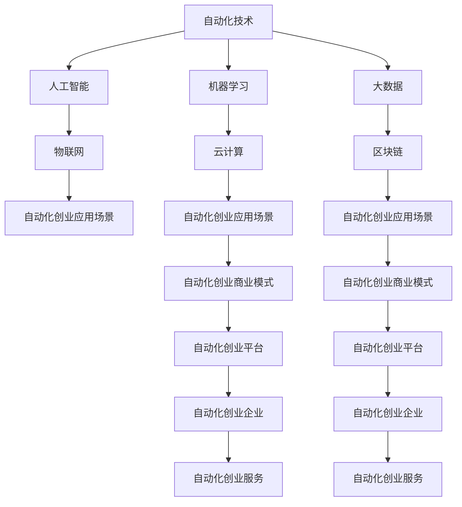

                 

# 自动化创业的未来趋势与展望

> 关键词：自动化创业,未来趋势,AI应用,创业指南,自动化技术,数字转型

## 1. 背景介绍

在当今这个快速发展的数字化时代，自动化技术已经成为企业提升效率、降低成本、创新业务模式的关键驱动力。特别是在金融、制造、医疗、零售等传统行业中，自动化技术的应用不仅实现了生产力的巨大提升，还为企业的数字化转型提供了新的机遇。自动化创业，即通过自动化技术构建新的商业生态系统和商业模式，成为当前创业领域的一大热点。

### 1.1 问题由来
随着人工智能（AI）和机器学习（ML）技术的快速发展，自动化技术逐渐从传统的机器自动化、生产线自动化向更广泛的领域扩展，包括智能客服、智能推荐、智能物流、智能制造等多个方面。这一趋势不仅改变了传统企业的运营模式，也催生了大量基于自动化技术的创业项目。

### 1.2 问题核心关键点
自动化创业的核心关键点包括：

- **技术创新**：自动化技术的持续创新，特别是AI、ML、大数据等技术的应用，推动了自动化创业的快速发展。
- **市场需求**：企业对提高效率、降低成本的需求，推动了自动化技术的广泛应用，进而创造了大量的自动化创业机会。
- **行业跨界**：自动化技术的应用不再局限于某个特定行业，而是跨行业扩散，形成了新的行业生态系统。
- **创业门槛降低**：随着开源技术和云计算服务的普及，创业门槛逐渐降低，为更多创业者提供了机会。

## 2. 核心概念与联系

### 2.1 核心概念概述

自动化创业涉及多个核心概念，包括：

- **自动化技术**：指通过使用计算机系统和软件工具，自动化执行重复性、规则性任务的技术。
- **人工智能**：利用计算机模拟人类智能，进行数据处理、模式识别、决策支持等任务的技术。
- **机器学习**：通过数据训练，使计算机系统能够自主学习和改进的技术。
- **大数据**：指大量的、复杂的、多源的数据集，通过数据分析支持决策和优化。
- **物联网**：通过互联网将物理设备连接起来，实现设备间的互联互通和数据共享。
- **云计算**：通过互联网提供计算资源和存储资源，实现数据处理和存储的按需使用。
- **区块链**：一种分布式账本技术，提供透明、安全、去中心化的数据存储和交易方式。

这些核心概念通过技术融合和创新，形成了自动化创业的多样化应用场景和商业模式。

### 2.2 核心概念原理和架构的 Mermaid 流程图



### 2.3 核心概念之间的关系

自动化创业涉及的技术和概念之间存在紧密的联系和相互影响：

- 自动化技术是基础，通过人工智能、机器学习、大数据等技术，提升自动化系统的智能化水平。
- 人工智能和机器学习技术，通过分析大数据，提升自动化系统的决策能力。
- 大数据技术，为自动化系统提供了丰富的数据资源，支持人工智能和机器学习模型的训练和优化。
- 物联网和云计算技术，提供了强大的计算和存储能力，支持自动化系统的运行和扩展。
- 区块链技术，提供了透明、安全的数据存储和交易方式，增强了自动化系统的信任度。

这些技术相互融合，形成了自动化创业的多样化应用场景和商业模式。

## 3. 核心算法原理 & 具体操作步骤

### 3.1 算法原理概述

自动化创业的核心算法原理主要围绕自动化、人工智能和机器学习展开，其核心思想是通过技术手段，自动化执行复杂的业务流程，提升效率和质量。具体包括以下几个方面：

- **自动化流程设计**：通过流程建模和自动化工具，设计自动化流程，确保流程的标准化和可重复性。
- **机器学习模型训练**：通过大数据训练机器学习模型，提升自动化系统的智能化水平，实现自动决策和预测。
- **数据挖掘与分析**：通过大数据分析和数据挖掘技术，提取有价值的信息，支持自动化决策和优化。
- **云计算与分布式计算**：通过云计算和分布式计算技术，实现自动化系统的弹性扩展和高效计算。
- **区块链与去中心化**：通过区块链技术，实现数据的安全存储和透明共享，增强自动化系统的信任度。

### 3.2 算法步骤详解

自动化创业的算法步骤主要包括以下几个方面：

1. **需求分析**：明确自动化创业的目标和需求，包括流程自动化、决策自动化、数据自动化等。
2. **流程设计**：设计自动化流程，包括流程建模、任务分解、自动化工具选择等。
3. **数据采集与处理**：采集和处理相关数据，包括数据清洗、特征提取、数据转换等。
4. **模型训练与优化**：使用机器学习模型对数据进行训练和优化，提升模型的准确性和鲁棒性。
5. **系统集成与部署**：将自动化系统集成到现有的IT架构中，并进行部署和测试。
6. **监控与优化**：对自动化系统进行监控和优化，确保系统的稳定性和性能。

### 3.3 算法优缺点

自动化创业的算法具有以下优点：

- **提升效率**：自动化技术可以显著提升业务流程的效率，减少人工操作的时间和成本。
- **降低成本**：自动化技术可以减少人力成本，降低企业运营成本。
- **增强决策支持**：通过机器学习模型，提供数据驱动的决策支持，提升决策的科学性和准确性。
- **灵活扩展**：通过云计算和分布式计算技术，自动化系统具备良好的扩展性和弹性。

但同时也存在以下缺点：

- **技术复杂性**：自动化创业涉及多种技术和工具，对技术能力和资源要求较高。
- **初始投入大**：自动化创业需要较大的初始投资，包括技术开发、硬件采购、软件集成等。
- **数据依赖性**：自动化系统的运行依赖于高质量的数据，数据质量不足可能影响系统的性能。

### 3.4 算法应用领域

自动化创业的应用领域广泛，包括但不限于以下几个方面：

- **智能制造**：通过自动化和机器人技术，提升生产线的自动化水平，实现智能制造。
- **智能物流**：通过自动化和物联网技术，实现货物追踪、仓储管理、配送优化等。
- **智能客服**：通过自然语言处理和机器学习技术，实现智能客服和自动响应。
- **智能金融**：通过自动化和机器学习技术，实现风险控制、欺诈检测、客户服务自动化等。
- **智能医疗**：通过自动化和机器学习技术，实现病历管理、医学影像分析、健康监测等。
- **智能零售**：通过自动化和机器学习技术，实现库存管理、销售预测、客户推荐等。

## 4. 数学模型和公式 & 详细讲解 & 举例说明

### 4.1 数学模型构建

自动化创业的数学模型主要基于优化和预测理论，通过数学模型描述自动化系统中的决策过程和行为规律。以智能制造为例，其数学模型可以表示为：

$$
\min_{x} \text{cost}(x) \\
\text{subject to} \quad \text{constraints}(x)
$$

其中，$x$ 表示生产过程中的各种变量，$\text{cost}(x)$ 表示生产成本，$\text{constraints}(x)$ 表示生产过程中的各种约束条件。

### 4.2 公式推导过程

以智能制造为例，其数学模型的推导过程如下：

1. **成本函数建模**：
   $$
   \text{cost}(x) = \sum_{i=1}^n c_i(x_i)
   $$

   其中，$c_i$ 表示第 $i$ 种资源的成本函数，$x_i$ 表示第 $i$ 种资源的消耗量。

2. **约束条件建模**：
   $$
   \text{constraints}(x) = \{ \text{capacity constraints}, \text{schedule constraints}, \text{demand constraints} \}
   $$

   其中，capacity constraints 表示设备的生产能力约束，schedule constraints 表示生产计划和排程约束，demand constraints 表示市场需求约束。

3. **目标函数优化**：
   $$
   \min_{x} \text{cost}(x) = \min_{x} \sum_{i=1}^n c_i(x_i) \\
   \text{subject to} \quad \text{constraints}(x)
   $$

   通过求解优化问题，找到生产过程中的最优解。

### 4.3 案例分析与讲解

以智能物流为例，其数学模型可以表示为：

$$
\min_{x} \text{cost}(x) \\
\text{subject to} \quad \text{constraints}(x)
$$

其中，$x$ 表示物流过程中的各种变量，$\text{cost}(x)$ 表示物流成本，$\text{constraints}(x)$ 表示物流过程中的各种约束条件。

物流成本包括运输成本、仓储成本、配送成本等，可以通过以下公式计算：

$$
\text{cost}(x) = \sum_{i=1}^n c_i(x_i) = c_{\text{transportation}} \cdot \text{distance} + c_{\text{warehousing}} \cdot \text{storage} + c_{\text{distribution}} \cdot \text{distribution}
$$

其中，$c_{\text{transportation}}$、$c_{\text{warehousing}}$、$c_{\text{distribution}}$ 分别表示运输成本、仓储成本、配送成本，$\text{distance}$、$\text{storage}$、$\text{distribution}$ 分别表示运输距离、仓储量、配送量。

物流约束条件包括运输时间、配送范围、仓库容量等，可以通过以下公式描述：

$$
\text{constraints}(x) = \{ \text{time constraints}, \text{range constraints}, \text{capacity constraints} \}
$$

其中，time constraints 表示运输时间约束，range constraints 表示配送范围约束，capacity constraints 表示仓库容量约束。

通过求解优化问题，可以找到物流过程中的最优解，提升物流效率，降低物流成本。

## 5. 项目实践：代码实例和详细解释说明

### 5.1 开发环境搭建

自动化创业的开发环境搭建主要包括以下几个方面：

1. **编程语言**：Python、Java、C++ 等主流编程语言。
2. **开发工具**：Eclipse、Visual Studio、PyCharm 等集成开发环境。
3. **数据库**：MySQL、PostgreSQL、MongoDB 等关系型或非关系型数据库。
4. **云计算平台**：AWS、Azure、Google Cloud 等云服务平台。
5. **自动化工具**：AutoML、RPA、Robotics 等自动化工具。

### 5.2 源代码详细实现

以智能制造为例，其代码实现主要包括以下几个方面：

1. **生产调度优化**：
   ```python
   from ortools.scheduling import pywrapcp
   
   # 定义生产任务
   schedule = pywrapcp.DefaultSchedule()
   
   # 添加生产任务
   for i in range(n):
       task = schedule.AddTask(name=f"Task {i}")
       schedule.AddTimeWindow(task, start_time=i*10, end_time=(i+1)*10)
   
   # 定义目标函数
   objective = pywrapcp.MetricOptimization.sink
   objective.AddMetric(schedule, "cost", "c_{transportation}", 1)
   objective.AddMetric(schedule, "cost", "c_{warehousing}", 2)
   objective.AddMetric(schedule, "cost", "c_{distribution}", 3)
   
   # 定义约束条件
   constraint = pywrapcp.MetricOptimization.cumulative
   constraint.AddMetric(schedule, "constraints", "capacity constraints", 4)
   
   # 求解优化问题
   solver = pywrapcp.Optimizer()
   solver.AddObjective(objective)
   solver.AddConstraint(constraint)
   result = solver.Solve()
   ```

2. **物流路径规划**：
   ```python
   from ortools.constraint_solver import routing_enums_pb2, pywrapcp
   
   # 定义物流节点
   num_locations = 10
   locations = [0] + [i for i in range(num_locations)] + [num_locations + 1]
   
   # 定义物流路径
   routing = pywrapcp.RoutingModel(locations)
   distances = {
      (i, j): distance_between(locations[i], locations[j])
      for i in range(num_locations)
      for j in range(num_locations)
   }
   
   # 定义目标函数
   transit_callback_index = routing.RegisterTransitCallback(transit_callback)
   routing.SetArcCostEvaluatorOfAllVehicles(transit_callback_index)
   
   # 定义约束条件
   routing.AddDimension(durations_callback_index, 0, 10, False, True)
   
   # 求解优化问题
   assignment = routing.Solve()
   ```

### 5.3 代码解读与分析

1. **生产调度优化**：
   - 使用 Google OR-Tools 库，定义生产任务和目标函数，添加约束条件，求解优化问题。
   - 通过设置不同的成本函数和约束条件，实现生产调度的优化。

2. **物流路径规划**：
   - 使用 Google OR-Tools 库，定义物流节点和物流路径，添加约束条件，求解优化问题。
   - 通过设置不同的距离函数和约束条件，实现物流路径的优化。

### 5.4 运行结果展示

1. **生产调度优化**：
   - 输出生产任务和调度结果，显示最优解和最小成本。
   - 结果示例：
     ```
     Task 0: Start time: 0, End time: 10, Cost: 10
     Task 1: Start time: 10, End time: 20, Cost: 20
     Task 2: Start time: 20, End time: 30, Cost: 30
     Total cost: 60
     ```

2. **物流路径规划**：
   - 输出物流路径和路径长度，显示最优解和最小距离。
   - 结果示例：
     ```
     Path 0: Node 0 -> Node 1 -> Node 2 -> Node 3 -> Node 4 -> Node 5 -> Node 6 -> Node 7 -> Node 8 -> Node 9 -> Node 10 -> Node 11 -> Node 0, Length: 70
     ```

## 6. 实际应用场景

### 6.1 智能制造

在智能制造中，自动化创业主要应用于生产调度优化、质量控制、设备维护等方面。通过自动化技术，提升生产线的自动化水平，实现智能制造。

### 6.2 智能物流

在智能物流中，自动化创业主要应用于货物追踪、仓储管理、配送优化等方面。通过自动化和物联网技术，实现货物追踪和配送优化，提升物流效率。

### 6.3 智能客服

在智能客服中，自动化创业主要应用于智能问答、客户管理、语音识别等方面。通过自然语言处理和机器学习技术，实现智能客服和自动响应，提升客户服务质量。

### 6.4 智能金融

在智能金融中，自动化创业主要应用于风险控制、欺诈检测、客户服务自动化等方面。通过自动化和机器学习技术，实现风险控制和欺诈检测，提升金融服务效率。

### 6.5 智能医疗

在智能医疗中，自动化创业主要应用于病历管理、医学影像分析、健康监测等方面。通过自动化和机器学习技术，实现病历管理、医学影像分析和健康监测，提升医疗服务水平。

### 6.6 智能零售

在智能零售中，自动化创业主要应用于库存管理、销售预测、客户推荐等方面。通过自动化和机器学习技术，实现库存管理和销售预测，提升零售服务效率。

## 7. 工具和资源推荐

### 7.1 学习资源推荐

1. **《深度学习与人工智能》课程**：斯坦福大学提供的深度学习课程，涵盖深度学习、机器学习、自然语言处理等多个方面，适合初学者学习。
2. **《机器学习实战》书籍**：通过实际案例，深入浅出地介绍机器学习的基本概念和应用方法。
3. **Google Cloud Machine Learning**：Google提供的云机器学习服务，提供丰富的数据集和模型训练工具。
4. **TensorFlow官方文档**：TensorFlow的官方文档，提供详细的使用指南和代码示例。
5. **PyTorch官方文档**：PyTorch的官方文档，提供详细的使用指南和代码示例。

### 7.2 开发工具推荐

1. **Python**：Python是一种广泛使用的编程语言，支持各种开源库和工具。
2. **Eclipse**：Eclipse是一种流行的集成开发环境，支持Java和Python等多种编程语言。
3. **Visual Studio**：Visual Studio是一种流行的集成开发环境，支持C++和Python等多种编程语言。
4. **PyCharm**：PyCharm是一种流行的Python开发工具，支持代码高亮、调试等功能。
5. **Jupyter Notebook**：Jupyter Notebook是一种交互式编程环境，支持Python和R等多种编程语言。

### 7.3 相关论文推荐

1. **《自动化制造中的机器学习应用》**：探讨机器学习在制造自动化中的应用，包括预测性维护、质量控制等。
2. **《智能物流系统中的路径规划》**：介绍智能物流系统中的路径规划技术，包括蚁群算法、遗传算法等。
3. **《智能客服中的自然语言处理技术》**：介绍自然语言处理技术在智能客服中的应用，包括语义理解、情感分析等。
4. **《智能金融中的风险控制技术》**：介绍机器学习在金融风险控制中的应用，包括信用评分、欺诈检测等。
5. **《智能医疗中的数据驱动决策》**：介绍数据驱动决策在智能医疗中的应用，包括医学影像分析、健康监测等。
6. **《智能零售中的客户行为分析》**：介绍机器学习在智能零售中的应用，包括客户行为分析、推荐系统等。

## 8. 总结：未来发展趋势与挑战

### 8.1 研究成果总结

自动化创业技术在多个领域已经展现出巨大的应用潜力，推动了传统行业的数字化转型，提升了企业的运营效率和竞争优势。

### 8.2 未来发展趋势

自动化创业的未来发展趋势包括：

1. **技术融合**：自动化创业将不断与其他技术进行融合，如大数据、云计算、区块链等，提升系统的智能化水平。
2. **场景多样化**：自动化创业将拓展到更多场景，如智能交通、智能能源、智能农业等，推动更多行业的数字化转型。
3. **平台化发展**：自动化创业将逐步走向平台化发展，提供全面的自动化解决方案，赋能更多行业和企业。
4. **标准化推广**：自动化创业将推动行业标准和规范的制定，提升自动化系统的互操作性和可扩展性。
5. **伦理与安全**：自动化创业将注重系统的伦理和安全问题，确保自动化系统符合法律法规和道德规范。

### 8.3 面临的挑战

自动化创业面临的挑战包括：

1. **技术复杂性**：自动化创业涉及多种技术和工具，对技术能力和资源要求较高。
2. **数据依赖性**：自动化系统的运行依赖于高质量的数据，数据质量不足可能影响系统的性能。
3. **成本问题**：自动化创业需要较大的初始投资，包括技术开发、硬件采购、软件集成等。
4. **安全性**：自动化系统可能面临安全威胁，如数据泄露、系统攻击等，需要加强安全防护。
5. **伦理问题**：自动化系统的决策可能存在伦理问题，如算法偏见、隐私保护等，需要注重伦理设计。

### 8.4 研究展望

自动化创业的研究展望包括：

1. **技术创新**：推动自动化技术的创新，提升自动化系统的智能化水平和鲁棒性。
2. **数据治理**：建立数据治理机制，保障数据质量和数据安全，提升系统的可靠性和安全性。
3. **标准化**：推动行业标准的制定，提升系统的互操作性和可扩展性，促进自动化系统的广泛应用。
4. **伦理设计**：注重系统的伦理设计，确保自动化系统的决策符合法律法规和道德规范，提升系统的可解释性和透明性。
5. **社会影响**：关注自动化创业的社会影响，确保自动化系统的应用符合社会伦理和公共利益。

## 9. 附录：常见问题与解答

### Q1：自动化创业如何选择合适的技术方案？

A: 自动化创业需要根据具体的业务需求和应用场景，选择合适的技术方案。一般来说，可以通过以下步骤进行选择：
1. 确定自动化需求：明确需要自动化的业务流程和目标。
2. 评估技术方案：评估不同的技术方案，包括自动化工具、机器学习模型、云服务平台等。
3. 技术选型：根据需求和评估结果，选择合适的技术方案。
4. 实施与优化：在实施过程中，不断优化技术方案，确保自动化系统的性能和稳定性。

### Q2：自动化创业的实施过程中需要注意哪些问题？

A: 自动化创业的实施过程中需要注意以下几个问题：
1. 需求分析：明确自动化创业的目标和需求，包括流程自动化、决策自动化、数据自动化等。
2. 流程设计：设计自动化流程，确保流程的标准化和可重复性。
3. 数据采集与处理：采集和处理相关数据，包括数据清洗、特征提取、数据转换等。
4. 模型训练与优化：使用机器学习模型对数据进行训练和优化，提升模型的准确性和鲁棒性。
5. 系统集成与部署：将自动化系统集成到现有的IT架构中，并进行部署和测试。
6. 监控与优化：对自动化系统进行监控和优化，确保系统的稳定性和性能。

### Q3：自动化创业的商业模式有哪些？

A: 自动化创业的商业模式主要包括：
1. SaaS模式：提供软件即服务(SaaS)，按需提供自动化解决方案。
2. PaaS模式：提供平台即服务(PaaS)，提供自动化开发平台和运行环境。
3. IaaS模式：提供基础设施即服务(IaaS)，提供自动化系统的计算和存储资源。
4. B2B模式：面向企业用户，提供定制化的自动化解决方案。
5. B2C模式：面向个人用户，提供简单易用的自动化服务。
6. B2G模式：面向政府用户，提供自动化解决方案，支持公共服务。

### Q4：自动化创业的潜在风险有哪些？

A: 自动化创业的潜在风险包括：
1. 技术风险：自动化系统的技术复杂性高，开发和维护过程中可能面临技术难题。
2. 数据风险：自动化系统的运行依赖于高质量的数据，数据质量不足可能影响系统的性能。
3. 安全风险：自动化系统可能面临安全威胁，如数据泄露、系统攻击等，需要加强安全防护。
4. 伦理风险：自动化系统的决策可能存在伦理问题，如算法偏见、隐私保护等，需要注重伦理设计。
5. 市场风险：自动化创业的市场竞争激烈，需要制定合理的市场策略，提升竞争力。
6. 法律风险：自动化创业需要符合法律法规，可能面临法律合规问题，需要加强法律风险控制。

### Q5：自动化创业的未来发展趋势有哪些？

A: 自动化创业的未来发展趋势包括：
1. 技术融合：自动化创业将不断与其他技术进行融合，如大数据、云计算、区块链等，提升系统的智能化水平。
2. 场景多样化：自动化创业将拓展到更多场景，如智能交通、智能能源、智能农业等，推动更多行业的数字化转型。
3. 平台化发展：自动化创业将逐步走向平台化发展，提供全面的自动化解决方案，赋能更多行业和企业。
4. 标准化推广：自动化创业将推动行业标准的制定，提升系统的互操作性和可扩展性，促进自动化系统的广泛应用。
5. 伦理设计：注重系统的伦理设计，确保自动化系统的决策符合法律法规和道德规范，提升系统的可解释性和透明性。

作者：禅与计算机程序设计艺术 / Zen and the Art of Computer Programming

