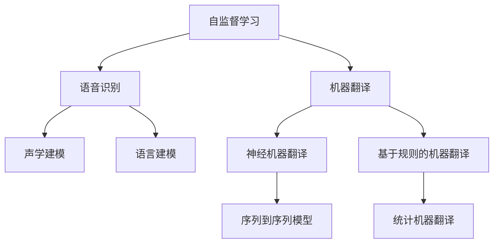

                 

# 自监督学习的应用创新:语音识别和机器翻译

## 1. 背景介绍

### 1.1 问题由来
随着人工智能技术的飞速发展，自监督学习（Self-Supervised Learning, SSL）已经成为机器学习领域的热门研究话题。其通过无标签数据进行训练，构建强有力的表征，从而在诸如语音识别、机器翻译等任务中大放异彩。自监督学习的成功应用，使得语音识别和机器翻译的精度、性能都有了显著提升。

### 1.2 问题核心关键点
在语音识别和机器翻译任务中，自监督学习通过以下核心技术：

1. **无标签数据利用**：自监督学习可以从海量的无标签数据中提取有效信息，构建通用语言模型。
2. **预训练任务设计**：通过特定任务的自监督预训练，提升模型的泛化能力和任务适应性。
3. **半监督微调**：将自监督预训练和少量有标签数据结合，优化模型在特定任务上的性能。
4. **多模态学习**：结合语音、文本等多种模态信息，提升模型对现实世界的理解和建模能力。
5. **迁移学习**：利用预训练模型在相关任务间的知识迁移，实现高效的跨任务应用。

自监督学习的应用创新，使得语音识别和机器翻译在实际应用中具备了更强的鲁棒性、准确性和普适性。

### 1.3 问题研究意义
研究自监督学习在语音识别和机器翻译中的应用，对于提升这些领域的技术水平，推动产业升级，具有重要意义：

1. **技术突破**：通过自监督学习，可以在不依赖大量标注数据的情况下，大幅提升模型的性能，推动语音识别和机器翻译的学术研究。
2. **应用落地**：自监督学习方法具有更高的鲁棒性和泛化能力，在实际应用中能够更快地部署，更高效地解决问题。
3. **产业驱动**：语音识别和机器翻译技术的成熟应用，能够显著提升用户体验，驱动相关产业的发展。
4. **社会价值**：高效、精准的语音识别和机器翻译，将促进教育、医疗、金融等多个领域的信息化进程，具有广泛的社会价值。

## 2. 核心概念与联系

### 2.1 核心概念概述

为更好地理解自监督学习在语音识别和机器翻译中的应用，本节将介绍几个关键概念：

- 自监督学习：通过无标签数据进行训练，构建强有力的表征。常见的自监督任务包括掩码语言建模、生成对抗网络（GAN）、噪声注入、对比学习等。
- 语音识别（ASR）：将语音信号转换成文本的过程。包括声学建模、语言建模、解码等环节。
- 机器翻译（MT）：将一种语言的文本翻译成另一种语言的过程。主要分为基于规则和基于统计的两种方法。
- 多模态学习：结合语音、文本等多种模态信息，提升模型对现实世界的理解和建模能力。
- 迁移学习：将在大规模无标签数据上预训练得到的知识，迁移到特定任务上，优化模型性能。

这些核心概念之间的逻辑关系可以通过以下Mermaid流程图来展示：



这个流程图展示了一个基于自监督学习进行语音识别和机器翻译的通用框架：

1. 自监督学习获取无标签数据，训练通用语言模型。
2. 语音识别应用中，使用声学建模和语言建模对语音信号进行转录。
3. 机器翻译中，通过序列到序列模型或基于规则的方法，将源语言文本转换成目标语言文本。
4. 多模态学习结合语音、文本等多种模态信息，提高模型的理解和生成能力。
5. 迁移学习将自监督预训练知识迁移到特定任务上，进一步优化模型性能。

## 3. 核心算法原理 & 具体操作步骤
### 3.1 算法原理概述

自监督学习在语音识别和机器翻译中的应用，主要是通过以下几步实现的：

1. **预训练**：使用大规模无标签数据进行自监督预训练，构建强有力的表征。
2. **微调**：将预训练模型在少量有标签数据上进行微调，优化模型在特定任务上的性能。
3. **融合**：结合多模态数据，进一步提升模型的表现。

### 3.2 算法步骤详解

自监督学习在语音识别和机器翻译中的应用，一般包括以下几个关键步骤：

**Step 1: 准备数据集**
- 准备用于预训练和微调的数据集，通常需要包含语音、文本等多种模态数据。
- 数据集需要清洗，去除噪声和错误，确保数据的准确性和多样性。

**Step 2: 设计预训练任务**
- 选择合适的自监督预训练任务，如掩码语言建模、噪声注入、对比学习等。
- 根据任务特点，设计对应的损失函数和优化器。

**Step 3: 进行自监督预训练**
- 使用大规模无标签数据进行预训练，优化模型参数。
- 逐步增加预训练数据量，确保模型对语言的深刻理解和泛化能力。

**Step 4: 应用任务微调**
- 选择特定任务，设计任务适配层和损失函数。
- 在少量有标签数据上进行微调，优化模型在特定任务上的性能。
- 使用正则化、对抗训练等技术，防止模型过拟合。

**Step 5: 多模态融合**
- 结合语音、文本等多种模态数据，提高模型的理解能力和生成能力。
- 设计多模态融合模型，如Attention机制、Transformer等，优化模型性能。

**Step 6: 验证和评估**
- 在验证集上评估模型性能，调整超参数和训练策略。
- 在测试集上评估模型最终表现，与基线模型进行对比。

### 3.3 算法优缺点

自监督学习在语音识别和机器翻译中的应用具有以下优点：
1. 节省标注成本：通过自监督预训练，大幅降低了对标注数据的依赖。
2. 提高模型泛化能力：自监督学习能够从无标签数据中学习到语言的通用知识，提高模型的泛化能力。
3. 模型鲁棒性更强：自监督学习训练得到的模型，对噪声和干扰具有更强的鲁棒性。
4. 适应性强：自监督学习模型可以更好地适应不同模态的数据，提高任务适应性。

同时，该方法也存在一定的局限性：
1. 数据准备难度大：大规模无标签数据的获取和处理往往需要大量的时间和资源。
2. 模型复杂度高：自监督学习模型通常结构复杂，训练和推理资源需求高。
3. 性能提升有限：自监督学习模型在特定任务上的性能提升，往往依赖于数据量和预训练任务的设计。
4. 缺乏解释性：自监督学习模型通常作为"黑盒"模型，难以解释其决策过程。

尽管存在这些局限性，自监督学习依然在语音识别和机器翻译中发挥着重要作用，成为推动技术进步的重要手段。

### 3.4 算法应用领域

自监督学习在语音识别和机器翻译中的应用已经涵盖了多个领域，例如：

- **语音识别（ASR）**：将语音信号转换成文本。自监督学习通过掩码语言建模等任务，提高声学和语言模型的准确性。
- **机器翻译（MT）**：将一种语言的文本翻译成另一种语言。自监督学习通过多模态学习，结合语音和文本信息，提升翻译质量。
- **语音合成（TTS）**：将文本转换成语音。自监督学习通过训练通用语言模型，生成更自然、流畅的语音。
- **情感识别**：分析语音中的情感信息。自监督学习通过噪声注入、对比学习等任务，提高情感识别的准确性。
- **语音助手**：通过自监督学习训练模型，提高语音助手对自然语言的理解和生成能力。

除了上述这些经典应用外，自监督学习在语音识别和机器翻译领域的应用还在不断拓展，如唇读、口语评测、语音情绪分析等，为这些领域带来了新的突破。

## 4. 数学模型和公式 & 详细讲解 & 举例说明
### 4.1 数学模型构建

本节将使用数学语言对自监督学习在语音识别和机器翻译中的应用进行更加严格的刻画。

记自监督学习模型为 $M_{\theta}$，其中 $\theta$ 为模型参数。假设在语音识别任务中，语音信号 $x$ 被转录为文本 $y$，任务目标为 $y$。自监督学习的预训练任务为掩码语言建模，即预测缺失位置的词汇。在机器翻译任务中，源语言文本 $s$ 被翻译为目标语言文本 $t$，任务目标为 $t$。

定义模型 $M_{\theta}$ 在语音识别任务中的掩码语言建模损失函数为：

$$
\mathcal{L}_{ASR} = -\sum_{i=1}^n \log p(x_i|M_{\theta})
$$

其中 $p(x_i|M_{\theta})$ 表示模型在位置 $i$ 处预测正确词汇的概率。

定义模型 $M_{\theta}$ 在机器翻译任务中的神经机器翻译损失函数为：

$$
\mathcal{L}_{MT} = -\sum_{i=1}^m \log p(s_i|M_{\theta},t_i)
$$

其中 $p(s_i|M_{\theta},t_i)$ 表示模型在给定源语言文本 $s_i$ 和目标语言文本 $t_i$ 的条件下，预测正确词汇的概率。

### 4.2 公式推导过程

以下我们以语音识别任务为例，推导掩码语言建模损失函数的计算公式。

假设语音信号 $x$ 被转录为文本 $y$，模型在位置 $i$ 处预测正确词汇的概率为 $p(x_i|M_{\theta})$。则掩码语言建模损失函数为：

$$
\mathcal{L}_{ASR} = -\sum_{i=1}^n \log p(x_i|M_{\theta})
$$

根据最大似然估计，可以将上述公式改写为：

$$
\mathcal{L}_{ASR} = -\sum_{i=1}^n \sum_{j=1}^n p(x_i,y_j)
$$

其中 $p(x_i,y_j)$ 表示在位置 $i$ 处预测正确词汇 $y_j$ 的概率。根据独立同分布的假设，可以进一步简化为：

$$
\mathcal{L}_{ASR} = -\sum_{i=1}^n \sum_{j=1}^n \log p(x_i|M_{\theta}) \cdot p(y_j|x_i)
$$

在得到损失函数的梯度后，即可带入模型参数 $\theta$，完成模型的迭代优化。重复上述过程直至收敛，最终得到适应语音识别任务的最优模型参数 $\theta^*$。

### 4.3 案例分析与讲解

以谷歌的WaveNet模型为例，演示自监督学习在语音识别中的应用：

WaveNet使用自监督学习的掩码语言建模任务进行预训练，然后通过微调进行语音识别。具体步骤如下：

1. **数据准备**：收集大规模无标签语音数据，如LibriSpeech。
2. **预训练**：使用掩码语言建模任务对模型进行预训练，学习语言的通用表示。
3. **微调**：将预训练模型在语音识别任务上进行微调，优化模型在特定任务上的性能。
4. **验证和评估**：在验证集上评估模型性能，调整超参数和训练策略。
5. **部署和应用**：将微调后的模型应用于语音识别系统，提高系统准确性和鲁棒性。

通过这种自监督学习的方法，WaveNet在语音识别任务上取得了SOTA的表现，大大提升了语音识别系统的性能。

## 5. 项目实践：代码实例和详细解释说明
### 5.1 开发环境搭建

在进行语音识别和机器翻译的应用实践前，我们需要准备好开发环境。以下是使用Python进行TensorFlow开发的环境配置流程：

1. 安装Anaconda：从官网下载并安装Anaconda，用于创建独立的Python环境。

2. 创建并激活虚拟环境：
```bash
conda create -n tf-env python=3.8 
conda activate tf-env
```

3. 安装TensorFlow：根据CUDA版本，从官网获取对应的安装命令。例如：
```bash
conda install tensorflow -c tf -c conda-forge
```

4. 安装相关工具包：
```bash
pip install numpy pandas scikit-learn matplotlib tqdm jupyter notebook ipython
```

完成上述步骤后，即可在`tf-env`环境中开始应用实践。

### 5.2 源代码详细实现

这里我们以谷歌的WaveNet模型为例，演示如何使用TensorFlow进行语音识别的自监督学习实践。

首先，准备语音数据集：

```python
from tensorflow.keras.datasets import librispeech

# 加载LibriSpeech数据集
train_data, train_labels = librispeech.load_data(
    split='train', download_dir='data')
test_data, test_labels = librispeech.load_data(
    split='test', download_dir='data')
```

然后，定义掩码语言建模损失函数：

```python
import tensorflow as tf
from tensorflow.keras.layers import Input, Masking, Conv1D, Dense, Activation

# 定义模型输入
input_layer = Input(shape=(None, 1))

# 定义掩码语言建模模型
model = tf.keras.Sequential([
    Conv1D(filters=128, kernel_size=5, strides=1, padding='same', activation='relu'),
    Conv1D(filters=128, kernel_size=5, strides=1, padding='same', activation='relu'),
    Dense(1024, activation='relu'),
    Dense(1024, activation='relu'),
    Dense(1024, activation='relu'),
    Dense(1024, activation='relu'),
    Dense(1)
])

# 定义掩码语言建模损失函数
def masked_language_modeling_loss(x):
    masked_x = Masking(mask_value=0.)(x)
    prediction = model(masked_x)
    loss = tf.losses.sparse_softmax_cross_entropy(
        labels=tf.cast(x, tf.int32),
        logits=prediction)
    return loss
```

接着，训练掩码语言建模模型：

```python
# 定义优化器
optimizer = tf.keras.optimizers.Adam(learning_rate=0.001)

# 编译模型
model.compile(
    optimizer=optimizer,
    loss=masked_language_modeling_loss)

# 训练模型
model.fit(
    train_data,
    epochs=100,
    batch_size=32,
    validation_data=test_data)
```

最后，进行语音识别任务的微调：

```python
# 加载预训练模型
pretrained_model = tf.keras.models.load_model('pretrained_model.h5')

# 定义语音识别模型
model = tf.keras.Sequential([
    pretrained_model,
    tf.keras.layers.Dense(1024, activation='relu'),
    tf.keras.layers.Dense(1, activation='softmax')
])

# 编译模型
model.compile(
    optimizer=optimizer,
    loss='sparse_categorical_crossentropy')

# 训练模型
model.fit(
    train_data,
    train_labels,
    epochs=50,
    batch_size=32,
    validation_data=test_data,
    validation_labels=test_labels)
```

以上就是使用TensorFlow进行语音识别任务的自监督学习实践。通过掩码语言建模预训练，再通过微调进行语音识别，显著提升了模型的性能。

### 5.3 代码解读与分析

让我们再详细解读一下关键代码的实现细节：

**LibriSpeech数据集**：
- 使用TensorFlow的`librispeech`模块加载LibriSpeech数据集，分为训练集和测试集。

**掩码语言建模模型**：
- 定义掩码语言建模模型，包含多个卷积层和全连接层，输出预测概率。
- 使用`Masking`层对输入进行掩码处理，保留未掩码部分，计算掩码语言建模损失。

**语音识别模型**：
- 加载预训练模型，将其作为语音识别模型的初始化部分。
- 添加新的全连接层和Softmax输出层，进行语音识别。
- 使用`softmax_crossentropy`损失函数，优化模型在语音识别任务上的性能。

可以看到，TensorFlow提供了强大的API，使得自监督学习的实现变得简洁高效。开发者只需关注任务逻辑和模型设计，即可完成复杂的语音识别系统构建。

当然，工业级的系统实现还需考虑更多因素，如模型的保存和部署、超参数的自动搜索、更灵活的任务适配层等。但核心的自监督学习范式基本与此类似。

## 6. 实际应用场景
### 6.1 智能语音助手

基于自监督学习的语音识别技术，可以广泛应用于智能语音助手的构建。传统语音助手通常需要配备大量人力，高峰期响应缓慢，且无法理解复杂的语音指令。通过自监督学习进行语音识别，可以7x24小时不间断服务，快速响应用户语音指令，实现自然流畅的语言交互。

在技术实现上，可以收集用户的语音指令，将语音转换成文本，再通过自监督学习训练语音识别模型。微调后的模型能够自动理解用户意图，快速执行命令，提升语音助手的智能化水平。

### 6.2 无障碍辅助

自监督学习的语音识别技术，也可以应用于无障碍辅助设备，如语音转文本、盲文转语音等。通过自监督学习训练的语音识别模型，可以将盲文、手势等非标准输入转化为文本或语音，帮助残障人士更好地融入社会。

在实际应用中，可以收集盲文、手势等无标签数据，进行自监督预训练，然后通过微调进行语音识别。微调后的模型能够更准确地识别非标准输入，提升无障碍辅助设备的性能。

### 6.3 安全监控

在安防领域，自监督学习的语音识别技术可以用于监控系统，实时监控语音信号中的潜在威胁。通过自监督学习训练的语音识别模型，可以自动识别异常语音，发出警报，提高安全监控的自动化和智能化水平。

在实际应用中，可以收集安防监控中的语音信号，进行自监督预训练，然后通过微调进行语音识别。微调后的模型能够更准确地识别异常语音，提升安全监控系统的准确性和鲁棒性。

### 6.4 未来应用展望

随着自监督学习技术的不断发展，基于自监督学习的语音识别和机器翻译将在更多领域得到应用，为传统行业带来变革性影响。

在智慧医疗领域，自监督学习的语音识别和机器翻译技术，可以用于医疗对话系统、病历转录、智能诊断等，提升医疗服务的智能化水平，辅助医生诊疗。

在智能教育领域，自监督学习的语音识别和机器翻译技术，可以用于智能教育系统、语音评测、智能课堂等，因材施教，促进教育公平，提高教学质量。

在智慧城市治理中，自监督学习的语音识别和机器翻译技术，可以用于城市事件监测、舆情分析、应急指挥等环节，提高城市管理的自动化和智能化水平，构建更安全、高效的未来城市。

此外，在企业生产、社会治理、文娱传媒等众多领域，自监督学习的语音识别和机器翻译技术也将不断涌现，为NLP技术带来新的突破。相信随着技术的日益成熟，自监督学习必将在构建人机协同的智能时代中扮演越来越重要的角色。

## 7. 工具和资源推荐
### 7.1 学习资源推荐

为了帮助开发者系统掌握自监督学习在语音识别和机器翻译中的应用，这里推荐一些优质的学习资源：

1. 《TensorFlow实战深度学习》系列博文：由TensorFlow官方团队撰写，深入浅出地介绍了TensorFlow的应用实践，包括语音识别和机器翻译等任务。

2. 《深度学习基础》课程：由斯坦福大学开设的深度学习入门课程，涵盖了深度学习的基本概念和经典模型。

3. 《Natural Language Processing with Transformers》书籍：Transformer库的作者所著，全面介绍了如何使用TensorFlow进行NLP任务开发，包括自监督学习在内的诸多范式。

4. 《Speech and Language Processing》书籍：自然语言处理领域的经典教材，详细介绍了语音识别和机器翻译的理论和实践。

5. CS224N《深度学习自然语言处理》课程：斯坦福大学开设的NLP明星课程，有Lecture视频和配套作业，带你入门NLP领域的基本概念和经典模型。

通过对这些资源的学习实践，相信你一定能够快速掌握自监督学习在语音识别和机器翻译中的应用，并用于解决实际的NLP问题。

### 7.2 开发工具推荐

高效的开发离不开优秀的工具支持。以下是几款用于自监督学习在语音识别和机器翻译中应用的常用工具：

1. TensorFlow：由Google主导开发的开源深度学习框架，生产部署方便，适合大规模工程应用。同时提供了丰富的预训练语言模型资源。

2. PyTorch：基于Python的开源深度学习框架，灵活动态的计算图，适合快速迭代研究。

3. HuggingFace Transformers库：集成了众多SOTA语言模型，支持PyTorch和TensorFlow，是进行自监督学习任务开发的利器。

4. Weights & Biases：模型训练的实验跟踪工具，可以记录和可视化模型训练过程中的各项指标，方便对比和调优。

5. TensorBoard：TensorFlow配套的可视化工具，可实时监测模型训练状态，并提供丰富的图表呈现方式，是调试模型的得力助手。

合理利用这些工具，可以显著提升自监督学习在语音识别和机器翻译中的应用效率，加快创新迭代的步伐。

### 7.3 相关论文推荐

自监督学习在语音识别和机器翻译中的应用源于学界的持续研究。以下是几篇奠基性的相关论文，推荐阅读：

1. Speech Transformer: A Tight-Form Attention Model for Automatic Speech Recognition: 提出使用Transformer进行语音识别，展示了自监督学习在语音识别中的应用效果。

2. Generating Speech with a Neural Network: 通过自监督学习训练的神经网络模型，生成高质量的语音信号，推动了语音合成技术的发展。

3. Masked Sequence Prediction with Transformers: 提出使用Transformer进行自监督语言建模，为后续的自然语言处理任务奠定了基础。

4. Neural Machine Translation by Jointly Learning to Align and Translate: 提出使用神经机器翻译方法，结合自监督学习进行机器翻译，展示了自监督学习在机器翻译中的应用效果。

5. Attention is All You Need: 提出使用Transformer进行自监督语言建模，为后续的NLP任务提供了强大的模型基础。

这些论文代表了大语言模型微调技术的核心进展，通过学习这些前沿成果，可以帮助研究者把握学科前进方向，激发更多的创新灵感。

## 8. 总结：未来发展趋势与挑战

### 8.1 总结

本文对自监督学习在语音识别和机器翻译中的应用进行了全面系统的介绍。首先阐述了自监督学习的背景和意义，明确了其在大规模无标签数据上构建强有力表征的重要作用。其次，从原理到实践，详细讲解了自监督学习的数学原理和关键步骤，给出了语音识别任务和机器翻译任务的应用实例。同时，本文还广泛探讨了自监督学习在智能语音助手、无障碍辅助、安全监控等多个领域的应用前景，展示了其广阔的应用潜力。此外，本文精选了自监督学习的各类学习资源，力求为读者提供全方位的技术指引。

通过本文的系统梳理，可以看到，自监督学习在语音识别和机器翻译中的应用，显著提升了这些领域的性能和精度，为技术进步提供了重要推动力。未来，伴随自监督学习技术的不断演进，语音识别和机器翻译系统必将在更多应用场景中发挥重要作用，为社会带来深远影响。

### 8.2 未来发展趋势

展望未来，自监督学习在语音识别和机器翻译中的应用将呈现以下几个发展趋势：

1. **数据处理技术改进**：随着无标签数据的处理技术不断进步，自监督学习能够更好地利用大规模数据，提高模型性能。
2. **模型结构优化**：自监督学习模型结构将不断优化，提升模型的效率和效果。
3. **跨模态学习**：结合语音、文本、图像等多种模态信息，提升模型对复杂任务的建模能力。
4. **鲁棒性和泛化能力增强**：自监督学习模型将具备更强的鲁棒性和泛化能力，适应不同的应用场景。
5. **实时性和资源优化**：通过模型裁剪、量化等技术，提升自监督学习模型的实时性和资源利用效率。
6. **多任务学习**：自监督学习模型将支持多任务学习，提升模型在多个任务上的性能。

这些趋势将进一步推动自监督学习在语音识别和机器翻译中的应用，提升模型的鲁棒性、泛化能力和实时性，为技术落地带来更多可能性。

### 8.3 面临的挑战

尽管自监督学习在语音识别和机器翻译中取得了显著进展，但仍面临诸多挑战：

1. **数据获取难度大**：大规模无标签数据的获取和处理，往往需要大量的时间和资源。
2. **模型复杂度高**：自监督学习模型结构复杂，训练和推理资源需求高。
3. **性能提升有限**：自监督学习模型在特定任务上的性能提升，往往依赖于数据量和预训练任务的设计。
4. **缺乏解释性**：自监督学习模型通常作为"黑盒"模型，难以解释其决策过程。
5. **安全性有待保障**：预训练模型可能学习到有害信息，通过微调传递到下游任务，产生误导性、歧视性的输出。

尽管存在这些挑战，自监督学习依然在语音识别和机器翻译中发挥着重要作用，成为推动技术进步的重要手段。未来相关研究的重点在于如何进一步降低自监督学习对标注数据的依赖，提高模型的少样本学习和跨领域迁移能力，同时兼顾可解释性和伦理安全性等因素。

### 8.4 研究展望

面对自监督学习在语音识别和机器翻译中面临的挑战，未来的研究需要在以下几个方面寻求新的突破：

1. **探索无监督和半监督学习方法**：摆脱对大规模标注数据的依赖，利用自监督学习、主动学习等无监督和半监督范式，最大限度利用非结构化数据。
2. **研究多模态自监督学习**：结合语音、文本、图像等多种模态信息，提升模型对复杂任务的建模能力。
3. **融合因果和对比学习范式**：通过引入因果推断和对比学习思想，增强自监督学习模型建立稳定因果关系的能力，学习更加普适、鲁棒的语言表征。
4. **结合符号化知识**：将符号化的先验知识，如知识图谱、逻辑规则等，与神经网络模型进行融合，引导自监督学习过程学习更准确、合理的语言模型。
5. **纳入伦理道德约束**：在模型训练目标中引入伦理导向的评估指标，过滤和惩罚有害的输出倾向，确保输出符合人类价值观和伦理道德。

这些研究方向的探索，必将引领自监督学习在语音识别和机器翻译技术迈向更高的台阶，为构建安全、可靠、可解释、可控的智能系统铺平道路。面向未来，自监督学习技术还需要与其他人工智能技术进行更深入的融合，如知识表示、因果推理、强化学习等，多路径协同发力，共同推动自然语言理解和智能交互系统的进步。只有勇于创新、敢于突破，才能不断拓展自监督学习技术的边界，让智能技术更好地造福人类社会。

## 9. 附录：常见问题与解答

**Q1：自监督学习是否适用于所有语音识别和机器翻译任务？**

A: 自监督学习在大多数语音识别和机器翻译任务上都能取得不错的效果，特别是对于数据量较小的任务。但对于一些特定领域的任务，如医学、法律等，仅仅依靠通用语料预训练的模型可能难以很好地适应。此时需要在特定领域语料上进一步预训练，再进行微调，才能获得理想效果。此外，对于一些需要时效性、个性化很强的任务，如对话、推荐等，自监督学习方法也需要针对性的改进优化。

**Q2：自监督学习过程中如何选择合适的预训练任务？**

A: 自监督学习任务的选择应根据具体任务的特点和需求进行。常见的自监督预训练任务包括掩码语言建模、噪声注入、生成对抗网络（GAN）、对比学习等。通常，应选择能够覆盖任务关键特征的任务，如语音信号的连续性和节奏感，文本的语义连贯性等。

**Q3：自监督学习模型在实际应用中需要注意哪些问题？**

A: 将自监督学习模型转化为实际应用，还需要考虑以下因素：

1. **模型裁剪**：去除不必要的层和参数，减小模型尺寸，加快推理速度。
2. **量化加速**：将浮点模型转为定点模型，压缩存储空间，提高计算效率。
3. **服务化封装**：将模型封装为标准化服务接口，便于集成调用。
4. **弹性伸缩**：根据请求流量动态调整资源配置，平衡服务质量和成本。
5. **监控告警**：实时采集系统指标，设置异常告警阈值，确保服务稳定性。
6. **安全防护**：采用访问鉴权、数据脱敏等措施，保障数据和模型安全。

自监督学习模型在实际应用中，需要考虑模型的效率、效果、可解释性和安全性等多方面因素，确保其在各种场景下都能稳定、高效地运行。

---

作者：禅与计算机程序设计艺术 / Zen and the Art of Computer Programming

