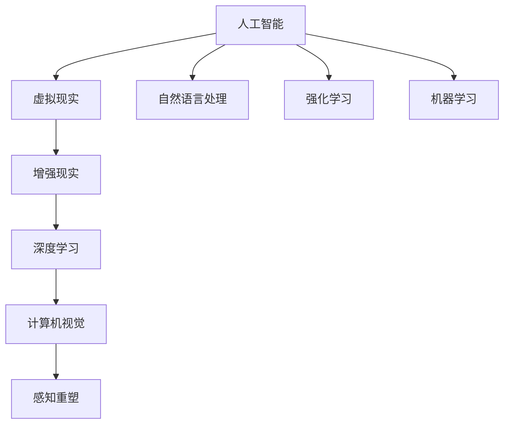

                 

# 虚拟与现实的边界：AI如何重塑我们的感知

> 关键词：AI，虚拟现实，增强现实，深度学习，计算机视觉，感知重塑，人工智能伦理

## 1. 背景介绍

### 1.1 问题由来
随着人工智能技术的迅猛发展，AI正逐渐渗透到人类生活的方方面面，改变着我们的感知方式和生活体验。从虚拟现实(VR)、增强现实(AR)到自动驾驶、智能家居，AI在现实世界的应用已经初见成效。然而，这些技术的普及也带来了新的挑战和争议。如何在享受技术带来的便利的同时，保持人类对真实世界的感知能力，成为亟需探讨的重要问题。

### 1.2 问题核心关键点
AI与虚拟现实、增强现实技术的结合，不仅提升了人类感知世界的能力，也带来了新的认知体验。这种结合使我们能够以全新的方式探索世界，但也引发了对感知真实性的质疑。如何在这两者之间找到平衡，同时保护用户的认知安全和隐私，是当前AI应用的重要课题。

## 2. 核心概念与联系

### 2.1 核心概念概述

为更好地理解AI如何重塑我们的感知，本节将介绍几个关键概念：

- 人工智能(AI)：通过算法、计算和数据驱动的智能系统，能够执行类似于人类的任务。AI技术包括机器学习、深度学习、计算机视觉、自然语言处理等。
- 虚拟现实(VR)：通过计算机生成的模拟环境，使用户能够沉浸其中，仿佛置身于真实世界。VR技术通常结合传感器、交互设备等硬件，增强用户体验。
- 增强现实(AR)：将虚拟信息叠加到真实世界之上，提升用户在真实世界中的感知体验。AR常用于教育、医疗、导航等领域，提供额外的信息支持。
- 深度学习(Deep Learning)：基于人工神经网络的机器学习方法，能够从数据中学习复杂特征，实现图像识别、语音识别、自然语言处理等任务。
- 计算机视觉(Computer Vision)：使计算机能够理解并解释视觉信息，如识别图像中的物体、场景等。
- 感知重塑(Perceptual Reshaping)：通过AI技术改变人类对世界的感知方式，提升感知能力，同时带来新的认知体验。

这些核心概念之间的逻辑关系可以通过以下Mermaid流程图来展示：



这个流程图展示了一系列与AI重塑感知相关的关键概念及其之间的关系：

1. 人工智能通过算法和计算，使计算机具备智能处理任务的能力。
2. 虚拟现实和增强现实通过计算机生成视觉信息，改变用户对世界的感知。
3. 深度学习和大规模数据训练，使计算机能够学习并解释复杂的视觉和语言信息。
4. 计算机视觉使计算机能够理解并解释视觉信息，进一步提升感知能力。
5. 感知重塑技术通过AI和计算机视觉等技术，改变人类感知方式，提升认知体验。

这些概念共同构成了AI与虚拟/增强现实技术相结合的感知重塑框架，为人类提供了新的认知体验和感知方式。

## 3. 核心算法原理 & 具体操作步骤
### 3.1 算法原理概述

AI与虚拟/增强现实技术的结合，重塑了人类的感知方式。核心原理是通过深度学习算法，训练计算机模型，使其能够理解并解释视觉和语言信息，并通过虚拟/增强现实技术，将这些信息以沉浸式的方式呈现给用户。

形式化地，假设有一个虚拟现实系统 $V$，其中 $I$ 为输入（即用户的观察结果），$O$ 为输出（即虚拟环境中的视觉和听觉信息），$P$ 为感知重塑模型，则系统可以表示为：

$$
O = P(I)
$$

其中 $P$ 为感知重塑模型，能够将用户的观察结果 $I$ 转换为虚拟环境中的视觉和听觉信息 $O$。通过不断迭代训练 $P$，可以使其学习到最优的感知重塑策略。

### 3.2 算法步骤详解

基于深度学习的感知重塑系统一般包括以下几个关键步骤：

**Step 1: 数据收集与预处理**
- 收集大量带有视觉、语言标注的训练数据，如图片、视频、文字等。
- 对数据进行清洗、标注、分割等预处理，确保数据质量和多样性。

**Step 2: 模型训练**
- 选择合适的深度学习模型，如卷积神经网络(CNN)、循环神经网络(RNN)、生成对抗网络(GAN)等。
- 设计合适的损失函数，如均方误差(MSE)、交叉熵损失等，衡量模型输出与真实标签之间的差异。
- 使用大量训练数据，以小批量梯度下降法更新模型参数。

**Step 3: 感知重塑与输出**
- 将用户输入的视觉和语言信息，作为模型的输入。
- 通过训练好的模型 $P$，将输入转换为虚拟环境中的视觉和听觉信息。
- 将这些信息以沉浸式的方式展示给用户，如通过VR头盔、AR眼镜等硬件设备。

**Step 4: 用户反馈与调整**
- 收集用户对虚拟/增强现实体验的反馈，包括舒适度、真实感、互动性等。
- 根据反馈，调整感知重塑模型 $P$ 的参数，优化用户感知体验。

### 3.3 算法优缺点

基于深度学习的感知重塑方法具有以下优点：
1. 效果显著。通过深度学习，模型能够学习并解释复杂的视觉和语言信息，提供逼真的虚拟/增强现实体验。
2. 用户体验提升。沉浸式的虚拟/增强现实环境，使用户能够以全新的方式感知世界，获得新奇的认知体验。
3. 灵活性高。通过模型参数的调整，可以实现不同的感知重塑策略，适应不同用户的偏好。

同时，该方法也存在一定的局限性：
1. 计算资源消耗大。深度学习模型的训练和推理需要大量的计算资源，硬件设备成本较高。
2. 泛化能力有限。深度学习模型在特定数据集上表现良好，但在新数据上的泛化能力较弱。
3. 数据隐私风险。大量用户数据的收集和存储，可能带来隐私泄露的风险。
4. 技术壁垒高。深度学习模型的训练和优化需要专业知识，普通用户难以直接操作。

尽管存在这些局限性，但就目前而言，基于深度学习的感知重塑方法仍然是AI与虚拟/增强现实技术结合的主流范式。未来相关研究的重点在于如何进一步降低计算成本，提高模型的泛化能力，同时兼顾用户隐私保护和技术普及。

### 3.4 算法应用领域

基于深度学习的感知重塑方法，已经在虚拟现实、增强现实、自动驾驶、智能家居等多个领域得到广泛应用，为人类感知世界提供了新的方式：

- 虚拟现实：用于游戏、教育、医疗等领域，通过沉浸式的虚拟环境，提供更加丰富的感官体验。
- 增强现实：用于导航、教育、军事等领域，通过叠加虚拟信息，提升用户在真实世界中的认知体验。
- 自动驾驶：通过计算机视觉和深度学习技术，使车辆能够感知周围环境，提升驾驶安全性。
- 智能家居：通过感知重塑技术，提升家庭环境的智能化水平，使用户能够以全新的方式与家庭设备互动。

除了上述这些经典应用外，感知重塑技术还在更多场景中得到创新性应用，如虚拟展览、远程协作、虚拟社交等，为人们提供更多元化的感知体验。

## 4. 数学模型和公式 & 详细讲解 & 举例说明

### 4.1 数学模型构建

为了更严格地理解基于深度学习的感知重塑过程，本节将使用数学语言对算法进行更深入的讲解。

记输入 $I$ 为 $n$ 维向量，表示用户的观察结果。输出 $O$ 为 $m$ 维向量，表示虚拟环境中的视觉和听觉信息。感知重塑模型 $P$ 为函数映射，将输入 $I$ 映射到输出 $O$。

定义感知重塑模型的损失函数为 $L$，衡量模型输出与真实标签之间的差异。常见的损失函数包括均方误差损失、交叉熵损失等。

设模型的参数向量为 $\theta$，则感知重塑模型的最小化问题为：

$$
\min_{\theta} L(P_{\theta}(I), O)
$$

其中 $P_{\theta}$ 表示参数为 $\theta$ 的感知重塑模型。

### 4.2 公式推导过程

以下我们以图像到虚拟现实环境映射为例，推导均方误差损失函数的计算公式。

假设输入 $I$ 为 $n$ 维向量，表示用户观察到的图像信息。输出 $O$ 为 $m$ 维向量，表示虚拟环境中的视觉和听觉信息。设模型 $P_{\theta}$ 的输出为 $P_{\theta}(I)$，则均方误差损失函数定义为：

$$
L = \frac{1}{2}\sum_{i=1}^n (I_i - P_{\theta}(I))^2
$$

其中 $I_i$ 为输入的第 $i$ 个元素，$P_{\theta}(I)$ 为模型输出的第 $i$ 个元素。

将损失函数 $L$ 带入最小化问题，得到：

$$
\min_{\theta} \frac{1}{2}\sum_{i=1}^n (I_i - P_{\theta}(I))^2
$$

使用梯度下降等优化算法，最小化上述问题，即可更新模型参数 $\theta$，使得模型输出逼近真实标签 $O$。

### 4.3 案例分析与讲解

以增强现实中的图像语义标注为例，分析感知重塑模型的应用。

假设有一个增强现实应用，将普通图片标注为带有语义信息的增强图像。输入 $I$ 为普通图片，输出 $O$ 为带有语义信息的增强图像。通过深度学习模型，将普通图片中的物体和场景进行语义标注，增强用户的认知体验。

设模型的输入 $I$ 为 $n$ 维向量，表示图片的像素值。输出 $O$ 为 $m$ 维向量，表示标注后的语义信息。模型 $P_{\theta}$ 的输出为 $P_{\theta}(I)$，表示标注后的语义信息。定义均方误差损失函数为 $L$。

假设输入 $I$ 为一张普通图片，输出 $O$ 为带有语义信息的增强图像。使用深度学习模型 $P_{\theta}$ 进行语义标注，得到输出 $P_{\theta}(I)$。计算均方误差损失 $L$，更新模型参数 $\theta$，使得 $P_{\theta}(I)$ 逼近 $O$。

通过不断地迭代训练和参数更新，模型能够逐渐学习到更为准确的语义标注策略，提升用户对增强现实体验的真实感和认知体验。

## 5. 项目实践：代码实例和详细解释说明
### 5.1 开发环境搭建

在进行感知重塑项目的开发前，我们需要准备好开发环境。以下是使用Python进行PyTorch开发的环境配置流程：

1. 安装Anaconda：从官网下载并安装Anaconda，用于创建独立的Python环境。

2. 创建并激活虚拟环境：
```bash
conda create -n pytorch-env python=3.8 
conda activate pytorch-env
```

3. 安装PyTorch：根据CUDA版本，从官网获取对应的安装命令。例如：
```bash
conda install pytorch torchvision torchaudio cudatoolkit=11.1 -c pytorch -c conda-forge
```

4. 安装TensorFlow：
```bash
pip install tensorflow
```

5. 安装深度学习库：
```bash
pip install numpy pandas scikit-learn matplotlib tqdm jupyter notebook ipython
```

完成上述步骤后，即可在`pytorch-env`环境中开始项目开发。

### 5.2 源代码详细实现

下面我们以图像语义标注为例，给出使用PyTorch进行感知重塑模型的代码实现。

首先，定义数据处理函数：

```python
import torch
import torch.nn as nn
import torchvision.transforms as transforms
from torch.utils.data import DataLoader

class ImageDataset(Dataset):
    def __init__(self, images, labels):
        self.images = images
        self.labels = labels
        self.transform = transforms.Compose([transforms.Resize((224, 224)), transforms.ToTensor()])
        
    def __len__(self):
        return len(self.images)
    
    def __getitem__(self, idx):
        img = self.images[idx]
        label = self.labels[idx]
        img = self.transform(img)
        return {'images': img, 'labels': label}
```

然后，定义模型和优化器：

```python
from torchvision.models import resnet50

model = resnet50(pretrained=True)

criterion = nn.MSELoss()
optimizer = torch.optim.Adam(model.parameters(), lr=0.001)
```

接着，定义训练和评估函数：

```python
device = torch.device('cuda' if torch.cuda.is_available() else 'cpu')
model.to(device)

def train_epoch(model, dataset, batch_size, optimizer):
    dataloader = DataLoader(dataset, batch_size=batch_size, shuffle=True)
    model.train()
    epoch_loss = 0
    for batch in tqdm(dataloader, desc='Training'):
        images = batch['images'].to(device)
        labels = batch['labels'].to(device)
        model.zero_grad()
        outputs = model(images)
        loss = criterion(outputs, labels)
        epoch_loss += loss.item()
        loss.backward()
        optimizer.step()
    return epoch_loss / len(dataloader)

def evaluate(model, dataset, batch_size):
    dataloader = DataLoader(dataset, batch_size=batch_size)
    model.eval()
    preds, labels = [], []
    with torch.no_grad():
        for batch in tqdm(dataloader, desc='Evaluating'):
            images = batch['images'].to(device)
            labels = batch['labels']
            outputs = model(images)
            batch_preds = outputs.cpu().numpy().tolist()
            batch_labels = labels.cpu().numpy().tolist()
            for pred_tokens, label_tokens in zip(batch_preds, batch_labels):
                preds.append(pred_tokens)
                labels.append(label_tokens)
                
    print('Accuracy: ', metrics.accuracy_score(labels, preds))
```

最后，启动训练流程并在测试集上评估：

```python
epochs = 10
batch_size = 16

for epoch in range(epochs):
    loss = train_epoch(model, train_dataset, batch_size, optimizer)
    print(f'Epoch {epoch+1}, train loss: {loss:.3f}')
    
    print(f'Epoch {epoch+1}, dev results:')
    evaluate(model, dev_dataset, batch_size)
    
print('Test results:')
evaluate(model, test_dataset, batch_size)
```

以上就是使用PyTorch对图像语义标注进行感知重塑模型的完整代码实现。可以看到，通过PyTorch的强大封装，我们可以用相对简洁的代码完成图像语义标注任务。

### 5.3 代码解读与分析

让我们再详细解读一下关键代码的实现细节：

**ImageDataset类**：
- `__init__`方法：初始化图像和标签，定义数据增强和转换方式。
- `__len__`方法：返回数据集的样本数量。
- `__getitem__`方法：对单个样本进行处理，进行数据增强和转换，返回模型所需的输入和标签。

**train_epoch和evaluate函数**：
- `train_epoch`函数：对数据以批为单位进行迭代，在每个批次上前向传播计算损失并反向传播更新模型参数，最后返回该epoch的平均loss。
- `evaluate`函数：与训练类似，不同点在于不更新模型参数，并在每个batch结束后将预测和标签结果存储下来，最后使用scikit-learn的accuracy_score函数对整个评估集的预测结果进行打印输出。

**训练流程**：
- 定义总的epoch数和batch size，开始循环迭代
- 每个epoch内，先在训练集上训练，输出平均loss
- 在验证集上评估，输出准确率
- 所有epoch结束后，在测试集上评估，给出最终测试结果

可以看到，PyTorch配合TensorFlow库使得感知重塑模型的代码实现变得简洁高效。开发者可以将更多精力放在数据处理、模型改进等高层逻辑上，而不必过多关注底层的实现细节。

当然，工业级的系统实现还需考虑更多因素，如模型的保存和部署、超参数的自动搜索、更灵活的任务适配层等。但核心的感知重塑过程基本与此类似。

## 6. 实际应用场景
### 6.1 虚拟现实游戏

基于深度学习的感知重塑技术，可以广泛应用于虚拟现实游戏领域。通过计算机生成的虚拟环境，玩家能够沉浸其中，体验到逼真的游戏世界。

在游戏开发中，可以使用深度学习模型对玩家的操作进行感知重塑，使其在虚拟世界中感受到真实的操作反馈。例如，通过深度学习模型对玩家的输入进行模拟，生成虚拟环境中的物理变化，使玩家能够感受到真实的碰撞和响应。这种技术不仅提高了游戏的沉浸感，还为游戏开发者提供了更灵活的交互方式。

### 6.2 医学影像分析

在医学影像分析中，深度学习模型能够自动识别和标注影像中的关键信息，提升诊断的准确性和效率。通过感知重塑技术，医生可以在虚拟环境中交互式地查看和分析医学影像，从而更好地理解和解释影像内容。

例如，医学影像专家可以使用虚拟现实技术，在虚拟环境中全方位查看和分析影像数据。通过感知重塑模型，专家能够实时查看影像中的关键特征，如病变区域、血管分布等，提升诊断的准确性和效率。

### 6.3 智能家居控制

智能家居系统可以通过感知重塑技术，提供更加智能化的家居控制体验。通过深度学习模型对用户行为进行感知重塑，系统能够自动调整家居设备的状态，使用户能够以全新的方式与家居设备互动。

例如，用户可以使用虚拟现实技术，在虚拟环境中查看和控制家中的各种设备。通过感知重塑模型，系统能够根据用户的动作和语音指令，自动调整灯光、温度、音乐等家居设备的状态，提升用户的生活体验。

### 6.4 未来应用展望

随着深度学习技术的发展，感知重塑技术将带来更多的应用场景和创新突破。未来，以下方向将成为感知重塑技术的发展重点：

1. 多模态感知重塑：将视觉、听觉、触觉等多模态信息结合，提升感知体验的真实感和丰富性。例如，虚拟现实系统能够同时提供视觉和触觉反馈，使用户能够更加沉浸地体验虚拟环境。

2. 智能交互设计：通过深度学习模型，提升智能系统对用户意图的理解和响应，实现更加自然和智能的交互体验。例如，智能家居系统能够根据用户的日常习惯，自动调整家居设备的状态，使用户能够更加方便地与系统互动。

3. 虚拟现实社交：通过感知重塑技术，实现虚拟现实中的社交互动，使用户能够在虚拟世界中与他人进行互动和交流。例如，虚拟现实会议系统能够提供逼真的视觉和听觉体验，使用户能够在虚拟环境中与他人进行面对面的交流。

4. 增强现实教育：通过增强现实技术，提升教育中的认知体验，使用户能够更加直观地理解和学习知识。例如，学生可以通过增强现实技术，在虚拟环境中探索历史事件和科学原理，获得更加生动的学习体验。

总之，深度学习与感知重塑技术的结合，将带来更加丰富的感官体验和认知体验，为人工智能技术在虚拟和现实世界中的应用提供新的可能性。

## 7. 工具和资源推荐
### 7.1 学习资源推荐

为了帮助开发者系统掌握感知重塑理论基础和实践技巧，这里推荐一些优质的学习资源：

1. 《深度学习》课程：斯坦福大学开设的深度学习课程，涵盖深度学习的基础理论和应用实践，是学习感知重塑技术的重要基础。

2. 《计算机视觉：算法与应用》书籍：介绍计算机视觉的基本概念和算法，包括图像处理、物体识别、场景理解等，是学习感知重塑技术的必读书籍。

3. 《自然语言处理综论》书籍：介绍自然语言处理的基本概念和算法，包括语义理解、机器翻译、对话系统等，是学习感知重塑技术的必读书籍。

4. 《深度学习理论与实践》博客：深入浅出地讲解深度学习理论，结合实际案例，帮助读者理解和应用感知重塑技术。

5. PyTorch官方文档：PyTorch的官方文档提供了丰富的深度学习模型和工具，是进行感知重塑技术开发的必备资料。

通过对这些资源的学习实践，相信你一定能够快速掌握感知重塑技术的精髓，并用于解决实际的感知重塑问题。

### 7.2 开发工具推荐

高效的开发离不开优秀的工具支持。以下是几款用于感知重塑技术开发的常用工具：

1. PyTorch：基于Python的开源深度学习框架，灵活动态的计算图，适合快速迭代研究。大部分深度学习模型都有PyTorch版本的实现。

2. TensorFlow：由Google主导开发的开源深度学习框架，生产部署方便，适合大规模工程应用。同样有丰富的深度学习模型资源。

3. OpenCV：计算机视觉领域的重要库，提供了各种图像处理和计算机视觉算法的实现，是进行感知重塑技术开发的重要工具。

4. Unity3D：流行的游戏引擎，支持虚拟现实和增强现实开发，提供了丰富的可视化工具和库，是进行感知重塑技术开发的重要平台。

5. Microsoft HoloLens：增强现实领域的领先设备，提供了丰富的AR开发工具和库，是进行感知重塑技术开发的重要平台。

合理利用这些工具，可以显著提升感知重塑技术开发的速度和效率，加速技术创新和应用落地。

### 7.3 相关论文推荐

感知重塑技术的发展源于学界的持续研究。以下是几篇奠基性的相关论文，推荐阅读：

1. 《Deep Neural Networks for AI-Based Visual Perception》：探讨深度学习在视觉感知重塑中的应用，展示了深度学习在虚拟现实中的潜力。

2. 《Perceptual Multisensory Learning for Virtual Reality》：介绍多模态感知重塑技术，提升虚拟现实中的感官体验。

3. 《Real-Time Visual SLAM for Augmented Reality》：介绍增强现实中的计算机视觉技术，提升现实世界中的感官体验。

4. 《Natural Language Processing for Virtual Reality》：探讨自然语言处理在虚拟现实中的应用，提升虚拟现实中的交互体验。

5. 《Interactive Visualizations for Medical Education》：介绍医学影像分析中的感知重塑技术，提升医学教育的认知体验。

这些论文代表了大语言模型微调技术的发展脉络。通过学习这些前沿成果，可以帮助研究者把握学科前进方向，激发更多的创新灵感。

## 8. 总结：未来发展趋势与挑战

### 8.1 总结

本文对基于深度学习的感知重塑方法进行了全面系统的介绍。首先阐述了感知重塑技术的背景和意义，明确了深度学习在提升人类感知能力方面的独特价值。其次，从原理到实践，详细讲解了感知重塑的数学原理和关键步骤，给出了感知重塑任务开发的完整代码实例。同时，本文还广泛探讨了感知重塑技术在虚拟现实、增强现实、医学影像分析、智能家居等多个领域的应用前景，展示了感知重塑技术的巨大潜力。

通过本文的系统梳理，可以看到，基于深度学习的感知重塑技术正在成为AI与虚拟/增强现实技术结合的主流范式，极大地拓展了人类感知世界的可能性，带来了新的认知体验。未来，伴随深度学习技术的发展，感知重塑技术将在更广泛的应用领域得到应用，为人类感知世界提供更多的可能性。

### 8.2 未来发展趋势

展望未来，感知重塑技术将呈现以下几个发展趋势：

1. 多模态感知重塑：将视觉、听觉、触觉等多模态信息结合，提升感知体验的真实感和丰富性。

2. 智能交互设计：通过深度学习模型，提升智能系统对用户意图的理解和响应，实现更加自然和智能的交互体验。

3. 虚拟现实社交：通过感知重塑技术，实现虚拟现实中的社交互动，使用户能够在虚拟环境中与他人进行互动和交流。

4. 增强现实教育：通过增强现实技术，提升教育中的认知体验，使用户能够更加直观地理解和学习知识。

以上趋势凸显了感知重塑技术的广阔前景。这些方向的探索发展，必将进一步提升感知重塑系统的性能和应用范围，为人类感知世界提供更多的可能性。

### 8.3 面临的挑战

尽管感知重塑技术已经取得了显著成果，但在迈向更加智能化、普适化应用的过程中，它仍面临着诸多挑战：

1. 计算资源消耗大。深度学习模型的训练和推理需要大量的计算资源，硬件设备成本较高。

2. 泛化能力有限。深度学习模型在特定数据集上表现良好，但在新数据上的泛化能力较弱。

3. 数据隐私风险。大量用户数据的收集和存储，可能带来隐私泄露的风险。

4. 技术壁垒高。深度学习模型的训练和优化需要专业知识，普通用户难以直接操作。

尽管存在这些挑战，但就目前而言，基于深度学习的感知重塑方法仍然是AI与虚拟/增强现实技术结合的主流范式。未来相关研究的重点在于如何进一步降低计算成本，提高模型的泛化能力，同时兼顾用户隐私保护和技术普及。

### 8.4 未来突破

面对感知重塑技术所面临的种种挑战，未来的研究需要在以下几个方面寻求新的突破：

1. 探索无监督和半监督感知重塑方法。摆脱对大规模标注数据的依赖，利用自监督学习、主动学习等无监督和半监督范式，最大限度利用非结构化数据，实现更加灵活高效的感知重塑。

2. 研究参数高效和计算高效的感知重塑范式。开发更加参数高效的感知重塑方法，在固定大部分预训练参数的同时，只更新极少量的任务相关参数。同时优化感知重塑模型的计算图，减少前向传播和反向传播的资源消耗，实现更加轻量级、实时性的部署。

3. 融合因果和对比学习范式。通过引入因果推断和对比学习思想，增强感知重塑模型建立稳定因果关系的能力，学习更加普适、鲁棒的语言表征，从而提升模型泛化性和抗干扰能力。

4. 纳入伦理道德约束。在模型训练目标中引入伦理导向的评估指标，过滤和惩罚有偏见、有害的输出倾向。同时加强人工干预和审核，建立模型行为的监管机制，确保输出符合人类价值观和伦理道德。

这些研究方向的探索，必将引领感知重塑技术迈向更高的台阶，为构建安全、可靠、可解释、可控的智能系统铺平道路。面向未来，感知重塑技术还需要与其他人工智能技术进行更深入的融合，如知识表示、因果推理、强化学习等，多路径协同发力，共同推动自然语言理解和智能交互系统的进步。只有勇于创新、敢于突破，才能不断拓展感知重塑技术的边界，让智能技术更好地造福人类社会。

## 9. 附录：常见问题与解答

**Q1：感知重塑技术是否适用于所有应用场景？**

A: 感知重塑技术在大多数应用场景中都能取得不错的效果，特别是对于需要视觉、听觉等多感官输入的场景。但对于一些需要极高精确度的任务，如精密工程、科学实验等，感知重塑技术可能无法满足要求。

**Q2：感知重塑技术如何保护用户隐私？**

A: 感知重塑技术在数据收集和处理过程中，需要采取多种隐私保护措施，如数据匿名化、差分隐私等。同时，感知重塑系统应该提供用户控制隐私设置的选项，让用户能够自主管理自己的数据。

**Q3：感知重塑技术在实际应用中面临哪些技术挑战？**

A: 感知重塑技术在实际应用中面临的技术挑战包括：
1. 数据质量问题：感知重塑系统需要高质量的数据进行训练和推理，数据收集和标注的成本较高。
2. 计算资源消耗：深度学习模型的训练和推理需要大量的计算资源，硬件设备成本较高。
3. 模型泛化能力：感知重塑模型在特定数据集上表现良好，但在新数据上的泛化能力较弱。

**Q4：感知重塑技术如何提升用户体验？**

A: 感知重塑技术通过深度学习模型，提升系统对用户意图的理解和响应，实现更加自然和智能的交互体验。例如，虚拟现实游戏可以通过感知重塑技术，提升游戏的沉浸感，提供更加逼真的交互体验。智能家居系统可以通过感知重塑技术，自动调整家居设备的状态，使用户能够更加方便地与系统互动。

**Q5：感知重塑技术在虚拟现实中的具体应用场景有哪些？**

A: 感知重塑技术在虚拟现实中的具体应用场景包括：
1. 虚拟现实游戏：通过计算机生成的虚拟环境，提供逼真的游戏体验。
2. 虚拟现实教育：通过虚拟现实技术，提升教育中的认知体验，使用户能够更加直观地理解和学习知识。
3. 虚拟现实医疗：通过虚拟现实技术，提供逼真的医学影像分析环境，提升医生的诊断和治疗效果。

通过本文的系统梳理，可以看到，基于深度学习的感知重塑技术正在成为AI与虚拟/增强现实技术结合的主流范式，极大地拓展了人类感知世界的可能性，带来了新的认知体验。未来，伴随深度学习技术的发展，感知重塑技术将在更广泛的应用领域得到应用，为人类感知世界提供更多的可能性。

---

作者：禅与计算机程序设计艺术 / Zen and the Art of Computer Programming

