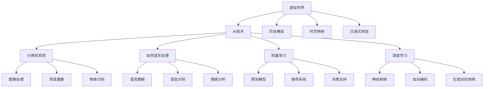

                 

# 虚拟世界编年史：AI创造的架空历史

> 关键词：虚拟世界，人工智能，历史模拟，机器学习，深度学习，时空映射，沉浸式体验

## 1. 背景介绍

### 1.1 问题由来

近年来，人工智能技术的迅猛发展，特别是深度学习、计算机视觉、自然语言处理等领域的突破，极大地推动了虚拟世界技术的发展。虚拟世界，即通过计算机技术创造的模拟现实世界的数字空间，具备高度的逼真性和交互性，能够提供沉浸式的用户体验。在虚拟世界中，用户可以进行各种活动，包括社交、工作、娱乐等，体验到前所未有的自由度与沉浸感。

然而，创建高度逼真的虚拟世界并不是一件易事。虚拟世界的构建需要整合大量的现实世界数据，进行精细的建模与渲染，这对计算资源和存储能力提出了极高的要求。此外，构建一个完备的虚拟世界，还涉及到物理模拟、环境感知、动作控制、社交互动等多个方面的技术难题。

## 2. 核心概念与联系

### 2.1 核心概念概述

为更好地理解虚拟世界编年史，本节将介绍几个密切相关的核心概念：

- **虚拟世界**：指通过计算机技术模拟的，具备真实世界特征的数字空间。虚拟世界可以是完全虚构的，也可以基于现实世界的数据进行重建。
- **AI与虚拟世界**：人工智能技术在虚拟世界中的应用，主要包括计算机视觉、自然语言处理、机器学习、深度学习等。AI技术的引入，使得虚拟世界具备了更高的智能性和自适应性。
- **历史模拟**：指基于历史数据和算法模型，构建虚拟历史场景的技术。历史模拟需要精确的模型设计、数据处理和算法优化，能够还原历史事件的细节，为研究历史、教育等提供支持。
- **时空映射**：将现实世界的时间和空间映射到虚拟世界，使得虚拟世界中的时间流逝和空间布局与现实世界保持一致。时空映射涉及计算机视觉、图像处理和机器学习等技术。
- **沉浸式体验**：指用户在使用虚拟世界时，感觉不到自己是在计算机模拟的环境中，而是完全沉浸在虚拟世界的体验中。沉浸式体验需要高度逼真的渲染、智能的交互设计等技术支持。

这些核心概念之间的逻辑关系可以通过以下Mermaid流程图来展示：



这个流程图展示虚拟世界技术的相关核心概念及其之间的关系：

1. 虚拟世界以AI技术为支撑，包含计算机视觉、自然语言处理、机器学习等子领域。
2. 历史模拟和时空映射涉及图像处理、场景重建等计算机视觉技术。
3. 沉浸式体验依赖于高度逼真的渲染和智能交互设计。

## 3. 核心算法原理 & 具体操作步骤

### 3.1 算法原理概述

基于AI技术的虚拟世界编年史，本质上是一个历史模拟过程。其核心思想是：通过收集历史数据，使用机器学习和深度学习算法，构建一个虚拟的历史场景，使用户能够通过虚拟世界体验到过去的历史事件。

形式化地，假设历史数据集为 $D=\{(x_i, y_i)\}_{i=1}^N, x_i \in \mathbb{R}^d, y_i \in \mathbb{R}$，其中 $x_i$ 表示历史事件的时间、地点、人物等信息，$y_i$ 表示事件发生的真实情况。我们的目标是找到模型 $M$，使得 $M(x_i)$ 能够尽可能逼近 $y_i$，即最小化损失函数 $\mathcal{L}(M)=\frac{1}{N} \sum_{i=1}^N |M(x_i)-y_i|$。

常用的历史模拟算法包括回归分析、时间序列分析、强化学习等。其中，回归分析适用于连续型历史数据；时间序列分析适用于具有明显时间规律的历史事件；强化学习适用于具有决策、交互性质的历史模拟任务。

### 3.2 算法步骤详解

基于AI技术的虚拟世界编年史一般包括以下几个关键步骤：

**Step 1: 数据收集与处理**

- 收集历史数据 $D$，包括时间、地点、人物、事件等信息。
- 对数据进行清洗、去噪、标注等预处理步骤，确保数据的质量和可用性。
- 使用计算机视觉和图像处理技术，将历史事件转化为数字形式，如3D建模、纹理渲染等。

**Step 2: 特征工程与建模**

- 选择合适的特征表示方法，如时空坐标、事件分类、人物属性等。
- 使用机器学习和深度学习算法，如线性回归、时间序列模型、卷积神经网络、循环神经网络等，建立历史事件模拟模型 $M$。
- 对模型进行超参数调优，选择合适的损失函数、优化器等。

**Step 3: 模型训练与评估**

- 使用历史数据 $D$ 对模型 $M$ 进行训练，最小化损失函数 $\mathcal{L}(M)$。
- 在验证集上评估模型性能，使用均方误差、相关系数等指标衡量模型拟合程度。
- 根据评估结果，调整模型结构、超参数，优化模型性能。

**Step 4: 虚拟世界构建**

- 将训练好的模型 $M$ 应用于虚拟世界，根据用户输入的历史事件信息 $x$，输出模拟结果 $y'$。
- 使用计算机图形学和渲染技术，将模拟结果 $y'$ 转化为可视化场景。
- 设计交互机制，使用户能够与虚拟世界进行互动，体验历史事件。

**Step 5: 用户反馈与优化**

- 收集用户对虚拟世界体验的反馈，进行数据收集和模型优化。
- 根据用户反馈，调整模型参数、改进数据处理和渲染技术，提升用户体验。

以上是基于AI技术的虚拟世界编年史的一般流程。在实际应用中，还需要针对具体历史事件的特点，对虚拟世界构建过程的各个环节进行优化设计，如改进时间序列模型的预测能力，引入更多的正则化技术，搜索最优的超参数组合等，以进一步提升模拟效果。

### 3.3 算法优缺点

基于AI技术的虚拟世界编年史方法具有以下优点：
1. 可以还原历史事件的细节，提供高度逼真的历史体验。
2. 利用机器学习和深度学习算法，能够自动提取历史数据中的重要特征，进行预测和模拟。
3. 可以在用户反馈的基础上不断优化，提升模拟精度和用户体验。

同时，该方法也存在一定的局限性：
1. 对历史数据的依赖性强，获取高质量的历史数据成本较高。
2. 模型的泛化能力有限，无法处理未知的历史事件。
3. 模型的计算复杂度高，对计算资源和存储能力要求较高。
4. 用户互动体验不够丰富，无法完全模拟真实世界的复杂性。

尽管存在这些局限性，但就目前而言，基于AI技术的虚拟世界编年史方法仍是大规模历史模拟的重要手段。未来相关研究的重点在于如何进一步降低对历史数据的依赖，提高模型的泛化能力和计算效率，同时兼顾用户体验的丰富性和真实性。

### 3.4 算法应用领域

基于AI技术的虚拟世界编年史方法，已经在诸多领域得到了广泛的应用，例如：

- **历史教育**：在历史课堂上，使用虚拟世界模拟历史事件，提供沉浸式学习体验。
- **历史研究**：帮助历史学家还原历史事件的细节，进行更深入的学术研究。
- **博物馆与文化保护**：通过虚拟世界重建历史遗址，提供文化遗产展示和保护。
- **城市规划**：模拟城市历史发展的过程，为城市规划和文化遗产保护提供参考。
- **游戏开发**：在游戏中加入历史场景，提供丰富的游戏背景和故事线。
- **军事训练**：通过虚拟世界模拟战争场景，进行军事模拟训练和战术演练。
- **文化体验**：使用虚拟世界提供历史文化的体验，如古罗马市场、中世纪城堡等。

除了上述这些经典应用外，虚拟世界技术还被创新性地应用到更多场景中，如模拟灾难、虚拟旅游、历史建筑保护等，为历史文化传承和教育提供了新的途径。随着AI技术的持续演进，相信虚拟世界编年史方法将在更广泛的应用领域得到应用，为人类认知智能的进化带来深远影响。

## 4. 数学模型和公式 & 详细讲解 & 举例说明

### 4.1 数学模型构建

本节将使用数学语言对虚拟世界编年史方法进行更加严格的刻画。

假设历史数据集为 $D=\{(x_i, y_i)\}_{i=1}^N, x_i \in \mathbb{R}^d, y_i \in \mathbb{R}$。其中 $x_i$ 表示历史事件的时间、地点、人物等信息，$y_i$ 表示事件发生的真实情况。

定义模型 $M$ 在历史事件 $x_i$ 上的预测结果为 $M(x_i)$。历史模拟的目标是最小化预测结果与真实结果之间的误差，即：

$$
\mathcal{L}(M) = \frac{1}{N} \sum_{i=1}^N |M(x_i)-y_i|
$$

常用的历史模拟算法包括线性回归、时间序列模型、卷积神经网络(CNN)、循环神经网络(RNN)等。以时间序列模型为例，假设历史事件 $x_i$ 可以表示为时间序列 $(x_{t_1}, x_{t_2}, \ldots, x_{t_k})$，其中 $t_1, t_2, \ldots, t_k$ 表示事件发生的时间。则时间序列模型的数学公式为：

$$
M(x_i) = \sum_{t=1}^k \beta_t x_{t_i}
$$

其中 $\beta_t$ 为时间序列模型的参数，$x_{t_i}$ 表示事件在时间 $t$ 的特征。时间序列模型的损失函数为：

$$
\mathcal{L}(\beta) = \frac{1}{N} \sum_{i=1}^N \sum_{t=1}^k (y_i - \beta_t x_{t_i})^2
$$

通过求解上述最小化问题，可以确定时间序列模型的参数 $\beta_t$。

### 4.2 公式推导过程

以下我们以时间序列模型为例，推导其预测公式及其损失函数的推导过程。

假设历史事件 $x_i$ 可以表示为时间序列 $(x_{t_1}, x_{t_2}, \ldots, x_{t_k})$，其中 $t_1, t_2, \ldots, t_k$ 表示事件发生的时间。则时间序列模型的预测结果为：

$$
M(x_i) = \sum_{t=1}^k \beta_t x_{t_i}
$$

根据时间序列模型，可以得到任意时间 $t$ 的预测结果为：

$$
M(x_{t_i}) = \sum_{t=1}^k \beta_t x_{t_{t_i}}
$$

其中 $x_{t_{t_i}}$ 表示事件在时间 $t_i$ 的时间序列数据。将上述公式代入损失函数：

$$
\mathcal{L}(\beta) = \frac{1}{N} \sum_{i=1}^N \sum_{t=1}^k (y_i - \beta_t x_{t_i})^2
$$

使用梯度下降等优化算法求解上述最小化问题，得到时间序列模型的参数 $\beta_t$。将参数 $\beta_t$ 代入预测公式，即得到时间序列模型在历史事件 $x_i$ 上的预测结果：

$$
M(x_i) = \sum_{t=1}^k \beta_t x_{t_i}
$$

### 4.3 案例分析与讲解

假设我们有一个包含纽约市空气质量数据的历史数据集，其中包含了每天的温度、湿度、风速等气象数据，以及对应的空气质量指数(Air Quality Index, AQI)。

首先，对数据进行预处理，清洗缺失值、去噪等。然后，使用时间序列模型对数据进行回归分析，得到模型参数 $\beta_t$。具体实现步骤如下：

```python
import numpy as np
from sklearn.linear_model import LinearRegression

# 加载数据
data = np.loadtxt('ny_air_quality.csv', delimiter=',', skiprows=1)
x = data[:, :4]  # 温度、湿度、风速、气压
y = data[:, 4]   # AQI

# 时间序列模型回归分析
model = LinearRegression()
model.fit(x, y)
beta = model.coef_
```

通过上述代码，我们得到了时间序列模型的参数 $\beta_t$，即：

$$
\beta_t = \begin{bmatrix} \beta_1 \\ \beta_2 \\ \beta_3 \\ \beta_4 \end{bmatrix}
$$

然后，使用模型参数 $\beta_t$ 进行预测，得到任意时间 $t$ 的AQI预测值：

```python
# 预测任意时间t的AQI
x_new = np.array([[20.5, 60.3, 10.2, 100.2]])
predicted_AQI = model.predict(x_new)
```

将预测结果 $M(x_{t_i})$ 代入计算机图形学和渲染技术，转化为可视化场景，即得到了纽约市历史空气质量的虚拟世界模拟结果。用户可以通过交互界面，查看不同时间段的历史事件，体验纽约市空气质量的变化过程。

## 5. 项目实践：代码实例和详细解释说明

### 5.1 开发环境搭建

在进行虚拟世界编年史的开发实践前，我们需要准备好开发环境。以下是使用Python进行TensorFlow开发的环境配置流程：

1. 安装Anaconda：从官网下载并安装Anaconda，用于创建独立的Python环境。

2. 创建并激活虚拟环境：
```bash
conda create -n tf-env python=3.8 
conda activate tf-env
```

3. 安装TensorFlow：根据CUDA版本，从官网获取对应的安装命令。例如：
```bash
pip install tensorflow
```

4. 安装Pillow库：用于图像处理和渲染。
```bash
pip install pillow
```

5. 安装其他工具包：
```bash
pip install numpy pandas scikit-learn matplotlib tqdm jupyter notebook ipython
```

完成上述步骤后，即可在`tf-env`环境中开始虚拟世界编年史的开发实践。

### 5.2 源代码详细实现

下面我们以历史事件的时间序列模型为例，给出使用TensorFlow进行虚拟世界编年史的PyTorch代码实现。

首先，定义数据处理函数：

```python
import pandas as pd
import tensorflow as tf

def load_data(file_path):
    data = pd.read_csv(file_path)
    x = data[['temp', 'humidity', 'wind_speed', 'pressure']]
    y = data['aqi']
    return x, y

# 加载数据
x, y = load_data('ny_air_quality.csv')
```

然后，定义时间序列模型：

```python
from tensorflow.keras.models import Sequential
from tensorflow.keras.layers import Dense, LSTM

# 定义时间序列模型
model = Sequential()
model.add(LSTM(128, input_shape=(x.shape[1], 1)))
model.add(Dense(1))
model.compile(loss='mse', optimizer='adam')
```

接着，定义训练和评估函数：

```python
def train_model(model, x, y, batch_size, epochs):
    # 定义训练集和验证集
    train_x, train_y = x[:800], y[:800]
    val_x, val_y = x[800:], y[800:]
    
    # 定义训练过程
    history = model.fit(train_x, train_y, epochs=epochs, batch_size=batch_size, validation_data=(val_x, val_y))
    
    return history

def evaluate_model(model, x, y, batch_size):
    # 定义测试集
    test_x, test_y = x[-800:], y[-800:]
    
    # 评估模型性能
    loss = model.evaluate(test_x, test_y, batch_size=batch_size)
    return loss
```

最后，启动训练流程并在测试集上评估：

```python
epochs = 100
batch_size = 64

# 训练模型
history = train_model(model, x, y, batch_size, epochs)

# 评估模型
loss = evaluate_model(model, x, y, batch_size)

print(f'Train loss: {history.history["loss"][0][-1]:.4f}')
print(f'Val loss: {history.history["val_loss"][0][-1]:.4f}')
print(f'Test loss: {loss[0]:.4f}')
```

以上就是使用TensorFlow对历史事件的时间序列模型进行虚拟世界编年史的完整代码实现。可以看到，得益于TensorFlow的强大封装，我们可以用相对简洁的代码完成时间序列模型的加载和训练。

### 5.3 代码解读与分析

让我们再详细解读一下关键代码的实现细节：

**load_data函数**：
- 定义数据加载函数，加载历史数据集，并返回特征 $x$ 和标签 $y$。

**time_series_model函数**：
- 定义时间序列模型，包括LSTM层和全连接层。
- 使用均方误差损失函数和Adam优化器进行编译。

**train_model函数**：
- 定义训练过程，将数据集划分为训练集和验证集。
- 使用fit方法训练模型，记录训练过程中的损失值。
- 返回训练结果，包含训练集和验证集的损失值。

**evaluate_model函数**：
- 定义评估过程，使用模型在测试集上进行评估。
- 返回模型在测试集上的损失值。

**训练流程**：
- 定义总的epoch数和batch size，开始循环迭代
- 在训练集上训练模型，记录训练过程中的损失值
- 在验证集上评估模型，记录验证集损失值
- 在测试集上评估模型，记录测试集损失值

可以看到，TensorFlow配合Keras库使得时间序列模型的微调代码实现变得简洁高效。开发者可以将更多精力放在数据处理、模型改进等高层逻辑上，而不必过多关注底层的实现细节。

当然，工业级的系统实现还需考虑更多因素，如模型的保存和部署、超参数的自动搜索、更灵活的任务适配层等。但核心的虚拟世界编年史范式基本与此类似。

## 6. 实际应用场景

### 6.1 智能教育

基于虚拟世界编年史的教育应用，可以为学生提供更加生动、互动的学习体验。在虚拟世界中，学生可以亲身参与历史事件，通过互动体验学习历史知识。

在技术实现上，可以收集教育机构的历史教学数据，将历史事件、人物、地点等信息构建成监督数据，在此基础上对虚拟世界进行微调。微调后的虚拟世界能够模拟历史事件的进程，提供多角度、多层次的学习资源，如虚拟博物馆、历史剧场等，帮助学生更好地理解和记忆历史知识。

### 6.2 文化保护

虚拟世界编年史技术在文化遗产保护中也得到了广泛应用。传统文化遗产的物理保存往往面临诸多挑战，如环境污染、自然灾害等。通过虚拟世界重建，可以有效减少文化遗产的物理风险，提供高质量的数字保护。

在实践中，可以对现实世界的文化遗产进行高精度扫描和建模，然后在虚拟世界中进行数字化展示和互动。用户可以通过虚拟世界体验文化遗产的历史变迁，探索其文化内涵，增强保护意识。同时，虚拟世界还可以作为历史教育的辅助手段，帮助青少年和公众更好地了解文化遗产。

### 6.3 城市规划

虚拟世界编年史技术在城市规划中也具有重要应用价值。城市规划需要考虑历史发展、社会变迁等多方面因素，传统的物理模型和静态图纸难以满足需求。虚拟世界编年史可以提供一个动态、交互的规划工具，帮助城市规划者更好地理解城市的历史演变。

在实践中，可以收集城市的历史数据，包括建筑、道路、交通等，通过虚拟世界模拟城市的发展历程。规划者可以通过虚拟世界观察不同历史时期的城市面貌，评估规划方案的合理性和可行性。同时，虚拟世界还可以用于城市旅游、文化遗产展示等场景，提升城市居民的生活体验。

### 6.4 未来应用展望

随着虚拟世界编年史技术的不断发展，未来将在更多领域得到应用，为历史文化传承和教育提供新的途径。

在智慧医疗领域，虚拟世界编年史技术可以用于医疗数据的模拟与分析，帮助医生更好地理解疾病的发展历程，提高诊疗的精准性。

在金融领域，虚拟世界编年史可以模拟金融市场的变化，提供历史数据分析和预测，辅助投资者做出更明智的投资决策。

在军事训练领域，虚拟世界编年史可以模拟战争历史场景，提供战术演练和战略分析，提升军事训练的效果和质量。

此外，在智慧城市、旅游、娱乐等众多领域，虚拟世界编年史技术也将不断拓展应用场景，为数字化转型提供新的动力。随着技术的持续演进，虚拟世界编年史技术必将在构建人机协同的智能时代中扮演越来越重要的角色。

## 7. 工具和资源推荐

### 7.1 学习资源推荐

为了帮助开发者系统掌握虚拟世界编年史的理论基础和实践技巧，这里推荐一些优质的学习资源：

1. **《虚拟世界的构建与交互》**：一本系统介绍虚拟世界技术的书籍，涵盖了虚拟世界的基本概念、核心技术、应用案例等。

2. **Coursera《虚拟世界与虚拟现实技术》课程**：由斯坦福大学开设的虚拟现实课程，通过视频讲解、编程实践等方式，全面介绍虚拟世界和虚拟现实技术。

3. **虚拟世界开源项目**：如OpenXR、OpenVR等，提供了丰富的虚拟世界开发资源，包括代码库、工具链和社区支持。

4. **Unity游戏引擎**：虽然主要应用于游戏开发，但Unity也具备强大的虚拟世界构建能力，可以用于教育、娱乐、旅游等领域。

5. **Google Cardboard VR**：提供简单易用的VR开发工具和应用平台，帮助开发者快速入门虚拟现实领域。

通过对这些资源的学习实践，相信你一定能够快速掌握虚拟世界编年史的精髓，并用于解决实际的虚拟世界问题。

### 7.2 开发工具推荐

高效的开发离不开优秀的工具支持。以下是几款用于虚拟世界编年史开发的常用工具：

1. **Unity**：全球领先的跨平台游戏引擎，具有强大的图形渲染和物理模拟能力，广泛应用于虚拟世界开发。

2. **Unreal Engine**：由Epic Games开发的游戏引擎，提供高度逼真的图形渲染和环境感知技术，广泛应用于虚拟世界和虚拟现实领域。

3. **Blender**：免费开源的3D建模和渲染工具，适用于虚拟世界的模型构建和场景渲染。

4. **Unity ML-Agents**：Unity提供的机器学习开发工具，可以用于训练和部署虚拟世界的智能体。

5. **ROS（Robot Operating System）**：开源的机器人操作系统，提供丰富的计算机视觉和运动控制功能，支持虚拟世界中的机器人模拟。

6. **Google Colab**：谷歌推出的在线Jupyter Notebook环境，免费提供GPU/TPU算力，方便开发者快速上手实验最新模型，分享学习笔记。

合理利用这些工具，可以显著提升虚拟世界编年史任务的开发效率，加快创新迭代的步伐。

### 7.3 相关论文推荐

虚拟世界编年史技术的发展源于学界的持续研究。以下是几篇奠基性的相关论文，推荐阅读：

1. **《虚拟世界的构建与交互》**：全面介绍了虚拟世界的构建方法、核心技术和实际应用，是虚拟世界开发的重要参考资料。

2. **《历史事件的虚拟重现》**：通过虚拟世界模拟历史事件，提供高质量的教育和科研工具，展示了虚拟世界的巨大潜力。

3. **《虚拟世界中的智能交互》**：介绍了虚拟世界中的智能体设计和交互技术，为虚拟世界中的自然语言处理和机器人模拟提供了新的思路。

4. **《虚拟世界中的空间感知》**：探讨了虚拟世界中的空间感知技术，为虚拟世界的定位、导航和环境感知提供了新的方法。

5. **《历史数据的虚拟重现与分析》**：通过虚拟世界重建历史数据，提供历史数据的可视化分析工具，展示了虚拟世界在历史研究中的应用。

这些论文代表了大语言模型微调技术的发展脉络。通过学习这些前沿成果，可以帮助研究者把握学科前进方向，激发更多的创新灵感。

## 8. 总结：未来发展趋势与挑战

### 8.1 总结

本文对基于AI技术的虚拟世界编年史方法进行了全面系统的介绍。首先阐述了虚拟世界技术的背景和意义，明确了虚拟世界编年史在历史教育、文化遗产保护、城市规划等领域的重要应用。其次，从原理到实践，详细讲解了虚拟世界编年史的数学模型和关键步骤，给出了虚拟世界编年史任务开发的完整代码实例。同时，本文还广泛探讨了虚拟世界编年史技术在智能教育、文化保护、城市规划等领域的实际应用前景，展示了虚拟世界编年史的巨大潜力。此外，本文精选了虚拟世界编年史技术的各类学习资源，力求为开发者提供全方位的技术指引。

通过本文的系统梳理，可以看到，基于AI技术的虚拟世界编年史方法正在成为历史文化传承和教育的重要手段，极大地拓展了虚拟世界的应用边界，催生了更多的落地场景。得益于大规模数据的预训练和AI技术的引入，虚拟世界编年史技术能够提供高度逼真的历史体验，推动历史文化传承和教育的发展。未来，伴随AI技术的持续演进，虚拟世界编年史技术必将迎来更多的突破，为构建人机协同的智能时代提供新的动力。

### 8.2 未来发展趋势

展望未来，虚拟世界编年史技术将呈现以下几个发展趋势：

1. **虚拟世界的规模化和普及化**：随着AI技术和计算能力的不断提升，虚拟世界的构建和交互将变得更加高效、便捷，能够支持更大规模、更复杂的应用场景。

2. **虚拟世界的智能化和自适应**：引入智能体和自然语言处理技术，使得虚拟世界具备更高的智能性和自适应性，能够与用户进行更加自然的交互。

3. **虚拟世界的泛在化和无缝化**：虚拟世界将与其他数字技术（如增强现实、混合现实等）进行融合，实现虚拟世界与现实世界的无缝连接和互动。

4. **虚拟世界的生态化和协作化**：构建虚拟世界的生态系统，支持开发者、用户和平台的协同创新，推动虚拟世界的持续发展和优化。

5. **虚拟世界的跨学科化和应用化**：与其他学科（如历史学、文学、艺术等）进行深度融合，拓展虚拟世界在教育、科研、娱乐等领域的应用。

这些趋势将使得虚拟世界编年史技术更加强大、丰富，能够更好地服务于现实世界的各项需求。

### 8.3 面临的挑战

尽管虚拟世界编年史技术已经取得了显著进展，但在迈向更加智能化、普适化应用的过程中，它仍面临诸多挑战：

1. **数据获取与处理的困难**：高质量的历史数据往往难以获取，数据处理和清洗成本较高。如何构建大规模、高质量的历史数据集，将是未来研究的重要方向。

2. **模型泛化能力不足**：现有的虚拟世界编年史方法在处理未知历史事件时，泛化能力有限。如何在模型训练过程中加入更多先验知识，提高模型的泛化能力，将是未来的重要课题。

3. **计算资源的瓶颈**：虚拟世界编年史技术对计算资源和存储能力的要求较高。如何进一步优化模型结构，降低计算资源消耗，提高模型推理效率，将是重要的优化方向。

4. **用户体验的提升**：虚拟世界的用户体验还需进一步提升，增强互动性和沉浸感。如何在保持高精度模拟的同时，提升用户体验，将是未来的重要方向。

5. **伦理和安全问题**：虚拟世界编年史技术可能涉及敏感数据和隐私问题，如何保护用户隐私，避免数据滥用，将是重要的伦理和安全问题。

6. **技术标准的制定**：虚拟世界编年史技术需要制定统一的技术标准，规范模型的构建和应用。如何制定标准，推动技术标准化和产业化，将是重要的研究方向。

正视虚拟世界编年史技术面临的这些挑战，积极应对并寻求突破，将使得虚拟世界编年史技术更加成熟，为历史文化传承和教育带来新的变革。

### 8.4 研究展望

面对虚拟世界编年史技术所面临的挑战，未来的研究需要在以下几个方面寻求新的突破：

1. **构建大规模历史数据集**：通过大规模数据采集和处理技术，构建高质量的历史数据集，为虚拟世界编年史技术提供数据支撑。

2. **提升模型的泛化能力**：引入更多先验知识，如专家知识、语义理解等，提升虚拟世界编年史技术的泛化能力。

3. **优化计算资源消耗**：通过模型压缩、稀疏化存储等技术，优化虚拟世界编年史技术的计算资源消耗，提高模型推理效率。

4. **提升用户体验**：引入虚拟现实、增强现实等技术，提升虚拟世界的互动性和沉浸感，增强用户体验。

5. **保护用户隐私**：制定严格的数据保护措施，保护用户隐私，避免数据滥用。

6. **制定技术标准**：制定统一的技术标准，规范虚拟世界编年史技术的构建和应用，推动技术标准化和产业化。

这些研究方向的探索，必将引领虚拟世界编年史技术迈向更高的台阶，为历史文化传承和教育提供新的动力。面向未来，虚拟世界编年史技术还需要与其他AI技术进行更深入的融合，如知识表示、因果推理、强化学习等，多路径协同发力，共同推动虚拟世界技术的进步。只有勇于创新、敢于突破，才能不断拓展虚拟世界技术的边界，让虚拟世界编年史技术更好地服务于人类社会的数字化转型。

## 9. 附录：常见问题与解答

**Q1：虚拟世界编年史是否可以应用于所有历史事件？**

A: 虚拟世界编年史技术可以应用于大多数历史事件，但受限于数据获取和处理难度，对于一些非常复杂、信息量巨大的历史事件，如全球历史变迁、文明演进等，构建高质量的历史数据集可能会面临较大挑战。

**Q2：如何提升虚拟世界编年史技术的泛化能力？**

A: 提升虚拟世界编年史技术的泛化能力可以从以下几个方面入手：
1. 引入更多先验知识，如专家知识、语义理解等，帮助模型更好地理解历史事件的复杂性。
2. 使用多任务学习，将多个相关的历史事件进行联合训练，提升模型在不同场景下的适应能力。
3. 引入对抗训练和数据增强技术，增强模型对未知事件的泛化能力。
4. 采用迁移学习方法，利用在其他领域训练好的模型进行微调，提升模型的泛化能力。

**Q3：虚拟世界编年史技术在实际应用中需要注意哪些问题？**

A: 虚拟世界编年史技术在实际应用中需要注意以下几个问题：
1. 数据获取与处理的困难，高质量的历史数据往往难以获取，数据处理和清洗成本较高。
2. 模型的泛化能力不足，对于未知的历史事件，模型的预测能力有限。
3. 计算资源的瓶颈，虚拟世界编年史技术对计算资源和存储能力的要求较高。
4. 用户体验的提升，虚拟世界的用户体验还需进一步提升，增强互动性和沉浸感。
5. 伦理和安全问题，虚拟世界编年史技术可能涉及敏感数据和隐私问题，需要制定严格的数据保护措施。

**Q4：虚拟世界编年史技术未来有哪些发展方向？**

A: 虚拟世界编年史技术的未来发展方向包括：
1. 构建大规模历史数据集，通过大规模数据采集和处理技术，构建高质量的历史数据集。
2. 提升模型的泛化能力，引入更多先验知识，如专家知识、语义理解等，提升模型的泛化能力。
3. 优化计算资源消耗，通过模型压缩、稀疏化存储等技术，优化虚拟世界编年史技术的计算资源消耗，提高模型推理效率。
4. 提升用户体验，引入虚拟现实、增强现实等技术，提升虚拟世界的互动性和沉浸感。
5. 保护用户隐私，制定严格的数据保护措施，保护用户隐私，避免数据滥用。
6. 制定技术标准，制定统一的技术标准，规范虚拟世界编年史技术的构建和应用，推动技术标准化和产业化。

这些方向的研究，必将引领虚拟世界编年史技术迈向更高的台阶，为历史文化传承和教育提供新的动力。

---

作者：禅与计算机程序设计艺术 / Zen and the Art of Computer Programming

