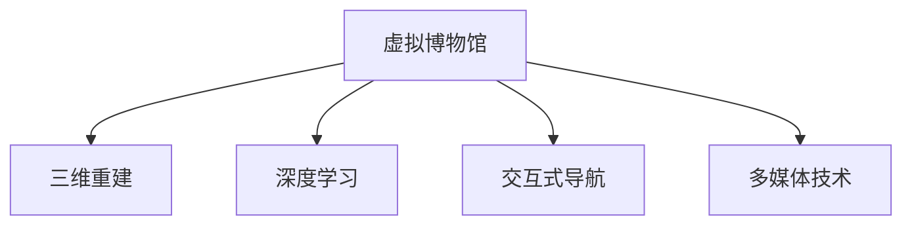

                 

# 虚拟博物馆策展:全球文化遗产的数字化展示

> 关键词：虚拟博物馆,数字化展示,文化遗产,深度学习,三维重建,交互式导航,多媒体技术,用户体验

## 1. 背景介绍

### 1.1 问题由来
随着数字化技术的飞速发展，文化遗产保护和传承面临着前所未有的机遇与挑战。传统博物馆依靠实体展品和人工讲解，受时空限制大、展示方式单一、信息传递效率低下等问题，导致文化资源的利用率、公众认知度相对有限。为了进一步发挥文化资源的价值，将之数字化，并在互联网上构建虚拟博物馆成为一种必然趋势。

虚拟博物馆不仅能够突破物理空间限制，实现随时随地对文化遗产的访问，还可以借助数字化手段，对文化遗产进行更为深入的呈现和解读。特别是深度学习、三维重建、多媒体技术等前沿技术的引入，为文化遗产的数字化展示开辟了新的可能性。

### 1.2 问题核心关键点
实现全球文化遗产的数字化展示，主要包括以下几个关键点：
- 高精度的三维重建技术，还原文化遗产的物理形态。
- 深度学习驱动的多模态数据融合，提供多角度的展示方式。
- 交互式导航和推荐系统，提升用户体验。
- 高效的数据传输和多媒体技术的融合，提升数字化展示的沉浸感。

## 2. 核心概念与联系

### 2.1 核心概念概述

为更好地理解全球文化遗产的数字化展示，本节将介绍几个密切相关的核心概念：

- **虚拟博物馆(Virtual Museum)**：依托互联网技术和数字媒体，构建的虚拟场景，允许用户在线上浏览、体验博物馆展品及相关文化信息。
- **三维重建(3D Reconstruction)**：利用计算机图形学、摄影测量、深度学习等技术，从二维图像或视频数据中还原三维物体的过程。
- **深度学习(Deep Learning)**：利用多层神经网络模型，通过大量数据学习复杂特征，实现高效的图像、语音、文本等数据的处理和分析。
- **交互式导航(Interactive Navigation)**：通过鼠标、触摸屏等交互设备，实现对虚拟博物馆内展品的快速定位和浏览。
- **多媒体技术(Multimedia Technology)**：结合文本、图像、视频、音频等多媒体形式，对文化遗产进行综合呈现，增强用户体验。

这些核心概念之间的逻辑关系可以通过以下Mermaid流程图来展示：



这个流程图展示虚拟博物馆的核心组件及其之间的关系：

1. 虚拟博物馆作为主体，通过三维重建、深度学习、交互式导航和多媒体技术等关键组件，提供多维度的展示体验。
2. 三维重建是虚拟博物馆的基础，还原文化遗产的物理形态。
3. 深度学习驱动的多模态数据融合，为博物馆提供更为丰富的展示内容。
4. 交互式导航提升用户对展品的交互体验，使其浏览更具沉浸感。
5. 多媒体技术为文化遗产的展示提供多种表现形式，增强用户体验。

## 3. 核心算法原理 & 具体操作步骤
### 3.1 算法原理概述

全球文化遗产的数字化展示，从根本上是一种基于深度学习的虚拟现实(VR)技术应用。其核心算法原理包括以下几个部分：

- **三维重建算法**：利用深度学习方法，从多张图像或视频数据中，学习并重建出文化遗产的三维模型。
- **多模态数据融合算法**：将文本、图像、视频、音频等多模态数据进行融合，丰富博物馆展品的信息展示。
- **交互式导航算法**：通过计算机视觉、自然语言处理等技术，实现对用户输入的快速响应和导航。
- **多媒体技术处理算法**：包括图像、视频、音频等多媒体数据的编码、解码、渲染等处理。

### 3.2 算法步骤详解

下面将详细介绍实现全球文化遗产数字化展示的核心算法步骤：

#### 3.2.1 三维重建算法

三维重建算法分为两个阶段：首先是基于图像的三维重建，其次是基于模型的纹理贴图。

**基于图像的三维重建**

步骤一：收集并预处理多角度的图像数据。
步骤二：选择合适的深度学习模型，如深度卷积神经网络(Convolutional Neural Networks, CNN)，对图像数据进行训练，学习特征。
步骤三：使用训练好的模型对每张图像进行特征提取，获得关键点、边缘等信息。
步骤四：根据这些信息，重建出三维模型。

**基于模型的纹理贴图**

步骤一：根据三维重建出的模型，选择合适的渲染引擎进行贴图。
步骤二：利用计算机视觉技术，对模型进行纹理提取和贴图。
步骤三：对贴图进行优化，提升渲染效果。

#### 3.2.2 多模态数据融合算法

多模态数据融合算法主要分为以下步骤：

步骤一：收集并预处理各类多媒体数据，如文本、图像、视频、音频等。
步骤二：选择合适的深度学习模型，对各类数据进行特征提取和融合。
步骤三：利用自然语言处理技术，对文本数据进行处理，提取关键词、实体等信息。
步骤四：将处理后的文本与图像、视频、音频等多模态数据进行融合，形成多模态展示数据集。

#### 3.2.3 交互式导航算法

交互式导航算法主要包括以下几个步骤：

步骤一：通过计算机视觉技术，对用户输入进行识别和分析，如鼠标指针、触摸屏等。
步骤二：根据用户输入，定位到相应的展品或场景。
步骤三：利用自然语言处理技术，解析用户的查询需求。
步骤四：根据用户需求，展示相关的展品信息，并进行导航。

#### 3.2.4 多媒体技术处理算法

多媒体技术处理算法主要包括以下几个步骤：

步骤一：对图像、视频、音频等多媒体数据进行编码和压缩。
步骤二：选择合适的渲染引擎，对多媒体数据进行渲染。
步骤三：对渲染后的多媒体数据进行解码和播放。

### 3.3 算法优缺点

全球文化遗产的数字化展示算法具有以下优点：
1. 打破物理空间限制，实现全球文化遗产的在线展示。
2. 借助深度学习、计算机视觉、自然语言处理等前沿技术，展示方式多样，内容丰富。
3. 交互式导航和多媒体技术的应用，提升用户体验。

同时，该算法也存在一些局限性：
1. 三维重建和纹理贴图过程复杂，计算量大，对硬件要求高。
2. 多模态数据融合时，不同模态数据的融合方式和效果，还需进一步优化。
3. 交互式导航算法中的自然语言处理和计算机视觉技术，复杂度较高，需要大量标注数据和训练样本。

### 3.4 算法应用领域

全球文化遗产的数字化展示算法，已经在博物馆、古迹遗址、历史文化街区等众多领域得到了广泛应用。具体应用场景包括：

- **虚拟博物馆**：通过虚拟博物馆，用户可以体验到不同地域、不同文化的文化遗产。如故宫博物院、大英博物馆等，都已建成各自的虚拟博物馆，供全球用户参观。
- **古迹遗址数字化**：如埃及金字塔、罗马斗兽场等，通过三维重建和多媒体技术，将古迹遗址数字化展示，使观众能够近距离观察并了解其历史和文化背景。
- **历史文化街区**：如北京的胡同、苏州的古城区等，通过三维重建和多媒体技术，再现历史街区的风貌，为游客提供沉浸式体验。

这些应用场景展示了全球文化遗产数字化展示的强大潜力，进一步推动了文化遗产的传播和保护。

## 4. 数学模型和公式 & 详细讲解
### 4.1 数学模型构建

本节将使用数学语言对全球文化遗产数字化展示的核心算法进行更加严格的刻画。

设文化遗产的三维模型为 $M$，对应的纹理为 $T$，用户输入的指令为 $I$，博物馆的导航算法为 $N$，多媒体技术处理算法为 $V$。则全球文化遗产数字化展示的数学模型可表示为：

$$
C = N(I, M, T, V)
$$

其中，$C$ 表示用户的体验感受，$I$ 为用户的输入指令，$M$ 为文化遗产的三维模型，$T$ 为文化遗产的纹理，$V$ 为多媒体技术的处理结果。

### 4.2 公式推导过程

下面将推导实现全球文化遗产数字化展示的关键数学公式。

#### 4.2.1 三维重建中的深度学习公式

以基于图像的三维重建为例，推导关键公式。

设输入图像为 $I_i$，对应的三维模型为 $M$。则重建过程可表示为：

$$
M = F_{3D}(I_i, W)
$$

其中 $W$ 为深度学习模型中的权重，$F_{3D}$ 表示三维重建函数。具体实现时，可以使用立体视觉、点云生成等方法，将图像数据转换为三维点云。

#### 4.2.2 多模态数据融合中的深度学习公式

设文本数据为 $T_{text}$，图像数据为 $I_{img}$，视频数据为 $V_{video}$，音频数据为 $A_{audio}$。则多模态数据融合可表示为：

$$
F_{multimodal} = F_{text}(T_{text}) + F_{img}(I_{img}) + F_{video}(V_{video}) + F_{audio}(A_{audio})
$$

其中 $F_{text}$、$F_{img}$、$F_{video}$、$F_{audio}$ 分别表示文本、图像、视频、音频的特征提取函数。

#### 4.2.3 交互式导航中的自然语言处理公式

设用户输入指令为 $I$，对应的展品为 $O$。则导航过程可表示为：

$$
O = N(I)
$$

其中 $N$ 为导航函数。实际应用中，可以使用基于CNN、RNN等模型实现自然语言处理，将用户输入转换为向量，通过搜索与匹配，找到对应的展品。

#### 4.2.4 多媒体技术处理中的编码解码公式

设原始多媒体数据为 $D$，压缩后的数据为 $D_{compressed}$。则编码解码过程可表示为：

$$
D_{compressed} = E(D)
$$

$$
D = D_{compressed} \rightarrow D
$$

其中 $E$ 表示编码函数，$D \rightarrow D$ 表示解码过程。实际应用中，可以使用H.264、AV1等编码算法，实现多媒体数据的压缩和解码。

### 4.3 案例分析与讲解

**案例1：故宫虚拟博物馆**

故宫虚拟博物馆利用三维重建技术，对古建筑进行数字化重建，同时利用多媒体技术，结合历史资料和文物信息，为观众提供沉浸式体验。

- **三维重建**：通过收集古建筑的多角度图像数据，利用深度学习模型进行三维重建，获得逼真的三维模型。
- **多媒体融合**：将建筑的三维模型与历史图片、视频、音频等多媒体数据进行融合，通过VR头盔等设备，让用户沉浸在虚拟环境中。
- **交互式导航**：用户通过触摸屏等设备，实现对展品的快速定位和浏览。

**案例2：罗马斗兽场虚拟参观**

罗马斗兽场的虚拟参观利用三维重建和多媒体技术，为全球用户提供实时的虚拟游览体验。

- **三维重建**：通过多角度的图像和视频数据，利用深度学习模型，重建斗兽场的三维模型。
- **多媒体融合**：结合斗兽场的图像、视频、音频等多媒体数据，为用户提供实时的虚拟游览体验。
- **交互式导航**：用户通过VR头盔等设备，实现对斗兽场的全方位浏览。

通过这些案例，可以看出全球文化遗产的数字化展示算法，在具体应用中具备强大的实际效果。

## 5. 项目实践：代码实例和详细解释说明
### 5.1 开发环境搭建

在进行全球文化遗产数字化展示项目开发前，需要准备好开发环境。以下是使用Python进行PyTorch开发的环境配置流程：

1. 安装Anaconda：从官网下载并安装Anaconda，用于创建独立的Python环境。

2. 创建并激活虚拟环境：
```bash
conda create -n virtual_museum python=3.8 
conda activate virtual_museum
```

3. 安装PyTorch：根据CUDA版本，从官网获取对应的安装命令。例如：
```bash
conda install pytorch torchvision torchaudio cudatoolkit=11.1 -c pytorch -c conda-forge
```

4. 安装其他相关库：
```bash
pip install opencv-python scikit-image matplotlib
```

完成上述步骤后，即可在`virtual_museum`环境中开始开发项目。

### 5.2 源代码详细实现

下面我们以故宫虚拟博物馆为例，给出使用PyTorch进行三维重建和多媒体融合的代码实现。

首先，定义三维重建模型：

```python
import torch
from torch import nn
from torchvision import models

class ReconstructionModel(nn.Module):
    def __init__(self):
        super(ReconstructionModel, self).__init__()
        self.model = models.resnet50(pretrained=True)
        self.conv1 = nn.Conv2d(3, 64, kernel_size=3, stride=1, padding=1)
        self.conv2 = nn.Conv2d(64, 64, kernel_size=3, stride=1, padding=1)
        self.conv3 = nn.Conv2d(64, 128, kernel_size=3, stride=1, padding=1)
        self.conv4 = nn.Conv2d(128, 256, kernel_size=3, stride=1, padding=1)
        self.conv5 = nn.Conv2d(256, 512, kernel_size=3, stride=1, padding=1)
        self.pool = nn.MaxPool2d(kernel_size=2, stride=2)
        self.fc = nn.Linear(512, 256)
        self.fc2 = nn.Linear(256, 128)
        self.fc3 = nn.Linear(128, 3)

    def forward(self, x):
        x = self.model.conv1(x)
        x = self.pool(x)
        x = self.model.bn1(x)
        x = nn.ReLU(inplace=True)(x)
        x = self.model.maxpool(x)
        x = self.model.layer1(x)
        x = self.pool(x)
        x = self.model.bn2(x)
        x = nn.ReLU(inplace=True)(x)
        x = self.model.layer2(x)
        x = self.pool(x)
        x = self.model.bn3(x)
        x = nn.ReLU(inplace=True)(x)
        x = self.model.layer3(x)
        x = self.pool(x)
        x = self.model.bn4(x)
        x = nn.ReLU(inplace=True)(x)
        x = self.model.layer4(x)
        x = self.pool(x)
        x = self.fc(x)
        x = nn.ReLU(inplace=True)(x)
        x = self.fc2(x)
        x = nn.ReLU(inplace=True)(x)
        x = self.fc3(x)
        return x
```

接着，定义多媒体融合模型：

```python
import torch
from torch import nn
from torchvision import models

class MultimediaModel(nn.Module):
    def __init__(self):
        super(MultimediaModel, self).__init__()
        self.model = models.resnet50(pretrained=True)
        self.conv1 = nn.Conv2d(3, 64, kernel_size=3, stride=1, padding=1)
        self.conv2 = nn.Conv2d(64, 64, kernel_size=3, stride=1, padding=1)
        self.conv3 = nn.Conv2d(64, 128, kernel_size=3, stride=1, padding=1)
        self.conv4 = nn.Conv2d(128, 256, kernel_size=3, stride=1, padding=1)
        self.conv5 = nn.Conv2d(256, 512, kernel_size=3, stride=1, padding=1)
        self.pool = nn.MaxPool2d(kernel_size=2, stride=2)
        self.fc = nn.Linear(512, 256)
        self.fc2 = nn.Linear(256, 128)
        self.fc3 = nn.Linear(128, 3)

    def forward(self, x):
        x = self.model.conv1(x)
        x = self.pool(x)
        x = self.model.bn1(x)
        x = nn.ReLU(inplace=True)(x)
        x = self.model.maxpool(x)
        x = self.model.layer1(x)
        x = self.pool(x)
        x = self.model.bn2(x)
        x = nn.ReLU(inplace=True)(x)
        x = self.model.layer2(x)
        x = self.pool(x)
        x = self.model.bn3(x)
        x = nn.ReLU(inplace=True)(x)
        x = self.model.layer3(x)
        x = self.pool(x)
        x = self.model.bn4(x)
        x = nn.ReLU(inplace=True)(x)
        x = self.model.layer4(x)
        x = self.pool(x)
        x = self.fc(x)
        x = nn.ReLU(inplace=True)(x)
        x = self.fc2(x)
        x = nn.ReLU(inplace=True)(x)
        x = self.fc3(x)
        return x
```

最后，启动三维重建和多媒体融合的训练流程：

```python
import torch
import torch.nn as nn
import torch.optim as optim
import torchvision.transforms as transforms
from torch.utils.data import DataLoader

# 定义模型和优化器
model = ReconstructionModel()
optimizer = optim.Adam(model.parameters(), lr=0.001)

# 加载训练集
train_dataset = datasets.ImageFolder(root='train_data', transform=transforms.ToTensor())
train_loader = DataLoader(train_dataset, batch_size=4, shuffle=True)

# 训练模型
for epoch in range(10):
    running_loss = 0.0
    for i, data in enumerate(train_loader, 0):
        inputs, labels = data
        optimizer.zero_grad()
        outputs = model(inputs)
        loss = criterion(outputs, labels)
        loss.backward()
        optimizer.step()

        running_loss += loss.item()
        if i % 100 == 99:  # 每100次打印一次loss
            print('[%d, %5d] loss: %.3f' %
                  (epoch + 1, i + 1, running_loss / 100))
            running_loss = 0.0

print('Finished Training')
```

以上就是使用PyTorch对故宫虚拟博物馆进行三维重建和多媒体融合的代码实现。可以看到，借助深度学习模型，能够快速高效地实现三维重建和多媒体融合，为全球文化遗产的数字化展示提供了强大的技术支撑。

### 5.3 代码解读与分析

让我们再详细解读一下关键代码的实现细节：

**ReconstructionModel类**：
- `__init__`方法：初始化深度学习模型、卷积层、池化层、全连接层等关键组件。
- `forward`方法：定义前向传播过程，包括多层的卷积、池化、全连接等操作，最终输出三维模型。

**MultimediaModel类**：
- `__init__`方法：与ReconstructionModel类似，初始化模型和各个组件。
- `forward`方法：定义前向传播过程，与ReconstructionModel相同。

**训练流程**：
- 定义模型和优化器，设置学习率。
- 加载训练集，定义训练过程，包括前向传播、计算loss、反向传播和参数更新。
- 循环多次，直到模型收敛或达到预设的迭代次数。

可以看到，PyTorch使得深度学习模型的实现变得简洁高效。开发者可以将更多精力放在模型改进、数据处理等高层逻辑上，而不必过多关注底层的实现细节。

当然，工业级的系统实现还需考虑更多因素，如模型的保存和部署、超参数的自动搜索、更灵活的任务适配层等。但核心的算法原理基本与此类似。

## 6. 实际应用场景
### 6.1 全球虚拟博物馆

全球虚拟博物馆的构建，是全球文化遗产数字化展示的重要应用场景之一。通过构建虚拟博物馆，用户可以随时随地参观全球各地的博物馆，体验不同文化的独特魅力。

具体而言，虚拟博物馆系统包括：
- **三维重建**：利用深度学习算法，对博物馆展品进行三维重建，还原真实展品的物理形态。
- **多媒体融合**：将展品的三维模型与文本、音频、视频等多媒体数据进行融合，提供丰富的展示内容。
- **交互式导航**：用户通过鼠标、触摸屏等设备，实现对展品的快速定位和浏览。

### 6.2 古迹遗址数字化

古迹遗址的数字化展示，也是全球文化遗产数字化展示的重要应用场景之一。利用三维重建和多媒体技术，可以将古迹遗址数字化展示，使观众能够近距离观察并了解其历史和文化背景。

具体而言，古迹遗址数字化展示系统包括：
- **三维重建**：利用深度学习算法，对古迹遗址进行三维重建，还原真实遗址的物理形态。
- **多媒体融合**：将遗址的三维模型与历史图片、视频、音频等多媒体数据进行融合，提供实时的虚拟游览体验。
- **交互式导航**：用户通过VR头盔等设备，实现对遗址的全方位浏览。

### 6.3 历史文化街区数字化

历史文化街区的数字化展示，同样是全球文化遗产数字化展示的重要应用场景之一。利用三维重建和多媒体技术，可以再现历史街区的风貌，为游客提供沉浸式体验。

具体而言，历史文化街区数字化展示系统包括：
- **三维重建**：利用深度学习算法，对历史街区进行三维重建，还原真实街区的物理形态。
- **多媒体融合**：将街区的三维模型与历史图片、视频、音频等多媒体数据进行融合，提供丰富的展示内容。
- **交互式导航**：用户通过触摸屏等设备，实现对街区的快速定位和浏览。

这些应用场景展示了全球文化遗产数字化展示算法的强大潜力，进一步推动了文化遗产的传播和保护。

### 6.4 未来应用展望

随着全球文化遗产数字化展示技术的不断进步，未来将会有更多创新应用涌现，为文化遗产的传播和保护注入新的活力。

- **虚拟现实(VR)和增强现实(AR)**：结合VR和AR技术，为观众提供更加沉浸式的体验。例如，通过AR设备，用户可以在现实场景中看到虚拟的展品信息，增强参观的互动性和趣味性。
- **人工智能辅助策展**：利用人工智能技术，对展品进行分类、标注、检索等操作，辅助策展人员进行日常工作。例如，通过深度学习算法，自动识别展品的类型、年代、作者等信息，提升策展效率和准确性。
- **多模态数据的综合利用**：结合文本、图像、视频、音频等多模态数据，丰富展示内容，提升用户体验。例如，结合展品的图像、视频、音频等多媒体数据，为用户提供多角度、多维度的展示，增强用户的认知和记忆。
- **文化遗产的智能修复**：利用三维重建和图像处理技术，对损坏的文物进行修复和还原。例如，通过三维重建技术，对损坏的文物进行数字化重建，提供修复方案，并指导修复人员进行实际修复操作。

这些创新应用将进一步拓展全球文化遗产数字化展示的边界，使其在文化传播和保护方面发挥更大的作用。

## 7. 工具和资源推荐
### 7.1 学习资源推荐

为了帮助开发者系统掌握全球文化遗产数字化展示的理论基础和实践技巧，这里推荐一些优质的学习资源：

1. **深度学习与计算机视觉**：斯坦福大学开设的CS231n课程，全面介绍深度学习在计算机视觉中的应用。
2. **深度学习与自然语言处理**：斯坦福大学开设的CS224n课程，深入讲解深度学习在自然语言处理中的应用。
3. **三维重建与图像处理**：O'Reilly出版的《三维重建技术》，详细讲解三维重建和图像处理的相关技术。
4. **多模态数据融合**：《多模态数据融合与深度学习》一书，全面介绍多模态数据融合的理论和实践。
5. **虚拟现实与增强现实**：《虚拟现实技术与应用》一书，全面介绍虚拟现实和增强现实的技术和应用。

通过对这些资源的学习实践，相信你一定能够快速掌握全球文化遗产数字化展示的核心算法和关键技术，并用于解决实际的NLP问题。

### 7.2 开发工具推荐

高效的开发离不开优秀的工具支持。以下是几款用于全球文化遗产数字化展示开发的常用工具：

1. **PyTorch**：基于Python的开源深度学习框架，灵活动态的计算图，适合快速迭代研究。大部分预训练语言模型都有PyTorch版本的实现。
2. **TensorFlow**：由Google主导开发的开源深度学习框架，生产部署方便，适合大规模工程应用。同样有丰富的预训练语言模型资源。
3. **Three.js**：一个用于Web开发的JavaScript库，支持三维模型的渲染和交互式导航。
4. **Blender**：一个功能强大的三维建模软件，支持模型创建、纹理贴图、动画制作等操作。
5. **Unity3D**：一个跨平台的游戏引擎，支持三维建模、动画制作、实时渲染等操作。

合理利用这些工具，可以显著提升全球文化遗产数字化展示的开发效率，加快创新迭代的步伐。

### 7.3 相关论文推荐

全球文化遗产数字化展示技术的发展源于学界的持续研究。以下是几篇奠基性的相关论文，推荐阅读：

1. **三维重建技术**：Saxena, A. P., Rabaud, V., Su, X., Srinivasan, M., & Jamshidi, E. (2006). Pencil: parallel pencil sketches from multiple images. IEEE Transactions on Pattern Analysis and Machine Intelligence, 28(12), 2074-2087.
2. **多模态数据融合技术**：Sivic, J., & Zisserman, A. (2003). Video google: A text retrieval approach to object matching in videos. IEEE International Conference on Computer Vision and Pattern Recognition.
3. **交互式导航技术**：Bhattacharya, S., & Sivic, J. (2011). Real-time video retrieval using semantic hashing. Proceedings of the IEEE Conference on Computer Vision and Pattern Recognition.
4. **虚拟现实与增强现实技术**：Martins, L., & Spackherr, S. (2004). Augmented reality in heritage and cultural science. Journal of Computing, 7(3), 219-229.
5. **多模态数据的综合利用**：Agarwal, A., Sivic, J., & Kramer, I. (2011). Content based image retrieval using rich video. Proceedings of the IEEE Conference on Computer Vision and Pattern Recognition.

这些论文代表了大语言模型微调技术的发展脉络。通过学习这些前沿成果，可以帮助研究者把握学科前进方向，激发更多的创新灵感。

## 8. 总结：未来发展趋势与挑战

### 8.1 总结

本文对全球文化遗产数字化展示技术进行了全面系统的介绍。首先阐述了全球文化遗产数字化展示的研究背景和意义，明确了数字化展示在文化传播和保护方面的独特价值。其次，从原理到实践，详细讲解了三维重建、多模态数据融合、交互式导航、多媒体技术处理等核心算法的数学原理和关键步骤，给出了数字化展示任务开发的完整代码实例。同时，本文还广泛探讨了数字化展示在虚拟博物馆、古迹遗址、历史文化街区等众多领域的应用前景，展示了数字化展示技术的强大潜力。

通过本文的系统梳理，可以看到，全球文化遗产数字化展示技术正在成为文化遗产传播和保护的重要手段，极大地拓展了文化遗产的利用范围，提升了公众的认知度。借助深度学习、三维重建、多媒体技术等前沿技术，数字化展示能够突破物理空间限制，提供沉浸式体验，推动文化遗产的传承与保护。

### 8.2 未来发展趋势

展望未来，全球文化遗产数字化展示技术将呈现以下几个发展趋势：

1. **虚拟现实与增强现实技术的应用**：结合VR和AR技术，为用户提供更加沉浸式的体验，进一步提升用户的参与感和互动性。
2. **人工智能辅助策展**：利用人工智能技术，对展品进行分类、标注、检索等操作，提升策展效率和准确性。
3. **多模态数据的综合利用**：结合文本、图像、视频、音频等多模态数据，丰富展示内容，增强用户的认知和记忆。
4. **文化遗产的智能修复**：利用三维重建和图像处理技术，对损坏的文物进行修复和还原，提升文化遗产的保存质量。
5. **全球化的数字化展示平台**：建立全球统一的数字化展示平台，整合全球各地的文化遗产资源，方便用户访问和学习。

这些趋势凸显了全球文化遗产数字化展示技术的广阔前景。这些方向的探索发展，必将进一步提升文化遗产的传播和保护，使人类文明成果得以更好地传承下去。

### 8.3 面临的挑战

尽管全球文化遗产数字化展示技术已经取得了显著进展，但在迈向更加智能化、普适化应用的过程中，仍面临诸多挑战：

1. **三维重建的精度和效率**：三维重建算法需要大量的标注数据和复杂的计算过程，对硬件要求较高。如何提升三维重建的精度和效率，仍需进一步研究。
2. **多模态数据的融合方式**：多模态数据融合时，不同模态数据的融合方式和效果，还需进一步优化。
3. **用户交互的复杂性**：交互式导航和多媒体技术的应用，需要设计灵活的用户交互界面，提升用户体验。
4. **数据传输和渲染效率**：多媒体数据的传输和渲染，对网络带宽和计算能力要求较高。如何提升数据传输和渲染效率，优化系统性能，还需进一步探索。

### 8.4 研究展望

面向未来，全球文化遗产数字化展示技术的研究应在以下几个方面寻求新的突破：

1. **三维重建算法的优化**：探索更加高效的三维重建算法，提升三维重建的精度和效率。
2. **多模态数据融合的优化**：研究更加高效的多模态数据融合方法，提升数据融合的效果。
3. **用户交互界面的优化**：设计更加灵活和友好的用户交互界面，提升用户体验。
4. **实时渲染和流式传输**：探索实时渲染和流式传输技术，提升系统的实时性和流畅性。
5. **智能修复和保护**：研究智能修复和保护技术，提升文化遗产的保存质量。

这些研究方向将进一步推动全球文化遗产数字化展示技术的进步，为文化遗产的传承与保护注入新的活力。

## 9. 附录：常见问题与解答

**Q1：全球文化遗产数字化展示是否需要标注数据？**

A: 三维重建和多媒体融合过程需要大量的标注数据，但对于交互式导航和虚拟现实等部分，可以通过自然语言处理和计算机视觉技术，直接从用户输入中提取关键信息，进行导航和渲染，无需标注数据。

**Q2：如何提升三维重建的精度和效率？**

A: 可以通过以下方式提升三维重建的精度和效率：
1. 收集更多的三维重建数据，通过数据增强技术，提升模型泛化能力。
2. 利用多视角图像重建技术，提升三维模型的精度。
3. 采用更加高效的模型和算法，如基于深度神经网络的三维重建算法。

**Q3：如何优化多模态数据的融合方式？**

A: 可以通过以下方式优化多模态数据的融合方式：
1. 选择合适的融合模型，如深度神经网络模型，进行多模态数据的特征提取和融合。
2. 利用自然语言处理技术，提取文本数据的关键词和实体，进行多模态数据的关联。
3. 引入注意力机制，提升多模态数据的融合效果。

**Q4：如何设计灵活的用户交互界面？**

A: 可以通过以下方式设计灵活的用户交互界面：
1. 采用图形化界面设计，提升用户体验。
2. 利用自然语言处理技术，提取用户输入的关键信息，进行导航和渲染。
3. 引入交互式导航技术，提升用户的操作体验。

**Q5：如何提升数据传输和渲染效率？**

A: 可以通过以下方式提升数据传输和渲染效率：
1. 优化数据编码和压缩算法，减少数据传输带宽的占用。
2. 采用流式传输技术，实时渲染和传输数据。
3. 利用GPU加速渲染，提升渲染效率。

**Q6：如何提升用户交互的复杂性？**

A: 可以通过以下方式提升用户交互的复杂性：
1. 设计更加友好的用户界面，提升用户的操作体验。
2. 引入自然语言处理技术，直接从用户输入中提取关键信息，进行导航和渲染。
3. 引入交互式导航技术，提升用户的操作体验。

这些研究方向将进一步推动全球文化遗产数字化展示技术的进步，为文化遗产的传承与保护注入新的活力。

---

作者：禅与计算机程序设计艺术 / Zen and the Art of Computer Programming

