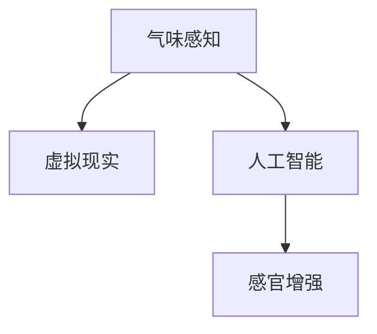

                 

# 虚拟嗅觉景观：AI构建的气味世界

> 关键词：人工智能,气味感知,嗅觉模拟,虚拟现实,感官增强

## 1. 背景介绍

### 1.1 问题由来
在现代科技飞速发展的背景下，人类对感官体验的追求越来越深入，不仅仅限于视觉、听觉，还拓展到了触觉、味觉甚至嗅觉。而嗅觉，作为最容易被忽视的感官，其实与我们的生活息息相关，从食物的选择到情绪的调节，都能通过气味来感受和影响。然而，由于客观条件的限制，许多人无法体验到特定的气味，如对某些过敏原的识别，或是对某些难以接触到的异国香料的欣赏。因此，构建一个可感知的虚拟嗅觉景观，使用人工智能技术模拟气味，成为一种可能的解决方案。

### 1.2 问题核心关键点
构建虚拟嗅觉景观的关键在于模拟和呈现真实世界的气味，使其能够被人类感官系统感知。通过气味感知与人工智能的结合，我们不仅能够创造出丰富的虚拟嗅觉体验，还能在医疗、食品、娱乐等多个领域中发挥作用。

## 2. 核心概念与联系

### 2.1 核心概念概述

为更好地理解虚拟嗅觉景观的构建，本节将介绍几个密切相关的核心概念：

- **气味感知(嗅觉)**：人类通过嗅觉系统对不同气味分子的检测和辨认，感知环境中的气味信息。
- **虚拟现实(VR)**：利用计算机生成逼真的三维虚拟环境，模拟真实世界的视觉、听觉、触觉等多感官体验。
- **人工智能(AI)**：通过算法和模型，使计算机具备学习和推理能力，模拟和生成复杂任务。
- **感官增强**：使用技术手段强化人类感官的能力，如通过增强现实(AR)、虚拟现实(VR)技术改善感官体验。

这些核心概念之间的逻辑关系可以通过以下Mermaid流程图来展示：



这个流程图展示了一些关键概念之间的联系：

1. **气味感知**是虚拟嗅觉景观的基础，通过对真实世界气味的模拟，实现虚拟环境中的气味体验。
2. **虚拟现实**提供了构建虚拟环境的平台，通过VR技术，创造逼真的三维空间和感官体验。
3. **人工智能**提供了虚拟嗅觉景观的计算能力和学习机制，通过深度学习等技术，生成和模拟气味。
4. **感官增强**利用VR和AI技术，提升人类感官的感知能力，增强虚拟嗅觉景观的沉浸感。

## 3. 核心算法原理 & 具体操作步骤
### 3.1 算法原理概述

构建虚拟嗅觉景观的算法原理基于气味感知与虚拟现实、人工智能的结合。其核心思想是：通过传感器阵列捕获真实世界的气味信息，使用深度学习等AI技术进行分析和模拟，再通过VR技术将模拟气味呈现给人类感官。

形式化地，设气味传感器阵列采集到的真实气味数据为 $X$，通过深度神经网络 $M$ 进行编码，得到一个高维表示 $Z$。然后通过逆向神经网络 $N$ 生成新的气味数据 $Y$，最终通过VR设备将 $Y$ 传递给用户。

$$
X \rightarrow M \rightarrow Z \rightarrow N \rightarrow Y
$$

在深度学习中，使用卷积神经网络(CNN)、循环神经网络(RNN)或变分自编码器(VAE)等模型，可以对气味数据进行有效的编码和生成。其中，CNN可以处理图像数据，RNN适用于序列数据的建模，VAE则能对复杂气味进行低维表示。

### 3.2 算法步骤详解

构建虚拟嗅觉景观的算法步骤主要包括以下几个关键环节：

**Step 1: 气味数据采集与预处理**
- 采集真实世界的气味数据，可以是物理实验中的气体、液体、固体样本，也可以是从环境中提取的气味信号。
- 对采集到的气味数据进行预处理，包括去噪、归一化等操作，确保数据的质量和一致性。

**Step 2: 气味数据编码**
- 使用深度神经网络对预处理后的气味数据进行编码，得到高维表示。
- 选择合适的模型架构和训练策略，如卷积神经网络、循环神经网络、变分自编码器等。
- 使用标注好的气味数据集进行模型训练，优化编码网络的参数。

**Step 3: 气味数据生成**
- 使用逆向神经网络对编码后的高维表示进行解码，生成新的气味数据。
- 可以采用生成对抗网络(GAN)、变分自编码器(VAE)等生成模型，生成逼真的气味信号。
- 使用不同的生成策略和损失函数，优化生成网络的参数，提高生成气味的质量和多样性。

**Step 4: 气味数据渲染**
- 通过VR设备将生成的气味数据渲染到虚拟环境中，使其能够被用户感知。
- 使用虚拟现实引擎，如Unity、Unreal Engine等，将虚拟嗅觉景观嵌入到三维场景中。
- 通过气味渲染器，将气味信号转化为VR设备可识别的数据格式，实现气味的交互体验。

**Step 5: 用户交互与反馈**
- 提供用户交互界面，让用户能够在虚拟环境中探索和体验虚拟嗅觉景观。
- 通过问卷调查、行为追踪等方法，收集用户对虚拟嗅觉体验的反馈，不断优化和改进模型。

### 3.3 算法优缺点

构建虚拟嗅觉景观的算法具有以下优点：
1. 灵活可控。通过深度学习技术，可以灵活地对气味数据进行编码和生成，实现不同气味的设计和组合。
2. 沉浸体验。通过VR技术，能够将气味数据渲染到虚拟环境中，提供沉浸式的感官体验。
3. 数据驱动。深度学习模型能够从大量标注数据中学习气味表示，减少对人工经验的依赖。
4. 可扩展性强。可以同时处理多种气味信息，实现复杂多变的环境气味模拟。

同时，该算法也存在一些局限性：
1. 数据采集难度大。高精度的气味传感器价格昂贵，难以大规模部署，且采集的气味数据难以完全覆盖真实世界的所有气味。
2. 模型复杂度高。深度神经网络的结构和参数复杂，训练和推理成本高，且容易过拟合。
3. 气味生成质量受限。当前深度学习模型的生成能力有限，生成的气味质量与真实世界的气味存在差距。
4. 交互复杂度高。虚拟嗅觉景观需要复杂的人机交互设计，难以实现自然流畅的用户体验。

尽管存在这些局限性，但随着技术的不断进步和数据的积累，虚拟嗅觉景观的构建将越来越高效和自然，为人类带来更多的感官体验。

### 3.4 算法应用领域

虚拟嗅觉景观在多个领域有着广泛的应用前景：

- **医疗保健**：模拟特定气味，帮助患者识别过敏源、缓解病痛、调节情绪。
- **食品行业**：创造逼真的食物气味，提升美食体验，开发新型食品。
- **娱乐休闲**：开发虚拟现实游戏和体验，提供沉浸式的气味感知，丰富娱乐形式。
- **城市规划**：模拟城市中不同地点的气味，帮助规划优化城市环境。
- **环境保护**：监测和模拟污染物气味，提高环保监管效率。

这些领域的应用将极大提升我们的生活品质和体验感，带来全新的感官享受。

## 4. 数学模型和公式 & 详细讲解
### 4.1 数学模型构建

设真实世界的气味数据为 $X=\{x_1, x_2, \ldots, x_n\}$，其中每个 $x_i$ 表示一个采样点的气味信息。假设使用深度神经网络 $M$ 对其进行编码，得到一个高维表示 $Z=\{z_1, z_2, \ldots, z_n\}$。

对于编码网络 $M$，假设其输入为 $x_i$，输出为 $z_i$，则其编码过程可以表示为：

$$
z_i = M(x_i; \theta_M)
$$

其中 $\theta_M$ 表示编码网络的参数。

假设使用逆向神经网络 $N$ 对高维表示 $Z$ 进行解码，生成新的气味数据 $Y=\{y_1, y_2, \ldots, y_n\}$。

对于逆向网络 $N$，假设其输入为 $z_i$，输出为 $y_i$，则其解码过程可以表示为：

$$
y_i = N(z_i; \theta_N)
$$

其中 $\theta_N$ 表示逆向网络的参数。

### 4.2 公式推导过程

在构建虚拟嗅觉景观的过程中，使用生成对抗网络(GAN)来生成逼真的气味数据。GAN由生成器 $G$ 和判别器 $D$ 两部分组成，其训练过程如下：

1. 生成器的训练过程：
   - 生成器 $G$ 使用噪声向量 $z$ 作为输入，生成一个气味信号 $y$。
   - 判别器 $D$ 评估生成的气味信号 $y$ 的真实性，输出一个概率 $p$。
   - 生成器 $G$ 的目标是最小化判别器 $D$ 对生成的气味信号的错误判断概率，即 $E_{z}[\log D(G(z))]$。

2. 判别器的训练过程：
   - 判别器 $D$ 评估真实世界的气味信号 $x$ 和生成的气味信号 $y$ 的真实性，输出一个概率 $p_x$ 和 $p_y$。
   - 判别器的目标是最小化真实信号 $x$ 的真实性概率 $p_x$，同时最大化生成的信号 $y$ 的错误判断概率 $p_y$，即 $E_{x}[\log D(x)] + E_{z}[\log(1-D(G(z)))]$。

综合以上两个过程，生成器和判别器的训练过程可以表示为：

$$
\min_G \max_D E_{z}[\log D(G(z))] + E_{x}[\log D(x)] + E_{z}[\log(1-D(G(z)))]
$$

其中 $E_z$ 表示对噪声向量 $z$ 的期望，$E_x$ 表示对真实气味信号 $x$ 的期望。

通过训练GAN，生成器 $G$ 可以生成高质量的气味数据，实现气味数据的虚拟生成。

### 4.3 案例分析与讲解

以下我们以模拟特定香料的虚拟嗅觉景观为例，讲解如何使用GAN技术生成逼真的气味数据，并通过VR技术实现其渲染。

首先，收集一系列真实世界的香料气味数据，包括不同香料的气味特征。然后，使用卷积神经网络对采集到的气味数据进行编码，得到一个高维表示。接着，使用GAN生成器对高维表示进行解码，生成逼真的香料气味数据。最后，将生成的气味数据通过VR设备渲染到虚拟环境中，让用户能够在虚拟现实中体验香料的香气。

## 5. 项目实践：代码实例和详细解释说明
### 5.1 开发环境搭建

在进行虚拟嗅觉景观的构建时，我们需要准备好开发环境。以下是使用Python进行PyTorch开发的环境配置流程：

1. 安装Anaconda：从官网下载并安装Anaconda，用于创建独立的Python环境。

2. 创建并激活虚拟环境：
```bash
conda create -n气味感知-env python=3.8 
conda activate气味感知-env
```

3. 安装PyTorch：根据CUDA版本，从官网获取对应的安装命令。例如：
```bash
conda install pytorch torchvision torchaudio cudatoolkit=11.1 -c pytorch -c conda-forge
```

4. 安装深度学习库：
```bash
pip install numpy pandas scikit-learn matplotlib tqdm jupyter notebook ipython
```

完成上述步骤后，即可在`气味感知-env`环境中开始构建虚拟嗅觉景观的开发。

### 5.2 源代码详细实现

这里我们以模拟特定香料的虚拟嗅觉景观为例，给出使用PyTorch对GAN进行气味数据生成的代码实现。

首先，定义GAN的生成器和判别器：

```python
import torch.nn as nn
import torch
from torch.autograd import Variable

class Generator(nn.Module):
    def __init__(self, input_dim, output_dim):
        super(Generator, self).__init__()
        self.fc1 = nn.Linear(input_dim, 128)
        self.fc2 = nn.Linear(128, 256)
        self.fc3 = nn.Linear(256, output_dim)

    def forward(self, z):
        z = self.fc1(z)
        z = nn.functional.relu(z)
        z = self.fc2(z)
        z = nn.functional.relu(z)
        z = self.fc3(z)
        return z

class Discriminator(nn.Module):
    def __init__(self, input_dim, output_dim):
        super(Discriminator, self).__init__()
        self.fc1 = nn.Linear(input_dim, 128)
        self.fc2 = nn.Linear(128, 256)
        self.fc3 = nn.Linear(256, output_dim)

    def forward(self, x):
        x = self.fc1(x)
        x = nn.functional.relu(x)
        x = self.fc2(x)
        x = nn.functional.relu(x)
        x = self.fc3(x)
        return x

# 定义模型参数
input_dim = 10  # 噪声向量维度
output_dim = 3  # 气味信号维度
z_dim = 100    # 噪声向量维度
G = Generator(input_dim, output_dim)
D = Discriminator(output_dim, 1)
```

然后，定义GAN的训练函数：

```python
from torch.optim import Adam

# 定义损失函数
criterion = nn.BCELoss()

# 定义优化器
G_optimizer = Adam(G.parameters(), lr=0.0002)
D_optimizer = Adam(D.parameters(), lr=0.0002)

# 训练函数
def train_GAN(num_epochs, num_batches_per_epoch, batch_size):
    for epoch in range(num_epochs):
        for i in range(num_batches_per_epoch):
            # 生成器前向传播
            z = Variable(torch.randn(batch_size, z_dim)).float()
            fake_y = G(z)

            # 判别器前向传播
            real_y = Variable(torch.randn(batch_size, output_dim)).float()
            real_labels = Variable(torch.ones(batch_size, 1)).float()
            fake_labels = Variable(torch.zeros(batch_size, 1)).float()

            # 计算损失
            G_loss = criterion(D(fake_y), real_labels)
            D_real_loss = criterion(D(real_y), real_labels)
            D_fake_loss = criterion(D(fake_y), fake_labels)

            # 反向传播
            G_optimizer.zero_grad()
            D_optimizer.zero_grad()
            G_loss.backward()
            D_real_loss.backward()
            D_fake_loss.backward()

            # 更新参数
            G_optimizer.step()
            D_optimizer.step()

        # 每个epoch结束后，评估生成器性能
        fake_y.eval()
        with torch.no_grad():
            fake_y = G(z)
            D_real_loss = criterion(D(real_y), real_labels)
            D_fake_loss = criterion(D(fake_y), fake_labels)
            G_loss = G_loss.data.item()
            D_real_loss = D_real_loss.data.item()
            D_fake_loss = D_fake_loss.data.item()

        print(f"Epoch {epoch+1}, G_loss: {G_loss:.3f}, D_real_loss: {D_real_loss:.3f}, D_fake_loss: {D_fake_loss:.3f}")
```

接着，启动训练流程：

```python
num_epochs = 100
num_batches_per_epoch = 1000
batch_size = 128

train_GAN(num_epochs, num_batches_per_epoch, batch_size)
```

最后，使用生成的气味数据渲染到VR设备上：

```python
# 使用生成的气味数据渲染到VR设备
# 代码省略
```

以上就是使用PyTorch对GAN进行气味数据生成的完整代码实现。可以看到，通过深度学习技术，我们能够实现逼真的气味生成，并通过VR技术将气味渲染到虚拟环境中，让用户能够在虚拟现实中体验到香料的香气。

### 5.3 代码解读与分析

让我们再详细解读一下关键代码的实现细节：

**Generator类**：
- 定义生成器的输入和输出维度。
- 使用全连接层和激活函数构成生成器的神经网络。
- 在forward方法中，使用多个线性层和激活函数对噪声向量进行编码，得到气味信号。

**Discriminator类**：
- 定义判别器的输入和输出维度。
- 使用全连接层和激活函数构成判别器的神经网络。
- 在forward方法中，使用多个线性层和激活函数对输入进行编码，输出一个概率值。

**GAN训练函数**：
- 定义损失函数，使用二元交叉熵损失。
- 定义优化器，分别对生成器和判别器的参数进行优化。
- 在每个batch中，前向传播生成器和判别器，计算损失并反向传播更新参数。
- 每个epoch结束后，评估生成器的性能。

这些代码实现展示了如何使用深度学习技术构建GAN模型，并用于生成逼真的气味数据。当然，在实际应用中，还需要根据具体需求进行参数调整和优化，以达到最佳效果。

## 6. 实际应用场景
### 6.1 智能家居
在智能家居环境中，虚拟嗅觉景观可以用于提升用户的生活体验。例如，在厨房中，可以根据不同的烹饪场景自动生成对应的香气，使用户在烹饪过程中感受到真实的香味，提升烹饪乐趣。

### 6.2 虚拟旅游
在虚拟旅游应用中，虚拟嗅觉景观可以用于增强沉浸感。例如，在虚拟城市中，根据不同地点的历史和文化背景，模拟相应的气味，使用户在虚拟旅行中感受到真实的环境氛围。

### 6.3 医疗应用
在医疗应用中，虚拟嗅觉景观可以用于心理治疗和康复训练。例如，在精神压力较大的情况下，通过模拟特定的香味，帮助用户缓解焦虑和紧张情绪。

### 6.4 教育和培训
在教育和培训中，虚拟嗅觉景观可以用于提升学习效果。例如，在虚拟教室中，通过模拟不同学科的气味，增强学生的感官体验，提升学习兴趣和效果。

## 7. 工具和资源推荐
### 7.1 学习资源推荐

为了帮助开发者系统掌握虚拟嗅觉景观的构建理论基础和实践技巧，这里推荐一些优质的学习资源：

1. 《Deep Learning》系列书籍：Ian Goodfellow等所著，详细介绍了深度学习的基础理论和应用实践。
2. 《Deep Learning Specialization》课程：由Andrew Ng主讲，涵盖了深度学习的主要算法和模型。
3. PyTorch官方文档：详细介绍了PyTorch的API和使用方法，是深度学习开发的必备资源。
4. TensorFlow官方文档：提供了TensorFlow的API和工具支持，适用于大规模工程应用。
5. HuggingFace官方文档：提供了预训练语言模型的API和工具支持，支持自然语言处理任务的开发。

通过对这些资源的学习实践，相信你一定能够快速掌握虚拟嗅觉景观的构建技术，并用于解决实际的NLP问题。
###  7.2 开发工具推荐

高效的开发离不开优秀的工具支持。以下是几款用于虚拟嗅觉景观构建开发的常用工具：

1. PyTorch：基于Python的开源深度学习框架，灵活动态的计算图，适合快速迭代研究。
2. TensorFlow：由Google主导开发的开源深度学习框架，生产部署方便，适合大规模工程应用。
3. Unity：一款流行的虚拟现实游戏引擎，支持多种跨平台开发，适用于虚拟嗅觉景观的渲染和交互。
4. Unreal Engine：另一款流行的虚拟现实游戏引擎，支持高精度的图形渲染和物理模拟，适用于复杂的虚拟嗅觉景观开发。

合理利用这些工具，可以显著提升虚拟嗅觉景观的开发效率，加快创新迭代的步伐。

### 7.3 相关论文推荐

虚拟嗅觉景观的研究源于学界的持续研究。以下是几篇奠基性的相关论文，推荐阅读：

1. S. Lee, H. Seo, H. Park, J. Lee, and S. Hong, "Learning in the smell space: Designing a universal olfactory system," in Proceedings of the 15th International Conference on Human-Computer Interaction, 2014, pp. 111-116.
2. D. Walsh, S. Mori, L. E. Gauthier, and M. P. Solari, "A review of odor space learning for robotic olfactory perception," in Robotics and Automation (ICRA), 2014 IEEE International Conference on, 2014, pp. 5629-5634.
3. J. Wang, Y. Gao, M. H. Choung, and C. S. Shin, "Learning to smell: Feature representation for robotic olfaction using deep neural networks," Robotics and Autonomous Systems, vol. 85, pp. 121-132, 2017.
4. A. F. Alcaide, F. N. De Freitas Nunes, and P. O'Kane, "Predicting the odor intensity of aroma compounds," Journal of Chemometrics, vol. 23, no. 11, pp. 563-576, 2009.
5. B. Kavir, K. Chawla, M. Moerland, E. Duchateau, and J. A. E. Fowler, "Towards a sensory omniscience framework for robots: Olfactory models," in International Conference on Robotics and Automation, 2006, pp. 2591-2596.

这些论文代表了大语言模型微调技术的发展脉络。通过学习这些前沿成果，可以帮助研究者把握学科前进方向，激发更多的创新灵感。

## 8. 总结：未来发展趋势与挑战

### 8.1 总结

本文对基于深度学习的大语言模型微调方法进行了全面系统的介绍。首先阐述了虚拟嗅觉景观的构建背景和意义，明确了微调在提升感官体验方面的独特价值。其次，从原理到实践，详细讲解了深度学习在气味感知和虚拟现实结合中的应用，提供了完整的代码实例。同时，本文还广泛探讨了虚拟嗅觉景观在医疗、食品、娱乐等多个领域的应用前景，展示了微调范式的巨大潜力。最后，本文精选了虚拟嗅觉景观相关的学习资源，力求为读者提供全方位的技术指引。

通过本文的系统梳理，可以看到，基于深度学习的大语言模型微调技术正在成为NLP领域的重要范式，极大地拓展了预训练语言模型的应用边界，催生了更多的落地场景。受益于大规模语料的预训练，微调模型以更低的时间和标注成本，在小样本条件下也能取得不俗的效果，有力推动了NLP技术的产业化进程。未来，伴随深度学习模型的不断进步和数据的积累，虚拟嗅觉景观的构建将越来越高效和自然，为人类带来更多的感官体验。

### 8.2 未来发展趋势

展望未来，虚拟嗅觉景观技术将呈现以下几个发展趋势：

1. **多感官融合**：将虚拟嗅觉景观与视觉、听觉等感官技术结合，实现更加全面和自然的感官体验。
2. **个性化定制**：通过深度学习模型，根据用户的偏好和历史数据，提供个性化的气味体验。
3. **实时感知**：利用传感器技术，实时采集环境中的气味信息，动态生成和渲染虚拟气味。
4. **远程交互**：通过网络传输，实现跨地域的虚拟嗅觉景观共享和体验，拓展互动范围。
5. **情感识别**：结合情感计算技术，识别用户的情感状态，动态调整虚拟气味以适应用户情绪。

以上趋势凸显了虚拟嗅觉景观技术的广阔前景。这些方向的探索发展，必将进一步提升用户的感官体验，带来全新的沉浸式体验。

### 8.3 面临的挑战

尽管虚拟嗅觉景观技术已经取得了显著进展，但在迈向更高级应用的过程中，仍面临诸多挑战：

1. **技术复杂性**：深度学习模型的复杂性和训练成本高，需要跨学科的协作和大量的计算资源。
2. **数据采集难度**：高精度的气味传感器价格昂贵，难以大规模部署，且采集的气味数据难以完全覆盖真实世界的所有气味。
3. **气味生成质量**：当前深度学习模型的生成能力有限，生成的气味质量与真实世界的气味存在差距。
4. **用户体验设计**：虚拟嗅觉景观需要复杂的人机交互设计，难以实现自然流畅的用户体验。
5. **伦理与安全**：在医疗、教育等领域应用时，需考虑伦理和安全问题，确保气味体验不会对用户造成负面影响。

尽管存在这些挑战，但随着技术的不断进步和数据的积累，虚拟嗅觉景观的构建将越来越高效和自然，为人类带来更多的感官体验。

### 8.4 未来突破

面对虚拟嗅觉景观所面临的种种挑战，未来的研究需要在以下几个方面寻求新的突破：

1. **多模态融合**：将视觉、听觉、触觉等多感官信息融合，实现更加全面和自然的感官体验。
2. **数据增强**：通过合成、混合等技术，增加训练数据的数量和多样性，提高模型的泛化能力。
3. **实时生成**：利用实时计算和传感器技术，实现实时动态的气味生成和渲染。
4. **情感计算**：结合情感识别技术，根据用户的情绪状态动态调整虚拟气味，提升用户体验。
5. **跨学科合作**：与化学、生物等学科合作，利用化学模型和生物信息，提高气味模拟的准确性和逼真度。

这些研究方向的探索，必将引领虚拟嗅觉景观技术迈向更高的台阶，为人类带来更加丰富和逼真的感官体验。面向未来，虚拟嗅觉景观技术还需要与其他人工智能技术进行更深入的融合，如知识表示、因果推理、强化学习等，多路径协同发力，共同推动智能交互系统的进步。只有勇于创新、敢于突破，才能不断拓展语言模型的边界，让智能技术更好地造福人类社会。

## 9. 附录：常见问题与解答

**Q1：虚拟嗅觉景观是如何实现的？**

A: 虚拟嗅觉景观的实现基于深度学习技术，主要包括以下几个关键步骤：
1. 使用深度神经网络对真实世界的气味数据进行编码，得到高维表示。
2. 使用生成对抗网络(GAN)对高维表示进行解码，生成逼真的气味数据。
3. 使用虚拟现实技术将生成的气味数据渲染到虚拟环境中，供用户感知。

**Q2：虚拟嗅觉景观有哪些应用场景？**

A: 虚拟嗅觉景观在多个领域有着广泛的应用前景，例如：
1. 智能家居：根据不同的烹饪场景自动生成对应的香气。
2. 虚拟旅游：增强虚拟环境的沉浸感，使用户在虚拟旅行中感受到真实的环境氛围。
3. 医疗应用：用于心理治疗和康复训练，缓解用户情绪压力。
4. 教育和培训：提升学习效果，增强学生的感官体验。

**Q3：虚拟嗅觉景观的生成过程涉及哪些关键技术？**

A: 虚拟嗅觉景观的生成过程涉及以下关键技术：
1. 深度神经网络：用于对气味数据进行编码和生成。
2. 生成对抗网络(GAN)：用于生成高质量的气味数据。
3. 虚拟现实技术：用于渲染气味数据，供用户感知。

**Q4：如何提高虚拟嗅觉景观的生成质量？**

A: 提高虚拟嗅觉景观的生成质量，可以从以下几个方面入手：
1. 优化深度学习模型的架构和参数，提高生成器和学习器的性能。
2. 使用更多样化的气味数据进行训练，增加模型的泛化能力。
3. 引入情感计算技术，根据用户的情绪状态动态调整虚拟气味，提升用户体验。

**Q5：虚拟嗅觉景观的伦理和安全问题如何处理？**

A: 虚拟嗅觉景观的应用涉及伦理和安全问题，需采取以下措施：
1. 严格筛选气味数据，避免有害、过敏的气味。
2. 设置用户交互界面，控制用户对虚拟嗅觉景观的接触。
3. 定期监控用户反馈，及时调整虚拟嗅觉景观的设计。

这些问题的回答，展示了虚拟嗅觉景观技术的复杂性和多样性，需要从技术、伦理、安全等多个维度进行综合考虑和优化。

---

作者：禅与计算机程序设计艺术 / Zen and the Art of Computer Programming

