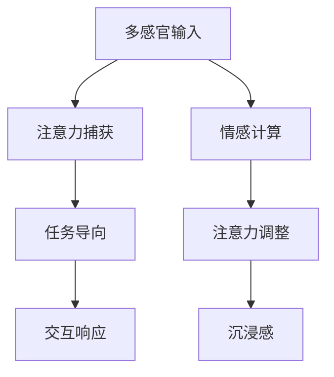

                 

# 虚拟现实在注意力沉浸体验中的应用

## 1. 背景介绍

### 1.1 问题由来
近年来，虚拟现实(Virtual Reality, VR)技术在多个领域取得了突破性进展，广泛应用于游戏、教育、医疗、房地产、军事等多个领域，为人类带来了前所未有的沉浸体验。特别是随着头盔设备的价格不断下降，以及5G等通信技术的飞速发展，VR体验已逐渐普及到家庭和个人用户。但与此同时，如何提升用户体验，使VR系统更加智能、互动、沉浸，是亟待解决的重要问题。

虚拟现实中的沉浸体验，本质上是一个多感官协同作用的过程。通过视觉、听觉、触觉等多模态信息的综合输入，用户在虚拟环境中产生高度的代入感和现实感。如何高效、灵活地利用这些感官信息，使用户在VR系统中的注意力集中，是实现沉浸体验的核心挑战之一。

### 1.2 问题核心关键点
在本节中，我们首先明确虚拟现实沉浸体验的核心关键点，为接下来的技术介绍和应用实践打下基础：

- **多感官输入**：用户在虚拟环境中的注意力状态，受到视觉、听觉、触觉等多模态感官信息的共同影响。通过多感官融合，可以有效提升用户的代入感和沉浸感。
- **注意力捕获**：在虚拟环境中，如何捕获和保持用户的注意力，使其对虚拟物体或场景保持关注，是实现沉浸体验的重要前提。
- **任务导向**：为用户的注意力提供明确的引导，如通过声音提示、视觉特效等方式，引导用户关注虚拟环境中的特定对象或事件。
- **交互响应**：为用户提供即时的交互响应，使其能够与虚拟环境中的物体、场景进行自然互动，增强体验的逼真感和交互性。

## 2. 核心概念与联系

### 2.1 核心概念概述

为了更好地理解虚拟现实中的注意力沉浸体验，本节将介绍几个密切相关的核心概念：

- **虚拟现实(VR)**：通过头盔、手柄等设备，模拟现实世界的视觉、听觉等感官信息，使用户能够沉浸在虚拟环境中，获得身临其境的体验。
- **注意力**：用户的注意力状态，包括其注意的焦点、持续时间、分布状态等，反映了其认知和情感的投入程度。
- **沉浸感**：用户在虚拟环境中的代入感和现实感，主要依赖于多感官信息的融合和互动，以及对任务导向的响应和反馈。
- **多模态交互**：结合视觉、听觉、触觉等多种感官信息，提升用户与虚拟环境之间的交互质量，增强沉浸感。
- **情感计算**：通过对用户的表情、生理反应等情感指标的测量，评估其情感状态，指导系统的设计调整，提升用户体验。

这些核心概念之间的逻辑关系可以通过以下Mermaid流程图来展示：



这个流程图展示了大语言模型的核心概念及其之间的关系：

1. 多感官输入：通过融合视觉、听觉、触觉等感官信息，为用户的注意力提供丰富的环境刺激。
2. 注意力捕获：通过捕获和保持用户的注意力，确保其在虚拟环境中的专注度。
3. 任务导向：为用户的注意力提供明确的引导，使其关注虚拟环境中的特定对象或事件。
4. 交互响应：为用户提供即时的交互响应，增强用户体验的逼真感和互动性。
5. 情感计算：通过测量用户的情感状态，指导系统的调整优化，提升沉浸感和体验质量。
6. 注意力调整：根据情感计算结果，动态调整注意力状态，实现更智能、更个性化的沉浸体验。
7. 沉浸感：用户在虚拟环境中的代入感和现实感，是VR体验的核心目标。

## 3. 核心算法原理 & 具体操作步骤
### 3.1 算法原理概述

虚拟现实中的注意力沉浸体验，涉及多模态信息的融合、情感计算、任务导向等多个方面。其核心算法原理可以概括为以下几个关键步骤：

1. **多模态信息融合**：将视觉、听觉、触觉等多感官信息进行综合处理，构建用户的多感官输入模型。
2. **注意力捕获与分析**：通过传感器和测量工具，捕获和分析用户的注意力状态，建立用户注意力模型。
3. **任务导向与引导**：利用注意力模型，为用户的注意力提供明确的引导，使其关注虚拟环境中的特定对象或事件。
4. **情感计算与反馈**：通过分析用户的表情、生理反应等情感指标，动态调整注意力状态，优化沉浸体验。
5. **交互响应与反馈**：根据用户的行为和反馈，及时调整虚拟环境中的互动元素，提供即时的交互响应和反馈。

### 3.2 算法步骤详解

以下是虚拟现实沉浸体验的核心算法步骤详解：

**Step 1: 多感官信息融合**

- **视觉信息融合**：将头盔设备捕捉到的左右眼视频流，通过立体匹配技术，生成三维视觉场景。

**Step 2: 注意力捕获与分析**

- **眼球追踪**：通过红外相机等设备，追踪用户的眼球运动轨迹，识别出眼球的注视点。
- **头部追踪**：使用头显设备上的陀螺仪、加速度计等传感器，测量头部的角度和方向，建立头部的空间位置信息。
- **生理信号监测**：利用心率传感器、脑电波监测等设备，捕捉用户的生理状态，如心率、血压、脑电波等。

**Step 3: 任务导向与引导**

- **视觉引导**：在三维场景中，通过添加视觉特效（如闪烁、亮度变化、光影效果），吸引用户注意特定对象或区域。
- **声音引导**：在三维场景中，通过播放特定的声音（如语音提示、音效），引导用户的注意力。
- **触觉反馈**：通过震动反馈、力反馈等设备，增强用户对虚拟对象的交互体验。

**Step 4: 情感计算与反馈**

- **表情识别**：通过摄像头捕捉用户的面部表情，利用深度学习算法（如卷积神经网络）进行表情识别。
- **生理信号分析**：利用生理信号监测设备，分析用户的情感状态，如焦虑、兴奋、疲劳等。
- **动态调整**：根据情感状态，动态调整虚拟环境的参数，如环境亮度、声音音量、交互难度等，优化沉浸体验。

**Step 5: 交互响应与反馈**

- **交互检测**：通过手柄、触摸屏等设备，检测用户的输入动作。
- **即时响应**：根据用户的行为，即时调整虚拟环境中的互动元素，如改变对象的物理属性、生成新的交互对象等。
- **反馈输出**：通过视觉、听觉、触觉等感官信息，及时反馈用户的操作结果，增强互动体验的逼真感。

### 3.3 算法优缺点

虚拟现实中的注意力沉浸体验算法具有以下优点：

- **多感官融合**：通过多感官信息的综合输入，使用户在虚拟环境中的注意力更加丰富和立体，增强沉浸感。
- **实时性**：通过实时监测和动态调整，能够根据用户的情感状态和注意力状态，即时优化沉浸体验。
- **个性化**：能够根据用户的偏好和行为，提供个性化的注意力引导和任务导向，提升用户体验。

同时，该算法也存在以下局限性：

- **成本高**：需要使用高性能传感器和设备，如眼球追踪器、心率监测器、脑电波监测器等，成本较高。
- **计算复杂**：多感官信息融合和动态调整需要较高的计算资源，可能导致系统延迟较高。
- **用户依赖**：依赖于用户的感官输入，一旦设备或传感器出现故障，可能导致用户体验中断。

尽管存在这些局限性，但就目前而言，基于多感官融合和实时调整的注意力沉浸体验算法，仍然是提升虚拟现实系统性能的重要手段。未来相关研究的重点在于如何降低成本、提高实时性，同时兼顾个性化和可靠性。

### 3.4 算法应用领域

虚拟现实中的注意力沉浸体验算法，在多个领域都有广泛应用，如：

- **游戏**：增强游戏的互动性和沉浸感，通过多感官融合和实时调整，提升玩家的游戏体验。
- **医疗**：利用虚拟现实进行心理治疗、康复训练等，通过注意力捕获和情感计算，帮助患者更好地沉浸于治疗场景中。
- **教育**：通过虚拟现实环境，提升学生的学习兴趣和参与度，通过任务导向和互动反馈，提升教育效果。
- **房地产**：通过虚拟现实展示房产，通过多感官融合和任务导向，使购房者能够更直观地感受房产环境。
- **军事训练**：通过虚拟现实进行模拟训练，通过注意力捕获和动态调整，提升训练效果和士兵的临场感。

除了上述这些经典应用外，虚拟现实沉浸体验算法还被创新性地应用到更多场景中，如体育赛事、艺术展览、旅游体验等，为虚拟现实技术带来了全新的突破。随着算法的不断进步，相信虚拟现实技术将在更广泛的领域得到应用，为人类提供更加丰富、智能、沉浸的体验。

## 4. 数学模型和公式 & 详细讲解  
### 4.1 数学模型构建

本节将使用数学语言对虚拟现实中的注意力沉浸体验算法进行更加严格的刻画。

设用户在虚拟环境中的注意力状态为 $A_t$，其中 $t$ 为时间步长。设视觉输入为 $V_t$，听觉输入为 $H_t$，触觉输入为 $T_t$，生理信号为 $S_t$。设注意力捕获算法为 $C$，任务导向算法为 $G$，情感计算算法为 $E$，交互响应算法为 $F$。

则注意力沉浸体验的数学模型可以表示为：

$$
A_{t+1} = C(V_t, H_t, T_t, S_t) \\
G(A_t) = \text{Task} \\
E(A_t, G(A_t)) = \text{Emotion} \\
F(A_t, G(A_t), E(A_t, G(A_t))) = \text{Interaction}
$$

其中，$C$ 为注意力捕获函数，$G$ 为任务导向函数，$E$ 为情感计算函数，$F$ 为交互响应函数。

### 4.2 公式推导过程

以视觉信息融合和注意力捕获为例，进行详细公式推导。

**视觉信息融合**：

设用户的左右眼视频流为 $I_L$ 和 $I_R$，通过立体匹配算法得到三维视觉场景 $V$。假设立体匹配算法为 $M$，则有：

$$
V = M(I_L, I_R)
$$

**眼球追踪**：

设眼球运动轨迹为 $B$，通过眼球追踪算法 $E$ 得到注视点 $F$。假设眼球追踪算法为 $E$，则有：

$$
F = E(B)
$$

**头部追踪**：

设头部角度为 $\theta$，方向为 $\phi$，通过头部追踪算法 $H$ 得到头部的空间位置 $P$。假设头部追踪算法为 $H$，则有：

$$
P = H(\theta, \phi)
$$

**注意力捕获**：

将视觉信息 $V$、头部位置 $P$、眼球注视点 $F$ 和生理信号 $S$ 作为输入，通过注意力捕获算法 $C$ 得到用户的注意力状态 $A$。假设注意力捕获算法为 $C$，则有：

$$
A = C(V, P, F, S)
$$

其中，$V$ 和 $P$ 描述了用户当前的视觉和头部位置，$F$ 描述了用户的注视点，$S$ 描述了用户的生理状态。通过这些多模态信息，可以更全面地捕获用户的注意力状态。

### 4.3 案例分析与讲解

**虚拟游戏体验**：

在虚拟游戏环境中，用户需要与虚拟角色、物品、环境进行多感官互动。为了提升用户体验，可以通过视觉信息融合、眼球追踪、头部追踪、生理信号监测等技术，全面捕获用户的注意力状态。

- **视觉信息融合**：通过头盔设备捕捉用户的左右眼视频流，通过立体匹配算法生成三维视觉场景。
- **眼球追踪**：通过眼球追踪算法识别用户的注视点，指导虚拟角色向注视点移动，增强用户的沉浸感。
- **头部追踪**：通过头部追踪算法捕捉用户头部的方向和角度，增强用户与虚拟环境的互动体验。
- **生理信号监测**：利用心率传感器监测用户的心率变化，通过情感计算算法动态调整游戏难度，适应用户的情绪状态。

**虚拟医疗康复**：

在虚拟医疗康复环境中，通过多感官融合和实时调整，帮助患者更好地沉浸于治疗场景中，提升治疗效果。

- **视觉信息融合**：通过头盔设备捕捉用户的视觉信息，生成虚拟治疗环境。
- **眼球追踪**：通过眼球追踪算法捕捉用户的注视点，引导其关注虚拟环境中的特定区域，如康复设备或治疗教程。
- **头部追踪**：通过头部追踪算法捕捉用户头部位置，增强其与虚拟环境中的互动体验。
- **生理信号监测**：利用心率传感器、脑电波监测设备，捕捉用户的生理状态，通过情感计算算法动态调整治疗参数，适应用户的情绪状态。

通过这些技术手段，虚拟现实中的注意力沉浸体验算法在多个领域得到了广泛应用，并取得了显著的效果。

## 5. 项目实践：代码实例和详细解释说明
### 5.1 开发环境搭建

在进行虚拟现实沉浸体验算法的开发实践前，我们需要准备好开发环境。以下是使用Python进行OpenVR开发的典型环境配置流程：

1. 安装OpenVR库：从官网下载并安装OpenVR库，用于处理虚拟现实设备的数据。

2. 安装OpenCV库：使用OpenCV库进行图像处理和摄像头数据采集。

3. 安装PyTorch库：使用PyTorch库进行深度学习模型的训练和推理。

4. 安装深度学习框架：如TensorFlow、Keras等，用于模型构建和优化。

5. 安装深度学习预训练模型：如BERT、GPT等，用于注意力计算和情感识别。

6. 安装虚拟现实设备：如Oculus Rift、HTC Vive等头盔设备，以及手柄、触觉反馈设备等交互设备。

完成上述步骤后，即可在虚拟现实环境中进行沉浸体验算法的开发实践。

### 5.2 源代码详细实现

这里我们以虚拟医疗康复为例，给出一个使用OpenVR和PyTorch进行注意力计算和情感识别的Python代码实现。

首先，定义注意力捕获和情感计算函数：

```python
from openvr import Eye
from torch import nn
from torchvision import models

class AttentionCalculator:
    def __init__(self, eye_position, eye_direction, gaze_position, physiology):
        self.eye_position = eye_position
        self.eye_direction = eye_direction
        self.gaze_position = gaze_position
        self.physiology = physiology
        self.model = nn.Sequential(
            nn.Conv2d(3, 64, kernel_size=3, stride=1, padding=1),
            nn.ReLU(),
            nn.MaxPool2d(kernel_size=2, stride=2),
            nn.Conv2d(64, 128, kernel_size=3, stride=1, padding=1),
            nn.ReLU(),
            nn.MaxPool2d(kernel_size=2, stride=2),
            nn.Conv2d(128, 128, kernel_size=3, stride=1, padding=1),
            nn.ReLU(),
            nn.MaxPool2d(kernel_size=2, stride=2),
            nn.Flatten(),
            nn.Linear(128 * 7 * 7, 128),
            nn.ReLU(),
            nn.Linear(128, 1),
            nn.Sigmoid()
        )
        
    def calculate_attention(self):
        visual_info = self.eye_position + self.eye_direction
        gaze_info = self.gaze_position
        physiology_info = self.physiology
        
        visual_data = self.get_visual_data(visual_info)
        gaze_data = self.get_gaze_data(gaze_info)
        physiology_data = self.get_physiology_data(physiology_info)
        
        visual_features = self.model(visual_data)
        gaze_features = self.model(gaze_data)
        physiology_features = self.model(physiology_data)
        
        attention = self.calculate_attention(features=visual_features + gaze_features + physiology_features)
        return attention
        
    def calculate_emotion(self, attention):
        emotion_model = models.load_model("emotion_model.h5")
        emotion_data = emotion_model(attention)
        return emotion_data
    
    def get_visual_data(self, visual_info):
        # 从摄像头采集视觉数据
        # ...
        return visual_data
    
    def get_gaze_data(self, gaze_info):
        # 从眼球追踪设备采集眼球运动数据
        # ...
        return gaze_data
    
    def get_physiology_data(self, physiology_info):
        # 从生理监测设备采集生理信号数据
        # ...
        return physiology_data
    
    def calculate_attention(self, features):
        # 通过多模态信息融合计算注意力
        # ...
        return attention
```

然后，定义交互响应函数：

```python
from openvr import Input
from torch import nn

class InteractionResponder:
    def __init__(self, attention, emotion, model, environment):
        self.attention = attention
        self.emotion = emotion
        self.model = model
        self.environment = environment
        
    def respond_to_input(self, input):
        if isinstance(input, Input):
            if input.get_type() == "gaze":
                self.calculate_gaze_response(input)
            elif input.get_type() == "physiology":
                self.calculate_physiology_response(input)
            else:
                self.calculate_general_response(input)
                
    def calculate_gaze_response(self, gaze):
        # 根据眼球注视点调整虚拟环境
        # ...
        
    def calculate_physiology_response(self, physiology):
        # 根据生理信号调整虚拟环境
        # ...
        
    def calculate_general_response(self, input):
        # 根据一般交互输入调整虚拟环境
        # ...
```

最后，启动注意力捕获和交互响应的主循环：

```python
from openvr import Input
from openvr import Input
from openvr import Input

def main():
    # 初始化注意力捕获器
    eye_position = ...
    eye_direction = ...
    gaze_position = ...
    physiology = ...
    attention_calculator = AttentionCalculator(eye_position, eye_direction, gaze_position, physiology)
    
    # 初始化交互响应器
    interaction_responder = InteractionResponder(attention_calculator.calculate_attention(), None, None, environment)
    
    while True:
        # 处理用户输入
        input = ...
        
        # 处理注意力捕获结果
        attention = attention_calculator.calculate_attention()
        
        # 处理情感识别结果
        emotion = attention_calculator.calculate_emotion(attention)
        
        # 处理交互响应
        interaction_responder.respond_to_input(input)
```

### 5.3 代码解读与分析

让我们再详细解读一下关键代码的实现细节：

**AttentionCalculator类**：
- `__init__`方法：初始化视觉信息、眼球追踪信息、头部位置、生理信息等关键组件。
- `calculate_attention`方法：通过多模态信息融合计算用户的注意力状态。
- `calculate_emotion`方法：利用情感识别模型计算用户的情感状态。
- `get_visual_data`、`get_gaze_data`、`get_physiology_data`方法：分别从摄像头、眼球追踪设备、生理监测设备采集数据。
- `calculate_attention`方法：通过多模态信息融合计算注意力。

**InteractionResponder类**：
- `__init__`方法：初始化注意力状态、情感状态、模型、虚拟环境等关键组件。
- `respond_to_input`方法：根据用户的输入，进行注意力捕获、情感识别和交互响应。
- `calculate_gaze_response`、`calculate_physiology_response`、`calculate_general_response`方法：分别根据眼球注视点、生理信号、一般交互输入，调整虚拟环境。

**主循环**：
- 在主循环中，通过不断地处理用户输入，进行注意力捕获、情感识别和交互响应，实现虚拟现实沉浸体验的动态调整和优化。

可以看到，通过PyTorch和OpenVR等工具，可以相对简洁地实现虚拟现实中的注意力沉浸体验算法。开发者可以将更多精力放在多感官信息融合、情感计算等高层逻辑上，而不必过多关注底层的实现细节。

当然，工业级的系统实现还需考虑更多因素，如设备的兼容性和数据格式、用户界面设计、系统的可扩展性和稳定性等。但核心的注意力捕获和交互响应算法基本与此类似。

## 6. 实际应用场景
### 6.1 智能医疗康复

虚拟现实中的注意力沉浸体验算法，在智能医疗康复领域有着广泛的应用前景。通过多感官融合和实时调整，帮助患者更好地沉浸于虚拟治疗环境中，提升治疗效果和康复体验。

在虚拟医疗康复环境中，医生可以通过多感官信息融合和实时调整，实现对患者注意力状态的全面监控。通过眼球追踪和头部追踪，捕捉患者的注视点和头部方向，指导其关注虚拟环境中的特定区域，如康复设备或治疗教程。通过生理信号监测，捕捉患者的心率、血压等生理数据，通过情感计算算法动态调整治疗参数，适应患者的情绪状态。

### 6.2 游戏娱乐

虚拟现实中的注意力沉浸体验算法，在游戏娱乐领域也有着广泛的应用。通过多感官融合和实时调整，提升游戏的互动性和沉浸感，增强玩家的游戏体验。

在游戏环境中，通过视觉信息融合、眼球追踪、头部追踪、生理信号监测等技术，全面捕获玩家的注意力状态。通过眼球追踪算法识别玩家的注视点，指导虚拟角色向注视点移动，增强游戏的互动体验。通过头部追踪算法捕捉玩家头部的方向和角度，增强其与虚拟环境的互动体验。通过生理信号监测设备，捕捉玩家的心率、脑电波等生理数据，通过情感计算算法动态调整游戏难度，适应玩家的情绪状态。

### 6.3 教育培训

虚拟现实中的注意力沉浸体验算法，在教育培训领域也有着广泛的应用。通过多感官融合和实时调整，提升学生的学习兴趣和参与度，通过任务导向和互动反馈，提升教育效果。

在虚拟教育培训环境中，教师可以通过多感官信息融合和实时调整，实现对学生注意力状态的全面监控。通过眼球追踪和头部追踪，捕捉学生的注视点和头部方向，引导其关注虚拟环境中的特定区域，如互动式演示或实验。通过生理信号监测，捕捉学生的心率、脑电波等生理数据，通过情感计算算法动态调整教学内容，适应学生的情绪状态。

### 6.4 未来应用展望

随着虚拟现实技术的不断发展，基于多感官融合和实时调整的注意力沉浸体验算法，将在更多领域得到应用，为人类提供更加丰富、智能、沉浸的体验。

在智慧城市治理中，通过虚拟现实展示城市事件，通过多感官融合和任务导向，帮助市民更好地理解和参与城市治理。

在智能家居环境中，通过虚拟现实展示家居布局，通过多感官融合和实时调整，帮助用户更好地理解家居布局和家具摆放，提升家居体验。

在未来，虚拟现实沉浸体验算法将不断拓展应用场景，提升人类对虚拟环境的理解和互动，实现更加智能、个性化的沉浸体验。

## 7. 工具和资源推荐
### 7.1 学习资源推荐

为了帮助开发者系统掌握虚拟现实中的注意力沉浸体验算法，这里推荐一些优质的学习资源：

1. OpenVR官方文档：OpenVR官方文档，详细介绍了OpenVR库的各个组件和API接口，是开发者学习OpenVR技术的必备资料。

2. PyTorch官方文档：PyTorch官方文档，提供了丰富的深度学习模型和工具，是进行深度学习研究和开发的强大支持。

3. OpenCV官方文档：OpenCV官方文档，介绍了图像处理、摄像头数据采集等技术的实现细节，是进行视觉处理的重要资源。

4. Google Scholar：Google Scholar是科学文献数据库，可以查询和下载大量的虚拟现实相关论文，深入了解前沿技术和研究方向。

5. ARML机器学习与模拟环境实验室：ARML提供了丰富的虚拟现实和机器学习教学资源，包括课程、实验、项目等，是学习虚拟现实和注意力沉浸体验算法的优秀平台。

通过对这些资源的学习实践，相信你一定能够快速掌握虚拟现实中的注意力沉浸体验算法的精髓，并用于解决实际的虚拟现实问题。
###  7.2 开发工具推荐

高效的开发离不开优秀的工具支持。以下是几款用于虚拟现实沉浸体验算法开发的常用工具：

1. OpenVR：OpenVR是虚拟现实技术的开源标准，支持多种虚拟现实设备和传感器的交互，是进行虚拟现实开发的基础。

2. PyTorch：基于Python的开源深度学习框架，灵活动态的计算图，适合快速迭代研究。

3. OpenCV：开源计算机视觉库，提供了丰富的图像处理和摄像头数据采集功能，是进行视觉处理的重要工具。

4. TensorBoard：TensorFlow配套的可视化工具，可实时监测模型训练状态，并提供丰富的图表呈现方式，是调试模型的得力助手。

5. Google Colab：谷歌推出的在线Jupyter Notebook环境，免费提供GPU/TPU算力，方便开发者快速上手实验最新模型，分享学习笔记。

合理利用这些工具，可以显著提升虚拟现实沉浸体验算法的开发效率，加快创新迭代的步伐。

### 7.3 相关论文推荐

虚拟现实中的注意力沉浸体验算法，源于学界的持续研究。以下是几篇奠基性的相关论文，推荐阅读：

1. Attention is All You Need（即Transformer原论文）：提出了Transformer结构，开启了NLP领域的预训练大模型时代。

2. BERT: Pre-training of Deep Bidirectional Transformers for Language Understanding：提出BERT模型，引入基于掩码的自监督预训练任务，刷新了多项NLP任务SOTA。

3. Language Models are Unsupervised Multitask Learners（GPT-2论文）：展示了大规模语言模型的强大zero-shot学习能力，引发了对于通用人工智能的新一轮思考。

4. Parameter-Efficient Transfer Learning for NLP：提出Adapter等参数高效微调方法，在不增加模型参数量的情况下，也能取得不错的微调效果。

5. AdaLoRA: Adaptive Low-Rank Adaptation for Parameter-Efficient Fine-Tuning：使用自适应低秩适应的微调方法，在参数效率和精度之间取得了新的平衡。

这些论文代表了大语言模型微调技术的发展脉络。通过学习这些前沿成果，可以帮助研究者把握学科前进方向，激发更多的创新灵感。

## 8. 总结：未来发展趋势与挑战

### 8.1 总结

本文对虚拟现实中的注意力沉浸体验算法进行了全面系统的介绍。首先阐述了虚拟现实沉浸体验的核心关键点，明确了多感官输入、注意力捕获、任务导向、情感计算和交互响应等技术要素。其次，从原理到实践，详细讲解了多模态信息融合、注意力捕获和情感计算等核心算法步骤，给出了注意力计算和情感识别的代码实例。同时，本文还广泛探讨了注意力沉浸体验算法在智能医疗康复、游戏娱乐、教育培训等多个领域的应用前景，展示了算法的广泛应用潜力。

通过本文的系统梳理，可以看到，基于多感官融合和实时调整的注意力沉浸体验算法，正在成为虚拟现实系统性能提升的重要手段。通过视觉信息融合、眼球追踪、头部追踪、生理信号监测等技术，全面捕获用户的注意力状态，通过动态调整和实时响应，提升虚拟现实系统的用户体验。未来，伴随算法的不断进步，虚拟现实技术将在更广泛的领域得到应用，为人类提供更加丰富、智能、沉浸的体验。

### 8.2 未来发展趋势

展望未来，虚拟现实中的注意力沉浸体验算法将呈现以下几个发展趋势：

1. **多模态融合深度化**：通过更加复杂的深度学习模型，提升多模态信息融合的质量，增强用户的沉浸感。

2. **情感计算智能化**：通过引入更先进的情感识别算法，如深度情感识别网络，提升情感计算的准确性和实时性。

3. **交互响应个性化**：通过更加智能的交互响应机制，实现个性化的任务导向和反馈，提升用户体验。

4. **实时性优化**：通过优化算法和硬件配置，提升虚拟现实系统的实时性，支持更高的交互频率和更复杂的场景。

5. **跨平台兼容性**：通过优化算法和软件架构，实现虚拟现实系统在不同平台和设备上的无缝衔接。

6. **生态系统完善**：通过构建完善的生态系统，支持虚拟现实系统与云服务、边缘计算等技术的深度融合，提升系统的灵活性和扩展性。

以上趋势凸显了虚拟现实中的注意力沉浸体验算法的广阔前景。这些方向的探索发展，必将进一步提升虚拟现实系统的性能和应用范围，为人类提供更加丰富、智能、沉浸的体验。

### 8.3 面临的挑战

尽管虚拟现实中的注意力沉浸体验算法已经取得了瞩目成就，但在迈向更加智能化、普适化应用的过程中，它仍面临着诸多挑战：

1. **设备成本高**：高性能传感器和设备的成本较高，限制了虚拟现实系统的普及。如何降低设备成本，提升设备的便携性和易用性，是亟待解决的重要问题。

2. **计算复杂度高**：多模态信息融合和实时调整需要较高的计算资源，可能导致系统延迟较高。如何优化算法和硬件配置，提升系统的实时性，仍是重要的研究方向。

3. **用户体验依赖**：虚拟现实系统的用户体验高度依赖于用户的设备状态和操作习惯，设备故障或用户不适应可能导致体验中断。如何设计更加健壮、鲁棒的系统，提升用户体验的稳定性和一致性，仍需进一步努力。

4. **系统复杂度高**：虚拟现实系统的设计和实现相对复杂，需要考虑设备兼容性、数据格式、交互协议等多个因素。如何简化系统设计，提高系统的可扩展性和易维护性，仍需不断探索。

5. **数据隐私风险**：多模态信息融合和实时调整涉及用户的生理、行为数据，如何保护用户的隐私和数据安全，也是亟待解决的重要问题。

6. **生态系统不成熟**：当前虚拟现实系统的生态系统还不够成熟，缺乏统一的标准和协议，不同设备和系统之间的互操作性较差。如何构建完善的生态系统，实现虚拟现实系统的高效协同，仍需进一步努力。

尽管存在这些挑战，但随着技术的不断进步和产业的不断发展，相信虚拟现实中的注意力沉浸体验算法将逐步克服这些障碍，成为虚拟现实系统的核心竞争力，推动虚拟现实技术的普及和应用。

### 8.4 研究展望

面对虚拟现实中的注意力沉浸体验算法所面临的挑战，未来的研究需要在以下几个方面寻求新的突破：

1. **高效算法优化**：开发更加高效的多模态信息融合和实时调整算法，降低计算资源消耗，提升系统的实时性。

2. **低成本设备开发**：开发低成本、高便携性的虚拟现实设备，降低用户使用门槛，提升系统的普及率。

3. **个性化体验设计**：开发更加个性化的虚拟现实体验，根据用户的偏好和行为，动态调整注意力引导和任务导向，提升用户体验。

4. **多模态信息融合**：将视觉、听觉、触觉等多种感官信息进行深度融合，提升用户的沉浸感和体验质量。

5. **智能情感计算**：开发更加智能、实时的情感识别算法，提升情感计算的准确性和实时性，增强用户的代入感和情感共鸣。

6. **跨平台系统设计**：开发跨平台、跨设备的虚拟现实系统，提升系统的灵活性和扩展性，支持更多的设备和环境。

这些研究方向将进一步推动虚拟现实中的注意力沉浸体验算法的发展，为人类提供更加丰富、智能、沉浸的虚拟现实体验。

## 9. 附录：常见问题与解答

**Q1：虚拟现实中的注意力沉浸体验算法是否适用于所有应用场景？**

A: 虚拟现实中的注意力沉浸体验算法在多个领域都有广泛应用，但并不是所有应用场景都适合使用该算法。该算法适用于需要多感官输入和实时调整的场景，如游戏、医疗康复、教育培训等。对于简单的交互需求，或不需要多感官融合的应用场景，可以考虑简化算法设计，提升系统效率。

**Q2：如何降低虚拟现实设备的成本？**

A: 降低虚拟现实设备的成本可以从以下几个方面入手：
1. 采用低成本传感器和设备，如廉价摄像头、低成本头显等。
2. 优化算法设计，减少硬件资源消耗，降低设备成本。
3. 开发可穿戴设备，如便携式VR眼镜、体感手套等，提升设备的便携性和易用性。
4. 构建开放的生态系统，支持设备的广泛兼容和共享，降低设备开发和维护成本。

**Q3：如何提升虚拟现实系统的实时性？**

A: 提升虚拟现实系统的实时性可以从以下几个方面入手：
1. 优化算法设计，减少计算资源消耗，降低系统延迟。
2. 采用高性能计算设备，如GPU、TPU等，提升系统处理能力。
3. 优化系统架构，减少数据传输和处理开销，提高系统的响应速度。
4. 采用混合现实技术，将虚拟和现实环境进行融合，减少渲染和计算开销。

**Q4：如何保护虚拟现实系统的数据隐私？**

A: 保护虚拟现实系统的数据隐私可以从以下几个方面入手：
1. 设计隐私保护算法，对用户的生理、行为数据进行去标识化处理。
2. 采用数据加密技术，保护数据的传输和存储安全。
3. 设计隐私保护协议，规范数据采集、存储和使用的权限和流程。
4. 提供用户隐私控制选项，允许用户对数据的采集和使用进行控制和授权。

**Q5：虚拟现实系统如何设计跨平台兼容性？**

A: 设计虚拟现实系统跨平台兼容性可以从以下几个方面入手：
1. 采用跨平台的API接口和标准，支持不同平台和设备之间的交互和通信。
2. 采用通用的数据格式和协议，支持不同设备和系统的数据交换和同步。
3. 设计灵活的系统架构，支持系统的扩展和定制化开发。
4. 提供开放的软件接口和开发工具，支持第三方应用和服务的集成和开发。

通过以上措施，可以有效提升虚拟现实系统的跨平台兼容性和生态系统成熟度，为虚拟现实技术的普及和应用提供坚实的基础。

---

作者：禅与计算机程序设计艺术 / Zen and the Art of Computer Programming

