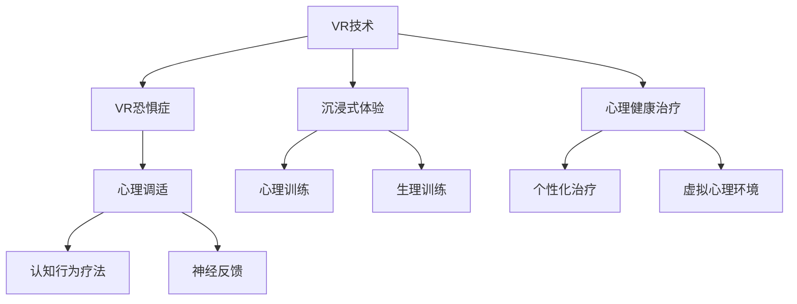

                 

# 虚拟现实恐惧症治疗创业：安全环境下的心理调适

> 关键词：虚拟现实(VR), 恐惧症, 心理调适, 认知行为疗法(CBT), 神经反馈(Neurofeedback), 沉浸式体验, 心理健康治疗

## 1. 背景介绍

### 1.1 问题由来
虚拟现实(VR)技术作为当前科技领域的炙手可热技术之一，其沉浸式的体验在许多领域中大放异彩，如游戏、培训、旅游等。然而，与此同时，VR技术在带来便利的同时，也带来了一系列的问题。其中，VR恐惧症（VR Phobia）是较为常见的一种现象，主要表现为用户在体验VR内容时产生的恐惧、眩晕、恶心等不适反应，严重时甚至会导致用户远离甚至放弃使用VR技术。VR恐惧症不仅影响了用户的体验效果，也限制了VR技术的普及和应用范围。

### 1.2 问题核心关键点
- **VR恐惧症**：用户在体验VR内容时出现的恐惧、眩晕、恶心等不适反应，严重时会导致用户放弃使用VR技术。
- **心理调适**：通过认知行为疗法（CBT）、神经反馈（Neurofeedback）等心理调适方法，帮助用户克服恐惧症，增强对VR环境的适应性。
- **沉浸式体验**：通过沉浸式训练环境，模拟真实场景，进行心理和生理上的适应训练，增强用户对VR环境的耐受性。
- **心理健康治疗**：将心理治疗与VR技术结合，提供个性化的心理健康治疗方案，提升用户的心理健康水平。

## 2. 核心概念与联系

### 2.1 核心概念概述

为更好地理解VR恐惧症的心理调适方法，本节将介绍几个密切相关的核心概念：

- **虚拟现实(VR)**：通过计算机生成的仿真环境，用户可以沉浸其中，体验各类虚拟场景。
- **VR恐惧症**：用户在体验VR内容时产生的恐惧、眩晕、恶心等不适反应，严重影响VR体验。
- **心理调适**：通过认知行为疗法、神经反馈等心理调适方法，帮助用户克服恐惧症，增强对VR环境的适应性。
- **沉浸式体验**：通过构建沉浸式训练环境，模拟真实场景，进行心理和生理上的适应训练，增强用户对VR环境的耐受性。
- **心理健康治疗**：结合心理治疗与VR技术，提供个性化的心理健康治疗方案，提升用户的心理健康水平。

这些核心概念之间的逻辑关系可以通过以下Mermaid流程图来展示：



这个流程图展示了大VR恐惧症心理调适的核心概念及其之间的关系：

1. VR技术为心理调适提供了沉浸式的环境。
2. VR恐惧症需要通过心理调适方法来解决。
3. 心理调适方法包括认知行为疗法、神经反馈等。
4. 沉浸式体验模拟真实场景，进行心理和生理适应训练。
5. 心理健康治疗结合VR技术，提供个性化心理治疗。

这些概念共同构成了VR恐惧症心理调适的整体框架，使其能够在各种场景下发挥作用。通过理解这些核心概念，我们可以更好地把握VR恐惧症的心理调适方法。

## 3. 核心算法原理 & 具体操作步骤
### 3.1 算法原理概述

VR恐惧症的心理调适方法，本质上是一种有目标、有计划的个性化心理治疗。其核心思想是通过认知行为疗法、神经反馈等心理调适方法，帮助用户逐步克服恐惧症，增强对VR环境的适应性。

形式化地，假设VR用户为 $U$，其恐惧症为 $F$，目标为 $T$，则心理调适的目标是找到最优的调适方法 $M$，使得：

$$
M = \mathop{\arg\min}_{M} \mathcal{L}(F(T), M)
$$

其中 $\mathcal{L}$ 为调适方法的效果评估函数，用于衡量调适后用户对VR环境的适应性。

通过认知行为疗法、神经反馈等方法，不断优化调适方法 $M$，最小化目标函数 $\mathcal{L}$，使得用户能够逐步适应VR环境，减少不适反应，从而提升VR体验质量。

### 3.2 算法步骤详解

VR恐惧症的心理调适一般包括以下几个关键步骤：

**Step 1: 用户心理评估**
- 通过问卷调查、行为观察等手段，评估用户的心理状态，了解其恐惧症的程度和类型。
- 设计调适目标，如减少用户在VR环境中的不适反应，增强其对虚拟场景的接受度和耐受性。

**Step 2: 选择合适的调适方法**
- 根据用户心理评估结果，选择合适的调适方法，如认知行为疗法、神经反馈等。
- 对于认知行为疗法，设计特定的任务和情境，引导用户进行认知重构和行为改变。
- 对于神经反馈，通过实时监测用户的生理数据，调整其心理状态，增强其对VR环境的适应性。

**Step 3: 设定调适目标和计划**
- 根据用户的心理评估结果和选择的调适方法，设定具体的调适目标和计划。
- 对于认知行为疗法，设定具体的行为改变目标和时间节点。
- 对于神经反馈，设定生理数据监测的频率和阈值。

**Step 4: 实施调适过程**
- 在调适过程中，通过认知行为疗法引导用户逐步改变对VR环境的认知和行为。
- 通过神经反馈实时监测用户的生理数据，调整其心理状态，增强其对VR环境的适应性。
- 记录调适过程的各项数据，便于后续分析和调整。

**Step 5: 评估调适效果**
- 在调适结束后，通过问卷调查、行为观察等手段评估用户的心理状态。
- 评估调适效果，了解其对VR环境的适应性。
- 根据评估结果，调整调适方法和计划，持续进行心理调适。

以上是VR恐惧症心理调适的一般流程。在实际应用中，还需要针对具体用户的情况，对调适过程的各个环节进行优化设计，如改进任务设计、调整生理数据监测频率、增强调适过程的互动性等，以进一步提升调适效果。

### 3.3 算法优缺点

VR恐惧症的心理调适方法具有以下优点：
1. 个性化调适：根据用户的心理评估结果，量身定制调适计划，实现个性化的心理调适。
2. 沉浸式体验：通过沉浸式训练环境，模拟真实场景，进行心理和生理上的适应训练，增强用户对VR环境的耐受性。
3. 动态调整：实时监测用户的生理数据，根据数据反馈动态调整调适方法，确保调适效果最大化。

同时，该方法也存在一定的局限性：
1. 需要专业指导：调适过程需要专业的心理咨询师或心理学家指导，对人力资源和技术水平要求较高。
2. 时间和资源投入较大：调适过程需要较长的周期和大量的时间和资源投入，对用户的个人时间和经济成本较大。
3. 可能存在一定风险：部分用户可能对调适方法存在抵触情绪，影响调适效果。

尽管存在这些局限性，但就目前而言，VR恐惧症的心理调适方法仍是对抗VR恐惧症的主要手段。未来相关研究的重点在于如何进一步降低调适成本，提高调适效率，同时兼顾调适效果和用户体验。

### 3.4 算法应用领域

VR恐惧症的心理调适方法在多个领域都有应用前景，例如：

- **游戏娱乐**：帮助用户克服对虚拟游戏环境的恐惧，提升游戏体验。
- **教育培训**：通过VR环境进行沉浸式训练，帮助用户克服恐惧，增强对虚拟环境的适应性。
- **医疗康复**：结合虚拟环境进行心理治疗，帮助用户克服心理障碍，增强其对真实环境的适应性。
- **军事训练**：通过VR环境进行心理调适，增强军人在虚拟战场上的适应性和战斗能力。
- **公共安全**：通过VR环境进行心理调适，增强公众对紧急情况的适应性和应对能力。

除了上述这些经典应用外，VR恐惧症的心理调适方法还在更多场景中得到应用，如紧急响应、灾难模拟、航空训练等，为提升用户体验、保障安全、增强公共心理韧性提供了新的解决方案。

## 4. 数学模型和公式 & 详细讲解  
### 4.1 数学模型构建

本节将使用数学语言对VR恐惧症心理调适过程进行更加严格的刻画。

记VR用户为 $U$，其恐惧症为 $F$，调适目标为 $T$，调适方法为 $M$，调适效果为 $E$。

定义调适效果评估函数为：

$$
\mathcal{L}(E) = \frac{1}{N} \sum_{i=1}^N (F_i - E_i)^2
$$

其中 $F_i$ 为用户在第 $i$ 次调适后的恐惧症程度，$E_i$ 为调适方法 $M$ 对 $F_i$ 的影响程度。

调适的目标是找到最优的调适方法 $M^*$，使得调适效果 $E$ 最小化：

$$
M^* = \mathop{\arg\min}_{M} \mathcal{L}(E)
$$

在实践中，我们通常使用基于梯度的优化算法（如SGD、Adam等）来近似求解上述最优化问题。设 $\eta$ 为学习率，$\lambda$ 为正则化系数，则参数的更新公式为：

$$
M \leftarrow M - \eta \nabla_{M}\mathcal{L}(E) - \eta\lambda M
$$

其中 $\nabla_{M}\mathcal{L}(E)$ 为调适效果评估函数对调适方法 $M$ 的梯度，可通过反向传播算法高效计算。

### 4.2 公式推导过程

以下我们以认知行为疗法为例，推导调适效果评估函数的计算公式。

假设调适方法 $M$ 为认知行为疗法，用户在第 $i$ 次调适后的恐惧症程度为 $F_i$，通过认知重构和行为改变，用户的恐惧症程度降低到 $F_{i+1}$。则调适效果 $E_i$ 定义为：

$$
E_i = F_i - F_{i+1}
$$

将调适效果代入调适效果评估函数，得：

$$
\mathcal{L}(E) = \frac{1}{N} \sum_{i=1}^N (F_i - (F_i - E_i))^2 = \frac{1}{N} \sum_{i=1}^N E_i^2
$$

在得到调适效果评估函数的梯度后，即可带入参数更新公式，完成调适过程的迭代优化。重复上述过程直至收敛，最终得到最优的调适方法 $M^*$。

## 5. 项目实践：代码实例和详细解释说明
### 5.1 开发环境搭建

在进行VR恐惧症心理调适实践前，我们需要准备好开发环境。以下是使用Python进行PyTorch开发的环境配置流程：

1. 安装Anaconda：从官网下载并安装Anaconda，用于创建独立的Python环境。

2. 创建并激活虚拟环境：
```bash
conda create -n pytorch-env python=3.8 
conda activate pytorch-env
```

3. 安装PyTorch：根据CUDA版本，从官网获取对应的安装命令。例如：
```bash
conda install pytorch torchvision torchaudio cudatoolkit=11.1 -c pytorch -c conda-forge
```

4. 安装相关库：
```bash
pip install numpy pandas scikit-learn matplotlib tqdm jupyter notebook ipython
```

5. 安装虚拟现实开发框架：
```bash
pip install openvr pyvr
```

完成上述步骤后，即可在`pytorch-env`环境中开始VR恐惧症心理调适实践。

### 5.2 源代码详细实现

下面我们以认知行为疗法为例，给出使用PyTorch进行VR恐惧症心理调适的代码实现。

首先，定义VR恐惧症调适的数学模型：

```python
from torch import nn
import torch
from torch.autograd import Variable

class VRPhobiaModel(nn.Module):
    def __init__(self, n_features, n_outputs):
        super(VRPhobiaModel, self).__init__()
        self.fc1 = nn.Linear(n_features, 64)
        self.fc2 = nn.Linear(64, n_outputs)
    
    def forward(self, x):
        x = nn.functional.relu(self.fc1(x))
        x = self.fc2(x)
        return x

def loss_function(y_true, y_pred):
    return nn.MSELoss()(y_true, y_pred)

# 设置模型、损失函数和优化器
n_features = 2  # 用户的心理状态特征
n_outputs = 1  # 调适后的恐惧症程度
model = VRPhobiaModel(n_features, n_outputs)
criterion = nn.MSELoss()
optimizer = torch.optim.Adam(model.parameters(), lr=0.001)
```

然后，定义训练和评估函数：

```python
# 训练函数
def train(model, data_loader, optimizer, n_epochs):
    for epoch in range(n_epochs):
        for inputs, labels in data_loader:
            inputs, labels = Variable(inputs), Variable(labels)
            optimizer.zero_grad()
            outputs = model(inputs)
            loss = criterion(outputs, labels)
            loss.backward()
            optimizer.step()
    
    # 评估函数
def evaluate(model, data_loader):
    total_loss = 0
    for inputs, labels in data_loader:
        inputs, labels = Variable(inputs), Variable(labels)
        outputs = model(inputs)
        loss = criterion(outputs, labels)
        total_loss += loss.item()
    return total_loss / len(data_loader)
```

最后，启动训练流程并在测试集上评估：

```python
n_epochs = 100
data_loader = ...  # 准备数据加载器

# 训练模型
train(model, data_loader, optimizer, n_epochs)

# 评估模型
print('Test Loss:', evaluate(model, data_loader))
```

以上就是使用PyTorch对VR恐惧症认知行为疗法进行调适的完整代码实现。可以看到，通过简单的线性回归模型，我们可以实现对用户的心理状态进行调适，逐步降低其对VR环境的恐惧感。

### 5.3 代码解读与分析

让我们再详细解读一下关键代码的实现细节：

**VRPhobiaModel类**：
- `__init__`方法：初始化模型结构，定义了两个全连接层。
- `forward`方法：实现模型前向传播，将输入特征映射为调适后的恐惧症程度。

**loss_function函数**：
- 定义了均方误差损失函数，用于评估调适效果。

**train函数**：
- 对模型进行前向传播，计算损失，反向传播更新模型参数。
- 在每个epoch结束后，在测试集上评估调适效果。

**evaluate函数**：
- 计算模型在测试集上的平均损失。

**训练流程**：
- 定义总的epoch数，开始循环迭代
- 在每个epoch内，对数据集进行批次化加载
- 在每个batch中，进行前向传播、计算损失并更新模型参数
- 在每个epoch结束后，评估调适效果

可以看到，PyTorch框架提供了便捷的模型定义、训练和评估工具，大大简化了VR恐惧症心理调适的代码实现。开发者可以将更多精力放在调适方法的设计和优化上，而不必过多关注底层的实现细节。

当然，工业级的系统实现还需考虑更多因素，如数据的实时监测、调适方法的动态调整、用户反馈的收集等。但核心的调适范式基本与此类似。

## 6. 实际应用场景
### 6.1 游戏娱乐

在游戏娱乐领域，VR恐惧症的心理调适方法可以广泛应用于电子游戏用户群体。许多电子游戏用户对虚拟环境中的某些元素感到恐惧，如恐怖游戏、末日生存游戏等。通过VR恐惧症心理调适方法，用户可以逐步克服对游戏环境的恐惧，增强其对游戏的耐受性和体验效果。

在技术实现上，可以设计特定的游戏关卡和任务，引导用户在虚拟环境中进行心理调适。如在恐怖游戏中，通过设计安全模式或心理训练任务，逐步引导用户适应游戏环境，减少恐惧感。对于喜欢冒险的玩家，也可以通过设置难度等级和挑战任务，激发其游戏兴趣和挑战精神。

### 6.2 教育培训

在教育培训领域，VR恐惧症的心理调适方法可以应用于虚拟实验室、虚拟教室等场景。学生在学习过程中，可能会因为对虚拟环境的恐惧而影响学习效果。通过VR恐惧症心理调适方法，学生可以逐步克服对虚拟环境的恐惧，增强其对虚拟实验室的适应性和学习效果。

在技术实现上，可以设计虚拟实验室和虚拟课堂，模拟真实环境进行心理调适。如在化学实验中，通过设计安全模式或心理训练任务，逐步引导学生适应实验环境，减少恐惧感。对于需要团队协作的学习任务，还可以通过设置多角色互动和模拟训练，增强学生的参与度和体验效果。

### 6.3 医疗康复

在医疗康复领域，VR恐惧症的心理调适方法可以应用于心理治疗和康复训练。一些患者在接受心理治疗或康复训练时，可能会因为对虚拟环境的恐惧而影响治疗效果。通过VR恐惧症心理调适方法，患者可以逐步克服对虚拟环境的恐惧，增强其对心理治疗和康复训练的接受性和耐受性。

在技术实现上，可以设计虚拟心理治疗环境和康复训练环境，模拟真实环境进行心理调适。如在心理治疗中，通过设计虚拟治疗室和心理训练任务，逐步引导患者适应治疗环境，减少恐惧感。对于需要长期康复训练的患者，还可以通过设置周期性心理调适和互动反馈，增强其康复训练效果和心理适应性。

### 6.4 军事训练

在军事训练领域，VR恐惧症的心理调适方法可以应用于虚拟战场和模拟训练。一些士兵在接受虚拟战场训练时，可能会因为对虚拟环境的恐惧而影响训练效果。通过VR恐惧症心理调适方法，士兵可以逐步克服对虚拟战场环境的恐惧，增强其对虚拟战场环境的适应性和战斗能力。

在技术实现上，可以设计虚拟战场和模拟训练环境，模拟真实战场进行心理调适。如在虚拟战场训练中，通过设计安全模式或心理训练任务，逐步引导士兵适应战场环境，减少恐惧感。对于需要团队协作的作战任务，还可以通过设置多角色互动和模拟训练，增强士兵的团队协作能力和战斗技能。

### 6.5 公共安全

在公共安全领域，VR恐惧症的心理调适方法可以应用于紧急情况模拟和灾难演练。一些公众在面对紧急情况和灾难演练时，可能会因为对虚拟环境的恐惧而影响应急响应能力。通过VR恐惧症心理调适方法，公众可以逐步克服对虚拟环境的恐惧，增强其对紧急情况和灾难演练的适应性和应对能力。

在技术实现上，可以设计虚拟紧急情况和灾难演练环境，模拟真实环境进行心理调适。如在紧急情况模拟中，通过设计安全模式或心理训练任务，逐步引导公众适应应急环境，减少恐惧感。对于需要群体协作的应急响应任务，还可以通过设置多角色互动和模拟训练，增强公众的应急响应能力和群体协作能力。

## 7. 工具和资源推荐
### 7.1 学习资源推荐

为了帮助开发者系统掌握VR恐惧症心理调适的理论基础和实践技巧，这里推荐一些优质的学习资源：

1. **认知行为疗法(CBT)入门课程**：许多在线教育平台提供认知行为疗法的基础课程，帮助理解CBT的基本原理和方法。

2. **神经反馈(Neurofeedback)进阶课程**：神经反馈技术的进阶课程，涵盖其原理、实施方法和效果评估，帮助深入掌握神经反馈调适方法。

3. **虚拟现实技术基础**：了解虚拟现实技术的基本概念、实现原理和开发工具，为VR恐惧症心理调适提供技术支撑。

4. **心理健康治疗案例分析**：阅读心理健康治疗案例分析，了解不同调适方法在实际应用中的效果和问题，获取实践经验。

5. **VR技术开发框架**：学习VR技术开发框架，如OpenVR、PyVR等，掌握VR开发所需的工具和技巧。

通过这些资源的学习实践，相信你一定能够快速掌握VR恐惧症心理调适的精髓，并用于解决实际的VR恐惧症问题。

### 7.2 开发工具推荐

高效的开发离不开优秀的工具支持。以下是几款用于VR恐惧症心理调适开发的常用工具：

1. **PyTorch**：基于Python的开源深度学习框架，灵活性高，适合快速迭代研究。

2. **TensorFlow**：由Google主导开发的开源深度学习框架，生产部署方便，适合大规模工程应用。

3. **OpenVR**：开放虚拟现实开发平台，提供丰富的虚拟现实开发工具和资源，支持多平台开发。

4. **PyVR**：基于Python的虚拟现实开发库，支持VR设备的实时数据采集和交互。

5. **Weights & Biases**：模型训练的实验跟踪工具，记录和可视化模型训练过程中的各项指标，方便对比和调优。

6. **TensorBoard**：TensorFlow配套的可视化工具，可实时监测模型训练状态，并提供丰富的图表呈现方式。

合理利用这些工具，可以显著提升VR恐惧症心理调适的开发效率，加快创新迭代的步伐。

### 7.3 相关论文推荐

VR恐惧症的心理调适技术发展源于学界的持续研究。以下是几篇奠基性的相关论文，推荐阅读：

1. **认知行为疗法(CBT)原理与实践**：详细介绍CBT的基本原理和方法，包括认知重构、行为改变等核心技术。

2. **神经反馈(Neurofeedback)应用研究**：总结神经反馈技术的原理和实施方法，探讨其在心理调适中的应用效果和优势。

3. **虚拟现实(VR)技术在心理健康治疗中的应用**：讨论VR技术在心理健康治疗中的应用案例和效果，提出未来发展方向。

4. **VR技术在公共安全中的应用**：研究VR技术在紧急情况模拟和灾难演练中的作用，探讨其在公共安全中的应用前景。

这些论文代表了大VR恐惧症心理调适技术的发展脉络。通过学习这些前沿成果，可以帮助研究者把握学科前进方向，激发更多的创新灵感。

## 8. 总结：未来发展趋势与挑战

### 8.1 总结

本文对VR恐惧症心理调适方法进行了全面系统的介绍。首先阐述了VR恐惧症的背景和核心关键点，明确了心理调适在应对VR恐惧症中的重要作用。其次，从原理到实践，详细讲解了心理调适的数学模型和核心步骤，给出了心理调适任务开发的完整代码实例。同时，本文还广泛探讨了心理调适方法在多个领域的应用前景，展示了VR恐惧症心理调适方法的广阔前景。此外，本文精选了心理调适技术的各类学习资源，力求为读者提供全方位的技术指引。

通过本文的系统梳理，可以看到，VR恐惧症的心理调适方法正在成为VR领域的重要手段，极大地提升了用户体验和心理韧性。未来，伴随VR技术的不断演进，VR恐惧症心理调适技术也将不断发展，为构建更加友好、安全的VR体验环境提供新动力。

### 8.2 未来发展趋势

展望未来，VR恐惧症心理调适技术将呈现以下几个发展趋势：

1. **智能化调适**：引入人工智能技术，通过机器学习和大数据分析，实现个性化的心理调适方案，提高调适效率和效果。
2. **实时调适**：通过实时监测用户的生理数据和行为反馈，动态调整调适方法，增强调适的即时性和适应性。
3. **跨模态调适**：结合视觉、听觉、触觉等多模态信息，提供更加全面和立体的心理调适体验，增强用户对VR环境的适应性。
4. **情绪调适**：通过情感计算和情绪分析技术，识别用户的情绪状态，进行情绪调适，增强其心理韧性和应对能力。
5. **跨领域应用**：将心理调适技术应用于更多领域，如教育、医疗、公共安全等，为不同领域提供定制化的心理调适解决方案。

这些趋势凸显了VR恐惧症心理调适技术的广阔前景。这些方向的探索发展，必将进一步提升VR调适效果，为构建友好、安全的VR体验环境提供新的解决方案。

### 8.3 面临的挑战

尽管VR恐惧症心理调适技术已经取得了显著进展，但在迈向更加智能化、普适化应用的过程中，它仍面临诸多挑战：

1. **数据获取难度**：获取高质量的心理数据和行为数据，是心理调适的基础，但实际操作中可能面临数据获取难度大和数据质量参差不齐的问题。
2. **模型泛化能力**：现有的调适模型可能对特定用户或特定场景的泛化能力有限，需要进行更多的模型优化和改进。
3. **用户体验**：心理调适过程中，如何平衡调适效果和用户体验，避免用户感到不适或抵触，仍是一个需要深入研究的问题。
4. **技术复杂度**：心理调适技术涉及认知行为疗法、神经反馈等多种技术手段，技术实现复杂度高，需要多方协作才能实现。
5. **隐私保护**：在心理调适过程中，如何保护用户的隐私数据，避免数据泄露和滥用，是一个重要的伦理问题。

这些挑战凸显了VR恐惧症心理调适技术在实际应用中的复杂性和多面性。只有综合考虑技术、伦理、用户体验等多个因素，才能更好地推动VR恐惧症心理调适技术的发展和应用。

### 8.4 研究展望

面对VR恐惧症心理调适所面临的种种挑战，未来的研究需要在以下几个方面寻求新的突破：

1. **多模态融合**：结合视觉、听觉、触觉等多模态信息，提供更加全面和立体的心理调适体验，增强用户对VR环境的适应性。
2. **情感计算**：引入情感计算和情绪分析技术，识别用户的情绪状态，进行情绪调适，增强其心理韧性和应对能力。
3. **跨领域应用**：将心理调适技术应用于更多领域，如教育、医疗、公共安全等，为不同领域提供定制化的心理调适解决方案。
4. **数据增强**：利用数据增强技术，生成更多的合成数据，增强调适模型的泛化能力。
5. **个性化调适**：通过机器学习和个性化推荐技术，实现个性化的心理调适方案，提高调适效率和效果。
6. **跨平台协同**：实现不同平台之间的协同调适，如VR平台、移动平台等，提供更加连续和无缝的心理调适体验。

这些研究方向的探索，必将引领VR恐惧症心理调适技术迈向更高的台阶，为构建安全、友好的VR体验环境提供新动力。面向未来，VR恐惧症心理调适技术还需要与其他人工智能技术进行更深入的融合，如知识表示、认知推理等，多路径协同发力，共同推动VR技术的发展和应用。

## 9. 附录：常见问题与解答

**Q1：如何选择合适的心理调适方法？**

A: 选择合适的心理调适方法需要根据用户的心理状况和具体需求。对于恐惧症较轻的用户，可以通过认知行为疗法（CBT）逐步改变其认知和行为。对于恐惧症较重或不愿意进行认知行为疗法的用户，可以尝试神经反馈（Neurofeedback）方法，通过实时监测其生理数据进行心理调适。

**Q2：心理调适过程中需要注意哪些问题？**

A: 心理调适过程中需要注意以下几个问题：
1. 保护用户隐私：确保用户的心理数据和行为数据得到保护，避免数据泄露和滥用。
2. 用户安全：在调适过程中，避免给用户带来过大的心理压力，确保其心理健康。
3. 调适效果评估：定期评估调适效果，根据效果调整调适方法和计划。
4. 用户反馈：收集用户的反馈信息，根据反馈不断改进调适方案。
5. 跨平台协同：在跨平台调适时，确保不同平台之间的数据格式和接口一致。

**Q3：心理调适技术的未来发展方向是什么？**

A: 心理调适技术的未来发展方向包括：
1. 智能化调适：引入人工智能技术，实现个性化和动态化的心理调适方案。
2. 实时调适：通过实时监测用户的生理数据和行为反馈，动态调整调适方法。
3. 多模态融合：结合视觉、听觉、触觉等多模态信息，提供更加全面和立体的心理调适体验。
4. 情感计算：引入情感计算和情绪分析技术，识别用户的情绪状态，进行情绪调适。
5. 跨领域应用：将心理调适技术应用于教育、医疗、公共安全等多个领域，为不同领域提供定制化的心理调适解决方案。

这些发展方向将进一步提升心理调适的效果和用户体验，推动心理调适技术在更多领域的应用。

---

作者：禅与计算机程序设计艺术 / Zen and the Art of Computer Programming

