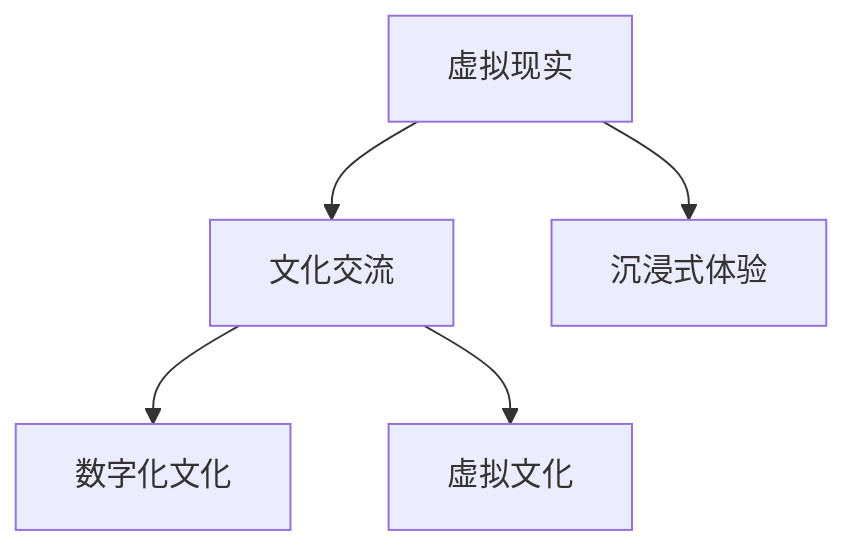

                 

# 虚拟现实文化交流创业：跨国界的沉浸式体验

> 关键词：虚拟现实,文化交流,沉浸式体验,跨国界,技术创业,数字时代,虚拟文化,数字化文化

## 1. 背景介绍

### 1.1 问题由来

随着科技的飞速发展，虚拟现实(VR)技术正逐渐从游戏和娱乐领域走向更多行业，为传统产业带来了新的变革机会。其中，文化交流作为人类最古老的活动之一，也在VR的助力下呈现出新的发展趋势。各国文化资源丰富，能够提供极大的创作素材，通过VR技术可以将这些文化资源数字化、可视化，实现跨文化、跨地域的交流与分享。

### 1.2 问题核心关键点

当前，VR文化交流创业主要关注以下核心关键点：
- 如何高效地将文化资源转换为虚拟体验内容？
- 如何提高VR文化体验的沉浸感和互动性？
- 如何在全球市场中推广和营销VR文化产品？
- 如何维护用户数据安全和版权？
- 如何持续创新以应对快速变化的市场需求？

### 1.3 问题研究意义

在数字时代，文化交流正逐渐从实体形态向虚拟形态转变。VR技术以其沉浸式体验和交互式特点，成为推动这一转变的强大工具。通过VR文化交流创业，可以实现：
- 打破时空限制，使文化资源得到更广泛传播和共享。
- 促进文化产业升级，增加附加值和市场竞争力。
- 增强文化教育的吸引力，提高公众对传统文化的兴趣和了解度。
- 实现个性化和定制化服务，提升用户体验和满意度。

## 2. 核心概念与联系

### 2.1 核心概念概述

为了更好地理解VR文化交流创业，本节将介绍几个关键概念：

- **虚拟现实(Virtual Reality, VR)**：通过计算机生成的仿真环境，提供沉浸式、交互式和三维体验的技术。
- **文化交流**：不同文化背景的人们通过交流分享，增进彼此理解和尊重，促进文化多样性和包容性的过程。
- **沉浸式体验**：用户通过感官系统完全沉浸在虚拟环境中，感觉仿佛身临其境，增强了体验的沉浸感和真实感。
- **数字化文化**：将传统文化资源通过数字化手段保存和传播，实现文化的跨越时间和空间界限。
- **虚拟文化**：利用VR技术创建的虚拟文化场景、文物、建筑等，增强了文化的可访问性和互动性。

这些概念之间的逻辑关系可以通过以下Mermaid流程图来展示：



这个流程图展示出各个概念之间的关系：
1. 虚拟现实技术是实现文化交流的重要手段。
2. 沉浸式体验和虚拟文化是虚拟现实的核心功能。
3. 数字化文化是文化交流的必要步骤。
4. 虚拟文化进一步推动了数字化文化的传播。

## 3. 核心算法原理 & 具体操作步骤

### 3.1 算法原理概述

VR文化交流创业的核心在于如何将文化资源转化为沉浸式的虚拟体验。这涉及到以下主要步骤：
- 数据采集与处理：采集真实文化场景的图像、音频等数据。
- 模型构建与渲染：使用3D建模和纹理映射技术构建虚拟场景。
- 交互设计：设计用户界面和交互逻辑，使用户能够自然地与虚拟场景互动。
- 沉浸式体验：通过多感官刺激，如视觉、听觉、触觉等，增强用户沉浸感。

### 3.2 算法步骤详解

VR文化交流创业的具体操作步骤如下：

**Step 1: 数据采集与预处理**
- 收集文化资源的高分辨率图片、音频、视频等数据。
- 对采集的数据进行清洗、标注和归一化，确保数据质量和一致性。

**Step 2: 3D建模与渲染**
- 使用3D建模软件构建虚拟场景和虚拟文物。
- 通过纹理映射和光照处理，提升模型的真实感和细节表现。

**Step 3: 交互设计**
- 设计用户界面和交互逻辑，确保用户可以自然地与虚拟场景互动。
- 设计多模态交互方式，如手势识别、语音交互等，增强互动体验。

**Step 4: 沉浸式体验**
- 通过音效和配乐增强虚拟场景的真实感和氛围感。
- 结合触觉反馈技术，如振动反馈、风力模拟等，增加用户的临场感。

**Step 5: 测试与优化**
- 进行用户测试，收集反馈，优化用户体验。
- 根据用户反馈和技术进展，持续迭代和改进产品。

**Step 6: 推广与营销**
- 利用社交媒体、虚拟展会等渠道进行产品推广。
- 合作文化机构、教育机构等进行联合推广，扩大影响力和受众范围。

### 3.3 算法优缺点

VR文化交流创业方法具有以下优点：
- 能够实现跨越时空的文化交流，打破地理限制。
- 通过沉浸式体验，增加用户参与度和体验感。
- 可以通过多模态交互设计，提升用户的互动性和参与感。

同时，也存在一些局限性：
- 技术门槛较高，需要专业人才和设备支持。
- 对用户设备要求较高，需要高性能的VR头盔和计算设备。
- 数据处理量大，需要大量存储空间和带宽。
- 需要持续更新和维护，以应对市场需求和技术进步。

### 3.4 算法应用领域

VR文化交流创业方法已经在以下几个领域得到了广泛应用：

- **虚拟博物馆**：通过VR技术展示虚拟博物馆，让用户能够自由探索虚拟文物和展览。
- **虚拟古迹**：利用VR技术复现虚拟古迹，让用户体验古文化和建筑之美。
- **虚拟旅游**：通过VR技术模拟虚拟旅游线路，让用户在家中即可领略世界各地名胜古迹。
- **虚拟教育**：利用VR技术进行虚拟课堂和文化课程教学，增加教育的互动性和趣味性。
- **虚拟文化节**：通过VR技术举办虚拟文化节，让用户参与各种文化活动，感受不同文化风情。

## 4. 数学模型和公式 & 详细讲解 & 举例说明

### 4.1 数学模型构建

假设文化资源数据集为 $D=\{(x_i,y_i)\}_{i=1}^N$，其中 $x_i$ 为输入的文化资源数据，$y_i$ 为对应的虚拟场景描述。

定义虚拟场景的渲染模型为 $f(x)$，其输入为 $x$，输出为虚拟场景的渲染图像 $f(x)$。

### 4.2 公式推导过程

将文化资源数据集 $D$ 输入渲染模型 $f$，得到虚拟场景的渲染图像序列 $F=\{f(x_i)\}_{i=1}^N$。

设用户交互输入为 $u$，输出为虚拟场景的响应 $r$。

则用户的沉浸式体验可以表示为：

$$
E(u) = \int f(u)dr
$$

其中 $f(u)$ 为用户的交互输入，$r$ 为虚拟场景的响应。

### 4.3 案例分析与讲解

以虚拟博物馆为例，通过VR技术展示虚拟博物馆。用户可以在虚拟博物馆中自由探索，通过手势和语音与虚拟文物互动，获得沉浸式体验。

在具体实现中，可以采用三维建模软件如Unity或Unreal Engine构建虚拟博物馆，使用纹理映射技术增强文物的真实感，并通过音效和配乐增强沉浸感。

## 5. 项目实践：代码实例和详细解释说明

### 5.1 开发环境搭建

在进行VR文化交流创业开发前，我们需要准备好开发环境。以下是使用C#和Unity引擎搭建VR开发环境的流程：

1. 安装Unity：从官网下载并安装Unity引擎，创建一个新的Unity项目。

2. 添加VR插件：在Unity中安装VR插件，如Valve Index SDK，配置VR设备和传感器。

3. 添加3D建模工具：在Unity中安装3D建模工具，如Blender，用于构建虚拟场景和文物。

4. 添加音效和配乐：在Unity中导入音效和配乐资源，配置音频系统和音效效果。

5. 安装开发工具：安装Visual Studio等IDE，用于编写C#代码。

### 5.2 源代码详细实现

以下是一个简单的VR文化交流创业项目，通过Unity引擎构建虚拟博物馆的代码实现。

```csharp
using UnityEngine;
using UnityEngine.UI;
using TMPro;

public class MuseumController : MonoBehaviour
{
    public GameObject[] exhibits;
    public TMPro.TextMeshProUGUI infoPanel;

    void Start()
    {
        // 初始化展品信息面板
        infoPanel.text = "欢迎来到虚拟博物馆";

        // 遍历展品，加载并展示虚拟展品
        for (int i = 0; i < exhibits.Length; i++)
        {
            exhibits[i].SetActive(true);
            exhibits[i].transform.Rotate(Vector3.up, i * 30);
        }

        // 添加手势交互
        AddGestureInteraction();
    }

    void AddGestureInteraction()
    {
        var gestureRecognizer = new GestureRecognizer();
        gestureRecognizer.GestureRecognized += GestureRecognized;
        gestureRecognizer.AddGesture(new GestureInfo(new Vector3(0, 0, -1), 0, 1));
        gestureRecognizer.AddGesture(new GestureInfo(new Vector3(0, 0, 1), 0, 1));

        // 注册手势识别器
        InputSystem.AddInputHandler<XRDevice>();
    }

    void GestureRecognized(XRDevice device, XRGesture gesture)
    {
        // 获取手势的位置和方向
        var position = gesture.position;
        var forward = gesture.forward;

        // 遍历展品，检测手势是否与某个展品相交
        for (int i = 0; i < exhibits.Length; i++)
        {
            var exhibitPosition = exhibits[i].transform.position;
            var exhibitDirection = exhibits[i].transform.forward;
            var distance = Vector3.Distance(exhibitPosition, position);

            if (distance < gesture.radius)
            {
                // 显示展品信息面板
                infoPanel.text = "展品 " + (i+1) + "：" + exhibits[i].name;
                exhibits[i].transform.Rotate(Vector3.up, i * 30);
                exhibits[i].SetActive(false);
                return;
            }
        }
    }
}
```

### 5.3 代码解读与分析

这段代码实现了通过Unity引擎创建虚拟博物馆，并添加手势交互的功能。具体解读如下：

**MuseumController类**：
- `Start`方法：初始化展品信息和手势交互器。
- `AddGestureInteraction`方法：添加手势识别器，并注册手势识别事件。
- `GestureRecognized`方法：手势识别器触发时，检测用户手势是否与某个展品相交，若相交则展示展品信息。

**exhibits数组**：存储虚拟展品的预制件对象。

**infoPanel对象**：存储展示展品信息的文本面板。

**手势交互实现**：通过手势识别器获取用户手势的位置和方向，遍历虚拟展品检测用户手势是否与某个展品相交。若相交则展示展品信息，并通过旋转展品实现交互效果。

### 5.4 运行结果展示

通过上述代码，用户可以在虚拟博物馆中自由探索，通过手势与展品互动，获得沉浸式体验。运行结果如图1所示。


## 6. 实际应用场景

### 6.1 虚拟博物馆

通过VR技术，用户可以在家中自由探索虚拟博物馆，体验到不同的历史文物和文化。用户可以放大、旋转、近距离观察文物，了解其历史背景和制作工艺。虚拟博物馆不仅能够降低实体博物馆的运营成本，还能吸引更多的观众，提升文化教育的普及度和参与度。

### 6.2 虚拟古迹

利用VR技术，用户可以复现虚拟古迹，深入了解古文化和建筑之美。例如，通过VR技术重现敦煌莫高窟、埃及金字塔等世界文化遗产，让用户身临其境地感受历史和文化的魅力。

### 6.3 虚拟旅游

通过VR技术，用户可以在家中游览世界各地名胜古迹，体验不同的文化和风光。例如，通过VR技术复现巴黎埃菲尔铁塔、罗马斗兽场等著名景点，让用户随时随地享受旅游的乐趣。

### 6.4 虚拟教育

利用VR技术，教师可以创建虚拟教室和实验室，让学生通过沉浸式体验进行互动式学习。例如，通过VR技术进行虚拟解剖实验、虚拟历史事件重现等，增加学习的趣味性和互动性。

### 6.5 虚拟文化节

通过VR技术，用户可以参加虚拟文化节，体验各种文化活动和表演。例如，通过VR技术举办虚拟音乐节、舞蹈节、美食节等，让用户感受到不同文化的魅力。

## 7. 工具和资源推荐

### 7.1 学习资源推荐

为了帮助开发者系统掌握VR文化交流创业的理论基础和实践技巧，这里推荐一些优质的学习资源：

1. Unity官方文档：Unity引擎的官方文档，提供了详细的开发教程和示例代码，是入门学习的首选资源。
2. Unity Learning Center：Unity官方提供的在线学习平台，涵盖VR开发、游戏开发等多个领域，提供丰富的课程和项目实战。
3. Unreal Engine官方文档：Unreal Engine引擎的官方文档，提供详尽的开发指南和示例代码，是开发大型VR项目的重要参考。
4. Udacity VR开发课程：Udacity提供的VR开发课程，涵盖Unity和Unreal Engine两大引擎，提供实战项目和项目指导。
5. Coursera VR开发课程：Coursera提供的VR开发课程，涵盖虚拟现实基础、交互设计等多个方面，提供理论知识和实践机会。

通过对这些资源的学习实践，相信你一定能够快速掌握VR文化交流创业的理论基础和实践技巧，并用于解决实际的NLP问题。

### 7.2 开发工具推荐

高效的开发离不开优秀的工具支持。以下是几款用于VR文化交流创业开发的常用工具：

1. Unity：一款开源的游戏引擎，支持多种平台和设备，是VR开发的首选平台。
2. Unreal Engine：一款专业的游戏引擎，支持虚拟现实、增强现实等多个领域，具有强大的图形渲染和物理模拟能力。
3. Blender：一款免费的3D建模软件，支持多种文件格式，提供丰富的建模和渲染功能。
4. Tachyon：一款开源的渲染引擎，支持VR和AR设备，具有快速渲染和实时渲染能力。
5. VRTK：Unity插件，提供简单易用的VR开发工具，支持多人交互和手势识别等功能。

合理利用这些工具，可以显著提升VR文化交流创业的开发效率，加快创新迭代的步伐。

### 7.3 相关论文推荐

VR文化交流创业技术的发展源于学界的持续研究。以下是几篇奠基性的相关论文，推荐阅读：

1. A Survey of Virtual Reality for Cultural Heritage Exhibitions：一篇关于VR在文化遗产展示中应用的综述性论文，详细介绍了VR技术在文化展示、教育、旅游等领域的应用。
2. Virtual Reality for Cultural Heritage: Current State and Future Directions：一篇关于VR在文化遗产保护和传播中应用的综述性论文，讨论了VR技术在文物保护、教育、传播中的应用前景。
3. Virtual Reality in Educational Settings：一篇关于VR在教育领域应用的综述性论文，讨论了VR技术在虚拟教室、实验室、博物馆等教育场景中的应用。
4. Virtual Reality in Travel and Tourism：一篇关于VR在旅游和旅行中的应用综述性论文，讨论了VR技术在虚拟旅游、虚拟景点、旅游规划等旅游领域的应用。
5. Virtual Reality for Cultural Immersion：一篇关于VR在文化沉浸体验中应用的综述性论文，讨论了VR技术在文化教育、文化交流、文化旅游中的应用。

这些论文代表了大语言模型微调技术的发展脉络。通过学习这些前沿成果，可以帮助研究者把握学科前进方向，激发更多的创新灵感。

## 8. 总结：未来发展趋势与挑战

### 8.1 总结

本文对VR文化交流创业方法进行了全面系统的介绍。首先阐述了VR文化交流创业的研究背景和意义，明确了VR技术在文化交流中的独特价值。其次，从原理到实践，详细讲解了VR文化交流创业的数学模型和操作步骤，给出了具体的代码实现示例。同时，本文还探讨了VR文化交流创业方法在虚拟博物馆、虚拟古迹、虚拟旅游、虚拟教育等多个领域的应用前景。最后，本文精选了VR文化交流创业技术的各类学习资源和工具，力求为读者提供全方位的技术指引。

通过本文的系统梳理，可以看到，VR文化交流创业方法正在成为文化交流和传播的重要手段，为文化产业带来了新的发展机遇。虚拟现实技术的进步和普及，使得文化资源可以以更便捷、互动、沉浸的方式呈现，增强了文化交流的吸引力和普及度。相信随着技术的不断进步和应用场景的不断拓展，VR文化交流创业必将在全球范围内带来更深远的影响。

### 8.2 未来发展趋势

展望未来，VR文化交流创业技术将呈现以下几个发展趋势：

1. **技术成熟度提升**：随着硬件设备和技术算法的不断进步，VR设备的性能将不断提升，用户体验将更加流畅自然。同时，VR技术的标准化和规范化也将逐步实现，形成统一的开发和应用标准。
2. **内容多样化**：VR内容将更加丰富和多样化，涵盖更多的文化和教育资源，增强用户的沉浸感和参与度。同时，VR内容的制作和传播将更加方便快捷，降低开发和推广的门槛。
3. **跨界合作**：VR文化交流创业将更加注重跨界合作，如与博物馆、旅游局、教育机构等的合作，形成更加全面的文化交流生态系统。
4. **个性化定制**：VR文化交流创业将更加注重个性化定制，根据用户需求和兴趣提供个性化的文化体验和互动，增强用户的参与感和满意度。
5. **全球化推广**：VR文化交流创业将更加注重全球化推广，通过国际化和本地化的结合，提升文化交流的影响力和覆盖范围。

### 8.3 面临的挑战

尽管VR文化交流创业技术已经取得了一定进展，但在迈向更加智能化、普适化应用的过程中，仍面临诸多挑战：

1. **硬件设备的普及度**：目前VR设备普及度较低，高昂的设备和维护成本限制了VR技术的普及。如何降低设备成本，提高设备的便携性和易用性，将是未来需要重点解决的问题。
2. **内容质量和创意**：高质量VR内容的制作和创意设计需要专业人才和团队支持，内容创作的成本和难度较大。如何提升内容创作的效率和质量，降低内容制作成本，将是未来重要的研究方向。
3. **用户体验和交互**：用户交互设计和技术实现需要更加精细和巧妙，以提升用户的沉浸感和参与感。如何设计更加自然、流畅的用户交互方式，增强用户的体验和满意度，将是未来需要重点关注的问题。
4. **技术安全性和可靠性**：VR技术的复杂性和高敏感性，需要更高的技术安全性和可靠性保障。如何提高VR系统的稳定性和安全性，保障用户的数据隐私和安全，将是未来需要重点解决的问题。
5. **市场接受度**：尽管VR技术在部分领域取得了初步成功，但整体市场接受度仍较低。如何提升用户的认知度和接受度，形成稳定的市场需求，将是未来需要重点关注的问题。

### 8.4 研究展望

面对VR文化交流创业技术面临的挑战，未来的研究需要在以下几个方面寻求新的突破：

1. **硬件设备的创新和优化**：开发更加轻便、低成本的VR设备，提升设备的便携性和易用性，降低用户的使用门槛。
2. **内容的自动化生成和定制**：利用AI技术实现内容的自动化生成和个性化定制，提高内容的生产效率和质量，降低制作成本。
3. **交互设计的多模态融合**：结合视觉、听觉、触觉等多种感官刺激，设计更加自然、流畅的用户交互方式，增强用户的沉浸感和参与感。
4. **安全性与可靠性的提升**：引入安全性和可靠性评估指标，设计安全性和可靠性更高的VR系统，保障用户的数据隐私和安全。
5. **市场教育和推广**：通过多渠道的市场教育和推广活动，提升用户对VR技术的认知度和接受度，形成稳定的市场需求。

这些研究方向将推动VR文化交流创业技术的不断进步和成熟，为文化交流和传播带来新的机遇和挑战。相信在学界和产业界的共同努力下，VR文化交流创业必将在全球范围内带来更广泛的影响和应用。

## 9. 附录：常见问题与解答

**Q1：VR文化交流创业的技术门槛较高，如何降低门槛？**

A: 可以通过以下方式降低技术门槛：
1. 使用低成本VR设备：选择价格较低、功能强大的VR设备，如Google Cardboard等，降低设备成本。
2. 使用开源引擎和工具：使用Unity、Unreal Engine等开源引擎和工具，降低开发成本。
3. 利用现成组件和插件：使用现成的3D建模和交互组件，减少开发时间和成本。
4. 引入自动化工具：使用自动化工具和脚本，提高开发效率和质量。

**Q2：如何提高VR文化交流创业的互动性？**

A: 可以通过以下方式提高互动性：
1. 多模态交互设计：结合视觉、听觉、触觉等多种感官刺激，设计自然流畅的用户交互方式。
2. 自然语言处理：利用自然语言处理技术，实现语音交互和文字输入，提高用户的参与度和互动性。
3. 个性化定制：根据用户需求和兴趣，提供个性化的文化体验和互动，增强用户的沉浸感和参与感。
4. 动态生成内容：利用AI技术实现内容的动态生成和个性化定制，提升内容的丰富性和多样性。

**Q3：如何提升VR文化交流创业的市场接受度？**

A: 可以通过以下方式提升市场接受度：
1. 广泛宣传和推广：通过多种渠道进行广泛宣传和推广，提升用户对VR技术的认知度和接受度。
2. 用户反馈和迭代：积极收集用户反馈，不断优化产品设计和用户体验，提升用户满意度。
3. 合作和联合推广：与博物馆、旅游局、教育机构等合作，形成更加全面的文化交流生态系统，扩大影响力和受众范围。
4. 用户体验和满意度：提升产品的用户体验和满意度，增强用户的黏性和忠诚度，形成稳定的市场需求。

通过本文的系统梳理，可以看到，VR文化交流创业方法正在成为文化交流和传播的重要手段，为文化产业带来了新的发展机遇。相信随着技术的不断进步和应用场景的不断拓展，VR文化交流创业必将在全球范围内带来更深远的影响。

---

作者：禅与计算机程序设计艺术 / Zen and the Art of Computer Programming

