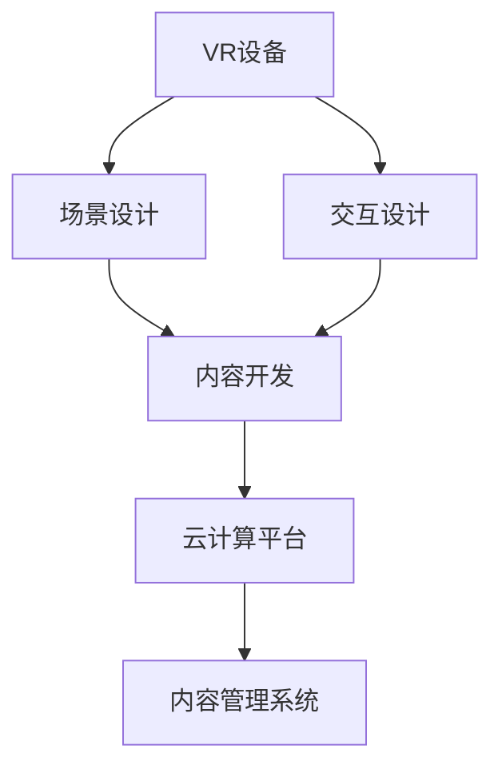

                 

## 1. 背景介绍

### 1.1 问题由来

随着技术的飞速发展，虚拟现实（Virtual Reality, VR）已经从最初的科幻概念变成了现实。VR技术不仅仅在游戏领域有着广泛应用，还逐渐渗透到教育、医疗、工业等多个行业，带来了一场深远的变革。

然而，由于VR技术门槛高、学习成本大，许多有志于此领域的创业者难以快速入门。特别是在职业培训领域，传统的线下培训方式耗时长、成本高，难以满足日益增长的技能学习需求。因此，如何通过VR技术，实现沉浸式的职业培训，成为一个亟待解决的问题。

### 1.2 问题核心关键点

本文旨在探讨如何利用虚拟现实技术，开发沉浸式的职业培训系统，帮助用户快速掌握新技能。我们将围绕以下几个核心关键点展开讨论：

1. **VR硬件选择**：选择合适的VR设备，保证用户体验。
2. **场景设计**：如何构建与职业培训内容相关的虚拟环境。
3. **交互设计**：提高用户沉浸感，增强学习效果。
4. **内容开发**：制作高质量的职业培训内容。
5. **平台搭建**：开发VR培训平台，提供管理、监控等支持功能。
6. **营销推广**：通过有效的市场策略，推广VR职业培训产品。

### 1.3 问题研究意义

随着虚拟现实技术的成熟和普及，沉浸式的职业培训系统将在教育、医疗、军事等各个领域得到广泛应用。VR培训能够提供更加真实的训练场景，增强用户的学习体验，提高培训效率。

具体来说，通过VR培训系统：

1. **提高学习效率**：VR环境下的训练更加逼真，能更好地激发用户的兴趣和动机。
2. **降低培训成本**：减少了线下培训的高昂场地和设备费用，降低了培训成本。
3. **增强安全保障**：模拟危险或复杂操作场景，提供安全的学习环境。
4. **打破时空限制**：用户可以随时随地进行技能训练，提高了学习的灵活性。
5. **增强互动性**：通过交互式内容，用户可以更好地理解抽象概念，加深记忆。

## 2. 核心概念与联系

### 2.1 核心概念概述

为了更好地理解虚拟现实职业培训系统，我们首先需要明确几个关键概念：

1. **虚拟现实（VR）**：一种通过计算机模拟生成的三维环境，让用户沉浸在虚拟世界中，与虚拟物体进行交互。
2. **职业培训**：根据职业需求，通过理论学习和实践操作，提高用户的专业技能。
3. **沉浸式学习**：通过沉浸式的体验，增强学习效果，提高用户的学习效率。
4. **交互式内容**：通过用户与虚拟环境之间的互动，提供更加生动、高效的学习体验。
5. **云计算平台**：提供高可扩展的计算资源和存储能力，支持大规模的用户同时在线培训。
6. **内容管理系统**：用于管理、存储、分发VR培训内容的系统。

这些概念之间的逻辑关系可以通过以下Mermaid流程图来展示：



这个流程图展示了VR培训系统的主要组成环节：

1. VR设备作为沉浸体验的基础。
2. 场景设计和交互设计共同构建沉浸式的学习环境。
3. 内容开发是实现培训目标的核心环节。
4. 云计算平台和内容管理系统提供必要的技术支撑。

## 3. 核心算法原理 & 具体操作步骤

### 3.1 算法原理概述

虚拟现实职业培训系统主要包含以下几个核心算法：

1. **场景生成算法**：根据职业培训内容，构建虚拟环境。
2. **交互模拟算法**：实现用户与虚拟环境之间的互动，增强沉浸感。
3. **内容管理系统**：用于管理、存储、分发VR培训内容。
4. **用户行为分析算法**：通过分析用户行为数据，提供个性化学习建议。

### 3.2 算法步骤详解

#### 3.2.1 场景生成算法

**步骤1: 数据收集**
- 收集与职业培训相关的环境数据，如空间布局、物体位置、光照条件等。
- 根据职业特点，选择合适的VR设备模型和场景库。

**步骤2: 环境构建**
- 使用Unity、Unreal Engine等VR开发工具，构建虚拟环境。
- 设置环境参数，如空间大小、物体材质、光影效果等，保证场景的真实性。

**步骤3: 用户交互**
- 实现用户与虚拟环境之间的互动，如点击、移动、旋转等操作。
- 设计交互界面，增强用户的操作体验。

#### 3.2.2 交互模拟算法

**步骤1: 用户输入处理**
- 收集用户输入数据，如手柄、鼠标、眼动等。
- 将输入数据转化为虚拟环境中的操作指令。

**步骤2: 场景响应**
- 根据用户的操作指令，模拟虚拟环境的变化。
- 实时渲染场景，保证用户看到的是最新状态。

**步骤3: 反馈处理**
- 根据用户的操作反馈，调整场景参数。
- 提供即时反馈，增强用户体验。

#### 3.2.3 内容管理系统

**步骤1: 内容制作**
- 根据职业培训需求，制作VR培训内容。
- 确保内容的质量和适用性，遵循行业标准。

**步骤2: 内容存储**
- 将制作好的内容存储在云平台中。
- 提供高效的数据存储和检索机制。

**步骤3: 内容分发**
- 将内容分发到用户终端。
- 提供易于使用的下载和播放工具。

#### 3.2.4 用户行为分析算法

**步骤1: 数据采集**
- 收集用户的行为数据，如操作时间、点击次数、完成情况等。
- 分析用户的学习进度和效果。

**步骤2: 数据分析**
- 使用机器学习算法，分析用户数据。
- 提供个性化的学习建议和改进措施。

**步骤3: 反馈调整**
- 根据分析结果，调整培训内容和策略。
- 提供反馈机制，帮助用户改进学习效果。

### 3.3 算法优缺点

虚拟现实职业培训系统的优点包括：

1. **沉浸式学习**：通过逼真的虚拟环境，增强用户的学习体验。
2. **灵活性高**：用户可以随时随地进行培训，打破了时间和空间限制。
3. **安全性高**：模拟高危操作场景，提供安全的训练环境。

缺点包括：

1. **技术门槛高**：开发和维护VR系统需要较高的技术水平。
2. **成本较高**：初期投入高，包括设备购买和内容制作成本。
3. **用户体验依赖设备质量**：设备质量不佳会导致用户体验下降。

### 3.4 算法应用领域

虚拟现实职业培训系统在多个领域具有广泛的应用前景：

1. **医疗领域**：通过模拟手术操作，提高医生的手术技能。
2. **教育领域**：提供虚拟实验室、虚拟课堂等，增强学生的学习体验。
3. **军事领域**：进行模拟战场训练，提高士兵的实战能力。
4. **制造业**：进行技能培训，提高工人的操作水平。
5. **航空航天**：进行模拟飞行训练，提高飞行员的技能。

## 4. 数学模型和公式 & 详细讲解

### 4.1 数学模型构建

假设用户输入的指令为 $x_i$，虚拟环境的状态为 $y_i$，则交互模拟算法可以表示为：

$$
y_{i+1} = f(y_i, x_i)
$$

其中 $f$ 为交互模拟函数，表示虚拟环境根据用户的操作指令更新状态。

### 4.2 公式推导过程

以手术培训为例，用户通过手柄模拟手术刀的运动，需要计算手术刀在虚拟环境中的位置和方向。假设用户手柄的位置为 $(x_{h}, y_{h}, z_{h})$，手术刀在虚拟环境中的位置为 $(x_{s}, y_{s}, z_{s})$，手术刀的方向为 $(d_x, d_y, d_z)$，则手术刀的位置和方向可以通过以下公式计算：

$$
(x_{s}, y_{s}, z_{s}) = (x_{h}, y_{h}, z_{h}) + (d_x, d_y, d_z)
$$

$$
(d_x, d_y, d_z) = \tan(\theta_x, \theta_y, \theta_z)
$$

其中 $\theta_x, \theta_y, \theta_z$ 为手术刀的方向角度。

### 4.3 案例分析与讲解

假设我们要开发一个军事模拟训练系统，用户通过手柄控制虚拟坦克，模拟战场环境。用户输入的指令为手柄的位置和方向，虚拟环境的状态为坦克的位置和朝向。

**案例分析**：
- 场景生成算法：根据战场环境，构建虚拟山脉、河流、建筑物等。
- 交互模拟算法：实现用户手柄控制坦克的移动和射击。
- 内容管理系统：存储战场环境数据和坦克操作数据。
- 用户行为分析算法：分析用户的操作数据，提供个性化训练建议。

## 5. 项目实践：代码实例和详细解释说明

### 5.1 开发环境搭建

#### 5.1.1 硬件准备

- 选择适合用户的VR设备，如Oculus Rift、HTC Vive等。
- 确保设备兼容Unity、Unreal Engine等VR开发工具。

#### 5.1.2 软件安装

- 安装Unity或Unreal Engine，创建新项目。
- 安装内容管理系统，如AWS S3、Google Cloud Storage等。
- 安装云计算平台，如AWS EC2、阿里云ECS等。

### 5.2 源代码详细实现

#### 5.2.1 场景生成算法

```python
# 使用Unity或Unreal Engine的3D建模工具，构建虚拟场景
# 设置环境参数，如空间大小、物体材质、光影效果等
# 实现用户与虚拟环境之间的互动
```

#### 5.2.2 交互模拟算法

```python
# 收集用户输入数据，如手柄位置、鼠标移动等
# 将输入数据转化为虚拟环境的操作指令
# 模拟虚拟环境的变化，实时渲染场景
# 提供即时反馈，增强用户体验
```

#### 5.2.3 内容管理系统

```python
# 制作VR培训内容，存储在云平台中
# 提供高效的数据存储和检索机制
# 提供易于使用的下载和播放工具
```

#### 5.2.4 用户行为分析算法

```python
# 收集用户的行为数据，如操作时间、点击次数等
# 使用机器学习算法，分析用户数据
# 提供个性化的学习建议和改进措施
```

### 5.3 代码解读与分析

**场景生成算法**：
- 利用3D建模工具，构建虚拟环境。
- 设置环境参数，如空间大小、物体材质、光影效果等，保证场景的真实性。
- 实现用户与虚拟环境之间的互动，如点击、移动、旋转等操作。

**交互模拟算法**：
- 收集用户输入数据，如手柄位置、鼠标移动等。
- 将输入数据转化为虚拟环境的操作指令。
- 模拟虚拟环境的变化，实时渲染场景。

**内容管理系统**：
- 制作VR培训内容，存储在云平台中。
- 提供高效的数据存储和检索机制。

**用户行为分析算法**：
- 收集用户的行为数据，如操作时间、点击次数等。
- 使用机器学习算法，分析用户数据。
- 提供个性化的学习建议和改进措施。

### 5.4 运行结果展示

**运行结果展示**：
- 模拟手术培训，用户通过手柄控制虚拟手术刀，进行模拟手术操作。
- 模拟军事训练，用户通过手柄控制虚拟坦克，进行战场模拟。
- 模拟制造操作，用户通过手柄控制虚拟机器人，进行零件组装。

## 6. 实际应用场景

### 6.1 医疗领域

在医疗领域，虚拟现实职业培训系统可以用于模拟手术操作，提高医生的手术技能。通过VR设备，医生可以在虚拟环境中进行各种复杂手术，增强手术技巧和应急处理能力。

### 6.2 教育领域

在教育领域，虚拟现实职业培训系统可以提供虚拟实验室、虚拟课堂等，增强学生的学习体验。学生可以通过VR设备，进入虚拟实验室进行实验操作，提高动手能力。

### 6.3 军事领域

在军事领域，虚拟现实职业培训系统可以进行模拟战场训练，提高士兵的实战能力。士兵可以在虚拟环境中进行各种战术演练，提高战斗技能。

### 6.4 未来应用展望

未来，虚拟现实职业培训系统将在更多领域得到应用，为教育、医疗、军事等领域带来深远影响。

## 7. 工具和资源推荐

### 7.1 学习资源推荐

#### 7.1.1 在线课程
- Coursera: 提供VR开发和虚拟现实职业培训相关的课程，涵盖Unity、Unreal Engine等工具的使用。
- Udacity: 提供虚拟现实职业培训的纳米学位课程，涵盖VR开发、交互设计等内容。

#### 7.1.2 书籍
- 《虚拟现实编程：Unity3D与C#实现》：详细介绍了Unity的VR开发技术。
- 《Unreal Engine 4实战：VR开发与游戏编程》：介绍了Unreal Engine的VR开发技术。

#### 7.1.3 博客和论坛
- Unity论坛：提供Unity开发相关的讨论和技术支持。
- Unreal Engine论坛：提供Unreal Engine开发相关的讨论和技术支持。

### 7.2 开发工具推荐

#### 7.2.1 VR开发工具
- Unity: 功能强大的游戏引擎，支持VR开发。
- Unreal Engine: 高效的游戏引擎，支持VR开发。

#### 7.2.2 云计算平台
- AWS EC2: 提供高可扩展的计算资源和存储能力，支持大规模的用户同时在线培训。
- Google Cloud Platform: 提供丰富的云计算服务，支持大规模的数据存储和处理。

#### 7.2.3 内容管理系统
- AWS S3: 提供高效的数据存储和检索机制，支持大规模的内容分发。
- Google Cloud Storage: 提供高效的数据存储和检索机制，支持大规模的内容分发。

### 7.3 相关论文推荐

#### 7.3.1 VR开发
- "Virtual Reality: Applications, Theory, and Evaluation"：全面介绍了VR技术的发展历程和应用领域。
- "Virtual Reality for Medical Training: A Review of Current Applications"：综述了VR在医学培训中的应用。

#### 7.3.2 虚拟现实职业培训
- "Virtual Reality in Education: A Review of the Recent Advances"：综述了VR在教育领域的应用。
- "Virtual Reality in Military Training: A Review of Current Applications"：综述了VR在军事培训中的应用。

## 8. 总结：未来发展趋势与挑战

### 8.1 研究成果总结

虚拟现实职业培训系统为技能学习提供了全新的手段，通过沉浸式体验，增强用户的学习效果。本文从场景设计、交互设计、内容开发、平台搭建等多个方面，探讨了虚拟现实职业培训系统的实现方法。

### 8.2 未来发展趋势

未来，虚拟现实职业培训系统将在各个领域得到广泛应用，推动教育、医疗、军事等行业的变革。以下是我认为虚拟现实职业培训系统未来可能的发展趋势：

1. **技术成熟化**：随着VR硬件和软件的不断改进，虚拟现实职业培训系统的技术将更加成熟，用户体验将大幅提升。
2. **内容多样化**：虚拟现实职业培训系统将支持更多样化的内容，涵盖不同领域的技能培训。
3. **交互智能化**：虚拟现实职业培训系统将具备更强的智能化能力，提供更加个性化的学习建议。
4. **生态系统完善**：虚拟现实职业培训系统将构建完整的生态系统，包括内容提供商、培训机构和用户等多个环节。
5. **普及化**：虚拟现实职业培训系统将逐渐普及，成为用户进行技能学习的重要手段。

### 8.3 面临的挑战

尽管虚拟现实职业培训系统具有广阔的应用前景，但在推广和应用过程中，仍面临以下挑战：

1. **技术门槛高**：开发和维护虚拟现实职业培训系统需要较高的技术水平，需要专业的团队和资源。
2. **成本高**：初期投入高，包括设备购买和内容制作成本，难以大规模推广。
3. **用户体验依赖设备质量**：设备质量不佳会导致用户体验下降，影响系统的推广和应用。

### 8.4 研究展望

为了应对上述挑战，未来的研究需要重点关注以下几个方向：

1. **降低技术门槛**：开发更加易于使用的VR开发工具和平台，降低开发门槛。
2. **提高内容质量**：制作高质量的VR培训内容，确保内容的专业性和适用性。
3. **增强交互体验**：提高用户与虚拟环境之间的互动性，增强沉浸感。
4. **降低成本**：探索更加经济高效的VR设备和技术方案，降低初期投入。

总之，虚拟现实职业培训系统具有广阔的应用前景，未来的研究需要从技术、内容、体验等多个方面进行全面优化，才能实现其商业价值和社会价值。

## 9. 附录：常见问题与解答

### 9.1 问题一：VR设备的选择和配置

**回答**：
- 选择适合用户的VR设备，如Oculus Rift、HTC Vive等。
- 确保设备兼容Unity、Unreal Engine等VR开发工具。
- 根据用户需求，选择适合的分辨率、刷新率、响应时间等参数。

### 9.2 问题二：场景设计和交互设计的关键点

**回答**：
- 场景设计需要符合职业培训的内容需求，提供真实、逼真的虚拟环境。
- 交互设计需要考虑用户的操作习惯和需求，提供直观、易用的交互界面。
- 场景和交互设计需要密切结合，确保用户可以在虚拟环境中进行自然的操作。

### 9.3 问题三：内容开发和管理的关键点

**回答**：
- 内容开发需要确保高质量，符合行业标准，涵盖职业培训的各个环节。
- 内容管理系统需要支持高效的数据存储和检索，方便内容的更新和分发。
- 内容管理系统需要提供权限管理、用户反馈等机制，确保内容的优质和适用性。

### 9.4 问题四：用户行为分析的关键点

**回答**：
- 用户行为分析需要收集全面的数据，包括操作时间、点击次数等。
- 使用机器学习算法，对用户数据进行分析和预测。
- 根据分析结果，提供个性化的学习建议和改进措施。

---

作者：禅与计算机程序设计艺术 / Zen and the Art of Computer Programming

