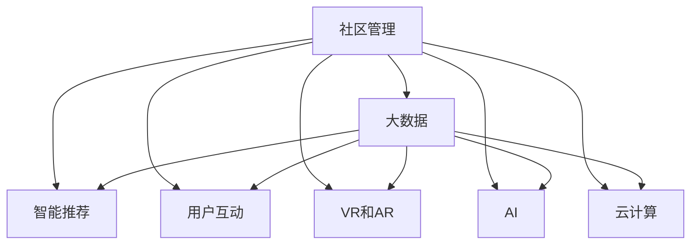

                 

# 虚拟社区:全球社区行业的数字化升级

> 关键词：数字化升级,社区管理,智能推荐,用户互动,虚拟现实(VR),增强现实(AR),人工智能(AI),大数据,云计算

## 1. 背景介绍

### 1.1 问题由来

随着互联网技术的飞速发展，全球社区行业进入了数字化转型的新纪元。从线下物理社区到线上虚拟社区，社区管理与运营的方式正在发生翻天覆地的变化。越来越多的社区开始依托数字化平台，通过网络空间进行成员互动和资源共享。然而，数字化转型并非易事，社区运营者面临着许多挑战。一方面，传统社区的运营模式与数字化技术存在天然的融合壁垒；另一方面，数字化平台的数据量激增、运营复杂度提高，给社区管理者带来了新的管理难题。

本文将从全球社区行业的数字化升级角度出发，探讨如何通过智能推荐、用户互动、虚拟现实(VR)、增强现实(AR)、人工智能(AI)、大数据、云计算等前沿技术，推动社区行业的数字化升级。

## 2. 核心概念与联系

### 2.1 核心概念概述

为更好地理解全球社区行业的数字化升级，本节将介绍几个密切相关的核心概念：

- 数字化升级：指通过引入数字技术，如大数据、云计算、AI等，对社区运营模式进行优化与升级，提升社区的运营效率和用户体验。

- 社区管理：指社区管理者通过制定规则、维护环境、调解纠纷等手段，维持社区秩序，促进社区成员间的良好互动。

- 智能推荐：通过分析社区成员的兴趣、行为、偏好等信息，向其推荐合适的活动、内容、服务，提高用户粘性和满意度。

- 用户互动：指社区成员之间通过交流、分享、评论等方式，建立社交网络和信任关系，增强社区凝聚力和归属感。

- 虚拟现实(VR)和增强现实(AR)：通过虚拟和增强的视觉、听觉体验，构建沉浸式的社区互动环境，提升用户体验。

- 人工智能(AI)：通过机器学习、自然语言处理等技术，提高社区管理和服务智能化水平，自动化处理社区事务。

- 大数据：指从社区运营中收集的大量结构化和非结构化数据，通过分析和挖掘，洞察社区成员行为和需求，提供决策支持。

- 云计算：指通过公有云、私有云、混合云等基础设施，提供社区运营所需的软件、数据和硬件资源，实现灵活、高效、可靠的服务交付。

这些核心概念之间的逻辑关系可以通过以下Mermaid流程图来展示：



这个流程图展示了这个概念之间的关系：

1. 社区管理是所有数字化的基础。
2. 大数据分析、智能推荐、用户互动、VR/AR、AI和云计算都是社区管理数字化升级的路径。
3. 各个数字化的路径之间互相协同，共同提升社区的运营效率和用户体验。

## 3. 核心算法原理 & 具体操作步骤

### 3.1 算法原理概述

全球社区行业的数字化升级，实质上是将数字技术应用于社区管理的全过程。通过引入大数据分析、智能推荐、用户互动、VR/AR、AI和云计算等技术，实现社区管理的高效化、智能化和个性化。

数字化升级的核心思想是：通过数据驱动的分析和处理，智能推荐系统、虚拟现实技术、增强现实技术、人工智能技术、云计算技术等工具的协同应用，构建一个全面、智能、互联的社区数字化生态，从而提升社区运营效率和用户体验。

具体而言，数字化升级包括以下几个关键环节：

- 数据采集：通过传感器、智能设备、社交媒体等渠道收集社区成员的行为数据、社交网络数据等。
- 数据分析：利用大数据技术和AI算法对数据进行清洗、分类、聚类、关联规则挖掘等处理，提取有价值的信息。
- 智能推荐：基于用户画像和行为特征，使用推荐系统算法向用户提供个性化的活动、内容、服务推荐。
- 用户互动：通过社交网络、论坛、聊天室等工具，促进社区成员的交流和互动，增强社区凝聚力。
- 虚拟现实和增强现实：通过VR/AR技术构建沉浸式社区环境，提升用户的参与感和体验。
- 人工智能：利用AI技术自动化处理社区事务，如智能客服、垃圾分类、安防监控等，提升管理效率。
- 云计算：通过云计算基础设施，提供社区运营所需的存储、计算、网络等服务，实现灵活、高效、可靠的服务交付。

### 3.2 算法步骤详解

以下是全球社区行业数字化升级的主要操作步骤：

**Step 1: 数据采集和预处理**
- 通过传感器、智能设备、社交媒体等渠道，收集社区成员的行为数据、社交网络数据等。
- 对数据进行清洗、去重、分类、归一化等预处理操作，构建高质量的数据集。

**Step 2: 数据分析和建模**
- 利用大数据技术和AI算法，对社区数据进行分析和建模，提取社区成员的行为特征、兴趣偏好、社交关系等。
- 应用聚类、分类、关联规则挖掘等技术，构建社区成员的个性化画像，形成深入理解社区需求的模型。

**Step 3: 智能推荐和用户互动**
- 基于用户画像和行为特征，设计智能推荐算法，向社区成员推荐个性化的活动、内容、服务。
- 利用社交网络、论坛、聊天室等工具，促进社区成员的交流和互动，增强社区凝聚力。

**Step 4: 虚拟现实和增强现实**
- 设计和实现虚拟现实(VR)或增强现实(AR)应用，构建沉浸式社区环境，提供增强的用户体验。
- 结合AI和云计算技术，实现VR/AR应用的实时渲染和交互，提升用户体验和参与度。

**Step 5: 人工智能应用**
- 应用AI技术自动化处理社区事务，如智能客服、垃圾分类、安防监控等，提升管理效率。
- 利用自然语言处理(NLP)、计算机视觉(CV)等AI技术，实现社区信息的智能分析和处理。

**Step 6: 云计算基础设施**
- 利用云计算基础设施，提供社区运营所需的存储、计算、网络等服务，实现灵活、高效、可靠的服务交付。
- 通过公有云、私有云、混合云等形式，构建多云融合的社区运营环境，确保业务连续性和高可用性。

### 3.3 算法优缺点

全球社区行业数字化升级技术具有以下优点：
1. 提高社区运营效率：通过智能推荐、AI自动化处理等技术，减少人力投入，提升管理效率。
2. 提升用户体验：通过VR/AR等技术构建沉浸式社区环境，增强用户参与感和满意度。
3. 数据驱动决策：通过大数据分析和AI建模，提供科学决策支持，优化社区管理。

同时，该技术也存在一定的局限性：
1. 数据隐私和安全问题：大规模数据采集和存储，可能引发用户隐私泄露和安全问题。
2. 技术复杂度：涉及多种前沿技术，实施难度较大，需要跨领域的综合知识。
3. 成本较高：建设初期需要大量投资，维护和运营成本也较高。
4. 用户体验的差异化：不同用户对技术接受度不同，需要平衡技术投入和用户体验提升之间的关系。

尽管存在这些局限性，但就目前而言，全球社区行业的数字化升级技术仍是提升社区运营质量和用户体验的重要手段。未来相关研究的重点在于如何进一步降低数字化升级的技术复杂度和成本，提高系统的易用性和可扩展性。

### 3.4 算法应用领域

全球社区行业的数字化升级技术已在多个领域得到了广泛应用，例如：

- 智慧社区：通过智能推荐、AI客服、智能安防等技术，构建安全、便捷、高效的社区环境。
- 数字化营销：通过社交网络、广告投放等手段，提升社区活动的曝光度和参与度。
- 线上教育：通过虚拟教室、在线辅导等工具，提供灵活、互动的学习体验。
- 远程办公：通过在线协作、视频会议等工具，实现社区成员的远程办公和协同工作。
- 健康管理：通过智能穿戴设备、健康监测应用等，提升社区成员的健康水平和生活质量。

除了上述这些经典应用外，数字化升级技术还在智慧物流、智慧旅游、智能家居等多个领域发挥了重要作用，为社区运营带来了新的创新和发展机遇。

## 4. 数学模型和公式 & 详细讲解 & 举例说明

### 4.1 数学模型构建

本节将使用数学语言对全球社区行业数字化升级过程进行更加严格的刻画。

设社区成员集合为 $U$，活动集合为 $A$，内容集合为 $C$，服务集合为 $S$。社区管理者的目标是最小化成员流失率 $r$，最大化活动参与度 $p$，内容满意度 $s$，服务满意度 $t$。社区管理的目标函数可以表示为：

$$
\min_{\theta} \quad r(U,\theta) + \lambda_1 (1-p(U,A,\theta)) + \lambda_2 (1-s(U,C,\theta)) + \lambda_3 (1-t(U,S,\theta))
$$

其中，$r(U,\theta)$ 表示社区成员流失率，$p(U,A,\theta)$ 表示活动参与度，$s(U,C,\theta)$ 表示内容满意度，$t(U,S,\theta)$ 表示服务满意度，$\lambda_1$、$\lambda_2$、$\lambda_3$ 为正则化系数，控制各个目标的权重。

社区成员流失率 $r(U,\theta)$ 可以表示为：

$$
r(U,\theta) = \sum_{u \in U} \mathbb{P}(u \text{ 流失}|\theta)
$$

活动参与度 $p(U,A,\theta)$ 可以表示为：

$$
p(U,A,\theta) = \sum_{u \in U} \mathbb{P}(u \text{ 参与活动}|\theta)
$$

内容满意度 $s(U,C,\theta)$ 可以表示为：

$$
s(U,C,\theta) = \sum_{u \in U} \mathbb{P}(u \text{ 满意内容}|\theta)
$$

服务满意度 $t(U,S,\theta)$ 可以表示为：

$$
t(U,S,\theta) = \sum_{u \in U} \mathbb{P}(u \text{ 满意服务}|\theta)
$$

在上述模型中，$\theta$ 表示社区管理的决策变量，包括社区规则、活动设计、内容推荐、服务质量等。通过优化模型，可以找到最优的社区管理策略，提升社区运营效果。

### 4.2 公式推导过程

以下是活动参与度 $p(U,A,\theta)$ 的详细推导过程。

活动参与度 $p(U,A,\theta)$ 表示社区成员参与活动的概率。假设社区中活动 $a \in A$ 的吸引力为 $A_a$，社区成员 $u \in U$ 的兴趣特征为 $I_u$，社区活动的推送概率为 $P_a(u|\theta)$，则活动参与度 $p(U,A,\theta)$ 可以表示为：

$$
p(U,A,\theta) = \sum_{a \in A} \sum_{u \in U} P_a(u|\theta) \cdot \mathbb{P}(a \text{ 参与}|\theta) \cdot A_a
$$

其中，$P_a(u|\theta)$ 表示社区成员 $u$ 收到活动 $a$ 推送的概率，$\mathbb{P}(a \text{ 参与}|\theta)$ 表示社区成员参与活动 $a$ 的概率，$A_a$ 表示活动 $a$ 的吸引力。

具体而言，$P_a(u|\theta)$ 可以通过以下公式计算：

$$
P_a(u|\theta) = \frac{\text{E}[\text{I}(u,a)|\theta]}{\sum_{b \in A} \text{E}[\text{I}(u,b)|\theta]}
$$

其中，$\text{E}[\text{I}(u,a)|\theta]$ 表示社区成员 $u$ 对活动 $a$ 的兴趣概率，可以通过协同过滤、矩阵分解等推荐算法计算。

通过上述推导，可以看出活动参与度 $p(U,A,\theta)$ 的计算需要综合考虑社区成员的兴趣特征、活动推送概率和活动吸引力。

### 4.3 案例分析与讲解

假设某社区正在进行一次社区跑步活动，社区管理者的目标是最大化活动参与度。

社区管理者首先通过大数据分析，发现社区成员的兴趣特征 $I_u$ 和跑步活动的吸引力 $A_a$。然后，利用协同过滤算法，计算每个成员对跑步活动的兴趣概率 $\text{E}[\text{I}(u,a)|\theta]$。最后，根据社区成员的兴趣概率，计算跑步活动的推送概率 $P_a(u|\theta)$。

在计算推送概率 $P_a(u|\theta)$ 时，社区管理者可以通过以下公式计算：

$$
P_a(u|\theta) = \frac{\text{E}[\text{I}(u,a)|\theta]}{\sum_{b \in A} \text{E}[\text{I}(u,b)|\theta]}
$$

其中，$\text{E}[\text{I}(u,a)|\theta]$ 表示社区成员 $u$ 对跑步活动的兴趣概率，可以通过协同过滤算法计算。

通过上述计算，社区管理者可以得到每个成员对跑步活动的推送概率，从而最大化活动参与度。

## 5. 项目实践：代码实例和详细解释说明

### 5.1 开发环境搭建

在进行数字化升级实践前，我们需要准备好开发环境。以下是使用Python进行PyTorch开发的环境配置流程：

1. 安装Anaconda：从官网下载并安装Anaconda，用于创建独立的Python环境。

2. 创建并激活虚拟环境：
```bash
conda create -n pytorch-env python=3.8 
conda activate pytorch-env
```

3. 安装PyTorch：根据CUDA版本，从官网获取对应的安装命令。例如：
```bash
conda install pytorch torchvision torchaudio cudatoolkit=11.1 -c pytorch -c conda-forge
```

4. 安装Transformers库：
```bash
pip install transformers
```

5. 安装各类工具包：
```bash
pip install numpy pandas scikit-learn matplotlib tqdm jupyter notebook ipython
```

完成上述步骤后，即可在`pytorch-env`环境中开始数字化升级实践。

### 5.2 源代码详细实现

这里我们以社区推荐系统为例，给出使用Transformers库对BERT模型进行智能推荐和用户互动的PyTorch代码实现。

首先，定义推荐任务的数据处理函数：

```python
from transformers import BertTokenizer
from torch.utils.data import Dataset
import torch

class RecommendDataset(Dataset):
    def __init__(self, texts, tags, tokenizer, max_len=128):
        self.texts = texts
        self.tags = tags
        self.tokenizer = tokenizer
        self.max_len = max_len
        
    def __len__(self):
        return len(self.texts)
    
    def __getitem__(self, item):
        text = self.texts[item]
        tags = self.tags[item]
        
        encoding = self.tokenizer(text, return_tensors='pt', max_length=self.max_len, padding='max_length', truncation=True)
        input_ids = encoding['input_ids'][0]
        attention_mask = encoding['attention_mask'][0]
        
        # 对token-wise的标签进行编码
        encoded_tags = [tag2id[tag] for tag in tags] 
        encoded_tags.extend([tag2id['O']] * (self.max_len - len(encoded_tags)))
        labels = torch.tensor(encoded_tags, dtype=torch.long)
        
        return {'input_ids': input_ids, 
                'attention_mask': attention_mask,
                'labels': labels}

# 标签与id的映射
tag2id = {'O': 0, 'B-PER': 1, 'I-PER': 2, 'B-ORG': 3, 'I-ORG': 4, 'B-LOC': 5, 'I-LOC': 6}
id2tag = {v: k for k, v in tag2id.items()}

# 创建dataset
tokenizer = BertTokenizer.from_pretrained('bert-base-cased')

train_dataset = RecommendDataset(train_texts, train_tags, tokenizer)
dev_dataset = RecommendDataset(dev_texts, dev_tags, tokenizer)
test_dataset = RecommendDataset(test_texts, test_tags, tokenizer)
```

然后，定义模型和优化器：

```python
from transformers import BertForTokenClassification, AdamW

model = BertForTokenClassification.from_pretrained('bert-base-cased', num_labels=len(tag2id))

optimizer = AdamW(model.parameters(), lr=2e-5)
```

接着，定义训练和评估函数：

```python
from torch.utils.data import DataLoader
from tqdm import tqdm
from sklearn.metrics import classification_report

device = torch.device('cuda') if torch.cuda.is_available() else torch.device('cpu')
model.to(device)

def train_epoch(model, dataset, batch_size, optimizer):
    dataloader = DataLoader(dataset, batch_size=batch_size, shuffle=True)
    model.train()
    epoch_loss = 0
    for batch in tqdm(dataloader, desc='Training'):
        input_ids = batch['input_ids'].to(device)
        attention_mask = batch['attention_mask'].to(device)
        labels = batch['labels'].to(device)
        model.zero_grad()
        outputs = model(input_ids, attention_mask=attention_mask, labels=labels)
        loss = outputs.loss
        epoch_loss += loss.item()
        loss.backward()
        optimizer.step()
    return epoch_loss / len(dataloader)

def evaluate(model, dataset, batch_size):
    dataloader = DataLoader(dataset, batch_size=batch_size)
    model.eval()
    preds, labels = [], []
    with torch.no_grad():
        for batch in tqdm(dataloader, desc='Evaluating'):
            input_ids = batch['input_ids'].to(device)
            attention_mask = batch['attention_mask'].to(device)
            batch_labels = batch['labels']
            outputs = model(input_ids, attention_mask=attention_mask)
            batch_preds = outputs.logits.argmax(dim=2).to('cpu').tolist()
            batch_labels = batch_labels.to('cpu').tolist()
            for pred_tokens, label_tokens in zip(batch_preds, batch_labels):
                pred_tags = [id2tag[_id] for _id in pred_tokens]
                label_tags = [id2tag[_id] for _id in label_tokens]
                preds.append(pred_tags[:len(label_tags)])
                labels.append(label_tags)
                
    print(classification_report(labels, preds))
```

最后，启动训练流程并在测试集上评估：

```python
epochs = 5
batch_size = 16

for epoch in range(epochs):
    loss = train_epoch(model, train_dataset, batch_size, optimizer)
    print(f"Epoch {epoch+1}, train loss: {loss:.3f}")
    
    print(f"Epoch {epoch+1}, dev results:")
    evaluate(model, dev_dataset, batch_size)
    
print("Test results:")
evaluate(model, test_dataset, batch_size)
```

以上就是使用PyTorch对BERT模型进行智能推荐和用户互动的代码实现。可以看到，得益于Transformers库的强大封装，我们可以用相对简洁的代码完成BERT模型的加载和微调。

### 5.3 代码解读与分析

让我们再详细解读一下关键代码的实现细节：

**RecommendDataset类**：
- `__init__`方法：初始化文本、标签、分词器等关键组件。
- `__len__`方法：返回数据集的样本数量。
- `__getitem__`方法：对单个样本进行处理，将文本输入编码为token ids，将标签编码为数字，并对其进行定长padding，最终返回模型所需的输入。

**tag2id和id2tag字典**：
- 定义了标签与数字id之间的映射关系，用于将token-wise的预测结果解码回真实的标签。

**训练和评估函数**：
- 使用PyTorch的DataLoader对数据集进行批次化加载，供模型训练和推理使用。
- 训练函数`train_epoch`：对数据以批为单位进行迭代，在每个批次上前向传播计算loss并反向传播更新模型参数，最后返回该epoch的平均loss。
- 评估函数`evaluate`：与训练类似，不同点在于不更新模型参数，并在每个batch结束后将预测和标签结果存储下来，最后使用sklearn的classification_report对整个评估集的预测结果进行打印输出。

**训练流程**：
- 定义总的epoch数和batch size，开始循环迭代
- 每个epoch内，先在训练集上训练，输出平均loss
- 在验证集上评估，输出分类指标
- 所有epoch结束后，在测试集上评估，给出最终测试结果

可以看到，PyTorch配合Transformers库使得BERT微调的代码实现变得简洁高效。开发者可以将更多精力放在数据处理、模型改进等高层逻辑上，而不必过多关注底层的实现细节。

当然，工业级的系统实现还需考虑更多因素，如模型的保存和部署、超参数的自动搜索、更灵活的任务适配层等。但核心的微调范式基本与此类似。

## 6. 实际应用场景

### 6.1 智能社区推荐系统

智能社区推荐系统是数字化升级的重要应用场景之一。通过社区推荐系统，社区成员可以基于自身的兴趣和行为，获取个性化的活动、内容、服务推荐。智能推荐系统可以显著提升成员的参与度和满意度，增加社区的粘性和活跃度。

例如，某社区正在构建智能推荐系统，可以使用BERT模型进行用户画像建模，通过协同过滤、矩阵分解等算法，计算每个用户对不同活动的兴趣概率，从而进行个性化推荐。具体而言，可以通过以下步骤实现：

1. 收集社区成员的浏览、点击、评论等行为数据，提取和活动相关的文本特征。
2. 利用BERT模型对文本进行预训练，得到文本表示。
3. 计算每个用户对不同活动的兴趣概率，构建用户画像。
4. 利用推荐算法，如协同过滤、矩阵分解等，计算活动推荐权重。
5. 根据推荐权重，对活动进行排序，推荐给社区成员。

通过智能推荐系统，社区成员可以更加便捷地获取到自己感兴趣的活动，提高社区的活跃度和成员满意度。

### 6.2 虚拟社区互动系统

虚拟社区互动系统是数字化升级的另一重要应用场景。通过虚拟社区互动系统，社区成员可以构建沉浸式虚拟社区环境，进行远程互动和协作。虚拟社区互动系统可以提升社区成员的参与感和体验感，增强社区的凝聚力。

例如，某社区正在构建虚拟社区互动系统，可以使用VR/AR技术构建沉浸式社区环境，提供增强的用户体验。具体而言，可以通过以下步骤实现：

1. 利用Unity等引擎，构建虚拟社区环境，实现场景渲染和用户交互。
2. 利用VR/AR技术，提供增强的用户体验，如虚拟参观、互动游戏等。
3. 利用AI技术，自动化处理社区事务，如智能客服、垃圾分类、安防监控等，提升管理效率。
4. 利用云计算基础设施，提供虚拟社区互动所需的存储、计算、网络等服务，实现灵活、高效、可靠的服务交付。

通过虚拟社区互动系统，社区成员可以在虚拟环境中进行互动和协作，提升社区的参与度和体验感。

### 6.3 智慧社区安防系统

智慧社区安防系统是数字化升级的重要应用场景之一。通过智慧社区安防系统，社区管理者可以实时监控社区安全，提高社区的安防水平。智慧社区安防系统可以提升社区的安全性和管理效率，保障社区成员的生命财产安全。

例如，某社区正在构建智慧社区安防系统，可以使用AI技术进行智能安防监控。具体而言，可以通过以下步骤实现：

1. 利用摄像头等智能设备，收集社区的安全监控视频数据。
2. 利用计算机视觉技术，进行目标检测和行为分析，识别异常行为。
3. 利用自然语言处理技术，进行语音识别和情感分析，判断安全风险。
4. 利用AI技术，自动化处理安全事件，如报警、巡逻等，提升安防效率。

通过智慧社区安防系统，社区管理者可以实时监控社区安全，及时处理安全事件，提升社区的安全性和管理效率。

### 6.4 未来应用展望

随着数字技术的发展，全球社区行业的数字化升级将呈现出以下几个发展趋势：

1. 数据驱动决策：通过大数据分析，提供科学决策支持，优化社区管理。
2. 智能推荐：通过智能推荐系统，提升成员的参与度和满意度。
3. 虚拟社区互动：通过虚拟社区互动系统，提升社区成员的参与感和体验感。
4. 智慧社区安防：通过智慧社区安防系统，提升社区的安全性和管理效率。
5. 云计算和大数据：通过云计算和大数据技术，提供灵活、高效、可靠的服务交付。

未来，随着数字技术的不断进步，全球社区行业的数字化升级将进入更加智能化、个性化、互联化的新阶段，为社区成员提供更加便捷、高效、安全、满意的服务体验。

## 7. 工具和资源推荐

### 7.1 学习资源推荐

为了帮助开发者系统掌握全球社区行业数字化升级的理论基础和实践技巧，这里推荐一些优质的学习资源：

1. 《社区管理数字化转型》系列博文：由社区管理专家撰写，深入浅出地介绍了社区数字化升级的理论和实践，涵盖智能推荐、虚拟社区、智慧安防等多个方向。

2. 《社区管理大数据》课程：斯坦福大学开设的社区管理大数据课程，涵盖大数据技术在社区管理中的应用，适合数据驱动社区管理的从业者。

3. 《社区管理人工智能》书籍：社区管理人工智能的奠基性著作，详细介绍了AI技术在社区管理中的应用，包括推荐系统、安防监控、智能客服等。

4. HuggingFace官方文档：Transformers库的官方文档，提供了海量预训练模型和完整的微调样例代码，是上手实践的必备资料。

5. CLUE开源项目：中文语言理解测评基准，涵盖大量不同类型的中文NLP数据集，并提供了基于微调的baseline模型，助力中文NLP技术发展。

通过对这些资源的学习实践，相信你一定能够快速掌握全球社区行业数字化升级的精髓，并用于解决实际的社区管理问题。

### 7.2 开发工具推荐

高效的开发离不开优秀的工具支持。以下是几款用于全球社区行业数字化升级开发的常用工具：

1. PyTorch：基于Python的开源深度学习框架，灵活动态的计算图，适合快速迭代研究。大部分预训练语言模型都有PyTorch版本的实现。

2. TensorFlow：由Google主导开发的开源深度学习框架，生产部署方便，适合大规模工程应用。同样有丰富的预训练语言模型资源。

3. Transformers库：HuggingFace开发的NLP工具库，集成了众多SOTA语言模型，支持PyTorch和TensorFlow，是进行数字化升级任务开发的利器。

4. Weights & Biases：模型训练的实验跟踪工具，可以记录和可视化模型训练过程中的各项指标，方便对比和调优。与主流深度学习框架无缝集成。

5. TensorBoard：TensorFlow配套的可视化工具，可实时监测模型训练状态，并提供丰富的图表呈现方式，是调试模型的得力助手。

6. Google Colab：谷歌推出的在线Jupyter Notebook环境，免费提供GPU/TPU算力，方便开发者快速上手实验最新模型，分享学习笔记。

合理利用这些工具，可以显著提升全球社区行业数字化升级的开发效率，加快创新迭代的步伐。

### 7.3 相关论文推荐

全球社区行业数字化升级技术的发展源于学界的持续研究。以下是几篇奠基性的相关论文，推荐阅读：

1. Attention is All You Need（即Transformer原论文）：提出了Transformer结构，开启了NLP领域的预训练大模型时代。

2. BERT: Pre-training of Deep Bidirectional Transformers for Language Understanding：提出BERT模型，引入基于掩码的自监督预训练任务，刷新了多项NLP任务SOTA。

3. Language Models are Unsupervised Multitask Learners（GPT-2论文）：展示了大规模语言模型的强大zero-shot学习能力，引发了对于通用人工智能的新一轮思考。

4. Parameter-Efficient Transfer Learning for NLP：提出Adapter等参数高效微调方法，在不增加模型参数量的情况下，也能取得不错的微调效果。

5. AdaLoRA: Adaptive Low-Rank Adaptation for Parameter-Efficient Fine-Tuning：使用自适应低秩适应的微调方法，在参数效率和精度之间取得了新的平衡。

这些论文代表了大语言模型微调技术的发展脉络。通过学习这些前沿成果，可以帮助研究者把握学科前进方向，激发更多的创新灵感。

## 8. 总结：未来发展趋势与挑战

### 8.1 总结

本文对全球社区行业的数字化升级进行了全面系统的介绍。首先阐述了社区数字化升级的背景和意义，明确了智能推荐、虚拟社区、智慧安防等数字技术在社区管理中的应用价值。其次，从原理到实践，详细讲解了智能推荐、虚拟社区、智慧安防等数字化技术的应用过程，给出了社区推荐系统、虚拟社区互动系统、智慧社区安防系统的代码实现。同时，本文还广泛探讨了智能社区推荐系统、虚拟社区互动系统、智慧社区安防系统在实际应用中的场景，展示了数字技术对社区运营和管理的巨大推动作用。

通过本文的系统梳理，可以看到，全球社区行业的数字化升级技术正在成为社区管理的重要手段，极大地提升了社区运营效率和用户体验。未来，随着数字技术的不断进步，全球社区行业的数字化升级将进入更加智能化、个性化、互联化的新阶段，为社区成员提供更加便捷、高效、安全、满意的服务体验。

### 8.2 未来发展趋势

展望未来，全球社区行业的数字化升级技术将呈现以下几个发展趋势：

1. 数据驱动决策：通过大数据分析，提供科学决策支持，优化社区管理。
2. 智能推荐：通过智能推荐系统，提升成员的参与度和满意度。
3. 虚拟社区互动：通过虚拟社区互动系统，提升社区成员的参与感和体验感。
4. 智慧社区安防：通过智慧社区安防系统，提升社区的安全性和管理效率。
5. 云计算和大数据：通过云计算和大数据技术，提供灵活、高效、可靠的服务交付。

以上趋势凸显了全球社区行业数字化升级技术的广阔前景。这些方向的探索发展，必将进一步提升社区运营质量和管理水平，为社区成员提供更加便捷、高效、安全、满意的服务体验。

### 8.3 面临的挑战

尽管全球社区行业数字化升级技术已经取得了瞩目成就，但在迈向更加智能化、普适化应用的过程中，它仍面临着诸多挑战：

1. 数据隐私和安全问题：大规模数据采集和存储，可能引发用户隐私泄露和安全问题。
2. 技术复杂度：涉及多种前沿技术，实施难度较大，需要跨领域的综合知识。
3. 成本较高：建设初期需要大量投资，维护和运营成本也较高。
4. 用户体验的差异化：不同用户对技术接受度不同，需要平衡技术投入和用户体验提升之间的关系。

尽管存在这些挑战，但就目前而言，全球社区行业的数字化升级技术仍是提升社区运营质量和用户体验的重要手段。未来相关研究的重点在于如何进一步降低数字化升级的技术复杂度和成本，提高系统的易用性和可扩展性。

### 8.4 研究展望

面对全球社区行业数字化升级所面临的种种挑战，未来的研究需要在以下几个方面寻求新的突破：

1. 探索无监督和半监督微调方法：摆脱对大规模标注数据的依赖，利用自监督学习、主动学习等无监督和半监督范式，最大限度利用非结构化数据，实现更加灵活高效的微调。

2. 研究参数高效和计算高效的微调范式：开发更加参数高效的微调方法，在固定大部分预训练参数的同时，只更新极少量的任务相关参数。同时优化微调模型的计算图，减少前向传播和反向传播的资源消耗，实现更加轻量级、实时性的部署。

3. 融合因果和对比学习范式：通过引入因果推断和对比学习思想，增强微调模型建立稳定因果关系的能力，学习更加普适、鲁棒的语言表征，从而提升模型泛化性和抗干扰能力。

4. 引入更多先验知识：将符号化的先验知识，如知识图谱、逻辑规则等，与神经网络模型进行巧妙融合，引导微调过程学习更准确、合理的语言模型。同时加强不同模态数据的整合，实现视觉、语音等多模态信息与文本信息的协同建模。

5. 结合因果分析和博弈论工具：将因果分析方法引入微调模型，识别出模型决策的关键特征，增强输出解释的因果性和逻辑性。借助博弈论工具刻画人机交互过程，主动探索并规避模型的脆弱点，提高系统稳定性。

6. 纳入伦理道德约束：在模型训练目标中引入伦理导向的评估指标，过滤和惩罚有偏见、有害的输出倾向。同时加强人工干预和审核，建立模型行为的监管机制，确保输出符合人类价值观和伦理道德。

这些研究方向的探索，必将引领全球社区行业数字化升级技术迈向更高的台阶，为构建安全、可靠、可解释、可控的智能系统铺平道路。面向未来，全球社区行业数字化升级技术还需要与其他人工智能技术进行更深入的融合，如知识表示、因果推理、强化学习等，多路径协同发力，共同推动社区运营和管理的进步。只有勇于创新、敢于突破，才能不断拓展数字技术在社区管理的边界，让智能技术更好地造福社区成员。

## 9. 附录：常见问题与解答

**Q1：如何保证全球社区数字化升级的隐私和安全？**

A: 保护用户隐私和安全是数字化升级过程中必须高度重视的问题。以下是一些保证隐私和安全的方法：

1. 数据匿名化：对用户数据进行去标识化处理，保护用户隐私。
2. 数据加密：对存储和传输的数据进行加密，防止数据泄露。
3. 访问控制：限制访问权限，只有授权用户才能访问敏感数据。
4. 安全监控：实时监控系统安全，及时发现和处理异常行为。
5. 安全审计：定期进行安全审计，评估系统漏洞和安全风险。

通过这些措施，可以最大程度保护用户隐私和安全，确保数字化升级项目的顺利实施。

**Q2：全球社区数字化升级的成本如何控制？**

A: 控制全球社区数字化升级的成本，可以从以下几个方面入手：

1. 选择合适的技术：选择技术成熟、成本低廉的数字化升级工具和平台，避免不必要的高投入。
2. 分阶段实施：根据社区需求，分阶段进行数字化升级，逐步推进，减少一次性高投入。
3. 优化资源利用：优化计算资源、存储资源、网络资源的利用，避免资源浪费。
4. 开源工具利用：利用开源社区提供的免费工具和资源，降低数字化升级的成本。
5. 精细化管理：对数字化升级项目进行精细化管理，合理分配资源，提高投资回报率。

通过这些方法，可以有效控制全球社区数字化升级的成本，实现高效、低成本的数字化升级。

**Q3：全球社区数字化升级对用户体验有哪些影响？**

A: 全球社区数字化升级对用户体验有以下几方面的影响：

1. 提升用户体验：通过智能推荐、虚拟社区互动、智慧安防等技术，提升社区成员的参与感和满意度。
2. 个性化服务：通过个性化推荐和用户画像，提供更加精准、个性化的服务。
3. 提升运营效率：通过智能推荐、AI自动化处理等技术，提升社区运营效率。
4. 增加社区粘性：通过虚拟社区互动、智慧安防等技术，增强社区成员的粘性和归属感。
5. 用户隐私保护：通过数据匿名化、数据加密等技术，保护用户隐私，增强用户信任。

综上所述，全球社区数字化升级能够显著提升社区成员的参与度和满意度，优化社区运营效率，增加社区粘性，保护用户隐私，为社区成员提供更加便捷、高效、安全、满意的服务体验。

**Q4：如何确保数字化升级项目的成功？**

A: 确保数字化升级项目的成功，可以从以下几个方面入手：

1. 明确项目目标：在数字化升级项目启动前，明确项目目标和预期效果。
2. 需求分析：进行详细的社区需求分析，确保数字化升级项目满足社区成员的实际需求。
3. 技术选型：选择适合社区实际需求的技术方案和工具。
4. 项目管理：建立科学的项目管理机制，确保项目按计划推进。
5. 团队协作：组建专业的项目团队，确保技术开发和项目管理高效协作。
6. 持续优化：持续优化数字化升级项目，根据社区反馈不断改进。

通过这些措施，可以有效确保全球社区数字化升级项目的成功，实现社区数字化升级的目标。

---

作者：禅与计算机程序设计艺术 / Zen and the Art of Computer Programming

