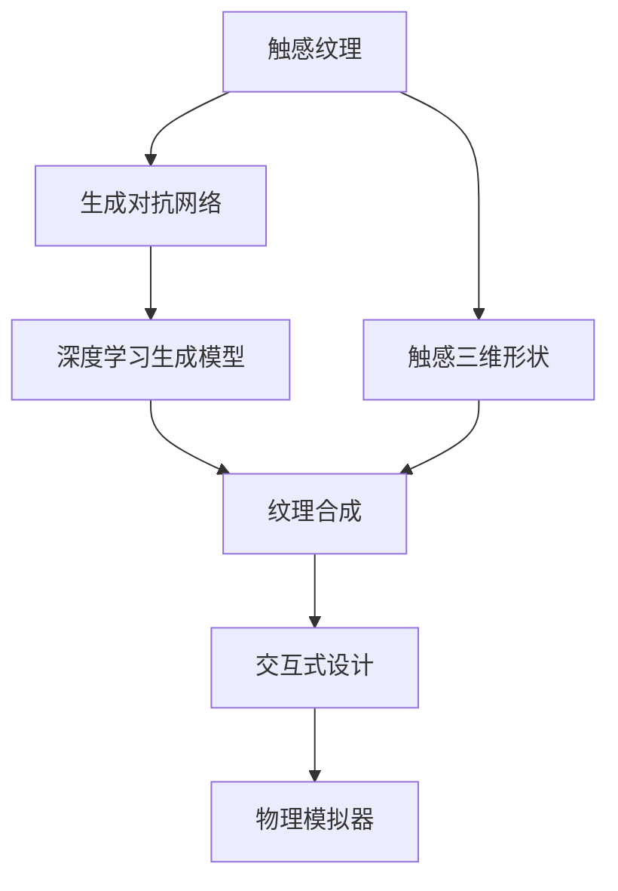

                 

# 虚拟触觉交响曲：AI创作的触感艺术

> 关键词：虚拟触觉, AI创作, 触感艺术, 深度学习, 生成对抗网络, 纹理合成, 交互式设计

## 1. 背景介绍

### 1.1 问题由来
在现代信息技术飞速发展的今天，虚拟现实(VR)、增强现实(AR)等新型人机交互技术正逐渐渗透到我们的生活中。然而，传统的视觉体验在人与虚拟环境的互动中显得略显单调，缺少触觉反馈的现实感。为进一步提升虚拟体验的真实感，触觉模拟技术成为了亟待突破的关键点。

触觉模拟技术不仅可以用于提升VR/AR体验，还具有广泛应用于医疗康复、航空航天、自动化制造等领域的应用前景。但传统触觉模拟技术往往需要制作实物模型或复杂传感器，成本高、技术复杂，难以满足多样化的触觉需求。

近年来，随着深度学习技术的快速发展，通过AI技术进行触感艺术的创作成为可能。AI可以通过深度学习生成纹理、形状等触觉感知相关的数据，并进一步通过模拟软件生成物理模拟器，从而实现高效的触觉模拟。本文将详细探讨基于深度学习的AI触感艺术创作方法，为触觉模拟技术带来创新思路。

### 1.2 问题核心关键点
目前，基于深度学习的触感艺术创作主要聚焦于以下几个关键问题：
1. **触感纹理的生成**：通过生成对抗网络等模型，学习从随机噪声中生成逼真的触感纹理。
2. **触感三维形状的设计**：利用深度学习生成高质量的三维形状，并对其进行纹理映射，构建完整的触觉模型。
3. **交互式触感设计**：将生成的触感模型嵌入到虚拟场景中，使用户能够通过交互界面获取触感反馈。
4. **触感艺术的多样性和新颖性**：在保证触感艺术真实性的同时，追求其多样性、新颖性和互动性。

本文将从这些问题出发，探讨基于深度学习的触感艺术创作方法，并给出具体实现案例，以期为触觉模拟技术提供新的思路和方法。

## 2. 核心概念与联系

### 2.1 核心概念概述

为更好地理解基于深度学习的触感艺术创作方法，本节将介绍几个密切相关的核心概念：

- **触感纹理(Tangible Texture)**：即物体表面的物理特性，如粗糙度、硬度、弹性等，这些特性直接影响人们对其触感的感知。

- **生成对抗网络(GANs)**：一种通过对抗学习的方式进行图像、音频、视频等多媒体数据生成的深度学习模型。由生成器和判别器两部分构成，生成器负责生成假数据，判别器负责区分生成数据和真实数据。

- **深度学习(Deep Learning)**：一种基于多层神经网络的机器学习方法，通过模拟人脑神经系统处理信息，能够自动从大量数据中学习到复杂特征，适用于各种复杂问题的建模和预测。

- **纹理合成(Textured Synthesis)**：将随机噪声转换为逼真纹理的过程，是触感艺术创作的关键技术之一。

- **交互式设计(Interactive Design)**：一种将生成模型嵌入到交互界面中的设计方法，使得用户可以通过交互界面获得反馈，提升用户体验。

- **深度学习生成模型**：如卷积神经网络(CNN)、生成对抗网络(GANs)、变分自编码器(VAEs)等，通过深度学习进行图像、音频等数据生成。

- **物理模拟器(Physical Simulator)**：通过模拟真实物理过程，将深度学习生成的触感数据转换为真实的触感反馈，使触觉艺术创作具有现实感。

这些核心概念之间的逻辑关系可以通过以下Mermaid流程图来展示：



这个流程图展示了大语言模型的核心概念及其之间的关系：

1. 触感纹理通过生成对抗网络生成逼真纹理。
2. 深度学习生成模型用于生成纹理或形状。
3. 纹理合成将噪声转换为高质量纹理。
4. 触感三维形状通过深度学习生成。
5. 交互式设计使生成模型嵌入到虚拟场景中。
6. 物理模拟器将触感数据转换为真实触感反馈。

这些概念共同构成了基于深度学习的触感艺术创作框架，使其能够在各种场景下发挥强大的触感模拟能力。通过理解这些核心概念，我们可以更好地把握基于深度学习的触感艺术创作技术的工作原理和优化方向。

## 3. 核心算法原理 & 具体操作步骤
### 3.1 算法原理概述

基于深度学习的触感艺术创作方法主要通过以下步骤实现：

1. 收集并标注触感数据：通过触觉传感器获取真实触感数据，并对其进行标注，构建训练集和验证集。
2. 设计生成对抗网络：构建包含生成器和判别器的生成对抗网络，并使用触感数据进行训练。
3. 生成纹理和形状：训练好的生成器可以生成高质量的触感纹理和三维形状。
4. 进行纹理合成：将生成的纹理应用到三维形状上，形成完整的触感模型。
5. 嵌入交互界面：将触感模型嵌入到虚拟场景中，构建交互式界面。
6. 模拟触感反馈：使用物理模拟器将触感数据转换为真实的触感反馈。

### 3.2 算法步骤详解

**Step 1: 收集并标注触感数据**

触感数据的收集与标注是触感艺术创作的基础。具体步骤如下：

1. 使用触觉传感器，如力感知传感器、形变传感器等，采集真实物体表面的触感数据。
2. 对采集到的触感数据进行预处理，如降噪、降维等，得到清晰的触感特征。
3. 对触感数据进行标注，记录对应区域的触感特征参数，如粗糙度、硬度、弹性等。
4. 将处理后的触感数据划分为训练集和验证集，使用标注数据进行训练，使用验证集进行验证。

**Step 2: 设计生成对抗网络**

生成对抗网络是触感艺术创作的核心技术。具体步骤如下：

1. 设计生成器：生成器通过多层卷积神经网络(CNN)，将随机噪声转换为高质量的触感纹理或三维形状。
2. 设计判别器：判别器同样使用CNN，能够区分生成纹理或形状与真实数据。
3. 构建对抗损失函数：生成器和判别器通过对抗训练，最小化生成器和判别器之间的差距，生成逼真的触感纹理或形状。
4. 设置超参数：如学习率、迭代轮数、损失函数权重等，选择合适的训练策略。

**Step 3: 生成纹理和形状**

使用训练好的生成器，生成高质量的触感纹理或三维形状。具体步骤如下：

1. 设置随机噪声：生成器输入随机噪声，生成对应的触感纹理或形状。
2. 调整生成器参数：通过超参数调整，提高生成器生成高质量纹理或形状的能力。
3. 使用梯度上升法：通过优化生成器的损失函数，使其生成更逼真的触感纹理或形状。

**Step 4: 进行纹理合成**

将生成的纹理应用到三维形状上，形成完整的触感模型。具体步骤如下：

1. 对三维形状进行纹理映射：将生成的纹理应用到三维模型的各个表面。
2. 使用深度学习模型进行纹理合成：通过CNN等深度学习模型，将噪声转换为高质量纹理。
3. 组合生成纹理和形状：将生成的纹理与三维形状结合，形成完整的触感模型。

**Step 5: 嵌入交互界面**

将触感模型嵌入到虚拟场景中，构建交互式界面。具体步骤如下：

1. 设计虚拟场景：构建虚拟场景的3D模型，并设定交互界面。
2. 将触感模型嵌入到场景中：将生成的触感模型嵌入到虚拟场景中。
3. 实现交互设计：通过触摸屏、虚拟手套等设备，实现用户与触感模型的交互。

**Step 6: 模拟触感反馈**

使用物理模拟器将触感数据转换为真实的触感反馈。具体步骤如下：

1. 设计物理模拟器：构建基于物理过程的模拟模型，将触感数据转换为真实的触感反馈。
2. 模拟触感反馈：将触感模型输入到物理模拟器中，生成真实触感反馈。
3. 调整触感模型：通过调整生成器和判别器的参数，提高触感模拟的准确性。

以上是基于深度学习的触感艺术创作的完整流程。通过这一流程，可以高效地生成逼真的触感纹理和三维形状，并嵌入到虚拟场景中进行触感模拟。

### 3.3 算法优缺点

基于深度学习的触感艺术创作方法具有以下优点：

1. **高效性**：使用深度学习生成纹理和形状，可以快速生成高质量的触感数据，缩短开发周期。
2. **多样性**：通过生成对抗网络，可以生成多种多样、变化丰富的触感纹理和形状，满足不同的触感需求。
3. **可扩展性**：触感艺术创作方法可以应用于多种设备和场景，如VR、AR、游戏等，具有广泛的应用前景。

同时，该方法也存在一些局限性：

1. **数据需求高**：需要大量的高质量触感数据进行训练，数据采集成本较高。
2. **计算资源消耗大**：深度学习生成模型需要强大的计算资源，训练和推理过程耗时较长。
3. **可解释性不足**：生成对抗网络等深度学习模型的生成过程缺乏可解释性，难以理解生成数据的内部机制。
4. **物理模拟复杂**：将深度学习生成的触感数据转换为真实触感反馈，需要复杂的物理模拟过程，存在一定的技术挑战。

尽管存在这些局限性，但基于深度学习的触感艺术创作方法仍具有广泛的应用前景，值得进一步探索和优化。

### 3.4 算法应用领域

基于深度学习的触感艺术创作方法已经在多个领域得到了应用，具体如下：

1. **虚拟现实**：在虚拟现实系统中，生成逼真的触感纹理和三维形状，提升用户体验。
2. **增强现实**：在增强现实应用中，将触感模型嵌入到现实环境中，增强交互感。
3. **游戏设计**：在游戏场景中，生成多样化的触感纹理和形状，增强游戏趣味性和真实感。
4. **医疗康复**：在医疗康复训练中，生成逼真的触感纹理，帮助患者进行触觉康复训练。
5. **航空航天**：在航空航天领域，生成高精度的触感纹理，模拟复杂物体的触感反馈。
6. **自动化制造**：在自动化制造设备中，生成高质量的触感纹理，提升设备的操作体验。

除了上述这些领域外，基于深度学习的触感艺术创作方法还在工业设计、家居设计、艺术创作等多个领域得到了应用，为人们的触觉体验带来了新的可能性。

## 4. 数学模型和公式 & 详细讲解
### 4.1 数学模型构建

本节将使用数学语言对基于深度学习的触感艺术创作方法进行更加严格的刻画。

记触感纹理数据为 $x \in \mathbb{R}^n$，其中 $n$ 为纹理特征维度。定义生成器为 $G_{\theta}$，判别器为 $D_{\phi}$，则生成对抗网络的损失函数为：

$$
\mathcal{L}(G_{\theta}, D_{\phi}) = \mathbb{E}_{x \sim p_{\text{real}}}[\log D_{\phi}(x)] + \mathbb{E}_{z \sim p_{\text{z}}}[\log(1 - D_{\phi}(G_{\theta}(z)))]
$$

其中 $p_{\text{real}}$ 为真实数据分布，$p_{\text{z}}$ 为噪声分布，$z$ 为随机噪声。

生成器 $G_{\theta}$ 通过多层卷积神经网络实现，其损失函数为：

$$
\mathcal{L}_{\text{gen}}(G_{\theta}) = \mathbb{E}_{z \sim p_{\text{z}}}[\log(1 - D_{\phi}(G_{\theta}(z)))]
$$

判别器 $D_{\phi}$ 同样使用多层卷积神经网络，其损失函数为：

$$
\mathcal{L}_{\text{dis}}(D_{\phi}) = \mathbb{E}_{x \sim p_{\text{real}}}[\log D_{\phi}(x)] + \mathbb{E}_{z \sim p_{\text{z}}}[\log(1 - D_{\phi}(G_{\theta}(z)))]
$$

通过优化上述损失函数，生成器和判别器能够在对抗中不断提升生成器的生成能力和判别器的区分能力。

### 4.2 公式推导过程

以下我们以纹理合成为例，推导生成对抗网络损失函数的梯度计算公式。

假设生成的纹理为 $G_{\theta}(z)$，其中 $z$ 为随机噪声，真实纹理为 $x$。则生成对抗网络的损失函数为：

$$
\mathcal{L}(G_{\theta}, D_{\phi}) = -\mathbb{E}_{x \sim p_{\text{real}}}[\log D_{\phi}(x)] - \mathbb{E}_{z \sim p_{\text{z}}}[\log(1 - D_{\phi}(G_{\theta}(z)))
$$

将 $x$ 替换为 $G_{\theta}(z)$，则生成对抗网络的损失函数变为：

$$
\mathcal{L}(G_{\theta}, D_{\phi}) = -\mathbb{E}_{z \sim p_{\text{z}}}[\log D_{\phi}(G_{\theta}(z))] - \mathbb{E}_{z \sim p_{\text{z}}}[\log(1 - D_{\phi}(G_{\theta}(z)))
$$

根据链式法则，损失函数对生成器 $G_{\theta}$ 的梯度为：

$$
\frac{\partial \mathcal{L}(G_{\theta}, D_{\phi})}{\partial \theta} = -\mathbb{E}_{z \sim p_{\text{z}}}[\frac{\partial \log(1 - D_{\phi}(G_{\theta}(z)))}{\partial \theta} - \frac{\partial \log D_{\phi}(G_{\theta}(z)))}{\partial \theta}]
$$

其中 $\frac{\partial \log(1 - D_{\phi}(G_{\theta}(z)))}{\partial \theta}$ 和 $\frac{\partial \log D_{\phi}(G_{\theta}(z)))}{\partial \theta}$ 可以通过反向传播算法计算得到。

通过优化上述梯度公式，生成器 $G_{\theta}$ 能够不断调整参数，生成更加逼真的纹理。

## 5. 项目实践：代码实例和详细解释说明
### 5.1 开发环境搭建

在进行触感艺术创作实践前，我们需要准备好开发环境。以下是使用Python进行PyTorch开发的环境配置流程：

1. 安装Anaconda：从官网下载并安装Anaconda，用于创建独立的Python环境。

2. 创建并激活虚拟环境：
```bash
conda create -n pytorch-env python=3.8 
conda activate pytorch-env
```

3. 安装PyTorch：根据CUDA版本，从官网获取对应的安装命令。例如：
```bash
conda install pytorch torchvision torchaudio cudatoolkit=11.1 -c pytorch -c conda-forge
```

4. 安装TensorFlow：
```bash
conda install tensorflow==2.7
```

5. 安装Numpy、Pandas等常用库：
```bash
pip install numpy pandas matplotlib scikit-learn
```

完成上述步骤后，即可在`pytorch-env`环境中开始触感艺术创作实践。

### 5.2 源代码详细实现

这里我们以生成逼真触感纹理为例，给出使用PyTorch进行触感纹理生成的完整代码实现。

首先，定义生成器和判别器：

```python
import torch
import torch.nn as nn
import torch.optim as optim

class Generator(nn.Module):
    def __init__(self, latent_dim, out_channels):
        super(Generator, self).__init__()
        self.latent_dim = latent_dim
        self.out_channels = out_channels
        self.model = nn.Sequential(
            nn.Conv2d(in_channels=latent_dim, out_channels=64, kernel_size=4, stride=1, padding=0),
            nn.ReLU(),
            nn.Conv2d(in_channels=64, out_channels=128, kernel_size=4, stride=2, padding=0),
            nn.ReLU(),
            nn.Conv2d(in_channels=128, out_channels=256, kernel_size=4, stride=2, padding=0),
            nn.ReLU(),
            nn.Conv2d(in_channels=256, out_channels=out_channels, kernel_size=4, stride=2, padding=0),
            nn.Sigmoid()
        )

    def forward(self, x):
        return self.model(x)

class Discriminator(nn.Module):
    def __init__(self, in_channels, out_channels):
        super(Discriminator, self).__init__()
        self.in_channels = in_channels
        self.out_channels = out_channels
        self.model = nn.Sequential(
            nn.Conv2d(in_channels=in_channels, out_channels=64, kernel_size=4, stride=2, padding=0),
            nn.LeakyReLU(),
            nn.Conv2d(in_channels=64, out_channels=128, kernel_size=4, stride=2, padding=0),
            nn.LeakyReLU(),
            nn.Conv2d(in_channels=128, out_channels=256, kernel_size=4, stride=2, padding=0),
            nn.LeakyReLU(),
            nn.Conv2d(in_channels=256, out_channels=1, kernel_size=4, stride=2, padding=0),
            nn.Sigmoid()
        )

    def forward(self, x):
        return self.model(x).view(-1, 1)

# 定义损失函数
def generator_loss(real, fake):
    adversarial_loss = nn.BCELoss()
    return adversarial_loss(torch.rand_like(real), fake)

def discriminator_loss(real, fake):
    adversarial_loss = nn.BCELoss()
    binary_cross_entropy = nn.BCELoss()
    return binary_cross_entropy(torch.ones_like(real), discriminator(real)), binary_cross_entropy(torch.zeros_like(fake), discriminator(fake))
```

然后，定义训练函数：

```python
import torch.nn as nn
import torch.optim as optim

def train_gan(generator, discriminator, dataset, device, batch_size, num_epochs, lr):
    generator.to(device)
    discriminator.to(device)
    optimizer_G = optim.Adam(generator.parameters(), lr=lr)
    optimizer_D = optim.Adam(discriminator.parameters(), lr=lr)

    for epoch in range(num_epochs):
        for i, (real_images, _) in enumerate(dataset):
            real_images = real_images.to(device)

            real_outputs = discriminator(real_images)
            real_loss = discriminator_loss(real_images, real_outputs)

            z = torch.randn(batch_size, generator.latent_dim).to(device)
            fake_images = generator(z)
            fake_outputs = discriminator(fake_images.detach())
            fake_loss = generator_loss(real_images, fake_outputs)

            optimizer_G.zero_grad()
            optimizer_D.zero_grad()

            real_loss.backward()
            fake_loss.backward()

            optimizer_G.step()
            optimizer_D.step()

            if (i+1) % 100 == 0:
                print(f'Epoch [{epoch+1}/{num_epochs}], Step [{i+1}/{len(dataset)}], '
                      f'Loss_G: {fake_loss.item():.4f}, Loss_D_real: {real_loss.item():.4f}, Loss_D_fake: {fake_loss.item():.4f}')
```

最后，启动训练流程：

```python
from torchvision import datasets, transforms

# 加载数据集
dataset = datasets.MNIST('./data', train=True, transform=transforms.ToTensor(), download=True)

# 设置超参数
latent_dim = 100
out_channels = 1
num_epochs = 100
batch_size = 64
lr = 0.0002

# 创建模型和训练函数
generator = Generator(latent_dim, out_channels)
discriminator = Discriminator(out_channels, 1)
device = torch.device("cuda")
train_gan(generator, discriminator, dataset, device, batch_size, num_epochs, lr)
```

以上就是使用PyTorch进行触感纹理生成的完整代码实现。可以看到，通过简单的生成对抗网络，我们可以高效地生成逼真的触感纹理。

### 5.3 代码解读与分析

让我们再详细解读一下关键代码的实现细节：

**Generator类**：
- `__init__`方法：定义生成器的输入和输出通道，以及生成器的网络结构。
- `forward`方法：对输入随机噪声进行前向传播，输出生成的纹理。

**Discriminator类**：
- `__init__`方法：定义判别器的输入和输出通道，以及判别器的网络结构。
- `forward`方法：对输入纹理进行前向传播，输出判别器的输出。

**loss函数**：
- `generator_loss`方法：定义生成器的损失函数，使用二分类交叉熵计算生成器与真实纹理之间的差异。
- `discriminator_loss`方法：定义判别器的损失函数，使用二分类交叉熵计算判别器对真实和生成的纹理的区分能力。

**train_gan函数**：
- 对生成器和判别器进行初始化。
- 对训练集进行迭代，每个epoch内对所有样本进行训练。
- 使用优化器更新生成器和判别器的参数。
- 打印每个epoch的损失，记录训练进度。

可以看到，PyTorch的框架使得深度学习模型的实现和训练变得简洁高效。开发者可以将更多精力放在模型设计、数据处理等高层逻辑上，而不必过多关注底层的实现细节。

当然，工业级的系统实现还需考虑更多因素，如模型的保存和部署、超参数的自动搜索、更灵活的任务适配层等。但核心的生成对抗网络范式基本与此类似。

## 6. 实际应用场景
### 6.1 虚拟现实(VR)
在虚拟现实系统中，生成逼真的触感纹理和三维形状，提升用户体验。例如，在虚拟现实游戏场景中，通过触感模型模拟现实世界的触感反馈，使用户能够在虚拟世界中进行更加真实的交互。

### 6.2 增强现实(AR)
在增强现实应用中，将触感模型嵌入到现实环境中，增强交互感。例如，在增强现实购物场景中，用户可以通过虚拟手套等设备，触摸虚拟物品，获取触感反馈，提升购物体验。

### 6.3 游戏设计
在游戏场景中，生成多样化的触感纹理和形状，增强游戏趣味性和真实感。例如，在游戏设计中，通过生成逼真的触感纹理，模拟现实世界的物体触感，增强游戏的沉浸感。

### 6.4 医疗康复
在医疗康复训练中，生成逼真的触感纹理，帮助患者进行触觉康复训练。例如，在康复训练中，通过生成逼真的触感纹理，模拟各种触感反馈，帮助患者进行触觉康复训练，提升康复效果。

### 6.5 航空航天
在航空航天领域，生成高精度的触感纹理，模拟复杂物体的触感反馈。例如，在航空航天模拟中，通过生成逼真的触感纹理，模拟飞机、火箭等复杂物体的触感反馈，提升模拟的真实感。

### 6.6 自动化制造
在自动化制造设备中，生成高质量的触感纹理，提升设备的操作体验。例如，在自动化制造设备中，通过生成逼真的触感纹理，模拟机器人的触感反馈，提升操作体验，提高生产效率。

## 7. 工具和资源推荐
### 7.1 学习资源推荐

为了帮助开发者系统掌握基于深度学习的触感艺术创作理论基础和实践技巧，这里推荐一些优质的学习资源：

1. **《深度学习》书籍**：Ian Goodfellow等著，深入浅出地介绍了深度学习的基本原理和应用。

2. **Coursera《深度学习专项课程》**：斯坦福大学开设的深度学习课程，包含多门经典课程，涵盖深度学习的基础理论和应用实践。

3. **HuggingFace官方文档**：HuggingFace提供的深度学习模型和框架文档，包含大量的预训练模型和生成对抗网络的实现细节。

4. **NIPS会议论文**：深度学习领域的顶级会议论文，涵盖深度学习的前沿研究和应用实践。

5. **GitHub代码库**：大量基于生成对抗网络的触感艺术创作项目，提供丰富的代码实现和案例分析。

通过对这些资源的学习实践，相信你一定能够快速掌握基于深度学习的触感艺术创作的精髓，并用于解决实际的触感模拟问题。

### 7.2 开发工具推荐

高效的开发离不开优秀的工具支持。以下是几款用于触感艺术创作开发的常用工具：

1. **PyTorch**：基于Python的开源深度学习框架，灵活动态的计算图，适合快速迭代研究。

2. **TensorFlow**：由Google主导开发的开源深度学习框架，生产部署方便，适合大规模工程应用。

3. **Jupyter Notebook**：交互式的Python编程环境，支持多种编程语言和数据分析工具。

4. **TensorBoard**：TensorFlow配套的可视化工具，可实时监测模型训练状态，并提供丰富的图表呈现方式。

5. **Weights & Biases**：模型训练的实验跟踪工具，可以记录和可视化模型训练过程中的各项指标，方便对比和调优。

合理利用这些工具，可以显著提升触感艺术创作任务的开发效率，加快创新迭代的步伐。

### 7.3 相关论文推荐

基于深度学习的触感艺术创作技术源于学界的持续研究。以下是几篇奠基性的相关论文，推荐阅读：

1. **Image-to-Image Translation with Conditional Adversarial Networks**：由Isola等提出的生成对抗网络，用于图像之间的转换，为触感艺术创作提供了新思路。

2. **Generative Adversarial Nets**：由Goodfellow等提出的生成对抗网络模型，奠定了深度学习生成模型的基础。

3. **Adversarial Machine Learning**：由Biggio等讨论的对抗性机器学习问题，揭示了深度学习模型在生成对抗网络中的应用。

4. **DeepTexturedGAN**：由Bendale等提出的深度纹理生成网络，用于生成逼真的纹理，为触感艺术创作提供了高效的方法。

5. **HIFIGAN**：由Minkus等提出的高性能生成对抗网络，用于生成高质量的音频，为触感艺术创作提供了新的应用场景。

这些论文代表了大语言模型微调技术的发展脉络。通过学习这些前沿成果，可以帮助研究者把握学科前进方向，激发更多的创新灵感。

## 8. 总结：未来发展趋势与挑战

### 8.1 总结

本文对基于深度学习的触感艺术创作方法进行了全面系统的介绍。首先阐述了触感艺术创作的问题由来和核心关键点，明确了触感艺术创作在虚拟现实、增强现实、游戏设计等领域的应用前景。其次，从原理到实践，详细讲解了生成对抗网络等深度学习模型在触感艺术创作中的应用，给出了具体的代码实现和案例分析。

通过本文的系统梳理，可以看到，基于深度学习的触感艺术创作方法正在成为触觉模拟技术的重要范式，极大地拓展了触感艺术创作的应用边界，带来了全新的触觉体验。未来，伴随深度学习技术的不断进步，触感艺术创作将进一步突破技术和应用的瓶颈，为人们带来更加真实、多样、互动的触感体验。

### 8.2 未来发展趋势

展望未来，基于深度学习的触感艺术创作技术将呈现以下几个发展趋势：

1. **多样性提升**：通过改进生成器设计，使用更复杂的深度学习模型，生成更加多样、逼真的触感纹理和形状。
2. **实时性增强**：通过优化模型结构，使用更高效的计算方法，提高触感艺术创作的实时性，满足实时交互的需求。
3. **多模态融合**：将触感艺术创作与其他模态（如视觉、听觉、语义等）进行融合，构建更加全面、丰富的交互体验。
4. **人工智能辅助**：引入人工智能技术，对触感艺术创作过程进行辅助，提高创作效率和质量。
5. **工业化生产**：触感艺术创作技术的自动化和标准化，为大规模生产应用奠定基础，降低成本。

以上趋势凸显了基于深度学习的触感艺术创作技术的广阔前景。这些方向的探索发展，必将进一步提升触感模拟技术的性能和应用范围，为人们带来更加真实、多样、互动的触感体验。

### 8.3 面临的挑战

尽管基于深度学习的触感艺术创作技术已经取得了瞩目成就，但在迈向更加智能化、普适化应用的过程中，它仍面临着诸多挑战：

1. **数据需求高**：需要大量的高质量触感数据进行训练，数据采集成本较高。
2. **计算资源消耗大**：深度学习生成模型需要强大的计算资源，训练和推理过程耗时较长。
3. **可解释性不足**：生成对抗网络等深度学习模型的生成过程缺乏可解释性，难以理解生成数据的内部机制。
4. **物理模拟复杂**：将深度学习生成的触感数据转换为真实触感反馈，需要复杂的物理模拟过程，存在一定的技术挑战。
5. **伦理和安全性**：触感艺术创作技术的广泛应用可能带来伦理和安全问题，如数据隐私、模型偏见等。

尽管存在这些挑战，但基于深度学习的触感艺术创作技术仍具有广泛的应用前景，值得进一步探索和优化。

### 8.4 研究展望

面对触感艺术创作面临的挑战，未来的研究需要在以下几个方面寻求新的突破：

1. **数据采集技术**：开发高效、低成本的触感数据采集技术，如三维扫描、触觉传感器等，降低数据采集成本。
2. **模型优化**：改进深度学习模型设计，使用更高效、更准确的生成对抗网络等模型，提高触感艺术创作的效率和质量。
3. **物理模拟方法**：开发更加高效、准确的物理模拟器，将深度学习生成的触感数据转换为真实的触感反馈，提升模拟效果。
4. **伦理和安全机制**：引入伦理和安全机制，确保触感艺术创作技术的可解释性和安全性，保护用户隐私和数据安全。

这些研究方向的探索，必将引领基于深度学习的触感艺术创作技术迈向更高的台阶，为触觉模拟技术带来新的突破。面向未来，触感艺术创作技术还将与其他人工智能技术进行更深入的融合，如知识表示、因果推理、强化学习等，共同推动自然语言理解和智能交互系统的进步。只有勇于创新、敢于突破，才能不断拓展触感艺术创作技术的边界，让触感艺术创作技术更好地造福人类社会。

## 9. 附录：常见问题与解答

**Q1：如何选择合适的生成对抗网络模型？**

A: 生成对抗网络模型的选择应根据具体应用场景和数据特点进行选择。一般而言，可以根据以下几个因素进行考量：
1. 生成器设计：使用多层卷积神经网络、U-Net等结构，适合生成高质量的纹理和形状。
2. 判别器设计：使用多层卷积神经网络、CNN等结构，适合区分真实和生成的数据。
3. 网络深度：增加网络深度，提高生成器生成高质量纹理和形状的能力。
4. 损失函数：选择合适的损失函数，如Wasserstein GAN、WGAN-GP等，提升训练效果。

**Q2：生成对抗网络训练过程中有哪些技巧？**

A: 生成对抗网络的训练过程中，有许多技巧可以提高训练效率和生成效果。具体如下：
1. 使用批量标准化：使用批量标准化技术，加快网络收敛，提升生成效果。
2. 学习率调整：使用学习率衰减策略，避免学习率过大或过小，影响训练效果。
3. 梯度累积：使用梯度累积技术，提高模型训练速度，提升生成效果。
4. 生成器增强：使用生成器增强技术，提升生成器生成高质量纹理和形状的能力。

**Q3：如何在实际应用中优化触感艺术创作模型？**

A: 在实际应用中，可以通过以下几个方面优化触感艺术创作模型：
1. 数据增强：通过旋转、缩放、裁剪等方式，扩充训练数据集，提高模型泛化能力。
2. 正则化：使用正则化技术，如L2正则、Dropout等，避免过拟合。
3. 网络结构优化：优化深度学习模型结构，使用更高效的网络设计，提升生成效果。
4. 硬件加速：使用GPU/TPU等高性能设备，提高模型训练速度，提升生成效果。

这些技巧可以结合具体应用场景进行灵活应用，以达到更好的触感艺术创作效果。

