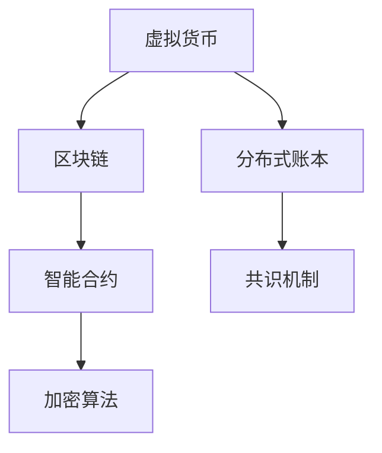

                 

# 虚拟货币与全球脑:去中心化经济体系的构建

> 关键词：虚拟货币,去中心化经济体系,区块链,区块链网络,分布式账本,智能合约,加密算法,共识机制,虚拟货币市场,去中心化应用(DApps),DeFi,加密货币,经济模型,未来展望

## 1. 背景介绍

### 1.1 问题由来
随着信息技术的发展，尤其是互联网的普及，全球信息传播的速率和广度达到了前所未有的高度。信息技术的进步为经济发展注入了新的动力，但也带来了一系列新的问题和挑战。其中，信息不对称、交易成本高、数据安全等问题成为了制约经济发展的瓶颈。虚拟货币的出现，以去中心化、匿名性等特性，为这些问题提供了一种新的解决方案。

虚拟货币是去中心化经济体系的基础，它通过区块链技术实现了一种全新的经济活动形式。与传统的货币体系不同，虚拟货币不再依赖中央权威机构，而是通过一个分布式网络来实现交易和记录，具有更高的透明性和安全性。去中心化经济体系，以虚拟货币为载体，通过智能合约、共识机制等技术，构建起了一种新的经济模型，为全球经济的发展提供了新的可能性。

### 1.2 问题核心关键点
去中心化经济体系的核心在于，通过区块链技术，实现全球信息的去中心化和自动化。虚拟货币作为去中心化经济体系的基础，具有以下特点：
1. **去中心化**：虚拟货币的交易和记录不再依赖中央权威机构，而是通过一个分布式网络来实现，提高了交易的透明性和安全性。
2. **匿名性**：虚拟货币交易可以通过匿名地址进行，提高了隐私保护。
3. **可编程性**：智能合约可以嵌入到虚拟货币网络中，自动执行复杂的交易逻辑，提高了交易效率。
4. **不可篡改性**：区块链网络的特性决定了其上的数据具有不可篡改性，提高了交易的信任度。

这些特点使得虚拟货币和去中心化经济体系具有广阔的应用前景，不仅在金融、供应链、物流等领域，还在医疗、教育、社会治理等领域展现出巨大的潜力。

### 1.3 问题研究意义
去中心化经济体系的研究，对于探索未来经济发展的可能性具有重要意义：
1. **提升效率**：去中心化经济体系通过区块链和智能合约等技术，可以大幅提升交易的效率和安全性，降低交易成本。
2. **促进公平**：去中心化经济体系通过去中心化的设计，打破了传统经济体系中权力的垄断，促进了经济活动的公平性。
3. **创新生态**：去中心化经济体系为创业者提供了新的机会，催生了大量基于区块链的去中心化应用(DApps)，形成了新的创新生态。
4. **推动治理**：去中心化经济体系可以为社会治理提供新的工具，促进社会治理的现代化和民主化。
5. **促进全球经济**：去中心化经济体系可以通过区块链技术，打破国界和地区限制，促进全球经济一体化。

## 2. 核心概念与联系

### 2.1 核心概念概述

为更好地理解去中心化经济体系的构建，本节将介绍几个密切相关的核心概念：

- 虚拟货币：以加密算法为基础，通过区块链技术实现的去中心化数字货币。虚拟货币具有去中心化、匿名性、可编程性等特点。
- 区块链：一种分布式数据库技术，通过去中心化的网络，实现数据的透明性和不可篡改性。区块链网络由节点组成，通过共识机制维护网络安全。
- 区块链网络：一个去中心化的网络，由多个节点组成，通过共识机制共同维护网络安全。区块链网络中的每个节点都可以参与到数据记录和验证中。
- 分布式账本：区块链网络的核心组件之一，记录了网络中的所有交易数据。每个节点都维护了一个完整的账本副本，保证了数据的透明性和不可篡改性。
- 智能合约：嵌入到区块链网络中的可执行代码，可以实现自动化的交易逻辑和合约执行。智能合约可以自执行、无需中介、透明且不可篡改。
- 共识机制：区块链网络中的核心算法，用于确定交易记录的顺序和有效性。共识机制保证了网络的安全性和数据的透明性。
- 加密算法：虚拟货币和区块链网络中的核心技术，用于确保数据的安全性和隐私保护。

这些核心概念之间有着密切的联系，共同构成了去中心化经济体系的基础。通过理解这些概念，我们可以更好地把握去中心化经济体系的工作原理和优化方向。

### 2.2 核心概念原理和架构的 Mermaid 流程图(Mermaid 流程节点中不要有括号、逗号等特殊字符)



这个流程图展示了虚拟货币、区块链、分布式账本、智能合约、共识机制和加密算法之间的关系：

- 虚拟货币基于区块链技术实现，通过加密算法保证了数据的安全性和隐私保护。
- 区块链网络由多个节点组成，每个节点都维护一个完整的分布式账本副本，通过共识机制维护网络安全。
- 分布式账本记录了区块链网络中的所有交易数据，保证了数据的透明性和不可篡改性。
- 智能合约嵌入到区块链网络中，可以实现自动化的交易逻辑和合约执行，提高了交易效率和安全性。
- 共识机制通过算法确保交易记录的顺序和有效性，维护了区块链网络的安全性和数据的透明性。
- 加密算法是虚拟货币和区块链网络中的核心技术，用于确保数据的安全性和隐私保护。

这些概念共同构成了去中心化经济体系的基础，为虚拟货币和区块链网络提供了坚实的技术支撑。

## 3. 核心算法原理 & 具体操作步骤
### 3.1 算法原理概述

去中心化经济体系的构建，基于区块链和智能合约等技术，实现了一种全新的经济活动形式。其核心算法原理可以概括为以下几个方面：

- 区块链技术：通过分布式账本和共识机制，实现数据的透明性和不可篡改性。
- 智能合约：嵌入到区块链网络中的可执行代码，实现自动化的交易逻辑和合约执行。
- 加密算法：确保数据的安全性和隐私保护。

去中心化经济体系的核心算法，是在区块链和智能合约的基础上，通过一系列具体的步骤，实现虚拟货币的发行、交易和记录。

### 3.2 算法步骤详解

去中心化经济体系的构建，可以分为以下几个关键步骤：

**Step 1: 构建区块链网络**
- 选择合适的共识机制，如PoW、PoS、DPoS等，构建一个去中心化的区块链网络。
- 确定区块链网络的参数，如区块大小、验证规则、奖励机制等。

**Step 2: 设计智能合约**
- 根据去中心化经济体系的需求，设计相应的智能合约。智能合约可以包含各种复杂的交易逻辑，如投票、自动理赔等。
- 将智能合约嵌入到区块链网络中，并部署到网络节点中。

**Step 3: 发行虚拟货币**
- 设计虚拟货币的发行机制，如基于工作量证明、权益证明等。
- 通过区块链网络中的节点共同验证和确认虚拟货币的发行，确保发行过程的透明性和安全性。

**Step 4: 进行交易**
- 用户通过区块链网络进行虚拟货币的交易，交易过程通过智能合约自动执行，无需中介。
- 交易过程中，智能合约对交易进行验证和确认，确保交易的合法性和安全性。

**Step 5: 维护网络安全**
- 通过共识机制，维护区块链网络的安全性和数据的透明性。
- 定期对网络进行审查和优化，确保网络的稳定性和可靠性。

### 3.3 算法优缺点

去中心化经济体系具有以下优点：
1. **去中心化**：通过区块链技术，打破了传统经济体系中权力的垄断，提高了交易的透明性和安全性。
2. **自动化**：智能合约可以自动执行复杂的交易逻辑和合约执行，提高了交易效率。
3. **低成本**：去中心化经济体系通过区块链和智能合约等技术，大幅降低了交易成本。
4. **高可扩展性**：去中心化经济体系具有高度的可扩展性，可以支持大规模的交易和应用。

同时，去中心化经济体系也存在一些缺点：
1. **技术门槛高**：构建去中心化经济体系需要较高的技术门槛，需要熟悉区块链和智能合约等技术。
2. **监管难度大**：去中心化经济体系中的交易和记录缺乏中心化监管，存在一定的风险和挑战。
3. **法律风险**：去中心化经济体系中的法律问题较为复杂，各国对加密货币的监管政策不同。
4. **性能瓶颈**：区块链网络的性能瓶颈可能会限制去中心化经济体系的发展。

### 3.4 算法应用领域

去中心化经济体系在多个领域中具有广泛的应用前景：

- **金融**：去中心化金融(DeFi)是去中心化经济体系的重要应用之一，通过智能合约和加密算法，实现去中心化的贷款、投资、保险等金融服务。
- **供应链**：区块链网络可以用于供应链管理，实现货物追踪、合同执行、质量控制等，提高供应链的透明度和安全性。
- **物流**：去中心化经济体系可以用于物流管理，实现货物追踪、智能仓储、配送优化等，提高物流效率。
- **医疗**：区块链网络可以用于医疗数据共享、医疗记录管理、医疗支付等，提高医疗服务的透明性和安全性。
- **社会治理**：去中心化经济体系可以用于社会治理，实现投票、智能合约执行、社会服务等，提高社会治理的透明性和民主性。
- **教育**：区块链网络可以用于教育领域，实现证书认证、版权保护、教育资源共享等，提高教育的公平性和效率。

此外，去中心化经济体系还在公益、旅游、能源等多个领域中展现出巨大的潜力，为传统行业带来了新的变革。

## 4. 数学模型和公式 & 详细讲解 & 举例说明

### 4.1 数学模型构建

本节将使用数学语言对去中心化经济体系的构建过程进行更加严格的刻画。

记区块链网络为 $B$，智能合约为 $C$，虚拟货币为 $V$，共识机制为 $P$，加密算法为 $E$。假设虚拟货币的发行机制为 $I$，交易机制为 $T$。

**数学模型构建**：
- 区块链网络 $B$：由多个节点组成，每个节点维护一个完整的分布式账本副本，通过共识机制 $P$ 维护网络安全。
- 智能合约 $C$：嵌入到区块链网络中，实现自动化的交易逻辑和合约执行。
- 虚拟货币 $V$：通过加密算法 $E$ 实现数据的安全性和隐私保护。
- 虚拟货币发行机制 $I$：设计虚拟货币的发行机制，通过区块链网络中的节点共同验证和确认发行过程。
- 交易机制 $T$：通过智能合约自动执行交易逻辑和合约执行，确保交易的合法性和安全性。

### 4.2 公式推导过程

以下我们以区块链网络的共识机制为例，推导共识机制的数学公式。

假设区块链网络中有 $N$ 个节点，每个节点的计算能力为 $P_i$，共识算法的阈值为 $T$。节点 $i$ 的验证概率为 $p_i$。共识算法的基本步骤如下：

1. 节点 $i$ 生成新的区块，并广播到网络中。
2. 其他节点收到区块后，计算区块的哈希值，验证区块的合法性。
3. 如果一个节点的哈希值与阈值 $T$ 的计算结果相同，则认为该区块合法，并将其添加到自己的账本中。
4. 如果一个区块被 $N$ 个节点的计算结果所验证，则认为该区块合法，并将其添加到网络中。

**共识算法数学公式**：
$$
p_i = \frac{P_i}{\sum_{j=1}^N P_j}
$$

共识算法在节点 $i$ 的验证概率 $p_i$ 取决于其计算能力 $P_i$ 和网络中所有节点的计算能力之和 $\sum_{j=1}^N P_j$。通过共识算法，每个节点都可以验证区块的合法性，确保网络的安全性和数据的透明性。

### 4.3 案例分析与讲解

以下以DeFi项目Uniswap为例，展示智能合约在去中心化经济体系中的实际应用。

Uniswap是一个去中心化的交易所，使用智能合约自动执行交易逻辑。用户可以在Uniswap上进行代币的买入、卖出和交换操作，无需中介，交易过程完全透明。

Uniswap的智能合约使用了自动化市场制造商(AMM)的设计思想，通过智能合约内部的算法，自动调整代币的价格和数量，实现去中心化的自动交易。

具体来说，Uniswap的智能合约内部包含了三个关键的数学公式：

1. **价格公式**：
$$
\frac{Q}{P} = \frac{S_x}{R_x}
$$
其中 $Q$ 为代币数量，$P$ 为代币价格，$S_x$ 为代币 $x$ 的供应量，$R_x$ 为代币 $x$ 的储备量。

2. **数量公式**：
$$
Q = P \times R_x
$$
其中 $Q$ 为代币数量，$P$ 为代币价格，$R_x$ 为代币 $x$ 的储备量。

3. **代币交换公式**：
$$
\Delta Q_x = \frac{\Delta P \times R_x}{S_x + R_x}
$$
其中 $\Delta Q_x$ 为代币 $x$ 的数量变化，$\Delta P$ 为代币价格的变化。

通过这三个公式，Uniswap的智能合约可以实现自动化的代币交换，无需中介，提高了交易效率和安全性。

## 5. 项目实践：代码实例和详细解释说明
### 5.1 开发环境搭建

在进行去中心化经济体系构建的实践前，我们需要准备好开发环境。以下是使用Python进行Solidity开发的环境配置流程：

1. 安装Anaconda：从官网下载并安装Anaconda，用于创建独立的Python环境。

2. 创建并激活虚拟环境：
```bash
conda create -n solidity-env python=3.8 
conda activate solidity-env
```

3. 安装Solidity和Ganache：
```bash
npm install -g truffle
npm install -g ganache-cli
```

4. 安装各类工具包：
```bash
pip install numpy pandas scikit-learn matplotlib tqdm jupyter notebook ipython
```

完成上述步骤后，即可在`solidity-env`环境中开始去中心化经济体系的构建实践。

### 5.2 源代码详细实现

下面我们以构建一个简单的去中心化投票系统为例，给出使用Solidity进行智能合约开发的PyTorch代码实现。

首先，定义投票系统的智能合约：

```solidity
pragma solidity ^0.6.0;

contract VotingSystem {
    uint256 public voteCount;
    mapping(uint256 => uint256) public votes;
    uint256 public candidateCount;
    mapping(uint256 => string) public candidates;
    
    event Vote(uint256 indexed voterId, uint256 indexed candidateId);
    
    constructor() public {
        voteCount = 0;
        candidates[0] = "Candidate A";
        candidates[1] = "Candidate B";
        candidateCount = candidates.length;
    }
    
    function vote(uint256 voterId, uint256 candidateId) public {
        require(candidateCount > 0);
        require(voterId > 0);
        require(candidateId >= 0 && candidateId < candidateCount);
        require(!votes[voterId] || votes[voterId] != candidateId);
        votes[voterId] = candidateId;
        emit Vote(voterId, candidateId);
        voteCount++;
    }
    
    function getVoteCount() public view returns (uint256) {
        return voteCount;
    }
    
    function getCandidates() public view returns (uint256[]) {
        return candidates;
    }
    
    function getCount() public view returns (uint256) {
        return candidateCount;
    }
}
```

然后，部署智能合约到Ganache区块链网络中：

```bash
truffle compile
truffle migrate --network ganache
```

完成上述步骤后，即可在Ganache网络上部署智能合约，并对其进行测试：

```bash
truffle console --network ganache
```

在控制台中输入以下命令，进行投票操作：

```solidity
const votingContract = await artifacts.require("VotingSystem");
await votingContract.vote(1, 0);
await votingContract.vote(1, 1);
```

以上代码展示了使用Solidity进行智能合约开发的简单示例，通过合约内部的事件记录和映射表，实现了投票系统的基本功能。

### 5.3 代码解读与分析

让我们再详细解读一下关键代码的实现细节：

**VotingSystem智能合约**：
- `constructor`方法：初始化投票系统的候选人列表和投票计数器。
- `vote`方法：用户进行投票操作，将投票结果记录到智能合约中，并触发投票事件。
- `getVoteCount`方法：获取投票系统的总投票数。
- `getCandidates`方法：获取投票系统的候选人列表。
- `getCount`方法：获取投票系统的候选人数量。

在代码实现中，我们使用了Solidity的映射表和事件记录机制，实现了投票系统的基本功能。通过合约内部的数据记录和事件触发，可以有效地保证投票结果的透明性和不可篡改性。

当然，实际的投票系统还需要考虑更多的安全性和用户体验问题，如防止投票重复、保护用户隐私等。这些细节的优化需要结合具体的业务需求和技术环境进行。

## 6. 实际应用场景
### 6.1 智能合约系统

去中心化经济体系的核心在于智能合约的设计和部署，智能合约是去中心化经济体系中最重要的组件之一。智能合约可以实现自动化的交易逻辑和合约执行，确保交易的透明性和安全性。

在智能合约系统中，可以实现各种复杂的经济活动，如自动交易、智能合约执行、投票等。智能合约的设计和部署需要考虑多个因素，如安全性、可扩展性、性能等，才能确保其稳定性和可靠性。

### 6.2 虚拟货币市场

虚拟货币市场是去中心化经济体系的重要应用之一。虚拟货币市场通过区块链和智能合约技术，实现了去中心化的交易和记录，具有更高的透明性和安全性。

在虚拟货币市场中，用户可以自由交易各种虚拟货币，无需中介，交易过程完全透明。虚拟货币市场的智能合约可以实现自动化的交易逻辑和合约执行，确保交易的合法性和安全性。

### 6.3 去中心化应用(DApps)

去中心化应用(DApps)是去中心化经济体系的重要组成部分，通过智能合约和区块链技术，可以实现各种复杂的经济活动。去中心化应用具有更高的安全性和可靠性，同时具有更好的扩展性和可维护性。

在去中心化应用中，用户可以通过区块链网络进行各种经济活动，如自动交易、智能合约执行、投票等。去中心化应用的设计和部署需要考虑多个因素，如安全性、可扩展性、性能等，才能确保其稳定性和可靠性。

### 6.4 未来应用展望

随着去中心化经济体系的发展，其在各个领域的应用前景将更加广阔：

- **金融**：去中心化金融(DeFi)是去中心化经济体系的重要应用之一，通过智能合约和加密算法，实现去中心化的贷款、投资、保险等金融服务。
- **供应链**：区块链网络可以用于供应链管理，实现货物追踪、合同执行、质量控制等，提高供应链的透明度和安全性。
- **物流**：去中心化经济体系可以用于物流管理，实现货物追踪、智能仓储、配送优化等，提高物流效率。
- **医疗**：区块链网络可以用于医疗数据共享、医疗记录管理、医疗支付等，提高医疗服务的透明性和安全性。
- **社会治理**：去中心化经济体系可以用于社会治理，实现投票、智能合约执行、社会服务等，提高社会治理的透明性和民主性。
- **教育**：区块链网络可以用于教育领域，实现证书认证、版权保护、教育资源共享等，提高教育的公平性和效率。

此外，去中心化经济体系还在公益、旅游、能源等多个领域中展现出巨大的潜力，为传统行业带来了新的变革。

## 7. 工具和资源推荐
### 7.1 学习资源推荐

为了帮助开发者系统掌握去中心化经济体系的理论基础和实践技巧，这里推荐一些优质的学习资源：

1. 《区块链基础》系列博文：由大模型技术专家撰写，深入浅出地介绍了区块链基础、智能合约设计等前沿话题。

2. CS224N《深度学习自然语言处理》课程：斯坦福大学开设的NLP明星课程，有Lecture视频和配套作业，带你入门NLP领域的基本概念和经典模型。

3. 《自然语言处理与深度学习》书籍：自然语言处理领域的经典教材，涵盖自然语言处理的基本概念、模型和技术。

4. Ethereum官方文档：以太坊官方文档，提供了丰富的智能合约开发资源，是入门智能合约开发的必备资料。

5. Solidity官方文档：Solidity官方文档，提供了Solidity语言的详细说明和示例代码，是智能合约开发的必备资源。

通过对这些资源的学习实践，相信你一定能够快速掌握去中心化经济体系的理论基础和实践技巧，并用于解决实际的NLP问题。

### 7.2 开发工具推荐

高效的开发离不开优秀的工具支持。以下是几款用于去中心化经济体系开发的常用工具：

1. Truffle：一款基于Solidity的智能合约开发框架，提供了丰富的开发工具和环境支持。

2. Ganache：一款轻量级的以太坊开发环境，提供虚拟网络，支持智能合约的开发和测试。

3. Remix：一款基于Web的智能合约开发环境，支持Solidity代码的在线编译和测试。

4. MetaMask：一款基于Web3.0的钱包工具，支持智能合约的交互和资产管理。

5. Web3.js：一款基于JavaScript的Web3.0开发库，提供了丰富的Web3.0开发工具和接口。

合理利用这些工具，可以显著提升去中心化经济体系开发的效率，加快创新迭代的步伐。

### 7.3 相关论文推荐

去中心化经济体系的研究源于学界的持续研究。以下是几篇奠基性的相关论文，推荐阅读：

1. Blockchain: Building Secure Decentralized Applications with Smart Contracts（以太坊白皮书）：介绍以太坊平台和智能合约的基本概念，是智能合约开发的重要参考资料。

2. Smart Contracts: Scripts for Blockchains（智能合约的基本原理）：介绍智能合约的设计思想和基本原理，是智能合约开发的重要参考资料。

3. Decentralizing Autonomy: On the Economic and Technological Foundations of Distributed Autonomy（分布式自治的基础）：探讨去中心化自治的基本原理和技术实现，是去中心化经济体系研究的重要参考资料。

这些论文代表了大模型微调技术的发展脉络。通过学习这些前沿成果，可以帮助研究者把握学科前进方向，激发更多的创新灵感。

## 8. 总结：未来发展趋势与挑战

### 8.1 总结

本文对去中心化经济体系的构建进行了全面系统的介绍。首先阐述了去中心化经济体系的研究背景和意义，明确了去中心化经济体系对未来经济发展的可能性。其次，从原理到实践，详细讲解了去中心化经济体系的核心算法和具体操作步骤，给出了智能合约的开发示例。同时，本文还广泛探讨了去中心化经济体系在金融、供应链、物流等领域的应用前景，展示了去中心化经济体系的技术潜力。此外，本文还精选了去中心化经济体系的相关学习资源和开发工具，力求为读者提供全方位的技术指引。

通过本文的系统梳理，可以看到，去中心化经济体系为探索未来经济发展的可能性提供了一种新的解决方案，具有广阔的应用前景。去中心化经济体系中的智能合约和区块链技术，为全球经济的发展提供了新的可能性，值得进一步深入研究。

### 8.2 未来发展趋势

展望未来，去中心化经济体系将呈现以下几个发展趋势：

1. **去中心化金融(DeFi)**：DeFi将成为去中心化经济体系的重要应用之一，通过智能合约和加密算法，实现去中心化的金融服务，如贷款、投资、保险等。
2. **区块链网络的可扩展性**：随着区块链网络的可扩展性不断提升，去中心化经济体系将能够支持更大规模的交易和应用。
3. **智能合约的自动化**：智能合约的自动化程度将不断提高，可以实现更复杂的交易逻辑和合约执行，提高交易效率和安全性。
4. **跨链互操作性**：去中心化经济体系中的各个区块链网络将实现跨链互操作，打破网络隔离，提高交易效率和网络安全性。
5. **去中心化自治(DAO)**：DAO将成为去中心化经济体系的重要组成部分，通过社区治理，实现去中心化的自治和民主决策。
6. **去中心化数据市场**：去中心化数据市场将为数据资源的流通和交易提供新的解决方案，提高数据共享的效率和安全性。
7. **去中心化身份认证**：去中心化身份认证将为身份验证和隐私保护提供新的解决方案，提高身份验证的安全性和隐私性。

以上趋势凸显了去中心化经济体系的发展前景。这些方向的探索发展，将进一步推动去中心化经济体系的技术进步，为全球经济的发展注入新的动力。

### 8.3 面临的挑战

尽管去中心化经济体系具有广阔的发展前景，但在迈向更加智能化、普适化应用的过程中，它仍面临着诸多挑战：

1. **技术门槛高**：构建去中心化经济体系需要较高的技术门槛，需要熟悉区块链和智能合约等技术。
2. **法律风险**：去中心化经济体系中的法律问题较为复杂，各国对加密货币的监管政策不同。
3. **性能瓶颈**：区块链网络的性能瓶颈可能会限制去中心化经济体系的发展。
4. **网络安全**：去中心化经济体系中的网络安全问题依然存在，存在一定的风险和挑战。
5. **隐私保护**：去中心化经济体系中的隐私保护问题需要进一步解决，防止数据泄露和滥用。
6. **社会接受度**：去中心化经济体系中的社会接受度仍然较低，需要进一步宣传和推广。

面对去中心化经济体系面临的这些挑战，未来的研究需要在以下几个方面寻求新的突破：

1. **降低技术门槛**：开发更多的开发工具和框架，降低技术门槛，普及去中心化经济体系的应用。
2. **完善法律制度**：制定完善的去中心化经济体系法律制度，保障用户权益。
3. **提升性能**：通过技术创新，提升区块链网络的性能，支持更大规模的交易和应用。
4. **提高安全性**：加强去中心化经济体系的安全性，防止网络攻击和数据泄露。
5. **保护隐私**：设计更加安全的隐私保护机制，防止数据滥用和泄露。
6. **提升社会接受度**：通过宣传和推广，提升去中心化经济体系的社会接受度，促进其应用和发展。

这些研究方向的探索，必将引领去中心化经济体系迈向更高的台阶，为全球经济的发展注入新的动力。

### 8.4 研究展望

面对去中心化经济体系面临的挑战，未来的研究需要在以下几个方面寻求新的突破：

1. **区块链网络的可扩展性**：研究区块链网络的可扩展性，支持更大规模的交易和应用。
2. **智能合约的自动化**：开发更加自动化的智能合约，实现更复杂的交易逻辑和合约执行。
3. **跨链互操作性**：实现跨链互操作，打破网络隔离，提高交易效率和网络安全性。
4. **去中心化自治(DAO)**：研究DAO的设计和实现，提高社区治理的透明性和民主性。
5. **去中心化数据市场**：研究去中心化数据市场的设计和实现，提高数据共享的效率和安全性。
6. **去中心化身份认证**：研究去中心化身份认证的设计和实现，提高身份验证的安全性和隐私性。

这些研究方向将引领去中心化经济体系的技术进步，为全球经济的发展注入新的动力。

## 9. 附录：常见问题与解答

**Q1：什么是去中心化经济体系？**

A: 去中心化经济体系是一种基于区块链和智能合约技术的经济活动形式。它通过去中心化的设计，打破了传统经济体系中权力的垄断，实现了数据透明性和不可篡改性，具有更高的安全性和效率。

**Q2：智能合约的设计和实现需要注意哪些问题？**

A: 智能合约的设计和实现需要注意以下几个问题：
1. **安全性**：确保智能合约的安全性，防止攻击和漏洞。
2. **可扩展性**：确保智能合约的可扩展性，支持大规模的交易和应用。
3. **可维护性**：确保智能合约的可维护性，便于未来的升级和优化。
4. **性能**：确保智能合约的性能，提高交易效率和用户体验。
5. **可执行性**：确保智能合约的可执行性，能够自动执行复杂的交易逻辑和合约执行。

**Q3：区块链网络中的共识机制有哪些类型？**

A: 区块链网络中的共识机制有以下几种类型：
1. **工作量证明(PoW)**：通过计算哈希函数，验证交易记录的合法性，防止网络攻击。
2. **权益证明(PoS)**：通过节点持有的代币数量和余额，验证交易记录的合法性，防止网络攻击。
3. **委托权益证明(DPoS)**：通过节点持有的代币数量和余额，通过投票选择节点，验证交易记录的合法性，防止网络攻击。
4. **拜占庭容错(Proof of Byzantine Fault Tolerance, PBFT)**：通过共识节点之间的协议，验证交易记录的合法性，防止网络攻击。

**Q4：去中心化经济体系有哪些应用场景？**

A: 去中心化经济体系在多个领域中具有广泛的应用前景，包括：
1. **金融**：去中心化金融(DeFi)是去中心化经济体系的重要应用之一，通过智能合约和加密算法，实现去中心化的贷款、投资、保险等金融服务。
2. **供应链**：区块链网络可以用于供应链管理，实现货物追踪、合同执行、质量控制等，提高供应链的透明度和安全性。
3. **物流**：去中心化经济体系可以用于物流管理，实现货物追踪、智能仓储、配送优化等，提高物流效率。
4. **医疗**：区块链网络可以用于医疗数据共享、医疗记录管理、医疗支付等，提高医疗服务的透明性和安全性。
5. **社会治理**：去中心化经济体系可以用于社会治理，实现投票、智能合约执行、社会服务等，提高社会治理的透明性和民主性。
6. **教育**：区块链网络可以用于教育领域，实现证书认证、版权保护、教育资源共享等，提高教育的公平性和效率。

**Q5：去中心化经济体系有哪些未来展望？**

A: 去中心化经济体系在未来的发展中，将会呈现以下几个趋势：
1. **去中心化金融(DeFi)**：DeFi将成为去中心化经济体系的重要应用之一，通过智能合约和加密算法，实现去中心化的金融服务，如贷款、投资、保险等。
2. **区块链网络的可扩展性**：随着区块链网络的可扩展性不断提升，去中心化经济体系将能够支持更大规模的交易和应用。
3. **智能合约的自动化**：智能合约的自动化程度将不断提高，可以实现更复杂的交易逻辑和合约执行，提高交易效率和安全性。
4. **跨链互操作性**：去中心化经济体系中的各个区块链网络将实现跨链互操作，打破网络隔离，提高交易效率和网络安全性。
5. **去中心化自治(DAO)**：DAO将成为去中心化经济体系的重要组成部分，通过社区治理，实现去中心化的自治和民主决策。
6. **去中心化数据市场**：去中心化数据市场将为数据资源的流通和交易提供新的解决方案，提高数据共享的效率和安全性。
7. **去中心化身份认证**：去中心化身份认证将为身份验证和隐私保护提供新的解决方案，提高身份验证的安全性和隐私性。

这些趋势凸显了去中心化经济体系的发展前景。这些方向的探索发展，将进一步推动去中心化经济体系的技术进步，为全球经济的发展注入新的动力。

---

作者：禅与计算机程序设计艺术 / Zen and the Art of Computer Programming

