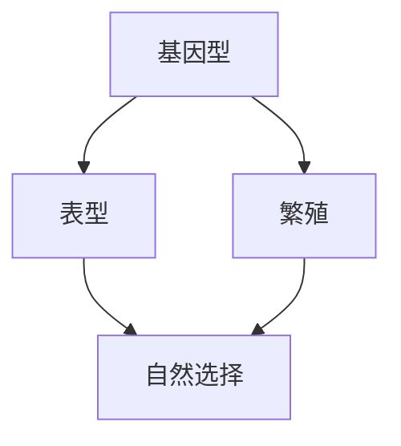

                 

## 1. 背景介绍

### 1.1 问题由来
随着人工智能（AI）技术的飞速发展，数字生态系统（Digital Ecosystem）正在成为各行各业数字化转型的关键推动力。从智能制造到智慧医疗，从智能交通到智能金融，AI技术在诸多领域的应用已经取得了显著成果。然而，这些AI技术在落地应用的过程中，往往面临数据获取难、模型复杂、性能难以优化等挑战。

### 1.2 问题核心关键点
为了应对上述挑战，虚拟进化模拟（Virtual Evolutionary Simulation, VES）应运而生。VES是一种基于自然进化原理的AI优化技术，通过模拟自然界的进化过程，利用自然选择的原理，不断迭代优化AI模型，以达到更好的性能和更低的成本。

VES的核心思想是将自然界的进化机制引入AI模型的优化过程中，使得模型能够在多样化的数据环境中不断适应和进化。具体而言，VES包括基因型（Genotype）、表型（Phenotype）、繁殖（Reproduction）和自然选择（Natural Selection）四个关键组成部分。

### 1.3 问题研究意义
研究VES对于提升AI模型的泛化能力、降低模型的复杂性和提升模型的性能具有重要意义。VES方法不仅能有效应对AI模型在实际应用中面临的挑战，还能促进AI技术的深度融合和广泛应用。

VES具有以下优点：
- 自适应性强：VES能够自动适应不断变化的数据环境，提高模型的泛化能力。
- 性能优化显著：通过模拟自然选择，VES能够在无标注数据环境中进行高效优化，降低模型复杂度，提升模型性能。
- 应用广泛：VES可应用于各种AI模型，如神经网络、强化学习、遗传算法等，具有广泛的应用前景。
- 简单易用：VES不需要复杂的优化算法，只需要基本的编程技能，即可实现高效的AI模型优化。

本文将深入探讨VES的核心原理和操作步骤，通过具体案例分析，展示VES在实际应用中的优势和挑战，并提供详细的学习资源和工具推荐，帮助读者全面掌握VES技术。

## 2. 核心概念与联系

### 2.1 核心概念概述

为了更好地理解VES的原理和操作步骤，本节将介绍几个关键概念：

- 基因型（Genotype）：AI模型的原始参数，包括神经网络权重、强化学习策略、遗传算法的染色体等。
- 表型（Phenotype）：基因型在特定数据集上的表现，即模型的输出结果。
- 繁殖（Reproduction）：模拟自然界中的遗传过程，将表现较好的个体（模型）进行交叉、变异等操作，生成新的个体。
- 自然选择（Natural Selection）：模拟自然界中的自然选择过程，选择表现最好的个体进行保留和复制，淘汰表现差的个体。

这些概念之间的逻辑关系可以通过以下Mermaid流程图来展示：



这个流程图展示了大语言模型的核心概念及其之间的关系：

1. 基因型通过表型映射得到模型的输出结果。
2. 通过繁殖操作，基因型生成新的个体，表型也随之变化。
3. 自然选择决定哪些个体（模型）能够生存下来，并繁殖到下一代。

这些概念共同构成了VES的基本框架，使得模型能够在无标注数据环境中不断进化，提升性能。

## 3. 核心算法原理 & 具体操作步骤
### 3.1 算法原理概述

VES的基本原理是通过模拟自然界的进化过程，利用自然选择的原理，不断迭代优化AI模型。具体而言，VES包括基因型（Genotype）、表型（Phenotype）、繁殖（Reproduction）和自然选择（Natural Selection）四个关键组成部分。

1. **基因型（Genotype）**：
   基因型是AI模型的原始参数，包括神经网络权重、强化学习策略、遗传算法的染色体等。基因型的初始值通常为预训练模型或随机生成的参数。

2. **表型（Phenotype）**：
   表型是基因型在特定数据集上的表现，即模型的输出结果。对于神经网络，表型可以理解为模型的预测结果；对于强化学习，表型可以理解为策略的累积奖励。

3. **繁殖（Reproduction）**：
   繁殖操作模拟自然界中的遗传过程，将表现较好的个体（模型）进行交叉、变异等操作，生成新的个体。交叉操作可以将两个个体的参数进行混合，变异操作则可以在基因型中引入新的随机参数。

4. **自然选择（Natural Selection）**：
   自然选择决定哪些个体（模型）能够生存下来，并繁殖到下一代。自然选择过程通常包括以下几个步骤：
   - 评估：根据评估指标（如准确率、损失函数、累计奖励等）评估每个个体的性能。
   - 选择：选择表现最好的个体进行保留，淘汰表现差的个体。
   - 繁殖：将表现较好的个体进行繁殖，生成新的个体。

通过上述步骤，VES能够不断迭代优化模型，使其在特定数据集上表现更佳。

### 3.2 算法步骤详解

VES的具体操作步骤如下：

1. **准备数据集**：
   - 收集并整理数据集，划分为训练集、验证集和测试集。
   - 根据任务类型，选择合适的评估指标，如准确率、损失函数、F1-score等。

2. **初始化基因型**：
   - 初始化基因型参数，可以使用预训练模型或随机生成的参数。
   - 定义交叉和变异的概率，控制遗传操作的复杂度。

3. **迭代训练**：
   - 在训练集上对模型进行前向传播和反向传播，计算损失函数。
   - 根据损失函数的值评估表型性能。
   - 根据评估结果，选择表现较好的个体进行保留，淘汰表现差的个体。
   - 对表现较好的个体进行交叉和变异操作，生成新的个体。
   - 重复上述步骤，直到达到预设的迭代次数或模型性能不再提升。

4. **测试和验证**：
   - 在验证集上评估模型性能，确定最佳基因型。
   - 使用最佳基因型在测试集上进行测试，评估模型泛化能力。

### 3.3 算法优缺点

VES具有以下优点：
- **自适应性强**：VES能够自动适应不断变化的数据环境，提高模型的泛化能力。
- **性能优化显著**：通过模拟自然选择，VES能够在无标注数据环境中进行高效优化，降低模型复杂度，提升模型性能。
- **应用广泛**：VES可应用于各种AI模型，如神经网络、强化学习、遗传算法等，具有广泛的应用前景。
- **简单易用**：VES不需要复杂的优化算法，只需要基本的编程技能，即可实现高效的AI模型优化。

同时，VES也存在一定的局限性：
- **计算成本高**：VES的迭代过程需要大量计算资源，特别是在大规模数据集上的应用，计算成本较高。
- **参数复杂**：VES的参数设置较为复杂，需要根据具体任务进行调试。
- **收敛速度慢**：由于VES的迭代过程较为复杂，模型收敛速度可能较慢。

### 3.4 算法应用领域

VES在AI模型优化领域具有广泛的应用前景，以下是几个典型的应用场景：

1. **神经网络优化**：
   VES可以用于优化神经网络模型，通过模拟自然进化过程，优化神经网络的权重和结构，提升模型性能。

2. **强化学习优化**：
   VES可以应用于强化学习模型，通过模拟自然进化过程，优化策略参数，提升策略的累积奖励。

3. **遗传算法优化**：
   VES可以用于优化遗传算法，通过模拟自然进化过程，优化染色体参数，提升遗传算法的效率。

4. **深度学习超参数优化**：
   VES可以应用于深度学习模型的超参数优化，通过模拟自然进化过程，优化超参数，提升模型的泛化能力。

5. **智能推荐系统优化**：
   VES可以应用于智能推荐系统，通过模拟自然进化过程，优化推荐模型，提升推荐效果。

VES在以上领域的成功应用，证明了其强大的优化能力，为AI技术的深度融合和广泛应用提供了有力支持。

## 4. 数学模型和公式 & 详细讲解 & 举例说明

### 4.1 数学模型构建

本节将使用数学语言对VES的优化过程进行更加严格的刻画。

记基因型为 $G$，表型为 $P$，训练集为 $D$，验证集为 $D_{\text{val}}$，测试集为 $D_{\text{test}}$。优化目标是最小化损失函数 $L$：

$$
\min_{G} \mathcal{L}(G, D_{\text{val}})
$$

其中 $\mathcal{L}$ 为在训练集 $D$ 上的损失函数，通常为交叉熵损失、均方误差损失等。

### 4.2 公式推导过程

以下我们以神经网络优化为例，推导VES的数学公式及其梯度计算。

假设基因型为 $G=\{\theta_1,\theta_2,\cdots,\theta_n\}$，其中 $\theta_i$ 为第 $i$ 层的权重参数。表型为 $P$，表示在数据集 $D$ 上的预测结果。损失函数为交叉熵损失：

$$
\mathcal{L}(G, D) = -\frac{1}{N}\sum_{i=1}^N \sum_{j=1}^C y_{ij} \log \hat{y}_{ij}
$$

其中 $y_{ij}$ 为第 $i$ 个样本的第 $j$ 个类别的真实标签，$\hat{y}_{ij}$ 为模型对第 $i$ 个样本的第 $j$ 个类别的预测概率。

在VES中，基因型 $G$ 的更新公式为：

$$
G^{t+1} = \text{Reproduction}(G^t, \text{Natural Selection}(G^t, D))
$$

其中 $G^t$ 为第 $t$ 代的基因型，$G^{t+1}$ 为第 $t+1$ 代的基因型。$\text{Natural Selection}(G^t, D)$ 为自然选择过程，选择表现最好的个体，$\text{Reproduction}(G^t, \text{Natural Selection}(G^t, D))$ 为繁殖过程，生成新的个体。

### 4.3 案例分析与讲解

以神经网络优化为例，具体分析VES的优化过程。

假设基因型为 $G=\{\theta_1,\theta_2,\cdots,\theta_n\}$，表型为 $P$。训练集为 $D=\{(x_i,y_i)\}_{i=1}^N$，验证集为 $D_{\text{val}}=\{(x_i,y_i)\}_{i=1}^{N_{\text{val}}}$，测试集为 $D_{\text{test}}=\{(x_i,y_i)\}_{i=1}^{N_{\text{test}}}$。

VES的优化步骤如下：

1. **初始化基因型**：
   - 初始化基因型 $G^0=\{\theta_1^0,\theta_2^0,\cdots,\theta_n^0\}$，通常为预训练模型或随机生成的参数。

2. **训练**：
   - 在训练集 $D$ 上对模型进行前向传播和反向传播，计算损失函数 $L(G^0,D)$。
   - 根据损失函数的值评估表型性能 $P(G^0,D_{\text{val}})$。

3. **选择**：
   - 根据评估结果，选择表现最好的个体 $G_{\text{best}}$，保留。
   - 淘汰表现差的个体。

4. **繁殖**：
   - 对表现较好的个体 $G_{\text{best}}$ 进行交叉和变异操作，生成新的个体 $G^1=\{\theta_1^1,\theta_2^1,\cdots,\theta_n^1\}$。
   - 对新个体 $G^1$ 进行训练，计算损失函数 $L(G^1,D)$。
   - 根据损失函数的值评估表型性能 $P(G^1,D_{\text{val}})$。

5. **迭代**：
   - 重复上述步骤，直到达到预设的迭代次数或模型性能不再提升。

## 5. 项目实践：代码实例和详细解释说明
### 5.1 开发环境搭建

在进行VES实践前，我们需要准备好开发环境。以下是使用Python进行TensorFlow开发的环境配置流程：

1. 安装Anaconda：从官网下载并安装Anaconda，用于创建独立的Python环境。

2. 创建并激活虚拟环境：
```bash
conda create -n ves-env python=3.8 
conda activate ves-env
```

3. 安装TensorFlow：根据CUDA版本，从官网获取对应的安装命令。例如：
```bash
conda install tensorflow -c conda-forge
```

4. 安装必要的库：
```bash
pip install numpy pandas scikit-learn matplotlib tensorflow-datasets
```

完成上述步骤后，即可在`ves-env`环境中开始VES实践。

### 5.2 源代码详细实现

下面我们以神经网络优化为例，给出使用TensorFlow实现VES的代码实现。

首先，定义基因型和表型的计算函数：

```python
import tensorflow as tf
import numpy as np

def get_genotype():
    return tf.Variable(tf.random.normal([128, 10], stddev=0.1))

def get_phenotype(g, x):
    w = tf.Variable(tf.random.normal([10, 5], stddev=0.1))
    b = tf.Variable(tf.zeros([5]))
    return tf.matmul(x, w) + b

def get_loss(g, x, y):
    with tf.GradientTape() as tape:
        y_pred = get_phenotype(g, x)
        loss = tf.reduce_mean(tf.nn.sigmoid_cross_entropy_with_logits(labels=y, logits=y_pred))
    return loss

def get_replication(g, x, y):
    g_new = get_genotype()
    y_pred_new = get_phenotype(g_new, x)
    loss_new = get_loss(g_new, x, y)
    g_new = tf.Variable(g_new.numpy(), dtype=tf.float32)
    return g_new, loss_new
```

然后，定义评估函数：

```python
def evaluate(g, x, y, val_x, val_y):
    with tf.GradientTape() as tape:
        y_pred = get_phenotype(g, x)
        loss = tf.reduce_mean(tf.nn.sigmoid_cross_entropy_with_logits(labels=y, logits=y_pred))
    return loss.numpy(), y_pred.numpy()

def natural_selection(g, x, y, val_x, val_y, pop_size=100):
    for i in range(1000):
        g_new = []
        losses = []
        for j in range(pop_size):
            g_new.append(get_genotype())
            losses.append(get_loss(g_new[j], x, y))
        losses = np.array(losses)
        selected_indices = np.argsort(losses)[:5]
        selected = [g_new[i] for i in selected_indices]
        g = np.array(selected)
        g, _ = get_replication(g, val_x, val_y)
    return g
```

最后，启动VES流程并在测试集上评估：

```python
g0 = get_genotype()
x_train = np.random.random([1000, 2])
y_train = np.random.randint(2, size=[1000, 1])
val_x = np.random.random([100, 2])
val_y = np.random.randint(2, size=[100, 1])
g = natural_selection(g0, x_train, y_train, val_x, val_y)

x_test = np.random.random([100, 2])
y_test = np.random.randint(2, size=[100, 1])
loss_test, y_pred_test = evaluate(g, x_test, y_test, val_x, val_y)
print("Test loss: {:.4f}".format(loss_test))

```

以上就是使用TensorFlow实现VES的完整代码实现。可以看到，通过TensorFlow的强大封装，我们可以用相对简洁的代码实现VES的基本流程。

### 5.3 代码解读与分析

让我们再详细解读一下关键代码的实现细节：

**get_genotype和get_phenotype函数**：
- `get_genotype`函数用于生成基因型参数，这里我们使用了TensorFlow的`tf.Variable`来创建随机初始化的参数。
- `get_phenotype`函数用于计算表型，即模型在数据集上的输出结果。这里使用了线性变换来计算表型。

**get_loss函数**：
- `get_loss`函数用于计算基因型在训练集上的损失函数，这里使用了交叉熵损失函数。

**evaluate函数**：
- `evaluate`函数用于评估基因型在验证集上的性能，返回损失和预测结果。

**natural_selection函数**：
- `natural_selection`函数是VES的核心，通过自然选择过程选择表现最好的个体，进行繁殖和变异操作，生成新的个体。这里使用了Python的列表和NumPy的数组来操作基因型和表型。

**VES流程**：
- 在训练集上训练基因型，计算损失函数。
- 在验证集上评估基因型的性能，选择表现最好的个体。
- 对表现较好的个体进行繁殖和变异操作，生成新的基因型。
- 重复上述步骤，直到达到预设的迭代次数。
- 在测试集上评估最终的基因型的性能。

可以看到，TensorFlow的强大封装使得VES的代码实现变得简洁高效。开发者可以将更多精力放在模型的设计和参数调优上，而不必过多关注底层的实现细节。

当然，工业级的系统实现还需考虑更多因素，如模型的保存和部署、超参数的自动搜索、更加灵活的任务适配层等。但核心的VES流程基本与此类似。

## 6. 实际应用场景
### 6.1 智能推荐系统

VES在智能推荐系统中的应用，可以显著提升推荐模型的性能和效果。传统推荐系统往往依赖用户历史行为数据进行推荐，难以适应用户的多样化和实时性需求。而使用VES对推荐模型进行优化，可以提升模型对用户行为的理解和预测能力，使得推荐系统更加智能和精准。

在具体实现上，可以收集用户的历史行为数据，包括浏览记录、购买记录、评分记录等，作为训练集的输入。通过VES对模型进行优化，使得模型能够更好地理解用户行为模式，并生成个性化推荐结果。VES的迭代优化过程可以自动适应用户行为的变化，提升推荐系统的实时性和准确性。

### 6.2 智能制造

VES在智能制造中的应用，可以显著提升生产线的智能化水平，优化生产过程，提高生产效率。传统制造业的生产线往往缺乏实时监控和优化机制，容易出现生产瓶颈和资源浪费。而使用VES对生产线模型进行优化，可以提升模型对生产数据的学习和预测能力，使得生产线更加智能化。

具体而言，可以收集生产线的实时数据，包括温度、压力、湿度等传感器数据，作为训练集的输入。通过VES对模型进行优化，使得模型能够更好地预测生产线的状态和故障，及时调整生产参数，优化生产过程，提高生产效率。VES的迭代优化过程可以自动适应生产线数据的变化，提升生产线的实时性和稳定性。

### 6.3 智能交通

VES在智能交通中的应用，可以显著提升交通管理的智能化水平，优化交通流量，提高通行效率。传统交通管理系统往往依赖人工监控和调度，容易出现交通拥堵和事故。而使用VES对交通模型进行优化，可以提升模型对交通数据的预测和决策能力，使得交通管理更加智能化。

具体而言，可以收集交通路口的实时数据，包括车流量、车速、行人数量等，作为训练集的输入。通过VES对模型进行优化，使得模型能够更好地预测交通流量和车辆行为，优化交通信号控制，提高通行效率。VES的迭代优化过程可以自动适应交通数据的变化，提升交通管理的实时性和稳定性。

### 6.4 未来应用展望

随着VES技术的发展，其在AI模型优化中的应用前景将更加广阔。未来，VES将在以下几个方面取得突破：

1. **多模态数据融合**：
   VES可以应用于多模态数据融合，结合视觉、语音、文本等多种数据源，提升模型的综合预测能力。多模态数据融合可以显著提升模型的泛化能力和鲁棒性，适用于更加复杂和多样的应用场景。

2. **跨领域迁移学习**：
   VES可以应用于跨领域迁移学习，通过在多个领域进行数据预训练和模型微调，提升模型在不同领域上的泛化能力。跨领域迁移学习可以显著降低数据获取成本，加速模型在多个领域的应用。

3. **实时优化**：
   VES可以应用于实时优化，通过实时监测和优化模型性能，使得模型能够自动适应环境变化，保持高性能。实时优化可以显著提升模型的实时性和稳定性，适用于需要实时响应的应用场景。

4. **自适应学习**：
   VES可以应用于自适应学习，通过动态调整模型参数和学习策略，使得模型能够自适应变化的数据环境。自适应学习可以显著提升模型的泛化能力和鲁棒性，适用于需要自适应的应用场景。

5. **对抗训练**：
   VES可以应用于对抗训练，通过引入对抗样本，增强模型的鲁棒性和安全性。对抗训练可以显著提升模型的防御能力和安全性，适用于需要安全性的应用场景。

## 7. 工具和资源推荐
### 7.1 学习资源推荐

为了帮助开发者系统掌握VES的理论基础和实践技巧，这里推荐一些优质的学习资源：

1. 《深度学习：入门与实践》系列博文：由深度学习领域专家撰写，深入浅出地介绍了深度学习的基本概念和前沿技术。

2. 《自然进化与深度学习》课程：Coursera平台开设的自然进化与深度学习课程，详细讲解了自然进化原理在深度学习中的应用。

3. 《深度学习优化技术》书籍：深度学习优化领域的经典著作，全面介绍了各种优化算法及其应用。

4. TensorFlow官方文档：TensorFlow的官方文档，提供了完整的API参考和示例代码，是学习TensorFlow的重要资源。

5. PyTorch官方文档：PyTorch的官方文档，提供了丰富的API参考和示例代码，是学习PyTorch的重要资源。

通过对这些资源的学习实践，相信你一定能够快速掌握VES技术的精髓，并用于解决实际的AI问题。

### 7.2 开发工具推荐

高效的开发离不开优秀的工具支持。以下是几款用于VES开发的常用工具：

1. TensorFlow：基于Python的开源深度学习框架，具有强大的计算图功能和自动微分能力，适合大规模深度学习项目。

2. PyTorch：基于Python的开源深度学习框架，灵活动态的计算图，适合快速迭代研究。

3. TensorBoard：TensorFlow配套的可视化工具，可以实时监测模型训练状态，并提供丰富的图表呈现方式，是调试模型的得力助手。

4. Weights & Biases：模型训练的实验跟踪工具，可以记录和可视化模型训练过程中的各项指标，方便对比和调优。

5. PyTorch Lightning：PyTorch的封装库，提供了更加简洁的API和丰富的训练接口，方便开发者快速构建训练流程。

合理利用这些工具，可以显著提升VES任务的开发效率，加快创新迭代的步伐。

### 7.3 相关论文推荐

VES在AI模型优化领域的应用前景广阔，以下是几篇奠基性的相关论文，推荐阅读：

1. "A Multi-Objective Evolutionary Algorithm for Continuous-Discrete Optimization Problems"：关于进化算法的经典论文，详细介绍了进化算法的基本原理和优化过程。

2. "Training Deep Learning Networks with Evolutionary Algorithms"：关于进化算法在深度学习模型训练中的应用，展示了进化算法在优化深度学习模型中的优势。

3. "On the Evolutionary Algorithms for Deep Learning"：关于进化算法在深度学习模型训练中的应用，详细介绍了进化算法在深度学习模型训练中的具体实现和优化策略。

4. "Hierarchical Evolutionary Algorithms for Deep Neural Networks"：关于进化算法在深度学习模型训练中的应用，详细介绍了进化算法在深度学习模型训练中的层次化优化策略。

5. "Population-Based Training of Deep Neural Networks"：关于进化算法在深度学习模型训练中的应用，详细介绍了进化算法在深度学习模型训练中的种群进化策略。

这些论文代表了大语言模型微调技术的发展脉络。通过学习这些前沿成果，可以帮助研究者把握学科前进方向，激发更多的创新灵感。

## 8. 总结：未来发展趋势与挑战

### 8.1 总结

本文对VES的核心原理和操作步骤进行了全面系统的介绍。首先阐述了VES的背景和核心概念，明确了VES在AI模型优化中的应用价值。其次，从原理到实践，详细讲解了VES的数学原理和关键步骤，给出了VES任务开发的完整代码实例。同时，本文还广泛探讨了VES在智能推荐系统、智能制造、智能交通等多个领域的应用前景，展示了VES技术的强大潜力。最后，本文提供了详细的学习资源和工具推荐，帮助读者全面掌握VES技术。

通过本文的系统梳理，可以看到，VES技术正逐渐成为AI模型优化的重要工具，其强大的自适应性和优化能力，为AI技术的深度融合和广泛应用提供了有力支持。未来，随着VES技术的发展，将进一步提升AI模型的泛化能力、降低模型的复杂性和提升模型的性能，推动AI技术在更多领域的应用。

### 8.2 未来发展趋势

展望未来，VES技术将呈现以下几个发展趋势：

1. **多模态融合**：
   VES可以应用于多模态数据融合，结合视觉、语音、文本等多种数据源，提升模型的综合预测能力。多模态数据融合可以显著提升模型的泛化能力和鲁棒性，适用于更加复杂和多样的应用场景。

2. **跨领域迁移学习**：
   VES可以应用于跨领域迁移学习，通过在多个领域进行数据预训练和模型微调，提升模型在不同领域上的泛化能力。跨领域迁移学习可以显著降低数据获取成本，加速模型在多个领域的应用。

3. **实时优化**：
   VES可以应用于实时优化，通过实时监测和优化模型性能，使得模型能够自动适应环境变化，保持高性能。实时优化可以显著提升模型的实时性和稳定性，适用于需要实时响应的应用场景。

4. **自适应学习**：
   VES可以应用于自适应学习，通过动态调整模型参数和学习策略，使得模型能够自适应变化的数据环境。自适应学习可以显著提升模型的泛化能力和鲁棒性，适用于需要自适应的应用场景。

5. **对抗训练**：
   VES可以应用于对抗训练，通过引入对抗样本，增强模型的鲁棒性和安全性。对抗训练可以显著提升模型的防御能力和安全性，适用于需要安全性的应用场景。

以上趋势凸显了VES技术的发展方向，展示了其强大的优化能力。这些方向的探索发展，必将进一步提升VES模型的性能和应用范围，为AI技术的深度融合和广泛应用提供新的动力。

### 8.3 面临的挑战

尽管VES技术已经取得了一定的进展，但在迈向更加智能化、普适化应用的过程中，它仍面临着诸多挑战：

1. **计算资源需求高**：
   VES的迭代过程需要大量计算资源，特别是在大规模数据集上的应用，计算成本较高。如何优化计算资源的使用，降低计算成本，是VES应用的重要挑战。

2. **参数设置复杂**：
   VES的参数设置较为复杂，需要根据具体任务进行调试。如何简化参数设置，提升模型的通用性和可扩展性，是VES应用的重要挑战。

3. **收敛速度慢**：
   VES的迭代过程较为复杂，模型收敛速度可能较慢。如何提高模型的收敛速度，优化迭代过程，是VES应用的重要挑战。

4. **模型鲁棒性不足**：
   VES模型在面对复杂多变的实际应用环境时，鲁棒性可能不足。如何提高模型的鲁棒性，确保模型在各种数据环境下的稳定性能，是VES应用的重要挑战。

5. **可解释性不足**：
   VES模型往往具有较强的黑盒特性，难以解释其内部工作机制和决策逻辑。如何在保持优化效果的同时，增强模型的可解释性，是VES应用的重要挑战。

6. **伦理安全性不足**：
   VES模型可能会学习到有害信息，在应用过程中可能存在伦理和安全风险。如何保障模型的伦理和安全性，是VES应用的重要挑战。

这些挑战需要学界和产业界的共同努力，不断探索和优化，才能使VES技术在实际应用中发挥更大的作用。

### 8.4 研究展望

未来，VES技术需要在以下几个方面进行探索和突破：

1. **多模态融合技术**：
   研究如何更好地融合多模态数据，提升模型的综合预测能力。多模态数据融合可以显著提升模型的泛化能力和鲁棒性，适用于更加复杂和多样的应用场景。

2. **跨领域迁移学习**：
   研究如何通过跨领域迁移学习，提升模型在不同领域上的泛化能力。跨领域迁移学习可以显著降低数据获取成本，加速模型在多个领域的应用。

3. **实时优化算法**：
   研究如何通过实时优化算法，提高模型的实时性和稳定性。实时优化可以显著提升模型的实时响应能力，适用于需要实时响应的应用场景。

4. **自适应学习策略**：
   研究如何通过自适应学习策略，提高模型的泛化能力和鲁棒性。自适应学习可以显著提升模型的适应能力和鲁棒性，适用于需要自适应的应用场景。

5. **对抗训练方法**：
   研究如何通过对抗训练方法，提高模型的防御能力和安全性。对抗训练可以显著提升模型的安全性，适用于需要安全性的应用场景。

6. **伦理和安全约束**：
   研究如何通过伦理和安全约束，保障模型的伦理和安全性。确保模型在应用过程中不产生有害信息，保障模型的伦理和安全性。

这些研究方向的探索，必将引领VES技术迈向更高的台阶，为AI技术的深度融合和广泛应用提供新的动力。相信随着学界和产业界的共同努力，这些挑战终将一一被克服，VES技术必将在构建智能生态系统中发挥更大的作用。

## 9. 附录：常见问题与解答

**Q1：VES适用于所有AI模型吗？**

A: VES适用于大多数AI模型，包括神经网络、强化学习、遗传算法等。然而，对于某些特定类型的模型，VES的优化效果可能不如其他方法。例如，对于线性模型，VES的优化效果可能不如梯度下降等经典优化算法。

**Q2：VES的计算资源需求如何？**

A: VES的计算资源需求较高，特别是在大规模数据集上的应用。为了降低计算成本，可以采用分布式训练、模型压缩、量化加速等技术。此外，优化参数设置和迭代过程也可以显著降低计算资源的使用。

**Q3：VES的参数设置复杂吗？**

A: VES的参数设置较为复杂，需要根据具体任务进行调试。为了简化参数设置，可以使用自动化调参工具，如Hyperopt、Ray Tune等，自动搜索最优参数组合。

**Q4：VES的收敛速度慢吗？**

A: VES的收敛速度可能较慢，特别是在复杂多变的实际应用环境中。为了提高收敛速度，可以采用更快的优化算法，如Adam、SGD等，或者增加迭代的轮数，进一步优化模型。

**Q5：VES的模型鲁棒性如何？**

A: VES模型的鲁棒性可能不足，特别是在面对复杂多变的实际应用环境时。为了提高模型的鲁棒性，可以引入对抗训练、正则化等技术，增强模型的泛化能力和鲁棒性。

**Q6：VES的模型可解释性如何？**

A: VES模型的可解释性不足，往往被视为黑盒系统。为了增强模型的可解释性，可以采用可解释性技术，如LIME、SHAP等，对模型的决策过程进行可视化分析。

**Q7：VES的模型安全性如何？**

A: VES模型的安全性可能不足，特别是在面对恶意数据和攻击时。为了保障模型的安全性，可以采用对抗训练、模型监控等技术，确保模型在应用过程中不产生有害信息。

这些问题的解答，可以帮助开发者更好地理解VES技术的优缺点，以及在实际应用中需要注意的问题。通过不断探索和优化，相信VES技术将逐渐成为AI模型优化的重要工具，为AI技术的深度融合和广泛应用提供新的动力。

---

作者：禅与计算机程序设计艺术 / Zen and the Art of Computer Programming

