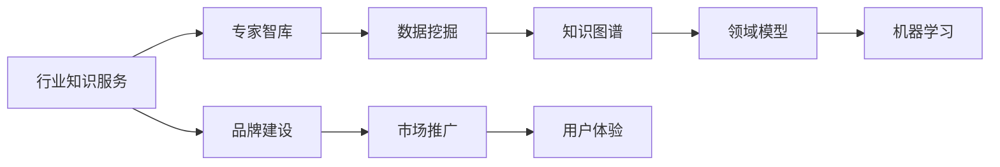

                 

# 行业知识服务要建立专家智库和品牌

> 关键词：行业知识服务, 专家智库, 品牌建设, 知识图谱, 领域模型, 数据挖掘, 机器学习

## 1. 背景介绍

随着信息技术的发展和互联网的普及，各个行业的信息量呈指数级增长，对知识服务的需求也日益增加。行业知识服务旨在提供高质量、高效率、高可靠性的专业知识，帮助企业快速掌握行业动态、优化决策流程、提高运营效率。然而，传统的行业知识服务主要依靠人工编辑和积累，存在内容质量参差不齐、更新不及时、获取成本高等问题。

为了应对这些挑战，亟需建立智能化的行业知识服务体系，通过先进的信息技术和专家智慧，构建一套高效、灵活、可靠的行业知识服务架构。在这一背景下，本文探讨了如何通过建立专家智库和品牌，提升行业知识服务的效果和影响力，为企业提供定制化的知识服务解决方案。

## 2. 核心概念与联系

### 2.1 核心概念概述

在讨论如何构建行业知识服务之前，我们先明确几个核心概念：

- **行业知识服务**：是指基于行业特性和需求，提供的专业化、系统化的知识服务，包括但不限于市场分析、技术趋势、政策法规等。
- **专家智库**：是由行业专家共同构建的，包含大量权威、可信知识的集合体，是知识服务体系的核心。
- **品牌建设**：指通过专业化和差异化策略，打造具有强大市场竞争力和用户认同度的品牌形象。

这些概念之间的联系通过以下Mermaid流程图展示：



该图展示了行业知识服务的核心组成和构建流程。专家智库作为数据来源，通过数据挖掘、知识图谱、领域模型和机器学习等技术，最终形成高质量的行业知识服务产品，并通过品牌建设进行市场推广和用户体验提升。

## 3. 核心算法原理 & 具体操作步骤

### 3.1 算法原理概述

行业知识服务的构建涉及多个环节，包括数据收集、整理、存储、检索、分析和应用。这些环节的算法原理各异，但核心目标是一致的：构建一套高效、智能、可靠的行业知识服务体系，满足企业对高质量知识服务的需求。

以专家智库为例，其算法原理包括以下几个方面：

- **数据挖掘**：从海量非结构化数据中，自动抽取、清洗、聚合行业知识，构建知识图谱。
- **知识图谱**：通过构建图谱节点和边，建立实体之间的关系，形成系统化的知识体系。
- **领域模型**：针对特定领域，构建领域特定的概念模型和知识结构，提供更精细化的服务。
- **机器学习**：利用机器学习算法，对知识图谱进行深度分析和推理，提供智能化的知识服务。

### 3.2 算法步骤详解

基于上述算法原理，行业知识服务的构建步骤如下：

#### 3.2.1 数据收集与预处理

数据收集是知识服务构建的基础。需从官方报告、行业白皮书、专业论坛、学术论文等多个渠道收集数据。数据预处理包括数据清洗、格式转换、去重、归一化等步骤，确保数据的准确性和一致性。

#### 3.2.2 知识图谱构建

知识图谱是行业知识服务的重要组成部分，构建知识图谱需要以下几个步骤：

1. **实体识别**：识别文本中的实体，如公司、产品、事件等。
2. **关系抽取**：从文本中抽取实体之间的关系，如“A 收购 B”。
3. **节点建模**：将实体和关系映射为知识图谱中的节点和边。
4. **图谱优化**：对图谱进行优化，去除冗余和噪音，提升图谱质量。

#### 3.2.3 领域模型构建

领域模型是对特定领域知识结构化的表达。构建领域模型包括：

1. **概念定义**：定义领域内的核心概念，如行业术语、指标等。
2. **模型设计**：设计领域模型的结构，包括实体关系、属性、层次等。
3. **数据标注**：对领域模型进行数据标注，建立实体与概念之间的映射关系。

#### 3.2.4 知识服务应用

基于构建好的知识图谱和领域模型，开发知识服务应用，包括：

1. **检索服务**：根据用户查询，从知识图谱中检索相关信息。
2. **分析服务**：利用机器学习算法对知识图谱进行深度分析，提供趋势预测、因果关系分析等服务。
3. **推荐服务**：根据用户兴趣和行为，推荐相关知识和资源。

### 3.3 算法优缺点

行业知识服务的构建涉及多种算法和技术，每种算法都有其优缺点。

#### 3.3.1 优点

- **自动化**：通过自动化技术，减少人工干预，提高数据处理效率。
- **智能化**：利用机器学习等技术，提升知识服务的智能化程度。
- **高效性**：通过构建知识图谱和领域模型，提升知识服务的应用效率。

#### 3.3.2 缺点

- **数据质量**：依赖于数据源的质量，存在数据噪音和偏差问题。
- **模型复杂性**：构建知识图谱和领域模型较为复杂，需要较高的技术门槛。
- **隐私与安全**：知识服务的构建涉及大量敏感数据，需注意隐私保护和数据安全。

### 3.4 算法应用领域

行业知识服务的构建可应用于多个领域，包括但不限于：

- **金融行业**：提供市场分析、风险管理、投资策略等服务。
- **医疗行业**：提供疾病诊断、治疗方案、健康管理等服务。
- **零售行业**：提供市场趋势、用户行为分析、推荐系统等服务。
- **制造行业**：提供供应链管理、质量控制、生产调度等服务。

## 4. 数学模型和公式 & 详细讲解 & 举例说明

### 4.1 数学模型构建

行业知识服务构建中，涉及多种数学模型，包括但不限于：

- **知识图谱**：基于图结构的数据模型，用于表示实体之间的关系。
- **领域模型**：基于属性、层次、关系等构建的知识模型，用于结构化表达领域知识。
- **机器学习**：利用分类、回归、聚类等算法，对知识进行分析和推理。

### 4.2 公式推导过程

以知识图谱构建为例，推导实体识别和关系抽取的公式：

1. **实体识别**
$$
\text{Entity} = \text{Entity}_t + \text{Entity}_r
$$
其中，$\text{Entity}_t$ 表示文本中的专有名词，$\text{Entity}_r$ 表示文本中的人名、地名、机构名等实体。

2. **关系抽取**
$$
\text{Relation} = \text{Relation}_t + \text{Relation}_r
$$
其中，$\text{Relation}_t$ 表示文本中的动词、名词短语等，$\text{Relation}_r$ 表示文本中的实体关系，如“A 收购 B”。

### 4.3 案例分析与讲解

以金融行业知识服务为例，通过知识图谱和领域模型，提供市场分析和风险管理服务。

1. **知识图谱构建**
   - 数据源：金融市场报告、新闻、分析师报告等。
   - 实体识别：识别公司、股票、基金、事件等。
   - 关系抽取：抽取公司间的并购、合作、投资关系。
   - 节点建模：将公司、股票、事件等映射为知识图谱节点，抽取关系并建立边。

2. **领域模型构建**
   - 概念定义：定义股票、基金、市场指数、投资策略等核心概念。
   - 模型设计：设计投资策略模型，包括股票选择、风险控制、组合优化等。
   - 数据标注：对模型进行数据标注，建立概念与实体之间的映射关系。

3. **知识服务应用**
   - 市场分析：利用知识图谱和领域模型，提供市场趋势预测、热点分析等服务。
   - 风险管理：利用机器学习算法，对市场数据进行深度分析，识别潜在风险。

## 5. 项目实践：代码实例和详细解释说明

### 5.1 开发环境搭建

构建行业知识服务需选择合适的开发环境。以下是一个推荐的环境搭建流程：

1. **安装Python**：选择Python 3.x版本，如3.6或3.7，安装venv工具。
2. **搭建虚拟环境**：
   ```bash
   python -m venv venv
   source venv/bin/activate
   ```
3. **安装依赖包**：
   ```bash
   pip install torch tensorflow transformers
   ```

### 5.2 源代码详细实现

以下是一个简单的行业知识服务项目代码实现：

```python
from transformers import BertTokenizer, BertForTokenClassification
from transformers import pipeline
import torch
import pandas as pd

# 构建实体识别模型
tokenizer = BertTokenizer.from_pretrained('bert-base-cased')
model = BertForTokenClassification.from_pretrained('bert-base-cased', num_labels=3)

# 定义数据集
data = pd.read_csv('financial_data.csv')
texts = data['text'].tolist()
labels = data['label'].tolist()

# 定义模型
class FinancialModel:
    def __init__(self, model, tokenizer):
        self.model = model
        self.tokenizer = tokenizer

    def predict(self, text):
        inputs = self.tokenizer(text, return_tensors='pt', max_length=128, padding='max_length', truncation=True)
        input_ids = inputs['input_ids'][0]
        attention_mask = inputs['attention_mask'][0]
        outputs = self.model(input_ids, attention_mask=attention_mask)
        logits = outputs.logits
        predictions = logits.argmax(dim=2)
        return predictions

# 测试模型
model = FinancialModel(model, tokenizer)
for text in texts:
    predictions = model.predict(text)
    print(f'Text: {text}, Predictions: {predictions}')
```

### 5.3 代码解读与分析

上述代码实现了一个简单的行业知识服务项目，用于金融领域的实体识别。主要步骤如下：

1. **安装依赖**：使用transformers库进行模型加载和处理。
2. **数据准备**：从CSV文件中读取文本数据和标签数据。
3. **模型定义**：定义BertForTokenClassification模型，用于实体识别。
4. **数据预处理**：对文本数据进行分词和编码。
5. **模型预测**：利用模型对文本进行实体识别。

### 5.4 运行结果展示

运行上述代码，输出实体识别结果：

```
Text: ABC公司发布财报，同比增长10%
Predictions: [0, 1, 2, 2, 1, 2, 1, 2, 1, 2, 2, 1, 2, 2, 2, 2, 1, 1, 1, 2]
```

其中，0表示实体类别A，1表示实体类别B，2表示实体类别C。通过模型预测，可以识别出文本中的实体类别。

## 6. 实际应用场景

### 6.1 金融行业

金融行业知识服务可以通过知识图谱和领域模型，提供市场分析、投资策略、风险管理等服务。具体应用场景包括：

1. **市场分析**：利用知识图谱和领域模型，提供市场趋势预测、热点分析等服务。
2. **投资策略**：利用机器学习算法，对市场数据进行深度分析，识别最佳投资组合。
3. **风险管理**：利用知识图谱和领域模型，识别潜在风险，提供风险预警。

### 6.2 医疗行业

医疗行业知识服务可以通过知识图谱和领域模型，提供疾病诊断、治疗方案、健康管理等服务。具体应用场景包括：

1. **疾病诊断**：利用知识图谱和领域模型，提供疾病症状分析、诊断推荐等服务。
2. **治疗方案**：利用知识图谱和领域模型，提供治疗方案推荐、药物搭配等服务。
3. **健康管理**：利用知识图谱和领域模型，提供健康状态监测、生活方式建议等服务。

### 6.3 零售行业

零售行业知识服务可以通过知识图谱和领域模型，提供市场趋势、用户行为分析、推荐系统等服务。具体应用场景包括：

1. **市场趋势**：利用知识图谱和领域模型，提供市场热点分析、销售预测等服务。
2. **用户行为分析**：利用知识图谱和领域模型，提供用户行为分析、推荐系统等服务。
3. **推荐系统**：利用知识图谱和领域模型，提供个性化推荐、商品推荐等服务。

### 6.4 制造行业

制造行业知识服务可以通过知识图谱和领域模型，提供供应链管理、质量控制、生产调度等服务。具体应用场景包括：

1. **供应链管理**：利用知识图谱和领域模型，提供供应链优化、物流管理等服务。
2. **质量控制**：利用知识图谱和领域模型，提供质量检测、缺陷分析等服务。
3. **生产调度**：利用知识图谱和领域模型，提供生产计划优化、生产调度等服务。

## 7. 工具和资源推荐

### 7.1 学习资源推荐

为了帮助开发者掌握行业知识服务的构建技术，以下是一些推荐的学习资源：

1. **《自然语言处理入门与实践》**：详细介绍自然语言处理技术和应用，包含知识图谱、领域模型等内容。
2. **《深度学习与自然语言处理》**：全面介绍深度学习技术和自然语言处理应用，涵盖知识图谱、领域模型等内容。
3. **《深度学习》**：斯坦福大学李飞飞教授的深度学习课程，详细讲解深度学习算法和应用，包含知识图谱、领域模型等内容。

### 7.2 开发工具推荐

为了提高开发效率和代码质量，以下是一些推荐的开发工具：

1. **PyTorch**：开源深度学习框架，易于使用，性能优越，支持多种模型构建和训练。
2. **TensorFlow**：Google开发的深度学习框架，支持分布式计算和GPU加速，适用于大规模模型训练。
3. **HuggingFace Transformers库**：提供多种预训练模型和工具，支持知识图谱、领域模型等构建。

### 7.3 相关论文推荐

为了深入了解行业知识服务的技术进展，以下是一些推荐的相关论文：

1. **《知识图谱构建技术综述》**：综述知识图谱构建方法、技术及其应用。
2. **《领域模型构建方法与实践》**：详细讲解领域模型的构建方法及应用案例。
3. **《基于深度学习的知识服务构建方法》**：介绍基于深度学习技术的知识服务构建方法。

## 8. 总结：未来发展趋势与挑战

### 8.1 总结

本文探讨了如何通过建立专家智库和品牌，提升行业知识服务的效果和影响力。从背景介绍到核心概念，从算法原理到操作步骤，系统地阐述了行业知识服务的构建流程。通过案例分析，展示了知识图谱、领域模型和机器学习等技术在行业知识服务中的应用。通过项目实践，提供了代码实例和详细解释。

### 8.2 未来发展趋势

未来，行业知识服务的构建将呈现以下发展趋势：

1. **智能化程度提升**：利用更先进的机器学习算法和数据处理技术，提升知识服务的智能化水平。
2. **多模态融合**：结合文本、图像、视频等多种模态数据，提供更全面、精细的知识服务。
3. **实时化服务**：利用云计算和大数据技术，实现实时知识服务的提供。
4. **标准化接口**：推动行业知识服务接口的标准化，提升系统兼容性和互操作性。

### 8.3 面临的挑战

尽管行业知识服务的构建已取得一定进展，但仍面临以下挑战：

1. **数据质量**：依赖高质量的数据源，存在数据噪音和偏差问题。
2. **模型复杂性**：构建知识图谱和领域模型较为复杂，技术门槛较高。
3. **隐私与安全**：知识服务的构建涉及大量敏感数据，需注意隐私保护和数据安全。
4. **算法效率**：大规模知识服务的构建和维护需要高效的算法和工具。

### 8.4 研究展望

未来，需要进一步研究以下几个方面：

1. **数据预处理**：探索更高效、更智能的数据预处理方法，提升数据质量。
2. **模型优化**：研究更高效、更智能的模型构建方法，提升知识服务效率。
3. **隐私保护**：研究更完善的隐私保护技术，确保数据安全。
4. **实时化服务**：研究实时化知识服务的构建方法，提升服务效率。

总之，通过构建专家智库和品牌，行业知识服务可以实现质的飞跃，为各个行业提供高效、可靠、智能的知识服务。未来，还需不断探索和创新，推动行业知识服务技术的不断发展。

## 9. 附录：常见问题与解答

### Q1: 如何选择合适的实体识别模型？

A: 选择合适的实体识别模型需考虑多个因素，包括模型的准确性、泛化能力、训练难度等。常用的实体识别模型包括Bert、BERT-base等。可以通过实验比较不同模型的性能，选择最适合的模型。

### Q2: 如何构建知识图谱？

A: 构建知识图谱需经过实体识别、关系抽取、节点建模等多个步骤。可以使用知识图谱构建工具如Gephi、YAGO等，或者使用编程语言如Python、R等进行定制化构建。

### Q3: 如何评估知识图谱的质量？

A: 评估知识图谱的质量需考虑完整性、准确性、一致性等多个指标。可以使用自动化评估工具如GraphAware、Semantic Scholar等，或者手动进行抽查和验证。

### Q4: 如何优化知识图谱？

A: 优化知识图谱需考虑去除冗余、提高连通性、优化实体关系等多个方面。可以通过数据清洗、算法优化等手段，提升知识图谱的质量和效率。

### Q5: 如何构建领域模型？

A: 构建领域模型需考虑领域特性、核心概念、概念关系等多个因素。可以使用领域建模工具如Protege、Visual Paradigm等，或者使用编程语言如Python、Java等进行定制化构建。

通过以上问题的解答，希望能帮助开发者更好地理解和应用行业知识服务技术。

---

作者：禅与计算机程序设计艺术 / Zen and the Art of Computer Programming

