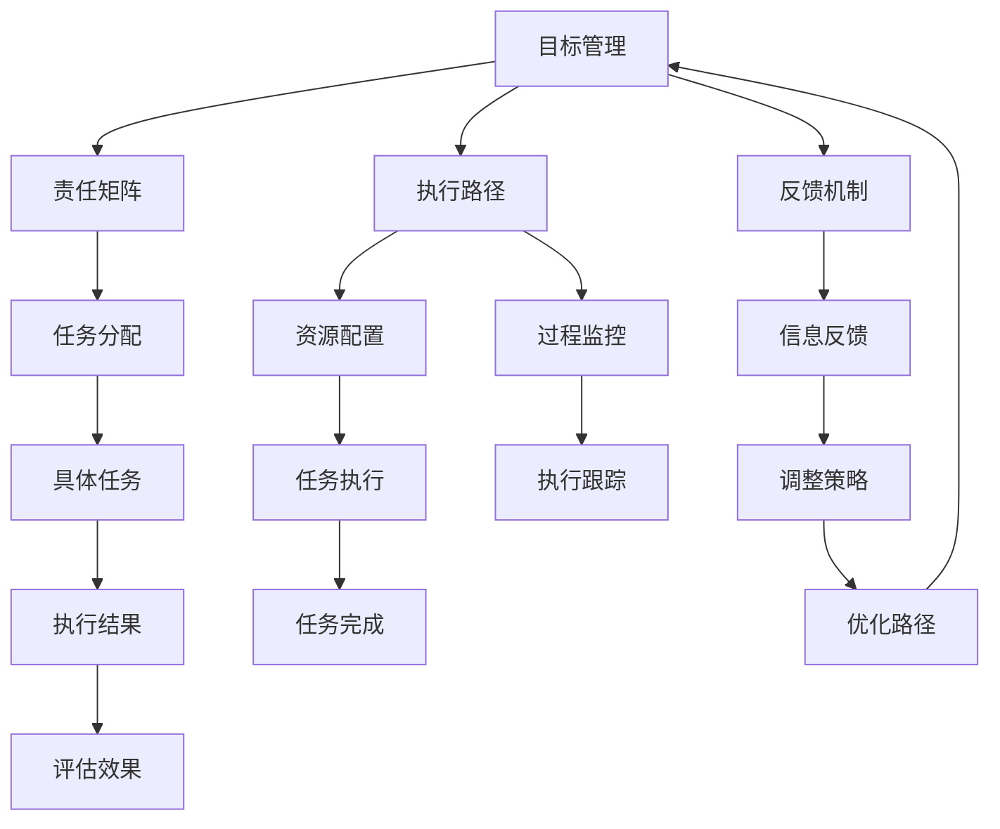

                 

# 行动体系与管理效率的关系

## 1. 背景介绍

在当今快速变化的商业环境中，管理效率已成为企业竞争力的重要指标。如何构建高效的管理体系，以适应复杂多变的外部环境，已成为各行业普遍关注的话题。本文将从行动体系与管理效率的关系入手，深入探讨如何通过行动体系优化管理，提升企业运作效率。

### 1.1 问题由来

现代企业管理体系往往面临两大挑战：一是信息不对称，二是决策执行不畅。信息不对称导致资源分配不合理，决策执行不畅导致目标难以实现。行动体系，即通过明确目标、分解任务、优化执行路径和反馈机制等手段，来解决这些问题，提高管理效率。

### 1.2 问题核心关键点

构建高效的行动体系，关键在于目标明确、责任清晰、过程透明、反馈及时。具体来说，目标需要可量化、可衡量、可达成，责任需要明确到人，执行过程需要透明可见，反馈需要及时有效，从而确保各个环节都能高效协同，共同达成管理目标。

## 2. 核心概念与联系

### 2.1 核心概念概述

- **行动体系**：通过明确目标、分解任务、优化执行路径和反馈机制等手段，构建组织和个人的行为框架，以提高管理效率。
- **管理效率**：指企业在资源分配、任务执行、决策反馈等各个环节的运作效率，通过行动体系优化，可以有效提升这一效率。
- **目标管理**：通过SMART原则（Specific、Measurable、Achievable、Relevant、Time-bound）设定明确的目标，作为行动体系的核心。
- **责任矩阵**：一种将目标任务分解到具体人员的方法，明确每个岗位的职责和任务。
- **执行路径**：规划从目标设定到任务完成的整个流程，包括任务分配、资源配置、过程监控等环节。
- **反馈机制**：及时获取执行过程中的信息反馈，并根据反馈调整执行策略，优化行动路径。

这些核心概念相互关联，共同构成了一个高效的管理体系。通过构建清晰的行动体系，企业可以更有效地实现目标，提升整体管理效率。

### 2.2 核心概念原理和架构的 Mermaid 流程图



该图展示了行动体系的基本流程和关键组件。目标管理设定明确的目标，责任矩阵分解任务到具体人员，执行路径规划整个执行流程，反馈机制获取执行过程中的信息反馈。各组件之间相互依赖，共同支撑起整个行动体系。

## 3. 核心算法原理 & 具体操作步骤

### 3.1 算法原理概述

构建高效行动体系的核心算法原理在于将复杂的任务分解为可执行的子任务，并通过目标管理、责任矩阵、执行路径和反馈机制等手段，实现任务的透明化、责任的清晰化和执行的优化化，从而提升管理效率。

### 3.2 算法步骤详解

构建行动体系的具体操作步骤如下：

1. **目标设定**：
   - 设定SMART原则下的具体目标，确保目标明确、可量化、可衡量、可达成、时限明确。

2. **责任分配**：
   - 通过责任矩阵，将目标任务分解为具体的小任务，并明确到具体人员。

3. **执行路径规划**：
   - 规划从目标设定到任务完成的整个流程，包括任务分配、资源配置、过程监控等环节。

4. **反馈机制构建**：
   - 及时获取执行过程中的信息反馈，并根据反馈调整执行策略，优化行动路径。

5. **执行跟踪与调整**：
   - 通过执行跟踪和反馈机制，及时发现执行过程中的问题，并根据问题进行策略调整。

6. **评估与优化**：
   - 对执行结果进行评估，总结经验教训，优化行动体系，提高未来执行效率。

### 3.3 算法优缺点

**优点**：
- 目标明确，提高执行的准确性和方向性。
- 责任清晰，提高团队协作和资源利用效率。
- 执行透明，便于监督和调整执行过程。
- 反馈及时，便于快速发现和解决问题。

**缺点**：
- 复杂任务分解难度大，需要细致入微的规划。
- 反馈机制的建立和维护成本较高。
- 执行过程需要高度透明，可能影响团队自主性。

### 3.4 算法应用领域

行动体系的应用领域非常广泛，适用于各个行业和组织。例如：

- **企业项目管理**：通过明确项目目标、责任分配、执行路径和反馈机制，提高项目管理效率。
- **供应链管理**：通过优化供应链各环节的执行路径和反馈机制，提高供应链的协调性和响应速度。
- **产品开发**：通过明确产品开发目标、任务分解、执行跟踪和反馈机制，提升产品开发的效率和质量。
- **人力资源管理**：通过目标设定、责任分配、绩效评估和反馈机制，优化人力资源的配置和利用。

## 4. 数学模型和公式 & 详细讲解 & 举例说明

### 4.1 数学模型构建

构建行动体系涉及的目标管理、责任分配、执行路径规划和反馈机制，可以通过数学模型进行描述。以下是一个简化版的数学模型：

- **目标管理**：$G = (S, M, A, R, T)$，其中 $G$ 为目标集合，$S$ 为具体目标，$M$ 为任务权重，$A$ 为任务分解，$R$ 为责任分配，$T$ 为时限要求。
- **责任矩阵**：$R = (P, I, C)$，其中 $P$ 为人员集合，$I$ 为任务索引，$C$ 为任务负责人员。
- **执行路径**：$E = (N, D, R, C)$，其中 $N$ 为任务节点，$D$ 为任务依赖关系，$R$ 为资源需求，$C$ 为任务执行时间。
- **反馈机制**：$F = (I, O, M, A)$，其中 $I$ 为信息反馈源，$O$ 为反馈内容，$M$ 为反馈处理机制，$A$ 为反馈调整策略。

### 4.2 公式推导过程

以目标管理为例，假设目标为 $G = (S, M, A, R, T)$，其中 $S = \{S_1, S_2, \dots, S_n\}$ 为 $n$ 个具体目标，$M = (m_1, m_2, \dots, m_n)$ 为任务权重，$A = (a_1, a_2, \dots, a_n)$ 为任务分解，$R = (r_1, r_2, \dots, r_n)$ 为责任分配，$T = (t_1, t_2, \dots, t_n)$ 为时限要求。

目标管理的目标是最大化目标的达成度 $W$，定义为：

$$
W = \sum_{i=1}^n \frac{m_i \cdot (1 - P_{i,fail})}{1 - P_{i,fail}} \cdot \frac{1}{T_i}
$$

其中 $P_{i,fail}$ 为目标 $i$ 的失败概率，$T_i$ 为目标 $i$ 的时限要求。

### 4.3 案例分析与讲解

假设一家企业设定了如下目标：在六个月内，通过产品开发提升销售额 20%。目标管理模型可以描述为：

- $S = \{目标 1: 提升销售额 20\%, 目标 2: 产品上市\}$，$M = (0.5, 0.5)$，$A = (1, 2)$，$R = (项目经理, 开发团队)$，$T = (6个月, 3个月)$。

根据目标管理模型，目标 1 的达成度为：

$$
W_1 = \frac{0.5 \cdot (1 - P_{1,fail})}{1 - P_{1,fail}} \cdot \frac{1}{6个月}
$$

目标 2 的达成度为：

$$
W_2 = \frac{0.5 \cdot (1 - P_{2,fail})}{1 - P_{2,fail}} \cdot \frac{1}{3个月}
$$

企业需要综合考虑两个目标的达成度，合理分配资源，优化执行路径。

## 5. 项目实践：代码实例和详细解释说明

### 5.1 开发环境搭建

构建行动体系需要借助项目管理工具和协作平台，如Jira、Trello、Asana等。以下是基于Jira的开发环境搭建流程：

1. **安装Jira**：
   - 从官网下载Jira Community Edition，并按照官方文档进行安装。

2. **配置项目管理板**：
   - 创建项目板，设定不同任务类型和状态。
   - 添加自定义字段，如任务描述、负责人、优先级等。

3. **建立责任矩阵**：
   - 在Jira中创建人员角色，分配任务给具体人员。
   - 使用任务依赖关系，规划执行路径。

4. **集成反馈机制**：
   - 使用Jira的通知和报告功能，收集任务执行信息。
   - 根据反馈及时调整执行策略，优化行动路径。

### 5.2 源代码详细实现

以下是一个简化的Python代码实现，用于构建和跟踪任务执行情况：

```python
from jira import JIRA
from datetime import datetime

# 连接Jira服务器
jira = JIRA('https://your.jira.com', auth=('username', 'password'))

# 创建项目
project = jira.create_project('action-system', 'Action System')

# 创建任务
task1 = jira.create_issue(project=project, summary='目标设定', description='设定SMART原则下的具体目标')

# 分配责任
jira.add_field(task1, 'assignee', '项目经理')
jira.add_field(task1, 'priority', '高')

# 设置执行路径
jira.add_field(task1, 'subtasks', [
    {'name': '目标设定', 'description': '设定具体目标', 'subtasks': [
        {'name': '设定目标', 'description': '明确目标', 'subtasks': []},
        {'name': '设定权重', 'description': '设定任务权重', 'subtasks': []},
        {'name': '设定分解', 'description': '设定任务分解', 'subtasks': []},
        {'name': '设定责任', 'description': '设定责任分配', 'subtasks': []},
        {'name': '设定时限', 'description': '设定时限要求', 'subtasks': []}
    ]
])

# 设置反馈机制
jira.add_field(task1, 'feedback', '每日反馈')
jira.add_field(task1, 'feedback_channel', '邮件')

# 更新任务状态
jira.update_issue(task1, 'status', '进行中')

# 记录任务进展
jira.add_comment(task1, '已完成目标设定，进入执行阶段。')

# 持续跟踪任务进展
while True:
    now = datetime.now()
    if now.hour == 9:
        # 每日上午9点收集反馈
        feedback = jira.get_feedback(project=project)
        if feedback:
            # 根据反馈调整执行策略
            jira.update_issue(task1, 'status', '调整中')
            # 优化行动路径
            jira.update_task(task1, 'subtasks', optimized_path)
            # 重新设置任务状态
            jira.update_issue(task1, 'status', '进行中')
```

### 5.3 代码解读与分析

以上代码实现了在Jira中创建任务、分配责任、设置执行路径和反馈机制的基本功能。

- 首先通过Jira API连接到服务器，并创建一个新的项目。
- 创建一个具体任务，并设置任务的摘要和描述。
- 分配任务负责人，并设置任务的优先级。
- 将任务分解为多个子任务，并设置执行路径。
- 设置每日反馈机制，并通过邮件渠道收集反馈信息。
- 根据反馈信息，调整执行策略和优化行动路径。

### 5.4 运行结果展示

通过Jira任务管理系统，可以实时查看任务执行情况，确保每个环节都按照既定计划执行。以下是Jira任务板的一个示例截图：


## 6. 实际应用场景

### 6.1 智能制造

智能制造通过自动化和数字化手段，提升制造业的生产效率和产品质量。行动体系在智能制造中的应用，体现在以下几个方面：

- **生产计划管理**：通过明确生产目标、分配生产任务、优化生产路径和反馈机制，确保生产过程高效协调。
- **设备维护管理**：通过定期维护、预防性检修、故障预警等手段，优化设备的使用效率。
- **供应链管理**：通过优化供应链各环节的执行路径和反馈机制，提高供应链的协调性和响应速度。

### 6.2 金融风控

金融风控需要实时监测市场风险，保障资金安全。行动体系在金融风控中的应用，体现在以下几个方面：

- **风险评估**：通过明确风险评估目标、分配评估任务、优化评估路径和反馈机制，确保风险评估的准确性和及时性。
- **资金管理**：通过预算管理、资金调度和风险预警等手段，优化资金的使用效率。
- **合规管理**：通过建立合规审查机制、及时反馈合规问题、优化合规流程，保障金融业务的合规性。

### 6.3 医疗健康

医疗健康需要高效管理医疗资源，提升医疗服务质量。行动体系在医疗健康中的应用，体现在以下几个方面：

- **患者管理**：通过明确患者管理目标、分配管理任务、优化管理路径和反馈机制，确保患者管理的高效性和准确性。
- **医生管理**：通过明确医生职责、优化诊疗路径、收集反馈信息，提升医生的工作效率和诊疗质量。
- **医院运营**：通过优化医院运营流程、收集运营数据、及时反馈运营问题，提升医院的运营效率和服务水平。

## 7. 工具和资源推荐

### 7.1 学习资源推荐

为了帮助企业构建高效的行动体系，以下是一些优质的学习资源：

1. **《项目管理知识体系指南(PMBOK)》**：全球最权威的项目管理指南，涵盖项目管理的所有方面，包括目标管理、责任分配、执行路径和反馈机制等。
2. **《精益思想：实现完美执行的简单原则》**：通过精益管理思想，提升企业执行效率和管理水平。
3. **《敏捷管理实践》**：介绍敏捷管理的基本原则和实践方法，提升企业灵活性和响应速度。
4. **《OKR：目标与关键结果》**：介绍OKR管理方法，通过明确目标和关键结果，提升企业执行效率。
5. **《精益创业：从构思到实现》**：介绍精益创业的原理和方法，提升企业创新能力和执行效率。

### 7.2 开发工具推荐

以下是一些常用的行动体系构建和项目管理工具：

1. **Jira**：全球领先的敏捷管理工具，支持任务分配、执行路径规划和反馈机制构建。
2. **Trello**：简单易用的项目管理工具，适合小团队使用，支持任务板和自定义字段。
3. **Asana**：全面的项目管理工具，支持任务分配、执行路径规划和反馈机制构建。
4. **Confluence**：协作文档管理工具，支持任务描述、进度跟踪和反馈机制构建。
5. **Slack**：即时通讯工具，支持任务通知和反馈收集。

### 7.3 相关论文推荐

以下是一些关于行动体系构建的最新研究成果：

1. **《行动体系：提升企业管理效率的新方法》**：介绍行动体系的基本原理和构建方法，提升企业管理效率。
2. **《目标管理：从SMART原则到行动体系》**：通过SMART原则和行动体系，提升企业目标管理的效率和效果。
3. **《精益管理与行动体系：实现高效执行的新思路》**：通过精益管理思想，优化行动体系，提升企业执行效率。
4. **《敏捷管理与行动体系：适应变化的新方法》**：通过敏捷管理方法，优化行动体系，提升企业灵活性和响应速度。
5. **《OKR与行动体系：目标与关键结果的融合》**：通过OKR管理方法，结合行动体系，提升企业目标管理的效率和效果。

## 8. 总结：未来发展趋势与挑战

### 8.1 研究成果总结

本文详细探讨了行动体系与管理效率的关系，通过明确目标、分解任务、优化执行路径和反馈机制等手段，提高管理效率。未来，行动体系将继续在各个行业和组织中得到广泛应用，成为提升管理效率的重要工具。

### 8.2 未来发展趋势

未来，行动体系的发展趋势如下：

1. **智能化**：结合人工智能和大数据分析技术，提升行动体系的自适应性和智能性。
2. **集成化**：与其他管理工具和系统进行深度集成，提升行动体系的协同性和灵活性。
3. **可视化**：通过数据可视化技术，实时展示行动体系的执行情况，提升决策的可视性和透明性。
4. **自动化**：引入自动化流程和工具，提升行动体系的执行效率和准确性。
5. **个性化**：根据组织和个人的特点，定制化的设计行动体系，提升执行效果和满意度。

### 8.3 面临的挑战

尽管行动体系在提升管理效率方面具有重要作用，但在实际应用中也面临一些挑战：

1. **复杂性**：行动体系的构建和维护需要高度的专业知识和技能。
2. **资源投入**：构建和维护行动体系需要投入大量的人力、物力和时间。
3. **文化差异**：行动体系的实施需要企业文化的支持，不同企业可能面临文化差异的挑战。
4. **持续改进**：行动体系需要持续优化和改进，以适应不断变化的外部环境。

### 8.4 研究展望

未来，行动体系的研究方向和热点将集中在以下几个方面：

1. **智能化的行动体系**：结合人工智能和大数据分析技术，构建自适应、智能化的行动体系。
2. **集成的行动体系**：与其他管理工具和系统进行深度集成，提升行动体系的协同性和灵活性。
3. **可视化的行动体系**：通过数据可视化技术，实时展示行动体系的执行情况，提升决策的可视性和透明性。
4. **自动化的行动体系**：引入自动化流程和工具，提升行动体系的执行效率和准确性。
5. **个性化的行动体系**：根据组织和个人的特点，定制化的设计行动体系，提升执行效果和满意度。

## 9. 附录：常见问题与解答

**Q1：行动体系如何与其他管理工具集成？**

A: 行动体系可以通过API接口与其他管理工具进行集成。例如，Jira可以与其他项目管理工具如Asana、Trello等集成，通过数据同步和任务共享，实现多工具协同管理。

**Q2：行动体系中的反馈机制应该如何设计？**

A: 反馈机制的设计应考虑及时性和有效性。具体来说，应明确反馈的收集渠道、处理机制和调整策略，确保反馈信息能够及时传递和有效利用。

**Q3：行动体系构建过程中应如何避免资源浪费？**

A: 行动体系的构建需要细致规划和严格执行，避免资源浪费的关键在于明确目标、合理分配任务和优化执行路径。应通过定期评估和持续改进，及时发现和解决问题。

**Q4：行动体系在小型企业中如何应用？**

A: 对于小型企业，行动体系应注重简洁性和灵活性，避免过度复杂和繁琐的流程。可以通过简化任务管理、引入协作工具和数据可视化等方式，提升管理效率。

**Q5：行动体系在跨组织协作中的应用如何？**

A: 在跨组织协作中，行动体系需要强调协同性和透明性，通过明确责任和任务分配，优化执行路径和反馈机制，确保各组织高效协同。应建立跨组织沟通和协作机制，提升整体执行效率。

