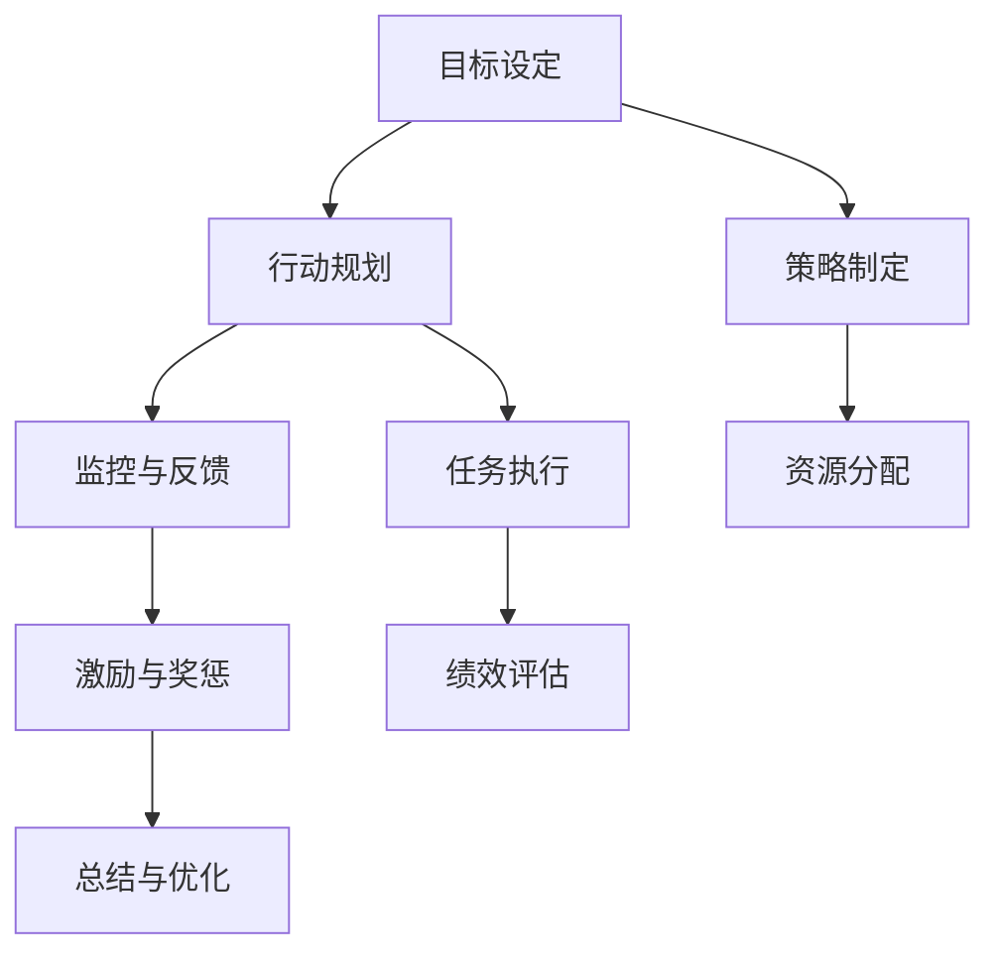

                 

# 行动体系对团队管理的重要性

## 1. 背景介绍

随着科技的迅猛发展，团队管理已成为现代企业不可或缺的一部分。行动体系作为团队管理的重要组成部分，对团队效率、成员参与度和整体绩效有着深远影响。本文将深入探讨行动体系对团队管理的重要性，并通过实例分析、理论推导和实践指导，帮助管理者构建高效的行动体系。

## 2. 核心概念与联系

### 2.1 核心概念概述

行动体系，是指在特定组织结构内，明确、连贯且可执行的行动路径和流程，旨在确保团队成员在共同目标下高效协作，达成预期目标。

- **目标设定**：为团队设定清晰、可衡量的目标，是行动体系建立的首要任务。
- **行动规划**：基于目标，制定详细的行动计划和时间表，分配任务与资源。
- **监控与反馈**：建立持续的监控机制，对进展情况进行实时反馈和调整，确保行动体系的有效执行。
- **激励与奖惩**：通过激励机制和奖惩措施，激发团队成员的积极性和创造力。

### 2.2 核心概念原理和架构的 Mermaid 流程图



### 2.3 核心概念之间的关系

- **目标设定**是行动体系建立的起点，明确了团队的总体方向和努力目标。
- **行动规划**则将目标分解为具体的行动路径，确保团队成员有明确的行动指南。
- **监控与反馈**机制确保行动体系能够动态调整，适应外部环境变化。
- **激励与奖惩**机制则通过外部刺激增强团队动力，维持行动体系的活力。

## 3. 核心算法原理 & 具体操作步骤

### 3.1 算法原理概述

行动体系的构建和维护，本质上是一个动态优化过程。其核心算法原理是通过不断迭代和优化，确保行动体系在目标设定、行动规划、监控与反馈、激励与奖惩等各个环节的高效运作。

形式化地，行动体系构建的过程可以表示为：

$$
\text{Action System} = \text{Goal Setting} + \text{Action Planning} + \text{Monitoring and Feedback} + \text{Incentives and Punishment}
$$

其中，每个环节都需通过算法进行优化和调整，以适应团队当前的状态和外部环境的变化。

### 3.2 算法步骤详解

#### 3.2.1 目标设定

**步骤1：** 确定团队的总体目标和关键绩效指标（KPIs）。

**步骤2：** 使用SMART原则（具体、可衡量、可达成、相关性、时限性）对目标进行定义，确保目标的可行性和清晰度。

**步骤3：** 与团队成员共同讨论，确保目标的共识性和参与度。

#### 3.2.2 行动规划

**步骤1：** 将总体目标分解为具体的行动步骤，并制定时间表。

**步骤2：** 使用任务管理工具（如Trello、Asana等）进行任务分配和跟踪。

**步骤3：** 为每个任务设定明确的责任人和截止日期，确保任务的可执行性。

#### 3.2.3 监控与反馈

**步骤1：** 建立定期的监控机制，通过进度报告、会议等方式了解项目进展。

**步骤2：** 对进展情况进行实时反馈，及时发现问题并采取调整措施。

**步骤3：** 使用数据可视化工具（如Tableau、Power BI等）展示关键指标，帮助团队成员直观了解项目状态。

#### 3.2.4 激励与奖惩

**步骤1：** 根据团队和个人的表现，设定合理的激励机制和奖惩标准。

**步骤2：** 实施激励和奖惩措施，确保公平性和透明性。

**步骤3：** 定期评估激励和奖惩机制的效果，根据反馈进行优化。

### 3.3 算法优缺点

**优点：**
- **目标导向**：行动体系以明确的目标为导向，有助于团队成员集中精力，提升工作效率。
- **流程规范**：通过标准化流程，减少任务执行中的不确定性和混乱，提高任务完成质量。
- **动态调整**：实时监控和反馈机制，使行动体系能够快速响应外部环境变化，保持灵活性和适应性。

**缺点：**
- **灵活性不足**：过于规范的流程可能限制团队成员的创造性，导致灵活性不足。
- **过度依赖工具**：依赖于特定的工具和平台，可能增加团队的使用成本和维护难度。
- **沟通成本**：频繁的监控和反馈需要大量的沟通和协作，可能增加团队成员的工作负担。

### 3.4 算法应用领域

行动体系在多种组织和管理领域中都有广泛应用，包括但不限于以下领域：

- **项目管理**：确保项目按时、按质完成，提升项目管理效率。
- **人力资源管理**：通过目标设定和激励机制，提升员工积极性和团队凝聚力。
- **产品开发**：规范产品开发流程，提高产品质量和市场竞争力。
- **客户服务**：通过明确的服务标准和反馈机制，提升客户满意度和忠诚度。

## 4. 数学模型和公式 & 详细讲解 & 举例说明

### 4.1 数学模型构建

行动体系的构建可以抽象为一个优化问题，通过数学模型描述行动体系的各个环节，求解最优解。

设 $G$ 为目标设定，$A$ 为行动规划，$M$ 为监控与反馈，$I$ 为激励与奖惩。行动体系的总效用函数 $U$ 可以表示为：

$$
U(G, A, M, I) = G \times A \times M \times I
$$

其中，$G, A, M, I$ 均为非负变量，表示各个环节的执行效果。

### 4.2 公式推导过程

为简化问题，我们假设每个环节的执行效果均为单位值，即 $G = A = M = I = 1$。

则行动体系的效用函数简化为：

$$
U = G \times A \times M \times I = 1 \times 1 \times 1 \times 1 = 1
$$

这一假设只是为了说明行动体系的构成和关系，实际应用中，每个环节的效用值需要通过具体的指标和评估方法来确定。

### 4.3 案例分析与讲解

#### 案例分析：项目管理行动体系

某软件开发公司通过构建行动体系，成功提升了项目管理效率。具体步骤如下：

1. **目标设定**：确定项目总体目标为开发并上线一个新功能模块，KPI为上线时间、代码质量、用户满意度。

2. **行动规划**：将目标分解为多个子目标，如需求分析、代码开发、测试、上线。制定详细的行动计划和时间表，分配任务给各团队成员。

3. **监控与反馈**：每周召开项目进展会议，实时收集进展情况，并通过数据可视化工具展示项目状态。

4. **激励与奖惩**：根据项目进展和团队表现，设定奖励和惩罚措施。对按时完成任务的团队给予奖金，对延期的团队进行警示。

通过这一行动体系，公司项目管理效率显著提升，按时完成了项目目标，同时团队成员的工作积极性和满意度也得到了提升。

## 5. 项目实践：代码实例和详细解释说明

### 5.1 开发环境搭建

在进行行动体系构建的实践前，需要先搭建好开发环境。以下是Python环境搭建的具体步骤：

1. **安装Python**：从官网下载并安装Python 3.8。

2. **安装虚拟环境工具**：安装`virtualenv`，用于创建虚拟开发环境。

3. **创建虚拟环境**：在项目目录下执行`virtualenv env`创建虚拟环境。

4. **激活虚拟环境**：在命令行中执行`source env/bin/activate`激活虚拟环境。

5. **安装必要的Python包**：使用`pip`安装必要的Python包，如`numpy`、`pandas`、`matplotlib`等。

### 5.2 源代码详细实现

**步骤1：** 编写行动体系的核心模块，包括目标设定、行动规划、监控与反馈、激励与奖惩等功能。

```python
class ActionSystem:
    def __init__(self):
        self.target = ""
        self.plan = []
        self.monitor = []
        self.incentive = []
    
    def set_target(self, target):
        self.target = target
    
    def plan_actions(self, plan):
        self.plan = plan
    
    def monitor_progress(self, monitor):
        self.monitor = monitor
    
    def incentive_measures(self, incentive):
        self.incentive = incentive
```

**步骤2：** 实现具体的功能逻辑，如目标设定、行动规划、监控与反馈、激励与奖惩等。

```python
class ActionSystem:
    # 目标设定
    def set_target(self, target):
        self.target = target
        print(f"目标设定为：{self.target}")
    
    # 行动规划
    def plan_actions(self, plan):
        self.plan = plan
        print(f"行动计划为：{self.plan}")
    
    # 监控与反馈
    def monitor_progress(self, monitor):
        self.monitor = monitor
        print(f"监控进度为：{self.monitor}")
    
    # 激励与奖惩
    def incentive_measures(self, incentive):
        self.incentive = incentive
        print(f"激励与奖惩措施为：{self.incentive}")
```

**步骤3：** 编写测试代码，验证行动体系的功能逻辑是否正确。

```python
def test_action_system():
    action_system = ActionSystem()
    
    # 目标设定
    action_system.set_target("开发并上线新功能模块")
    
    # 行动规划
    action_system.plan_actions(["需求分析", "代码开发", "测试", "上线"])
    
    # 监控与反馈
    action_system.monitor_progress(["每周项目进展会议", "数据可视化工具展示"])
    
    # 激励与奖惩
    action_system.incentive_measures(["按时完成任务奖金", "延时任务警告"])
```

### 5.3 代码解读与分析

**代码解析**：
1. **ActionSystem类**：定义了行动体系的核心模块，包括目标设定、行动规划、监控与反馈、激励与奖惩等功能。
2. **set_target方法**：用于设定行动体系的目标。
3. **plan_actions方法**：用于规划具体的行动步骤。
4. **monitor_progress方法**：用于监控行动体系的进展。
5. **incentive_measures方法**：用于设定激励与奖惩措施。

**代码测试**：
1. **test_action_system函数**：通过实例化ActionSystem类，并调用各方法，验证行动体系的功能逻辑。
2. **输出结果**：在每次方法调用后打印输出，展示行动体系的具体设置。

### 5.4 运行结果展示

执行`test_action_system()`函数后，输出结果如下：

```
目标设定为：开发并上线新功能模块
行动计划为：['需求分析', '代码开发', '测试', '上线']
监控进度为：['每周项目进展会议', '数据可视化工具展示']
激励与奖惩措施为：['按时完成任务奖金', '延时任务警告']
```

## 6. 实际应用场景

### 6.1 项目管理体系

在软件开发项目中，通过构建行动体系，可以确保项目按时、按质完成，提升项目管理效率。通过明确的目标设定、详细的行动规划、实时的监控与反馈，以及合理的激励与奖惩措施，团队成员能够更好地理解项目目标和任务要求，提高工作积极性和协作效率。

### 6.2 人力资源管理体系

在人力资源管理中，行动体系通过明确的目标设定和激励机制，可以有效提升员工积极性和团队凝聚力。通过对工作表现的持续监控和反馈，及时发现问题并进行调整，确保人力资源管理的高效运行。

### 6.3 产品开发体系

在产品开发过程中，行动体系规范了产品开发的各个环节，确保产品按时上线，同时提高了产品质量和市场竞争力。通过持续监控和反馈机制，及时发现产品问题和用户反馈，快速进行调整和优化。

### 6.4 客户服务体系

在客户服务管理中，行动体系通过明确的服务标准和反馈机制，提升客户满意度和忠诚度。通过对服务进度的实时监控和反馈，及时解决客户问题，提升客户服务质量。

## 7. 工具和资源推荐

### 7.1 学习资源推荐

1. **《行动体系设计指南》**：详细介绍了行动体系的设计原理和实践方法，适合管理者学习。
2. **《项目管理工具实用指南》**：介绍了多种项目管理工具的使用方法，帮助管理者提升项目管理效率。
3. **《人力资源管理实战案例》**：提供多个人力资源管理的实用案例，帮助管理者更好地应用行动体系。

### 7.2 开发工具推荐

1. **Trello**：简单易用的任务管理工具，支持目标设定、行动规划、监控与反馈等功能。
2. **Asana**：功能强大的项目管理工具，支持多项目管理和实时协作。
3. **Tableau**：数据可视化工具，支持动态展示行动体系的关键指标。

### 7.3 相关论文推荐

1. **《行动体系设计理论与实践》**：深入探讨行动体系的设计原理和实践方法，适合学术研究。
2. **《项目管理中的行动体系优化研究》**：介绍了多种行动体系优化算法和实际应用案例。
3. **《人力资源管理中的行动体系应用》**：探讨了行动体系在人力资源管理中的具体应用方法和效果评估。

## 8. 总结：未来发展趋势与挑战

### 8.1 研究成果总结

本文对行动体系的重要性进行了全面系统的介绍，详细讲解了行动体系的核心概念、原理和操作步骤，并通过实例分析、理论推导和实践指导，帮助管理者构建高效的行动体系。未来，行动体系的应用范围将进一步扩大，成为现代企业管理的重要组成部分。

### 8.2 未来发展趋势

1. **智能化管理**：未来行动体系将更多地引入智能化技术，如人工智能、大数据等，提升管理效率和决策质量。
2. **全员参与**：行动体系的构建将更加注重全员参与，通过透明化、民主化的方式，增强团队的凝聚力和执行力。
3. **跨部门协同**：行动体系将更多地应用于跨部门协同管理，促进各部门的协作和资源共享。
4. **持续优化**：行动体系将更加注重动态优化，及时响应外部环境变化，提升适应性和灵活性。

### 8.3 面临的挑战

1. **目标设定难题**：目标设定是行动体系构建的起点，如何确保目标的可行性和清晰度，仍是一个重要挑战。
2. **流程规范问题**：过于规范的流程可能限制团队成员的创造性，如何在规范与灵活之间找到平衡，是一个难点。
3. **沟通成本**：频繁的监控和反馈需要大量的沟通和协作，可能增加团队成员的工作负担。
4. **激励与奖惩**：如何设定公平和透明的激励与奖惩机制，避免激励失效或激励不足，是一个重要的挑战。

### 8.4 研究展望

未来，行动体系的研究将在以下几个方向取得突破：
1. **智能化优化**：引入人工智能和大数据技术，实现行动体系的智能化优化和动态调整。
2. **全员参与**：通过透明化、民主化的方式，增强团队成员的参与度和执行力。
3. **跨部门协同**：加强行动体系在跨部门协同管理中的应用，提升企业整体效率。
4. **持续优化**：通过持续监控和反馈机制，及时响应外部环境变化，提升行动体系的适应性和灵活性。

## 9. 附录：常见问题与解答

### Q1: 如何确定行动体系的目标？

A: 确定行动体系的目标需要明确企业的战略方向和业务需求，使用SMART原则进行设定，确保目标的可行性和清晰度。

### Q2: 行动体系中如何实现激励与奖惩？

A: 激励与奖惩的设定需要公平、透明，根据团队和个人的表现设定合理的奖励和惩罚措施。定期评估激励和奖惩机制的效果，根据反馈进行优化。

### Q3: 行动体系中如何确保流程规范？

A: 在行动体系的构建过程中，应采用标准化的流程和工具，减少任务执行中的不确定性和混乱。同时，应定期对流程进行评估和优化，确保其适用性和灵活性。

### Q4: 如何提升行动体系的适应性和灵活性？

A: 通过持续监控和反馈机制，及时发现问题并进行调整。引入智能化技术，实现动态优化和实时调整。

**作者：禅与计算机程序设计艺术 / Zen and the Art of Computer Programming**

