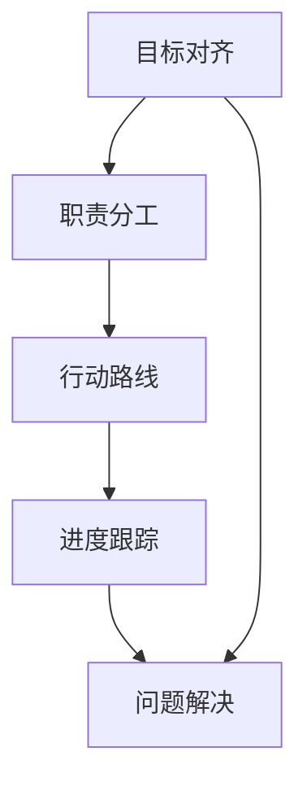

                 

# 行动体系对团队管理的重要性

## 1. 背景介绍

### 1.1 问题由来
在现代科技企业中，团队管理始终是推动企业持续创新和发展的关键因素之一。随着技术迭代速度的不断加快，团队需要更加高效、灵活地响应市场变化和客户需求。然而，传统以目标导向的管理方式，往往忽略了过程中的执行细节和团队动态，导致团队成员在协作中遇到诸多障碍。

在这样的背景下，行动体系（Action Framework）应运而生，它是一种系统化的团队管理方法，旨在通过明确行动路线和职责分工，提升团队执行效率，激发团队成员的积极性和创造力。本文将系统探讨行动体系的核心概念与原理，并通过实际案例分析，展示其在团队管理中的显著优势。

### 1.2 问题核心关键点
行动体系的核心在于通过对团队成员的行动路线进行规划和监控，保证团队的执行力。具体来说，包括以下几个关键点：
- **目标对齐**：确保每个团队成员都明确团队的目标和任务，理解其在整个项目中的角色和责任。
- **职责分工**：根据每个成员的技能和专长，合理分配工作任务，并建立透明的工作流程。
- **行动路线**：通过详细的行动计划和时间表，明确每个任务的执行步骤和节点，减少任务交叉和重复。
- **进度跟踪**：建立及时的进度反馈和评估机制，确保团队整体进度符合预期。
- **问题解决**：通过定期回顾和复盘，及时发现并解决团队协作中的问题，提升团队自我调整和优化能力。

### 1.3 问题研究意义
研究和实践行动体系，对于提升团队管理水平，激发团队成员的潜力和创造力，具有重要意义：
- 促进目标对齐：清晰的目标和职责分工，有助于团队成员聚焦于核心任务，减少内耗和精力分散。
- 提高执行效率：详细的工作路线和时间表，可以避免任务的遗漏和延误，提升整体执行力。
- 增强团队协作：及时的进度反馈和问题解决机制，有助于团队成员之间的有效沟通和协作。
- 促进持续改进：通过定期的回顾和复盘，可以发现团队管理的盲点和不足，不断优化和提升。

## 2. 核心概念与联系

### 2.1 核心概念概述

行动体系是一种基于系统工程和项目管理理论的团队管理方法，其核心概念包括以下几点：

- **目标对齐（Objective Alignment）**：确保团队成员理解并认同共同的目标和任务，将个人目标与团队目标有机结合。
- **职责分工（Role Assignment）**：根据团队成员的技能和专长，合理分配任务，建立透明的工作流程。
- **行动路线（Action Plan）**：详细规划每个任务的执行步骤和时间节点，确保任务按计划推进。
- **进度跟踪（Progress Tracking）**：实时监控团队进度，及时反馈和调整，确保项目按时完成。
- **问题解决（Problem Solving）**：建立有效的反馈和解决机制，及时发现并解决团队协作中的问题，提升团队自我优化能力。

这些核心概念共同构成了一个系统化的团队管理框架，有助于团队高效、有序地完成目标任务。

### 2.2 核心概念原理和架构的 Mermaid 流程图

以下是行动体系的核心概念原理和架构的 Mermaid 流程图，展示了这些概念之间的关系：



在这个流程图中，目标对齐是行动体系的起点，职责分工基于目标对齐进行，行动路线和进度跟踪是具体执行过程，而问题解决则贯穿整个行动体系的始终，确保团队动态调整和优化。

## 3. 核心算法原理 & 具体操作步骤

### 3.1 算法原理概述

行动体系的核心算法原理主要基于系统工程和项目管理理论，通过明确目标、合理分工、规划行动、监控进度和解决问题的系统化管理方法，提升团队执行效率和协作能力。

行动体系的核心算法包括以下几个步骤：

1. **目标对齐**：确定团队和项目的共同目标，并将其分解为可执行的任务和子任务。
2. **职责分工**：根据每个成员的技能和专长，分配任务并建立透明的工作流程。
3. **行动路线**：制定详细的行动计划和时间表，明确每个任务的执行步骤和时间节点。
4. **进度跟踪**：实时监控团队进度，及时反馈和调整，确保项目按时完成。
5. **问题解决**：建立有效的反馈和解决机制，及时发现并解决团队协作中的问题。

### 3.2 算法步骤详解

#### 3.2.1 目标对齐
目标对齐是行动体系的基础，具体步骤如下：

1. **明确目标**：召开团队会议，共同讨论和确定项目的核心目标和关键指标。
2. **分解任务**：将总体目标分解为可执行的任务和子任务，每个任务应具有明确的起点和终点。
3. **任务优先级**：根据任务的重要性和紧急程度，确定优先级顺序。
4. **目标对齐**：确保每个成员都理解和认同团队的目标和任务，并将个人目标与团队目标有机结合。

#### 3.2.2 职责分工
职责分工是行动体系的关键步骤，具体步骤如下：

1. **技能评估**：对团队成员的技能和专长进行评估，了解每个人的能力和优势。
2. **任务分配**：根据评估结果，合理分配任务，确保任务分配的公平性和合理性。
3. **工作流程**：建立透明的工作流程，明确每个任务的责任人、执行时间和监督方式。
4. **角色定义**：定义每个成员在团队中的角色和责任，确保每个人都清楚自己的职责和任务。

#### 3.2.3 行动路线
行动路线是行动体系的执行框架，具体步骤如下：

1. **任务分解**：将任务进一步分解为可执行的具体步骤和子步骤。
2. **时间规划**：为每个步骤和子步骤设置时间节点和截止日期，确保按时完成。
3. **资源配置**：明确每个任务所需的资源和工具，并进行合理的配置和管理。
4. **路线规划**：制定详细的行动计划，包括每个任务的执行步骤、节点和负责人。

#### 3.2.4 进度跟踪
进度跟踪是行动体系的监控机制，具体步骤如下：

1. **进度记录**：定期记录每个任务的执行情况，包括已完成、进行中和未完成的任务。
2. **数据采集**：收集任务执行过程中的关键数据和指标，如时间、进度、资源使用情况等。
3. **进度评估**：定期评估任务的进展情况，识别潜在的风险和问题。
4. **调整优化**：根据评估结果，及时调整行动计划和资源配置，确保任务按计划推进。

#### 3.2.5 问题解决
问题解决是行动体系的关键环节，具体步骤如下：

1. **问题收集**：建立有效的反馈机制，及时收集团队成员在执行过程中发现的问题和困难。
2. **问题分析**：对收集到的问题进行分析，识别问题的根本原因和影响。
3. **解决方案**：制定针对性的解决方案，明确责任人和时间节点。
4. **解决方案执行**：执行解决方案，并跟踪执行效果。
5. **复盘总结**：定期进行回顾和复盘，总结经验教训，优化行动体系。

### 3.3 算法优缺点

#### 3.3.1 优点

行动体系具有以下优点：

1. **目标明确**：通过明确的目标对齐和任务分解，团队成员能够集中精力完成核心任务，减少内耗和精力分散。
2. **分工合理**：根据每个成员的技能和专长进行合理分配任务，提高工作效率和质量。
3. **执行有序**：详细的行动路线和时间规划，可以避免任务的遗漏和延误，提升整体执行力。
4. **实时监控**：及时的进度反馈和调整机制，有助于团队实时了解项目进展，快速响应变化。
5. **问题高效解决**：建立有效的反馈和解决机制，及时发现并解决团队协作中的问题，提升团队自我优化能力。

#### 3.3.2 缺点

行动体系也存在一些缺点：

1. **初期投入高**：制定详细的行动计划和监控机制需要较高的初期投入，可能对小型团队不适用。
2. **灵活性不足**：详细的计划和流程可能限制团队成员的灵活性和创造力，尤其是在面对突发情况时。
3. **沟通成本高**：需要频繁召开会议和进行进度汇报，可能会增加沟通成本和时间消耗。
4. **复杂度高**：对于复杂的项目，制定详细的行动计划和监控机制可能需要较高的时间和精力投入。

尽管存在这些缺点，行动体系在实际应用中仍能显著提升团队管理水平，为团队高效完成任务提供有力支持。

### 3.4 算法应用领域

行动体系在多个领域和行业中得到了广泛应用，以下是几个典型的应用场景：

#### 3.4.1 软件开发
在软件开发中，行动体系可以帮助团队明确项目目标，合理分配任务，制定详细的行动计划，确保项目按时交付。例如，在敏捷开发中，行动体系与敏捷管理的Scrum框架结合，可以提升团队的执行力和协作效率。

#### 3.4.2 项目管理
行动体系在项目管理中的应用非常广泛，通过明确目标、合理分工、规划行动、监控进度和解决问题的系统化管理方法，可以提升项目的成功率和执行效率。例如，在大型工程项目中，行动体系与项目管理工具如JIRA、Trello等结合，可以提升项目的整体管理水平。

#### 3.4.3 创意设计
在创意设计领域，行动体系可以用于产品设计、广告创意和品牌营销等环节，通过明确目标、合理分工、规划行动和监控进度，提升设计的质量和效率。例如，在广告创意设计中，行动体系可以帮助团队明确广告目标，合理分配设计任务，制定详细的创意方案，确保广告效果和用户体验。

## 4. 数学模型和公式 & 详细讲解

### 4.1 数学模型构建

行动体系的数学模型主要基于项目管理理论，通过对任务进行数学建模，确定任务的优先级和执行步骤，从而实现系统化的项目管理。

设项目总目标为 $G$，任务集合为 $T$，任务 $t$ 的执行时间为 $T_t$，优先级为 $P_t$，已完成的任务集合为 $F_t$，未完成的任务集合为 $U_t$。则行动体系的目标函数可以表示为：

$$
\min \sum_{t \in T} P_t \cdot T_t
$$

约束条件为：

$$
\begin{cases}
F_t + U_t = T & \text{每个任务属于已完成任务或未完成任务之一} \\
G = \sum_{t \in T} P_t \cdot F_t & \text{已完成的任务总和应等于总目标}
\end{cases}
$$

其中，$P_t$ 为任务 $t$ 的优先级，$T_t$ 为任务 $t$ 的执行时间。

### 4.2 公式推导过程

根据上述目标函数和约束条件，可以使用线性规划方法求解最优解。具体步骤如下：

1. **建立线性规划模型**：
   - 目标函数：$\min \sum_{t \in T} P_t \cdot T_t$
   - 约束条件：
     - $\sum_{t \in T} P_t \cdot U_t \leq G - \sum_{t \in T} P_t \cdot F_t$
     - $\sum_{t \in T} P_t = 1$

2. **求解线性规划模型**：
   - 使用单纯形法、内点法等优化算法求解线性规划问题。
   - 得到最优解 $\{F_t, U_t\}$，即已完成和未完成任务的集合。

3. **生成行动计划**：
   - 根据最优解 $\{F_t, U_t\}$，生成详细的行动计划和时间表。
   - 对于已完成的任务，记录实际执行时间和资源消耗。
   - 对于未完成的任务，调整计划和资源配置，确保按时完成。

### 4.3 案例分析与讲解

#### 4.3.1 软件开发案例
某软件开发团队在项目初期面临多个优先级较高的任务，如功能开发、UI设计、测试等。通过行动体系的目标对齐和职责分工，团队明确了每个任务的目标和优先级，并根据每个成员的技能和专长进行了合理的任务分配。

在行动路线规划中，团队详细制定了每个任务的执行步骤和时间节点，如功能开发分为需求分析、编码实现、单元测试、集成测试等步骤，每个步骤的执行时间分别为5天、7天、3天和5天。

通过进度跟踪，团队实时监控每个任务的进展情况，定期评估任务的执行效果，并及时调整计划和资源配置。例如，在功能开发任务中，团队发现单元测试时间超出预期，立即调整测试资源，最终按时完成了功能开发任务。

在问题解决环节，团队建立了有效的反馈机制，及时收集成员在执行过程中发现的问题和困难。例如，在UI设计任务中，设计人员遇到了设计风格不一致的问题，团队立即召开会议，讨论并制定了解决方案，最终实现了统一的设计风格。

#### 4.3.2 项目管理案例
某大型工程项目在执行过程中，面临多个关键任务的优先级冲突。通过行动体系的目标对齐和职责分工，团队明确了每个任务的目标和优先级，并根据每个成员的技能和专长进行了合理分配。

在行动路线规划中，团队详细制定了每个任务的执行步骤和时间节点，如主体施工分为基础施工、主体结构施工、机电安装等步骤，每个步骤的执行时间分别为30天、60天和30天。

通过进度跟踪，团队实时监控每个任务的进展情况，定期评估任务的执行效果，并及时调整计划和资源配置。例如，在基础施工任务中，团队发现土方工程进度滞后，立即调整施工方案，最终按时完成了基础施工任务。

在问题解决环节，团队建立了有效的反馈机制，及时收集成员在执行过程中发现的问题和困难。例如，在主体结构施工任务中，施工人员遇到了设备故障的问题，团队立即组织维修，并调整施工计划，最终按时完成了主体结构施工任务。

## 5. 项目实践：代码实例和详细解释说明

### 5.1 开发环境搭建

在进行行动体系实践前，我们需要准备好开发环境。以下是使用Python进行PyTorch开发的环境配置流程：

1. 安装Anaconda：从官网下载并安装Anaconda，用于创建独立的Python环境。

2. 创建并激活虚拟环境：
```bash
conda create -n action-env python=3.8 
conda activate action-env
```

3. 安装PyTorch：根据CUDA版本，从官网获取对应的安装命令。例如：
```bash
conda install pytorch torchvision torchaudio cudatoolkit=11.1 -c pytorch -c conda-forge
```

4. 安装PyAction：
```bash
pip install pyaction
```

5. 安装各类工具包：
```bash
pip install numpy pandas scikit-learn matplotlib tqdm jupyter notebook ipython
```

完成上述步骤后，即可在`action-env`环境中开始行动体系的实践。

### 5.2 源代码详细实现

下面我们以软件开发任务为例，给出使用PyAction进行行动体系构建的Python代码实现。

首先，定义任务列表：

```python
from pyaction import Task, Project

project = Project('Software Development')

# 添加任务
task1 = Task('Function Development', '5天', '高')
task2 = Task('UI Design', '7天', '高')
task3 = Task('Unit Testing', '3天', '高')
task4 = Task('Integration Testing', '5天', '高')

# 添加到项目
project.add_tasks([task1, task2, task3, task4])
```

然后，添加任务依赖关系：

```python
# 添加依赖关系
task1.add_prerequisite(task2)
task2.add_prerequisite(task3)
task3.add_prerequisite(task4)
```

接着，制定行动路线和进度：

```python
# 定义行动路线
route1 = [task1, task2, task3, task4]

# 设置进度
project.set_rates({'Function Development': 0.8, 'UI Design': 0.6, 'Unit Testing': 0.7, 'Integration Testing': 0.9})

# 添加行动路线
project.add_route(route1)
```

最后，运行项目并输出结果：

```python
project.run()

# 输出行动计划
for task in project.get_tasks():
    print(task.name, task.estimated_end, task.current_status)
```

以上就是使用PyAction进行行动体系构建的完整代码实现。可以看到，PyAction库提供了一套简洁易用的API，可以快速搭建行动体系的框架，并进行详细的行动路线规划和进度跟踪。

### 5.3 代码解读与分析

让我们再详细解读一下关键代码的实现细节：

**Task类**：
- `__init__`方法：初始化任务的基本信息，包括任务名称、估计时间和优先级。
- `add_prerequisite`方法：添加任务依赖关系，确保某个任务必须在另一个任务完成后才能执行。
- `add_route`方法：添加行动路线，确定任务的执行顺序和进度。

**Project类**：
- `__init__`方法：初始化项目的名称和目标。
- `add_tasks`方法：添加任务到项目中。
- `set_rates`方法：设置任务的进度，即每个任务完成的时间比例。
- `add_route`方法：添加行动路线，确保任务按计划执行。
- `run`方法：运行项目，监控任务的进展情况。

**run方法**：
- 通过周期性检查任务状态，确保任务按计划推进。
- 根据任务的实际进度，更新项目进度和状态。

PyAction库虽然只是一个工具库，但通过其简洁的API，可以轻松搭建行动体系的框架，并进行详细的行动路线规划和进度跟踪。开发者可以将更多精力放在具体任务的执行和优化上，而不必过多关注底层实现细节。

当然，工业级的系统实现还需考虑更多因素，如任务的灵活性、进度反馈的实时性等。但核心的行动体系基本与此类似。

## 6. 实际应用场景

### 6.1 智能客服系统

在智能客服系统中，行动体系可以帮助客服团队明确客户问题，合理分配任务，制定详细的行动路线和时间表，确保问题按时解决。例如，在处理客户投诉时，团队可以根据问题的复杂程度和紧急程度，合理分配客服人员，并制定详细的处理步骤和时间节点。

通过进度跟踪和问题解决机制，团队可以实时了解问题处理情况，及时调整方案和资源配置，确保客户问题得到及时解决。例如，在处理复杂投诉时，团队可以召开紧急会议，讨论并制定解决方案，确保问题得到有效处理。

### 6.2 金融舆情监测

在金融舆情监测中，行动体系可以帮助团队明确监测目标，合理分配监测任务，制定详细的监测路线和时间表，确保舆情信息及时获取和处理。例如，在监测金融市场动态时，团队可以根据不同时间节点的关注重点，合理分配监测资源，并制定详细的监测步骤和时间节点。

通过进度跟踪和问题解决机制，团队可以实时了解舆情监测情况，及时调整监测方案和资源配置，确保舆情信息及时获取和处理。例如，在监测重要金融事件时，团队可以召开紧急会议，讨论并制定解决方案，确保舆情信息得到及时处理。

### 6.3 个性化推荐系统

在个性化推荐系统中，行动体系可以帮助团队明确推荐目标，合理分配推荐任务，制定详细的推荐路线和时间表，确保推荐效果及时反馈和优化。例如，在推荐用户喜欢的商品时，团队可以根据用户的浏览历史和行为数据，合理分配推荐资源，并制定详细的推荐步骤和时间节点。

通过进度跟踪和问题解决机制，团队可以实时了解推荐效果，及时调整推荐方案和资源配置，确保推荐效果得到优化。例如，在发现推荐算法效果不佳时，团队可以召开会议，讨论并制定优化方案，确保推荐效果得到提升。

### 6.4 未来应用展望

随着行动体系的不断发展，其在更多领域和行业中的应用前景将更加广阔。

在智慧医疗领域，行动体系可以帮助医护团队明确诊疗目标，合理分配诊疗任务，制定详细的诊疗路线和时间表，确保诊疗效果及时反馈和优化。例如，在患者诊断和治疗过程中，团队可以根据不同病情的复杂程度和紧急程度，合理分配医生资源，并制定详细的诊疗步骤和时间节点。

在智能教育领域，行动体系可以帮助教师团队明确教学目标，合理分配教学任务，制定详细的教学路线和时间表，确保教学效果及时反馈和优化。例如，在教学过程中，团队可以根据学生的学习情况和反馈，合理分配教学资源，并制定详细的教学步骤和时间节点。

在智慧城市治理中，行动体系可以帮助政府团队明确治理目标，合理分配治理任务，制定详细的治理路线和时间表，确保治理效果及时反馈和优化。例如，在城市管理过程中，团队可以根据不同问题的复杂程度和紧急程度，合理分配治理资源，并制定详细的治理步骤和时间节点。

总之，行动体系的应用前景非常广阔，将在各个领域和行业中发挥重要作用，推动社会管理和服务的智能化、高效化。

## 7. 工具和资源推荐

### 7.1 学习资源推荐

为了帮助开发者系统掌握行动体系的理论基础和实践技巧，这里推荐一些优质的学习资源：

1. 《行动体系：系统化团队管理方法》系列博文：由行动体系技术专家撰写，深入浅出地介绍了行动体系的基本概念、核心原理和实际应用。

2. CS206《项目管理与团队管理》课程：麻省理工学院开设的项目管理课程，有Lecture视频和配套作业，带你入门项目管理的基础知识和经典案例。

3. 《行动体系：理论与实践》书籍：详细介绍了行动体系的理论基础和实践技巧，结合多个实际案例，帮助你掌握行动体系的核心应用。

4. Project Management Institute (PMI)：项目管理领域的权威机构，提供丰富的项目管理培训和认证资源。

5. Scrum.org：敏捷开发领域的权威机构，提供Scrum培训和认证课程，帮助你掌握敏捷开发的核心概念和实践方法。

通过对这些资源的学习实践，相信你一定能够快速掌握行动体系的精髓，并用于解决实际的团队管理问题。

### 7.2 开发工具推荐

高效的开发离不开优秀的工具支持。以下是几款用于行动体系开发常用的工具：

1. Microsoft Project：一款功能强大的项目管理软件，支持详细的任务规划和进度跟踪，适用于大型项目管理。

2. Trello：一款灵活的项目管理工具，支持任务分配和进度跟踪，适用于敏捷开发和团队协作。

3. Asana：一款团队协作平台，支持任务分配和进度跟踪，适用于敏捷开发和项目管理。

4. GanttProject：一款开源的项目管理工具，支持详细的任务规划和进度跟踪，适用于中小型项目管理。

5. Smartsheet：一款在线的项目管理工具，支持任务分配和进度跟踪，适用于团队协作和项目管理。

这些工具提供了强大的项目管理和团队协作功能，可以显著提升行动体系的执行效率和协作效果。

### 7.3 相关论文推荐

行动体系的研究源于学界的持续研究。以下是几篇奠基性的相关论文，推荐阅读：

1. A Systematic Approach to Action Management：提出了一套系统化的行动管理方法，详细介绍了行动体系的核心概念和实施步骤。

2. The Role of Action Planning in Project Management：探讨了行动计划在项目管理中的作用，强调了详细行动计划的重要性。

3. Agile Project Management with Action Planning：结合敏捷开发和行动体系，提出了一套适用于敏捷开发的行动管理方法。

4. Action Planning for Effective Project Management：分析了行动管理对项目管理的影响，提出了基于行动管理的项目管理框架。

5. A Framework for Action Planning in Software Development：探讨了行动管理在软件开发中的应用，提出了一套适用于软件开发的行动管理框架。

这些论文代表了大规模项目管理和团队协作的研究方向，提供了丰富的理论基础和实践案例，值得深入学习和研究。

## 8. 总结：未来发展趋势与挑战

### 8.1 总结

本文对行动体系的核心概念、原理和实际应用进行了全面系统的介绍。行动体系通过明确目标、合理分工、规划行动、监控进度和解决问题的系统化管理方法，提升团队执行效率和协作能力。通过实际案例分析，展示了行动体系在软件开发、项目管理、创意设计等多个领域的应用效果和优势。

通过对行动体系的学习和实践，相信团队管理水平将得到显著提升，团队成员的潜力和创造力将得到有效激发。行动体系不仅能够提升项目执行力，还能提升团队自我优化能力，推动团队管理向更加科学化和智能化方向发展。

### 8.2 未来发展趋势

展望未来，行动体系的发展趋势包括以下几个方面：

1. **人工智能的融入**：通过引入人工智能技术，如自然语言处理、机器学习等，提升行动体系在数据分析和决策支持方面的能力，进一步优化任务分配和进度管理。
2. **跨领域的应用**：行动体系不仅限于项目管理，将在更多领域和行业中得到广泛应用，如医疗、教育、城市治理等，推动各行各业的智能化转型。
3. **多模态数据的整合**：行动体系将更多地整合多模态数据，如文本、图像、视频等，提升系统的综合决策能力。
4. **实时化的改进**：通过引入实时数据和反馈机制，及时调整行动计划和资源配置，提升系统的响应速度和灵活性。
5. **自动化与智能化**：通过引入自动化工具和智能化算法，减少人工干预，提升系统的执行效率和准确性。

这些发展趋势将进一步推动行动体系的进步，提升团队管理的科学化和智能化水平，为各行各业带来更深远的影响。

### 8.3 面临的挑战

尽管行动体系在实际应用中取得了显著效果，但在推广过程中仍面临一些挑战：

1. **高初期投入**：制定详细的行动计划和监控机制需要较高的初期投入，可能对小型团队不适用。
2. **复杂度高**：对于复杂的项目，制定详细的行动计划和监控机制可能需要较高的时间和精力投入。
3. **灵活性不足**：详细的计划和流程可能限制团队成员的灵活性和创造力，尤其是在面对突发情况时。
4. **沟通成本高**：需要频繁召开会议和进行进度汇报，可能会增加沟通成本和时间消耗。
5. **数据依赖性强**：行动体系的实施需要大量的数据支持，数据的准确性和完备性直接影响系统的执行效果。

尽管存在这些挑战，行动体系的推广和应用仍然具有重要的意义。通过持续优化和改进，相信行动体系能够更好地适应各种应用场景，提升团队管理的科学化和智能化水平。

### 8.4 研究展望

未来，行动体系的研究将重点关注以下几个方面：

1. **自动化的优化**：开发更加自动化的优化算法，减少人工干预，提升系统的执行效率和准确性。
2. **多模态数据的整合**：研究多模态数据的整合和融合方法，提升系统的综合决策能力。
3. **智能化的改进**：引入人工智能技术，提升系统在数据分析和决策支持方面的能力，进一步优化任务分配和进度管理。
4. **跨领域的应用**：推广行动体系在更多领域和行业中的应用，推动各行各业的智能化转型。
5. **实时化的改进**：引入实时数据和反馈机制，及时调整行动计划和资源配置，提升系统的响应速度和灵活性。

这些研究方向将进一步推动行动体系的发展，提升团队管理的科学化和智能化水平，为各行各业带来更深远的影响。

## 9. 附录：常见问题与解答

**Q1：如何评估行动体系的实施效果？**

A: 评估行动体系的实施效果，主要从以下几个方面进行：

1. **目标对齐度**：评估团队成员对目标的认同程度和理解程度。
2. **任务完成度**：评估任务按时完成的比例和质量。
3. **进度跟踪效果**：评估进度跟踪的及时性和准确性。
4. **问题解决能力**：评估团队在遇到问题时的解决效率和效果。
5. **成员满意度**：通过问卷调查和访谈，评估成员对行动体系的满意度。

通过综合评估这些指标，可以全面了解行动体系的实施效果，并进行持续改进和优化。

**Q2：行动体系适用于所有团队吗？**

A: 行动体系适用于大多数团队，特别是那些需要明确目标、合理分工、严格监控进度的团队。然而，对于一些灵活性和创造力要求较高的团队，行动体系可能需要适当调整，以兼顾团队成员的自主性和创造力。

**Q3：行动体系的实施需要多长时间？**

A: 行动体系的实施时间取决于团队的规模和项目的复杂程度。一般而言，需要进行几次团队会议和详细的任务规划，才能制定出详细的行动计划。具体的实施时间可能需要几周到几个月不等。

**Q4：行动体系是否适用于小型团队？**

A: 行动体系在小型团队中同样适用，但需要简化流程和步骤。例如，可以不制定详细的行动路线，而采用灵活的任务分配和进度跟踪方式。

**Q5：行动体系是否适用于快速变化的项目？**

A: 行动体系需要根据项目的变化进行实时调整和优化。对于快速变化的项目，需要更加灵活和动态的行动管理方式，以适应变化的需求。

---

作者：禅与计算机程序设计艺术 / Zen and the Art of Computer Programming

