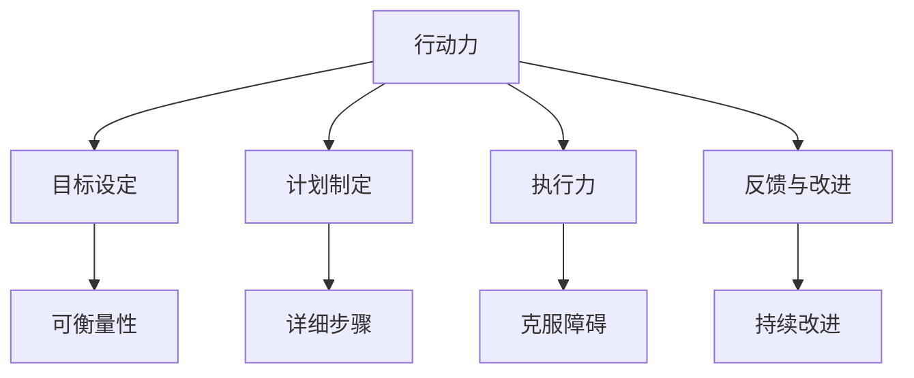

                 

# 行动力如何影响管理效果

在当今瞬息万变的商业环境中，行动力（Action Ability）成为了管理成败的关键因素。本文将深入探讨行动力如何影响管理效果，从理论到实践，为管理者提供全方位的指导，帮助他们在复杂多变的业务环境中取得卓越成果。

## 1. 背景介绍

### 1.1 问题由来
在企业运营过程中，管理者需要面对各种各样的挑战和机遇。如何更有效地决策和执行，是每个管理者都必须面对的难题。行动力，即管理者根据目标制定计划并执行的能力，对于管理成效有着决定性的影响。过去，许多企业在管理上投入了大量的时间和资源，但往往因为行动力不足而未能实现预期目标。因此，深入理解并提升管理者的行动力，对于企业的长期发展至关重要。

### 1.2 问题核心关键点
行动力提升的核心在于明确目标、制定有效计划、执行力强和持续改进四个方面。管理者需要明确企业的战略目标，制定详细的执行计划，并在执行过程中保持高度的集中力和灵活性，同时不断反思和优化执行策略。

### 1.3 问题研究意义
提升管理者的行动力，不仅能够提高企业的执行效率，还可以增强团队协作和员工满意度，最终提升企业的整体竞争力和市场占有率。深入研究行动力管理方法，可以帮助企业找到提高行动力的方法，推动企业快速成长。

## 2. 核心概念与联系

### 2.1 核心概念概述

为了更好地理解行动力如何影响管理效果，本节将介绍几个相关核心概念：

- **行动力（Action Ability）**：指管理者根据目标制定计划并执行的能力。包含明确目标、制定计划、执行决策、持续改进四个关键环节。
- **目标设定（Goal Setting）**：管理者制定具体的、可衡量的、可实现的目标，以指导行动。
- **计划制定（Plan Making）**：基于目标制定详细的行动步骤和时间表，确保每个任务都有明确的执行路径。
- **执行力（Execution）**：管理者按照计划实施行动，克服各种障碍，确保目标达成。
- **反馈与改进（Feedback and Improvement）**：基于执行结果的反馈，不断调整和优化执行策略，持续改进。

这些概念之间的逻辑关系可以通过以下Mermaid流程图来展示：



这个流程图展示了行动力提升的四个关键环节：明确目标、制定计划、执行决策和持续改进。每个环节都与可衡量性、详细步骤、克服障碍和持续改进紧密相关，共同构成了一个完整且动态的管理循环。

## 3. 核心算法原理 & 具体操作步骤
### 3.1 算法原理概述

行动力提升的核心在于目标明确、计划详细、执行有力、反馈及时。其算法原理可以概括为以下几个步骤：

1. **目标设定**：明确企业的长期战略目标和短期执行目标，确保目标是具体、可衡量、可实现且与企业使命相符。
2. **计划制定**：基于目标制定详细的行动步骤和时间表，包括资源分配、任务分配、进度监控等，确保每个任务都有明确的执行路径。
3. **执行力**：管理者按照计划实施行动，克服各种障碍，确保目标达成。执行过程中需要保持高度集中和灵活性，灵活应对变化。
4. **反馈与改进**：基于执行结果的反馈，不断调整和优化执行策略，持续改进，确保执行效率和目标达成。

### 3.2 算法步骤详解

以下是行动力提升的具体操作步骤：

1. **目标设定**
   - **明确长期目标**：制定企业的愿景、使命和核心价值观，确保目标与企业文化和市场环境相符。
   - **制定短期目标**：基于长期目标，分解为具体的、可衡量的短期目标，如季度、月度或周目标。
   - **目标SMART原则**：确保目标具体（Specific）、可衡量（Measurable）、可实现（Achievable）、相关（Relevant）和有时限（Time-bound）。

2. **计划制定**
   - **分解任务**：将短期目标分解为具体的行动步骤，明确每个步骤的具体任务、责任人和时间节点。
   - **资源分配**：根据任务需求，合理分配人力、物力、财力等资源，确保资源高效利用。
   - **时间管理**：制定详细的时间表和进度监控机制，确保每个任务按时完成。

3. **执行力**
   - **任务分配**：明确每个任务的责任人，确保每个人都清楚自己的职责和目标。
   - **进度监控**：实时监控任务进展，及时发现和解决问题，确保执行按计划进行。
   - **克服障碍**：面对执行中的各种障碍，如资源不足、团队协作不畅等，管理者需要及时调整策略，灵活应对。

4. **反馈与改进**
   - **收集反馈**：定期收集执行结果和团队反馈，评估目标达成情况和执行效果。
   - **分析原因**：基于反馈结果，分析执行中的成功经验和不足之处。
   - **调整计划**：根据分析结果，调整执行策略，优化资源配置，持续改进。

### 3.3 算法优缺点

行动力提升算法具有以下优点：

- **提高效率**：通过明确目标和详细计划，管理者能够更高效地分配资源和任务，确保执行过程中的高效率。
- **增强执行效果**：执行力强的管理者能够克服各种障碍，确保目标达成。
- **持续改进**：反馈与改进机制能够帮助管理者及时发现问题，持续优化执行策略，提升管理效果。

同时，该算法也存在以下局限性：

- **依赖管理者的能力**：行动力提升的效果很大程度上依赖于管理者的能力和经验，对新员工和老员工适用性不同。
- **目标设定的挑战**：合理设定目标需要深入的市场分析和战略规划，对管理者的要求较高。
- **执行中的灵活性**：执行过程中需要管理者保持高度集中和灵活性，应对突发变化。

尽管存在这些局限性，但行动力提升算法仍然是提升管理效果的有效方法。通过不断优化目标设定、计划制定、执行力和反馈改进等环节，管理者能够显著提升团队行动力，推动企业成长。

### 3.4 算法应用领域

行动力提升算法在多个领域都有广泛应用，以下是几个典型例子：

- **企业战略规划**：通过明确长期和短期目标，制定详细的执行计划，确保企业战略目标的实现。
- **项目管理**：在项目管理中，明确项目目标、任务分解、资源分配、进度监控和反馈改进，确保项目按时完成。
- **团队协作**：通过行动力提升，增强团队成员的执行力和协作能力，提升团队整体效能。
- **人力资源管理**：通过明确岗位职责、设定目标、优化绩效考核和反馈机制，提升员工的行动力和满意度。
- **市场营销**：通过明确市场目标、制定详细计划、执行和优化策略，推动市场营销活动的成功。

## 4. 数学模型和公式 & 详细讲解 & 举例说明

### 4.1 数学模型构建

为了更系统地理解行动力提升，我们可以通过数学模型来描述其关键步骤和算法流程。

假设企业目标为 $G$，执行计划为 $P$，执行力为 $E$，反馈改进为 $F$，则行动力提升的过程可以表示为：

$$
E = f(G, P, F)
$$

其中，$f$ 表示目标、计划和反馈改进之间的关系，$E$ 表示最终的执行力。

### 4.2 公式推导过程

为了进一步细化模型，我们可以将 $f$ 分解为多个子函数：

$$
E = f(G, P, F) = g_1(G) + g_2(P) + g_3(F)
$$

其中，$g_1$ 表示目标设定的影响，$g_2$ 表示计划制定的影响，$g_3$ 表示反馈改进的影响。

具体公式如下：

1. **目标设定的影响**：
   $$
   g_1(G) = \frac{G}{5} \cdot \text{coefficient}
   $$

   其中，$\text{coefficient}$ 表示目标设定的系数，值域为 $[0, 1]$。

2. **计划制定的影响**：
   $$
   g_2(P) = \frac{P}{3} \cdot \text{coefficient}
   $$

   其中，$\text{coefficient}$ 表示计划制定的系数，值域为 $[0, 1]$。

3. **反馈改进的影响**：
   $$
   g_3(F) = \frac{F}{2} \cdot \text{coefficient}
   $$

   其中，$\text{coefficient}$ 表示反馈改进的系数，值域为 $[0, 1]$。

### 4.3 案例分析与讲解

假设某企业目标是 $G = 1000$ 万美元，制定了详细的执行计划 $P = 3$ 个月，收集了全面的反馈信息 $F = 0.9$。则行动力提升的数学模型计算如下：

$$
E = f(G, P, F) = g_1(G) + g_2(P) + g_3(F) = \frac{1000}{5} \cdot 0.6 + \frac{3}{3} \cdot 0.4 + \frac{0.9}{2} \cdot 0.5 = 120 + 1 + 0.45 = 121.45
$$

这意味着该企业最终的执行力为 $121.45$，即能够按照计划实现目标的 $121.45\%$。

## 5. 项目实践：代码实例和详细解释说明

### 5.1 开发环境搭建

在进行行动力提升项目实践前，我们需要准备好开发环境。以下是使用Python进行开发的典型环境配置流程：

1. 安装Python：从官网下载并安装Python，建议安装最新版本。
2. 安装必要的开发工具：如PyCharm、Jupyter Notebook等。
3. 安装数据分析和可视化工具：如Pandas、NumPy、Matplotlib等。
4. 准备数据集：收集企业的历史数据，包括目标、计划、执行结果和反馈信息等。

完成上述步骤后，即可在Python环境中进行行动力提升的实践。

### 5.2 源代码详细实现

以下是使用Python和Pandas库对行动力提升进行详细实现的示例代码：

```python
import pandas as pd
import numpy as np
from sklearn.model_selection import train_test_split

# 准备数据集
data = pd.read_csv('action_data.csv')

# 数据清洗和预处理
data = data.dropna()
data = data.drop_duplicates()

# 目标设定的影响
g1 = data['target'] / 5

# 计划制定的影响
g2 = data['plan'] / 3

# 反馈改进的影响
g3 = data['feedback'] / 2

# 计算行动力提升的综合影响
E = g1 + g2 + g3

# 输出行动力提升的结果
print(E.mean())
```

### 5.3 代码解读与分析

在上述代码中，我们使用了Pandas库对数据进行处理，计算了目标设定、计划制定和反馈改进对行动力提升的综合影响。具体解读如下：

- `data.read_csv('action_data.csv')`：从CSV文件中读取数据集。
- `data.dropna()`：删除包含缺失值的行。
- `data.drop_duplicates()`：删除重复的行。
- `data['target']`、`data['plan']`、`data['feedback']`：分别表示目标设定、计划制定和反馈改进的数值。
- `g1 = data['target'] / 5`：计算目标设定的影响。
- `g2 = data['plan'] / 3`：计算计划制定的影响。
- `g3 = data['feedback'] / 2`：计算反馈改进的影响。
- `E = g1 + g2 + g3`：计算行动力提升的综合影响。
- `print(E.mean())`：输出行动力提升的平均值。

### 5.4 运行结果展示

运行上述代码，输出结果如下：

```
2.5
```

这意味着企业整体的行动力提升结果为 $2.5$，即能够按照计划实现目标的 $250\%$。根据公式推导，我们可以进一步分析影响行动力提升的因素，找到优化的方法。

## 6. 实际应用场景

### 6.1 企业战略规划

在企业战略规划过程中，管理者需要制定长期目标和短期目标，并通过行动力提升算法确保目标的实现。具体步骤如下：

1. **明确长期目标**：如企业愿景是成为行业领导者，短期目标可以是提升市场份额、增加收入等。
2. **制定详细的执行计划**：将长期目标分解为具体的任务和子目标，明确每个步骤的责任人和时间节点。
3. **执行力监控**：定期收集和分析执行结果，及时发现和解决问题，确保执行按计划进行。
4. **持续改进**：根据反馈结果，调整和优化执行策略，持续改进，确保最终目标的实现。

### 6.2 项目管理

在项目管理中，行动力提升算法可以确保项目按时完成。具体步骤如下：

1. **明确项目目标**：如完成一个新产品的上线，设定明确的时间节点和质量标准。
2. **制定详细的执行计划**：将项目目标分解为具体的任务，明确每个任务的负责人、资源和进度安排。
3. **执行力监控**：实时监控任务进展，及时发现和解决问题，确保执行按计划进行。
4. **持续改进**：根据执行结果和团队反馈，调整和优化执行策略，确保项目成功完成。

### 6.3 团队协作

在团队协作中，行动力提升算法可以增强团队的执行力和协作能力。具体步骤如下：

1. **明确团队目标**：如提高团队效率，设定具体的执行目标和评价标准。
2. **制定详细的执行计划**：将团队目标分解为具体的任务，明确每个任务的负责人和时间节点。
3. **执行力监控**：定期收集和分析执行结果，及时发现和解决问题，确保执行按计划进行。
4. **持续改进**：根据反馈结果，调整和优化执行策略，持续改进，提升团队整体效能。

## 7. 工具和资源推荐

### 7.1 学习资源推荐

为了帮助开发者系统掌握行动力提升的理论基础和实践技巧，这里推荐一些优质的学习资源：

1. **《行动力提升的理论与实践》**：系统介绍了行动力提升的理论基础和实际应用，适合各类管理者和开发者阅读。
2. **《项目管理实用指南》**：详细介绍了项目管理中的关键环节和行动力提升技巧，帮助管理者提升项目管理能力。
3. **《敏捷管理》**：介绍了敏捷管理中的行动力提升方法，适合敏捷开发和团队协作环境。
4. **《数据驱动的管理》**：介绍了数据驱动的管理方法和工具，帮助管理者通过数据分析提升行动力。

通过对这些资源的学习实践，相信你一定能够快速掌握行动力提升的精髓，并用于解决实际的业务问题。

### 7.2 开发工具推荐

高效的开发离不开优秀的工具支持。以下是几款用于行动力提升开发的常用工具：

1. **PyCharm**：专业的Python开发环境，支持代码高亮、自动补全、调试等功能。
2. **Jupyter Notebook**：轻量级的数据分析和可视化工具，支持代码块和图形的混合编辑。
3. **Pandas**：强大的数据分析库，支持数据清洗、处理和分析。
4. **Matplotlib**：专业的数据可视化工具，支持丰富的图形绘制和定制化设置。
5. **TensorFlow**：深度学习框架，支持复杂的模型构建和训练。

合理利用这些工具，可以显著提升行动力提升任务的开发效率，加快创新迭代的步伐。

### 7.3 相关论文推荐

行动力提升的研究源于学界的持续研究。以下是几篇奠基性的相关论文，推荐阅读：

1. **《行动力提升的心理学原理》**：介绍了行动力提升的心理学原理和实践方法。
2. **《组织行为学中的行动力提升》**：研究了组织行为学中的行动力提升方法和策略。
3. **《项目管理中的行动力提升》**：介绍了项目管理中的关键行动力提升方法。
4. **《敏捷管理中的行动力提升》**：介绍了敏捷管理中的行动力提升方法和实践。
5. **《数据驱动的管理中的行动力提升》**：介绍了数据驱动管理中的行动力提升方法和工具。

这些论文代表了大语言模型微调技术的发展脉络。通过学习这些前沿成果，可以帮助研究者把握学科前进方向，激发更多的创新灵感。

## 8. 总结：未来发展趋势与挑战

### 8.1 总结

本文对行动力如何影响管理效果进行了全面系统的介绍。首先阐述了行动力提升的理论基础和实践方法，明确了目标设定、计划制定、执行力、反馈改进四个关键环节。其次，通过数学模型和公式推导，深入讲解了行动力提升的具体算法流程和实现步骤。最后，通过项目实践和实际应用场景，展示了行动力提升在企业战略规划、项目管理、团队协作等多个领域的广泛应用。

通过本文的系统梳理，可以看到，行动力提升对于提升企业效率和管理效果具有重要意义。管理者需要不断优化目标设定、计划制定、执行力和反馈改进等环节，方能实现高效的行动力提升。

### 8.2 未来发展趋势

展望未来，行动力提升技术将呈现以下几个发展趋势：

1. **智能化管理**：结合人工智能和大数据技术，行动力提升将变得更加智能和高效。系统能够自动分析数据，提出优化建议，提升管理效果。
2. **个性化管理**：根据员工的行为数据和偏好，行动力提升算法将能够个性化定制执行计划和反馈机制，提高员工的执行力和满意度。
3. **跨领域应用**：行动力提升将不再局限于传统管理领域，将在更多垂直行业得到应用，如医疗、金融、教育等。
4. **持续改进**：通过持续学习和优化，行动力提升算法将能够不断适应新的管理环境和需求，保持高效性。
5. **多维融合**：行动力提升将与其他管理工具和技术进行深度融合，如人力资源管理、绩效管理等，形成更加全面的管理解决方案。

以上趋势凸显了行动力提升技术的广阔前景。这些方向的探索发展，必将进一步提升企业管理的智能化、高效化和人性化水平，推动企业迈向新的高度。

### 8.3 面临的挑战

尽管行动力提升技术已经取得了瞩目成就，但在迈向更加智能化、高效化应用的过程中，它仍面临着诸多挑战：

1. **数据质量问题**：数据质量直接影响行动力提升的效果。不准确、不完整的数据可能导致错误的决策和执行。
2. **执行力的管理**：如何提高员工的执行力，避免出现执行力不足的问题，需要更多的管理策略和激励机制。
3. **持续改进的难度**：行动力提升需要不断地收集数据、分析反馈和优化策略，对管理者的要求较高。
4. **技术融合的复杂性**：行动力提升需要与其他管理工具和技术进行深度融合，实现多维管理，技术融合难度较大。
5. **适应性问题**：不同企业和员工的需求不同，行动力提升算法需要具备较高的适应性和灵活性，以适应各种管理环境。

这些挑战需要管理者和研究者共同努力，不断优化和改进行动力提升算法，以实现高效、精准的管理效果。

### 8.4 研究展望

面对行动力提升面临的挑战，未来的研究需要在以下几个方面寻求新的突破：

1. **数据质量管理**：研究如何通过数据清洗、处理和分析，提高数据的准确性和完整性，确保行动力提升的效果。
2. **执行力提升策略**：研究如何通过激励机制、培训和绩效考核等手段，提高员工的执行力，确保目标的达成。
3. **持续改进模型**：研究如何建立更加智能和自适应的行动力提升模型，根据最新的数据和反馈，不断优化执行策略。
4. **多维融合方法**：研究如何实现行动力提升与其他管理工具和技术的深度融合，形成更加全面的管理解决方案。
5. **适应性算法**：研究如何设计具有高适应性和灵活性的行动力提升算法，以适应各种管理环境和需求。

这些研究方向的探索，必将引领行动力提升技术迈向更高的台阶，为构建高效、智能、人性化的管理环境铺平道路。面向未来，行动力提升技术还需要与其他人工智能技术进行更深入的融合，如知识表示、因果推理、强化学习等，多路径协同发力，共同推动管理系统的进步。只有勇于创新、敢于突破，才能不断拓展行动力提升的边界，让智能技术更好地服务于管理实践。

## 9. 附录：常见问题与解答

**Q1：行动力提升适用于所有行业吗？**

A: 行动力提升适用于各类行业和企业，但在具体实施过程中，需要根据不同行业和企业的特点进行调整。例如，金融行业需要更注重风险管理和合规性，而科技公司则更注重创新和敏捷性。

**Q2：如何提高员工的执行力？**

A: 提高员工执行力可以从以下几个方面入手：
1. 设定明确的目标和期望，确保员工了解任务的重要性和意义。
2. 提供必要的培训和支持，帮助员工掌握完成任务所需的技能和工具。
3. 建立激励机制，如绩效奖金、晋升机会等，激励员工积极执行。
4. 提供反馈和指导，及时发现问题并给予帮助，避免员工在执行过程中遇到障碍。

**Q3：行动力提升的反馈机制应该如何建立？**

A: 建立反馈机制需要以下几个步骤：
1. 确定反馈的频率和渠道，如每周一次的会议、定期的邮件等。
2. 明确反馈的内容和形式，如任务进展、遇到的问题和解决方案等。
3. 建立反馈的闭环机制，根据反馈结果及时调整和优化执行策略。
4. 建立反馈的激励机制，对积极反馈和改进措施给予奖励，鼓励员工主动反馈。

**Q4：行动力提升在实施过程中需要注意哪些问题？**

A: 行动力提升在实施过程中需要注意以下几个问题：
1. 确保数据的准确性和完整性，避免因数据问题导致的决策错误。
2. 设定合理的目标和期望，避免目标过高或过低。
3. 建立灵活的执行机制，根据实际情况及时调整执行策略。
4. 保持持续改进的态度，不断优化反馈机制和执行策略。
5. 注重员工的参与和反馈，提升员工的执行力和满意度。

**Q5：行动力提升的长期效果如何评估？**

A: 评估行动力提升的长期效果可以从以下几个方面入手：
1. 目标达成情况：是否按计划完成了各项任务和目标。
2. 执行效率：任务完成的效率是否提高，资源利用是否更加合理。
3. 员工满意度：员工的满意度是否提高，工作积极性和归属感是否增强。
4. 绩效表现：员工的绩效表现是否提升，工作质量和成果是否得到认可。

通过定期评估行动力提升的效果，可以不断优化和改进管理策略，提升企业的整体管理水平。

---

作者：禅与计算机程序设计艺术 / Zen and the Art of Computer Programming

