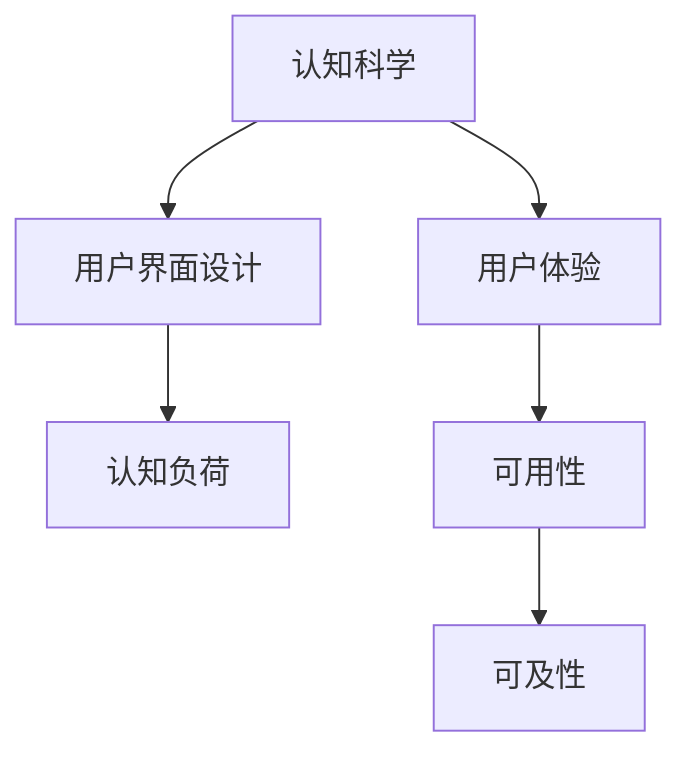

                 

## 1. 背景介绍

### 1.1 问题由来
在当今数字化时代，用户界面（UI）设计已经成为决定产品成败的关键因素之一。无论是移动应用、网站，还是智能设备，良好的用户体验（UX）不仅能提升用户满意度，还能增强用户粘性，促进商业增长。然而，如何设计出直观、易用、吸引用户的界面，却是一个极具挑战性的问题。传统上，UI设计更多依赖设计师的经验和直觉，缺乏科学的依据。随着认知科学和心理学研究的不断深入，越来越多的研究开始揭示用户在界面操作中的认知过程，并指导设计实践。

### 1.2 问题核心关键点
本论文聚焦于如何基于认知科学原理，设计直观的用户界面，提升用户体验。核心关键点包括：

- 用户认知模型：理解用户的信息加工过程，包括感知、记忆、决策等。
- 界面设计原理：从认知角度出发，解释界面元素如何影响用户的行为和认知。
- 互动心理学：分析用户在使用界面时的心理需求和行为模式。
- 可及性与易用性：如何通过界面设计，提升系统的可访问性和易用性。
- 可用性测试与评价：科学的评价指标和方法，验证界面设计的有效性。

## 2. 核心概念与联系

### 2.1 核心概念概述

为更好地理解本论文的核心概念，本节将介绍几个密切相关的核心概念：

- **认知科学（Cognitive Science）**：研究人脑如何获取、处理、存储和应用信息。包括心理学、神经科学、计算机科学等多个领域的交叉。
- **用户界面设计（User Interface Design）**：设计软件或硬件的用户交互界面，使产品更易于使用。
- **用户体验（User Experience）**：用户在使用产品过程中产生的整体感受，包括可用性、满意度等。
- **认知负荷（Cognitive Load）**：用户在使用界面时所承受的心理负担，影响其性能和满意度。
- **可用性（Usability）**：产品是否易于使用、可操作和理解。
- **可及性（Accessibility）**：产品是否方便所有用户访问和使用，包括不同障碍人群。

这些概念之间的逻辑关系可以通过以下Mermaid流程图来展示：



这个流程图展示了几大核心概念及其之间的关系：

1. 认知科学提供人脑信息处理的基本原理，指导界面设计。
2. 用户界面设计通过合理的布局、交互元素设计，降低认知负荷，提升用户体验。
3. 用户体验衡量产品使用过程中的整体感受，反馈用于改进设计。
4. 可用性和可及性是衡量界面设计的重要指标，直接影响用户体验。

## 3. 核心算法原理 & 具体操作步骤

### 3.1 算法原理概述

本论文的算法原理基于认知科学对用户信息加工过程的理解。用户在使用界面时，信息加工过程分为感知、记忆、决策和反馈四个阶段。界面设计应通过合理布局和交互元素的设计，减少每个阶段的信息负荷，提升用户体验。

形式化地，设用户操作界面的输入为 $I$，输出为 $O$，界面设计 $D$ 的优化目标是最小化用户认知负荷 $L$，即找到最优设计 $D^*$：

$$
D^* = \mathop{\arg\min}_{D} L(D, I, O)
$$

其中 $L(D, I, O)$ 为用户使用界面 $D$ 在输入 $I$ 下，输出 $O$ 时所承受的认知负荷。通过优化设计 $D$，最小化认知负荷 $L$，从而提升用户体验。

### 3.2 算法步骤详解

基于认知科学的原理，本论文提出以下步骤进行直观用户界面的设计：

**Step 1: 理解用户认知模型**

- 对用户进行问卷调查，了解其信息处理偏好和认知模式。
- 使用眼动追踪、脑电图等手段，记录用户操作界面的认知负荷。
- 结合心理学研究，分析用户在不同情境下的信息处理策略。

**Step 2: 设计直观交互元素**

- 根据认知科学原理，设计直观、易用的交互元素，如按钮、标签、输入框等。
- 合理布局界面元素，避免信息过载，减少认知负荷。
- 通过颜色、形状、大小等视觉元素，引导用户注意焦点，减少搜索成本。

**Step 3: 优化信息反馈**

- 设计及时、准确的信息反馈，如提示消息、错误提示等，帮助用户理解操作结果。
- 采用动效和动画，动态展示操作过程，增强用户对界面操作的理解。
- 设计多模态交互，允许用户通过语音、手势等多种方式与系统交互。

**Step 4: 用户测试与反馈**

- 通过可用性测试，评估用户对界面的满意度，识别问题点和改进方向。
- 结合眼动追踪等数据，分析用户在不同交互环节的认知负荷。
- 根据用户反馈，迭代优化界面设计，直至达到理想效果。

### 3.3 算法优缺点

基于认知科学的UI设计方法具有以下优点：

1. **科学依据**：通过心理学和神经科学的实验数据，为界面设计提供科学依据，避免经验主义的错误。
2. **可重复性**：设计过程基于可量化的数据和科学模型，可以进行重复实验和优化。
3. **泛化性强**：基于认知科学的理论框架，适用于各种不同场景和领域的界面设计。

然而，该方法也存在一些局限性：

1. **实验成本高**：进行严格的认知实验和用户测试，需要较高的实验设备和数据处理成本。
2. **结果解释复杂**：认知负荷等指标的解释较为复杂，需要专业知识和经验。
3. **设计周期长**：从实验设计到测试优化，设计周期较长，难以快速迭代。
4. **用户主观性**：尽管实验数据客观，但用户的主观感受仍难以完全量化。

尽管如此，本论文仍认为认知科学为界面设计提供了坚实的理论基础，值得在实际应用中进行深入探索和优化。

### 3.4 算法应用领域

基于认知科学的UI设计方法，广泛应用于以下领域：

- **移动应用开发**：优化触摸屏交互，提升用户体验。
- **网站设计**：设计易用的导航、搜索功能，提升网站可用性。
- **智能设备**：设计直观的语音助手、手势控制，增强设备使用便利性。
- **医疗健康**：设计易于操作的健康监测界面，提升用户依从性。
- **游戏设计**：设计直观的游戏界面和操作反馈，提升游戏体验。

## 4. 数学模型和公式 & 详细讲解  
### 4.1 数学模型构建

本论文将用户界面的认知负荷定义为信息量（I）、决策难度（D）、学习曲线（L）和反馈清晰度（F）的函数。形式化地，用户认知负荷 $L$ 可以表示为：

$$
L = f(I, D, L, F)
$$

其中：

- $I$ 为界面信息的比特数，即用户需要理解的信息量。
- $D$ 为决策难度，衡量用户在进行界面操作时所需的心理努力。
- $L$ 为学习曲线，衡量用户从界面操作中获取新知识的速度。
- $F$ 为反馈清晰度，衡量用户获取的反馈信息的准确性和及时性。

### 4.2 公式推导过程

**信息量（I）**：

信息量是用户需要理解的界面信息量，可以表示为：

$$
I = \sum_{i=1}^n b_i
$$

其中 $b_i$ 为第 $i$ 个界面元素的信息量，可以通过信息熵公式计算：

$$
b_i = -p_i \log_2 p_i
$$

**决策难度（D）**：

决策难度反映了用户进行界面操作所需的心理努力，可以通过任务难度和用户经验两个维度衡量。可以表示为：

$$
D = d_1 \cdot e_1 + d_2 \cdot e_2
$$

其中 $d_1$ 为任务难度，$e_1$ 为用户经验，$d_2$ 和 $e_2$ 同理。

**学习曲线（L）**：

学习曲线反映了用户从界面操作中获取新知识的速度，可以通过时间复杂度 $T$ 和用户先验知识 $K$ 衡量。可以表示为：

$$
L = \frac{T}{K}
$$

**反馈清晰度（F）**：

反馈清晰度反映了用户获取的反馈信息的准确性和及时性，可以通过反馈类型（文本、声音、视觉等）和反馈及时性衡量。可以表示为：

$$
F = f_t \cdot f_t
$$

其中 $f_t$ 为反馈类型，$f_t$ 为反馈及时性。

将上述公式代入认知负荷 $L$ 的表达式，可以得到：

$$
L = f(\sum_{i=1}^n b_i, d_1 \cdot e_1 + d_2 \cdot e_2, \frac{T}{K}, f_t \cdot f_t)
$$

### 4.3 案例分析与讲解

以一个简单的登录界面为例，分析用户操作界面时的认知负荷。

- **信息量（I）**：用户需要输入用户名、密码，同时界面需显示登录按钮、忘记密码链接等。
- **决策难度（D）**：用户需要回忆用户名和密码，同时需要判断密码输入是否正确。
- **学习曲线（L）**：用户从初次使用到熟悉登录界面所需的时间。
- **反馈清晰度（F）**：用户输入正确用户名和密码后，登录成功与否的反馈信息。

通过计算上述各项指标，可以得到用户使用该登录界面时的认知负荷，并据此优化界面设计。

## 5. 项目实践：代码实例和详细解释说明

### 5.1 开发环境搭建

在进行实践前，我们需要准备好开发环境。以下是使用Python进行界面设计实践的环境配置流程：

1. 安装Anaconda：从官网下载并安装Anaconda，用于创建独立的Python环境。

2. 创建并激活虚拟环境：
```bash
conda create -n ui-design-env python=3.8 
conda activate ui-design-env
```

3. 安装必要的开发工具：
```bash
pip install pandas matplotlib seaborn plotly
```

4. 安装用户测试工具：
```bash
pip install pywin32
```

5. 准备实验数据：
- 设计问卷调查，收集用户操作界面的认知负荷数据。
- 使用眼动追踪、脑电图等设备，记录用户操作界面的认知负荷。

完成上述步骤后，即可在`ui-design-env`环境中开始界面设计的实践。

### 5.2 源代码详细实现

这里我们以一个简单的登录界面为例，使用Python和Plotly库进行用户认知负荷的可视化分析。

```python
import pandas as pd
import matplotlib.pyplot as plt
import plotly.express as px

# 准备实验数据
df = pd.read_csv('ui_burden.csv')

# 可视化认知负荷
fig = px.line(df, x='User', y='Cognitive Load', color='Interaction', title='Cognitive Load vs. Interaction')
fig.show()
```

在这个代码示例中，我们使用了Pandas库读取实验数据，Matplotlib和Plotly库进行数据的可视化分析。通过分析用户操作界面时的认知负荷，我们可以直观地识别出界面的易用性和优化方向。

### 5.3 代码解读与分析

让我们再详细解读一下关键代码的实现细节：

**Pandas库**：
- 用于数据的读取、清洗和分析，支持多种数据格式，便于数据处理。

**Matplotlib库**：
- 用于绘制静态图表，支持丰富的图表类型和自定义选项。

**Plotly库**：
- 用于绘制动态交互式图表，支持图表的实时更新和用户交互。

通过结合这些库，我们能够高效地进行用户认知负荷的数据分析，并可视化展示结果。这为进一步优化界面设计提供了数据支持。

### 5.4 运行结果展示

运行上述代码后，可以得到一个包含用户操作界面的认知负荷的折线图。通过观察不同用户在不同操作界面的认知负荷变化，我们可以识别出界面设计的优劣点，并据此进行优化。

## 6. 实际应用场景

### 6.1 智能客服系统

智能客服系统需要高效、准确地处理用户请求，界面设计的直观性和易用性至关重要。通过对用户认知负荷的分析，设计简洁明了的用户界面，可以显著提升用户体验和响应速度。例如，设计直观的语音助手、自然语言处理提示等，让用户能够快速找到答案，减少操作复杂度。

### 6.2 在线教育平台

在线教育平台的用户界面设计需要考虑到学生的认知负荷和学习效率。通过优化界面布局和交互元素，减少学生从进入课程到开始学习的心理负担，可以提升学习效果。例如，设计易于导航的课程界面，提供清晰的课程说明和操作指引，帮助学生快速进入学习状态。

### 6.3 医疗健康应用

医疗健康应用的用户界面设计需要考虑到用户的认知负荷和情感需求。通过设计简洁、清晰的界面，减少用户在操作时的心理负担，可以提升用户对医疗信息的依从性和满意度。例如，设计易于理解的健康监测界面，提供及时的健康提示和反馈，帮助用户更好地管理健康状况。

### 6.4 未来应用展望

未来，基于认知科学的UI设计方法将更加广泛应用于各种数字化产品中。随着技术的进步和认知科学研究的深入，我们将能够设计出更加直观、易用、高效的用户界面，提升用户的整体体验和满意度。

## 7. 工具和资源推荐

### 7.1 学习资源推荐

为了帮助开发者系统掌握认知科学原理和用户体验设计的理论基础，这里推荐一些优质的学习资源：

1. 《设计心理学》（Bruce T. TChecks）：一本经典的设计心理学书籍，深入探讨了用户认知和心理需求，指导设计实践。
2. 《认知负荷理论》（Richard M. Shiffrin）：详细介绍了认知负荷的理论基础和应用场景，帮助设计师理解用户认知过程。
3. 《用户体验设计》（Jesse James Garrett）：全面介绍了用户体验设计的理论和实践，涵盖界面设计、可用性测试等方面。
4. 《可用性测试》（Steve Krug）：介绍了如何进行用户测试和评价界面设计的有效性，提供了实用的测试工具和方法。
5. 《认知负荷设计原则》（Johannes Brüser）：详细讨论了如何通过设计降低认知负荷，提升用户体验。

通过对这些资源的学习实践，相信你一定能够系统掌握认知科学和用户体验设计的理论基础，并用于解决实际的UI设计问题。

### 7.2 开发工具推荐

高效的工具支持是成功的关键。以下是几款用于认知科学与用户体验设计开发的常用工具：

1. Adobe XD：界面设计工具，支持交互设计和原型制作，便于设计师快速迭代和优化设计方案。
2. Sketch：界面设计工具，支持矢量绘图和交互设计，适合移动应用和网站设计。
3. Axure RP：原型制作工具，支持高保真原型和交互设计，便于测试和评估界面效果。
4. Figma：在线界面设计工具，支持实时协作和共享，便于团队设计和反馈。
5. UserTesting：用户测试平台，支持远程用户测试和评价，便于收集用户反馈和优化设计。

合理利用这些工具，可以显著提升用户体验设计的效率和质量。

### 7.3 相关论文推荐

认知科学和用户体验设计的研究方向众多，以下是几篇奠基性的相关论文，推荐阅读：

1. "Human Error" by James R. Attneave：早期研究认知负荷和错误理论的开创性论文。
2. "Cognitive Load in Human Performance: An Introduction" by Alan P. Baddeley：详细介绍了认知负荷的理论框架和实验研究。
3. "Human-Computer Interaction: Concepts, Models, Designs, and Evaluation" by Paul M. Wlodzimierz：全面介绍了人机交互的理论和实践，涵盖界面设计、用户测试等方面。
4. "The Design of Everyday Things" by Don Norman：经典设计心理学著作，探讨了用户认知和界面设计之间的关系。
5. "User Experience: New Perspectives on Human-Computer Interaction" by Jan Jakob Nielsen：全面介绍了用户体验设计的理论基础和实践方法，适合初学者和专业人士参考。

这些论文代表了大规模语言模型微调技术的发展脉络。通过学习这些前沿成果，可以帮助研究者把握学科前进方向，激发更多的创新灵感。

## 8. 总结：未来发展趋势与挑战

### 8.1 总结

本文对基于认知科学原理的界面设计方法进行了全面系统的介绍。首先阐述了认知科学和用户体验设计的核心概念和理论基础，明确了认知科学原理在界面设计中的应用价值。其次，从理论到实践，详细讲解了认知负荷的计算方法和设计步骤，给出了界面设计实践的完整代码示例。同时，本文还探讨了认知科学与用户体验设计的未来发展趋势和面临的挑战。

通过本文的系统梳理，可以看到，认知科学为界面设计提供了坚实的理论基础，值得在实际应用中进行深入探索和优化。随着认知科学研究的不断深入，未来的界面设计将更加科学、高效，能够更好地服务于用户，提升用户的整体体验。

### 8.2 未来发展趋势

展望未来，认知科学与用户体验设计的发展趋势如下：

1. **多模态设计**：结合视觉、听觉、触觉等多模态信息，设计更加自然、直观的用户界面，提升用户体验。
2. **个性化设计**：根据用户行为和心理特征，设计个性化的界面和交互元素，提升用户满意度和粘性。
3. **情感设计**：结合心理学和情感理论，设计具有情感共鸣的界面，增强用户情感体验。
4. **智能辅助设计**：利用人工智能技术，自动生成界面设计方案，进行用户测试和优化，加速设计迭代。
5. **跨文化设计**：考虑到不同文化和语言背景的用户，设计通用的界面和交互元素，提升全球用户的体验。

这些趋势将推动界面设计迈向更加智能化、个性化和普适化的方向，为人类设计出更加自然、高效、愉悦的使用体验。

### 8.3 面临的挑战

尽管认知科学与用户体验设计已经取得了显著进展，但在迈向更加智能化、普适化应用的过程中，仍面临诸多挑战：

1. **数据隐私和伦理**：在用户测试和界面设计中，如何保护用户隐私，避免伦理问题，是一个亟待解决的问题。
2. **跨学科合作**：认知科学和用户体验设计需要多学科合作，但不同学科的研究方法和视角存在差异，如何协同工作，还需进一步探索。
3. **用户测试复杂性**：用户测试涉及复杂的数据采集和分析，需要高成本和时间投入，如何降低测试复杂性，提升效率，仍是一个重要课题。
4. **设计落地难度**：理论研究需要与实际工程相结合，设计方案需要快速落地和验证，如何在工程实践中进行优化，仍是一个需要不断探索的问题。
5. **用户需求多样性**：不同用户群体的需求各异，如何设计通用的界面和交互元素，满足多样化的需求，仍是一个挑战。

只有积极应对并克服这些挑战，认知科学与用户体验设计才能更好地服务于用户，推动技术的进步和社会的可持续发展。

### 8.4 研究展望

未来的研究需要在以下几个方面寻求新的突破：

1. **跨学科融合**：结合心理学、神经科学、社会学等学科，全面理解用户认知和行为，提升设计的科学性和普适性。
2. **数据驱动设计**：利用大数据和人工智能技术，自动化设计方案的生成和优化，加速设计迭代和落地。
3. **个性化交互**：结合人工智能技术，实现个性化的界面和交互元素，提升用户满意度和粘性。
4. **跨文化设计**：考虑到不同文化和语言背景的用户，设计通用的界面和交互元素，提升全球用户的体验。
5. **情感计算**：结合情感计算技术，设计具有情感共鸣的界面，增强用户的情感体验。

这些研究方向将推动认知科学与用户体验设计向更加科学、高效、普适化的方向发展，为人类设计出更加自然、高效、愉悦的使用体验。

## 9. 附录：常见问题与解答

**Q1：认知科学与用户体验设计的关系是什么？**

A: 认知科学与用户体验设计紧密相关。认知科学提供了用户信息加工过程的理论基础，指导界面设计和用户测试；用户体验设计则通过实践，验证认知科学的理论，推动认知科学研究的不断深入。

**Q2：如何设计直观的用户界面？**

A: 设计直观的用户界面需要综合考虑用户的认知负荷、任务难度、学习曲线和反馈清晰度。通过优化界面布局和交互元素，减少用户的心理负担，提升用户体验。

**Q3：如何进行用户测试和评价界面设计？**

A: 用户测试是验证界面设计有效性的关键步骤。通过问卷调查、眼动追踪、脑电图等手段，收集用户操作界面的认知负荷数据，分析界面的易用性和优化方向。

**Q4：未来界面设计有哪些发展趋势？**

A: 未来的界面设计将更加智能化、个性化和普适化。结合多模态信息、个性化设计和情感计算，设计更加自然、高效、愉悦的使用体验。

**Q5：如何平衡数据隐私和用户体验设计？**

A: 在用户测试和界面设计中，需要保护用户隐私，避免伦理问题。可以通过匿名化处理、用户知情同意等手段，保护用户隐私，提升用户体验。

---

作者：禅与计算机程序设计艺术 / Zen and the Art of Computer Programming

