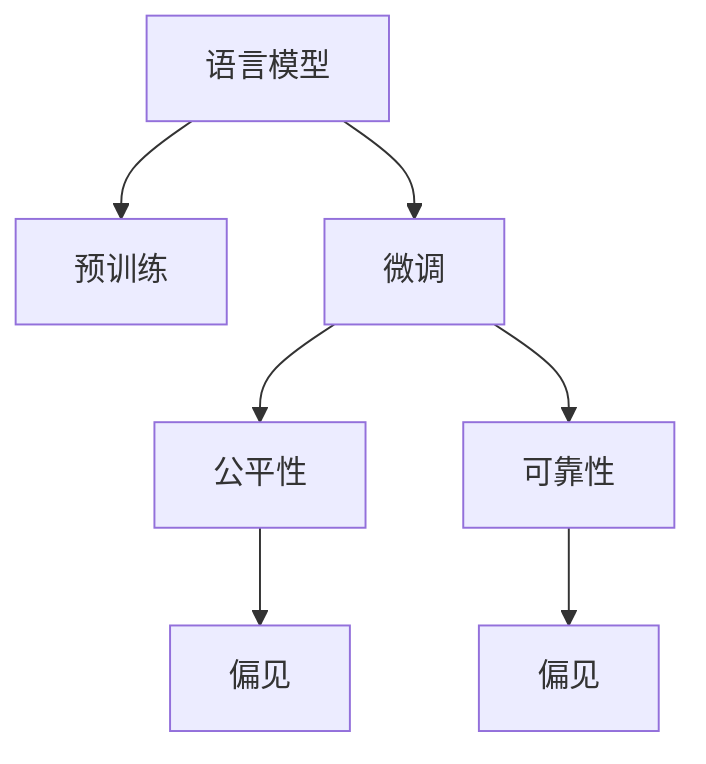

                 

# 语言模型的偏见问题：识别与缓解策略

在人工智能飞速发展的今天，语言模型已经成为处理自然语言的关键工具，广泛应用于各种NLP任务中。然而，这些模型并非完美无瑕，也存在诸多偏见和错误。本文将深入探讨语言模型的偏见问题，并提出一系列识别与缓解策略，以期构建更公正、更可靠的NLP系统。

## 1. 背景介绍

### 1.1 问题由来
语言模型是指能够根据输入的序列（通常是自然语言文本）预测后续序列的概率模型。在大规模预训练和微调过程中，模型会学习到数据中隐含的各种偏见，如性别偏见、种族偏见、职业偏见等。这些偏见可能会在模型输出中产生不公平的决策，给实际应用带来负面影响。

### 1.2 问题核心关键点
识别和缓解语言模型中的偏见问题，成为当前NLP研究的热点话题。这不仅关系到模型本身的公正性和可靠性，也直接影响到应用场景的公平性和安全性。常见的偏见类型包括性别偏见、种族偏见、职业偏见等，这些偏见在模型的预测结果中可能会对特定群体造成歧视或不公平的待遇。

### 1.3 问题研究意义
识别和缓解语言模型中的偏见问题，对于构建公平、公正、透明的NLP系统具有重要意义：

1. **提升模型公平性**：通过识别和纠正模型的偏见，可以确保模型在各类人群中都能提供公正的输出。
2. **增强系统安全性**：减少因偏见导致的歧视性决策，降低潜在的法律和伦理风险。
3. **增强用户信任**：公正无偏见的模型能更好地满足用户需求，增强用户对系统的信任度。
4. **促进社会进步**：语言模型在社会管理、教育、医疗等领域的应用，需要遵守公平、公正的原则，缓解偏见有助于构建和谐社会。

## 2. 核心概念与联系

### 2.1 核心概念概述

语言模型的偏见问题涉及以下关键概念：

- **语言模型**：使用神经网络等方法训练得到的模型，能够处理和生成自然语言文本。
- **预训练**：在大量无标签数据上预训练模型，学习语言的通用表示。
- **微调**：在预训练模型的基础上，使用下游任务的标注数据进行微调，优化模型性能。
- **偏见**：模型在训练数据中学习到的隐性歧视或不公平倾向，可能在输出中体现。
- **公平性**：模型输出结果不受特定性别、种族、职业等因素的影响，对所有群体公正对待。
- **可靠性**：模型输出结果稳定、准确，不受训练数据中偏见的影响。

这些概念之间的逻辑关系可以通过以下Mermaid流程图来展示：



这个流程图展示了大语言模型的核心概念及其之间的关系：

1. 语言模型通过预训练获得基础能力。
2. 微调是对预训练模型进行任务特定的优化，以提升模型性能。
3. 预训练和微调过程中，语言模型可能学习到偏见。
4. 公平性和可靠性是模型输出的关键评价指标，受偏见影响。

## 3. 核心算法原理 & 具体操作步骤

### 3.1 算法原理概述

识别和缓解语言模型中的偏见问题，本质上是一个基于公平性指标的优化问题。其核心思想是：通过设计公平性指标，评估模型在各种群体的表现，并优化模型参数以提升模型的公平性和可靠性。

具体而言，假设预训练语言模型为 $M_{\theta}$，其中 $\theta$ 为预训练得到的模型参数。对于某个特定的群体 $G$，定义公平性指标 $\mathcal{F}_G$，衡量模型在 $G$ 群体上的公平性。公平性指标通常是一个综合了多个评估指标的函数，如F1分数、准确率、召回率等。

微调的目标是最小化所有群体上的不公平性指标，即：

$$
\theta^* = \mathop{\arg\min}_{\theta} \sum_{G} \mathcal{F}_G(M_{\theta})
$$

其中 $G$ 代表所有需要评估的群体。通过优化上述目标函数，可以找到使得模型对所有群体表现均等且最优的参数 $\theta^*$。

### 3.2 算法步骤详解

识别和缓解语言模型中的偏见问题，可以遵循以下步骤：

**Step 1: 收集数据和定义公平性指标**

- 收集目标群体（如男性、女性、少数族裔等）的数据集，并定义相应的公平性指标。
- 可以采用统计分析、A/B测试等方法，对模型在各个群体上的表现进行评估。

**Step 2: 选择优化方法**

- 选择合适的优化算法（如梯度下降、AdamW等），以及相应的超参数（如学习率、批大小等）。
- 设计公平性约束，如L2正则、Dropout等，防止模型过度拟合。

**Step 3: 训练和微调模型**

- 使用上述数据集和公平性指标，对模型进行微调。
- 迭代优化模型参数，最小化所有群体上的不公平性指标。

**Step 4: 评估和测试**

- 在测试集上评估微调后的模型，确保其对所有群体的公平性。
- 使用交叉验证等方法，确保模型在不同分布上的表现一致。

**Step 5: 部署和监控**

- 将微调后的模型部署到实际应用中，实时监测模型表现。
- 定期重新收集数据，微调模型以适应数据分布的变化。

### 3.3 算法优缺点

识别和缓解语言模型中的偏见问题，具有以下优点：

1. **提升模型公平性**：通过设计公平性指标，可以显著提升模型在不同群体上的表现，减少偏见带来的不公平。
2. **增强系统可靠性**：公平性优化可以防止模型因偏见导致的决策偏差，提高系统可靠性。
3. **促进社会正义**：有助于构建更加公正、公平的社会，减少歧视现象。

同时，该方法也存在一定的局限性：

1. **数据依赖**：依赖于目标群体的数据，如果数据量不足或分布不均衡，可能导致评估和优化的效果不佳。
2. **模型复杂性**：公平性优化增加了模型训练的复杂度，可能影响模型的泛化性能。
3. **计算成本**：需要大量的计算资源进行公平性评估和模型优化，可能增加开发成本。

尽管存在这些局限性，但就目前而言，公平性优化是解决语言模型偏见问题的重要手段之一。未来相关研究的重点在于如何进一步降低数据依赖，提高模型效率，同时兼顾公平性和泛化性能。

### 3.4 算法应用领域

公平性优化在大语言模型的多个应用领域都具有广泛的应用前景，例如：

- 招聘筛选：使用语言模型筛选简历，确保不同性别、种族、年龄等群体的公平待遇。
- 医疗诊断：利用语言模型进行疾病诊断，确保对各类患者的公正评估。
- 金融风控：在贷款审批、信用卡申请等场景中，使用语言模型评估信用风险，避免对特定群体的歧视。
- 教育推荐：利用语言模型推荐学习资源，确保对不同背景学生的公平性。
- 社交媒体：使用语言模型监控言论，防止对特定群体的歧视言论。

除了上述这些经典应用外，公平性优化在大语言模型的创新应用中也会不断涌现，如知识图谱构建、文本摘要、情感分析等，为NLP技术带来更广泛的社会影响。

## 4. 数学模型和公式 & 详细讲解 & 举例说明

### 4.1 数学模型构建

为了更好地理解公平性优化的数学原理，我们将从公平性指标的定义和优化目标函数两个方面进行详细讲解。

假设模型在数据集 $D=\{(x_i, y_i)\}_{i=1}^N$ 上的公平性指标为 $\mathcal{F}_G$，其中 $G$ 代表目标群体。优化目标函数为：

$$
\theta^* = \mathop{\arg\min}_{\theta} \sum_{G} \mathcal{F}_G(M_{\theta})
$$

其中 $\mathcal{F}_G(M_{\theta})$ 是模型在群体 $G$ 上的公平性指标，通常是一个综合了多个评估指标的函数。

### 4.2 公式推导过程

以下我们以性别公平性指标为例，推导其计算公式及其优化方法。

假设模型 $M_{\theta}$ 在输入 $x$ 上的输出为 $\hat{y}=M_{\theta}(x)$，表示模型对输入的预测结果。对于群体 $G$，假设其对应的训练样本数量分别为 $N_{G^+}$ 和 $N_{G^-}$，其中 $G^+$ 表示群体 $G$ 在标注数据中的正样本数量，$G^-$ 表示负样本数量。

定义性别公平性指标 $\mathcal{F}_G$ 为 F1分数，则有：

$$
\mathcal{F}_G(M_{\theta}) = \frac{2 \times \text{Precision}_G(M_{\theta}) \times \text{Recall}_G(M_{\theta})}{\text{Precision}_G(M_{\theta}) + \text{Recall}_G(M_{\theta})}
$$

其中，

$$
\text{Precision}_G(M_{\theta}) = \frac{\sum_{i \in G^+} \mathbb{I}(M_{\theta}(x_i) = 1)}{\sum_{i \in G} \mathbb{I}(M_{\theta}(x_i) = 1)}
$$

$$
\text{Recall}_G(M_{\theta}) = \frac{\sum_{i \in G^+} \mathbb{I}(M_{\theta}(x_i) = 1)}{\sum_{i \in G^+} \mathbb{I}(y_i = 1)}
$$

其中 $\mathbb{I}(x)$ 为示性函数，$y_i$ 为样本的真实标签，$\sum$ 表示求和，$\frac{}{}$ 表示分数计算。

将上述指标代入公平性指标 $\mathcal{F}_G$ 的定义，得到：

$$
\mathcal{F}_G(M_{\theta}) = \frac{2 \times \frac{\sum_{i \in G^+} \mathbb{I}(M_{\theta}(x_i) = 1)}{\sum_{i \in G} \mathbb{I}(M_{\theta}(x_i) = 1)} \times \frac{\sum_{i \in G^+} \mathbb{I}(M_{\theta}(x_i) = 1)}{\sum_{i \in G^+} \mathbb{I}(y_i = 1)}
$$

令 $P_G$ 为模型在群体 $G$ 上的精确度，$R_G$ 为召回率，则：

$$
\mathcal{F}_G(M_{\theta}) = \frac{2 \times P_G \times R_G}{P_G + R_G}
$$

将其代入优化目标函数，得：

$$
\theta^* = \mathop{\arg\min}_{\theta} \sum_{G} \frac{2 \times P_G \times R_G}{P_G + R_G}
$$

在实践中，我们通常使用基于梯度的优化算法（如SGD、AdamW等）来近似求解上述最优化问题。

### 4.3 案例分析与讲解

为了更好地理解公平性优化的实际应用，我们以性别公平性为例进行案例分析。

假设我们有一个用于招聘筛选的预训练语言模型，希望在两个性别群体（男性和女性）上实现公平性。为此，我们收集了 10000 份简历数据，其中 3000 份为男性，7000 份为女性。然后，定义公平性指标为性别之间的 F1分数差异：

$$
\mathcal{F}_{\text{gender}} = |\text{F1}_M - \text{F1}_F|
$$

其中 $\text{F1}_M$ 和 $\text{F1}_F$ 分别表示模型在男性和女性群体上的 F1分数。

使用上述数据和公平性指标，对模型进行微调。通过梯度下降等优化算法，最小化公平性指标，得到优化后的模型参数 $\theta^*$。

在测试集上评估微调后的模型，输出男性和女性群体的 F1分数，结果显示男女之间的 F1分数差异显著降低，模型在两组样本上的表现更趋于一致，实现了性别公平性。

## 5. 项目实践：代码实例和详细解释说明

### 5.1 开发环境搭建

在进行公平性优化实践前，我们需要准备好开发环境。以下是使用Python进行PyTorch开发的环境配置流程：

1. 安装Anaconda：从官网下载并安装Anaconda，用于创建独立的Python环境。

2. 创建并激活虚拟环境：
```bash
conda create -n pytorch-env python=3.8 
conda activate pytorch-env
```

3. 安装PyTorch：根据CUDA版本，从官网获取对应的安装命令。例如：
```bash
conda install pytorch torchvision torchaudio cudatoolkit=11.1 -c pytorch -c conda-forge
```

4. 安装Transformers库：
```bash
pip install transformers
```

5. 安装各类工具包：
```bash
pip install numpy pandas scikit-learn matplotlib tqdm jupyter notebook ipython
```

完成上述步骤后，即可在`pytorch-env`环境中开始公平性优化的实践。

### 5.2 源代码详细实现

下面我们以性别公平性优化为例，给出使用Transformers库对BERT模型进行公平性优化的PyTorch代码实现。

首先，定义公平性指标的计算函数：

```python
from sklearn.metrics import precision_recall_fscore_support

def compute_f1(f_true, f_pred, average='macro'):
    precision, recall, f1, _ = precision_recall_fscore_support(f_true, f_pred, average=average)
    return f1
```

然后，定义模型和优化器：

```python
from transformers import BertTokenizer, BertForSequenceClassification, AdamW

model = BertForSequenceClassification.from_pretrained('bert-base-cased', num_labels=2)

optimizer = AdamW(model.parameters(), lr=2e-5)
```

接着，定义训练和评估函数：

```python
from torch.utils.data import Dataset, DataLoader

class GenderDataset(Dataset):
    def __init__(self, texts, labels):
        self.texts = texts
        self.labels = labels
        
    def __len__(self):
        return len(self.texts)
    
    def __getitem__(self, item):
        text = self.texts[item]
        label = self.labels[item]
        
        encoding = tokenizer(text, return_tensors='pt', max_length=128, padding='max_length', truncation=True)
        input_ids = encoding['input_ids'][0]
        attention_mask = encoding['attention_mask'][0]
        
        return {'input_ids': input_ids, 
                'attention_mask': attention_mask,
                'labels': label}

tokenizer = BertTokenizer.from_pretrained('bert-base-cased')

train_dataset = GenderDataset(train_texts, train_labels)
dev_dataset = GenderDataset(dev_texts, dev_labels)
test_dataset = GenderDataset(test_texts, test_labels)

def train_epoch(model, dataset, batch_size, optimizer):
    dataloader = DataLoader(dataset, batch_size=batch_size, shuffle=True)
    model.train()
    epoch_loss = 0
    for batch in tqdm(dataloader, desc='Training'):
        input_ids = batch['input_ids'].to(device)
        attention_mask = batch['attention_mask'].to(device)
        labels = batch['labels'].to(device)
        model.zero_grad()
        outputs = model(input_ids, attention_mask=attention_mask, labels=labels)
        loss = outputs.loss
        epoch_loss += loss.item()
        loss.backward()
        optimizer.step()
    return epoch_loss / len(dataloader)

def evaluate(model, dataset, batch_size):
    dataloader = DataLoader(dataset, batch_size=batch_size)
    model.eval()
    preds, labels = [], []
    with torch.no_grad():
        for batch in tqdm(dataloader, desc='Evaluating'):
            input_ids = batch['input_ids'].to(device)
            attention_mask = batch['attention_mask'].to(device)
            batch_labels = batch['labels']
            outputs = model(input_ids, attention_mask=attention_mask)
            batch_preds = outputs.logits.argmax(dim=2).to('cpu').tolist()
            batch_labels = batch_labels.to('cpu').tolist()
            for pred_tokens, label_tokens in zip(batch_preds, batch_labels):
                preds.append(pred_tokens[:len(label_tokens)])
                labels.append(label_tokens)
                
    print(classification_report(labels, preds))

device = torch.device('cuda') if torch.cuda.is_available() else torch.device('cpu')
model.to(device)

epochs = 5
batch_size = 16

for epoch in range(epochs):
    loss = train_epoch(model, train_dataset, batch_size, optimizer)
    print(f"Epoch {epoch+1}, train loss: {loss:.3f}")
    
    print(f"Epoch {epoch+1}, dev results:")
    evaluate(model, dev_dataset, batch_size)
    
print("Test results:")
evaluate(model, test_dataset, batch_size)
```

以上就是使用PyTorch对BERT进行性别公平性优化的完整代码实现。可以看到，得益于Transformers库的强大封装，我们可以用相对简洁的代码完成BERT模型的加载和公平性优化。

### 5.3 代码解读与分析

让我们再详细解读一下关键代码的实现细节：

**GenderDataset类**：
- `__init__`方法：初始化文本和标签等关键组件。
- `__len__`方法：返回数据集的样本数量。
- `__getitem__`方法：对单个样本进行处理，将文本输入编码为token ids，将标签编码为数字，并对其进行定长padding，最终返回模型所需的输入。

**train_epoch函数**：
- 使用PyTorch的DataLoader对数据集进行批次化加载，供模型训练和推理使用。
- 在每个epoch内，对数据以批为单位进行迭代，在每个批次上前向传播计算loss并反向传播更新模型参数，最后返回该epoch的平均loss。

**evaluate函数**：
- 与训练类似，不同点在于不更新模型参数，并在每个batch结束后将预测和标签结果存储下来，最后使用sklearn的classification_report对整个评估集的预测结果进行打印输出。

**公平性优化流程**：
- 定义公平性指标为男女之间的F1分数差异。
- 使用AdamW优化器对模型进行微调，最小化公平性指标。
- 在训练过程中，通过调整学习率、批大小等超参数，不断优化模型性能。
- 在测试集上评估模型，确保其在男女群体上的公平性。

可以看到，公平性优化在PyTorch中通过简单的代码实现，即可以有效地处理和缓解语言模型中的偏见问题。

## 6. 实际应用场景

### 6.1 智能招聘系统

基于大语言模型微调的招聘系统，可以显著提升招聘过程的公平性和效率。传统招聘流程中，面试官可能因性别、种族、年龄等因素产生偏见，影响招聘结果。而使用公平性优化的语言模型，可以消除这种偏见，确保在各种性别、种族、年龄群体中的公正待遇。

在技术实现上，可以收集历史招聘数据，标注出各种群体的应聘者，利用这些数据对预训练语言模型进行公平性优化。优化后的模型可以自动筛选简历，在候选人群体中公平评估每个人的资质，选出最合适的应聘者。

### 6.2 医疗诊断系统

在医疗诊断领域，公平性优化有助于确保对不同性别、种族、年龄等群体的公正评估。传统医疗系统中，医生可能因偏见导致诊断结果不公平。通过使用公平性优化的语言模型，可以消除这种偏见，确保对各类患者的公正诊断。

在实践应用中，可以收集各类患者的病历数据，标注出不同性别、种族、年龄等群体的患者，利用这些数据对预训练语言模型进行公平性优化。优化后的模型可以自动诊断病情，确保对所有患者公平公正的诊断。

### 6.3 金融贷款系统

金融贷款系统中，公平性优化可以确保对不同性别、种族、年龄等群体的公平评估。传统贷款审批中，评估标准可能存在性别偏见、种族偏见等问题，导致不公平贷款。通过使用公平性优化的语言模型，可以消除这种偏见，确保对所有借款人的公正评估。

在实际应用中，可以收集各类借款人的数据，标注出不同性别、种族、年龄等群体的借款人，利用这些数据对预训练语言模型进行公平性优化。优化后的模型可以自动评估贷款申请，确保对所有借款人公平公正的评估。

### 6.4 未来应用展望

未来，公平性优化技术将在更多领域得到应用，为社会带来更大变革。

在智慧教育领域，基于公平性优化的推荐系统可以确保对不同背景学生的公平推荐，促进教育公平。

在智慧城市治理中，公平性优化技术可以用于构建更公正、透明的政府决策系统，减少因偏见导致的社会不公。

在智慧工业生产中，基于公平性优化的调度系统可以确保对不同性别、种族、年龄等群体的公平待遇，提高生产效率。

除此之外，在企业招聘、法律判决、司法公正等领域，公平性优化技术也将得到广泛应用，为构建更加公正、公平的社会提供技术保障。

## 7. 工具和资源推荐
### 7.1 学习资源推荐

为了帮助开发者系统掌握公平性优化的理论基础和实践技巧，这里推荐一些优质的学习资源：

1. 《Deep Learning for Social Good》：斯坦福大学开设的NLP课程，系统介绍了如何利用深度学习技术解决社会问题，包括公平性优化。

2. 《Fairness in Machine Learning》书籍：详细介绍了机器学习中的公平性问题，包括数据预处理、算法优化等。

3. 《Bias in Data: Ten Years After》：IEEE论文，详细讨论了数据中的偏见问题及其对模型公平性的影响。

4. HuggingFace官方文档：提供了公平性优化的相关教程和样例代码，是入门实践的必备资料。

5. CLUE开源项目：中文语言理解测评基准，涵盖大量不同类型的中文NLP数据集，并提供了公平性优化的baseline模型，助力中文NLP技术发展。

通过对这些资源的学习实践，相信你一定能够快速掌握公平性优化的精髓，并用于解决实际的NLP问题。
###  7.2 开发工具推荐

高效的开发离不开优秀的工具支持。以下是几款用于公平性优化开发的常用工具：

1. PyTorch：基于Python的开源深度学习框架，灵活动态的计算图，适合快速迭代研究。大部分预训练语言模型都有PyTorch版本的实现。

2. TensorFlow：由Google主导开发的开源深度学习框架，生产部署方便，适合大规模工程应用。同样有丰富的预训练语言模型资源。

3. Transformers库：HuggingFace开发的NLP工具库，集成了众多SOTA语言模型，支持PyTorch和TensorFlow，是进行公平性优化的利器。

4. Weights & Biases：模型训练的实验跟踪工具，可以记录和可视化模型训练过程中的各项指标，方便对比和调优。与主流深度学习框架无缝集成。

5. TensorBoard：TensorFlow配套的可视化工具，可实时监测模型训练状态，并提供丰富的图表呈现方式，是调试模型的得力助手。

6. Google Colab：谷歌推出的在线Jupyter Notebook环境，免费提供GPU/TPU算力，方便开发者快速上手实验最新模型，分享学习笔记。

合理利用这些工具，可以显著提升公平性优化的开发效率，加快创新迭代的步伐。

### 7.3 相关论文推荐

公平性优化在大语言模型中的研究已取得一定进展，以下是几篇奠基性的相关论文，推荐阅读：

1. Fairness and Bias in Machine Learning: What's the Harm?: A Review and Unified Approach for Detection and Mitigation: 对机器学习中的公平性和偏见问题进行了综述，提出了一些检测和缓解偏见的方法。

2. Pre-processing to Remove Systematic Bias from Predictive Models: 研究了数据预处理技术，用于去除模型中的系统性偏见。

3. Neural Fairness: An Overview: 对神经网络中的公平性问题进行了综述，提出了一些公平性优化的技术。

4. The Promise and Perils of Predictive Analytics: 讨论了预测分析中的公平性和偏见问题，并提出了一些缓解偏见的方法。

5. Explainable AI: Understanding Explainable Machine Learning: 对解释性AI进行了综述，探讨了如何构建可解释的公平性优化模型。

这些论文代表了公平性优化的最新研究成果，通过学习这些前沿成果，可以帮助研究者掌握公平性优化技术的最新进展，激发更多的创新灵感。

## 8. 总结：未来发展趋势与挑战

### 8.1 总结

本文对基于公平性指标的语言模型偏见问题进行了全面系统的介绍。首先阐述了语言模型中的偏见问题，明确了偏见类型、识别方法以及缓解策略。其次，从原理到实践，详细讲解了公平性优化的数学原理和关键步骤，给出了公平性优化的完整代码实例。同时，本文还探讨了公平性优化在多个NLP领域的应用前景，展示了公平性优化的巨大潜力。

通过本文的系统梳理，可以看到，公平性优化在解决语言模型偏见问题中具有重要价值。通过合理设计公平性指标，优化模型参数，可以有效消除语言模型中的偏见，提升模型的公正性和可靠性。未来，随着研究的不断深入，公平性优化必将成为NLP技术的重要范式，为构建更加公正、公平的社会提供技术保障。

### 8.2 未来发展趋势

展望未来，公平性优化技术将呈现以下几个发展趋势：

1. **多样性偏见处理**：除了性别、种族等常见偏见，未来会进一步关注年龄、宗教、残疾等多样性偏见，为更多群体提供公平待遇。
2. **多维度公平性**：除了性别、种族等单维度公平性指标，未来会引入更加综合的多维度公平性指标，如对不同教育水平、职业背景群体的公平性评估。
3. **自动化公平性优化**：引入自动化公平性优化技术，在模型训练过程中动态调整公平性指标，减少人工干预，提升优化效率。
4. **公平性模型库**：构建专门的公平性模型库，为开发者提供现成的公平性优化模型和算法，降低开发难度和成本。
5. **跨模态公平性**：将公平性优化技术应用于多模态数据（如文本、图像、语音等），确保跨模态数据处理的公平性。

这些趋势凸显了公平性优化技术的广阔前景，为构建更加公正、公平的NLP系统提供了新的可能性。

### 8.3 面临的挑战

尽管公平性优化技术已经取得了一定进展，但在实际应用中也面临诸多挑战：

1. **数据依赖**：公平性优化高度依赖目标群体的数据，数据量不足或分布不均衡可能导致评估和优化的效果不佳。
2. **模型复杂性**：公平性优化增加了模型训练的复杂度，可能影响模型的泛化性能。
3. **计算成本**：需要大量的计算资源进行公平性评估和模型优化，可能增加开发成本。
4. **偏见识别难度**：偏见识别和缓解的难度较大，尤其是对于隐蔽的、复杂的偏见，可能需要更多的技术和手段。
5. **多维度的公平性**：多维度公平性评估和优化更加复杂，需要更强大的计算资源和更先进的算法。

尽管存在这些挑战，但公平性优化技术仍然是大语言模型发展的重要方向之一。未来相关研究的重点在于如何进一步降低数据依赖，提高模型效率，同时兼顾公平性和泛化性能。

### 8.4 研究展望

面向未来，公平性优化技术需要从多个方面进行突破：

1. **无监督和半监督公平性优化**：探索无监督和半监督的公平性优化方法，摆脱对大规模标注数据的依赖，提高公平性优化的灵活性和普适性。
2. **多领域公平性优化**：结合领域知识，引入多领域公平性优化技术，提升模型在不同领域上的公平性。
3. **动态公平性优化**：引入动态公平性优化技术，在模型训练过程中实时调整公平性指标，提升优化效果。
4. **多模态公平性优化**：将公平性优化技术应用于多模态数据处理，提升跨模态数据处理的公平性。
5. **可解释性公平性优化**：提升模型的可解释性，增强公平性优化过程的透明性和可解释性。

这些研究方向将进一步推动公平性优化技术的发展，为构建更加公正、公平的NLP系统提供技术支持。

## 9. 附录：常见问题与解答

**Q1：大语言模型中存在偏见的根源是什么？**

A: 大语言模型中的偏见主要来源于训练数据。模型在训练过程中，学习了数据中隐含的各种偏见，如性别、种族、职业等。这些偏见可能在大规模预训练和微调过程中被放大或固化，导致模型输出中的歧视或不公平现象。

**Q2：如何有效识别语言模型中的偏见？**

A: 识别语言模型中的偏见，需要设计合适的公平性指标，并对模型在不同群体上的表现进行评估。常见的方法包括：

1. 统计分析：统计模型在不同群体上的性能指标，如准确率、召回率、F1分数等，检测是否存在显著差异。
2. A/B测试：将模型应用于不同的测试集，评估其对不同群体的公平性。
3. 对抗样本测试：在模型输入中加入对抗样本，观察其输出是否对特定群体产生不公平。
4. 对比学习：将模型应用于不同领域的任务，比较其在不同群体上的表现差异。

**Q3：如何缓解语言模型中的偏见？**

A: 缓解语言模型中的偏见，主要通过公平性优化实现。常见的方法包括：

1. 数据增强：通过数据增强技术，扩充训练数据集，减少对单一数据集的依赖。
2. 公平性约束：在优化目标函数中引入公平性约束，防止模型过度拟合。
3. 参数高效微调：使用参数高效微调方法，只调整少量任务相关参数，避免过拟合。
4. 对抗训练：引入对抗样本训练，提高模型鲁棒性，减少对偏见样本的依赖。
5. 多任务学习：结合多个任务，共同优化模型，提升模型的泛化性能。

这些方法通常需要根据具体任务和数据特点进行灵活组合，才能取得理想的效果。

**Q4：公平性优化是否适用于所有NLP任务？**

A: 公平性优化在大多数NLP任务上都能取得不错的效果，特别是对于数据量较小的任务。但对于一些特定领域的任务，如医学、法律等，仅仅依靠通用语料预训练的模型可能难以很好地适应。此时需要在特定领域语料上进一步预训练，再进行公平性优化。

**Q5：公平性优化是否会增加模型复杂度？**

A: 公平性优化确实增加了模型训练的复杂度，但通过合理设计公平性指标和优化算法，可以有效控制模型复杂度，并提升模型的泛化性能。特别是在无监督和半监督公平性优化中，通过引入对抗样本、数据增强等技术，可以在不增加复杂度的情况下实现公平性优化。

通过本文的系统梳理，可以看到，公平性优化在解决语言模型偏见问题中具有重要价值。通过合理设计公平性指标，优化模型参数，可以有效消除语言模型中的偏见，提升模型的公正性和可靠性。未来，随着研究的不断深入，公平性优化必将成为NLP技术的重要范式，为构建更加公正、公平的社会提供技术保障。

---

作者：禅与计算机程序设计艺术 / Zen and the Art of Computer Programming

