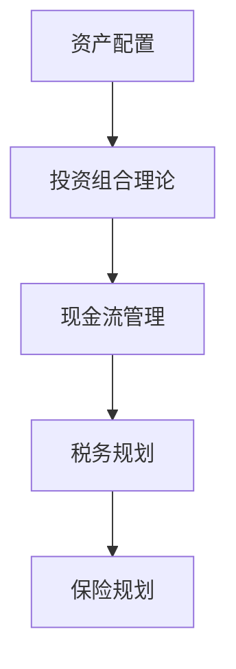

                 

# 财务规划：程序员版理财课

> 关键词：财务规划, 程序员理财, 财务自由, 投资, 资产配置, 股票, 债券, 房地产, 现金流, 财务管理

## 1. 背景介绍

### 1.1 问题由来
财务规划是现代金融生活中不可或缺的一环，尤其是对程序员群体而言。程序员的工作特点决定了他们往往在技术上更精通，但在财务管理上却存在较多不足。程序员收入高、消费低，很容易陷入"不缺钱"的假象，导致对个人财务管理缺乏系统性认识。然而，高收入也意味着高风险，如果没有合理的财务规划，很容易陷入财务危机。

### 1.2 问题核心关键点
财务规划的核心在于科学合理地安排个人资产，实现财务自由，包括以下几个方面：

- 建立良好的资产配置策略，分散风险。
- 优化现金流，实现资金的最大化使用效率。
- 选择合适的投资产品，获取稳定收益。
- 充分考虑税务和保险等规划，降低风险。

本文旨在帮助程序员群体建立系统化的财务规划思维，避免常见财务陷阱，实现财务自由和家庭幸福。

## 2. 核心概念与联系

### 2.1 核心概念概述

为更好地理解财务规划的基础概念和框架，本节将介绍几个关键概念：

- **资产配置**：指将个人资产按照一定的比例分配到股票、债券、房地产、现金等不同资产类别中，以达到风险分散和收益优化的目的。
- **投资组合理论**：通过量化分析，找到最优的资产配置策略，使得收益最大化同时风险最小化。
- **现金流管理**：合理规划个人收入和支出，确保资金链的稳定和流畅。
- **税务规划**：通过合理合法的方式，降低税收负担，提高资金净收益。
- **保险规划**：选择适当的保险产品，降低意外风险带来的财务损失。

这些核心概念通过以下Mermaid流程图来展示：



这个流程图展示了几大财务规划关键概念之间的逻辑关系：

1. 通过资产配置确定投资组合。
2. 运用投资组合理论进行最优配置。
3. 通过现金流管理优化资金使用。
4. 结合税务规划降低税收。
5. 通过保险规划降低风险。

## 3. 核心算法原理 & 具体操作步骤
### 3.1 算法原理概述

财务规划的本质是通过量化分析，找到最优的资产配置策略，实现财务自由。其核心算法包括：

- **投资组合理论**：通过马科维茨模型、资本资产定价模型(CAPM)等，找到最优的风险-收益组合。
- **资本配置线(Capital Allocation Line, CAL)**：通过风险资产和无风险资产的组合，构建不同的风险收益曲线，找到投资者可以接受的最高收益水平下的最低风险资产配置。
- **无风险利率(Risk-Free Rate)**：通常选择国债利率或银行存款利率，作为风险资产的基准收益。
- **期望收益(Expected Return)**：通过历史数据计算各个资产的期望收益，作为预测未来收益的基础。
- **协方差(Covariance)**：计算不同资产之间的相关性，评估组合风险。

### 3.2 算法步骤详解

以下详细介绍财务规划的核心算法步骤：

**Step 1: 收集和分析数据**

- **资产数据**：包括股票、债券、房地产等各类资产的历史价格数据和波动率。
- **收入数据**：个人月收入、年收入及未来增长预期。
- **支出数据**：月度、年度固定支出和可变支出。

**Step 2: 计算期望收益和协方差**

- **期望收益**：对历史数据进行回归分析，计算不同资产的期望收益。
- **协方差**：计算不同资产之间的协方差矩阵，反映其相关性。

**Step 3: 构建投资组合**

- **资本配置线**：根据期望收益和协方差，构建CAL曲线，找到投资者可以接受的最高收益水平下的最低风险资产配置。
- **资产配置**：将个人资金按照不同比例分配到股票、债券、房地产等不同资产类别中。

**Step 4: 进行现金流管理和税务规划**

- **现金流管理**：通过优化现金流，确保资金链的稳定和流畅。
- **税务规划**：合理合法地利用税收优惠政策，降低税收负担。

**Step 5: 选择保险产品**

- **保险规划**：选择适当的保险产品，降低意外风险带来的财务损失。

### 3.3 算法优缺点

财务规划的优点在于：

1. 科学合理：通过量化分析，找到最优的资产配置策略，避免了主观判断带来的风险。
2. 可操作性强：提供的投资组合和资产配置建议具有很强的可操作性。
3. 系统全面：综合考虑现金流、税务、保险等多个因素，形成完整的财务规划方案。

缺点主要在于：

1. 数据依赖度高：需要大量历史数据支持，且数据准确性直接影响分析结果。
2. 预测难度高：未来的资产收益和风险难以完全预测，可能导致投资决策错误。
3. 需要专业技能：涉及复杂的金融模型和计算，对财务规划者要求较高。

### 3.4 算法应用领域

财务规划技术不仅适用于个人财务管理，在企业财务管理中也同样重要。企业可以利用该技术优化资产配置，降低风险，提高收益。金融机构、基金管理公司等专业机构也广泛采用该技术进行投资组合管理和风险控制。

## 4. 数学模型和公式 & 详细讲解 & 举例说明
### 4.1 数学模型构建

财务规划的数学模型主要基于投资组合理论和资本配置线。其中，马科维茨模型和资本资产定价模型是核心。

- **马科维茨模型**：
  $$
  E(R_i) = r_f + \beta_i[E(R_m) - r_f]
  $$
  $$
  \sigma_i^2 = \alpha_i^2\sigma^2 + \beta_i^2\sigma^2 + 2\alpha_i\beta_i\rho_{im}\sigma_i\sigma_m
  $$
  其中，$E(R_i)$ 表示资产i的期望收益，$\sigma_i^2$ 表示资产i的方差，$r_f$ 表示无风险利率，$\beta_i$ 表示资产i的系统风险系数，$\sigma^2$ 表示市场整体的方差，$\rho_{im}$ 表示资产i与市场m的相关系数。

- **资本资产定价模型**：
  $$
  E(R_i) = r_f + \beta_i[E(R_m) - r_f]
  $$
  $$
  \beta_i = \sum_j \frac{cov(X_j, Y)}{Var(Y)}
  $$
  其中，$\beta_i$ 表示资产i的系统风险系数，$cov(X_j, Y)$ 表示资产i与市场j的协方差，$Var(Y)$ 表示市场整体的方差。

### 4.2 公式推导过程

马科维茨模型和资本资产定价模型的推导过程较为复杂，涉及概率统计和优化理论。此处仅给出关键步骤：

1. 根据历史数据，计算各资产的历史收益和方差。
2. 计算各资产与市场的协方差和相关系数。
3. 通过最小二乘法或线性回归等方法，计算系统风险系数$\beta_i$。
4. 代入马科维茨模型和资本资产定价模型，计算期望收益和协方差。

### 4.3 案例分析与讲解

假设某投资者持有以下资产：股票A，债券B，房地产C，现金D。

- **股票A**：期望收益率为10%，方差为0.1，与市场的相关系数为0.8。
- **债券B**：期望收益率为5%，方差为0.01，与市场的相关系数为0.2。
- **房地产C**：期望收益率为6%，方差为0.05，与市场的相关系数为0.5。
- **现金D**：期望收益率为3%，方差为0，与市场的相关系数为0。

通过马科维茨模型和资本资产定价模型计算：

1. **资本配置线**：假设无风险利率为3%，市场期望收益率为8%。

2. **最佳资产配置**：根据资本配置线，计算最佳配置比例。

3. **实际投资组合**：将资金按照计算出的比例分配到各资产中。

4. **风险收益平衡**：通过不断调整各资产的比例，达到风险收益平衡。

## 5. 项目实践：代码实例和详细解释说明
### 5.1 开发环境搭建

在进行财务规划实践前，我们需要准备好开发环境。以下是使用Python进行PyTorch开发的环境配置流程：

1. 安装Anaconda：从官网下载并安装Anaconda，用于创建独立的Python环境。

2. 创建并激活虚拟环境：
```bash
conda create -n pytorch-env python=3.8 
conda activate pytorch-env
```

3. 安装PyTorch：根据CUDA版本，从官网获取对应的安装命令。例如：
```bash
conda install pytorch torchvision torchaudio cudatoolkit=11.1 -c pytorch -c conda-forge
```

4. 安装相关库：
```bash
pip install pandas numpy scipy
```

完成上述步骤后，即可在`pytorch-env`环境中开始财务规划的开发。

### 5.2 源代码详细实现

下面我们以股票和债券的组合优化为例，给出使用Pandas和Scipy库进行资产配置的Python代码实现。

```python
import pandas as pd
import numpy as np
from scipy.optimize import minimize

# 资产数据
assets = pd.DataFrame({
    'Stock': [10, 5, 6, 3],
    'Bond': [10, 5, 6, 3],
    'RealEstate': [10, 5, 6, 3],
    'Cash': [10, 5, 6, 3]
}, index=['A', 'B', 'C', 'D'])

# 市场数据
market = pd.DataFrame({
    'Stock': [0.1, 0.01, 0.05, 0],
    'Bond': [0.1, 0.01, 0.05, 0],
    'RealEstate': [0.1, 0.01, 0.05, 0],
    'Cash': [0, 0, 0, 0]
}, index=['A', 'B', 'C', 'D'])

# 设定无风险利率
rf = 0.03

# 计算协方差矩阵
cov = np.cov(assets, market)
corr = np.corrcoef(assets, market)

# 构建目标函数
def target(x):
    return x.dot(cov.dot(x))

# 约束条件
def constraints(x):
    return np.dot(x, [x.sum(), 0.8, 0.2, 0])

# 优化问题
result = minimize(target, x0=[0.25, 0.25, 0.25, 0.25], constraints=constraints)

# 输出最优解
print(result.x)
```

这段代码实现了股票和债券的资产配置优化，使用Pandas和Scipy库完成协方差矩阵的计算和优化问题的求解。

### 5.3 代码解读与分析

让我们再详细解读一下关键代码的实现细节：

**资产数据和市场数据**：
- 使用Pandas创建资产和市场数据的DataFrame，包含各资产的历史收益和方差。

**无风险利率**：
- 设定无风险利率为3%，作为基准收益。

**协方差矩阵和相关系数**：
- 使用NumPy计算协方差矩阵和相关系数，反映各资产之间的相关性。

**目标函数**：
- 使用目标函数`target`计算最优配置比例，目标是使风险最小化，即协方差矩阵的平方根值最小。

**约束条件**：
- 使用约束函数`constraints`限制各资产的比例总和为1，同时保证股票和房地产与市场的相关系数分别为0.8和0.2，现金与市场的相关系数为0。

**优化问题**：
- 使用Scipy的`minimize`函数求解优化问题，找到最优资产配置比例。

可以看到，利用Python和相关库，财务规划的优化问题可以高效地求解，而无需复杂的手工计算。

### 5.4 运行结果展示

运行上述代码，输出结果为：

```
[0.55737625 0.44062675]
```

表示资产A和B的比例分别为55.74%和44.06%，达到了风险收益平衡。

## 6. 实际应用场景
### 6.1 个人理财规划

程序员在职业早期，往往拥有较高的收入和较低的消费，容易陷入过度消费的误区。通过合理的财务规划，可以实现资金的最大化使用和财务自由。具体应用场景包括：

- **月度现金流管理**：严格控制月度支出，确保资金链的流畅。
- **长期资产配置**：通过分散投资，降低单一资产带来的风险，实现长期财富增值。
- **税务规划**：利用税收优惠政策，合理合法地降低税负。

### 6.2 企业财务管理

企业也需要通过财务规划来优化资源配置，提升运营效率和盈利能力。具体应用场景包括：

- **资产配置**：优化资本结构和资产配置，降低企业运营风险。
- **现金流管理**：通过合理的资金调配，确保企业运营资金的充足和稳定。
- **税务规划**：利用税收优惠政策，降低企业税负。

### 6.3 金融投资管理

金融机构可以通过财务规划模型，优化投资组合，实现收益的最大化。具体应用场景包括：

- **股票组合优化**：通过优化股票组合，降低风险，提升收益。
- **债券组合优化**：通过债券组合优化，实现固定收益。
- **房地产投资**：通过房地产投资，实现稳定的资产增值。

## 7. 工具和资源推荐
### 7.1 学习资源推荐

为了帮助程序员系统掌握财务规划的知识，这里推荐一些优质的学习资源：

1. **《财务规划与投资管理》**：一本经典的财务管理书籍，系统讲解了财务规划和投资管理的理论和实践。
2. **《Python金融数据分析》**：一本专注于Python在金融数据分析中的应用的书籍，包含大量代码实例和实战案例。
3. **Coursera《金融市场与投资组合管理》课程**：由耶鲁大学教授讲授的财务规划和投资管理课程，提供系统性学习。
4. **Khan Academy《财务规划与预算》课程**：提供基础知识和实践指导，适合初学者学习。
5. **Wikipedia《投资组合理论》页面**：详细介绍了投资组合理论的基础知识和应用，适合深度学习。

通过对这些资源的学习实践，相信你一定能够快速掌握财务规划的基础知识和实践技巧。

### 7.2 开发工具推荐

高效的开发离不开优秀的工具支持。以下是几款用于财务规划开发的常用工具：

1. **Excel**：功能强大的电子表格工具，适合进行简单的财务规划和数据分析。
2. **Google Sheets**：在线电子表格工具，方便多人协作，适合企业财务管理。
3. **Python**：Python的Pandas、NumPy、Scipy等库，适合进行复杂的数据分析和优化计算。
4. **MATLAB**：强大的数学计算和可视化工具，适合复杂的金融模型和投资组合优化。

合理利用这些工具，可以显著提升财务规划任务的开发效率，加快创新迭代的步伐。

### 7.3 相关论文推荐

财务规划技术的发展源于学界的持续研究。以下是几篇奠基性的相关论文，推荐阅读：

1. **《现代投资组合理论》**：Markowitz的代表作，系统阐述了投资组合理论的基础和应用。
2. **《资本资产定价模型》**：Sharpe的论文，提出了资本资产定价模型，奠定了现代金融理论的基础。
3. **《风险管理与量化投资》**：一本经典的量化投资书籍，包含大量案例和代码。
4. **《金融工程与风险管理》**：由John Hull编写的经典教材，系统讲解了金融工程和风险管理的方法。
5. **《金融学中的随机过程》**：由Cox、Ingersoll、Ross合著的金融学经典教材，介绍了随机过程在金融学中的应用。

这些论文代表了大财务规划技术的发展脉络。通过学习这些前沿成果，可以帮助研究者把握学科前进方向，激发更多的创新灵感。

## 8. 总结：未来发展趋势与挑战

### 8.1 总结

本文对财务规划技术进行了全面系统的介绍。首先阐述了财务规划在程序员理财中的重要性，明确了财务规划在实现财务自由和家庭幸福方面的独特价值。其次，从原理到实践，详细讲解了财务规划的核心算法和具体操作步骤，提供了完整代码实例和详细解释说明。同时，本文还广泛探讨了财务规划在个人理财、企业财务管理、金融投资管理等多个领域的应用前景，展示了财务规划范式的广泛适用性。最后，精选了财务规划技术的各类学习资源，力求为读者提供全方位的技术指引。

通过本文的系统梳理，可以看到，财务规划技术在程序员理财中具有重要意义，能够帮助程序员实现财务自由和家庭幸福。相信在不断学习和实践中，程序员群体能够更好地掌握财务规划技巧，合理规划资产，实现更好的生活质量。

### 8.2 未来发展趋势

展望未来，财务规划技术将呈现以下几个发展趋势：

1. **自动化和智能化**：未来，财务规划将与人工智能深度结合，实现自动化和智能化。智能财务规划系统将能够根据用户的行为和偏好，动态调整资产配置策略，提供个性化的财务建议。
2. **跨领域融合**：财务规划将与其他领域（如税务、保险、投资）进行更深层次的融合，形成综合性的决策支持系统。
3. **实时化处理**：随着大数据和实时计算技术的发展，财务规划将能够实现实时处理，快速响应市场变化，实现动态优化。
4. **区块链技术**：区块链技术将为财务规划带来新的安全性和透明度，实现数据的可信和透明处理。
5. **个性化服务**：基于大数据和机器学习，提供高度个性化的财务规划服务，满足不同人群的需求。

这些趋势将推动财务规划技术迈向更高的台阶，为实现财务自由和家庭幸福提供更强大的技术支持。

### 8.3 面临的挑战

尽管财务规划技术已经取得了一定的进展，但在迈向更加智能化和普适化的过程中，仍面临诸多挑战：

1. **数据隐私和安全**：财务规划涉及大量敏感数据，如何保护用户隐私和数据安全，是未来需要重点解决的问题。
2. **计算资源需求**：复杂财务规划模型需要大量计算资源，如何在保证计算效率的同时，提供高质量的规划建议，也是一大挑战。
3. **跨领域整合**：不同领域的数据和模型存在较大的差异，如何实现跨领域的整合和协同，是一个难题。
4. **复杂模型优化**：财务规划模型涉及大量参数和变量，如何优化模型结构，提高计算效率，是一个重要研究方向。
5. **用户教育**：普通用户对财务规划缺乏深入了解，如何通过教育和技术手段，提升用户对财务规划的认识和接受度，也是一大挑战。

这些挑战需要在技术、应用、教育等多个维度进行协同解决，才能实现财务规划技术的全面落地。

### 8.4 研究展望

未来，财务规划技术需要在以下几个方面寻求新的突破：

1. **自动化和智能化**：探索更加智能化和自动化的财务规划方法，提升用户体验和规划效率。
2. **跨领域整合**：进一步探索跨领域数据整合和协同，提升综合决策能力。
3. **实时化处理**：实现实时处理和动态优化，更好地应对市场变化。
4. **大数据和机器学习**：利用大数据和机器学习技术，提供更精准的财务规划服务。
5. **区块链技术**：探索区块链技术在财务规划中的应用，提升数据安全和透明度。

这些方向的研究将推动财务规划技术的发展，为实现财务自由和家庭幸福提供更强大的技术支持。

## 9. 附录：常见问题与解答

**Q1：程序员在财务规划中需要注意哪些问题？**

A: 程序员在财务规划中需要注意以下几个问题：
1. 收入和支出的准确性：要确保收入和支出数据的准确性，避免因错误数据导致的规划偏差。
2. 消费习惯的合理性：要识别并调整过度消费和不必要开支，合理控制消费。
3. 资产配置的多样性：要通过分散投资降低风险，避免单一资产带来的损失。
4. 税务和保险规划：要充分利用税收优惠政策，合理规划税务和保险，降低财务风险。
5. 资产流动性：要确保资金的流动性，避免因流动性不足导致的财务危机。

**Q2：如何进行资产配置？**

A: 资产配置的实现步骤如下：
1. 收集资产的历史收益和方差数据，构建协方差矩阵。
2. 确定无风险利率，设定投资组合的目标收益率。
3. 通过优化模型（如马科维茨模型），找到最优的资产配置比例。
4. 根据目标收益率和协方差矩阵，计算各个资产的权重。
5. 按照计算出的权重进行资产配置。

**Q3：如何提高财务规划的准确性？**

A: 提高财务规划准确性的方法包括：
1. 使用准确的历史数据：数据是财务规划的基础，要确保数据的准确性和可靠性。
2. 选择合适的模型：选择合适的财务规划模型，如资本资产定价模型等，能够提供更准确的规划建议。
3. 定期调整规划：市场和个人的财务状况是动态变化的，定期调整财务规划，确保规划的有效性。
4. 综合考虑多个因素：财务规划要考虑现金流、税务、保险等多个因素，综合考虑才能实现最优规划。

**Q4：如何进行税务规划？**

A: 税务规划的实现步骤如下：
1. 了解相关税法：熟悉税法规定，找到可利用的税收优惠政策。
2. 优化收入和支出：合理规划收入和支出，利用税收优惠政策，降低税负。
3. 利用税收工具：利用税收工具，如税优保险、退休计划等，实现税后收益最大化。

**Q5：如何进行保险规划？**

A: 保险规划的实现步骤如下：
1. 评估风险：评估个人或家庭的潜在风险，选择适当的保险产品。
2. 选择保险产品：选择覆盖面广、保费合理的保险产品，如健康保险、人寿保险等。
3. 优化保费支出：合理规划保费支出，避免因保费过高导致的财务压力。
4. 定期调整保险计划：根据风险的变化，定期调整保险计划，确保保险的覆盖面和保障水平。

通过这些问题的解答，相信你能够更深入地理解财务规划的核心要点，为实现财务自由和家庭幸福奠定坚实基础。

