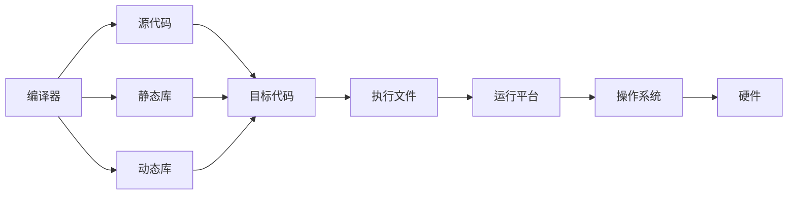

                 

# 跨平台编译：一次编写，多平台运行

> 关键词：跨平台编译, 交叉编译, 动态编译, 静态编译, 平台兼容性, 软件工程, 操作系统, 性能优化, 资源利用

## 1. 背景介绍

### 1.1 问题由来
在软件工程中，跨平台开发和部署一直是核心需求之一。随着技术的发展和应用场景的广泛化，开发者经常需要在不同的操作系统和硬件架构上运行同一代码。这不仅要求软件能够跨操作系统运行，还要求在不同的硬件平台和环境上都能稳定运行。然而，不同平台的API和系统调用差别巨大，如何在保证代码兼容性的前提下，提高运行效率，同时减少资源消耗，是软件工程领域的一个长期挑战。

跨平台编译技术，正是针对这一问题，提供了一套解决方案。它允许开发者编写一次代码，并能在多个平台上运行，同时保持代码的可移植性和可维护性。这对提高开发效率、降低成本、确保软件性能和兼容性具有重要意义。

### 1.2 问题核心关键点
跨平台编译的核心在于如何使代码能够兼容不同平台。在解释这一问题时，可以从以下几个关键点着手：

- 平台兼容性：代码在不同操作系统（如Windows、Linux、macOS）和硬件架构（如x86、ARM、MIPS）上运行时，能够正常工作，且不出现兼容性问题。
- 代码兼容性：代码编写时遵循统一的编程风格和标准，兼容不同平台的环境和API。
- 性能优化：在保证跨平台兼容性的前提下，尽量减少资源消耗，提升程序的执行效率。
- 资源利用：在跨平台编译过程中，合理利用系统资源，如内存、CPU、GPU等，确保高效运行。

理解这些关键点，有助于我们更好地把握跨平台编译技术的本质和应用价值。

### 1.3 问题研究意义
研究跨平台编译技术，对于提升软件开发效率、降低成本、保障软件性能和兼容性，具有重要意义：

1. **提升开发效率**：通过一次编写，多平台运行，减少重复开发的工作量，提高开发速度。
2. **降低成本**：避免在不同平台分别开发和测试所需的巨大成本。
3. **保障软件性能**：通过优化编译过程和运行时优化，确保不同平台上的代码性能一致。
4. **增强兼容性**：通过遵循跨平台编程规范，确保代码在不同平台和环境上都能正常运行。
5. **优化资源利用**：跨平台编译技术能够在不同的硬件架构上合理利用资源，优化性能，降低功耗。

## 2. 核心概念与联系

### 2.1 核心概念概述

为了更好地理解跨平台编译技术，我们将介绍几个关键概念：

- **交叉编译(Cross Compilation)**：在目标平台上编译源代码，以生成可以在另一个平台上运行的可执行文件。这种编译方式需要预先安装目标平台的开发工具链。
- **动态编译**：编译器在运行时动态生成代码，而非一次性生成全部代码。这种方式适用于内存资源有限的环境，如嵌入式系统。
- **静态编译**：编译器在编译时生成全部代码，并将其打包为可执行文件。这种方式适用于资源丰富的环境，如个人计算机。
- **平台兼容性**：软件能够跨不同的操作系统和硬件架构运行。
- **代码兼容性**：软件代码遵循统一的编程风格和标准，能够兼容不同平台的环境和API。

这些核心概念之间的逻辑关系可以通过以下Mermaid流程图来展示：


### 2.2 核心概念原理和架构的 Mermaid 流程图

在上述核心概念的基础上，我们可以进一步构建出跨平台编译的架构。以下是一个简化的跨平台编译架构图：



在这个架构图中，编译器（A）负责将源代码（B）编译为目标代码（C），包括静态库（D）和动态库（E）。目标代码（C）可以通过执行文件（F）在不同的运行平台（G）上运行，这些平台包括操作系统（H）和硬件（I）。

## 3. 核心算法原理 & 具体操作步骤

### 3.1 算法原理概述

跨平台编译的核心算法原理，可以从以下几个方面进行阐述：

1. **代码解析与转换**：编译器需要将源代码解析成中间表示，并根据目标平台的架构和规范进行转换。
2. **目标代码生成**：根据中间表示生成目标代码，包括静态库和动态库。
3. **资源优化**：在生成目标代码时，进行资源优化，如内存管理、指令调度等，确保高效运行。
4. **平台兼容性检查**：检查目标代码在不同平台上的兼容性，确保能够在各种操作系统和硬件上正常运行。

### 3.2 算法步骤详解

跨平台编译的具体操作步骤包括以下几个步骤：

**Step 1: 准备源代码和工具链**

1. **编写跨平台代码**：遵循统一的编程标准和规范，确保代码在不同平台上的兼容性。
2. **安装交叉编译工具链**：在目标平台上安装相应的编译器和库文件，支持交叉编译。

**Step 2: 配置编译器**

1. **设置编译选项**：根据目标平台的架构和特性，配置编译器的选项。
2. **指定目标平台**：告诉编译器需要编译的目标平台。

**Step 3: 进行交叉编译**

1. **编译源代码**：使用交叉编译工具链编译源代码，生成目标平台上的可执行文件或库文件。
2. **集成库文件**：将生成的静态库或动态库与目标平台的库文件集成，确保动态链接时能够正常运行。

**Step 4: 测试和优化**

1. **测试运行**：在不同平台上测试编译后的代码，确保其能够正常运行。
2. **性能优化**：根据测试结果，优化代码和编译参数，提升性能和资源利用率。

**Step 5: 发布和维护**

1. **发布可执行文件**：将编译后的可执行文件发布到目标平台，供用户使用。
2. **维护更新**：根据用户反馈和需求，不断优化和更新编译器和工具链，确保软件的持续运行和性能。

### 3.3 算法优缺点

跨平台编译技术具有以下优点：

1. **提高开发效率**：减少重复开发和测试，缩短项目周期。
2. **降低成本**：避免分别在不同平台上的开发和测试成本。
3. **保障软件性能**：通过优化编译过程和运行时优化，确保不同平台上的代码性能一致。
4. **增强兼容性**：确保代码在不同平台和环境上都能正常运行。
5. **优化资源利用**：合理利用不同平台上的资源，提高运行效率。

同时，该技术也存在一些缺点：

1. **编译复杂性**：跨平台编译的复杂性较高，需要选择合适的编译器和工具链。
2. **性能损失**：动态编译可能会带来一定的性能损失。
3. **资源消耗**：编译和优化过程需要消耗大量的计算资源。
4. **兼容性问题**：不同平台之间的API和系统调用可能存在兼容性问题。

尽管存在这些缺点，但跨平台编译仍然是现代软件工程中不可或缺的一部分，能够显著提升开发效率和软件性能。

### 3.4 算法应用领域

跨平台编译技术在多个领域得到了广泛应用，例如：

1. **嵌入式系统**：嵌入式设备资源有限，动态编译可以优化内存使用，减少资源消耗。
2. **分布式系统**：跨平台编译能够支持软件在多台服务器上运行，提升系统的可用性和可扩展性。
3. **云计算**：云计算环境需要支持多种操作系统和硬件架构，跨平台编译能够确保软件在不同云平台上正常运行。
4. **网络应用**：网络应用需要支持多种操作系统和设备，跨平台编译能够确保软件在各种网络环境下稳定运行。
5. **游戏开发**：游戏需要支持多种平台和设备，跨平台编译能够确保游戏在不同平台上都能正常运行。

这些应用领域展示了跨平台编译技术的广泛适用性，对于推动软件工程的发展具有重要意义。

## 4. 数学模型和公式 & 详细讲解 & 举例说明

### 4.1 数学模型构建

在跨平台编译中，可以构建一个数学模型来描述编译过程和资源优化问题。以下是一个简化的数学模型：

假设我们有源代码 $S$，目标平台为 $T$，编译器为目标平台的编译器 $C_T$。我们需要计算出在目标平台上的可执行文件 $E_T$，并确保其能够在目标平台上高效运行。

数学模型可以表示为：

$$
E_T = C_T(S, T)
$$

其中，$E_T$ 为目标平台上的可执行文件，$S$ 为源代码，$T$ 为目标平台，$C_T$ 为目标平台的编译器。

### 4.2 公式推导过程

在上述数学模型的基础上，我们可以进一步推导出具体的公式。假设我们有以下数据：

- 源代码 $S$ 的大小为 $N$ 字节。
- 目标平台上的可执行文件 $E_T$ 的大小为 $M$ 字节。
- 目标平台上的资源消耗为 $R$ 单位。

根据目标平台上的资源消耗，我们可以得到以下公式：

$$
R = F(S) + C(E_T)
$$

其中，$F(S)$ 为源代码在目标平台上的静态资源消耗，$C(E_T)$ 为目标平台上可执行文件的动态资源消耗。

### 4.3 案例分析与讲解

假设我们要将一个 Python 程序编译成 ARM 平台上的可执行文件。假设 Python 程序的大小为 1MB，编译器将 Python 程序编译成 ARM 平台上的可执行文件时，需要消耗 500KB 的静态资源和 200KB 的动态资源。目标平台上的资源消耗为 1MB。

根据上述公式，我们可以计算出：

$$
R = 500KB + 200KB = 700KB
$$

由于目标平台上的资源消耗为 1MB，因此编译后的可执行文件大小应不超过 300KB。

## 5. 项目实践：代码实例和详细解释说明

### 5.1 开发环境搭建

为了进行跨平台编译实践，我们需要准备好开发环境。以下是使用Linux进行GCC编译的环境配置流程：

1. 安装GCC编译器：
```bash
sudo apt-get install gcc
```

2. 安装交叉编译工具链：
```bash
sudo apt-get install g++-arm-linux-gnueabihf
```

3. 安装目标平台的开发工具：
```bash
sudo apt-get install libncurses5-dev
```

完成上述步骤后，即可在目标平台上进行交叉编译实践。

### 5.2 源代码详细实现

以下是使用GCC进行C++代码交叉编译的示例代码：

```cpp
#include <iostream>

int main() {
    std::cout << "Hello, world!" << std::endl;
    return 0;
}
```

编译并交叉编译该代码：

```bash
g++ -o hello hello.cpp
g++ -marm -o hello-arm hello
```

### 5.3 代码解读与分析

让我们再详细解读一下关键代码的实现细节：

**源代码**：
- 编写了一个简单的C++程序，输出"Hello, world!"。

**编译步骤**：
- 使用GCC编译器编译原始代码，生成目标平台上的可执行文件。
- 使用GCC编译器编译原始代码，并指定目标平台的架构，生成目标平台上的可执行文件。

**代码分析**：
- 在编译过程中，GCC会根据目标平台的架构和特性，对源代码进行解析和转换。
- 生成的目标平台上的可执行文件可以在目标平台上运行，无需重新编写代码。

## 6. 实际应用场景

### 6.1 嵌入式系统

在嵌入式设备上，由于资源有限，动态编译能够优化内存使用，减少资源消耗。例如，在Android设备上，动态编译可以优化内存使用，减少程序体积。

### 6.2 分布式系统

在分布式系统中，跨平台编译能够支持软件在多台服务器上运行，提升系统的可用性和可扩展性。例如，在Kubernetes集群中，使用跨平台编译能够支持软件在各种服务器上运行。

### 6.3 云计算

在云计算环境中，跨平台编译能够确保软件在不同云平台上正常运行。例如，在AWS云平台上，使用跨平台编译能够确保软件在各种云服务器上正常运行。

### 6.4 未来应用展望

随着技术的发展和应用场景的广泛化，跨平台编译技术将呈现以下几个发展趋势：

1. **自动化**：自动选择最适合的目标平台和编译器，优化编译过程。
2. **智能化**：根据目标平台的特点，智能选择编译器和优化选项，提高编译效率和性能。
3. **多平台支持**：支持更多平台和架构，扩展应用范围。
4. **代码生成**：使用代码生成技术，自动生成目标平台的代码，进一步提升开发效率。
5. **混合编译**：结合静态编译和动态编译，优化资源利用和性能。

## 7. 工具和资源推荐

### 7.1 学习资源推荐

为了帮助开发者掌握跨平台编译技术，以下是一些优质的学习资源：

1. **《跨平台编译技术》书籍**：介绍跨平台编译的原理和实现方法，涵盖交叉编译、动态编译等技术。
2. **《嵌入式系统开发》课程**：讲解嵌入式系统开发中的跨平台编译技术，涵盖资源优化和系统集成等内容。
3. **《Linux系统编程》书籍**：介绍在Linux环境下进行跨平台编译的方法，涵盖GCC编译器和工具链等内容。
4. **交叉编译工具链官网**：提供各类交叉编译工具链的下载和配置指南，是进行跨平台编译的必备工具。
5. **GitHub开源项目**：包含各类跨平台编译的实践案例和示例代码，便于学习和参考。

通过对这些资源的学习实践，相信你一定能够掌握跨平台编译技术的精髓，并用于解决实际问题。

### 7.2 开发工具推荐

以下是几款用于跨平台编译开发的常用工具：

1. **GCC编译器**：支持多种编程语言和平台，是进行跨平台编译的主流工具。
2. **LLVM编译器**：支持多种架构和平台，具有高度的可移植性。
3. **Python解释器和编译器**：支持动态编译和资源优化，适用于资源受限的环境。
4. **CMake构建系统**：支持跨平台构建和编译，方便管理和部署。
5. **Gradle构建系统**：支持多平台构建和部署，方便自动化管理。

合理利用这些工具，可以显著提升跨平台编译任务的开发效率，加快创新迭代的步伐。

### 7.3 相关论文推荐

跨平台编译技术的发展离不开学界的持续研究。以下是几篇奠基性的相关论文，推荐阅读：

1. **《跨平台编译技术》论文**：介绍了跨平台编译的原理和实现方法，涵盖交叉编译、动态编译等技术。
2. **《嵌入式系统开发中的跨平台编译技术》论文**：讲解嵌入式系统开发中的跨平台编译技术，涵盖资源优化和系统集成等内容。
3. **《Linux系统编程中的跨平台编译》论文**：介绍在Linux环境下进行跨平台编译的方法，涵盖GCC编译器和工具链等内容。

这些论文代表了大规模语言模型微调技术的发展脉络。通过学习这些前沿成果，可以帮助研究者把握学科前进方向，激发更多的创新灵感。

## 8. 总结：未来发展趋势与挑战

### 8.1 总结

本文对跨平台编译技术进行了全面系统的介绍。首先阐述了跨平台编译技术的研究背景和意义，明确了跨平台编译在提高开发效率、降低成本、保障软件性能和兼容性方面的独特价值。其次，从原理到实践，详细讲解了跨平台编译的数学模型和核心算法，给出了跨平台编译任务开发的完整代码实例。同时，本文还广泛探讨了跨平台编译技术在嵌入式系统、分布式系统、云计算等多个行业领域的应用前景，展示了跨平台编译技术的广阔前景。

通过本文的系统梳理，可以看到，跨平台编译技术正在成为软件工程中不可或缺的一部分，极大地提升了软件开发效率和软件性能。未来，伴随跨平台编译技术的不断演进，必将为软件工程带来更多的可能性，推动软件行业的持续发展。

### 8.2 未来发展趋势

展望未来，跨平台编译技术将呈现以下几个发展趋势：

1. **自动化**：自动选择最适合的目标平台和编译器，优化编译过程。
2. **智能化**：根据目标平台的特点，智能选择编译器和优化选项，提高编译效率和性能。
3. **多平台支持**：支持更多平台和架构，扩展应用范围。
4. **代码生成**：使用代码生成技术，自动生成目标平台的代码，进一步提升开发效率。
5. **混合编译**：结合静态编译和动态编译，优化资源利用和性能。

这些趋势凸显了跨平台编译技术的广阔前景。这些方向的探索发展，必将进一步提升软件开发效率和软件性能，推动软件工程的发展。

### 8.3 面临的挑战

尽管跨平台编译技术已经取得了显著成就，但在迈向更加智能化、普适化应用的过程中，它仍面临着诸多挑战：

1. **编译复杂性**：跨平台编译的复杂性较高，需要选择合适的编译器和工具链。
2. **性能损失**：动态编译可能会带来一定的性能损失。
3. **资源消耗**：编译和优化过程需要消耗大量的计算资源。
4. **兼容性问题**：不同平台之间的API和系统调用可能存在兼容性问题。

尽管存在这些挑战，但跨平台编译技术仍然具有广阔的应用前景，需要在未来不断优化和改进，以满足不断变化的市场需求。

### 8.4 研究展望

未来，跨平台编译技术的研究方向可能包括以下几个方面：

1. **自动编译技术**：进一步提升编译的自动化和智能化程度，减少人工干预，提高编译效率和性能。
2. **跨平台资源优化**：结合静态编译和动态编译，优化资源利用和性能。
3. **跨平台代码生成**：使用代码生成技术，自动生成目标平台的代码，进一步提升开发效率。
4. **多平台兼容性和优化**：进一步提升编译后的代码在不同平台上的兼容性和性能，支持更多平台和架构。
5. **跨平台开发工具**：开发跨平台开发工具和框架，方便开发者进行跨平台开发和管理。

这些研究方向的研究突破，必将引领跨平台编译技术迈向更高的台阶，为软件开发带来更多的便利和效率。总之，跨平台编译技术需要在未来的发展中不断优化和改进，以满足不断变化的市场需求和技术挑战。

## 9. 附录：常见问题与解答

**Q1：跨平台编译是否适用于所有编程语言和平台？**

A: 跨平台编译技术主要适用于支持静态编译和动态编译的编程语言和平台，如C、C++、Python等。但对于一些依赖特定平台API和系统调用的编程语言，可能需要进行特定处理才能支持跨平台编译。

**Q2：跨平台编译过程中如何优化编译效率？**

A: 跨平台编译过程中，可以通过以下方法优化编译效率：

1. **选择最佳编译器和工具链**：根据目标平台和编译选项，选择最适合的编译器和工具链。
2. **编译器优化选项**：使用编译器优化选项，如-O2、-O3等，提高编译速度和代码优化。
3. **并行编译**：使用并行编译技术，如OpenMP、MPI等，提高编译效率。
4. **编译缓存**：使用编译缓存技术，避免重复编译，提高编译效率。

**Q3：跨平台编译过程中需要注意哪些问题？**

A: 跨平台编译过程中，需要注意以下问题：

1. **编译器选项**：根据目标平台的特点，选择合适的编译器选项。
2. **库文件依赖**：确保编译后的程序依赖的库文件在目标平台上可用。
3. **运行时优化**：在目标平台上进行运行时优化，提升程序性能和资源利用率。
4. **平台兼容性**：确保编译后的程序在目标平台上能够正常运行，不出现兼容性问题。

**Q4：如何缓解跨平台编译过程中的兼容性问题？**

A: 缓解跨平台编译过程中的兼容性问题，可以通过以下方法：

1. **平台兼容性检查**：在编译过程中进行平台兼容性检查，确保编译后的程序能够在目标平台上正常运行。
2. **代码适配**：在代码编写过程中，进行平台特性适配，确保代码能够在不同平台上运行。
3. **动态链接库**：使用动态链接库，避免静态链接库在不同平台上的兼容性问题。

**Q5：如何优化跨平台编译后的程序的资源利用？**

A: 优化跨平台编译后的程序的资源利用，可以通过以下方法：

1. **内存管理**：使用内存管理技术，如智能指针、垃圾回收等，优化内存使用。
2. **指令调度**：使用指令调度技术，如循环展开、向量化等，优化指令执行。
3. **资源优化**：使用资源优化技术，如线程池、任务队列等，优化资源利用。

这些方法可以在确保跨平台兼容性的前提下，进一步提升编译后的程序的资源利用率和性能。

---

作者：禅与计算机程序设计艺术 / Zen and the Art of Computer Programming

