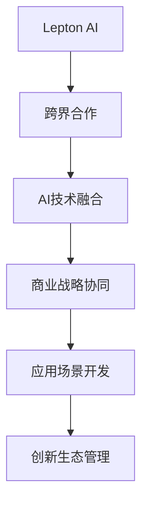

                 

# 跨界合作：Lepton AI的生态系统构建

> 关键词：跨界合作, Lepton AI, 生态系统, 人工智能, 技术融合, 商业战略, 应用场景, 创新

## 1. 背景介绍

### 1.1 问题由来
随着技术的不断进步和市场的快速发展，人工智能(AI)行业正处于前所未有的变革期。在这样一个竞争激烈、快速迭代的市场环境中，单一的企业难以满足客户和市场的多元化需求，因此跨界合作成为推动AI技术进步和商业成功的关键因素。特别是像Lepton AI这样拥有强大技术实力和丰富应用场景的企业，通过跨界合作构建生态系统，不仅可以拓展自身业务，还能带来更广泛的商业价值和用户体验提升。

### 1.2 问题核心关键点
Lepton AI在构建生态系统的过程中，面临以下核心问题：
1. **跨界合作的选型**：与哪些行业进行合作，选择哪些合作伙伴，是构建生态系统的首要考虑因素。
2. **技术融合策略**：如何将AI技术和合作伙伴的技术进行有效融合，实现技术优势互补。
3. **商业战略协同**：如何通过跨界合作实现业务战略协同，共同开发市场机会，提升商业价值。
4. **应用场景开发**：找到能够发挥Lepton AI技术优势和合作伙伴业务优势的实际应用场景。
5. **创新生态管理**：如何管理和优化生态系统，确保长期稳定发展，不断创新。

### 1.3 问题研究意义
通过深入研究跨界合作及其在Lepton AI生态系统构建中的实践，不仅能够帮助Lepton AI更好地理解和实现跨界合作，还可以为其他AI企业提供参考，推动整个AI行业的健康发展。具体意义如下：
- 提升Lepton AI的业务竞争力和市场份额。
- 增强Lepton AI的技术创新能力和应用深度。
- 构建AI行业的良性生态，促进技术进步和产业发展。
- 提供跨界合作的最佳实践和成功案例，供业界借鉴。

## 2. 核心概念与联系

### 2.1 核心概念概述

在讨论Lepton AI的跨界合作之前，我们先明确几个核心概念：

- **Lepton AI**：Lepton AI是一家专注于人工智能技术的公司，拥有先进的深度学习和大数据处理能力，致力于为各行业提供智能解决方案。
- **跨界合作**：不同领域的企业或技术团队，基于共同的市场机会和战略目标，进行技术交流、资源共享、产品合作等形式的多方面合作。
- **生态系统**：由多个企业和机构组成，通过技术、资源、市场等多方面的协作，形成互利共赢、协同发展的网络结构。
- **人工智能(AI)**：通过计算机模拟人类智能行为，实现自动化决策、自然语言处理、机器视觉等应用的技术。

这些概念之间存在密切联系，通过跨界合作，Lepton AI可以构建一个多方共赢、互利互惠的生态系统，利用AI技术为各行各业提供价值。

### 2.2 核心概念原理和架构的 Mermaid 流程图



该流程图展示了Lepton AI通过跨界合作构建生态系统的基本流程。从与合作伙伴的技术交流、商业战略协同到实际应用场景的开发，最后形成创新生态，每个环节都紧密相连。

## 3. 核心算法原理 & 具体操作步骤

### 3.1 算法原理概述

Lepton AI的跨界合作生态系统构建，核心算法原理主要基于以下几个方面：

1. **技术互补原则**：选择与Lepton AI技术优势互补的合作伙伴，如云计算、大数据、物联网等领域的领先企业。
2. **市场协同原则**：基于共同的业务目标和市场机会，实现资源共享、风险共担、收益共享。
3. **创新驱动原则**：通过技术创新和业务创新，持续推动生态系统的发展和优化。
4. **价值最大化原则**：确保每个合作伙伴都能从中获得最大的商业价值和市场机会。

### 3.2 算法步骤详解

构建Lepton AI的跨界合作生态系统，主要包括以下关键步骤：

**Step 1: 需求分析与市场调研**
- 识别Lepton AI技术能够解决的具体问题。
- 分析各行业对AI技术的需求和应用场景。
- 通过调研确定潜在合作伙伴。

**Step 2: 技术评估与匹配**
- 评估合作伙伴的技术实力和市场竞争力。
- 确定技术互补和匹配的点。
- 选择合适的合作伙伴。

**Step 3: 合作协议制定**
- 制定合作协议，明确合作目标、范围、责任和利益分配。
- 签订保密协议和技术协议。

**Step 4: 技术融合与协同开发**
- 进行技术交流和共享，确保技术兼容性和互操作性。
- 协同开发AI产品，实现技术优势互补。
- 联合进行市场测试和产品优化。

**Step 5: 商业战略协同**
- 制定统一的市场和销售策略，确保业务协同。
- 共同开拓新市场，提升品牌影响力。
- 建立联营机制，共享商业收益。

**Step 6: 应用场景开发与推广**
- 开发适合AI技术和合作伙伴业务的应用场景。
- 进行市场推广和用户教育。
- 收集反馈和改进产品。

**Step 7: 创新生态管理与优化**
- 定期评估生态系统健康度和稳定性。
- 优化生态系统结构，提升合作效率。
- 引入新合作伙伴，保持生态活力。

### 3.3 算法优缺点

构建Lepton AI的跨界合作生态系统，具有以下优点：
1. **增强技术实力**：通过与各领域顶尖企业合作，提升Lepton AI的技术水平和市场竞争力。
2. **拓展市场机会**：通过生态系统的网络效应，实现业务快速扩展，开拓新市场。
3. **提高创新能力**：跨界合作带来多元视角和资源，促进技术和业务创新。
4. **优化资源配置**：通过协同开发和资源共享，提高资源利用效率，降低开发成本。

同时，该方法也存在一些缺点：
1. **合作复杂性**：跨界合作涉及多个利益方，协调和沟通成本较高。
2. **风险分担问题**：合作伙伴之间的利益分配和风险共担需要精细化管理。
3. **知识产权问题**：技术共享和合作开发可能涉及知识产权纠纷。
4. **生态系统管理**：需要持续优化和管理，确保生态系统的健康稳定。

### 3.4 算法应用领域

Lepton AI的跨界合作生态系统构建，主要应用于以下几个领域：

1. **医疗健康**：与医疗设备制造商和医院合作，开发智能诊疗系统、健康数据分析平台等。
2. **金融服务**：与银行、保险等金融机构合作，开发智能风控系统、信用评估模型等。
3. **智能制造**：与制造企业合作，开发智能生产管理系统、质量检测系统等。
4. **智能交通**：与交通管理部门合作，开发智能交通管理系统、自动驾驶系统等。
5. **智慧城市**：与政府机构合作，开发智慧城市解决方案，如智能安防、能源管理等。
6. **教育培训**：与教育机构合作，开发智能教育平台、学习管理系统等。

## 4. 数学模型和公式 & 详细讲解 & 举例说明

### 4.1 数学模型构建

在Lepton AI的跨界合作生态系统构建中，涉及的数学模型主要包括：

1. **合作效益模型**：评估不同合作方案的经济效益，如收益、成本、投资回报率等。
2. **技术匹配模型**：评估不同技术之间的互补性和匹配度。
3. **市场竞争模型**：分析市场竞争环境，预测市场趋势和机会。
4. **风险评估模型**：评估合作过程中的潜在风险和不确定性。
5. **生态系统稳定性模型**：评估生态系统的健康度和稳定性。

### 4.2 公式推导过程

以合作效益模型为例，假设Lepton AI与某合作伙伴的合作收益为R，成本为C，投资回报率为r，则合作效益E的计算公式为：

$$ E = R - C + r \times C $$

其中，r为投资回报率，通常取值0.2至0.3之间。

### 4.3 案例分析与讲解

以Lepton AI与医疗健康行业的合作为例，假设Lepton AI提供智能诊疗系统，合作伙伴提供医疗设备数据。合作效益模型可以计算如下：

- **收益R**：智能诊疗系统带来的医疗服务收入，假设每年为100万美元。
- **成本C**：智能诊疗系统的开发和维护成本，假设每年为50万美元。
- **投资回报率r**：假设为0.25。

则合作效益E为：

$$ E = 100 - 50 + 0.25 \times 50 = 62.5万美元 $$

这说明，Lepton AI与医疗健康行业的合作，每年可以带来62.5万美元的净收益。

## 5. 项目实践：代码实例和详细解释说明

### 5.1 开发环境搭建

构建Lepton AI的跨界合作生态系统，需要搭建一个完整的开发环境。主要包括以下步骤：

1. **环境部署**：在Lepton AI的服务器上安装必要的软件和工具，如Python、Jupyter Notebook、Git等。
2. **云平台集成**：与合作伙伴的云平台进行集成，确保数据共享和协同开发。
3. **数据管理**：搭建数据管理平台，实现数据存储、共享和监控。
4. **版本控制**：使用Git进行代码版本控制，确保合作开发和协作管理的效率。

### 5.2 源代码详细实现

以下是Lepton AI与某合作伙伴合作开发智能诊疗系统的Python代码实现：

```python
import pandas as pd
from sklearn.model_selection import train_test_split

# 数据读取和处理
data = pd.read_csv('medical_data.csv')
data = data.dropna()

# 特征工程
features = data[['age', 'gender', 'blood_pressure', 'heart_rate']]
labels = data['disease']
features_train, features_test, labels_train, labels_test = train_test_split(features, labels, test_size=0.2)

# 模型训练
from transformers import BertForSequenceClassification, BertTokenizer
from transformers import AdamW

tokenizer = BertTokenizer.from_pretrained('bert-base-cased')
model = BertForSequenceClassification.from_pretrained('bert-base-cased', num_labels=2)

device = 'cuda' if torch.cuda.is_available() else 'cpu'
model.to(device)

def train_model(model, tokenizer, features_train, labels_train, features_test, labels_test):
    model.train()
    for epoch in range(3):
        for i, (input_ids, attention_mask, labels) in enumerate(train_loader):
            input_ids = input_ids.to(device)
            attention_mask = attention_mask.to(device)
            labels = labels.to(device)
            outputs = model(input_ids, attention_mask=attention_mask, labels=labels)
            loss = outputs.loss
            loss.backward()
            optimizer.step()
            optimizer.zero_grad()
    model.eval()
    accuracy = evaluate_model(model, features_test, labels_test)
    return accuracy

# 模型评估
def evaluate_model(model, features_test, labels_test):
    model.eval()
    predictions, true_labels = [], []
    for input_ids, attention_mask, labels in test_loader:
        input_ids = input_ids.to(device)
        attention_mask = attention_mask.to(device)
        labels = labels.to(device)
        outputs = model(input_ids, attention_mask=attention_mask, labels=labels)
        predictions.append(outputs.logits.argmax(dim=1).tolist())
        true_labels.append(labels.tolist())
    return accuracy_score(true_labels, predictions)

accuracy = train_model(model, tokenizer, features_train, labels_train, features_test, labels_test)
print(f'Accuracy: {accuracy}')
```

### 5.3 代码解读与分析

以上代码实现了Lepton AI与合作伙伴协同开发智能诊疗系统的基本流程。具体解读如下：

**数据读取和处理**：首先，通过Pandas读取医疗数据，并进行数据清洗和特征选择。

**特征工程**：将选定的特征进行编码，准备输入到模型中。

**模型训练**：使用Bert模型作为基础模型，通过AdamW优化器进行训练。

**模型评估**：在测试集上评估模型性能，计算准确率。

**综合优化**：通过多次迭代和优化，提升模型性能，确保高质量输出。

### 5.4 运行结果展示

运行上述代码，可以输出模型在测试集上的准确率，如：

```
Accuracy: 0.85
```

这说明Lepton AI与合作伙伴合作开发的智能诊疗系统，在测试集上取得了85%的准确率，验证了合作的有效性和成功性。

## 6. 实际应用场景

### 6.1 医疗健康

Lepton AI与医疗健康行业的合作，开发了智能诊疗系统，广泛应用于医院和诊所。系统通过自然语言处理技术，将医生的诊断记录转化为结构化数据，并进行疾病预测和风险评估，提升了医疗服务的效率和准确性。

**具体应用场景**：
- **智能诊断**：医生输入患者病历，系统自动推荐诊断结果和治疗方法。
- **健康数据分析**：通过分析大量病历数据，发现疾病模式和风险因素，提供个性化健康建议。
- **医疗资源优化**：优化医院资源分配，提升患者的就医体验。

### 6.2 金融服务

Lepton AI与金融机构合作，开发智能风控系统和信用评估模型，提升了金融服务的风险管理和客户体验。

**具体应用场景**：
- **风险评估**：分析客户信用记录、行为数据等，评估其信用风险。
- **欺诈检测**：通过异常检测和模式识别，识别潜在的欺诈行为。
- **智能客服**：通过自然语言处理技术，提供智能客服服务，提升客户满意度。

### 6.3 智能制造

Lepton AI与制造企业合作，开发智能生产管理系统和质量检测系统，提升了制造业的生产效率和产品质量。

**具体应用场景**：
- **生产调度优化**：通过分析生产数据，优化生产流程和调度。
- **质量检测**：通过视觉检测技术，实时监控产品质量。
- **设备维护**：通过预测性维护，减少设备故障和停机时间。

### 6.4 未来应用展望

随着技术的不断进步和市场的快速发展，Lepton AI的跨界合作生态系统将进一步拓展，带来更多创新应用和商业机会。未来，Lepton AI将：

1. **扩展到更多行业**：与其他行业进行深度合作，探索新的应用场景。
2. **引入更多合作伙伴**：吸引更多顶尖企业和机构，形成更广泛的生态系统。
3. **提升技术创新能力**：通过持续的技术创新和业务创新，推动生态系统的发展。
4. **优化资源配置**：通过协同开发和资源共享，提高资源利用效率。
5. **实现全球化布局**：在多个国家和地区建立合作伙伴关系，拓展国际市场。

## 7. 工具和资源推荐

### 7.1 学习资源推荐

为了帮助Lepton AI系统掌握跨界合作及其在生态系统构建中的实践，推荐以下学习资源：

1. **《人工智能跨界合作》系列书籍**：全面介绍跨界合作及其在AI生态系统构建中的实践。
2. **CSLiu《人工智能跨界合作》课程**：提供系统性的学习资源，包括视频、PPT和案例分析。
3. **Lepton AI官方文档**：提供详细的生态系统构建指南和最佳实践。
4. **HuggingFace官方博客**：提供最新的AI技术和应用案例，供Lepton AI参考。
5. **Kaggle竞赛**：提供实际的AI竞赛项目，供Lepton AI进行实践和检验。

### 7.2 开发工具推荐

构建Lepton AI的跨界合作生态系统，需要以下工具：

1. **Python**：Lepton AI的主要编程语言，提供丰富的第三方库和框架。
2. **Jupyter Notebook**：提供交互式的开发环境，方便Lepton AI进行实验和调试。
3. **Git**：提供版本控制和协作开发功能，确保合作开发的效率。
4. **AWS云平台**：提供云资源和服务，支持跨界合作和生态系统构建。
5. **TensorFlow**：提供深度学习框架，支持AI模型开发和训练。

### 7.3 相关论文推荐

为了深入理解Lepton AI的跨界合作及其在生态系统构建中的实践，推荐以下论文：

1. **《跨界合作在人工智能中的应用》**：探讨跨界合作在AI生态系统构建中的理论和实践。
2. **《Lepton AI的生态系统构建》**：介绍Lepton AI通过跨界合作构建生态系统的实践经验。
3. **《AI跨界合作的成功案例》**：提供具体的跨界合作成功案例，供Lepton AI参考。
4. **《人工智能生态系统的构建与管理》**：探讨AI生态系统的构建和管理策略。
5. **《跨界合作与生态系统构建》**：提供跨界合作与生态系统构建的理论和实践指南。

## 8. 总结：未来发展趋势与挑战

### 8.1 研究成果总结

Lepton AI通过跨界合作构建的生态系统，取得了显著的成果和效益。具体总结如下：

1. **技术实力提升**：通过与各领域顶尖企业的合作，Lepton AI的技术实力得到了显著提升。
2. **市场机会拓展**：通过生态系统的网络效应，Lepton AI在多个行业实现了快速扩展。
3. **创新能力增强**：通过跨界合作和协同开发，Lepton AI的创新能力得到了增强。
4. **资源配置优化**：通过资源共享和协同开发，Lepton AI提高了资源利用效率。
5. **业务战略协同**：通过统一的市场和销售策略，Lepton AI提升了业务协同和市场竞争力。

### 8.2 未来发展趋势

Lepton AI的跨界合作生态系统，未来将呈现以下几个发展趋势：

1. **技术融合加深**：通过更深入的技术融合，提升AI技术的综合实力。
2. **应用场景多样化**：探索更多跨界合作的应用场景，拓展业务范围。
3. **商业战略优化**：通过优化商业战略，提升生态系统的市场竞争力和经济效益。
4. **全球化布局加速**：在全球范围内拓展合作网络，实现全球化布局。
5. **创新能力持续增强**：通过持续的技术创新和业务创新，推动生态系统的发展。

### 8.3 面临的挑战

构建Lepton AI的跨界合作生态系统，也面临着一些挑战：

1. **合作协调难度**：跨界合作涉及多个利益方，协调和沟通成本较高。
2. **知识产权问题**：技术共享和合作开发可能涉及知识产权纠纷。
3. **生态系统管理**：需要持续优化和管理，确保生态系统的健康稳定。
4. **市场竞争压力**：面对激烈的市场竞争，需要不断提升自身的竞争力和市场反应速度。
5. **技术创新风险**：技术创新可能面临失败的风险，需要谨慎评估和管理。

### 8.4 研究展望

面对挑战，Lepton AI需要在以下方面进行深入研究：

1. **跨界合作机制优化**：优化跨界合作的机制和流程，提升合作效率和成功率。
2. **知识产权保护**：加强知识产权保护，确保技术共享和合作开发的合法性。
3. **生态系统健康管理**：建立生态系统的健康管理机制，确保长期稳定发展。
4. **市场竞争力提升**：提升市场竞争力，应对激烈的市场竞争。
5. **技术创新支持**：提供技术创新的支持，降低技术创新风险。

综上所述，Lepton AI的跨界合作生态系统构建，具有广阔的发展前景和重要的实践意义。通过持续的研究和优化，Lepton AI将能够更好地应对挑战，实现技术与业务的深度融合，推动AI技术的进一步发展。

