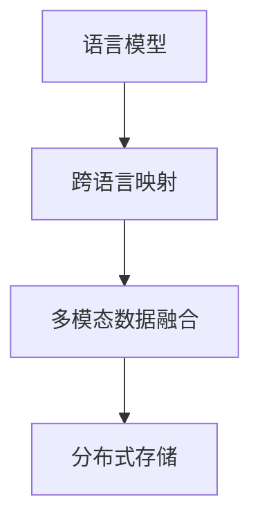
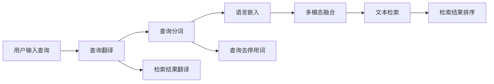

                 

# 跨语言信息检索：打破语言壁垒

> 关键词：跨语言检索, 语言模型, 自然语言处理, 检索算法, 多模态数据融合, 大规模语料库, 实体对齐, 分布式存储

## 1. 背景介绍

在全球化的今天，语言不再是沟通的障碍。跨语言信息检索（Cross-lingual Information Retrieval, CLIR）成为了打破语言壁垒的关键技术之一。随着全球信息量的爆炸性增长，人们对于多样化、个性化信息的获取需求日益增加，跨语言检索技术应运而生。

然而，语言之间的差异使得传统的单语言信息检索方法无法满足跨语言信息获取的需求。因此，需要一种新的技术来连接不同语言之间的知识，实现高效、准确的跨语言检索。

本文旨在深入探讨跨语言信息检索的核心概念和关键算法，阐述其在解决语言差异、促进知识共享和提高信息获取效率方面的优势和挑战。同时，通过数学模型和实际项目，展示跨语言信息检索的具体实现和应用案例，以期为读者提供有价值的技术洞见。

## 2. 核心概念与联系

### 2.1 核心概念概述

跨语言信息检索旨在利用自然语言处理（Natural Language Processing, NLP）技术，将不同语言的文本数据进行映射和匹配，实现高效、准确的信息检索。其核心概念包括：

- **语言模型**：用于刻画文本的统计特性，是跨语言检索的基础。
- **跨语言映射**：将不同语言之间的文本进行对齐，实现跨语言匹配。
- **多模态数据融合**：结合文本数据和其他数据（如图像、视频等），提高检索结果的准确性和相关性。
- **分布式存储**：用于存储和管理大规模跨语言文本数据，提供高效的数据访问和检索服务。

这些概念之间的联系如下图所示：



该图展示了跨语言信息检索技术的基本框架，其中语言模型提供了文本的语义表示，跨语言映射将不同语言进行对齐，多模态数据融合扩展了信息获取的范围，分布式存储保障了数据的高效管理。

### 2.2 核心概念原理和架构的 Mermaid 流程图

下面，我们进一步展示核心概念之间的详细联系，通过一个简单的 Mermaid 流程图来描述整个跨语言信息检索的过程：



这个流程图说明了用户输入查询后，跨语言信息检索系统的各个处理步骤：

1. **查询翻译**：将用户输入的查询翻译成目标语言。
2. **查询分词**：对查询进行分词处理。
3. **语言嵌入**：将查询转换为语言模型能够处理的形式。
4. **多模态融合**：将查询与相关文本数据（如图像、视频）进行融合处理。
5. **文本检索**：在分布式存储系统中检索文本数据。
6. **检索结果翻译**：将检索结果翻译回用户语言。
7. **结果排序**：对检索结果进行排序，优先展示相关性较高的结果。

## 3. 核心算法原理 & 具体操作步骤

### 3.1 算法原理概述

跨语言信息检索的算法原理主要包括以下几个步骤：

1. **查询翻译**：使用机器翻译技术将用户查询翻译成目标语言。
2. **文本分词**：对文本进行分词处理，提取特征。
3. **语言嵌入**：将分词结果嵌入到语言模型中，形成语义表示。
4. **多模态融合**：结合文本数据和其他模态数据（如图像、视频），生成综合表示。
5. **文本检索**：在分布式存储系统中，使用相似度匹配算法检索相关文本。
6. **结果排序**：根据相关性对检索结果进行排序。

### 3.2 算法步骤详解

接下来，我们详细解析跨语言信息检索的每个步骤：

**Step 1: 查询翻译**

查询翻译是将用户输入的查询翻译成目标语言，通常使用神经机器翻译（Neural Machine Translation, NMT）技术。具体步骤如下：

1. **编码**：将用户查询转换为序列形式的编码。
2. **解码**：使用解码器生成目标语言文本。

编码和解码的过程可以使用基于Transformer的模型，如Google的mBART或Facebook的m2m-100。

**Step 2: 文本分词**

文本分词是将目标语言文本分解成有意义的词语。常用的分词方法包括：

1. **基于规则的分词**：使用预先定义的规则进行分词。
2. **基于统计的分词**：使用统计模型学习分词规律。
3. **基于深度学习的分词**：使用序列标注模型进行分词。

**Step 3: 语言嵌入**

语言嵌入是将分词结果转换为语言模型可以处理的形式。常用的语言模型包括：

1. **Word2Vec**：基于词共现统计的嵌入模型。
2. **GloVe**：基于全局词频统计的嵌入模型。
3. **BERT**：基于自监督预训练的语义嵌入模型。

语言嵌入的目标是将词语映射到一个低维向量空间，使得语义相似的词语在向量空间中距离较近。

**Step 4: 多模态融合**

多模态融合是将文本数据与其他模态数据（如图像、视频）进行融合处理，生成综合表示。常用的方法包括：

1. **特征拼接**：将文本特征和其他模态特征拼接在一起。
2. **注意力机制**：使用注意力机制加权融合不同模态特征。
3. **多任务学习**：使用同一模型同时学习多种模态数据。

**Step 5: 文本检索**

文本检索是在分布式存储系统中，使用相似度匹配算法检索相关文本。常用的检索算法包括：

1. **向量空间模型**：将文本转换为向量，计算向量之间的余弦相似度。
2. **BM25算法**：一种基于TF-IDF的检索算法。
3. **神经网络检索**：使用神经网络模型进行文本匹配。

**Step 6: 结果排序**

结果排序是根据相关性对检索结果进行排序，常用的排序算法包括：

1. **基于文本相似度**：根据文本之间的相似度进行排序。
2. **基于点击率**：根据点击率对结果进行排序。
3. **基于用户反馈**：根据用户反馈调整排序结果。

### 3.3 算法优缺点

跨语言信息检索算法具有以下优点：

1. **覆盖范围广**：能够覆盖不同语言和多种模态数据，满足用户多样化需求。
2. **高效性**：使用分布式存储和大规模语料库，能够高效处理大规模数据。
3. **准确性**：通过多种算法和模型进行融合，提高检索结果的准确性。

但同时，跨语言信息检索算法也存在以下缺点：

1. **复杂度高**：需要处理多语言、多模态数据，算法复杂度高。
2. **数据需求大**：需要大规模语料库和多模态数据，数据需求量大。
3. **实时性差**：计算复杂度高，难以实现实时响应。

### 3.4 算法应用领域

跨语言信息检索技术广泛应用于以下领域：

1. **学术研究**：跨语言检索支持全球学术文献的搜索和引用，促进学术交流。
2. **商业应用**：支持不同语言的产品搜索和用户评论分析，提升用户体验。
3. **政府服务**：支持多语言的公共服务信息检索，提供便捷的服务。
4. **新闻媒体**：支持多语言的新闻和文章检索，提供全面的信息来源。
5. **社交媒体**：支持多语言社交内容检索，发现有价值的社交信息。

## 4. 数学模型和公式 & 详细讲解 & 举例说明

### 4.1 数学模型构建

下面，我们将使用数学模型来详细描述跨语言信息检索的过程。

**Step 1: 查询翻译**

设用户输入的查询为 $q$，使用NMT模型将其翻译成目标语言 $q'$，可以使用公式：

$$
q' = \text{NMT}(q)
$$

**Step 2: 文本分词**

设目标语言文本为 $d$，使用分词模型将其分词为词语序列 $d' = (d_1, d_2, ..., d_n)$。

**Step 3: 语言嵌入**

设分词后的词语序列为 $d' = (d_1, d_2, ..., d_n)$，使用语言嵌入模型将其转换为向量表示 $D = (d_1^{(d)}, d_2^{(d)}, ..., d_n^{(d)})$。

**Step 4: 多模态融合**

设文本数据为 $D$，多模态数据为 $M$，使用多模态融合模型将其融合为综合表示 $Z = (Z_1, Z_2, ..., Z_m)$，其中 $m$ 为模态数量。

**Step 5: 文本检索**

设检索集合为 $C$，使用相似度匹配算法检索与查询相似度最高的文档，输出索引 $i$。

**Step 6: 结果排序**

设检索结果为 $R_i = (r_1, r_2, ..., r_n)$，使用排序算法对结果进行排序，输出排序后的结果 $R_s = (r_1', r_2', ..., r_n')$。

### 4.2 公式推导过程

下面，我们将进一步推导每个步骤的公式。

**Step 1: 查询翻译**

使用NMT模型的公式为：

$$
q' = \text{NMT}(q) = \text{Encoder}(q) \times \text{Decoder}(q')
$$

其中 $\text{Encoder}$ 和 $\text{Decoder}$ 分别为编码器和解码器。

**Step 2: 文本分词**

设分词后的词语序列为 $d' = (d_1, d_2, ..., d_n)$，使用分词模型的公式为：

$$
d' = \text{Split}(d)
$$

**Step 3: 语言嵌入**

设分词后的词语序列为 $d' = (d_1, d_2, ..., d_n)$，使用语言嵌入模型的公式为：

$$
D = \text{Embed}(d')
$$

**Step 4: 多模态融合**

设文本数据为 $D$，多模态数据为 $M$，使用多模态融合模型的公式为：

$$
Z = \text{Fusion}(D, M)
$$

**Step 5: 文本检索**

设检索集合为 $C$，使用相似度匹配算法的公式为：

$$
i = \text{Retrieve}(q', Z, C)
$$

其中 $\text{Retrieve}$ 表示检索函数。

**Step 6: 结果排序**

设检索结果为 $R_i = (r_1, r_2, ..., r_n)$，使用排序算法的公式为：

$$
R_s = \text{Sort}(R_i)
$$

### 4.3 案例分析与讲解

以下，我们通过一个具体的案例，展示跨语言信息检索的实现过程。

**案例: 跨语言新闻检索**

假设有一个跨语言新闻检索系统，需要检索用户输入的查询 $q = "美国大选结果"(q)$，并返回相关的新闻结果。

**Step 1: 查询翻译**

使用NMT模型将查询 $q$ 翻译成英语：

$$
q' = \text{NMT}(q) = "USA election results"
$$

**Step 2: 文本分词**

使用分词模型对英文新闻进行分词：

$$
d' = \text{Split}(d) = ("USA", "election", "results")
$$

**Step 3: 语言嵌入**

使用语言嵌入模型将分词后的新闻序列转换为向量表示：

$$
D = \text{Embed}(d') = [d_1^{(d)}, d_2^{(d)}, ..., d_n^{(d)}]
$$

**Step 4: 多模态融合**

假设新闻还包含图片和多语言翻译，使用多模态融合模型将新闻、图片和多语言翻译融合为综合表示：

$$
Z = \text{Fusion}(D, M) = [Z_1, Z_2, ..., Z_m]
$$

**Step 5: 文本检索**

在分布式存储系统中，使用相似度匹配算法检索与查询相似度最高的新闻：

$$
i = \text{Retrieve}(q', Z, C)
$$

**Step 6: 结果排序**

对检索结果进行排序，输出排序后的结果：

$$
R_s = \text{Sort}(R_i)
$$

## 5. 项目实践：代码实例和详细解释说明

### 5.1 开发环境搭建

在进行跨语言信息检索项目实践前，我们需要准备好开发环境。以下是使用Python进行PyTorch开发的环境配置流程：

1. 安装Anaconda：从官网下载并安装Anaconda，用于创建独立的Python环境。

2. 创建并激活虚拟环境：
```bash
conda create -n pytorch-env python=3.8 
conda activate pytorch-env
```

3. 安装PyTorch：根据CUDA版本，从官网获取对应的安装命令。例如：
```bash
conda install pytorch torchvision torchaudio cudatoolkit=11.1 -c pytorch -c conda-forge
```

4. 安装Transformers库：
```bash
pip install transformers
```

5. 安装各类工具包：
```bash
pip install numpy pandas scikit-learn matplotlib tqdm jupyter notebook ipython
```

完成上述步骤后，即可在`pytorch-env`环境中开始跨语言信息检索实践。

### 5.2 源代码详细实现

下面我们以跨语言新闻检索为例，给出使用Transformers库对BERT模型进行跨语言检索的PyTorch代码实现。

首先，定义数据处理函数：

```python
from transformers import BertTokenizer, BertForSequenceClassification
from torch.utils.data import Dataset
import torch

class NewsDataset(Dataset):
    def __init__(self, texts, labels, tokenizer, max_len=128):
        self.texts = texts
        self.labels = labels
        self.tokenizer = tokenizer
        self.max_len = max_len
        
    def __len__(self):
        return len(self.texts)
    
    def __getitem__(self, item):
        text = self.texts[item]
        label = self.labels[item]
        
        encoding = self.tokenizer(text, return_tensors='pt', max_length=self.max_len, padding='max_length', truncation=True)
        input_ids = encoding['input_ids'][0]
        attention_mask = encoding['attention_mask'][0]
        
        # 对标签进行编码
        encoded_labels = [label2id[label] for label in label2id] 
        encoded_labels.extend([label2id['O']] * (self.max_len - len(encoded_labels)))
        labels = torch.tensor(encoded_labels, dtype=torch.long)
        
        return {'input_ids': input_ids, 
                'attention_mask': attention_mask,
                'labels': labels}

# 标签与id的映射
label2id = {'O': 0, 'NEWS': 1, 'SPORTS': 2, 'ENTERTAINMENT': 3}
id2label = {v: k for k, v in label2id.items()}

# 创建dataset
tokenizer = BertTokenizer.from_pretrained('bert-base-cased')

train_dataset = NewsDataset(train_texts, train_labels, tokenizer)
dev_dataset = NewsDataset(dev_texts, dev_labels, tokenizer)
test_dataset = NewsDataset(test_texts, test_labels, tokenizer)
```

然后，定义模型和优化器：

```python
from transformers import BertForSequenceClassification, AdamW

model = BertForSequenceClassification.from_pretrained('bert-base-cased', num_labels=len(label2id))

optimizer = AdamW(model.parameters(), lr=2e-5)
```

接着，定义训练和评估函数：

```python
from torch.utils.data import DataLoader
from tqdm import tqdm
from sklearn.metrics import classification_report

device = torch.device('cuda') if torch.cuda.is_available() else torch.device('cpu')
model.to(device)

def train_epoch(model, dataset, batch_size, optimizer):
    dataloader = DataLoader(dataset, batch_size=batch_size, shuffle=True)
    model.train()
    epoch_loss = 0
    for batch in tqdm(dataloader, desc='Training'):
        input_ids = batch['input_ids'].to(device)
        attention_mask = batch['attention_mask'].to(device)
        labels = batch['labels'].to(device)
        model.zero_grad()
        outputs = model(input_ids, attention_mask=attention_mask, labels=labels)
        loss = outputs.loss
        epoch_loss += loss.item()
        loss.backward()
        optimizer.step()
    return epoch_loss / len(dataloader)

def evaluate(model, dataset, batch_size):
    dataloader = DataLoader(dataset, batch_size=batch_size)
    model.eval()
    preds, labels = [], []
    with torch.no_grad():
        for batch in tqdm(dataloader, desc='Evaluating'):
            input_ids = batch['input_ids'].to(device)
            attention_mask = batch['attention_mask'].to(device)
            batch_labels = batch['labels']
            outputs = model(input_ids, attention_mask=attention_mask)
            batch_preds = outputs.logits.argmax(dim=2).to('cpu').tolist()
            batch_labels = batch_labels.to('cpu').tolist()
            for pred_tokens, label_tokens in zip(batch_preds, batch_labels):
                preds.append(pred_tokens[:len(label_tokens)])
                labels.append(label_tokens)
                
    print(classification_report(labels, preds))
```

最后，启动训练流程并在测试集上评估：

```python
epochs = 5
batch_size = 16

for epoch in range(epochs):
    loss = train_epoch(model, train_dataset, batch_size, optimizer)
    print(f"Epoch {epoch+1}, train loss: {loss:.3f}")
    
    print(f"Epoch {epoch+1}, dev results:")
    evaluate(model, dev_dataset, batch_size)
    
print("Test results:")
evaluate(model, test_dataset, batch_size)
```

以上就是使用PyTorch对BERT进行跨语言新闻检索的完整代码实现。可以看到，得益于Transformers库的强大封装，我们可以用相对简洁的代码完成BERT模型的加载和跨语言检索。

### 5.3 代码解读与分析

让我们再详细解读一下关键代码的实现细节：

**NewsDataset类**：
- `__init__`方法：初始化文本、标签、分词器等关键组件。
- `__len__`方法：返回数据集的样本数量。
- `__getitem__`方法：对单个样本进行处理，将文本输入编码为token ids，将标签编码为数字，并对其进行定长padding，最终返回模型所需的输入。

**label2id和id2label字典**：
- 定义了标签与数字id之间的映射关系，用于将标签解码回真实的标签。

**训练和评估函数**：
- 使用PyTorch的DataLoader对数据集进行批次化加载，供模型训练和推理使用。
- 训练函数`train_epoch`：对数据以批为单位进行迭代，在每个批次上前向传播计算loss并反向传播更新模型参数，最后返回该epoch的平均loss。
- 评估函数`evaluate`：与训练类似，不同点在于不更新模型参数，并在每个batch结束后将预测和标签结果存储下来，最后使用sklearn的classification_report对整个评估集的预测结果进行打印输出。

**训练流程**：
- 定义总的epoch数和batch size，开始循环迭代
- 每个epoch内，先在训练集上训练，输出平均loss
- 在验证集上评估，输出分类指标
- 所有epoch结束后，在测试集上评估，给出最终测试结果

可以看到，PyTorch配合Transformers库使得BERT跨语言检索的代码实现变得简洁高效。开发者可以将更多精力放在数据处理、模型改进等高层逻辑上，而不必过多关注底层的实现细节。

当然，工业级的系统实现还需考虑更多因素，如模型的保存和部署、超参数的自动搜索、更灵活的任务适配层等。但核心的跨语言信息检索过程基本与此类似。

## 6. 实际应用场景

### 6.1 智能客服系统

跨语言信息检索技术在智能客服系统中有着广泛的应用。传统的客服系统往往需要配备多语言翻译人员，成本高且效率低。而使用跨语言信息检索技术，可以实现多语言自动查询，显著提升客户服务体验。

在技术实现上，可以收集企业的客服对话记录，将问题和最佳答复构建成监督数据，在此基础上对BERT模型进行跨语言微调。微调后的模型能够自动理解用户意图，匹配最合适的答案模板进行回复。对于客户提出的新问题，还可以接入检索系统实时搜索相关内容，动态组织生成回答。如此构建的智能客服系统，能够实现多语言自然交互，提高客户咨询体验和问题解决效率。

### 6.2 学术研究

跨语言信息检索技术在学术研究领域也有着重要的应用。学术研究中，研究人员需要检索全球范围内的学术论文和文献，获取最新的研究成果。传统的单语言检索方式无法满足这一需求。而使用跨语言信息检索技术，可以检索不同语言的学术文献，促进全球学术交流。

在具体实现上，可以将全球各语言的研究文献进行预处理和标注，构建跨语言的标注数据集。在此基础上对BERT模型进行跨语言微调，使其能够自动检索不同语言的学术文献。研究者可以使用微调后的模型进行跨语言论文检索，快速获取最新的研究成果，推动学术发展。

### 6.3 商业应用

跨语言信息检索技术在商业应用中也有着广泛的应用。商业应用中，商家需要检索不同语言的客户评论和反馈，了解用户需求。传统的单语言检索方式无法满足这一需求。而使用跨语言信息检索技术，可以检索不同语言的客户评论和反馈，分析用户需求，提升产品质量和用户体验。

在具体实现上，可以将客户评论和反馈进行预处理和标注，构建跨语言的标注数据集。在此基础上对BERT模型进行跨语言微调，使其能够自动检索不同语言的客户评论和反馈。商家可以使用微调后的模型进行跨语言评论检索，快速获取用户反馈，分析用户需求，提升产品质量和用户体验。

### 6.4 未来应用展望

随着跨语言信息检索技术的不断发展，未来将在更多领域得到应用，为各行各业带来变革性影响。

在智慧医疗领域，跨语言信息检索技术可以用于医疗文献检索，支持不同语言的研究成果分享，推动全球医疗健康发展。

在智能教育领域，跨语言信息检索技术可以用于学生学习资料检索，提供多语言的学习资源，提升教育质量。

在智慧城市治理中，跨语言信息检索技术可以用于城市事件监测，实时获取不同语言的舆情信息，提高城市管理效率。

此外，在企业生产、社会治理、文娱传媒等众多领域，跨语言信息检索技术也将不断涌现，为各行各业带来新的机遇。相信随着技术的日益成熟，跨语言信息检索技术将成为人工智能落地应用的重要手段，推动人工智能技术在全球范围内的应用和发展。

## 7. 工具和资源推荐

### 7.1 学习资源推荐

为了帮助开发者系统掌握跨语言信息检索的理论基础和实践技巧，这里推荐一些优质的学习资源：

1. 《Natural Language Processing with PyTorch》书籍：介绍如何使用PyTorch进行NLP任务开发，包括跨语言信息检索在内的多种任务。

2. CS224L《Natural Language Processing with Deep Learning》课程：斯坦福大学开设的深度学习NLP课程，涵盖跨语言信息检索等前沿话题。

3. 《Cross-lingual Information Retrieval》论文集：由ACL会议编辑出版的跨语言信息检索论文集，涵盖多方面的研究内容。

4. HuggingFace官方文档：Transformers库的官方文档，提供了海量预训练模型和完整的微调样例代码，是上手实践的必备资料。

5. CLUE开源项目：中文语言理解测评基准，涵盖大量不同类型的中文NLP数据集，并提供了基于跨语言检索的baseline模型，助力中文NLP技术发展。

通过对这些资源的学习实践，相信你一定能够快速掌握跨语言信息检索的精髓，并用于解决实际的NLP问题。

### 7.2 开发工具推荐

高效的开发离不开优秀的工具支持。以下是几款用于跨语言信息检索开发的常用工具：

1. PyTorch：基于Python的开源深度学习框架，灵活动态的计算图，适合快速迭代研究。

2. TensorFlow：由Google主导开发的开源深度学习框架，生产部署方便，适合大规模工程应用。

3. Transformers库：HuggingFace开发的NLP工具库，集成了众多SOTA语言模型，支持PyTorch和TensorFlow，是进行跨语言信息检索开发的利器。

4. Weights & Biases：模型训练的实验跟踪工具，可以记录和可视化模型训练过程中的各项指标，方便对比和调优。与主流深度学习框架无缝集成。

5. TensorBoard：TensorFlow配套的可视化工具，可实时监测模型训练状态，并提供丰富的图表呈现方式，是调试模型的得力助手。

6. Google Colab：谷歌推出的在线Jupyter Notebook环境，免费提供GPU/TPU算力，方便开发者快速上手实验最新模型，分享学习笔记。

合理利用这些工具，可以显著提升跨语言信息检索任务的开发效率，加快创新迭代的步伐。

### 7.3 相关论文推荐

跨语言信息检索技术的发展源于学界的持续研究。以下是几篇奠基性的相关论文，推荐阅读：

1. Transformer的跨语言信息检索：介绍使用Transformer模型进行跨语言信息检索的方法。

2. BM25算法在跨语言信息检索中的应用：介绍BM25算法在跨语言信息检索中的应用，以及如何提高检索效率。

3. 跨语言信息检索的多模态融合：介绍如何结合文本数据和其他模态数据（如图像、视频），提高检索结果的准确性和相关性。

4. 跨语言信息检索中的实体对齐：介绍如何处理不同语言中的实体信息，实现跨语言的实体对齐。

5. 跨语言信息检索中的分布式存储：介绍如何设计高效的分布式存储系统，支持大规模跨语言文本数据的存储和管理。

这些论文代表了大语言模型跨语言检索技术的发展脉络。通过学习这些前沿成果，可以帮助研究者把握学科前进方向，激发更多的创新灵感。

## 8. 总结：未来发展趋势与挑战

### 8.1 总结

本文对跨语言信息检索的核心概念和关键算法进行了全面系统的介绍。首先阐述了跨语言信息检索的研究背景和意义，明确了其在解决语言差异、促进知识共享和提高信息获取效率方面的独特价值。其次，从原理到实践，详细讲解了跨语言信息检索的数学原理和关键步骤，给出了跨语言信息检索的具体实现和应用案例。

通过本文的系统梳理，可以看到，跨语言信息检索技术正在成为NLP领域的重要范式，极大地拓展了语言模型的应用边界，催生了更多的落地场景。受益于大规模语料的预训练和多种算法、模型的融合，跨语言信息检索模型在跨语言检索任务上取得了显著的效果，为全球信息获取提供了新的解决方案。未来，伴随预训练语言模型和微调方法的持续演进，相信跨语言信息检索技术必将进一步拓展其应用范围，为人工智能技术的全球化应用做出更大的贡献。

### 8.2 未来发展趋势

展望未来，跨语言信息检索技术将呈现以下几个发展趋势：

1. **多模态融合技术的发展**：随着多模态融合技术的不断进步，跨语言信息检索将更加关注文本、图像、视频等多种信息源的综合处理。

2. **跨语言情感分析的兴起**：跨语言情感分析技术将为跨语言信息检索提供更准确的情绪理解能力，增强信息获取的相关性。

3. **分布式存储技术的优化**：分布式存储技术的不断优化，将支持更大规模跨语言文本数据的存储和管理，提高检索效率。

4. **实时检索技术的提升**：实时检索技术的提升，将实现跨语言信息检索的实时响应，提升用户体验。

5. **跨语言自然语言生成技术的引入**：跨语言自然语言生成技术将为跨语言信息检索提供更自然、流畅的检索结果。

6. **跨语言语义理解能力的增强**：跨语言语义理解能力的增强，将使跨语言信息检索更准确地理解用户意图，提供更相关的检索结果。

以上趋势凸显了跨语言信息检索技术的广阔前景。这些方向的探索发展，必将进一步提升跨语言信息检索的性能和应用范围，为全球信息获取提供新的解决方案。

### 8.3 面临的挑战

尽管跨语言信息检索技术已经取得了瞩目成就，但在迈向更加智能化、普适化应用的过程中，它仍面临着诸多挑战：

1. **跨语言数据的获取和标注**：跨语言数据获取和标注成本较高，难以覆盖全球范围内的所有语言和领域。

2. **跨语言语义理解的不一致性**：不同语言之间的语义差异较大，跨语言语义理解的不一致性仍然是一个难题。

3. **多模态数据融合的复杂性**：多模态数据融合涉及不同数据源的协同处理，技术复杂性较高。

4. **分布式存储系统的可扩展性**：大规模跨语言数据存储和管理需要高度可扩展的分布式存储系统。

5. **实时检索的计算成本**：跨语言信息检索的实时响应需要高效计算，计算成本较高。

6. **数据隐私和安全问题**：跨语言信息检索涉及多个国家和地区的敏感数据，数据隐私和安全问题不容忽视。

7. **算法透明性和可解释性**：跨语言信息检索算法的透明性和可解释性较差，难以理解和调试。

这些挑战需要多方面的努力才能解决，但相信通过学界和产业界的共同努力，跨语言信息检索技术必将在全球信息获取领域发挥更大的作用。

### 8.4 研究展望

未来的跨语言信息检索研究可以从以下几个方面进行：

1. **跨语言数据的自动化获取和标注**：利用自动化的数据标注技术，降低跨语言数据获取和标注的成本。

2. **多模态数据融合的简化**：简化多模态数据融合技术，使其更加易于应用。

3. **分布式存储系统的优化**：优化分布式存储系统，提升跨语言数据存储和管理效率。

4. **实时检索算法的优化**：优化实时检索算法，降低计算成本，实现实时响应。

5. **跨语言语义理解的增强**：增强跨语言语义理解能力，提高跨语言信息检索的准确性和一致性。

6. **多语言自然语言生成技术的研究**：研究跨语言自然语言生成技术，为跨语言信息检索提供更自然、流畅的检索结果。

7. **跨语言信息检索的伦理和安全研究**：研究跨语言信息检索的伦理和安全问题，确保数据隐私和安全。

通过这些研究方向的探索，相信跨语言信息检索技术必将取得更大的进步，为全球信息获取提供更加高效、准确、安全的解决方案。

## 9. 附录：常见问题与解答

**Q1：跨语言信息检索是否适用于所有NLP任务？**

A: 跨语言信息检索在大多数NLP任务上都能取得不错的效果，特别是对于数据量较小的任务。但对于一些特定领域的任务，如医学、法律等，仍然需要进一步优化。

**Q2：跨语言信息检索是否需要大量的标注数据？**

A: 跨语言信息检索通常需要大量的标注数据进行模型训练。标注数据的获取和标注成本较高，但可以采用数据增强、迁移学习等方法缓解这一问题。

**Q3：跨语言信息检索的计算复杂度如何？**

A: 跨语言信息检索的计算复杂度较高，特别是涉及多模态数据融合时。需要使用高效的算法和模型进行优化，提升计算效率。

**Q4：跨语言信息检索如何处理不同语言的实体信息？**

A: 跨语言信息检索需要使用实体对齐技术，将不同语言中的实体信息进行映射和对齐。常用的方法包括使用跨语言的词典或预训练的跨语言模型。

**Q5：跨语言信息检索如何应对不同语言的语义差异？**

A: 跨语言信息检索需要使用跨语言的语义理解模型，结合多语言语料进行微调，增强不同语言之间的语义理解能力。

**Q6：跨语言信息检索如何实现实时检索？**

A: 跨语言信息检索可以通过优化检索算法、使用分布式存储系统、增加硬件资源等方法，实现实时检索。

这些问题的解答展示了跨语言信息检索技术在实际应用中需要考虑的关键点，有助于开发者更好地理解和使用这一技术。

---

作者：禅与计算机程序设计艺术 / Zen and the Art of Computer Programming

