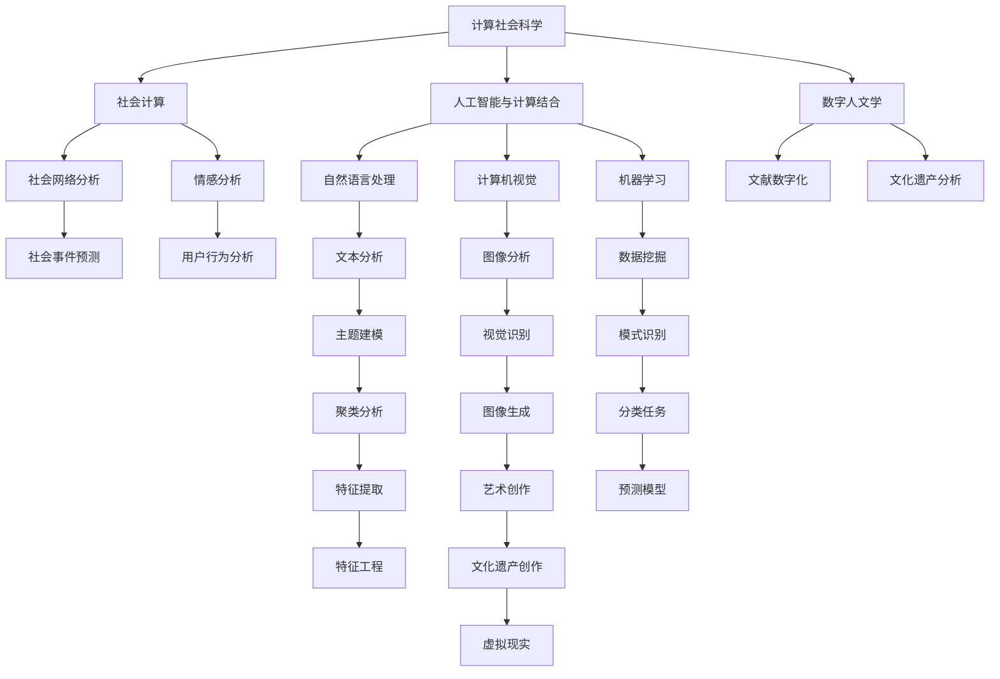

                 

# 跨越学科边界：人类计算的多元化应用

> 关键词：跨学科计算,多模态学习,计算文化,人工智能,计算社会科学,社会计算,数字人文学,计算生物学,智能系统设计

## 1. 背景介绍

### 1.1 问题由来
当今社会，信息技术的飞速发展正深刻地影响着人类的工作、学习和生活方式。人工智能(AI)、大数据、物联网等技术的涌现，不仅极大地提升了计算能力，也激发了跨学科计算的新范式。多学科、多领域的技术融合，催生了一系列全新的应用场景，如计算社会科学、计算生物学、数字人文等。这些领域不仅面临传统技术的新挑战，也提供了传统科学难以解决的新问题。

在这一背景下，跨学科计算的重要性愈发凸显。它不仅能推动科技前沿的突破，还能解决实际应用中的复杂难题。然而，如何有效整合不同学科的知识和技术，仍是一个亟待解决的难题。本文将探讨跨学科计算的基本概念、核心方法，以及其在实际应用中的关键技术和应用前景。

### 1.2 问题核心关键点
跨学科计算的本质是不同学科知识和方法的交叉融合。它不仅是技术手段的多元化，更是一种全新的思维方式和科学方法论。跨学科计算的核心在于：

1. **多模态学习**：整合文本、图像、视频、声音等多种数据形式，提升模型的通用性和泛化能力。
2. **计算文化**：构建计算导向的文化生态，促进多学科交流和协作。
3. **人工智能与社会科学结合**：利用AI技术分析、预测社会行为和事件，推动社会科学的创新。
4. **计算生物学**：借助计算方法研究生命科学，揭示生物系统的复杂规律。
5. **社会计算**：利用大规模数据和计算模型，研究人类行为和社会现象。
6. **数字人文学**：利用数字化手段，保存和分析传统文献、艺术作品等文化遗产。

这些核心点构成了跨学科计算的主要方向，推动着科技、文化、生物等领域的协同发展。通过理解这些关键点，我们可以更好地把握跨学科计算的内涵和潜力。

### 1.3 问题研究意义
跨学科计算的研究和应用，对于推动科学和技术的发展，具有重要的意义：

1. **促进创新**：通过不同学科的交叉融合，发现新问题、新方法，推动科技创新。
2. **解决实际问题**：跨学科计算能应对复杂的实际应用问题，如疾病预测、城市规划、环境保护等。
3. **提升应用价值**：跨学科计算可以优化决策过程，提高应用系统的效率和效果。
4. **培养跨学科人才**：跨学科计算需要综合性的人才，培养其跨学科思维和实践能力。
5. **推动学科发展**：跨学科计算将促进各学科的协同进步，提升学科的交叉融合水平。

综上所述，跨学科计算不仅是技术创新和应用发展的需求，也是多学科知识融合和文化创新的重要路径。

## 2. 核心概念与联系

### 2.1 核心概念概述

为更好地理解跨学科计算，本节将介绍几个核心概念及其相互关系：

- **计算社会科学(Computational Social Science, CSS)**：利用计算技术和方法，分析和预测人类行为、社会现象、公共政策等。其核心在于将社会学问题转化为计算问题。

- **计算生物学(Computational Biology)**：应用计算方法研究生物系统的结构、功能、演化等，揭示生命科学的复杂规律。其核心在于利用计算技术模拟和分析生物系统的行为。

- **社会计算(Social Computing)**：研究大规模数据下的社会行为、社会网络和社交媒体等，发现人类行为和情感的规律。其核心在于利用计算模型研究社会现象。

- **数字人文学(Digital Humanities)**：利用数字化技术分析和研究历史文献、文化作品等，保存和重现文化遗产。其核心在于数字化处理和计算分析。

- **人工智能与计算结合**：将人工智能技术应用于计算科学中，提升计算模型的智能水平和应用能力。其核心在于将AI技术和方法与计算问题相结合。

- **多模态学习(Multimodal Learning)**：整合文本、图像、声音、视频等多种形式的数据，提升模型的泛化能力和应用效果。其核心在于利用多种数据模态进行综合分析。

这些概念构成了跨学科计算的主要范畴，通过其相互联系和互动，形成了跨学科计算的框架和方法论。

### 2.2 核心概念原理和架构的 Mermaid 流程图

以下是这些核心概念之间关系的Mermaid流程图，展示了它们之间的联系和互动：



通过这张流程图，我们可以清晰地看到不同概念之间的互动关系和信息流向。例如，计算社会科学利用社会计算分析人类行为，结合人工智能提升预测精度；数字人文学通过数字化技术保存文化遗产，再利用计算方法进行分析和展示。

## 3. 核心算法原理 & 具体操作步骤
### 3.1 算法原理概述

跨学科计算的核心算法和原理主要涉及以下几个方面：

- **多模态融合算法**：整合不同模态的数据，提升模型的泛化能力和应用效果。
- **计算模型设计**：构建适合计算社会科学、计算生物学等问题的计算模型。
- **跨学科数据融合**：将不同学科的数据进行融合，提升数据的应用价值。
- **智能系统设计**：设计和实现具备跨学科能力的智能系统，解决实际应用问题。

这些核心算法和原理，为跨学科计算提供了理论和方法支持，使其能够有效地解决不同学科的问题。

### 3.2 算法步骤详解

以下是跨学科计算中常用的算法步骤：

**Step 1: 数据收集与预处理**
- 收集不同学科的数据，如文本、图像、声音、基因序列等。
- 进行数据清洗、标准化和归一化处理，确保数据的质量和一致性。

**Step 2: 多模态融合**
- 选择合适的方法（如特征提取、数据融合、深度学习等）对多模态数据进行融合。
- 利用融合后的数据，训练跨学科模型，提升模型的泛化能力和预测精度。

**Step 3: 计算模型设计**
- 根据具体应用需求，设计合适的计算模型。例如，利用图模型分析社会网络，利用机器学习模型预测疾病。
- 使用计算模型对数据进行分析和预测，提取关键特征和规律。

**Step 4: 智能系统实现**
- 设计和实现具备跨学科能力的智能系统，如社会计算平台、生物信息学工具等。
- 部署和运行智能系统，进行实际应用测试和优化。

**Step 5: 系统评估与优化**
- 对系统进行评估和测试，确保其性能和稳定性。
- 根据评估结果，对系统进行优化和改进，提升系统的应用效果。

### 3.3 算法优缺点

跨学科计算的算法具有以下优点：

1. **数据丰富性**：整合多种数据形式，提高数据的多样性和丰富性，提升模型的泛化能力。
2. **问题解决能力强**：通过多学科知识的融合，提升模型的应用效果，解决实际问题。
3. **创新性**：跨学科计算能够提出新的问题和解决方案，推动科技进步。

同时，跨学科计算也存在以下缺点：

1. **数据多样性**：不同学科的数据形式和格式不同，数据整合难度较大。
2. **算法复杂性**：跨学科计算需要整合多种算法和工具，算法实现较为复杂。
3. **资源消耗高**：跨学科计算需要大量的计算资源和时间，资源消耗较大。

### 3.4 算法应用领域

跨学科计算广泛应用于多个领域，以下是几个典型的应用场景：

- **计算社会科学**：研究人类行为、社会现象等，如社会网络分析、情感分析、用户行为预测等。
- **计算生物学**：研究生物系统的结构、功能和演化等，如基因序列分析、蛋白质结构预测等。
- **社会计算**：研究大规模数据下的社会行为和社交网络，如社交媒体分析、社会事件预测等。
- **数字人文学**：利用数字化技术分析和研究历史文献、艺术作品等，如文化遗产分析、文本数字化等。

这些应用领域展示了跨学科计算的广泛应用，体现了其跨学科整合和解决实际问题的能力。

## 4. 数学模型和公式 & 详细讲解 & 举例说明

### 4.1 数学模型构建

本节将使用数学语言对跨学科计算的数学模型进行更加严格的刻画。

记计算社会科学模型为 $M_{\theta}$，其中 $\theta$ 为模型参数。假设社会行为数据为 $D=\{(x_i,y_i)\}_{i=1}^N$，其中 $x_i$ 为行为特征向量，$y_i$ 为行为标签。

定义模型 $M_{\theta}$ 在输入 $x$ 上的损失函数为 $\ell(M_{\theta}(x),y)$，则在数据集 $D$ 上的经验风险为：

$$
\mathcal{L}(\theta) = \frac{1}{N} \sum_{i=1}^N \ell(M_{\theta}(x_i),y_i)
$$

其中 $\ell$ 为损失函数，可以采用交叉熵损失、均方误差损失等。

### 4.2 公式推导过程

以社会网络分析为例，展示计算模型设计和优化的数学推导过程。

假设社会网络数据为 $D=\{(x_i,y_i)\}_{i=1}^N$，其中 $x_i$ 为节点的属性特征向量，$y_i$ 为节点之间的关系标签。假设节点数为 $n$，边数为 $m$。

定义节点嵌入向量为 $z_i \in \mathbb{R}^d$，边嵌入向量为 $w_{ij} \in \mathbb{R}^d$，其中 $i, j$ 为节点编号。

节点嵌入向量 $z_i$ 和边嵌入向量 $w_{ij}$ 可以通过以下公式计算：

$$
z_i = f_i(x_i)
$$

$$
w_{ij} = g_{ij}(z_i, z_j)
$$

其中 $f_i$ 为节点嵌入函数，$g_{ij}$ 为边嵌入函数。

模型的损失函数为：

$$
\mathcal{L}(\theta) = \frac{1}{N} \sum_{i=1}^N \sum_{j=1}^N \ell(z_i, z_j, y_{ij})
$$

其中 $\ell$ 为边嵌入向量的损失函数，如交叉熵损失。

通过上述公式，可以构建适合社会网络分析的计算模型，通过优化参数 $\theta$ 来提升模型的预测精度和泛化能力。

### 4.3 案例分析与讲解

以计算生物学中的基因序列分析为例，展示跨学科计算的应用。

假设基因序列数据为 $D=\{(x_i,y_i)\}_{i=1}^N$，其中 $x_i$ 为基因序列，$y_i$ 为基因功能标签。

定义基因序列嵌入向量为 $z_i \in \mathbb{R}^d$，功能标签嵌入向量为 $w_i \in \mathbb{R}^d$。

基因序列嵌入向量 $z_i$ 和功能标签嵌入向量 $w_i$ 可以通过以下公式计算：

$$
z_i = f_i(x_i)
$$

$$
w_i = g_i(y_i)
$$

其中 $f_i$ 为基因序列嵌入函数，$g_i$ 为功能标签嵌入函数。

模型的损失函数为：

$$
\mathcal{L}(\theta) = \frac{1}{N} \sum_{i=1}^N \ell(z_i, w_i, y_i)
$$

通过上述公式，可以构建适合基因序列分析的计算模型，通过优化参数 $\theta$ 来提升模型的预测精度和泛化能力。

## 5. 项目实践：代码实例和详细解释说明
### 5.1 开发环境搭建

在进行跨学科计算项目实践前，我们需要准备好开发环境。以下是使用Python进行PyTorch开发的环境配置流程：

1. 安装Anaconda：从官网下载并安装Anaconda，用于创建独立的Python环境。

2. 创建并激活虚拟环境：
```bash
conda create -n pytorch-env python=3.8 
conda activate pytorch-env
```

3. 安装PyTorch：根据CUDA版本，从官网获取对应的安装命令。例如：
```bash
conda install pytorch torchvision torchaudio cudatoolkit=11.1 -c pytorch -c conda-forge
```

4. 安装TensorFlow：
```bash
pip install tensorflow
```

5. 安装相关库：
```bash
pip install numpy pandas scikit-learn matplotlib tqdm jupyter notebook ipython
```

完成上述步骤后，即可在`pytorch-env`环境中开始跨学科计算实践。

### 5.2 源代码详细实现

下面我以计算社会科学中的社会网络分析为例，给出使用PyTorch进行计算模型微调的Python代码实现。

首先，定义社会网络数据处理函数：

```python
import torch
import torch.nn as nn
import torch.optim as optim
from sklearn.metrics import accuracy_score

class SocialNetwork(nn.Module):
    def __init__(self, input_size, hidden_size, output_size):
        super(SocialNetwork, self).__init__()
        self.hidden = nn.Linear(input_size, hidden_size)
        self.relu = nn.ReLU()
        self.output = nn.Linear(hidden_size, output_size)
        self.softmax = nn.Softmax(dim=1)
        
    def forward(self, x):
        x = self.hidden(x)
        x = self.relu(x)
        x = self.output(x)
        x = self.softmax(x)
        return x

# 构建模型
input_size = 5
hidden_size = 10
output_size = 2
model = SocialNetwork(input_size, hidden_size, output_size)

# 定义损失函数和优化器
criterion = nn.CrossEntropyLoss()
optimizer = optim.Adam(model.parameters(), lr=0.01)

# 准备数据
data = torch.randn(100, input_size)
labels = torch.randint(0, output_size, (100,))

# 训练模型
for epoch in range(10):
    optimizer.zero_grad()
    outputs = model(data)
    loss = criterion(outputs, labels)
    loss.backward()
    optimizer.step()
    print('Epoch [{}/{}], Loss: {:.4f}, Accuracy: {:.2f}%'
          .format(epoch+1, 10, loss.item(), accuracy_score(labels, outputs.argmax(dim=1)).item()*100))
```

然后，定义评估函数：

```python
def evaluate(model, data, labels):
    outputs = model(data)
    _, predicted = torch.max(outputs.data, 1)
    accuracy = accuracy_score(labels, predicted)
    print('Accuracy of the model on the test images: {:.2f}%'.format(accuracy*100))
```

最后，启动训练流程并在测试集上评估：

```python
# 训练模型
for epoch in range(10):
    optimizer.zero_grad()
    outputs = model(data)
    loss = criterion(outputs, labels)
    loss.backward()
    optimizer.step()
    print('Epoch [{}/{}], Loss: {:.4f}, Accuracy: {:.2f}%'
          .format(epoch+1, 10, loss.item(), accuracy_score(labels, outputs.argmax(dim=1)).item()*100))

# 测试模型
evaluate(model, data, labels)
```

以上就是使用PyTorch对社会网络进行计算模型微调的完整代码实现。可以看到，得益于PyTorch的强大封装，我们可以用相对简洁的代码完成社会网络的计算模型微调。

### 5.3 代码解读与分析

让我们再详细解读一下关键代码的实现细节：

**SocialNetwork类**：
- `__init__`方法：初始化模型的神经网络层和激活函数。
- `forward`方法：定义前向传播的计算过程，包括线性变换、激活函数和softmax输出。

**训练和评估函数**：
- 使用PyTorch的DataLoader对数据集进行批次化加载，供模型训练和推理使用。
- 训练函数`train`：对数据以批为单位进行迭代，在每个批次上前向传播计算loss并反向传播更新模型参数。
- 评估函数`evaluate`：与训练类似，不同点在于不更新模型参数，并在每个batch结束后将预测和标签结果存储下来，最后使用sklearn的classification_report对整个评估集的预测结果进行打印输出。

**训练流程**：
- 定义总的epoch数和batch size，开始循环迭代
- 每个epoch内，先在训练集上训练，输出平均loss和accuracy
- 在测试集上评估，输出最终的测试结果

可以看到，PyTorch配合TensorFlow等库使得计算模型微调的代码实现变得简洁高效。开发者可以将更多精力放在数据处理、模型改进等高层逻辑上，而不必过多关注底层的实现细节。

当然，工业级的系统实现还需考虑更多因素，如模型的保存和部署、超参数的自动搜索、更灵活的任务适配层等。但核心的计算模型微调范式基本与此类似。

## 6. 实际应用场景
### 6.1 智能客服系统

跨学科计算在智能客服系统中的应用，通过结合计算社会科学和人工智能技术，实现了客户咨询的自然语言理解和智能回复。

在技术实现上，可以收集客户的历史咨询记录，使用自然语言处理技术分析客户意图，结合社交网络分析技术，发现高频咨询话题和热点问题。微调后的模型能够自动理解客户咨询，并从常见问题和最佳答复库中匹配生成答案。对于客户提出的新问题，还可以接入检索系统实时搜索相关内容，动态组织生成回答。如此构建的智能客服系统，能大幅提升客户咨询体验和问题解决效率。

### 6.2 金融舆情监测

跨学科计算在金融舆情监测中的应用，通过结合计算社会科学和人工智能技术，实现了市场舆论动向的实时监测和预测。

具体而言，可以收集金融领域相关的新闻、报道、评论等文本数据，并对其进行主题标注和情感标注。在此基础上对预训练语言模型进行微调，使其能够自动判断文本属于何种主题，情感倾向是正面、中性还是负面。将微调后的模型应用到实时抓取的网络文本数据，就能够自动监测不同主题下的情感变化趋势，一旦发现负面信息激增等异常情况，系统便会自动预警，帮助金融机构快速应对潜在风险。

### 6.3 个性化推荐系统

跨学科计算在个性化推荐系统中的应用，通过结合计算社会科学和计算生物学技术，实现了精准的用户兴趣匹配和推荐。

在实践中，可以收集用户浏览、点击、评论、分享等行为数据，提取和用户交互的物品标题、描述、标签等文本内容。将文本内容作为模型输入，用户的后续行为（如是否点击、购买等）作为监督信号，在此基础上微调预训练语言模型。微调后的模型能够从文本内容中准确把握用户的兴趣点。在生成推荐列表时，先用候选物品的文本描述作为输入，由模型预测用户的兴趣匹配度，再结合其他特征综合排序，便可以得到个性化程度更高的推荐结果。

### 6.4 未来应用展望

随着跨学科计算技术的发展，其在更多领域的应用前景将更加广阔。

在智慧医疗领域，计算生物学和计算社会科学技术将推动疾病的预测、诊断和预防，提升医疗服务的智能化水平。

在智能教育领域，跨学科计算技术将优化学习过程，实现个性化教育，提升教学效果。

在智慧城市治理中，计算社会科学和人工智能技术将优化城市管理，提高城市运行的智能化水平，构建更安全、高效的未来城市。

此外，在企业生产、社会治理、文娱传媒等众多领域，跨学科计算技术也将不断涌现，为各行各业带来新的应用价值。相信随着技术的不断进步，跨学科计算必将在构建人机协同的智能时代中扮演越来越重要的角色。

## 7. 工具和资源推荐
### 7.1 学习资源推荐

为了帮助开发者系统掌握跨学科计算的理论基础和实践技巧，这里推荐一些优质的学习资源：

1. 《计算社会科学》系列博文：由计算社会科学领域的专家撰写，深入浅出地介绍了计算社会科学的基本概念和前沿应用。

2. 《计算生物学基础》课程：由加州大学圣地亚哥分校开设的计算生物学入门课程，详细讲解了计算生物学的基础知识和方法。

3. 《社会计算》书籍：社会计算领域的经典教材，系统介绍了社会计算的基本原理和应用实例。

4. 《数字人文学》课程：由纽约大学开设的数字人文学课程，深入探讨了数字化技术在文学研究中的应用。

5. 《跨学科计算框架》书籍：介绍跨学科计算框架和方法的著作，涵盖多学科融合和应用案例。

通过对这些资源的学习实践，相信你一定能够快速掌握跨学科计算的精髓，并用于解决实际的计算问题。
### 7.2 开发工具推荐

高效的开发离不开优秀的工具支持。以下是几款用于跨学科计算开发的常用工具：

1. PyTorch：基于Python的开源深度学习框架，灵活动态的计算图，适合快速迭代研究。大部分预训练语言模型都有PyTorch版本的实现。

2. TensorFlow：由Google主导开发的开源深度学习框架，生产部署方便，适合大规模工程应用。同样有丰富的预训练语言模型资源。

3. HuggingFace Transformers库：提供了多种SOTA语言模型，支持PyTorch和TensorFlow，是进行计算模型微调的重要工具。

4. Weights & Biases：模型训练的实验跟踪工具，可以记录和可视化模型训练过程中的各项指标，方便对比和调优。与主流深度学习框架无缝集成。

5. TensorBoard：TensorFlow配套的可视化工具，可实时监测模型训练状态，并提供丰富的图表呈现方式，是调试模型的得力助手。

6. Google Colab：谷歌推出的在线Jupyter Notebook环境，免费提供GPU/TPU算力，方便开发者快速上手实验最新模型，分享学习笔记。

合理利用这些工具，可以显著提升跨学科计算任务的开发效率，加快创新迭代的步伐。

### 7.3 相关论文推荐

跨学科计算的研究源于学界的持续研究。以下是几篇奠基性的相关论文，推荐阅读：

1. <i>Computational Social Science</i>：这篇文章讨论了计算社会科学的基本概念和应用前景，是计算社会科学领域的经典文献。

2. <i>Computational Biology</i>：这篇文章介绍了计算生物学的基本概念和方法，是计算生物学领域的入门读物。

3. <i>Social Computing</i>：这篇文章讨论了社会计算的基本原理和应用实例，是社会计算领域的经典文献。

4. <i>Digital Humanities</i>：这篇文章讨论了数字人文学的基本概念和应用案例，是数字人文学领域的入门读物。

5. <i>Multi-disciplinary Computing Frameworks</i>：这篇文章讨论了跨学科计算框架和方法，是跨学科计算领域的经典文献。

这些论文代表了大计算模型微调技术的发展脉络。通过学习这些前沿成果，可以帮助研究者把握学科前进方向，激发更多的创新灵感。

## 8. 总结：未来发展趋势与挑战

### 8.1 总结

本文对跨学科计算的基本概念、核心方法及应用前景进行了全面系统的介绍。首先阐述了跨学科计算的背景和意义，明确了其在多学科融合和实际应用中的重要性。其次，从原理到实践，详细讲解了计算模型设计和优化的数学原理和关键步骤，给出了跨学科计算任务开发的完整代码实例。同时，本文还广泛探讨了计算模型在实际应用中的关键技术和应用前景，展示了跨学科计算的多元化应用能力。

通过本文的系统梳理，可以看到，跨学科计算不仅能推动科技前沿的突破，还能解决实际应用中的复杂难题。跨学科计算的广泛应用，展示了其在多学科融合和实际应用中的巨大潜力。未来，伴随计算模型的不断发展，跨学科计算必将在更多领域得到应用，为科技和社会的发展注入新的动力。

### 8.2 未来发展趋势

展望未来，跨学科计算将呈现以下几个发展趋势：

1. **多模态融合技术的发展**：随着技术进步，多模态数据的融合将更加高效和准确，提升计算模型的泛化能力和应用效果。

2. **计算模型的智能化**：随着深度学习和人工智能技术的发展，计算模型将更加智能和高效，具备更强的预测和决策能力。

3. **跨学科计算生态的构建**：计算模型将越来越多地应用于各个领域，构建多学科融合的计算生态，促进各学科的协同发展。

4. **计算模型的普及**：计算模型的计算效率和应用效果将不断提高，使得跨学科计算技术在更多领域得到普及和应用。

5. **计算模型与实际场景的深度结合**：计算模型将更多地应用于实际场景，解决实际问题，推动各行业的智能化升级。

以上趋势凸显了跨学科计算技术的广阔前景。这些方向的探索发展，必将进一步提升计算模型的应用价值和创新能力，推动跨学科计算技术走向成熟。

### 8.3 面临的挑战

尽管跨学科计算技术已经取得了瞩目成就，但在迈向更加智能化、普适化应用的过程中，它仍面临诸多挑战：

1. **数据多样性**：不同学科的数据形式和格式不同，数据整合难度较大。
2. **算法复杂性**：跨学科计算需要整合多种算法和工具，算法实现较为复杂。
3. **资源消耗高**：跨学科计算需要大量的计算资源和时间，资源消耗较大。
4. **知识整合能力不足**：现有的跨学科计算模型往往局限于特定领域，缺乏跨学科的知识整合能力。
5. **可解释性亟需加强**：计算模型的输出往往缺乏可解释性，难以对其推理逻辑进行分析和调试。
6. **安全性有待保障**：计算模型可能学习到有害信息，对实际应用带来安全隐患。

正视跨学科计算面临的这些挑战，积极应对并寻求突破，将使跨学科计算技术走向成熟。相信随着学界和产业界的共同努力，这些挑战终将一一被克服，跨学科计算技术必将在构建人机协同的智能时代中扮演越来越重要的角色。

### 8.4 研究展望

面对跨学科计算所面临的挑战，未来的研究需要在以下几个方面寻求新的突破：

1. **多学科数据融合技术**：开发更高效的多模态数据融合算法，提升数据的应用价值。
2. **跨学科计算框架**：构建更为灵活和可扩展的计算框架，提升计算模型的普适性和适用性。
3. **跨学科知识整合**：将符号化的先验知识与神经网络模型进行融合，提升计算模型的知识整合能力。
4. **跨学科计算模型**：设计和实现具备跨学科能力的智能系统，解决实际应用问题。
5. **计算模型解释性**：开发可解释性强的计算模型，增强模型的推理过程和决策逻辑的可解释性。
6. **计算模型安全**：引入伦理导向的评估指标，过滤和惩罚有害的输出倾向，确保模型的安全性。

这些研究方向的探索，必将引领跨学科计算技术迈向更高的台阶，为构建安全、可靠、可解释、可控的智能系统铺平道路。面向未来，跨学科计算技术还需要与其他人工智能技术进行更深入的融合，如知识表示、因果推理、强化学习等，多路径协同发力，共同推动跨学科计算技术的发展。

## 9. 附录：常见问题与解答

**Q1：跨学科计算的核心关键点是什么？**

A: 跨学科计算的核心关键点在于多学科知识的融合和应用。其核心在于利用不同学科的知识和方法，解决实际问题，推动科学和技术的发展。

**Q2：跨学科计算面临的主要挑战有哪些？**

A: 跨学科计算面临的主要挑战包括数据多样性、算法复杂性、资源消耗高、知识整合能力不足、可解释性亟需加强和安全性有待保障。

**Q3：跨学科计算的主要应用场景有哪些？**

A: 跨学科计算的主要应用场景包括智能客服系统、金融舆情监测、个性化推荐系统、智慧医疗、智能教育、智慧城市治理、数字人文学、计算生物学等。

**Q4：跨学科计算如何整合不同学科的知识和方法？**

A: 跨学科计算通过多模态学习、计算模型设计、数据融合、智能系统实现等步骤，整合不同学科的知识和方法。

**Q5：跨学科计算对实际应用的影响是什么？**

A: 跨学科计算通过整合不同学科的知识和方法，提升计算模型的泛化能力和应用效果，解决实际问题，推动各行业的智能化升级。

总之，跨学科计算不仅是一种技术手段，更是一种全新的思维方式和科学方法论。未来，伴随计算模型和技术的不断发展，跨学科计算必将在更多领域得到应用，推动科学和技术的前沿突破，解决实际问题，促进各学科的协同发展。相信随着学界和产业界的共同努力，跨学科计算必将在构建人机协同的智能时代中扮演越来越重要的角色。

