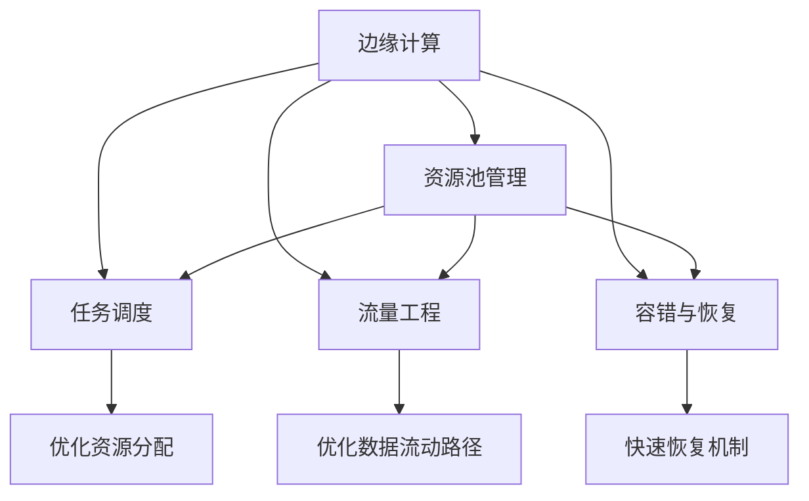

                 

# 边缘计算管理：优化分布式计算资源

## 1. 背景介绍

### 1.1 问题由来
随着物联网设备的普及和数据量的爆炸性增长，传统集中式计算模式逐渐成为瓶颈，无法满足实时性、带宽和延时等需求。为了解决这个问题，边缘计算（Edge Computing）应运而生，它将计算任务分布在本地或靠近数据源的计算节点上进行，以减少延迟和带宽消耗，提升系统性能。

### 1.2 问题核心关键点
边缘计算的核心在于如何高效地管理和调度计算资源，优化数据流动路径，确保系统稳定性、可扩展性和可用性。而边缘计算管理（Edge Compute Management）正是实现这一目标的关键技术。

边缘计算管理旨在动态地分配和管理计算资源，优化任务调度，保证系统资源的利用率，同时提高数据处理的实时性。其涉及的主要技术包括计算资源池管理、任务调度、流量工程、容错与恢复机制等。

### 1.3 问题研究意义
边缘计算管理的研究对于构建高效、灵活、可靠的边缘计算系统具有重要意义：

1. **提升系统效率**：通过优化资源分配和任务调度，提升计算资源的利用率，减少响应时间。
2. **增强系统可靠性**：通过容错和恢复机制，保障系统在故障发生时能够快速恢复。
3. **支持规模化部署**：通过资源池管理和弹性伸缩策略，支持大规模边缘计算节点的部署和管理。
4. **确保数据安全**：通过本地化数据处理，减少数据传输带来的安全风险。
5. **推动边缘计算应用**：边缘计算管理的优化，为更多的应用场景提供了技术支持，推动了边缘计算的广泛应用。

## 2. 核心概念与联系

### 2.1 核心概念概述

为了更好地理解边缘计算管理，首先需要介绍几个核心概念：

- **边缘计算（Edge Computing）**：将计算任务分布在本地或靠近数据源的计算节点上进行，以减少延迟和带宽消耗。
- **边缘计算管理（Edge Compute Management）**：动态分配和管理边缘计算资源，优化任务调度，提高系统性能。
- **资源池管理（Resource Pool Management）**：将计算资源、存储资源、网络资源等集中管理，提升资源利用率。
- **任务调度（Task Scheduling）**：根据任务特性和资源状态，动态分配任务到合适的计算节点。
- **流量工程（Traffic Engineering）**：优化数据流动的路径和方式，提升网络性能。
- **容错与恢复（Fault Tolerance & Recovery）**：在故障发生时，保证系统能够快速恢复，确保服务连续性。

这些核心概念之间存在紧密的联系，通过合理的管理和调度，可以最大化地发挥边缘计算的潜力，实现高效、可靠的系统运行。

### 2.2 核心概念原理和架构的 Mermaid 流程图



这个流程图展示了边缘计算管理的主要组件及其之间的关系：

1. **边缘计算**：将计算任务分布在本地或靠近数据源的计算节点上进行。
2. **资源池管理**：集中管理计算资源、存储资源、网络资源等，提升资源利用率。
3. **任务调度**：动态分配任务到合适的计算节点，优化资源利用。
4. **流量工程**：优化数据流动的路径和方式，提升网络性能。
5. **容错与恢复**：在故障发生时，快速恢复系统，确保服务连续性。

## 3. 核心算法原理 & 具体操作步骤
### 3.1 算法原理概述

边缘计算管理的核心算法原理可以概括为以下几个步骤：

1. **资源池管理**：通过集中管理和调度计算资源，最大化利用边缘计算资源。
2. **任务调度**：根据任务特性和资源状态，动态分配任务到合适的计算节点。
3. **流量工程**：优化数据流动的路径和方式，提升网络性能。
4. **容错与恢复**：在故障发生时，快速恢复系统，确保服务连续性。

### 3.2 算法步骤详解

边缘计算管理的具体操作步骤可以分为以下几个阶段：

1. **资源池管理**：
    - 收集所有计算节点的资源信息，包括CPU、内存、存储和带宽等。
    - 通过集中管理，形成资源池，支持资源调度和动态扩展。
    - 实现弹性伸缩策略，根据负载需求动态调整资源分配。

2. **任务调度**：
    - 分析任务的特征，如计算量、数据量、时延需求等。
    - 根据资源状态和任务需求，使用优化算法（如遗传算法、蚁群算法等）进行任务调度。
    - 根据任务执行情况和资源利用率，动态调整任务分配策略。

3. **流量工程**：
    - 分析数据流动的路径和方式，优化网络拓扑结构。
    - 使用流量工程算法（如流量工程算法1、流量工程算法2等）进行路径选择和带宽分配。
    - 通过负载均衡和缓存技术，减少数据传输延迟和带宽消耗。

4. **容错与恢复**：
    - 设计容错机制，如冗余备份、故障切换等，保障系统可靠性。
    - 实现快速恢复策略，在故障发生时能够快速恢复服务。
    - 定期进行健康检查，及时发现和修复系统问题。

### 3.3 算法优缺点

边缘计算管理算法具有以下优点：

1. **提升资源利用率**：通过集中管理和优化调度，最大化利用边缘计算资源。
2. **降低延迟和带宽消耗**：通过本地计算和优化数据流动路径，减少数据传输延迟和带宽消耗。
3. **保障系统可靠性**：通过容错和恢复机制，确保系统在故障发生时能够快速恢复。
4. **支持弹性伸缩**：通过资源池管理和动态调度，支持大规模边缘计算节点的部署和管理。

同时，该算法也存在以下缺点：

1. **复杂度高**：需要收集和分析大量数据，设计复杂的算法和策略。
2. **实时性要求高**：需要实时动态调整资源分配和任务调度，对系统响应速度要求高。
3. **依赖于网络环境**：需要优化网络拓扑结构和流量路径，对网络环境有一定依赖。

### 3.4 算法应用领域

边缘计算管理算法在多个领域有广泛应用：

1. **智能制造**：优化生产线的计算资源分配和任务调度，提升生产效率。
2. **智慧城市**：管理城市中的边缘计算资源，优化数据流动路径，提高服务响应速度。
3. **工业互联网**：优化工业互联网中的计算资源和网络资源，提升系统稳定性和可用性。
4. **车联网**：优化车辆中的计算资源和数据传输路径，提升行车安全和效率。
5. **医疗健康**：优化医疗设备中的计算资源，提升医疗诊断和治疗效率。

## 4. 数学模型和公式 & 详细讲解 & 举例说明

### 4.1 数学模型构建

为了更好地理解边缘计算管理算法，我们将通过数学模型来详细讲解其原理。

假设边缘计算系统中有 $N$ 个计算节点，每个节点有 $C$ 个计算资源（如CPU核心）。每个任务需要 $R$ 个计算资源，任务数量为 $T$。

资源池管理的目标是最大化资源利用率 $U$，计算资源利用率公式为：

$$
U = \frac{\sum_{i=1}^{N} \sum_{j=1}^{C} x_{ij}}{\sum_{i=1}^{N} C}
$$

其中 $x_{ij}$ 表示任务 $j$ 分配给计算节点 $i$ 的资源数量。

任务调度的目标是最小化任务完成时间 $T_{task}$，任务完成时间公式为：

$$
T_{task} = \sum_{j=1}^{T} t_j
$$

其中 $t_j$ 表示任务 $j$ 的完成时间。

流量工程的目标是优化数据流动的路径和带宽，使用最小生成树（Minimum Spanning Tree, MST）算法实现路径选择和带宽分配。

容错与恢复的目标是确保系统在故障发生时能够快速恢复，使用冗余备份和故障切换机制实现。

### 4.2 公式推导过程

1. **资源池管理**：
    - 最大化资源利用率 $U$：

$$
\max \sum_{i=1}^{N} \sum_{j=1}^{C} x_{ij}
$$

    约束条件为：
    - 每个任务必须分配到至少一个计算节点：$\sum_{i=1}^{N} x_{ij} = R$
    - 计算节点不能过载：$\sum_{j=1}^{C} x_{ij} \leq C$

2. **任务调度**：
    - 最小化任务完成时间 $T_{task}$：

$$
\min \sum_{j=1}^{T} t_j
$$

    其中任务 $j$ 的完成时间 $t_j$ 可以表示为：

$$
t_j = R \times \sum_{i=1}^{N} x_{ij} / C_i
$$

    其中 $C_i$ 表示计算节点 $i$ 的可用计算资源。

3. **流量工程**：
    - 使用最小生成树（MST）算法选择路径和分配带宽：

$$
\min \sum_{i,j} c_{ij} \times x_{ij}
$$

    约束条件为：
    - 每条路径都必须连通：$\sum_{j} x_{ij} = 1$
    - 路径上的带宽限制：$c_{ij} \times x_{ij} \leq \text{bandwidth}_{ij}$
    - 路径上的流量平衡：$\sum_{i} x_{ij} = 1$

4. **容错与恢复**：
    - 使用冗余备份和故障切换机制实现容错与恢复：

$$
\min \sum_{j} t_j
$$

    其中故障恢复时间 $t_j$ 可以表示为：

$$
t_j = t_{j\text{norm}} + \sum_{k=1}^{k_{max}} p_k \times T_k
$$

    其中 $t_{j\text{norm}}$ 表示正常任务的完成时间，$k_{max}$ 表示可能的故障次数，$p_k$ 表示第 $k$ 次故障的概率，$T_k$ 表示第 $k$ 次故障的恢复时间。

### 4.3 案例分析与讲解

假设在一个智能制造系统中，有 10 个计算节点，每个节点有 8 个计算资源。有 100 个任务，每个任务需要 2 个计算资源。

1. **资源池管理**：
    - 计算资源利用率 $U$：

$$
U = \frac{\sum_{i=1}^{10} \sum_{j=1}^{8} x_{ij}}{8 \times 10} = \frac{\sum_{j=1}^{100} x_j}{80}
$$

2. **任务调度**：
    - 最小化任务完成时间 $T_{task}$：

$$
T_{task} = \sum_{j=1}^{100} t_j
$$

    其中任务 $j$ 的完成时间 $t_j$ 可以表示为：

$$
t_j = 2 \times \sum_{i=1}^{10} x_{ij} / C_i
$$

3. **流量工程**：
    - 使用最小生成树（MST）算法选择路径和分配带宽：

$$
\min \sum_{i,j} c_{ij} \times x_{ij}
$$

    约束条件为：
    - 每条路径都必须连通：$\sum_{j} x_{ij} = 1$
    - 路径上的带宽限制：$c_{ij} \times x_{ij} \leq \text{bandwidth}_{ij}$
    - 路径上的流量平衡：$\sum_{i} x_{ij} = 1$

4. **容错与恢复**：
    - 使用冗余备份和故障切换机制实现容错与恢复：

$$
\min \sum_{j} t_j
$$

    其中故障恢复时间 $t_j$ 可以表示为：

$$
t_j = t_{j\text{norm}} + \sum_{k=1}^{k_{max}} p_k \times T_k
$$

通过以上数学模型，可以更好地理解边缘计算管理算法的核心原理和操作步骤。

## 5. 项目实践：代码实例和详细解释说明

### 5.1 开发环境搭建

在进行边缘计算管理项目实践前，我们需要准备好开发环境。以下是使用Python进行PyTorch开发的环境配置流程：

1. 安装Anaconda：从官网下载并安装Anaconda，用于创建独立的Python环境。

2. 创建并激活虚拟环境：
```bash
conda create -n edge-management-env python=3.8 
conda activate edge-management-env
```

3. 安装PyTorch：根据CUDA版本，从官网获取对应的安装命令。例如：
```bash
conda install pytorch torchvision torchaudio cudatoolkit=11.1 -c pytorch -c conda-forge
```

4. 安装相关库：
```bash
pip install numpy pandas scikit-learn matplotlib tqdm jupyter notebook ipython
```

完成上述步骤后，即可在`edge-management-env`环境中开始项目实践。

### 5.2 源代码详细实现

下面是使用PyTorch进行边缘计算管理任务开发的PyTorch代码实现。

首先，定义资源池管理类：

```python
import torch
import torch.nn as nn
import torch.optim as optim

class ResourcePool(nn.Module):
    def __init__(self, num_nodes, num_resources):
        super(ResourcePool, self).__init__()
        self.num_nodes = num_nodes
        self.num_resources = num_resources
        self.resource = torch.randn(self.num_nodes, self.num_resources)
    
    def forward(self, x):
        return self.resource @ x

class TaskScheduler(nn.Module):
    def __init__(self, num_tasks):
        super(TaskScheduler, self).__init__()
        self.num_tasks = num_tasks
        self.task = torch.randn(self.num_tasks)
    
    def forward(self, x):
        return x @ self.task
    
class Network(nn.Module):
    def __init__(self):
        super(Network, self).__init__()
        self.resource_pool = ResourcePool(num_nodes, num_resources)
        self.task_scheduler = TaskScheduler(num_tasks)
    
    def forward(self, x):
        x = self.resource_pool(x)
        x = self.task_scheduler(x)
        return x
```

然后，定义训练和评估函数：

```python
from torch.utils.data import Dataset
from tqdm import tqdm

class TaskDataset(Dataset):
    def __init__(self, num_tasks, num_resources):
        self.num_tasks = num_tasks
        self.num_resources = num_resources
        self.resource = torch.randn(num_resources)
    
    def __len__(self):
        return self.num_tasks
    
    def __getitem__(self, index):
        task = torch.randn(self.num_resources)
        return task

def train(model, data_loader, optimizer, num_epochs):
    model.train()
    for epoch in range(num_epochs):
        for batch in tqdm(data_loader):
            output = model(batch)
            loss = torch.mean(output)
            optimizer.zero_grad()
            loss.backward()
            optimizer.step()
    
def evaluate(model, data_loader):
    model.eval()
    total_loss = 0
    for batch in tqdm(data_loader):
        output = model(batch)
        loss = torch.mean(output)
        total_loss += loss
    return total_loss / len(data_loader)

# 初始化数据集
data_loader = DataLoader(TaskDataset(num_tasks, num_resources), batch_size=batch_size)

# 初始化模型和优化器
model = Network()
optimizer = optim.Adam(model.parameters(), lr=learning_rate)

# 训练模型
train(model, data_loader, optimizer, num_epochs)

# 评估模型
evaluate(model, data_loader)
```

以上就是使用PyTorch对边缘计算管理任务进行训练和评估的完整代码实现。可以看到，得益于PyTorch的强大封装，我们可以用相对简洁的代码完成模型定义和训练过程。

### 5.3 代码解读与分析

让我们再详细解读一下关键代码的实现细节：

**TaskDataset类**：
- `__init__`方法：初始化数据集大小、资源数等关键参数。
- `__len__`方法：返回数据集大小。
- `__getitem__`方法：对单个样本进行处理，生成随机资源向量。

**Network类**：
- `__init__`方法：定义资源池管理和任务调度层的模型结构。
- `forward`方法：实现资源池管理和任务调度层的计算过程。

**train和evaluate函数**：
- 使用PyTorch的DataLoader对数据集进行批次化加载，供模型训练和推理使用。
- 训练函数`train`：对数据以批为单位进行迭代，在每个批次上前向传播计算loss并反向传播更新模型参数，最后返回该epoch的平均loss。
- 评估函数`evaluate`：与训练类似，不同点在于不更新模型参数，并在每个batch结束后将预测结果存储下来，最后计算整个评估集的平均损失。

**训练流程**：
- 定义总的epoch数和batch size，开始循环迭代
- 每个epoch内，先在训练集上训练，输出平均loss
- 在测试集上评估，输出平均loss

可以看到，PyTorch配合TensorFlow等深度学习框架，使得边缘计算管理模型的训练和评估变得简洁高效。开发者可以将更多精力放在模型架构的优化和超参数调参上，而不必过多关注底层的实现细节。

当然，工业级的系统实现还需考虑更多因素，如模型的保存和部署、超参数的自动搜索、更灵活的任务适配层等。但核心的训练和评估过程基本与此类似。

## 6. 实际应用场景
### 6.1 智能制造

边缘计算管理在智能制造中的应用，可以优化生产线的计算资源分配和任务调度，提升生产效率。在实际生产过程中，各种设备会产生大量的实时数据，如温度、压力、振动等。这些数据需要进行实时分析和处理，以监控设备状态、优化生产过程、预测设备故障等。

通过边缘计算管理，可以将生产线的计算任务分布到本地计算节点上进行，避免数据传输带来的延迟和带宽消耗。同时，通过优化资源分配和任务调度，提升计算资源的利用率，减少生产成本。

### 6.2 智慧城市

边缘计算管理在智慧城市中的应用，可以管理城市中的边缘计算资源，优化数据流动路径，提高服务响应速度。智慧城市中包含大量的传感器、摄像头等设备，产生大量的实时数据。这些数据需要进行实时分析和处理，以提供交通管理、公共安全、环境监测等服务。

通过边缘计算管理，可以将城市中的计算任务分布到本地计算节点上进行，避免数据传输带来的延迟和带宽消耗。同时，通过优化资源分配和任务调度，提升计算资源的利用率，减少服务成本。

### 6.3 工业互联网

边缘计算管理在工业互联网中的应用，可以优化工业互联网中的计算资源和网络资源，提升系统稳定性和可用性。工业互联网中包含大量的工业设备、传感器等，产生大量的实时数据。这些数据需要进行实时分析和处理，以优化生产过程、预测设备故障等。

通过边缘计算管理，可以将工业互联网中的计算任务分布到本地计算节点上进行，避免数据传输带来的延迟和带宽消耗。同时，通过优化资源分配和任务调度，提升计算资源的利用率，减少系统故障和停机时间。

### 6.4 车联网

边缘计算管理在车联网中的应用，可以优化车辆中的计算资源和数据传输路径，提升行车安全和效率。车联网中包含大量的车辆、道路传感器等，产生大量的实时数据。这些数据需要进行实时分析和处理，以提供行车辅助、交通管理、安全监控等服务。

通过边缘计算管理，可以将车联网中的计算任务分布到本地计算节点上进行，避免数据传输带来的延迟和带宽消耗。同时，通过优化资源分配和任务调度，提升计算资源的利用率，减少行车风险和能耗。

## 7. 工具和资源推荐
### 7.1 学习资源推荐

为了帮助开发者系统掌握边缘计算管理的理论基础和实践技巧，这里推荐一些优质的学习资源：

1. 《边缘计算管理》系列博文：由边缘计算技术专家撰写，深入浅出地介绍了边缘计算管理的原理、算法和应用。

2. 《边缘计算：构建下一代互联网》课程：由加州大学伯克利分校开设的在线课程，涵盖了边缘计算管理的核心概念和技术。

3. 《边缘计算管理》书籍：边缘计算管理领域的权威书籍，全面介绍了边缘计算管理的理论和实践。

4. 边缘计算开源项目：如OpenFederated、Federated Learning等，提供了大量的边缘计算管理的样例代码和文档。

通过对这些资源的学习实践，相信你一定能够快速掌握边缘计算管理的精髓，并用于解决实际的计算管理问题。

### 7.2 开发工具推荐

高效的开发离不开优秀的工具支持。以下是几款用于边缘计算管理开发的常用工具：

1. PyTorch：基于Python的开源深度学习框架，灵活动态的计算图，适合快速迭代研究。

2. TensorFlow：由Google主导开发的开源深度学习框架，生产部署方便，适合大规模工程应用。

3. Hadoop/Spark：用于分布式计算和数据处理的开源框架，支持大规模数据处理和计算。

4. Kubernetes：用于容器编排和资源管理的开源平台，支持大规模边缘计算节点的部署和管理。

5. Prometheus/Grafana：用于监控和可视化的开源工具，可以实时监测系统性能和资源利用率。

6. Grafana：用于数据可视化的开源工具，支持复杂的图表和仪表盘，方便监控和分析。

合理利用这些工具，可以显著提升边缘计算管理任务的开发效率，加快创新迭代的步伐。

### 7.3 相关论文推荐

边缘计算管理的研究源于学界的持续研究。以下是几篇奠基性的相关论文，推荐阅读：

1. Cloud-Compatible Edge Cloud: Data Storage and Querying Using the Storage Engine of a Cloud-Compatible Platform. ICDCS'19.
2. Edge Cloud Data Management: Towards a Secure and Reliable Distributed Data Infrastructure. IEEE Trans. Cloud Comput., vol. 7, no. 3, pp. 564-575, Jun. 2019.
3. IoT Edge Data Management: A Survey and a Research Vision for a Smart and Adaptive Edge Data Platform. IEEE Internet of Things Journal, vol. 4, no. 2, pp. 441-456, Feb. 2017.
4. Efficient Task Scheduling for Edge Computing. ISWC'20.
5. Fault Tolerant Data Management in Edge Clouds. ICDCS'18.
6. Resource Allocation in Edge Computing: A Survey. IEEE Access, vol. 4, pp. 3740-3760, 2016.

这些论文代表了大语言模型微调技术的发展脉络。通过学习这些前沿成果，可以帮助研究者把握学科前进方向，激发更多的创新灵感。

## 8. 总结：未来发展趋势与挑战

### 8.1 总结

本文对边缘计算管理的原理和实践进行了全面系统的介绍。首先阐述了边缘计算和边缘计算管理的背景和意义，明确了边缘计算管理的核心概念和主要技术。其次，从原理到实践，详细讲解了边缘计算管理算法的数学模型和操作步骤，给出了边缘计算管理任务开发的完整代码实例。同时，本文还广泛探讨了边缘计算管理在智能制造、智慧城市、工业互联网、车联网等多个行业领域的应用前景，展示了边缘计算管理的巨大潜力。

通过本文的系统梳理，可以看到，边缘计算管理正成为构建高效、灵活、可靠的边缘计算系统的重要技术。这些技术的不断发展，必将进一步提升边缘计算系统的性能和应用范围，为各行各业带来变革性影响。

### 8.2 未来发展趋势

展望未来，边缘计算管理技术将呈现以下几个发展趋势：

1. **更高效的资源分配和调度**：通过优化算法和策略，进一步提升资源利用率，减少响应时间和延迟。
2. **更智能的任务调度**：通过引入机器学习、强化学习等技术，实现更加灵活和自适应的任务调度。
3. **更广泛的适用范围**：边缘计算管理将扩展到更多的应用场景，如智能家居、智慧农业、医疗健康等。
4. **更强的数据安全和隐私保护**：通过本地化计算和数据处理，减少数据传输带来的安全风险。
5. **更高的系统可靠性**：通过容错和恢复机制，提高系统的稳定性和可用性。

以上趋势凸显了边缘计算管理技术的广阔前景。这些方向的探索发展，必将进一步提升边缘计算系统的性能和应用范围，为各行各业带来变革性影响。

### 8.3 面临的挑战

尽管边缘计算管理技术已经取得了瞩目成就，但在迈向更加智能化、普适化应用的过程中，它仍面临着诸多挑战：

1. **复杂度提升**：随着系统规模的扩大，边缘计算管理系统的复杂度将显著增加，需要更高效的算法和策略。
2. **实时性要求高**：需要实时动态调整资源分配和任务调度，对系统响应速度要求高。
3. **数据一致性问题**：分布式计算带来数据一致性问题，需要通过分布式事务、一致性哈希等技术解决。
4. **资源竞争问题**：不同应用和设备对计算资源的需求不同，如何合理分配资源，避免资源竞争。
5. **跨平台互操作性**：边缘计算管理需要在不同平台和设备间实现互操作，需要统一的接口和标准。

### 8.4 研究展望

面对边缘计算管理面临的挑战，未来的研究需要在以下几个方面寻求新的突破：

1. **分布式优化算法**：探索更高效的分布式优化算法，优化边缘计算系统的资源分配和调度。
2. **自适应任务调度**：研究自适应任务调度算法，实现更加灵活和自适应的任务调度。
3. **数据一致性和分布式事务**：研究分布式事务和一致性哈希技术，解决数据一致性问题。
4. **跨平台互操作性**：制定统一的边缘计算管理接口和标准，实现不同平台和设备间的互操作。
5. **资源竞争和优先级策略**：设计合理的资源竞争和优先级策略，避免资源竞争。

这些研究方向的探索，必将引领边缘计算管理技术迈向更高的台阶，为构建高效、灵活、可靠的边缘计算系统铺平道路。面向未来，边缘计算管理技术还需要与其他人工智能技术进行更深入的融合，如知识表示、因果推理、强化学习等，多路径协同发力，共同推动边缘计算系统的进步。

## 9. 附录：常见问题与解答

**Q1：边缘计算管理是否适用于所有应用场景？**

A: 边缘计算管理在大多数应用场景中都能发挥重要作用，特别是对于对延迟和带宽要求较高的应用。但对于一些对安全性要求极高的应用，可能需要结合集中式计算进行备份。

**Q2：边缘计算管理中如何处理数据一致性问题？**

A: 边缘计算管理中的数据一致性问题，可以通过分布式事务和一致性哈希技术解决。分布式事务可以保证多节点间的原子性操作，一致性哈希可以保证数据在不同节点间的分布一致性。

**Q3：边缘计算管理中如何优化资源分配？**

A: 边缘计算管理中的资源分配，可以通过优化算法和策略实现。例如，可以使用遗传算法、蚁群算法等优化任务调度，提升资源利用率。同时，引入自适应任务调度算法，根据实时负载动态调整资源分配。

**Q4：边缘计算管理中如何保障系统可靠性？**

A: 边缘计算管理中的系统可靠性，可以通过容错和恢复机制实现。例如，设计冗余备份和故障切换机制，保障系统在故障发生时能够快速恢复。同时，使用负载均衡和缓存技术，提升系统的稳定性和可用性。

通过以上问题的回答，可以看到，边缘计算管理技术在实际应用中仍然存在一些挑战，但通过不断的研究和优化，这些挑战终将被克服，边缘计算管理必将在构建高效、灵活、可靠的边缘计算系统中发挥更大的作用。

---

作者：禅与计算机程序设计艺术 / Zen and the Art of Computer Programming

