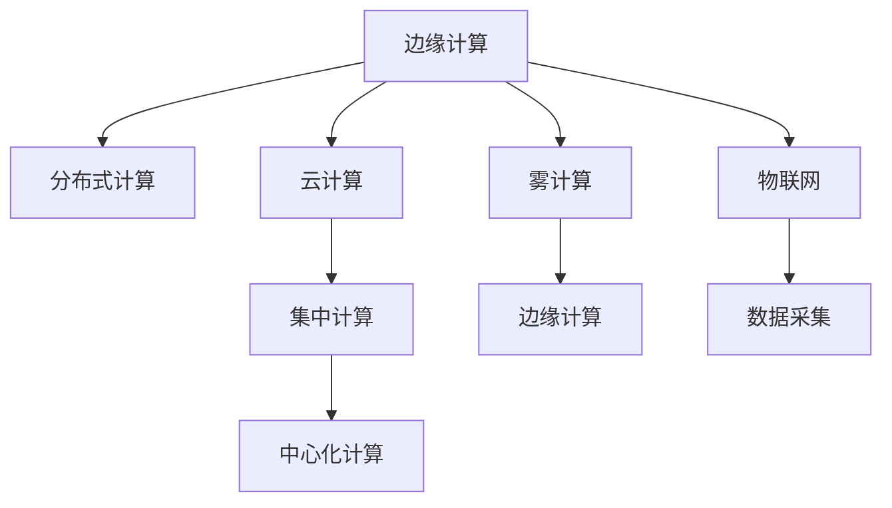

                 

# 边缘计算：分布式计算的新范式

## 1. 背景介绍

### 1.1 问题由来

随着互联网和物联网技术的飞速发展，全球数据量呈指数级增长。海量数据的产生和处理对于计算资源的需求也越来越大，传统中心化计算模式面临巨大挑战。中心化的数据中心不仅需要消耗大量的电力和冷却成本，还需要构建和维护大量的物理基础设施，同时，数据传输过程中还存在较大的延迟和带宽压力。

为了应对这些问题，边缘计算（Edge Computing）应运而生。边缘计算将计算资源和服务下沉到靠近数据源的本地设备或边缘设备中，可以显著缩短数据传输距离，提高处理效率，降低能耗和成本。边缘计算作为分布式计算的一种新范式，正在改变数据处理、应用开发和云服务运营模式，成为云计算体系的重要组成部分。

### 1.2 问题核心关键点

边缘计算的本质是通过将计算资源和服务下放到边缘节点，实现数据的本地处理和优化。其核心关键点包括：

1. **数据就近处理**：边缘设备可以更快速地响应和处理本地数据，减少延迟，提升用户体验。
2. **带宽优化**：边缘计算通过本地处理和存储，减少了数据传输量，降低了网络带宽需求。
3. **增强安全性**：边缘设备通常具有更高的数据隐私和安全保障能力，能够更好地保护用户隐私。
4. **降低延迟**：数据在本地处理，减少了远程服务器之间的传输时间，提高了实时性。

## 2. 核心概念与联系

### 2.1 核心概念概述

为更好地理解边缘计算的原理和应用，本节将介绍几个关键核心概念：

- **边缘计算（Edge Computing）**：指将计算资源和服务部署在数据源附近，利用网络边缘的计算能力和存储资源，实现数据的本地处理和优化，以降低延迟和带宽成本，提升应用性能和用户体验。

- **分布式计算（Distributed Computing）**：指通过分布式系统将计算任务分解成多个子任务，由多个节点并行执行，以提升计算效率和处理能力。

- **云计算（Cloud Computing）**：指通过互联网提供计算资源、存储资源、应用服务等服务的计算模式，利用大规模数据中心和网络基础设施，实现资源共享和弹性扩展。

- **雾计算（Fog Computing）**：指在云计算和物联网之间提供边缘计算资源的计算模式，具有计算能力、存储能力和网络能力，适用于实时数据处理和智能决策。

- **物联网（Internet of Things, IoT）**：指通过传感器、嵌入式设备等，将物理世界中的物品连接到互联网上，实现信息的收集、处理和共享。

这些核心概念之间的逻辑关系可以通过以下Mermaid流程图来展示：



这个流程图展示了边缘计算、分布式计算、云计算、雾计算和物联网之间的关系：

1. 边缘计算作为分布式计算的一种形式，在云服务和物联网设备之间提供计算资源。
2. 云计算通过集中式计算模式，提供强大的计算和存储能力。
3. 雾计算将云计算资源下沉到边缘设备，进一步优化数据处理和存储。
4. 物联网通过传感器和嵌入式设备，收集实时数据并发送到边缘设备和云端进行处理。

## 3. 核心算法原理 & 具体操作步骤
### 3.1 算法原理概述

边缘计算的原理是利用本地设备的计算能力和存储资源，对数据进行就近处理，减少延迟和带宽成本，提升应用性能和用户体验。其核心算法包括：

1. **数据分片与重构**：将大规模数据划分成多个小片段，分别在边缘设备上处理，最后合并结果。
2. **分布式任务调度**：通过算法将计算任务分配给多个边缘设备，实现并行处理。
3. **本地存储优化**：利用本地存储，减少对云端存储的依赖，降低延迟和带宽成本。
4. **数据同步与聚合**：将边缘设备处理的结果同步到云端，进行全局聚合和分析。

### 3.2 算法步骤详解

边缘计算的具体操作步骤如下：

1. **数据收集**：从物联网设备、传感器等源端收集数据。
2. **数据预处理**：对数据进行初步清洗、格式化和压缩，准备传输到边缘设备。
3. **数据传输**：将数据传输到边缘设备。
4. **数据处理**：在边缘设备上对数据进行计算和分析。
5. **结果合并**：将边缘设备处理的结果合并，发送到云端进行全局聚合和分析。
6. **结果应用**：根据分析结果，在本地或云端进行决策和控制。

### 3.3 算法优缺点

边缘计算相比传统的中心化计算具有以下优点：

1. **低延迟**：数据在本地处理，减少了远程服务器之间的传输时间，提高了实时性。
2. **带宽优化**：减少了数据传输量，降低了网络带宽需求。
3. **增强安全性**：边缘设备通常具有更高的数据隐私和安全保障能力，能够更好地保护用户隐私。
4. **减少能耗**：本地计算减少了数据传输的能耗，提高了能源利用效率。

同时，边缘计算也存在一些缺点：

1. **边缘设备资源有限**：边缘设备计算能力和存储资源有限，处理大规模数据时可能存在瓶颈。
2. **异构设备管理**：不同设备和平台之间的异构性增加了系统复杂度。
3. **本地计算能力差异**：不同边缘设备计算能力和网络条件不同，可能导致数据处理不一致。
4. **数据隐私风险**：边缘设备可能存在数据泄露和隐私侵犯的风险。

### 3.4 算法应用领域

边缘计算已在多个领域得到了广泛应用，例如：

1. **工业物联网（IIoT）**：在工业生产中，边缘计算可以实现设备的实时监控和维护，提高生产效率。
2. **智能城市**：在城市管理中，边缘计算可以实现交通流量监控、公共安全监控等。
3. **智能家居**：在智能家居中，边缘计算可以实现设备的实时控制和智能化管理。
4. **医疗健康**：在医疗健康中，边缘计算可以实现患者的实时监控和医疗数据分析。
5. **智能交通**：在智能交通中，边缘计算可以实现交通流量监控、自动驾驶等。

## 4. 数学模型和公式 & 详细讲解
### 4.1 数学模型构建

边缘计算的数学模型构建基于分布式计算和并行处理理论。以下是边缘计算的数学模型构建：

假设边缘设备集为 $E=\{e_i\}_{i=1}^n$，数据集为 $D=\{d_j\}_{j=1}^m$，计算任务为 $T$，数据在边缘设备上处理的时间为 $t_e$，数据传输时间为 $t_{tr}$，远程计算时间为 $t_r$。

定义边缘计算的效率为 $E=\frac{M}{t_e+t_{tr}+t_r}$，其中 $M$ 为计算任务的总输出量。

### 4.2 公式推导过程

根据上述定义，边缘计算效率的公式推导如下：

$$
E=\frac{M}{t_e+t_{tr}+t_r}
$$

在实际应用中，为了进一步优化边缘计算的效率，可以引入以下优化策略：

1. **数据压缩**：通过数据压缩技术减少数据传输量，提升数据传输速度。
2. **数据预处理**：对数据进行预处理，减少计算任务复杂度，提升计算效率。
3. **任务调度优化**：通过优化任务调度算法，提高计算资源的利用率。
4. **本地存储优化**：利用本地存储，减少对云端存储的依赖，降低延迟和带宽成本。

### 4.3 案例分析与讲解

以智能城市交通管理为例，假设城市中有 $n=100$ 个边缘设备，每个设备每秒可以处理 $t_e=1$ 个数据，数据传输时间为 $t_{tr}=0.1$ 秒，远程计算时间为 $t_r=0.5$ 秒。设城市交通数据总量为 $M=10^7$ 个数据。

根据上述公式，边缘计算效率为：

$$
E=\frac{10^7}{100 \times 1+100 \times 0.1+100 \times 0.5}=10000 \text{ 个数据/秒}
$$

通过优化任务调度、数据压缩和本地存储等策略，可以进一步提升边缘计算的效率。例如，通过优化任务调度算法，将数据处理任务分配到计算能力最强的边缘设备上，可以提高计算效率。通过数据压缩技术，减少数据传输量，提升数据传输速度。通过本地存储优化，减少对云端存储的依赖，降低延迟和带宽成本。

## 5. 项目实践：代码实例和详细解释说明
### 5.1 开发环境搭建

在进行边缘计算项目实践前，我们需要准备好开发环境。以下是使用Python进行TensorFlow开发的边缘计算环境配置流程：

1. 安装Anaconda：从官网下载并安装Anaconda，用于创建独立的Python环境。

2. 创建并激活虚拟环境：
```bash
conda create -n edge-env python=3.8 
conda activate edge-env
```

3. 安装TensorFlow：根据CUDA版本，从官网获取对应的安装命令。例如：
```bash
conda install tensorflow -c tf
```

4. 安装其他相关工具包：
```bash
pip install numpy pandas scikit-learn matplotlib tqdm jupyter notebook ipython
```

完成上述步骤后，即可在`edge-env`环境中开始边缘计算实践。

### 5.2 源代码详细实现

下面我们以边缘设备上的数据处理为例，给出使用TensorFlow实现边缘计算的代码实例。

首先，定义数据处理函数：

```python
import tensorflow as tf
import numpy as np

def process_data(data):
    # 对数据进行初步清洗、格式化和压缩
    cleaned_data = tf.data.Dataset.from_tensor_slices(data)
    compressed_data = cleaned_data.shuffle(buffer_size=1024).batch(64)
    return compressed_data
```

然后，定义边缘设备处理函数：

```python
def process_on_device(device, data):
    # 在边缘设备上对数据进行计算和分析
    result = tf.data.Dataset.from_tensor_slices(data) \
        .map(lambda x: x * 2, num_parallel_calls=tf.data.AUTOTUNE) \
        .reduce(tf.math.reduce_sum, axis=-1)
    return result
```

接着，定义结果合并函数：

```python
def merge_results(results):
    # 将边缘设备处理的结果合并
    merged_result = tf.reduce_sum(results)
    return merged_result
```

最后，启动数据处理流程：

```python
# 创建边缘设备集
devices = [tf.config.list_physical_devices(device_type='GPU')]

# 准备数据集
data = np.random.rand(1024).astype(np.float32)

# 数据处理
processed_data = process_data(data)

# 数据传输到边缘设备
for device in devices:
    with tf.device(device):
        result = process_on_device(device, processed_data)
        tf.compat.v1.logging.info(f"Device: {device}, Result: {result}")

# 结果合并
merged_result = merge_results([result.numpy() for result in results])
tf.compat.v1.logging.info(f"Merged Result: {merged_result}")
```

以上就是使用TensorFlow进行边缘计算数据处理的完整代码实现。可以看到，通过TensorFlow的分布式计算和并行处理功能，可以方便地实现数据处理和结果合并。

### 5.3 代码解读与分析

让我们再详细解读一下关键代码的实现细节：

**process_data函数**：
- 定义了数据预处理的步骤，包括数据清洗、格式化和压缩。

**process_on_device函数**：
- 定义了在边缘设备上对数据进行计算和分析的步骤。
- 利用TensorFlow的分布式计算功能，对数据进行并行处理。

**merge_results函数**：
- 定义了将边缘设备处理的结果进行合并的步骤。

**数据处理流程**：
- 创建边缘设备集
- 准备数据集
- 在边缘设备上对数据进行处理
- 将处理结果同步到云端
- 将云端处理结果进行全局聚合

可以看出，TensorFlow提供了强大的分布式计算和并行处理功能，可以方便地实现边缘计算的数据处理和结果合并。

## 6. 实际应用场景
### 6.1 智慧城市

边缘计算在智慧城市中的应用场景包括交通流量监控、公共安全监控等。通过在城市中的边缘设备上部署计算资源，可以实现数据的本地处理和实时分析，提升城市的智能化水平和应急响应能力。

在交通流量监控中，可以通过部署边缘设备采集交通信号数据和摄像头数据，对交通流量进行实时分析和预测。通过优化任务调度算法，将数据处理任务分配到计算能力最强的边缘设备上，可以提高计算效率。通过本地存储优化，减少对云端存储的依赖，降低延迟和带宽成本。

在公共安全监控中，可以通过部署边缘设备采集视频数据和传感器数据，对公共安全事件进行实时监控和预警。通过优化任务调度算法，将数据处理任务分配到计算能力最强的边缘设备上，可以提高计算效率。通过本地存储优化，减少对云端存储的依赖，降低延迟和带宽成本。

### 6.2 工业物联网

边缘计算在工业物联网中的应用场景包括设备监控、故障预测等。通过在工业设备上部署边缘计算资源，可以实现数据的本地处理和优化，提高生产效率和设备维护效率。

在设备监控中，可以通过部署边缘设备采集设备的传感器数据，对设备运行状态进行实时监控和预测。通过优化任务调度算法，将数据处理任务分配到计算能力最强的边缘设备上，可以提高计算效率。通过本地存储优化，减少对云端存储的依赖，降低延迟和带宽成本。

在故障预测中，可以通过部署边缘设备采集设备的传感器数据，对设备故障进行预测和预警。通过优化任务调度算法，将数据处理任务分配到计算能力最强的边缘设备上，可以提高计算效率。通过本地存储优化，减少对云端存储的依赖，降低延迟和带宽成本。

### 6.3 智能家居

边缘计算在智能家居中的应用场景包括设备控制、家庭安防等。通过在智能家居设备上部署边缘计算资源，可以实现数据的本地处理和优化，提升家居智能化水平和用户体验。

在设备控制中，可以通过部署边缘设备采集设备传感器数据，对设备状态进行实时控制和优化。通过优化任务调度算法，将数据处理任务分配到计算能力最强的边缘设备上，可以提高计算效率。通过本地存储优化，减少对云端存储的依赖，降低延迟和带宽成本。

在家庭安防中，可以通过部署边缘设备采集视频数据和传感器数据，对家庭安全进行实时监控和预警。通过优化任务调度算法，将数据处理任务分配到计算能力最强的边缘设备上，可以提高计算效率。通过本地存储优化，减少对云端存储的依赖，降低延迟和带宽成本。

### 6.4 未来应用展望

随着边缘计算技术的不断进步，未来的应用场景将更加广泛，具体如下：

1. **智能交通系统**：通过边缘计算实现交通流量监控、自动驾驶等，提升交通系统的智能化水平和安全性。
2. **医疗健康系统**：通过边缘计算实现患者的实时监控和医疗数据分析，提升医疗服务的智能化水平和效率。
3. **智能制造系统**：通过边缘计算实现设备的实时监控和维护，提高生产效率和设备维护效率。
4. **智能农业系统**：通过边缘计算实现农业数据的实时监控和分析，提升农业生产的智能化水平和效率。
5. **智能能源系统**：通过边缘计算实现能源数据的实时监控和分析，提升能源系统的智能化水平和效率。

## 7. 工具和资源推荐
### 7.1 学习资源推荐

为了帮助开发者系统掌握边缘计算的理论基础和实践技巧，这里推荐一些优质的学习资源：

1. 《边缘计算原理与实践》系列博文：由边缘计算技术专家撰写，深入浅出地介绍了边缘计算原理、应用场景、技术实现等前沿话题。

2. 《分布式计算与并行算法》课程：斯坦福大学开设的分布式计算经典课程，详细介绍了分布式计算和并行算法的理论基础和实践方法。

3. 《边缘计算与物联网》书籍：全面介绍了边缘计算与物联网的理论和实践方法，包括边缘计算、雾计算、IoT等前沿技术。

4. 边缘计算官方文档：各大边缘计算平台（如AWS Greengrass、Azure IoT Edge、Google Cloud IoT Edge等）的官方文档，提供了丰富的边缘计算样例和开发工具。

5. 边缘计算开源项目：包括Apache EdgeX、EdgeOS、Edge Computing Foundation等，提供了丰富的边缘计算开发资源和应用案例。

通过对这些资源的学习实践，相信你一定能够快速掌握边缘计算的精髓，并用于解决实际的NLP问题。

### 7.2 开发工具推荐

高效的开发离不开优秀的工具支持。以下是几款用于边缘计算开发的常用工具：

1. TensorFlow：基于Python的开源深度学习框架，灵活动态的计算图，适合快速迭代研究。支持分布式计算和并行处理，是边缘计算中常用的计算框架。

2. PyTorch：基于Python的开源深度学习框架，灵活性高，支持自动微分和动态图。适合边缘计算中的复杂计算任务。

3. Kubernetes：开源的容器编排平台，支持边缘设备的自动化部署和调度，可以方便地进行边缘计算资源的管理和调度。

4. Docker：开源的容器化平台，可以方便地构建、部署和运行边缘计算应用，提高开发效率和应用可移植性。

5. TensorFlow Serving：基于TensorFlow的分布式计算平台，支持边缘设备的实时计算和数据服务，方便边缘计算应用的管理和部署。

6. AWS Greengrass：亚马逊推出的边缘计算平台，提供了丰富的边缘计算资源和开发工具，方便边缘计算应用的管理和部署。

合理利用这些工具，可以显著提升边缘计算应用的开发效率，加快创新迭代的步伐。

### 7.3 相关论文推荐

边缘计算的发展源于学界的持续研究。以下是几篇奠基性的相关论文，推荐阅读：

1. 《Edge Computing: A Survey》：综述了边缘计算的理论基础和应用场景，为边缘计算提供了全面的指导。

2. 《IoT-Enabled Edge Computing》：介绍了边缘计算在物联网中的应用，探讨了物联网与边缘计算的融合技术。

3. 《Edge Computing for Real-Time Data Processing》：介绍了边缘计算在实时数据处理中的应用，讨论了边缘计算的优势和挑战。

4. 《Distributed Computing with TensorFlow》：介绍了TensorFlow在分布式计算中的应用，讨论了分布式计算的理论基础和实践方法。

5. 《Edge Computing for Industrial IoT》：介绍了边缘计算在工业物联网中的应用，探讨了工业物联网与边缘计算的融合技术。

这些论文代表了大边缘计算的发展脉络。通过学习这些前沿成果，可以帮助研究者把握学科前进方向，激发更多的创新灵感。

## 8. 总结：未来发展趋势与挑战
### 8.1 总结

本文对边缘计算的理论基础和应用实践进行了全面系统的介绍。首先阐述了边缘计算的研究背景和意义，明确了边缘计算在数据处理、应用开发和云服务运营模式中的独特价值。其次，从原理到实践，详细讲解了边缘计算的数学模型、算法步骤和操作步骤，给出了边缘计算任务开发的完整代码实例。同时，本文还广泛探讨了边缘计算在智能城市、工业物联网、智能家居等多个领域的应用前景，展示了边缘计算范式的巨大潜力。此外，本文精选了边缘计算技术的各类学习资源，力求为读者提供全方位的技术指引。

通过本文的系统梳理，可以看到，边缘计算作为一种新的计算范式，正在改变数据处理、应用开发和云服务运营模式，成为云计算体系的重要组成部分。边缘计算利用本地设备的计算能力和存储资源，对数据进行就近处理，减少延迟和带宽成本，提升应用性能和用户体验。边缘计算的广泛应用，将为各行各业带来革命性影响，推动人工智能技术在垂直行业的规模化落地。

### 8.2 未来发展趋势

展望未来，边缘计算技术将呈现以下几个发展趋势：

1. **边缘计算生态系统成熟**：随着边缘计算技术的成熟和普及，将形成更加完善的边缘计算生态系统，包括边缘设备、边缘软件、边缘服务等。

2. **边缘计算应用场景多样化**：边缘计算将广泛应用于工业物联网、智能城市、智能家居、智能交通等领域，为各行各业带来新的业务机会。

3. **边缘计算与云计算融合**：边缘计算与云计算将实现更加紧密的融合，形成边缘计算-云计算一体化架构，提升整体计算效率和服务质量。

4. **边缘计算设备智能化**：未来的边缘设备将具备更加强大的计算能力和存储能力，支持更加复杂的计算任务和数据分析。

5. **边缘计算安全保障加强**：边缘计算将引入更多的安全技术和措施，确保数据和应用的安全性和隐私保护。

以上趋势凸显了边缘计算技术的广阔前景。这些方向的探索发展，将进一步提升边缘计算的应用范围和性能，为各行各业带来新的业务机会和创新机遇。

### 8.3 面临的挑战

尽管边缘计算技术已经取得了瞩目成就，但在迈向更加智能化、普适化应用的过程中，它仍面临诸多挑战：

1. **边缘设备资源有限**：边缘设备计算能力和存储资源有限，处理大规模数据时可能存在瓶颈。

2. **异构设备管理**：不同设备和平台之间的异构性增加了系统复杂度。

3. **本地计算能力差异**：不同边缘设备计算能力和网络条件不同，可能导致数据处理不一致。

4. **数据隐私风险**：边缘设备可能存在数据泄露和隐私侵犯的风险。

5. **标准化问题**：边缘计算需要统一的标准和规范，避免设备和平台之间的兼容性问题。

6. **系统安全性**：边缘计算系统需要具备更高的安全性，防止攻击和入侵。

7. **应用复杂性**：边缘计算应用的复杂度较高，需要综合考虑数据传输、计算和存储等多方面的问题。

8. **开发成本**：边缘计算应用的开发和部署成本较高，需要综合考虑边缘设备和云服务的成本。

以上挑战需要通过技术进步和行业协作，逐步解决和克服，才能实现边缘计算技术的广泛应用和普及。

### 8.4 研究展望

面对边缘计算面临的种种挑战，未来的研究需要在以下几个方面寻求新的突破：

1. **边缘计算设备智能化**：开发更加智能化的边缘设备，提高设备的计算能力和存储能力，支持更复杂的计算任务和数据分析。

2. **边缘计算安全保障加强**：引入更多的安全技术和措施，确保数据和应用的安全性和隐私保护。

3. **边缘计算标准和规范**：制定统一的边缘计算标准和规范，避免设备和平台之间的兼容性问题。

4. **边缘计算与云计算融合**：探索边缘计算与云计算的融合技术，形成边缘计算-云计算一体化架构，提升整体计算效率和服务质量。

5. **边缘计算应用场景多样化**：推动边缘计算在更多领域的应用，如智能交通、智能制造、智能农业等，提升各行各业的智能化水平。

6. **边缘计算生态系统完善**：构建完善的边缘计算生态系统，包括边缘设备、边缘软件、边缘服务等，推动边缘计算技术的广泛应用和普及。

这些研究方向的探索，必将引领边缘计算技术迈向更高的台阶，为各行各业带来革命性影响。面向未来，边缘计算需要与其他人工智能技术进行更深入的融合，如知识表示、因果推理、强化学习等，多路径协同发力，共同推动自然语言理解和智能交互系统的进步。只有勇于创新、敢于突破，才能不断拓展边缘计算的边界，让智能技术更好地造福人类社会。

## 9. 附录：常见问题与解答

**Q1：边缘计算是否适用于所有数据处理场景？**

A: 边缘计算适用于数据处理延迟敏感、带宽受限的应用场景，如智能交通、工业物联网、智能家居等。但对于数据量巨大的数据中心或大数据分析场景，边缘计算可能不适用，更适合在云平台上进行集中处理。

**Q2：边缘计算与云计算的区别是什么？**

A: 边缘计算和云计算的主要区别在于数据处理的地理位置。云计算通过集中式计算模式，将计算资源和服务提供在数据中心中，而边缘计算将计算资源和服务下放到靠近数据源的本地设备中，实现数据的本地处理和优化。边缘计算可以显著减少数据传输距离，提高处理效率，降低延迟和带宽成本。

**Q3：如何选择合适的边缘计算设备？**

A: 选择合适的边缘计算设备需要考虑以下因素：

1. 计算能力：边缘设备需要具备强大的计算能力，支持复杂的计算任务和数据分析。

2. 存储能力：边缘设备需要具备足够的存储能力，支持数据的本地存储和备份。

3. 网络条件：边缘设备需要具备稳定的网络条件，支持数据的本地传输和处理。

4. 安全性：边缘设备需要具备较高的安全性，防止数据泄露和隐私侵犯。

5. 可扩展性：边缘设备需要具备良好的可扩展性，支持未来的扩展和升级。

6. 成本：边缘设备的成本需要合理，避免过高的投入。

根据应用场景的需求，选择合适的边缘计算设备，可以最大化发挥边缘计算的优势，提升应用性能和用户体验。

**Q4：边缘计算的实际应用有哪些？**

A: 边缘计算已经在多个领域得到了广泛应用，具体包括：

1. 智能城市：通过边缘计算实现交通流量监控、公共安全监控等。

2. 工业物联网：通过边缘计算实现设备的实时监控和维护。

3. 智能家居：通过边缘计算实现设备的实时控制和智能化管理。

4. 医疗健康：通过边缘计算实现患者的实时监控和医疗数据分析。

5. 智能交通：通过边缘计算实现交通流量监控、自动驾驶等。

6. 智能制造：通过边缘计算实现设备的实时监控和维护。

7. 智能农业：通过边缘计算实现农业数据的实时监控和分析。

8. 智能能源：通过边缘计算实现能源数据的实时监控和分析。

这些应用场景展示了边缘计算的广泛应用前景，为各行各业带来了新的业务机会和创新机遇。

**Q5：边缘计算的部署和维护有哪些注意事项？**

A: 边缘计算的部署和维护需要注意以下几点：

1. 边缘设备的管理和监控：需要对边缘设备进行实时监控和维护，确保设备的正常运行和性能。

2. 数据的安全性和隐私保护：需要对边缘设备的数据进行加密和安全保护，防止数据泄露和隐私侵犯。

3. 系统的可扩展性和稳定性：需要设计可扩展的架构，确保系统的稳定性和可靠性。

4. 应用的性能和效率：需要优化应用的性能和效率，避免性能瓶颈。

5. 成本的控制：需要控制边缘计算应用的成本，避免过高的投入。

通过合理的部署和维护策略，可以最大化发挥边缘计算的优势，提升应用性能和用户体验。

---

作者：禅与计算机程序设计艺术 / Zen and the Art of Computer Programming

