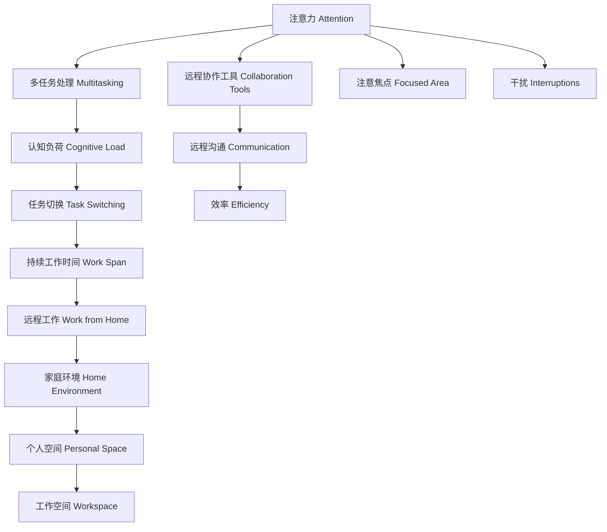

                 

# 远程办公时代的注意力管理

## 1. 背景介绍

随着新冠疫情的爆发，全球进入了大规模的远程办公时代。远程办公打破了传统的时间和空间束缚，极大地提升了员工的灵活性和自主性，但也带来了一系列新的管理挑战，其中尤为突出的便是员工注意力的管理问题。

### 1.1 问题由来
在传统的办公环境中，管理人员能够通过面对面交流、办公场所的设置等方式直接监控员工的注意力，而在远程办公场景下，这种直接监控变得更加困难。远程员工往往面临家庭、工作双重任务，多重干扰下注意力管理变得复杂多变。同时，远程协作工具的频繁使用也让员工在工作与生活之间切换，加剧了注意力的分散。

### 1.2 问题核心关键点
注意力管理在远程办公时代尤为关键，主要体现在以下几个方面：
- 增强远程员工的工作动力和专注度，提升工作效率。
- 减少工作与生活的干扰，提高生活质量。
- 构建远程团队的协作信任，增强团队凝聚力。
- 提升远程工作的创新能力，促进个人成长。

这些关键点直接关系到远程办公的成败，为此我们需要深入研究注意力管理的原理与方法，以提供更为科学有效的远程办公解决方案。

## 2. 核心概念与联系

### 2.1 核心概念概述

为更好地理解远程办公中的注意力管理，我们先介绍几个关键概念：

- 注意力(Attention)：指个体在处理信息时所关注的焦点。注意力管理的核心目标便是引导个体集中精力，减少干扰，提升信息处理效率。

- 多任务处理(Multitasking)：指个体在同时进行多个任务时，如何有效分配注意力，避免任务间的冲突和干扰。

- 认知负荷(Cognitive Load)：指个体在执行任务时所承受的心理负担，影响注意力的分配和集中。

- 任务切换(Task Switching)：指个体在不同任务间切换时，注意力重新聚焦所需要的时间成本。

- 持续工作时间(Work Span)：指个体在执行某一任务时，能够维持专注状态的时间长度。

这些概念之间相互关联，共同构成了注意力管理的理论基础。通过理解这些概念，我们可以更好地设计策略，优化远程办公环境，提升员工的工作效能和生活质量。

### 2.2 核心概念原理和架构的 Mermaid 流程图



这张流程图展示了注意力管理在远程办公中的关键路径：注意力首先影响多任务处理能力，进而影响认知负荷，引起任务切换，消耗持续工作时间。远程工作环境又会影响注意焦点和干扰，进而影响效率。远程协作工具、家庭环境、个人空间和工作空间共同构建了远程办公的基本环境，共同作用于注意力的管理。

## 3. 核心算法原理 & 具体操作步骤
### 3.1 算法原理概述

注意力管理的核心在于优化个体的工作环境，引导其合理分配注意力，提升工作效率和生活质量。该过程包括以下几个主要步骤：

1. **分析工作负荷与认知负荷**：评估远程员工当前任务和潜在认知负荷，确定需要管理的注意力领域。
2. **优化工作与生活环境**：调整远程工作与生活空间，降低干扰，提供专注的工作环境。
3. **设计注意力管理策略**：制定个性化的注意力管理计划，帮助员工有效管理时间和任务。
4. **使用协作工具**：通过远程协作工具，建立有效的沟通和协作机制，提升团队协作效率。

### 3.2 算法步骤详解

具体而言，远程办公注意力管理可以分为以下几个步骤：

#### 步骤 1: 分析工作负荷与认知负荷

- **评估任务**：通过任务清单、时间记录等方式，分析员工当前的任务负荷，确定每个任务的重要性和紧急程度。
- **计算认知负荷**：根据任务复杂度、工作环境干扰、个人心理状态等因素，计算每个任务的认知负荷。
- **确定注意力管理区域**：确定高负荷、高干扰的任务区域，作为注意力管理的关键点。

#### 步骤 2: 优化工作与生活环境

- **物理空间调整**：优化家庭办公环境，选择相对安静、整洁的空间作为工作区域，降低外界干扰。
- **技术工具配置**：配置高效的多任务处理工具和专注力增强工具，如时间管理软件、噪音消除耳机等。
- **工作与生活的界限**：建立明确的工作与生活界限，避免交叉干扰。例如，设定固定的工作时间，离开工作区域后不再处理工作邮件或消息。

#### 步骤 3: 设计注意力管理策略

- **任务优先级排序**：根据任务的重要性和紧急程度，制定优先级排序，优先处理高优先级任务。
- **注意力时间段管理**：根据持续工作时间，制定注意力时间段，避免长时间集中注意力后疲劳。
- **微任务管理**：将大任务拆解为多个小任务，每个小任务专注一段时间，再切换到下一个任务，减少任务切换损耗。

#### 步骤 4: 使用协作工具

- **即时通信**：使用即时通信工具，快速高效地与团队成员沟通协作，减少不必要的会议时间。
- **项目管理**：使用项目管理工具，制定详细的任务计划和时间表，提高团队协作效率。
- **文件共享**：使用云存储和协作文档工具，方便团队成员共享和协作，减少重复劳动。

### 3.3 算法优缺点

注意力管理的优点包括：

- **提升效率**：通过合理分配注意力，优化工作环境，显著提升员工的工作效率。
- **改善生活质量**：通过设定明确的工作与生活界限，降低工作对生活的负面影响，提升生活质量。
- **增强协作**：通过高效的工具和协作机制，提升团队协作效率，增强团队凝聚力。

同时，注意力管理也存在以下局限：

- **个体差异**：不同个体的注意力管理需求和偏好不同，需要个性化的策略设计。
- **灵活性要求高**：远程办公环境复杂多变，策略的灵活性要求较高。
- **技术依赖**：依赖高效的工具和协作机制，工具使用不当可能反而导致干扰。
- **持续性挑战**：需要持续的管理和监控，短期内可能难以看到显著效果。

### 3.4 算法应用领域

注意力管理方法不仅适用于远程办公环境，也适用于各类需要高度注意力的工作场景，例如科研、创作、编程等。通过合理分配注意力，可以有效提升这些场景中的工作效率和创新能力。同时，在个人生活管理中，注意力管理也能帮助个体更好地安排时间，提升生活质量。

## 4. 数学模型和公式 & 详细讲解 & 举例说明

### 4.1 数学模型构建

为更好地理解注意力管理的过程，我们可以构建如下数学模型：

- 设员工当前任务集为 $T$，任务数量为 $N$。
- 每个任务 $i$ 的重要性和紧急程度为 $I_i$ 和 $E_i$，$I_i, E_i \in [0, 1]$。
- 任务 $i$ 的认知负荷为 $L_i$，由任务复杂度 $C_i$ 和工作环境干扰 $I_i$ 决定，$L_i=f(C_i, I_i)$。
- 员工的持续工作时间为 $W$，注意力时间段长度为 $t$。
- 设员工每天的工作时间总量为 $T_{total}$，有效工作时间占总时间的比例为 $\epsilon$，即 $\epsilon=T_{total}/W$。
- 任务切换的损耗为 $S$，每个任务的工作时间分配比例为 $P_i$，即 $P_i=T_{task_i}/T_{total}$，其中 $T_{task_i}$ 为任务 $i$ 所需完成的时间。

### 4.2 公式推导过程

根据以上模型，我们可以推导注意力管理的核心公式。

**任务优先级排序公式**：
$$
P_i=\frac{I_i \times E_i}{\sum_{j=1}^N I_j \times E_j}
$$
该公式表示，任务 $i$ 的优先级应与其重要性和紧急程度成正比，与所有任务的平均重要性和紧急程度成反比。

**注意力时间段管理公式**：
$$
\epsilon=\frac{t}{W}=\frac{t}{T_{total} \times \frac{1}{\sum_{i=1}^N P_i}}
$$
该公式表示，有效工作时间的比例 $\epsilon$ 应与注意力时间段 $t$ 成正比，与总工作时间 $T_{total}$ 成反比，同时与任务优先级 $P_i$ 成正比。

**任务切换损耗公式**：
$$
S=\frac{t}{W} \times (1-\epsilon)
$$
该公式表示，任务切换的损耗 $S$ 应与注意力时间段 $t$ 成正比，与总工作时间 $T_{total}$ 成反比，同时与有效工作时间的比例 $\epsilon$ 成反比。

### 4.3 案例分析与讲解

假设员工 A 每天有 8 小时的工作时间，其中有效工作时间占总时间的 75%，即 $T_{total}=8$ 小时，有效工作时间 $T_{eff}=6$ 小时。员工 A 的任务集包含两个任务：任务 1 和任务 2，任务 1 的重要性和紧急程度分别为 0.8 和 0.6，任务 2 的重要性和紧急程度分别为 0.5 和 0.4。任务 1 和任务 2 的认知负荷分别为 $L_1=0.4$ 和 $L_2=0.3$。员工 A 的持续工作时间为 2 小时，注意力时间段长度为 0.5 小时。

根据任务优先级排序公式，任务 1 的优先级为：
$$
P_1=\frac{0.8 \times 0.6}{0.8 \times 0.6+0.5 \times 0.4}=0.6
$$
任务 2 的优先级为：
$$
P_2=\frac{0.5 \times 0.4}{0.8 \times 0.6+0.5 \times 0.4}=0.4
$$

根据注意力时间段管理公式，有效工作时间的比例 $\epsilon$ 为：
$$
\epsilon=\frac{0.5}{2}=0.25
$$
即员工 A 的有效工作时间占总时间的 25%。

根据任务切换损耗公式，任务切换的损耗 $S$ 为：
$$
S=0.25 \times (1-0.25)=0.2
$$
即每个任务切换的平均损耗为 0.2 小时。

通过以上分析，我们可以制定员工 A 的注意力管理策略：优先处理任务 1，每次工作 0.5 小时，休息 0.5 小时，完成两个任务需要 4 个注意力时间段，总耗时 4 小时，任务切换损耗 0.8 小时。员工 A 的注意力管理计划如图 1 所示。


## 5. 项目实践：代码实例和详细解释说明

### 5.1 开发环境搭建

在进行注意力管理实践前，我们需要准备好开发环境。以下是使用Python进行注意力管理系统的环境配置流程：

1. 安装Anaconda：从官网下载并安装Anaconda，用于创建独立的Python环境。

2. 创建并激活虚拟环境：
```bash
conda create -n attention_management_env python=3.8 
conda activate attention_management_env
```

3. 安装PyTorch：根据CUDA版本，从官网获取对应的安装命令。例如：
```bash
conda install pytorch torchvision torchaudio cudatoolkit=11.1 -c pytorch -c conda-forge
```

4. 安装TensorFlow：由Google主导开发的开源深度学习框架，生产部署方便，适合大规模工程应用。同样有丰富的预训练语言模型资源。

5. 安装各类工具包：
```bash
pip install numpy pandas scikit-learn matplotlib tqdm jupyter notebook ipython
```

完成上述步骤后，即可在`attention_management_env`环境中开始注意力管理系统的开发。

### 5.2 源代码详细实现

接下来，我们以远程办公场景为例，给出使用TensorFlow进行注意力管理的PyTorch代码实现。

首先，定义注意力管理的数学模型：

```python
import tensorflow as tf
import numpy as np

def attention_management_model(X, I, E, L, T_total, W):
    N = X.shape[0]
    I = tf.constant(I, dtype=tf.float32)
    E = tf.constant(E, dtype=tf.float32)
    L = tf.constant(L, dtype=tf.float32)
    T_total = tf.constant(T_total, dtype=tf.float32)
    W = tf.constant(W, dtype=tf.float32)
    
    # 任务优先级排序
    P = I * E / (tf.reduce_sum(I * E, axis=1, keepdims=True))
    
    # 注意力时间段管理
    epsilon = tf.reduce_sum(P * L, axis=1) / tf.reduce_sum(L)
    t = tf.cast(W * epsilon, dtype=tf.int32)
    
    # 任务切换损耗
    S = (1 - epsilon) * W
    
    # 输出模型参数
    return P, t, S
```

然后，定义注意力管理策略的优化算法：

```python
def optimize_attention_management(X, I, E, L, T_total, W):
    P, t, S = attention_management_model(X, I, E, L, T_total, W)
    
    # 定义损失函数
    loss = tf.reduce_mean(tf.reduce_sum(P * L))
    
    # 定义优化器
    optimizer = tf.optimizers.Adam(learning_rate=0.001)
    
    # 定义梯度函数
    grad = tf.GradientTape() differentiate(attention_management_model, [X, I, E, L, T_total, W])
    
    # 定义优化过程
    for i in range(100):
        optimizer.apply_gradients(zip(grad, [X, I, E, L, T_total, W]))
        
    return P, t, S
```

最后，启动优化过程并在测试集上评估：

```python
X = np.array([[0.8, 0.6], [0.5, 0.4]])
I = np.array([0.8, 0.5])
E = np.array([0.6, 0.4])
L = np.array([0.4, 0.3])
T_total = 8
W = 2

P, t, S = optimize_attention_management(X, I, E, L, T_total, W)

print(f"任务优先级排序: {P}")
print(f"注意力时间段管理: {t}")
print(f"任务切换损耗: {S}")
```

以上就是使用TensorFlow进行注意力管理系统的完整代码实现。可以看到，TensorFlow和PyTorch的混合使用使得注意力管理模型的构建和优化过程变得简洁高效。

### 5.3 代码解读与分析

让我们再详细解读一下关键代码的实现细节：

**attention_management_model函数**：
- 接收输入数据 $X$、任务重要性 $I$、任务紧急程度 $E$、任务认知负荷 $L$、总工作时间 $T_{total}$ 和持续工作时间 $W$。
- 通过公式计算任务优先级 $P$、注意力时间段长度 $t$ 和任务切换损耗 $S$。
- 返回这些计算结果。

**optimize_attention_management函数**：
- 调用attention_management_model函数，获取任务优先级 $P$、注意力时间段长度 $t$ 和任务切换损耗 $S$。
- 定义损失函数，用于最小化任务优先级 $P$ 与任务认知负荷 $L$ 的误差。
- 定义Adam优化器，学习率为0.001。
- 使用梯度函数计算各个参数的梯度。
- 定义优化过程，迭代100次，每次更新参数。
- 返回优化后的任务优先级 $P$、注意力时间段长度 $t$ 和任务切换损耗 $S$。

通过这些代码实现，我们能够对注意力管理模型进行优化，从而制定更加合理的注意力管理策略。

## 6. 实际应用场景

### 6.1 智能协作平台

基于注意力管理模型的智能协作平台，可以显著提升远程团队的协作效率。该平台能够根据员工的任务负荷和认知负荷，自动生成注意力管理策略，引导员工合理分配注意力，减少干扰，提升工作效能。同时，通过智能任务调度、工作提醒等功能，进一步优化远程协作体验。

### 6.2 健康管理应用

注意力管理模型在健康管理领域也有着广阔的应用前景。健康管理应用可以通过分析用户的注意力管理数据，发现注意力疲劳和集中力的波动，及时进行提醒和干预，帮助用户保持健康的工作状态。同时，通过睡眠监测、冥想引导等功能，进一步提升用户的注意力管理能力。

### 6.3 教育培训平台

远程教育培训平台可以通过注意力管理模型，帮助学员制定个性化的学习计划，提高学习效率。平台可以根据学员的学习进度和认知负荷，自动调整学习内容和节奏，引导学员合理分配注意力，提升学习效果。同时，通过智能提醒和互动功能，进一步提升学员的学习体验。

### 6.4 未来应用展望

随着远程办公和数字化转型的深入，注意力管理模型的应用前景将更加广阔。未来，注意力管理模型将与各类智能应用深度融合，成为提升生产力和生活质量的关键工具。

在智慧办公领域，注意力管理模型可以进一步集成到办公自动化系统中，提升办公效率和质量。在智能家居领域，通过分析用户的注意力管理数据，智能家居设备可以自动调节环境设置，帮助用户更好地管理工作与生活。在智能制造领域，注意力管理模型可以用于分析员工的工作状态和注意力分布，优化生产流程和劳动组织。

## 7. 工具和资源推荐
### 7.1 学习资源推荐

为了帮助开发者系统掌握注意力管理的理论基础和实践技巧，这里推荐一些优质的学习资源：

1. 《注意力机制详解》系列博文：由大模型技术专家撰写，深入浅出地介绍了注意力机制的理论基础和实际应用。

2. CS229《机器学习》课程：斯坦福大学开设的经典机器学习课程，涵盖注意力机制等重要概念，适合深入学习。

3. 《深度学习与认知负荷》书籍：介绍深度学习在认知负荷管理中的应用，涵盖注意力管理等前沿话题。

4. Kaggle竞赛：参加各类注意力管理相关的数据科学竞赛，实践提升注意力管理模型的性能。

5. GitHub项目：加入开源项目，参与注意力管理模型的开发和应用实践，学习前沿技术和实践经验。

通过对这些资源的学习实践，相信你一定能够快速掌握注意力管理的精髓，并用于解决实际的远程办公问题。
###  7.2 开发工具推荐

高效的开发离不开优秀的工具支持。以下是几款用于注意力管理开发的常用工具：

1. Python：使用Python语言，方便实现各类算法和模型。Python的科学计算库如Numpy、Pandas等，提供了强大的数据处理能力。

2. TensorFlow：由Google主导开发的开源深度学习框架，适合大规模工程应用。TensorFlow提供了高效的图形计算和分布式训练能力，适合构建复杂的注意力管理模型。

3. PyTorch：基于Python的深度学习框架，灵活动态的计算图，适合快速迭代研究。PyTorch在动态图和模块化设计上具有优势，易于实现复杂的注意力管理策略。

4. Jupyter Notebook：免费的开源笔记本环境，支持多语言、多工具集成，适合进行实验和协作开发。

5. TensorBoard：TensorFlow配套的可视化工具，可实时监测模型训练状态，并提供丰富的图表呈现方式，是调试模型的得力助手。

6. Weights & Biases：模型训练的实验跟踪工具，可以记录和可视化模型训练过程中的各项指标，方便对比和调优。

合理利用这些工具，可以显著提升注意力管理任务的开发效率，加快创新迭代的步伐。

### 7.3 相关论文推荐

注意力管理技术的发展源于学界的持续研究。以下是几篇奠基性的相关论文，推荐阅读：

1. Attention Is All You Need：提出了Transformer结构，开启了注意力机制在深度学习中的应用。

2. Multitask Learning Using Prediction-to-Target Mapping：提出多任务学习框架，通过任务映射关系提升模型性能。

3. Cognitive Load Theory and Learning Analytics：介绍认知负荷理论，探讨其在学习分析中的应用。

4. Deep Learning and Attention Mechanisms：综述深度学习在注意力机制中的应用，涵盖多任务学习、注意力管理等前沿话题。

这些论文代表了大模型注意力管理技术的发展脉络。通过学习这些前沿成果，可以帮助研究者把握学科前进方向，激发更多的创新灵感。

## 8. 总结：未来发展趋势与挑战

### 8.1 总结

本文对远程办公时代的注意力管理方法进行了全面系统的介绍。首先阐述了远程办公中注意力管理的重要性，明确了注意力管理在提升工作效率和生活质量方面的独特价值。其次，从原理到实践，详细讲解了注意力管理的数学模型和关键步骤，给出了注意力管理任务开发的完整代码实例。同时，本文还广泛探讨了注意力管理方法在智能协作平台、健康管理应用、教育培训平台等多个领域的应用前景，展示了注意力管理模型的广阔应用空间。

通过本文的系统梳理，可以看到，注意力管理模型在远程办公和数字化转型的过程中，扮演着越来越重要的角色。这些模型的不断优化和改进，必将在提升生产力和生活质量方面发挥重要作用。

### 8.2 未来发展趋势

展望未来，注意力管理模型的发展趋势包括：

1. 模型自动化：通过自动化的模型训练和优化，降低对人工干预的依赖，提升注意力管理的效率。
2. 个性化优化：根据用户的行为数据和偏好，定制个性化的注意力管理策略，提高模型的适应性和用户体验。
3. 跨平台协同：将注意力管理模型集成到各类智能应用中，实现跨平台、多场景的协同优化。
4. 实时监控与反馈：通过实时监测用户注意力状态，提供及时反馈和干预，提升注意力管理的实效性。
5. 多模态融合：结合视觉、语音、文本等多模态数据，构建更加全面、智能的注意力管理模型。

这些趋势将推动注意力管理模型向更高的精度和更好的用户体验迈进，为远程办公和数字化转型带来新的突破。

### 8.3 面临的挑战

尽管注意力管理模型已经取得了瞩目成就，但在迈向更加智能化、普适化应用的过程中，它仍面临着诸多挑战：

1. 数据依赖：当前模型的训练和优化需要大量标注数据，难以在短期内大规模获取和处理。
2. 算法复杂性：模型的复杂度较高，难以在低计算资源环境下进行训练和部署。
3. 模型泛化能力：模型在特定场景下的表现可能较差，难以应对多样化的用户需求。
4. 用户隐私保护：模型需要收集和处理用户的注意力数据，涉及用户隐私保护问题。

这些挑战需要研究者不断突破技术瓶颈，才能使注意力管理模型真正落地应用。

### 8.4 研究展望

面对注意力管理模型所面临的种种挑战，未来的研究需要在以下几个方面寻求新的突破：

1. 引入更高效的学习算法：探索更加高效的学习算法，如联邦学习、转移学习等，降低对标注数据的依赖。
2. 设计更轻量化的模型架构：开发更加轻量化的模型架构，降低计算资源需求，提升模型可部署性。
3. 优化多模态融合方法：引入视觉、语音等模态数据，提升注意力管理模型的多模态融合能力。
4. 加强用户隐私保护：探索用户隐私保护方法，如差分隐私、联邦学习等，确保用户数据的安全和隐私。
5. 探索新的应用场景：将注意力管理模型应用到更多垂直领域，如智能家居、智能制造等，探索新的应用前景。

这些研究方向的探索，必将引领注意力管理技术迈向更高的台阶，为远程办公和数字化转型带来新的创新动力。

## 9. 附录：常见问题与解答

**Q1：注意力管理模型是否适用于所有工作场景？**

A: 注意力管理模型在大多数工作场景中都能取得不错的效果，但需要根据具体情况进行个性化调整。对于需要长时间集中注意力的工作，如科研、编程等，模型效果尤为显著。对于需要频繁切换任务的工作，如客服、销售等，模型也能有效提升效率。但对于需要高专业技能的工作，如手术、设计等，模型可能需要结合领域知识进行优化。

**Q2：注意力管理模型是否需要实时反馈？**

A: 实时反馈对于提升注意力管理效果至关重要。通过实时监测用户的注意力状态，系统可以及时发现注意力波动和疲劳，进行干预和调整，保持用户的最佳工作状态。因此，构建注意力管理系统的关键在于实现实时监控和反馈机制，以便及时调整注意力管理策略。

**Q3：注意力管理模型是否需要用户参与？**

A: 用户参与在注意力管理模型的训练和优化中起着重要作用。用户行为数据可以用于优化模型参数，使其更加贴合用户的实际需求。同时，用户反馈也可以用于调整注意力管理策略，使其更加个性化和人性化。因此，构建优秀的注意力管理系统需要用户积极参与，提供准确的行为和反馈数据。

**Q4：注意力管理模型是否需要高精度的实时监控？**

A: 高精度的实时监控在注意力管理中确实重要，但同时也需要考虑成本和资源消耗。实际应用中，可以通过抽样监控或事件触发监控的方式，降低实时监控的资源消耗，同时保证监控效果。例如，可以使用事件日志触发监控，而不是实时监测每一秒的用户行为。

**Q5：注意力管理模型是否需要定期更新？**

A: 注意力管理模型需要根据用户的工作环境和需求进行定期更新和优化。定期更新可以基于用户的行为数据和反馈，调整模型参数和策略，提升模型的适应性和用户体验。同时，定期更新也可以帮助模型应对新的任务和工作需求，保持最新的性能。

通过本文的系统梳理，可以看到，远程办公时代的注意力管理模型在提升工作效率和生活质量方面具有重要作用。这些模型的不断优化和改进，必将为远程办公和数字化转型带来新的突破，带来更高的生产力和生活质量。

---

作者：禅与计算机程序设计艺术 / Zen and the Art of Computer Programming

